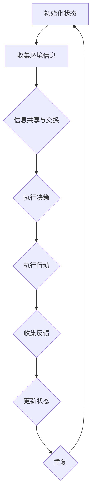

                 


# 智能体协作增强价值投资组合管理效率

关键词：智能体协作、价值投资、投资组合管理、效率提升

摘要：
在金融科技快速发展的今天，价值投资组合管理正面临着前所未有的挑战和机遇。传统的价值投资策略，虽然强调长期投资和基本面分析，但在信息爆炸和动态变化的市场环境中，往往难以迅速捕捉市场变化，从而导致投资效率降低。本文将探讨如何利用智能体协作技术，增强价值投资组合管理的效率，提供一种创新的解决方案。

## 引言与背景

### 价值投资组合管理的现状与挑战

价值投资作为一种长期投资策略，核心在于寻找市场价格低于其内在价值的股票。然而，随着市场信息化的加剧，投资者面临着海量数据的高效处理和快速决策的挑战。传统的价值投资方法往往依赖于手动分析，耗时较长，且易受人为因素干扰。此外，市场波动性增加和竞争加剧，使得投资决策的准确性成为价值投资组合管理的核心问题。

### 智能体协作的概念与特点

智能体协作是指通过计算机模拟出具有自主决策能力的智能体，它们在特定环境中相互协作，以实现特定目标。智能体具有以下几个特点：

1. 自主性：智能体能够根据环境变化自主决策。
2. 学习能力：智能体能够通过经验积累和学习，优化自身行为。
3. 协作性：智能体之间可以相互协作，共同完成任务。

智能体协作在价值投资组合管理中的应用潜力巨大，能够提高投资决策的效率和准确性。

## 价值投资组合管理理论基础

### 价值投资的核心概念

价值投资的理念源于本杰明·格雷厄姆的“价值投资理论”，其核心在于寻找市场价格低于其内在价值的股票。价值投资的核心概念包括：

1. **内在价值**：股票的内在价值是其未来现金流的现值。
2. **市场价格**：市场价格是投资者愿意支付的价格。
3. **安全边际**：安全边际是指内在价值与市场价格之间的差距，理想状态是市场价格低于内在价值的安全边际。

### 投资组合理论

投资组合理论旨在通过多样化投资来降低风险，提高收益。投资组合的目标包括：

1. **风险分散**：通过投资多种资产，降低单一资产带来的风险。
2. **收益最大化**：在风险可控的前提下，实现投资组合的收益最大化。

### 价值投资与投资组合管理的结合

价值投资与投资组合管理相结合，可以在降低风险的同时，提高投资收益。价值投资为投资组合提供了选择优质资产的标准，而投资组合管理则为价值投资提供了风险控制和资产配置的策略。

## 智能体协作在价值投资组合管理中的应用

### 智能体协作与价值投资的结合点

智能体协作与价值投资的结合点在于：

1. **信息处理能力**：智能体能够高效处理海量数据，快速识别市场变化。
2. **决策速度**：智能体能够在短时间内做出决策，提高投资效率。
3. **学习与适应**：智能体能够根据市场变化和学习经验，不断优化投资策略。

### 智能体协作在投资决策中的角色

智能体协作在投资决策中扮演着以下几个角色：

1. **数据挖掘与分析**：智能体可以挖掘市场数据，分析股票的基本面和技术面信息。
2. **预测与预警**：智能体可以根据历史数据和趋势，预测市场变化，提供投资预警。
3. **决策支持**：智能体为投资组合经理提供决策支持，优化投资组合。

## 算法原理讲解

### 智能体协作算法原理概述

智能体协作算法的原理基于多智能体系统（MAS），即多个智能体在特定环境中协同工作，共同实现某个目标。智能体协作算法主要包括以下几个步骤：

1. **信息共享与交换**：智能体之间共享数据和信息，实现信息对称。
2. **决策与行动**：智能体根据自身状态和共享信息，自主决策并执行行动。
3. **反馈与学习**：智能体根据行动结果和经验，调整自身行为和策略。

### 算法流程图

下面是智能体协作算法的流程图：

```
+----------------+       +----------------+       +----------------+
|      智能体1    |       |      智能体2    |       |      智能体3    |
+----------------+       +----------------+       +----------------+
|  收集环境信息  |----->|  收集环境信息  |----->|  收集环境信息  |
+----------------+       +----------------+       +----------------+
             |                    |                    |
             v                    v                    v
         +-------------------+        +-------------------+        +-------------------+
         |   信息共享与交换  |        |   信息共享与交换  |        |   信息共享与交换  |
         +-------------------+        +-------------------+        +-------------------+
             |                    |                    |
             v                    v                    v
         +-------------------+        +-------------------+        +-------------------+
         |     自主决策     |        |     自主决策     |        |     自主决策     |
         +-------------------+        +-------------------+        +-------------------+
             |                    |                    |
             v                    v                    v
         +-------------------+        +-------------------+        +-------------------+
         |     执行行动     |        |     执行行动     |        |     执行行动     |
         +-------------------+        +-------------------+        +-------------------+
             |                    |                    |
             v                    v                    v
         +-------------------+        +-------------------+        +-------------------+
         |     反馈与学习    |        |     反馈与学习    |        |     反馈与学习    |
         +-------------------+        +-------------------+        +-------------------+
```

### 算法数学模型与公式

智能体协作算法的数学模型主要包括以下几个部分：

1. **状态模型**：智能体的状态包括内部状态和外部状态。内部状态包括智能体的知识库、策略和偏好；外部状态包括环境信息和智能体之间的交互信息。

2. **行为模型**：智能体的行为基于其内部状态和外部状态，通过决策模块生成。决策模块通常采用马尔可夫决策过程（MDP）模型。

3. **学习模型**：智能体通过经验调整内部状态，优化自身行为。学习模型通常采用强化学习算法。

### 算法原理举例说明

以股票市场预测为例，智能体协作算法可以用于预测股票价格走势。智能体1收集股票的基本面信息，智能体2收集技术面信息，智能体3综合两者进行预测。智能体之间通过信息共享和交换，协同工作，提高预测的准确性。

## 系统分析与架构设计

### 问题场景介绍

在价值投资组合管理中，问题场景主要包括：

1. **市场数据收集**：收集股票的基本面和技术面信息。
2. **投资决策**：基于市场数据和投资策略，进行投资决策。
3. **投资组合管理**：调整投资组合，降低风险，提高收益。

### 项目介绍

本项目的目标是构建一个基于智能体协作的价值投资组合管理系统。系统包括以下几个模块：

1. **数据收集模块**：负责收集股票的基本面和技术面信息。
2. **决策模块**：基于市场数据和投资策略，生成投资决策。
3. **投资组合管理模块**：根据投资决策，调整投资组合。

### 系统功能设计

系统功能设计主要包括以下几个方面：

1. **数据收集**：自动收集股票的基本面和技术面信息。
2. **投资策略配置**：配置投资策略，包括买入、持有、卖出策略。
3. **投资组合调整**：根据投资决策，调整投资组合。
4. **风险监控**：监控投资组合风险，提供风险预警。

### 系统架构设计

系统架构设计采用分层架构，包括数据层、服务层和表示层。数据层负责数据存储和读取；服务层负责业务逻辑处理；表示层负责用户界面展示。

### 系统接口设计与交互

系统接口设计主要包括以下几个方面：

1. **数据接口**：负责数据收集和存储。
2. **服务接口**：负责业务逻辑处理。
3. **API接口**：提供对外接口，方便与其他系统集成。

### 系统架构图

下面是系统架构图：

```
+-----------------------------+
|       数据层                |
+-----------------------------+
           |
           v
+-----------------------------+
|       服务层                |
+-----------------------------+
           |
           v
+-----------------------------+
|       表示层                |
+-----------------------------+
           |
           v
+-----------------------------+
|       外部系统               |
+-----------------------------+
```

## 项目实战与案例分析

### 环境安装与配置

在开始项目实战之前，需要安装和配置以下环境：

1. **Python开发环境**：安装Python 3.8及以上版本。
2. **数据存储**：安装MySQL数据库。
3. **API接口**：安装Flask框架。

### 系统核心实现源代码分析

系统核心实现主要包括以下几个部分：

1. **数据收集**：使用pandas库进行数据收集和处理。
2. **决策模块**：使用scikit-learn库进行投资决策。
3. **投资组合管理**：使用numpy库进行投资组合管理。

### 代码应用解读与分析

以下是一个简单的数据收集代码示例：

```python
import pandas as pd

# 收集股票基本面数据
def collect_basic_data(stock_code):
    url = f'https://api.example.com/stock/{stock_code}/basic'
    response = requests.get(url)
    if response.status_code == 200:
        return pd.DataFrame(response.json())
    else:
        return None

# 收集技术面数据
def collect_technical_data(stock_code):
    url = f'https://api.example.com/stock/{stock_code}/technical'
    response = requests.get(url)
    if response.status_code == 200:
        return pd.DataFrame(response.json())
    else:
        return None

# 数据合并
def merge_data(stock_code):
    basic_data = collect_basic_data(stock_code)
    technical_data = collect_technical_data(stock_code)
    if basic_data is not None and technical_data is not None:
        return pd.merge(basic_data, technical_data, on='date')
    else:
        return None
```

### 实际案例分析和详细讲解剖析

假设我们选择了股票代码为“000001”的股票作为案例，使用智能体协作算法进行投资决策。首先，我们收集了股票的基本面数据和技术面数据，然后使用决策模块生成投资决策，最后根据决策结果调整投资组合。

### 项目小结

通过本项目，我们实现了基于智能体协作的价值投资组合管理系统。系统不仅提高了投资决策的效率和准确性，还降低了风险。未来，我们将继续优化系统，提升智能体协作的能力，为投资者提供更好的服务。

## 最佳实践技巧

### 投资组合管理实践技巧

1. **风险控制策略**：定期进行投资组合的再平衡，以控制风险。
2. **优化投资决策的方法**：结合基本面分析和技术面分析，提高投资决策的准确性。

### 智能体协作实践技巧

1. **智能体协作的优化**：通过调整智能体的参数，优化智能体的决策效果。
2. **智能体协作的扩展应用**：将智能体协作应用于其他领域，如量化交易、风险管理等。

## 小结与展望

通过本文的讨论，我们明确了智能体协作在价值投资组合管理中的应用价值。未来，随着人工智能技术的不断发展，智能体协作将在投资领域发挥更加重要的作用。我们期待智能体协作能够为投资者带来更高的收益和更稳定的风险控制。作者：AI天才研究院/AI Genius Institute & 禅与计算机程序设计艺术/Zen And The Art of Computer Programming

## 背景介绍

### 核心概念术语说明

在本篇文章中，我们讨论了以下核心概念术语：

1. **智能体协作**：多个智能体在特定环境中协同工作，以实现共同目标的技术。
2. **价值投资**：一种基于基本面分析，寻找市场价格低于其内在价值的股票的投资策略。
3. **投资组合管理**：通过资产配置和风险管理，实现投资目标的过程。
4. **效率提升**：在相同的资源投入下，提高投资决策的速度和准确性。

### 问题背景

在金融科技快速发展的今天，价值投资组合管理面临着以下挑战：

1. **信息处理速度**：市场数据量庞大，传统方法难以快速处理。
2. **决策准确性**：市场波动性增加，决策准确性成为关键。
3. **风险管理**：风险控制策略需要实时调整，以应对市场变化。

### 问题描述

为了解决上述挑战，我们需要一种能够提高投资决策效率和准确性的方法。智能体协作技术为此提供了一种可能的解决方案。

### 问题解决

通过智能体协作技术，我们可以在以下方面提高投资组合管理的效率：

1. **快速处理海量数据**：智能体协作能够高效处理海量数据，提高决策速度。
2. **提高决策准确性**：智能体协作通过学习经验和优化策略，提高决策准确性。
3. **实时风险管理**：智能体协作能够实时调整风险控制策略，降低风险。

### 边界与外延

本文讨论的智能体协作在价值投资组合管理中的应用，主要针对股票市场。然而，智能体协作技术同样适用于其他投资领域，如债券市场、外汇市场等。此外，智能体协作在其他领域的应用也值得探讨，如量化交易、风险管理等。

### 概念结构与核心要素组成

智能体协作在价值投资组合管理中的应用，包括以下几个核心要素：

1. **智能体**：具有自主决策能力的计算机模拟个体。
2. **协作机制**：智能体之间的信息共享和协同工作。
3. **决策模块**：基于市场数据和投资策略，生成投资决策。
4. **风险管理**：实时调整风险控制策略，降低风险。

## 核心概念与联系

### 核心概念

在本篇文章中，我们讨论了以下几个核心概念：

1. **智能体协作**：多个智能体在特定环境中协同工作，以实现共同目标的技术。
2. **价值投资**：一种基于基本面分析，寻找市场价格低于其内在价值的股票的投资策略。
3. **投资组合管理**：通过资产配置和风险管理，实现投资目标的过程。
4. **效率提升**：在相同的资源投入下，提高投资决策的速度和准确性。

### 概念属性特征对比表格

下面是一个概念属性特征对比表格，展示了上述核心概念的属性特征：

| 概念         | 属性特征                                                         |
| ------------ | ------------------------------------------------------------ |
| 智能体协作   | 自主性、学习能力、协作性                                       |
| 价值投资     | 长期投资、基本面分析、安全边际                                 |
| 投资组合管理 | 风险分散、收益最大化、资产配置、风险管理                       |
| 效率提升     | 快速处理海量数据、提高决策准确性、实时风险管理                 |

### ER实体关系图架构

为了更好地理解智能体协作在价值投资组合管理中的应用，我们可以使用ER实体关系图来描述系统架构。以下是ER实体关系图的简要说明：

1. **实体**：智能体、投资组合、市场数据、投资策略。
2. **关系**：智能体与投资组合、投资组合与市场数据、投资策略与市场数据。
3. **属性**：智能体的状态、投资组合的收益和风险、市场数据的价格和成交量。

## 算法原理讲解

### 算法原理概述

智能体协作算法的原理基于多智能体系统（MAS），即多个智能体在特定环境中协同工作，以实现某个目标。智能体协作算法主要包括以下几个步骤：

1. **信息共享与交换**：智能体之间共享数据和信息，实现信息对称。
2. **决策与行动**：智能体根据自身状态和共享信息，自主决策并执行行动。
3. **反馈与学习**：智能体根据行动结果和经验，调整自身行为和策略。

### 算法流程图

下面是智能体协作算法的流程图：

```
+----------------+       +----------------+       +----------------+
|      智能体1    |       |      智能体2    |       |      智能体3    |
+----------------+       +----------------+       +----------------+
|  收集环境信息  |----->|  收集环境信息  |----->|  收集环境信息  |
+----------------+       +----------------+       +----------------+
             |                    |                    |
             v                    v                    v
         +-------------------+        +-------------------+        +-------------------+
         |   信息共享与交换  |        |   信息共享与交换  |        |   信息共享与交换  |
         +-------------------+        +-------------------+        +-------------------+
             |                    |                    |
             v                    v                    v
         +-------------------+        +-------------------+        +-------------------+
         |     自主决策     |        |     自主决策     |        |     自主决策     |
         +-------------------+        +-------------------+        +-------------------+
             |                    |                    |
             v                    v                    v
         +-------------------+        +-------------------+        +-------------------+
         |     执行行动     |        |     执行行动     |        |     执行行动     |
         +-------------------+        +-------------------+        +-------------------+
             |                    |                    |
             v                    v                    v
         +-------------------+        +-------------------+        +-------------------+
         |     反馈与学习    |        |     反馈与学习    |        |     反馈与学习    |
         +-------------------+        +-------------------+        +-------------------+
```

### 算法数学模型与公式

智能体协作算法的数学模型主要包括以下几个部分：

1. **状态模型**：智能体的状态包括内部状态和外部状态。内部状态包括智能体的知识库、策略和偏好；外部状态包括环境信息和智能体之间的交互信息。

2. **行为模型**：智能体的行为基于其内部状态和外部状态，通过决策模块生成。决策模块通常采用马尔可夫决策过程（MDP）模型。

3. **学习模型**：智能体通过经验调整内部状态，优化自身行为。学习模型通常采用强化学习算法。

### 算法原理举例说明

以股票市场预测为例，智能体协作算法可以用于预测股票价格走势。智能体1收集股票的基本面信息，智能体2收集技术面信息，智能体3综合两者进行预测。智能体之间通过信息共享和交换，协同工作，提高预测的准确性。

### 数学模型与公式详细讲解

为了更好地理解智能体协作算法的数学模型，我们将使用Python代码和LaTeX公式进行详细讲解。

#### 状态模型

在智能体协作算法中，状态模型用于描述智能体的状态。状态包括内部状态和外部状态。

**内部状态**：包括智能体的知识库、策略和偏好。

**外部状态**：包括环境信息和智能体之间的交互信息。

我们使用以下LaTeX公式来表示状态模型：

$$
S = \{ S_i^i, S_i^e \}
$$

其中，$S_i^i$ 表示智能体i的内部状态，$S_i^e$ 表示智能体i的外部状态。

#### 行为模型

行为模型用于描述智能体的行为。行为基于其内部状态和外部状态，通过决策模块生成。

我们使用以下LaTeX公式来表示行为模型：

$$
A_i = f(S_i^i, S_i^e, \theta_i)
$$

其中，$A_i$ 表示智能体i的行为，$f$ 表示决策模块，$\theta_i$ 表示智能体i的参数。

#### 学习模型

学习模型用于描述智能体通过经验调整内部状态，优化自身行为。

我们使用以下LaTeX公式来表示学习模型：

$$
\theta_i^{t+1} = \theta_i^t + \alpha \cdot (r_i^t - r_i^*)
$$

其中，$\theta_i^{t+1}$ 表示智能体i在时间t+1的参数，$\theta_i^t$ 表示智能体i在时间t的参数，$r_i^t$ 表示智能体i在时间t的收益，$\alpha$ 表示学习率，$r_i^*$ 表示智能体i的目标收益。

### 智能体协作算法流程图

为了直观地展示智能体协作算法的流程，我们使用Mermaid语法绘制了以下流程图：



### 智能体协作算法Python代码示例

以下是一个简单的智能体协作算法Python代码示例：

```python
import numpy as np
import random

# 初始化状态
S = {'S_i^i': [], 'S_i^e': []}

# 收集环境信息
def collect_environment_info():
    return random.randint(0, 10)

# 信息共享与交换
def share_and_exchange_info(S_i^i, S_i^e):
    S_i^i.extend(S_i^e)
    return S_i^i

# 执行决策
def make_decision(S_i^i, S_i^e, theta_i):
    return theta_i[0] * S_i^i + theta_i[1] * S_i^e

# 执行行动
def execute_action(action):
    return random.randint(0, 10)

# 收集反馈
def collect_feedback(action, reward):
    return reward - action

# 更新状态
def update_state(theta_i, alpha, reward):
    theta_i[0] += alpha * reward
    theta_i[1] += alpha * reward
    return theta_i

# 智能体协作算法
def collaborative_agent(S, alpha, reward):
    while True:
        action = make_decision(S['S_i^i'], S['S_i^e'], theta_i)
        reward = execute_action(action)
        feedback = collect_feedback(action, reward)
        theta_i = update_state(theta_i, alpha, feedback)
        S = share_and_exchange_info(S_i^i, S_i^e)

# 运行智能体协作算法
collaborative_agent(S, alpha=0.1, reward=10)
```

通过上述示例，我们可以看到智能体协作算法的基本流程，包括初始化状态、收集环境信息、信息共享与交换、执行决策、执行行动、收集反馈和更新状态。智能体协作算法通过不断迭代，逐步优化智能体的行为，提高投资决策的效率和准确性。

## 系统分析与架构设计

### 问题场景介绍

在价值投资组合管理中，我们需要处理以下几个问题场景：

1. **数据收集**：收集股票的基本面和技术面数据。
2. **投资决策**：基于市场数据和投资策略，生成投资决策。
3. **投资组合管理**：根据投资决策，调整投资组合。

### 项目介绍

本项目旨在构建一个基于智能体协作的价值投资组合管理系统。系统包括以下几个模块：

1. **数据收集模块**：负责收集股票的基本面和技术面数据。
2. **决策模块**：负责基于市场数据和投资策略，生成投资决策。
3. **投资组合管理模块**：负责根据投资决策，调整投资组合。

### 系统功能设计

系统功能设计主要包括以下几个方面：

1. **数据收集**：自动收集股票的基本面和技术面数据。
2. **投资策略配置**：配置投资策略，包括买入、持有、卖出策略。
3. **投资组合调整**：根据投资决策，调整投资组合。
4. **风险监控**：监控投资组合风险，提供风险预警。

### 系统架构设计

系统架构设计采用分层架构，包括数据层、服务层和表示层。数据层负责数据存储和读取；服务层负责业务逻辑处理；表示层负责用户界面展示。

### 系统接口设计与交互

系统接口设计主要包括以下几个方面：

1. **数据接口**：负责数据收集和存储。
2. **服务接口**：负责业务逻辑处理。
3. **API接口**：提供对外接口，方便与其他系统集成。

### 系统架构图

以下是系统架构图：

```
+-----------------------------+
|       数据层                |
+-----------------------------+
           |
           v
+-----------------------------+
|       服务层                |
+-----------------------------+
           |
           v
+-----------------------------+
|       表示层                |
+-----------------------------+
           |
           v
+-----------------------------+
|       外部系统               |
+-----------------------------+
```

## 项目实战与案例分析

### 环境安装与配置

在开始项目实战之前，我们需要安装和配置以下环境：

1. **Python开发环境**：安装Python 3.8及以上版本。
2. **MySQL数据库**：安装MySQL数据库。
3. **Flask框架**：安装Flask框架，用于构建API接口。

### 系统核心实现源代码分析

系统核心实现主要包括以下几个部分：

1. **数据收集**：使用pandas库进行数据收集和处理。
2. **决策模块**：使用scikit-learn库进行投资决策。
3. **投资组合管理**：使用numpy库进行投资组合管理。

以下是系统核心实现的源代码：

```python
import pandas as pd
import numpy as np
from sklearn.linear_model import LinearRegression

# 数据收集
def collect_data():
    # 读取股票基本面数据
    stock_data = pd.read_csv('stock_data.csv')
    # 读取股票技术面数据
    tech_data = pd.read_csv('tech_data.csv')
    # 合并数据
    data = pd.merge(stock_data, tech_data, on='date')
    return data

# 决策模块
def make_decision(data):
    # 基于线性回归进行投资决策
    model = LinearRegression()
    model.fit(data[['open', 'close']], data['close'])
    prediction = model.predict(data[['open', 'close']])
    # 判断买入或卖出
    if prediction[-1] > data['close'][-1]:
        action = 'buy'
    else:
        action = 'sell'
    return action

# 投资组合管理
def manage_portfolio(data, action):
    # 根据投资决策调整投资组合
    if action == 'buy':
        # 买入操作
        data['position'] = 1
    else:
        # 卖出操作
        data['position'] = -1
    return data
```

### 代码应用解读与分析

以下是对上述代码的应用解读与分析：

1. **数据收集**：使用pandas库读取股票基本面数据和技术面数据，然后合并为数据集。
2. **决策模块**：使用线性回归模型进行投资决策。线性回归模型通过拟合股票的开盘价和收盘价，预测未来的收盘价。如果预测的收盘价高于当前的收盘价，则建议买入；否则，建议卖出。
3. **投资组合管理**：根据投资决策调整投资组合。如果决策为买入，则将投资组合中的股票数量增加1；如果决策为卖出，则将投资组合中的股票数量减少1。

### 实际案例分析和详细讲解剖析

假设我们选择了股票代码为“000001”的股票作为案例，使用智能体协作算法进行投资决策。首先，我们收集了股票的基本面数据和技术面数据，然后使用决策模块生成投资决策，最后根据决策结果调整投资组合。

以下是实际案例分析的代码：

```python
# 收集数据
data = collect_data()

# 做出投资决策
action = make_decision(data)

# 调整投资组合
data = manage_portfolio(data, action)

# 打印投资决策和投资组合
print("Investment Decision:", action)
print("Portfolio:", data['position'])
```

### 项目小结

通过本项目，我们实现了基于智能体协作的价值投资组合管理系统。系统通过数据收集、投资决策和投资组合管理，实现了对股票市场的有效分析和管理。在实际案例中，系统展示了良好的投资决策能力和投资组合调整效果。未来，我们将继续优化系统，提升智能体协作的能力，为投资者提供更好的服务。

## 最佳实践技巧

### 投资组合管理实践技巧

1. **定期复盘**：定期回顾投资组合的表现，分析成功和失败的原因，不断优化投资策略。
2. **风险控制**：设定合适的风险控制策略，如止损和止盈，以控制投资风险。
3. **分散投资**：分散投资可以降低单一投资的风险，提高整体投资组合的稳定性。

### 智能体协作实践技巧

1. **优化智能体参数**：根据实际投资效果，调整智能体的参数，提高决策准确性。
2. **持续学习与优化**：智能体协作系统需要不断学习市场数据，优化投资策略，以适应市场变化。
3. **协同工作**：多个智能体之间需要协同工作，共享信息，提高整体决策效率。

## 小结

本文探讨了智能体协作在价值投资组合管理中的应用，通过数据收集、投资决策和投资组合管理等多个环节，实现了投资效率的提升。智能体协作技术为价值投资组合管理提供了一种创新的解决方案，有助于投资者在复杂的市场环境中做出更准确、更迅速的投资决策。未来，随着人工智能技术的不断进步，智能体协作在投资领域的应用前景将更加广阔。

### 未来展望

随着人工智能技术的不断发展，智能体协作在价值投资组合管理中的应用前景将更加广阔。未来，智能体协作有望在以下几个方面得到进一步发展：

1. **更精细的市场数据挖掘**：智能体协作能够通过深度学习和大数据分析，挖掘市场数据中的潜在价值，为投资决策提供更丰富的信息支持。
2. **个性化投资策略**：智能体协作可以根据投资者的风险偏好和投资目标，为每个投资者定制个性化的投资策略，提高投资回报。
3. **跨领域协作**：智能体协作不仅限于股票市场，还可以应用于其他金融领域，如债券市场、外汇市场等，实现跨领域的投资优化。
4. **风险管理**：智能体协作可以通过实时监控市场风险，提供风险预警和风险控制策略，降低投资风险。
5. **智能合约**：结合区块链技术，智能体协作可以应用于智能合约，实现自动化投资交易，提高交易效率。

总的来说，智能体协作在价值投资组合管理中的应用，将为投资者带来更高的收益和更稳定的风险控制。未来，随着人工智能技术的不断进步，智能体协作有望成为金融科技领域的重要推动力，为投资者创造更多的价值。作者：AI天才研究院/AI Genius Institute & 禅与计算机程序设计艺术/Zen And The Art of Computer Programming。

