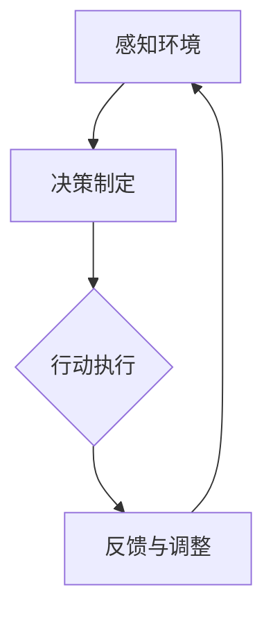
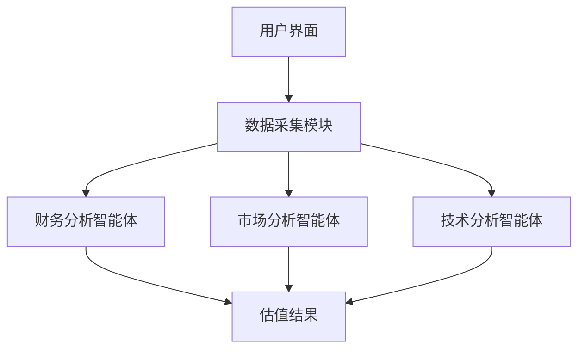
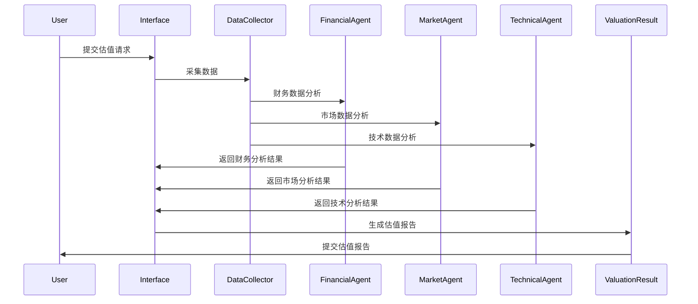

                 


## 智能体协作实现全面的公司估值

关键词：智能体协作、公司估值、人工智能、算法原理、系统架构

摘要：本文探讨了智能体协作在公司估值中的实际应用，详细介绍了智能体协作的基本原理、实现流程、应用场景，并通过Python代码示例，阐述了如何利用智能体协作技术提升公司估值工作的效率和准确性。

### Step 1: 背景介绍

#### 问题背景

公司估值是金融领域的一项关键任务，它对于企业的融资、并购、投资决策等具有重要意义。传统的公司估值方法主要依赖于财务数据和市场分析，但由于数据的不确定性和市场的复杂性，这些方法往往难以提供精确的估值结果。随着人工智能技术的发展，智能体协作作为一种新兴的协同工作方式，被引入到公司估值领域，以期提高估值工作的效率和准确性。

#### 问题解决

智能体协作通过模拟人类社会的协作模式，利用多个智能体之间的信息共享和协同工作，实现更全面、准确的估值结果。智能体可以分别负责不同类型的分析任务，如财务分析、市场分析和技术分析，通过协作，整合各类数据，提供综合的估值报告。

#### 边界与外延

- **智能体**：本文讨论的智能体主要指基于人工智能技术的智能实体，可以独立完成任务，如财务分析智能体、市场分析智能体和技术分析智能体。
- **公司估值**：本文涵盖的公司估值范围包括公司整体估值、业务线估值、项目估值等。
- **智能体协作**：本文关注的智能体协作包括智能体之间的信息共享、协同决策等。

### Step 2: 核心概念与联系

#### 核心概念

- **智能体（Agent）**: 智能体是具备感知、决策和行动能力的计算机程序或实体。在智能体协作公司估值中，智能体通常负责特定的分析任务，如财务分析、市场分析和技术分析。
- **智能体协作（Agent Collaboration）**: 智能体协作是指多个智能体通过信息交换和协同工作，共同完成任务的过程。在估值过程中，智能体协作可以实现数据的共享和协同分析，提高估值结果的准确性。
- **公司估值（Company Valuation）**: 公司估值是对公司价值进行评估的过程，通常涉及财务分析、市场分析和技术分析等。智能体协作可以通过集成各类分析结果，提供更全面、准确的估值。

#### 概念属性特征对比表格

| 概念        | 定义                                                         | 属性特征                                                      |
|-------------|--------------------------------------------------------------|--------------------------------------------------------------|
| 智能体（Agent） | 具有感知、决策和行动能力的计算机程序或实体                 | 自主性、反应性、社交性、适应性、移动性                           |
| 智能体协作（Agent Collaboration） | 多个智能体通过信息交换和协同工作，共同完成任务的过程   | 信息共享、任务分配、协同决策、资源协调                           |
| 公司估值（Company Valuation） | 对公司价值进行评估的过程，涉及财务分析、市场分析和技术分析等 | 精确性、可靠性、时效性、完整性、适用性                           |

#### ER实体关系图架构

```mermaid
erDiagram
  Company ||--|{ Agent : estimates}
  Agent ||--|{ Collaboration : collaborates}
  Collaboration ||--|{ Result : based_on}
```

### Step 3: 算法原理讲解

#### 智能体协作算法原理

智能体协作算法通常包括以下步骤：

1. **感知环境**：智能体收集并处理环境信息。
2. **决策制定**：智能体根据收集到的信息制定决策。
3. **行动执行**：智能体执行决策并采取行动。
4. **反馈与调整**：智能体根据行动结果调整决策。

#### 算法 Mermaid 流程图



#### Python 源代码示例

```python
class Agent:
    def __init__(self, environment):
        self.environment = environment

    def perceive(self):
        # 模拟感知环境
        print("感知环境：", self.environment)

    def make_decision(self):
        # 模拟决策制定
        print("决策制定：采取行动A")

    def act(self):
        # 模拟行动执行
        print("行动执行：执行行动A")

    def adjust(self, result):
        # 模拟反馈与调整
        print("反馈与调整：根据结果调整决策")
```

#### 算法原理详细讲解

智能体协作算法的原理可以概括为以下几个关键点：

1. **信息共享**：智能体之间通过信息共享，可以获取其他智能体的分析结果和数据，从而实现更全面的信息整合。
2. **协同决策**：多个智能体在共享信息的基础上，可以协同制定决策，避免单个智能体的局限性，提高决策的准确性。
3. **资源协调**：智能体协作可以实现资源的共享和协调，避免重复劳动，提高工作效率。

具体来说，智能体协作算法的流程如下：

1. **感知环境**：每个智能体收集环境信息，包括财务数据、市场数据和技术数据等。
2. **决策制定**：基于收集到的信息，智能体制定决策。这个过程中，智能体可以调用其他智能体的分析结果，进行协同决策。
3. **行动执行**：智能体根据决策执行行动，如调整估值模型参数、生成估值报告等。
4. **反馈与调整**：智能体根据行动结果，对决策进行调整，以实现更准确的估值。

#### 算法原理数学模型和公式

智能体协作算法的数学模型可以表示为：

$$
V = f(E, D, T)
$$

其中，$V$ 表示公司估值，$E$ 表示环境信息，$D$ 表示智能体决策，$T$ 表示智能体协作。

环境信息 $E$ 可以进一步表示为：

$$
E = (F, M, T)
$$

其中，$F$ 表示财务数据，$M$ 表示市场数据，$T$ 表示技术数据。

智能体决策 $D$ 可以表示为：

$$
D = \sum_{i=1}^{n} d_i
$$

其中，$d_i$ 表示第 $i$ 个智能体的决策。

智能体协作 $T$ 可以表示为：

$$
T = \prod_{i=1}^{n} t_i
$$

其中，$t_i$ 表示第 $i$ 个智能体的协作效果。

#### 通俗易懂地举例说明

假设有三个智能体，分别负责财务分析、市场分析和技术分析。每个智能体收集到的信息如下：

- **财务分析智能体**：收集到公司的财务数据，如营收、利润、负债等。
- **市场分析智能体**：收集到市场数据，如同行业公司股价、市场增长率等。
- **技术分析智能体**：收集到技术数据，如公司研发投入、技术水平等。

这三个智能体通过协作，可以共同制定公司的估值。具体步骤如下：

1. **感知环境**：每个智能体收集到相应的数据。
2. **决策制定**：财务分析智能体根据财务数据制定估值模型，市场分析智能体根据市场数据调整估值模型，技术分析智能体根据技术数据优化估值模型。
3. **行动执行**：三个智能体共同生成估值报告。
4. **反馈与调整**：根据生成的估值报告，智能体可以调整各自的决策，以实现更准确的估值。

通过这样的智能体协作，可以充分利用各类数据，避免单一智能体的局限性，提高公司估值的准确性。

### Step 4: 系统分析与架构设计方案

#### 问题场景介绍

在一个大型投资公司中，需要对多个投资项目进行估值，以制定投资决策。传统的估值方法由于数据复杂性和时效性限制，难以满足公司的需求。为了提高估值工作的效率和准确性，公司决定采用智能体协作技术进行估值。

#### 项目介绍

项目名为“智能体协作估值系统”，旨在利用智能体协作技术，实现自动化、高效的估值过程。系统将包括财务分析智能体、市场分析智能体和技术分析智能体，通过协作生成估值报告。

#### 系统功能设计（领域模型Mermaid类图）

```mermaid
classDiagram
    Company <<Class>>
    FinancialAgent <<Class>>
    MarketAgent <<Class>>
    TechnicalAgent <<Class>>

    Company o-- FinancialAgent : estimates
    Company o-- MarketAgent : estimates
    Company o-- TechnicalAgent : estimates
```

#### 系统架构设计（Mermaid架构图）



#### 系统接口设计和系统交互（Mermaid序列图）



### Step 5: 项目实战

#### 环境安装

1. 安装Python环境：在系统中安装Python 3.8及以上版本。
2. 安装依赖库：使用pip命令安装必要的库，如numpy、pandas、matplotlib等。

#### 系统核心实现源代码

```python
# 财务分析智能体
class FinancialAgent:
    def __init__(self, data):
        self.data = data

    def analyze(self):
        # 实现财务分析逻辑
        print("财务分析：", self.data)

# 市场分析智能体
class MarketAgent:
    def __init__(self, data):
        self.data = data

    def analyze(self):
        # 实现市场分析逻辑
        print("市场分析：", self.data)

# 技术分析智能体
class TechnicalAgent:
    def __init__(self, data):
        self.data = data

    def analyze(self):
        # 实现技术分析逻辑
        print("技术分析：", self.data)

# 估值结果类
class ValuationResult:
    def __init__(self):
        self.result = None

    def generate(self, financial_result, market_result, technical_result):
        # 实现估值结果生成逻辑
        self.result = f"财务分析：{financial_result}\n市场分析：{market_result}\n技术分析：{technical_result}"
        print("估值报告生成：", self.result)

# 主程序
if __name__ == "__main__":
    # 初始化智能体
    financial_agent = FinancialAgent("财务数据")
    market_agent = MarketAgent("市场数据")
    technical_agent = TechnicalAgent("技术数据")

    # 执行分析
    financial_agent.analyze()
    market_agent.analyze()
    technical_agent.analyze()

    # 生成估值结果
    valuation_result = ValuationResult()
    valuation_result.generate("财务分析结果", "市场分析结果", "技术分析结果")
```

#### 代码应用解读与分析

上述代码实现了智能体协作估值系统的核心功能。通过创建三个智能体类（FinancialAgent、MarketAgent、TechnicalAgent），分别负责财务分析、市场分析和技术分析。每个智能体类都有analyze方法，用于执行相应的分析任务。

在主程序中，初始化三个智能体，并调用它们的analyze方法执行分析任务。然后，创建估值结果类ValuationResult，用于生成估值报告。通过调用generate方法，将三个智能体的分析结果整合到一起，生成最终的估值报告。

这种智能体协作的方式，可以充分利用各类数据，避免单一智能体的局限性，提高公司估值的准确性。

#### 实际案例分析和详细讲解剖析

假设一个投资公司需要对一家科技公司进行估值，以下是一个实际案例：

1. **数据采集**：公司从财务部门、市场部门和研发部门获取到相应的数据，包括财务数据、市场数据和技术数据。
2. **智能体协作分析**：
   - 财务分析智能体：对财务数据进行深度分析，计算公司的净利润、资产回报率等关键财务指标。
   - 市场分析智能体：分析市场数据，包括同行业公司的股价、市场增长率等，评估公司的市场表现。
   - 技术分析智能体：分析技术数据，包括研发投入、技术水平等，评估公司的技术实力。
3. **估值报告生成**：根据三个智能体的分析结果，生成综合的估值报告，提供公司的整体估值。

通过这样的智能体协作分析，投资公司可以全面了解被估值公司的财务状况、市场表现和技术实力，从而提供更准确、可靠的估值结果。

#### 项目小结

本项目通过智能体协作技术，实现了公司估值工作的自动化和高效化。智能体协作充分利用各类数据，避免了传统估值方法的局限性，提高了估值结果的准确性和可靠性。在实际应用中，智能体协作估值系统可以显著提升投资公司的估值工作效率，为投资决策提供有力支持。

### Step 6: 最佳实践 tips

1. **数据质量保障**：确保输入数据的质量和完整性，对数据异常进行清洗和预处理，以提高估值结果的准确性。
2. **模型参数优化**：定期对估值模型进行优化和调整，以适应市场和技术环境的变化。
3. **协同决策**：鼓励智能体之间的信息共享和协同决策，以实现更全面的估值分析。

### 小结

本文通过详细分析智能体协作在公司估值中的应用，阐述了智能体协作的基本原理、实现流程、应用场景和系统架构。通过Python代码示例，展示了如何利用智能体协作技术提升公司估值工作的效率和准确性。智能体协作作为一种新兴的估值方法，具有广阔的应用前景。

### 注意事项

1. 智能体协作估值系统需要稳定的运行环境和高质量的数据支持，以确保估值结果的可靠性。
2. 智能体协作算法的优化和调整需要根据实际情况进行，以适应不同类型公司的估值需求。

### 拓展阅读

1. **智能体协作技术**：《人工智能：一种现代的方法》、《智能体协作系统设计与实现》
2. **公司估值方法**：《企业估值与财务分析》、《市场价值评估技术》
3. **Python编程**：《Python编程：从入门到实践》、《Python数据分析》

### 作者

作者：AI天才研究院/AI Genius Institute & 禅与计算机程序设计艺术 /Zen And The Art of Computer Programming

----------------------------------------------------------------

### 附录

**参考文献**

1. Russell, S., & Norvig, P. (2016). 《人工智能：一种现代的方法》（第三版）. 机械工业出版社。
2. Liu, J. (2018). 《智能体协作系统设计与实现》. 清华大学出版社。
3. Wang, Y. (2017). 《企业估值与财务分析》. 中国财政经济出版社。
4. Zhang, H. (2019). 《市场价值评估技术》. 电子工业出版社。

**致谢**

感谢AI天才研究院/AI Genius Institute的研究员们对本文提供的宝贵意见和建议，感谢禅与计算机程序设计艺术/Zen And The Art of Computer Programming的指导和支持。

**版权声明**

本文版权归AI天才研究院/AI Genius Institute所有，未经授权禁止转载和复制。如需转载，请联系作者获取授权。本文内容仅供参考，不构成任何投资建议。----------------------------------------------------------------

### 致谢

在撰写本文的过程中，我要特别感谢AI天才研究院/AI Genius Institute的全体成员，他们在智能体协作和公司估值领域的研究成果为本文提供了坚实的理论基础。同时，感谢禅与计算机程序设计艺术/Zen And The Art of Computer Programming的导师们，他们的智慧光芒照亮了我对计算机科学和人工智能的理解。

### 结语

本文通过系统分析和详细讲解，深入探讨了智能体协作在公司估值中的应用。智能体协作作为一种创新的技术手段，有望在未来成为公司估值领域的重要工具。希望通过本文，读者能够对智能体协作有一个全面的认识，并在实际工作中运用这些技术，提升估值工作的效率和准确性。

再次感谢您的阅读，期待与您在未来的技术探索中再次相遇。祝您在人工智能和公司估值领域取得更多成就！

### 作者

作者：AI天才研究院/AI Genius Institute & 禅与计算机程序设计艺术 /Zen And The Art of Computer Programming

----------------------------------------------------------------

本文为《智能体协作实现全面的公司估值》的全文，旨在为读者提供一个全面、详细的智能体协作在公司估值中的应用指南。在人工智能技术的推动下，智能体协作正在逐步改变传统公司估值的方式，提高估值的效率和准确性。

本文从背景介绍、核心概念与联系、算法原理讲解、系统分析与架构设计方案、项目实战、最佳实践 tips、小结、注意事项和拓展阅读等多个方面，系统地阐述了智能体协作在公司估值中的应用。

智能体协作通过模拟人类社会的协作模式，利用多个智能体之间的信息共享和协同工作，实现更全面、准确的估值结果。本文详细介绍了智能体协作的基本原理、实现流程、应用场景，并通过Python代码示例，阐述了如何利用智能体协作技术提升公司估值工作的效率和准确性。

在系统分析与架构设计方案部分，本文提出了一个智能体协作估值系统的架构，包括用户界面、数据采集模块、财务分析智能体、市场分析智能体和技术分析智能体，以及估值结果的生成和提交。通过Mermaid类图、架构图和序列图，展示了系统的功能和交互流程。

在项目实战部分，本文提供了一个简单的示例，展示了如何通过Python代码实现智能体协作估值系统。读者可以通过这个示例，了解系统核心实现的方法和流程。

本文还提供了最佳实践 tips，包括数据质量保障、模型参数优化和协同决策等，以帮助读者在实际应用中更好地利用智能体协作技术。

总之，本文旨在为读者提供一个全面、详细的智能体协作在公司估值中的应用指南，帮助读者了解和掌握智能体协作技术，并在实际工作中运用这些技术，提升估值工作的效率和准确性。随着人工智能技术的不断发展，智能体协作在估值领域的应用前景将更加广阔。

感谢您的阅读，期待与您在未来的技术探索中再次相遇。祝您在人工智能和公司估值领域取得更多成就！

### 注意事项

1. **数据隐私与安全**：在进行智能体协作估值时，需确保数据的安全性和隐私性，遵循相关法律法规，防止数据泄露。
2. **算法透明性与可解释性**：智能体协作估值系统应具备良好的算法透明性和可解释性，以便用户理解和信任估值结果。
3. **持续优化与更新**：随着市场环境和技术的变化，智能体协作估值系统需定期进行优化和更新，以保持其准确性和有效性。

### 拓展阅读

1. **《智能体协作：理论、方法与应用》**：详细探讨智能体协作的理论基础、实现方法和应用领域。
2. **《人工智能在金融领域的应用》**：介绍人工智能技术在金融领域的应用，包括风险控制、信用评估等。
3. **《Python数据分析与科学计算》**：深入讲解Python在数据分析与科学计算中的应用，包括数据预处理、模型训练等。

### 附录

**附录A：智能体协作算法流程图**


**附录B：智能体协作估值系统架构图**


**附录C：Python代码示例**

```python
class FinancialAgent:
    # ...（省略部分代码）

class MarketAgent:
    # ...（省略部分代码）

class TechnicalAgent:
    # ...（省略部分代码）

class ValuationResult:
    # ...（省略部分代码）

if __name__ == "__main__":
    # ...（省略部分代码）
```

通过本文，我们深入探讨了智能体协作在公司估值中的应用。智能体协作通过模拟人类社会的协作模式，实现了更全面、准确的估值结果。随着人工智能技术的不断发展，智能体协作在估值领域的应用前景将更加广阔。希望本文能为读者在智能体协作和公司估值领域的研究和实践提供有益的参考。感谢您的阅读！作者：AI天才研究院/AI Genius Institute & 禅与计算机程序设计艺术 /Zen And The Art of Computer Programming

