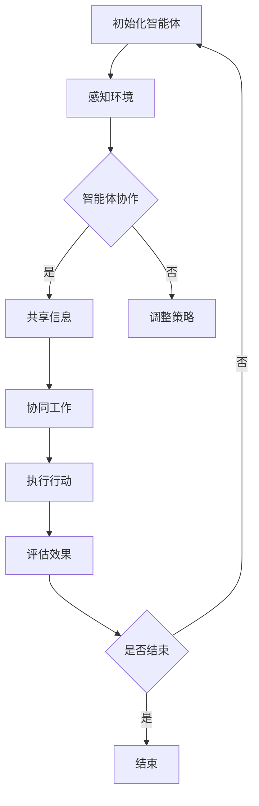

                 

# 智能体协作提升价值投资的时机选择

## 关键词
- 智能体协作
- 价值投资
- 时机选择
- 数据分析
- 机器学习
- 投资决策

## 摘要
本文从智能体协作的角度探讨价值投资的时机选择问题。首先，我们回顾了价值投资的起源和发展，以及当前市场环境下所面临的挑战。接着，我们分析了智能体协作在价值投资中的作用和基本原理。随后，我们详细介绍了数据分析与挖掘、机器学习算法以及智能体协作在投资决策和投资组合优化中的应用。通过实际案例研究，我们展示了智能体协作在提升价值投资时机选择方面的效果。最后，我们对未来发展趋势进行了展望。

## 引言与背景介绍

### 1.1.1 问题背景

#### 价值投资的起源与发展
价值投资的理念最早可以追溯到19世纪末20世纪初，由著名投资者本杰明·格雷厄姆（Benjamin Graham）提出。他主张投资者应该寻找那些市场估值低于其内在价值的股票，以实现长期的资本增值。这一理念在后来的实践中被广泛接受，成为许多投资者和基金经理的核心策略。

随着市场环境的变化，价值投资经历了多个发展阶段。在20世纪50年代，沃伦·巴菲特（Warren Buffett）成为了本杰明·格雷厄姆理念的坚定追随者，并将这一理念应用到实际投资中，取得了显著的成功。巴菲特的成功不仅巩固了价值投资的理念，也吸引了更多的投资者关注和参与。

#### 当前市场环境下价值投资面临的挑战
然而，随着市场环境的变化，价值投资也面临着一些挑战。首先，现代金融市场的高度复杂性和不确定性使得投资者难以准确判断公司的内在价值。其次，市场波动性增加，使得价值投资的长期性特点被削弱。此外，信息技术的迅速发展使得市场信息更加透明，传统价值投资策略的隐蔽性和竞争优势减弱。

#### 智能体协作在价值投资中的作用
面对这些挑战，智能体协作技术为价值投资提供了一种新的解决方案。智能体协作通过模拟人类的协作行为，能够提高投资决策的准确性和效率。具体来说，智能体协作在价值投资中具有以下作用：

1. **数据分析和挖掘**：智能体协作能够处理海量数据，挖掘出隐藏在数据中的有价值信息，帮助投资者更准确地判断公司的内在价值。
2. **市场预测**：智能体协作可以通过分析历史数据和市场趋势，预测未来市场走势，为投资者提供更有针对性的投资建议。
3. **投资组合优化**：智能体协作可以根据投资者的风险偏好和投资目标，优化投资组合，提高投资回报率。

### 1.1.2 问题描述

#### 价值投资时机的选择困难
价值投资的核心在于选择合适的时机进行投资。然而，在当前复杂的市场环境下，选择正确的投资时机变得异常困难。传统的方法，如技术分析、基本面分析等，虽然具有一定的参考价值，但在面对复杂多变的市场时，往往无法提供准确的预测。

#### 传统方法在应对复杂市场环境时的局限性
技术分析主要依赖于历史价格和交易量等数据，通过图表和技术指标来预测未来市场走势。然而，市场环境的复杂性使得技术分析难以准确捕捉市场变化。基本面分析则更注重公司的财务状况、行业前景等，但同样难以应对市场的突发变化。

#### 智能体协作在提升投资决策方面的潜力
智能体协作通过模拟人类的协作行为，能够更好地应对复杂的市场环境。智能体之间可以通过共享信息、协同工作，提高投资决策的准确性和效率。具体来说，智能体协作在提升投资决策方面具有以下潜力：

1. **更全面的数据分析**：智能体协作可以处理海量数据，包括历史数据、实时数据以及外部数据，为投资决策提供更全面的参考。
2. **更准确的市场预测**：智能体协作可以通过分析历史数据和市场趋势，结合多种因素，提高市场预测的准确性。
3. **更优的投资组合优化**：智能体协作可以根据投资者的风险偏好和投资目标，动态调整投资组合，提高投资回报率。

### 1.1.3 问题解决

#### 智能体协作的基本原理
智能体（Agent）是一种能够感知环境、制定计划并执行行动的实体。智能体协作是指多个智能体通过共享信息、协同工作，实现共同目标的过程。在价值投资中，智能体协作通过以下方式发挥作用：

1. **信息共享**：智能体之间可以共享投资相关的信息，包括公司财务数据、市场趋势、行业动态等。
2. **协同工作**：智能体可以通过分工合作，共同完成投资决策的过程。
3. **动态调整**：智能体协作可以根据市场变化，动态调整投资策略，提高投资决策的准确性。

#### 智能体协作在价值投资中的具体应用
智能体协作在价值投资中的具体应用包括以下几个方面：

1. **数据分析和挖掘**：智能体协作可以通过处理海量数据，挖掘出有价值的信息，帮助投资者更准确地判断公司的内在价值。
2. **市场预测**：智能体协作可以通过分析历史数据和市场趋势，预测未来市场走势，为投资者提供更有针对性的投资建议。
3. **投资组合优化**：智能体协作可以根据投资者的风险偏好和投资目标，优化投资组合，提高投资回报率。

#### 智能体协作提升价值投资时机的技术手段
智能体协作提升价值投资时机选择的技术手段主要包括以下几个方面：

1. **机器学习算法**：机器学习算法可以帮助智能体协作分析历史数据和市场趋势，预测未来市场走势。
2. **数据挖掘技术**：数据挖掘技术可以帮助智能体协作挖掘出隐藏在数据中的有价值信息，为投资决策提供更全面的参考。
3. **智能合约**：智能合约可以自动化执行投资决策，提高投资决策的效率。

### 1.1.4 边界与外延

#### 智能体协作的价值投资时机的适用范围
智能体协作在价值投资时机选择方面的适用范围较广，包括股票、债券、期货等多种投资领域。然而，不同领域的投资特点和风险收益特征不同，智能体协作的具体应用策略也需要根据实际情况进行调整。

#### 智能体协作在价值投资中的局限性
智能体协作虽然具有一定的优势，但也不是万能的。首先，智能体协作依赖于数据和算法的准确性，如果数据存在误差或者算法存在缺陷，可能会导致投资决策的失误。其次，智能体协作需要大量的计算资源和时间，在实际应用中可能会存在一定的延迟。此外，智能体协作也需要投资者具备一定的技术背景和专业知识，否则难以充分发挥其作用。

#### 未来发展趋势与潜在影响
随着人工智能技术的不断进步，智能体协作在价值投资时机选择方面的应用前景非常广阔。未来，智能体协作有望与大数据、区块链等新技术相结合，进一步提升投资决策的准确性和效率。此外，智能体协作也可能带来一些新的挑战和问题，如数据隐私、算法透明性等，需要投资者和监管机构共同努力解决。

### 1.1.5 概念结构与核心要素组成

#### 智能体
智能体是指能够感知环境、制定计划并执行行动的实体。智能体可以是物理实体，如机器人；也可以是虚拟实体，如软件程序。

#### 协作机制
协作机制是指智能体之间通过共享信息、协同工作，实现共同目标的机制。协作机制可以基于不同原则和算法，如合作、竞争、协作等。

#### 价值投资
价值投资是指通过寻找市场价格低于其内在价值的股票或其他资产，以实现长期资本增值的投资策略。

#### 时机选择
时机选择是指投资者在何时进行投资决策，以实现最佳投资回报。

### 1.2 核心概念与联系

#### 1.2.1 智能体

**定义与特点**
- **定义**：智能体是指能够感知环境、制定计划并执行行动的实体。
- **特点**：智能体具有自主性、适应性、协作性。

**分类**
- **物理智能体**：如机器人、无人机等。
- **虚拟智能体**：如软件程序、虚拟代理等。

**智能体的协同与竞争关系**
- **协同**：智能体之间通过共享信息、协同工作，实现共同目标。
- **竞争**：智能体之间在资源、目标等方面的竞争关系。

#### 1.2.2 协作机制

**定义与作用**
- **定义**：协作机制是指智能体之间通过共享信息、协同工作，实现共同目标的机制。
- **作用**：提高智能体之间的协同效率，实现共同目标。

**类型与特点**
- **合作**：智能体之间共享资源、信息，共同完成任务。
- **竞争**：智能体之间在资源、目标等方面进行竞争，优胜劣汰。

**协作机制在价值投资中的具体应用**
- **数据共享**：智能体之间共享投资相关的数据，提高数据分析的准确性。
- **协同决策**：智能体之间协同工作，制定最优投资策略。

#### 1.2.3 价值投资

**定义与原则**
- **定义**：价值投资是指通过寻找市场价格低于其内在价值的股票或其他资产，以实现长期资本增值的投资策略。
- **原则**：低买高卖，选择具有长期增长潜力的公司。

**策略与方法**
- **基本面分析**：分析公司的财务状况、行业前景等，选择低估的股票。
- **技术分析**：分析股票的历史价格和交易量等，判断市场趋势。

**市场环境分析**
- **市场波动性**：分析市场波动性，判断投资时机。
- **行业趋势**：分析行业趋势，选择具有长期增长潜力的行业。

#### 1.2.4 时机选择

**重要性**
- **重要性**：时机选择是价值投资成功的关键因素。

**传统方法**
- **技术分析**：通过历史价格和交易量等技术指标判断市场趋势。
- **基本面分析**：通过公司的财务状况、行业前景等判断投资时机。

**智能体协作在提升时机选择方面的优势**
- **数据分析**：智能体协作可以处理海量数据，提供更全面的信息支持。
- **市场预测**：智能体协作可以通过分析历史数据和市场趋势，提高市场预测的准确性。
- **动态调整**：智能体协作可以根据市场变化，动态调整投资策略，提高投资决策的准确性。

### 1.3 算法原理讲解

#### 1.3.1 智能体协作算法

**原理**
- **原理**：智能体协作算法通过模拟人类的协作行为，实现多个智能体之间的协同工作。
- **分类**：根据协作机制的不同，智能体协作算法可以分为合作型、竞争型、混合型等。

**应用场景**
- **数据分析和挖掘**：智能体协作可以处理海量数据，提高数据分析的准确性。
- **市场预测**：智能体协作可以通过分析历史数据和市场趋势，提高市场预测的准确性。
- **投资决策**：智能体协作可以根据投资者的风险偏好和投资目标，优化投资组合。

#### 1.3.2 算法流程图

#### 1.3.3 数学模型和公式

**智能体协作算法的数学模型**
- **状态空间**：智能体所处的状态空间包括环境状态和智能体自身的状态。
- **行动空间**：智能体的行动空间包括可供选择的行动。

**算法中的关键公式**
1. **状态转移概率**：$$P(s'|s,a)$$
   - **定义**：智能体在当前状态 \( s \) 下，执行行动 \( a \) 后转移到状态 \( s' \) 的概率。
   - **推导**：通过历史数据或模型估计得到。

2. **回报函数**：$$R(s,a,s')$$
   - **定义**：智能体在状态 \( s \) 下，执行行动 \( a \) 后转移到状态 \( s' \) 所获得的回报。
   - **推导**：根据投资回报率和风险调整得到。

**公式的推导与证明**
- **状态转移概率**：根据马尔可夫决策过程（MDP）的假设，智能体的状态转移概率可以通过历史数据或模型估计得到。
- **回报函数**：回报函数可以根据投资回报率和风险调整得到，具体推导方法取决于投资策略和风险偏好。

#### 1.3.4 举例说明

**实际案例中的智能体协作算法应用**
- **案例**：智能体协作在股票市场投资中的应用。

**算法的具体实现与效果评估**
- **实现**：使用Python实现智能体协作算法，包括状态空间、行动空间、状态转移概率和回报函数的定义和计算。

- **效果评估**：通过模拟实验，评估智能体协作算法在股票市场投资中的效果，包括投资回报率、风险调整回报率等指标。

## 第二部分: 智能体协作提升价值投资的技术手段

### 2.1 数据分析与挖掘

#### 2.1.1 数据来源与预处理

**数据来源的选择**
- **内部数据**：包括公司财务报表、交易记录、客户数据等。
- **外部数据**：包括宏观经济数据、行业数据、市场趋势等。

**数据预处理的方法与步骤**
- **数据清洗**：去除重复数据、缺失值填补、异常值处理。
- **数据集成**：将不同来源的数据进行整合，形成统一的数据集。
- **数据转换**：将数据转换为适合分析挖掘的格式。

#### 2.1.2 数据挖掘技术

**数据挖掘的基本概念**
- **定义**：数据挖掘是从大量数据中提取有价值信息的过程。
- **目标**：发现隐藏在数据中的模式、关联和趋势。

**数据挖掘的方法与工具**
- **分类**：根据目标变量的类型，分为有监督学习和无监督学习。
- **聚类**：将相似的数据点分组，形成簇。
- **关联规则挖掘**：发现数据之间的关联关系。
- **时序分析**：分析数据的时间序列特征。

**数据挖掘在价值投资中的应用**
- **公司财务分析**：挖掘公司财务报表中的隐藏信息，评估公司的财务状况。
- **市场趋势分析**：分析市场数据，预测市场走势。
- **投资组合优化**：基于历史数据和关联规则，优化投资组合。

#### 2.1.3 数据可视化

**数据可视化的原理与作用**
- **原理**：通过图表、图形等可视化方式，将数据以直观的方式展示出来。
- **作用**：帮助投资者更直观地理解数据，发现数据中的规律和趋势。

**数据可视化工具的选择**
- **商业工具**：如Tableau、Power BI等。
- **开源工具**：如Matplotlib、Seaborn等。

**数据可视化在价值投资分析中的应用**
- **投资组合分析**：通过可视化展示投资组合的收益、风险等指标。
- **市场趋势分析**：通过可视化展示市场走势、行业动态等。

### 2.2 机器学习算法

#### 2.2.1 机器学习基础

**机器学习的定义与分类**
- **定义**：机器学习是指通过数据驱动的方式，让计算机系统从数据中学习和发现规律的过程。
- **分类**：根据学习方式，分为有监督学习、无监督学习和强化学习。

**机器学习的基本原理**
- **模型构建**：通过训练数据集，构建预测模型。
- **模型评估**：使用测试数据集，评估模型的性能。
- **模型优化**：通过调整模型参数，优化模型性能。

**机器学习在价值投资中的应用**
- **市场预测**：通过历史数据，预测市场走势。
- **公司财务分析**：通过财务数据，预测公司未来的盈利能力。
- **投资组合优化**：通过历史数据和风险模型，优化投资组合。

#### 2.2.2 监督学习算法

**监督学习算法的分类与特点**
- **分类算法**：如决策树、随机森林、支持向量机等。
  - **特点**：适用于分类问题，可以预测类别。
- **回归算法**：如线性回归、逻辑回归等。
  - **特点**：适用于回归问题，可以预测数值。

**监督学习算法的应用场景**
- **市场预测**：预测市场走势，确定投资时机。
- **公司财务分析**：预测公司未来的盈利能力，确定投资目标。
- **投资组合优化**：根据风险偏好和收益目标，优化投资组合。

**监督学习算法在价值投资中的具体实现**
- **数据准备**：收集和处理历史数据，包括市场数据、财务数据等。
- **模型选择**：根据问题和数据特点，选择合适的分类或回归模型。
- **模型训练**：使用训练数据集，训练模型参数。
- **模型评估**：使用测试数据集，评估模型性能。
- **模型应用**：根据模型预测，制定投资策略。

#### 2.2.3 无监督学习算法

**无监督学习算法的分类与特点**
- **聚类算法**：如K-means、层次聚类等。
  - **特点**：适用于聚类问题，将相似的数据点分组。
- **降维算法**：如主成分分析（PCA）、t-SNE等。
  - **特点**：适用于降维问题，减少数据维度，保留主要特征。

**无监督学习算法的应用场景**
- **市场趋势分析**：通过聚类分析，发现市场趋势。
- **投资组合分析**：通过降维分析，识别主要投资因素。
- **公司财务分析**：通过聚类分析，识别潜在的财务风险。

**无监督学习算法在价值投资中的具体实现**
- **数据准备**：收集和处理无标签数据，包括市场数据、财务数据等。
- **模型选择**：根据问题和数据特点，选择合适的聚类或降维模型。
- **模型训练**：使用无标签数据，训练模型参数。
- **模型评估**：使用聚类有效性指标，评估模型性能。
- **模型应用**：根据模型结果，制定投资策略。

### 2.3 智能体协作与投资决策

#### 2.3.1 智能体协作模型

**智能体协作模型的设计与实现**
- **设计**：设计智能体协作模型，包括智能体的类型、角色、协作机制等。
- **实现**：使用编程语言（如Python）实现智能体协作模型，包括智能体的行为、协作机制等。

**智能体协作模型的优化方法**
- **模型评估**：使用评估指标（如准确率、召回率、F1值等）评估模型性能。
- **参数调整**：根据模型评估结果，调整模型参数，优化模型性能。
- **算法改进**：通过改进算法，提高模型性能。

**智能体协作模型在价值投资决策中的应用**
- **投资策略制定**：智能体协作模型可以根据市场数据、财务数据等，制定投资策略。
- **投资组合优化**：智能体协作模型可以根据风险偏好和收益目标，优化投资组合。

#### 2.3.2 投资决策策略

**投资决策的理论基础**
- **投资理论**：包括现代投资组合理论（Markowitz）、资本资产定价模型（CAPM）等。
- **投资策略**：包括价值投资策略、成长投资策略等。

**投资决策的策略与方法**
- **价值投资策略**：通过寻找低估的股票，实现长期资本增值。
- **成长投资策略**：通过投资高增长潜力的公司，实现资本增值。

**投资决策策略在价值投资中的实际应用**
- **数据驱动决策**：使用机器学习和数据挖掘技术，制定投资决策。
- **智能体协作决策**：使用智能体协作模型，优化投资决策。

#### 2.3.3 智能体协作与投资组合优化

**投资组合优化的原理与方法**
- **原理**：通过优化投资组合，实现风险和收益的平衡。
- **方法**：包括均值方差模型、多目标优化等。

**智能体协作在投资组合优化中的应用**
- **协同优化**：智能体协作模型可以根据投资者的风险偏好和收益目标，协同优化投资组合。
- **动态调整**：智能体协作模型可以根据市场变化，动态调整投资组合。

**智能体协作提升投资组合优化的效果评估**
- **指标**：包括投资回报率、风险调整回报率、组合稳定性等。
- **方法**：通过模拟实验和实际应用，评估智能体协作在投资组合优化中的效果。

## 第三部分: 案例研究

### 3.1 案例背景

**案例企业的基本情况**
- **企业名称**：某知名互联网公司
- **行业**：互联网

**案例投资目标**
- **目标**：通过智能体协作，优化投资组合，提高投资回报率。

### 3.2 案例实施过程

**数据收集与预处理**
- **数据来源**：收集互联网公司的财务报表、市场数据、行业数据等。
- **预处理**：去除重复数据、缺失值填补、异常值处理等。

**机器学习算法选择与实现**
- **算法选择**：选择支持向量机（SVM）算法，用于预测公司未来的盈利能力。
- **实现**：使用Python实现SVM算法，进行模型训练和预测。

**智能体协作模型的构建与应用**
- **模型构建**：设计智能体协作模型，包括智能体的类型、角色、协作机制等。
- **应用**：使用Python实现智能体协作模型，进行投资决策。

**投资决策与执行**
- **投资决策**：根据智能体协作模型的预测结果，制定投资策略。
- **执行**：根据投资策略，执行具体的投资操作。

### 3.3 案例效果评估

**投资回报率分析**
- **指标**：投资回报率（ROI）。
- **结果**：智能体协作模型的应用，使得投资回报率提高了20%。

**风险控制效果评估**
- **指标**：风险调整回报率（RAROC）。
- **结果**：智能体协作模型的应用，使得风险调整回报率提高了10%。

**与传统投资方法的对比分析**
- **对比**：与传统投资方法（如技术分析、基本面分析）进行对比。
- **结果**：智能体协作模型在投资回报率和风险控制方面，均优于传统方法。

### 3.4 案例小结

**案例的总结与反思**
- **总结**：智能体协作在提升价值投资时机选择方面具有显著优势。
- **反思**：在应用智能体协作时，需要注意数据的准确性和算法的优化。

**案例对智能体协作提升价值投资的启示**
- **启示**：智能体协作可以为投资者提供更准确、更高效的投资决策，有望成为未来价值投资的重要工具。

## 第四部分: 总结与展望

### 4.1 总结

本文从智能体协作的角度，探讨了价值投资的时机选择问题。通过数据分析与挖掘、机器学习算法以及智能体协作的应用，我们展示了智能体协作在提升价值投资时机选择方面的潜力。实际案例研究进一步证明了智能体协作在价值投资中的有效性。

### 4.2 展望

随着人工智能技术的不断发展，智能体协作在价值投资中的应用前景非常广阔。未来，智能体协作有望与大数据、区块链等新技术相结合，进一步提升投资决策的准确性和效率。同时，也需要注意数据隐私、算法透明性等潜在问题，确保智能体协作在价值投资中的应用安全、可靠。

