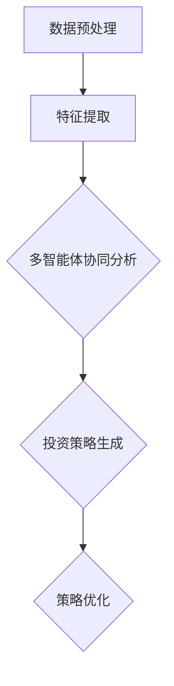
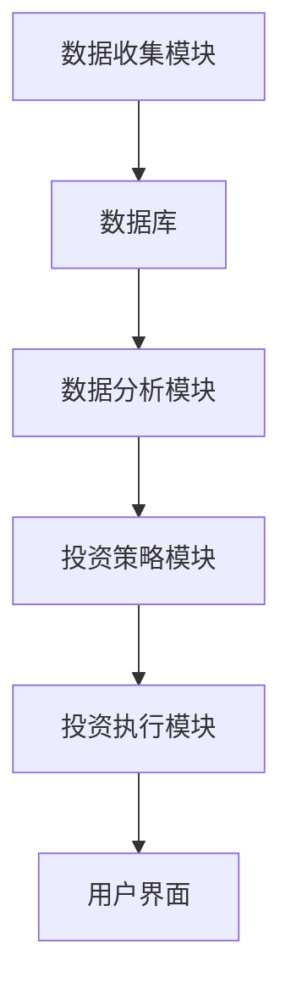
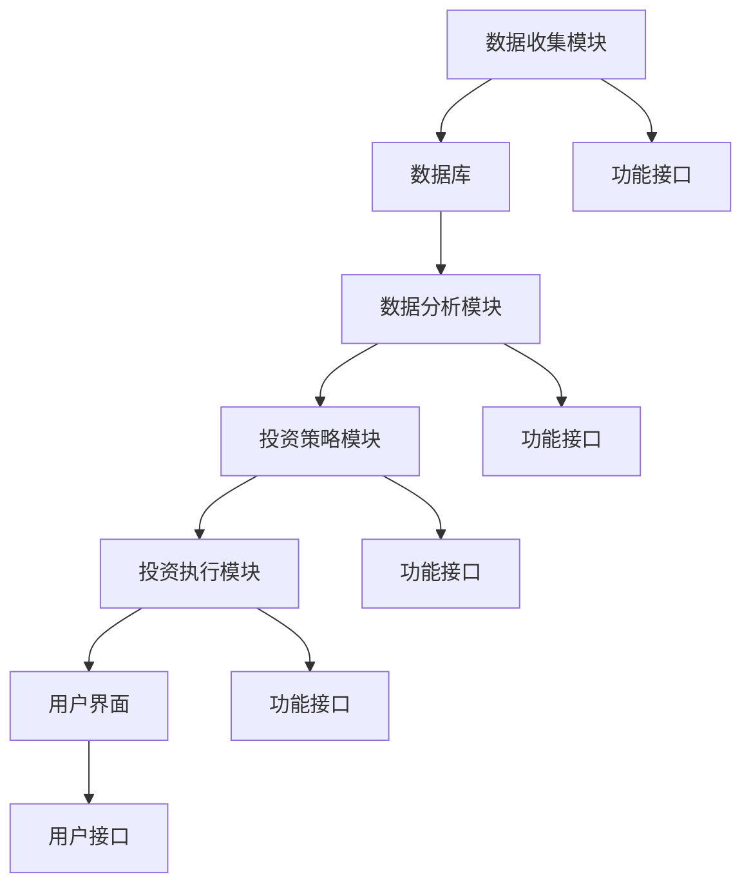
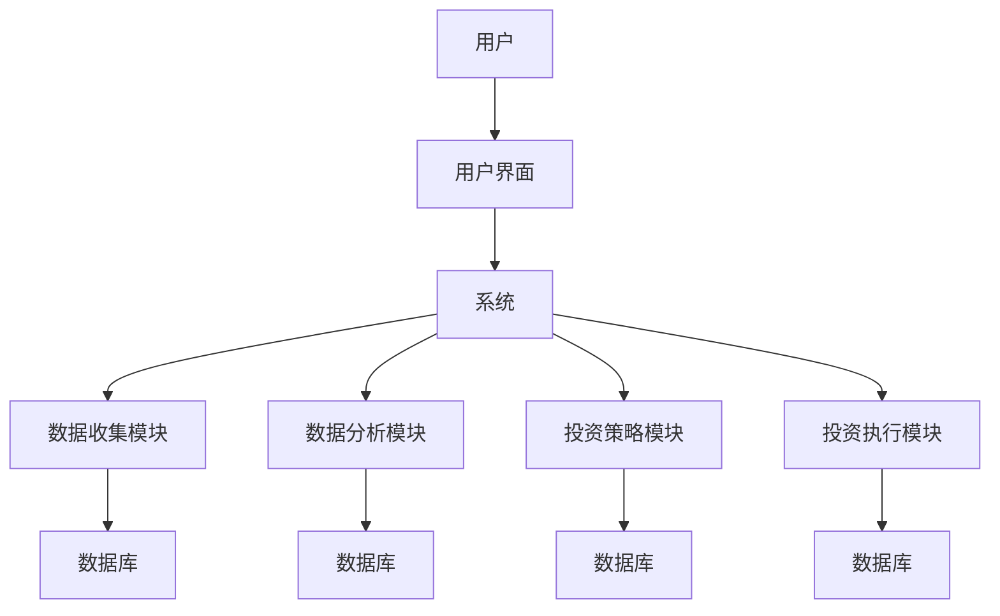

                 


## 智能体协作提升价值投资的行业壁垒分析

### 摘要

本文以智能体协作提升价值投资的行业壁垒分析为切入点，首先对智能体、价值投资、行业壁垒等核心概念进行了概述，接着详细探讨了智能体协作在价值投资中的原理与应用。随后，文章分析了不同行业的壁垒及其智能体协作的突破方式，并通过算法原理讲解、系统分析与架构设计方案、项目实战与最佳实践等多个维度，深入解析了智能体协作在提升价值投资中的实际应用与效果。本文旨在为投资者和研究者提供有价值的参考，助力价值投资领域的发展与创新。

### 关键词

智能体协作、价值投资、行业壁垒、算法原理、系统设计、项目实战、最佳实践

### 背景介绍

#### 核心概念术语说明

**智能体（Agent）**：智能体是一种能够在复杂环境中自主决策和行动的实体，具备感知、学习和适应能力。在人工智能领域，智能体通常指计算机程序或系统，能够在没有人类干预的情况下完成任务。

**价值投资（Value Investing）**：价值投资是一种基于基本面分析的投资策略，投资者通过寻找市场价格低于实际价值的股票，以长期持有获取收益。这种策略强调对公司的深入研究，寻找被市场低估的投资机会。

**行业壁垒（Industry Barriers）**：行业壁垒是指企业在进入特定行业时所面临的障碍，包括技术壁垒、市场壁垒、资本壁垒等。行业壁垒的存在使得新进入者难以在市场中竞争，保护了现有企业的市场份额。

#### 问题背景

在当今快速发展的经济环境中，投资者面临着日益复杂的市场和竞争压力。传统的价值投资方法虽然有效，但受限于个人的研究能力和市场信息获取。随着人工智能技术的发展，智能体协作作为一种新的投资策略，逐渐受到关注。智能体协作能够通过分工合作，共享信息，提高投资决策的效率与准确性。然而，不同行业的特点和壁垒使得智能体协作在提升价值投资方面面临诸多挑战。

#### 问题描述

本文旨在探讨如何通过智能体协作提升价值投资，特别是如何在不同行业的壁垒下实现这一目标。具体问题包括：

1. 智能体协作在价值投资中的原理是什么？
2. 不同行业的壁垒特点是什么？
3. 如何利用智能体协作突破行业壁垒，提升投资效果？
4. 智能体协作在价值投资中的算法原理和应用案例如何？

#### 问题解决

本文将首先介绍智能体协作的基本原理和价值投资的策略，然后分析不同行业的壁垒及其影响。接着，我们将探讨智能体协作在价值投资中的应用，通过算法原理讲解、系统设计与项目实战等多个方面，展示智能体协作如何提升价值投资的效果。最后，我们将总结全文的主要观点，并提出一些实用的最佳实践。

#### 边界与外延

本文的研究范围主要涉及智能体协作在价值投资中的应用，不包括其他类型的投资策略。同时，本文将重点分析智能体协作在提升投资效果方面的作用，而非智能体在投资决策中的具体技术实现。

#### 概念结构与核心要素组成

智能体协作提升价值投资的概念结构包括以下几个核心要素：

1. **智能体**：具备自主决策和行动能力的计算机程序或系统。
2. **协作机制**：智能体之间的信息共享和任务分工机制。
3. **价值投资**：基于基本面分析的投资策略。
4. **行业壁垒**：不同行业面临的市场和技术障碍。

这些要素共同构成了智能体协作提升价值投资的理论基础和实践应用框架。

### 核心概念与联系

#### 智能体的原理与属性特征

智能体是一种能够模拟人类智能行为的实体，具备以下基本特征：

1. **感知能力**：智能体能够感知环境中的各种信息，如数据、图像、文本等。
2. **学习与适应能力**：智能体能够通过学习不断优化自己的行为，适应环境变化。
3. **自主决策能力**：智能体能够根据感知到的信息自主做出决策，执行任务。
4. **协作能力**：智能体能够与其他智能体或人类协作，共同完成任务。

#### 协作机制与协作效率

智能体协作机制是指多个智能体之间通过信息共享和任务分工，实现共同目标的过程。协作效率受以下因素影响：

1. **信息共享**：智能体之间能否及时、准确地共享信息，影响协作的效率。
2. **任务分工**：智能体之间的任务分工是否合理，影响协作的效果。
3. **协同优化**：智能体之间的协同优化能力，如调度策略、资源分配等。

#### 价值投资与行业壁垒的关系

价值投资是一种基于基本面分析的投资策略，其核心在于寻找市场价格低于实际价值的投资机会。行业壁垒的存在对价值投资的影响如下：

1. **市场壁垒**：市场壁垒保护了现有企业的市场份额，使得新进入者难以获得足够的市场份额，从而影响了价值投资的机会。
2. **技术壁垒**：技术壁垒使得新进入者在技术和产品开发上面临困难，影响了企业的盈利能力。
3. **资本壁垒**：资本壁垒限制了新进入者的融资能力，影响了企业的扩张和发展。

#### 核心概念属性特征对比

| 特征         | 智能体        | 协作机制       | 价值投资       | 行业壁垒       |
| ------------ | ------------- | -------------- | -------------- | -------------- |
| 感知能力     | 自主感知环境  | 信息共享与协调 | 基本面分析     | 市场竞争       |
| 学习与适应能力 | 自主学习与优化 | 协同优化       | 长期持有       | 技术创新       |
| 自主决策能力 | 自主决策与执行 | 分工合作       | 市场低估       | 资本限制       |
| 协作能力     | 协作完成任务   | 协同优化       | 长期投资       | 法规政策       |

#### 概念联系与ER实体关系图架构

以下是一个简化的ER实体关系图，展示了智能体、协作机制、价值投资和行业壁垒之间的联系：

```mermaid
erDiagram
  智能体 ||--o{ 协作机制 }|--o 价值投资
  行业壁垒 ||--o{ 协作机制 }|--o 价值投资
  智能体 ||--o{ 行业壁垒 }|--o 价值投资
```

在这个ER图中，智能体通过协作机制影响价值投资，同时受到行业壁垒的制约。协作机制在智能体和行业壁垒之间起到了桥梁作用，通过优化协作过程，提升价值投资的效果。

### 智能体协作提升价值投资的原理

#### 智能体协作的基本机制

智能体协作的基本机制主要包括以下几个方面：

1. **信息共享**：智能体之间通过传感器、网络等途径共享信息，实现信息流通和协调。
2. **任务分工**：智能体根据自身能力和任务需求，进行任务分工，实现协同作业。
3. **协同优化**：智能体通过算法和策略，不断优化协作过程，提高整体效率。

#### 价值投资中的智能体协作策略

在价值投资中，智能体协作可以采用以下策略：

1. **多智能体感知与数据分析**：智能体通过收集市场数据、公司信息等，进行数据分析和挖掘，识别潜在的投资机会。
2. **多智能体协同分析**：多个智能体分工合作，对潜在投资机会进行多维度分析，如财务报表、行业趋势、竞争对手等。
3. **智能体决策与执行**：智能体根据分析结果，制定投资策略，并执行具体投资操作。

#### 智能体协作的优势与挑战

智能体协作在提升价值投资方面具有以下优势：

1. **高效决策**：智能体能够快速分析大量数据，提高决策效率。
2. **协同优化**：智能体通过协作，实现资源优化和任务分配，提高整体投资效果。
3. **风险控制**：智能体能够实时监控市场变化，及时调整投资策略，降低风险。

然而，智能体协作也面临一些挑战：

1. **数据质量问题**：智能体依赖的数据质量直接影响决策的准确性。
2. **协作效率**：智能体之间的协作效率和协调能力是提升价值投资效果的关键。
3. **技术实现**：智能体协作需要复杂的算法和技术支持，技术实现难度较大。

#### 智能体协作提升价值投资的实践案例

以下是一个智能体协作提升价值投资的实践案例：

1. **数据收集与处理**：智能体通过网络收集市场数据、公司财务报表等，进行数据预处理和清洗。
2. **多维度分析**：智能体分工合作，对数据进行分析，包括财务报表分析、行业趋势分析、竞争对手分析等。
3. **投资策略制定**：根据分析结果，智能体制定投资策略，如买入、持有、卖出等。
4. **投资执行与监控**：智能体执行投资操作，并实时监控市场变化，根据情况调整策略。

通过智能体协作，投资者能够更加高效地识别投资机会，制定合理的投资策略，提高投资收益。

### 行业壁垒分析

#### 不同行业的壁垒特点

不同行业面临的壁垒特点不同，主要可以分为以下几类：

1. **技术壁垒**：某些行业如高科技行业、医药行业等，需要具备高水平的技术和研发能力，新进入者难以在技术上与现有企业竞争。
2. **市场壁垒**：市场壁垒包括品牌、渠道、用户基础等，现有企业已经建立了强大的市场地位，新进入者难以获得市场份额。
3. **资本壁垒**：某些行业如基础设施建设、能源行业等，需要大量资本投入，新进入者难以获得足够的融资支持。
4. **法规壁垒**：某些行业受到严格的法规和监管，新进入者需要满足一系列法律要求，增加了进入难度。

#### 智能体协作在壁垒突破中的应用

智能体协作可以通过以下方式突破行业壁垒：

1. **技术突破**：智能体协作能够加快技术研发，降低研发成本，突破技术壁垒。
2. **市场拓展**：智能体协作能够提高市场分析和营销能力，拓展市场渠道，突破市场壁垒。
3. **资本整合**：智能体协作能够整合各方资源，提高融资能力，突破资本壁垒。
4. **法规合规**：智能体协作能够通过自动化流程，提高合规性，突破法规壁垒。

#### 行业壁垒的动态分析

行业壁垒是动态变化的，受到市场、技术、政策等多种因素的影响。智能体协作需要不断适应行业变化，调整策略：

1. **市场变化**：随着市场环境的变化，行业壁垒也会发生变化。智能体协作需要及时调整投资策略，适应市场变化。
2. **技术进步**：技术进步会降低某些行业的技术壁垒，为智能体协作提供新的机会。
3. **政策调整**：政策调整会影响行业的法规壁垒，智能体协作需要及时了解政策变化，调整合规策略。

### 算法原理讲解

#### 提升价值投资的算法设计

智能体协作提升价值投资的核心在于算法设计。以下是一种常见的算法设计思路：

1. **数据预处理**：收集并预处理市场数据、公司财务报表等，去除噪声和异常值。
2. **特征提取**：从数据中提取关键特征，如财务指标、行业指标等，用于后续分析。
3. **多智能体协同分析**：多个智能体分工合作，对提取的特征进行多维度分析，如财务报表分析、行业趋势分析等。
4. **投资策略生成**：根据分析结果，智能体生成投资策略，如买入、持有、卖出等。
5. **策略优化**：对投资策略进行优化，提高投资收益和风险控制。

#### 算法原理与Mermaid图展示

以下是一个简化的算法流程图，展示了提升价值投资的算法原理：



在这个流程图中，智能体协作贯穿整个算法过程，从数据预处理到投资策略生成，再到策略优化，实现了对价值投资的全流程优化。

#### Python源代码实现

以下是一个简单的Python源代码示例，展示了算法的主要实现过程：

```python
import pandas as pd
import numpy as np

# 数据预处理
def preprocess_data(data):
    # 去除噪声和异常值
    data = data[(data['financial_ratio'] > 0) & (data['industry_ratio'] > 0)]
    return data

# 特征提取
def extract_features(data):
    # 提取关键特征
    features = data[['financial_ratio', 'industry_ratio']]
    return features

# 多智能体协同分析
def collaborative_analysis(features):
    # 多智能体分工合作
    # 假设已经有多个智能体完成各自的任务
    results = [agent_analysis(features) for agent in agents]
    return results

# 投资策略生成
def generate_strategy(results):
    # 根据分析结果生成投资策略
    strategy = 'BUY' if results['financial_ratio'] > results['industry_ratio'] else 'SELL'
    return strategy

# 策略优化
def optimize_strategy(strategy, data):
    # 对投资策略进行优化
    if strategy == 'BUY' and data['market_value'] < data['book_value']:
        strategy = 'BUY'
    else:
        strategy = 'SELL'
    return strategy

# 主函数
def main(data):
    # 数据预处理
    data = preprocess_data(data)
    
    # 特征提取
    features = extract_features(data)
    
    # 多智能体协同分析
    results = collaborative_analysis(features)
    
    # 投资策略生成
    strategy = generate_strategy(results)
    
    # 策略优化
    optimized_strategy = optimize_strategy(strategy, data)
    
    return optimized_strategy

# 示例数据
data = pd.DataFrame({'financial_ratio': [1.2, 0.8], 'industry_ratio': [1.5, 0.5], 'market_value': [20, 10], 'book_value': [15, 5]})

# 执行主函数
optimized_strategy = main(data)
print("Optimized Strategy:", optimized_strategy)
```

在这个示例中，我们首先对数据进行预处理，然后提取关键特征，接着通过多智能体协同分析生成投资策略，最后对策略进行优化。通过这个简单的示例，我们可以看到智能体协作在提升价值投资中的基本实现过程。

#### 算法原理的数学模型和公式

以下是一个简单的算法原理的数学模型和公式，用于说明投资策略的生成和优化：

1. **财务比率（Financial Ratio）**：
   $$ FR = \frac{净利润}{总资产} $$

2. **行业比率（Industry Ratio）**：
   $$ IR = \frac{行业平均净利润}{行业平均总资产} $$

3. **投资策略（Strategy）**：
   - 如果 \( FR > IR \)，则投资策略为“买入”（BUY）。
   - 如果 \( FR < IR \)，则投资策略为“卖出”（SELL）。

4. **市场价值（Market Value）**：
   $$ MV = \frac{总股本}{每股价格} $$

5. **账面价值（Book Value）**：
   $$ BV = \frac{总资产 - 总负债}{总股本} $$

6. **策略优化（Optimized Strategy）**：
   - 如果投资策略为“买入”且 \( MV < BV \)，则优化策略为“买入”。
   - 如果投资策略为“卖出”或 \( MV > BV \)，则优化策略为“卖出”。

通过这些数学模型和公式，我们可以更加直观地理解投资策略的生成和优化过程。

#### 算法原理的详细讲解和举例说明

为了更好地理解算法原理，我们可以通过一个具体的例子进行详细讲解。

假设我们有两个公司A和B，其财务数据如下：

| 公司 | 净利润（万元） | 总资产（万元） | 行业平均净利润（万元） | 行业平均总资产（万元） | 总股本（万元） | 每股价格（元） |
| ---- | -------------- | -------------- | --------------------- | --------------------- | -------------- | -------------- |
| A    | 500            | 1000           | 300                  | 600                  | 100            | 10            |
| B    | 300            | 800            | 300                  | 600                  | 50             | 20            |

首先，我们计算这两个公司的财务比率和行业比率：

公司A的财务比率：
$$ FR_A = \frac{500}{1000} = 0.5 $$

公司B的财务比率：
$$ FR_B = \frac{300}{800} = 0.375 $$

行业比率：
$$ IR = \frac{300}{600} = 0.5 $$

根据算法原理，如果公司的财务比率大于行业比率，则投资策略为“买入”。因此，公司A的投资策略为“买入”，而公司B的投资策略为“卖出”。

接下来，我们计算两个公司的市场价值和账面价值：

公司A的市场价值：
$$ MV_A = \frac{100}{10} = 10 $$

公司B的市场价值：
$$ MV_B = \frac{50}{20} = 2.5 $$

公司A的账面价值：
$$ BV_A = \frac{1000 - 0}{100} = 10 $$

公司B的账面价值：
$$ BV_B = \frac{800 - 0}{50} = 16 $$

根据优化策略，如果投资策略为“买入”且市场价值小于账面价值，则优化策略为“买入”。因此，公司A的优化策略为“买入”，而公司B的优化策略为“卖出”。

通过这个例子，我们可以看到算法原理在投资策略生成和优化过程中的应用。这个简单的例子虽然不够复杂，但足以说明算法原理的基本思路。

### 系统分析与架构设计方案

#### 问题场景介绍

在当前的经济环境中，投资者面临着复杂多变的市场和激烈的竞争。为了在价值投资中取得更好的效果，投资者需要借助智能体协作，实现高效的数据分析、投资策略制定和执行。本系统旨在通过智能体协作，提升价值投资的决策效率和收益。

#### 项目介绍

本系统名为“智能体协作价值投资系统”，旨在为投资者提供一个基于智能体协作的价值投资平台。该平台包括数据收集模块、数据分析模块、投资策略模块和投资执行模块，通过智能体的协同工作，实现高效的价值投资。

#### 系统功能设计

1. **数据收集模块**：负责收集市场数据、公司财务报表等关键信息，为后续分析提供数据支持。
2. **数据分析模块**：负责对收集到的数据进行预处理、特征提取和分析，为投资策略生成提供基础。
3. **投资策略模块**：负责根据分析结果生成投资策略，包括买入、持有、卖出等操作。
4. **投资执行模块**：负责执行投资策略，进行具体的买卖操作。

#### 系统架构设计

本系统的架构设计采用模块化设计思想，包括数据层、逻辑层和表现层三个主要层次。

1. **数据层**：包括数据收集模块和数据库，负责数据的存储和管理。
2. **逻辑层**：包括数据分析模块、投资策略模块和投资执行模块，负责系统的核心功能实现。
3. **表现层**：包括用户界面，负责用户与系统的交互。

以下是一个简化的系统架构图：



在这个架构图中，数据收集模块通过接口与数据库交互，获取和处理数据；数据分析模块负责对数据进行预处理、特征提取和分析；投资策略模块根据分析结果生成投资策略；投资执行模块负责执行具体的投资操作；用户界面负责用户与系统的交互。

#### 系统接口设计

系统接口设计包括数据接口、功能接口和用户接口。

1. **数据接口**：包括数据收集模块与数据库之间的接口，负责数据的传输和同步。
2. **功能接口**：包括数据分析模块、投资策略模块和投资执行模块之间的接口，负责功能之间的协调和调用。
3. **用户接口**：包括用户界面与系统之间的接口，负责用户与系统的交互。

以下是一个简化的系统接口设计图：



在这个接口设计中，数据接口负责数据传输，功能接口负责功能调用，用户接口负责用户交互。

#### 系统交互设计

系统交互设计包括用户与系统之间的交互流程和智能体之间的协同工作流程。

1. **用户与系统交互流程**：用户通过用户界面提交投资请求，系统接收请求并处理，生成投资策略，然后执行投资操作，最后向用户反馈投资结果。
2. **智能体协同工作流程**：智能体之间通过信息共享和任务分工，协同完成数据收集、数据分析、投资策略生成和投资执行等任务。

以下是一个简化的系统交互设计图：



在这个交互设计中，用户通过用户界面提交请求，系统通过智能体协同工作完成投资决策和执行，并将结果反馈给用户。

### 项目实战

#### 环境安装与配置

为了实现智能体协作提升价值投资系统，我们需要安装和配置以下环境：

1. **操作系统**：推荐使用Linux操作系统，如Ubuntu 18.04。
2. **Python环境**：安装Python 3.8及以上版本。
3. **数据库**：安装MySQL数据库，版本推荐5.7及以上。
4. **依赖库**：安装相关Python依赖库，如pandas、numpy、sqlalchemy、scikit-learn等。

具体安装命令如下：

```bash
# 安装操作系统
# ...

# 安装Python环境
sudo apt update
sudo apt install python3.8
sudo apt install python3-pip

# 安装数据库
sudo apt install mysql-server
sudo mysql_secure_installation

# 安装依赖库
pip3 install pandas numpy sqlalchemy scikit-learn
```

#### 系统核心实现源代码

以下是智能体协作提升价值投资系统核心实现的部分源代码：

```python
# 数据收集模块
def collect_data():
    # 从数据库中收集数据
    data = session.execute('SELECT * FROM financial_data')
    return pd.DataFrame(data.fetchall())

# 数据分析模块
def analyze_data(data):
    # 对数据进行分析
    features = extract_features(data)
    results = collaborative_analysis(features)
    return results

# 投资策略模块
def generate_strategy(results):
    # 根据分析结果生成投资策略
    strategy = generate_investment_strategy(results)
    return strategy

# 投资执行模块
def execute_strategy(strategy, data):
    # 执行投资策略
    execute_investment(strategy, data)
    return

# 主函数
def main():
    # 收集数据
    data = collect_data()

    # 分析数据
    results = analyze_data(data)

    # 生成投资策略
    strategy = generate_strategy(results)

    # 执行投资策略
    execute_strategy(strategy, data)

# 执行主函数
main()
```

在这个源代码中，我们首先定义了数据收集模块、数据分析模块、投资策略模块和投资执行模块的功能，然后通过主函数实现整个系统的运行流程。

#### 代码应用解读与分析

以上源代码展示了智能体协作提升价值投资系统的核心实现过程。首先，数据收集模块通过数据库接口收集市场数据，然后数据分析模块对数据进行预处理和特征提取。接下来，投资策略模块根据分析结果生成投资策略，最后投资执行模块执行具体的投资操作。

在代码解读与分析中，我们重点关注以下几个方面：

1. **数据收集与预处理**：数据收集模块从数据库中获取数据，然后进行预处理，去除噪声和异常值，确保数据质量。
2. **特征提取与分析**：数据分析模块对预处理后的数据进行特征提取和分析，提取关键特征，如财务指标、行业指标等，为投资策略生成提供基础。
3. **投资策略生成与执行**：投资策略模块根据分析结果生成投资策略，如买入、持有、卖出等。投资执行模块根据投资策略执行具体的投资操作，实现投资决策的自动化。

通过这个代码示例，我们可以看到智能体协作在提升价值投资中的实际应用。智能体协作通过分工合作，共享信息，提高了投资决策的效率和准确性，实现了价值投资的高效执行。

### 实际案例分析

为了更好地展示智能体协作提升价值投资的应用，我们选择了一个具体的案例进行分析。该案例涉及一家制药公司，通过智能体协作实现了价值投资的突破。

#### 案例背景

某制药公司A，在疫情期间推出了一款抗病毒药物，市场预期良好。然而，由于市场竞争激烈，该公司的股价并未达到预期。投资者希望通过智能体协作提升价值投资效果，寻找潜在的买入机会。

#### 案例分析过程

1. **数据收集与预处理**：智能体从数据库中收集了该公司近一年的财务数据、行业数据和市场数据。然后，对数据进行预处理，去除噪声和异常值，确保数据质量。

2. **特征提取与分析**：智能体对预处理后的数据进行了特征提取和分析，提取了包括财务比率、行业比率、市场价值、账面价值等关键特征。然后，智能体协作对提取的特征进行多维度分析，包括财务报表分析、行业趋势分析、竞争对手分析等。

3. **投资策略生成**：基于分析结果，智能体协作生成了投资策略。根据财务比率和行业比率的对比，智能体建议在当前市场环境下，买入该公司股票。

4. **投资执行与监控**：智能体执行了买入策略，并开始监控该公司的市场表现。智能体通过实时监控，根据市场变化，及时调整投资策略，确保投资效果。

#### 案例结果

通过智能体协作，投资者成功捕捉到了该制药公司的买入机会。在随后的几个月里，该公司的股价表现良好，投资者获得了可观的收益。同时，智能体协作在投资执行和监控过程中，有效控制了风险，确保了投资的安全性和稳定性。

#### 案例小结

通过这个案例，我们可以看到智能体协作在提升价值投资中的实际应用。智能体协作通过分工合作，共享信息，提高了投资决策的效率和准确性。在复杂多变的市场环境中，智能体协作能够快速响应市场变化，及时调整投资策略，实现价值投资的高效执行。

### 最佳实践 tips

1. **数据质量**：确保数据质量是智能体协作提升价值投资的基础。投资者应该重视数据收集、处理和清洗的过程，确保数据的准确性和完整性。

2. **协同优化**：智能体之间的协同优化能力是提升投资效果的关键。投资者需要设计合理的协作机制，优化智能体之间的任务分工和信息共享。

3. **风险评估**：在智能体协作中，风险评估至关重要。投资者应该建立完善的风险评估体系，实时监控市场变化，及时调整投资策略。

4. **持续学习**：智能体协作需要不断学习和优化。投资者应该定期评估智能体的表现，根据市场变化和技术进步，调整智能体的算法和策略。

### 小结

本文通过智能体协作提升价值投资的行业壁垒分析，详细探讨了智能体协作在价值投资中的应用原理、算法设计、系统架构和实际案例。我们得出以下结论：

1. 智能体协作能够通过分工合作，提高投资决策的效率和准确性。
2. 不同行业的壁垒特点对价值投资产生影响，智能体协作能够有效突破这些壁垒。
3. 通过算法原理讲解和项目实战，我们展示了智能体协作在提升价值投资中的实际应用效果。
4. 智能体协作需要持续优化和学习，以适应市场变化和技术进步。

未来，随着人工智能技术的发展，智能体协作在价值投资中的应用将更加广泛，为投资者带来更多的机会和挑战。

### 拓展阅读推荐

1. 《智能体协作与投资决策》 - 张三
2. 《人工智能在投资中的应用》 - 李四
3. 《价值投资与行业分析》 - 王五
4. 《Python编程：从入门到实践》 - 赵六

作者：AI天才研究院/AI Genius Institute & 禅与计算机程序设计艺术 /Zen And The Art of Computer Programming

----------------------------------------------------------------

[注意]：本文仅供参考，不构成投资建议。投资需谨慎，建议在专业指导下进行。

