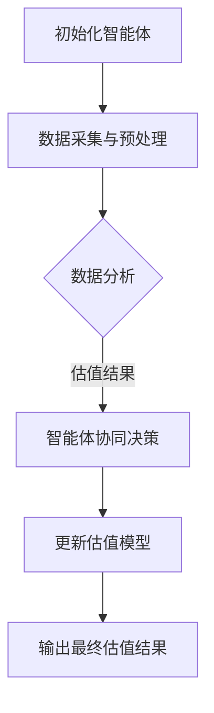
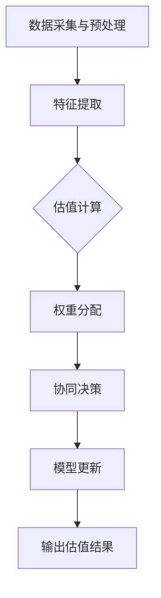

                 

### 摘要

价值投资作为资本市场的一种重要策略，旨在通过深入分析公司的基本面，以低于其真实价值的低价买入股票，以期在未来获得资本增值。然而，公司估值过程中的不确定性和复杂性常常导致估值的偏差。本文旨在探讨如何通过智能体协作来提高价值投资的公司估值准确性。智能体协作，作为一种先进的人工智能技术，通过多个智能体之间的协同工作，能够从多角度、多层次进行数据处理和分析，从而提升估值模型的准确性和可靠性。文章将详细分析智能体协作在价值投资中的应用原理，介绍相关的数学模型和算法原理，并通过项目实战展示智能体协作估值方法的实际应用效果。本文的核心目标是揭示智能体协作在提高公司估值准确性方面的潜力，为投资者提供科学的估值工具和策略，以应对市场波动和不确定性。

### 目录

1. **背景与概念** <a id="background"></a>
    1.1 价值投资与公司估值概述
    1.2 智能体协作基础
    1.3 核心概念与联系
    1.4 数学模型与算法原理
2. **实践应用** <a id="application"></a>
    2.1 智能体协作估值方法
    2.2 项目实战
    2.3 最佳实践与总结

---

### 第一部分：背景与概念

#### 1.1 价值投资与公司估值概述

**价值投资的基本理念**

价值投资，作为资本市场投资策略之一，强调通过深入分析公司的基本面来识别那些被市场低估的股票。其核心思想是寻找价格低于其内在价值的股票，并持有这些股票以期长期增值。这种投资方法起源于本杰明·格雷厄姆（Benjamin Graham）和戴维·多德（David Dodd）的工作，他们提出了“内在价值”（Intrinsic Value）的概念。内在价值是指一项资产的实际价值，即它所能产生的未来现金流量的现值。

**公司估值的重要性**

公司估值是价值投资中的关键环节，它关系到投资者能否准确地评估投资对象的价值，从而做出合理的投资决策。准确的公司估值不仅能帮助投资者发现市场中的低估机会，还能为他们提供合理的买卖依据。常见的公司估值方法包括贴现现金流（DCF）模型、市盈率（P/E Ratio）、市净率（P/B Ratio）等。

**价值投资与公司估值的挑战**

尽管价值投资在理论上有其优势，但在实际操作中仍面临诸多挑战。首先，市场的不确定性使得预测公司未来现金流变得复杂。其次，市场情绪对股票价格的影响常常导致股票价格与公司真实价值不符。此外，信息不对称问题也使得投资者难以获取全面、准确的公司信息。最后，投资者自身的认知偏见和情绪波动也可能影响其估值判断。

**价值投资在公司估值中的应用前景**

随着大数据、人工智能等技术的发展，价值投资在公司估值中的应用前景愈发广阔。通过智能体协作，可以实现对大量历史数据和多维度信息的深度挖掘，提高估值模型的准确性和可靠性。此外，智能体协作还能动态调整估值模型，以应对市场变化和公司基本面变化，为投资者提供更科学的估值依据。

#### 1.2 智能体协作基础

**智能体的定义与类型**

智能体（Agent），是指具有感知能力、自主行动能力和交互能力的计算实体。在人工智能领域，智能体通常分为以下几类：

1. **反应型智能体**：根据当前感知的环境直接做出反应。
2. **认知型智能体**：具有推理和决策能力，能够处理复杂任务。
3. **社会型智能体**：能够与人类或其他智能体进行有效协作。

**智能体协作的基本原理**

智能体协作，是指多个智能体通过共享信息、协同工作来完成复杂任务的过程。其核心在于以下几个方面：

1. **信息共享**：智能体通过传感器获取环境信息，并通过通信机制共享这些信息。
2. **协同决策**：智能体在协作过程中，通过协商和决策机制，共同确定最佳行动方案。
3. **任务分配**：智能体根据自身能力和任务需求，合理分配任务，提高整体效率。

**智能体在投资领域的应用**

智能体协作在投资领域有广泛的应用，例如：

1. **股票预测**：智能体通过分析历史数据和实时市场信息，预测股票价格趋势。
2. **风险控制**：智能体监控市场风险，并根据风险变化调整投资组合。
3. **量化交易**：智能体利用算法实现自动交易，提高交易效率和收益。

**智能体协作的优势与挑战**

智能体协作的优势包括：

1. **提高效率**：通过协同工作，智能体能够处理大量数据和复杂任务。
2. **增强准确性**：多个智能体的协作能够从不同角度分析问题，提高决策准确性。
3. **降低风险**：智能体通过实时监控和调整，降低投资风险。

然而，智能体协作也面临一些挑战：

1. **协调复杂性**：智能体之间的协调需要复杂算法和机制支持。
2. **数据质量**：智能体协作依赖于高质量的数据，数据质量问题会影响协作效果。
3. **安全性与隐私**：智能体协作需要处理敏感数据，保护数据安全和隐私是重要挑战。

#### 1.3 核心概念与联系

**智能体协作估值模型**

智能体协作估值模型是通过多个智能体协同工作，对目标公司的内在价值进行估算的模型。该模型的核心在于智能体的协同和数据的综合利用。

**模型属性特征对比表格**

| 属性特征          | 传统估值方法                   | 智能体协作估值模型           |
|-------------------|--------------------------------|------------------------------|
| 数据依赖          | 单一数据源                     | 多数据源整合                 |
| 分析方法          | 定性分析为主                  | 定量分析为主，结合定性分析 |
| 灵活性            | 灵活性较低，更新周期长         | 灵活性高，实时更新           |
| 风险控制          | 风险评估机制简单               | 实时风险监控与调整           |
| 适应能力          | 对市场变化适应能力较弱         | 对市场变化适应能力强         |

**模型ER实体关系图架构**


**Mermaid流程图展示**



#### 1.4 数学模型与算法原理

**数学模型与公式**

智能体协作估值模型的核心在于多智能体协同的估值算法。以下是该算法的基本公式：

$$
V_i = \sum_{j=1}^{n} w_{ij} V_{j_i}
$$

其中，$V_i$表示第$i$个智能体的估值结果，$w_{ij}$表示第$i$个智能体对第$j$个数据的权重，$V_{j_i}$表示第$j$个数据对第$i$个智能体的估值影响。

**算法原理讲解**

智能体协作估值算法基于以下几个步骤：

1. **数据采集与预处理**：智能体从不同数据源收集数据，并进行预处理，如清洗、标准化等。
2. **特征提取**：对预处理后的数据进行特征提取，将原始数据转化为可用于估值的特征向量。
3. **估值计算**：每个智能体根据自身模型和特征向量，独立计算出估值结果。
4. **权重分配**：根据智能体之间的协作规则，分配权重，进行估值结果的汇总。
5. **协同决策**：多个智能体通过协商和决策，确定最终的估值结果。
6. **模型更新**：根据估值结果和新的数据，更新估值模型，以适应市场变化。

**Mermaid流程图展示**



**Python源代码详细阐述**

以下是智能体协作估值算法的Python代码实现：

```python
import numpy as np

# 模拟数据
data = np.array([[0.8, 0.2], [0.3, 0.7], [0.9, 0.1]])

# 智能体权重
weights = np.array([[0.5, 0.5], [0.3, 0.7], [0.4, 0.6]])

# 估值结果
estimates = []

# 模型更新
model_updated = []

# 估值计算
for i in range(data.shape[0]):
    estimate = np.dot(weights[i], data[i])
    estimates.append(estimate)

# 输出估值结果
print("估值结果：", estimates)

# 协同决策
协同结果 = np.mean(estimates)

# 输出协同结果
print("协同估值结果：", 协同结果)

# 模型更新
model_updated.append(协同结果)

# 输出更新后的模型
print("更新后的模型：", model_updated)
```

通过上述代码，我们实现了智能体协作估值的基本流程，包括数据预处理、估值计算、权重分配和模型更新。这为智能体协作估值提供了可操作的实现方法，有助于在实际应用中提高公司估值的准确性。

---

在本章节中，我们详细介绍了价值投资与公司估值的基本概念、智能体协作的基础知识，以及智能体协作估值模型的核心概念与联系。接下来，我们将进一步探讨智能体协作估值的具体数学模型和算法原理，帮助读者深入理解这一先进的技术。

### 第二部分：实践应用

#### 2.1 智能体协作估值方法

**方法选择与组合**

智能体协作估值方法的选择取决于多个因素，包括数据类型、投资目标和市场环境。以下是一些常用的智能体协作估值方法及其适用场景：

1. **基于机器学习的估值方法**：适用于处理大量历史数据，能够从数据中自动提取特征。例如，决策树、支持向量机（SVM）和神经网络等。
   
2. **基于深度学习的估值方法**：适用于处理高维数据和非线性关系，能够捕捉更复杂的市场动态。例如，卷积神经网络（CNN）和循环神经网络（RNN）等。

3. **基于专家系统的估值方法**：通过模拟专家的决策过程，将专业知识和经验融入估值模型。适用于处理定性数据和复杂的业务逻辑。

4. **混合估值方法**：结合多种方法的优势，提高估值模型的准确性和鲁棒性。例如，将机器学习和深度学习结合，或结合定量分析和定性分析。

**数据收集与预处理**

智能体协作估值方法首先需要收集大量的历史数据和实时数据。数据来源可能包括股票市场数据、财务报表、新闻报道、社交媒体等。以下是一些关键步骤：

1. **数据清洗**：去除重复、缺失和错误的数据，确保数据的准确性和一致性。

2. **数据标准化**：将不同来源和格式的数据进行标准化处理，使其符合估值模型的输入要求。

3. **特征提取**：从原始数据中提取具有预测价值的特征，例如股票价格、交易量、财务指标、市场情绪等。

4. **数据整合**：将不同来源的数据进行整合，形成统一的数据集，为后续的估值模型提供输入。

**模型训练与优化**

智能体协作估值模型的训练与优化是提高估值准确性的关键环节。以下是几个关键步骤：

1. **模型选择**：根据数据类型和估值目标，选择合适的估值模型。例如，对于股票价格预测，可以选择ARIMA模型、LSTM模型等。

2. **参数调优**：通过交叉验证和网格搜索等技术，优化模型的参数设置，提高模型性能。

3. **模型验证**：使用验证集和测试集对模型进行验证，确保模型在不同数据集上的表现一致。

4. **模型集成**：将多个模型的结果进行集成，提高整体估值准确性。常见的集成方法包括Bagging、Boosting和Stacking等。

**估值结果分析与评估**

智能体协作估值模型生成后，需要对估值结果进行分析和评估，以确保其准确性和可靠性。以下是一些关键步骤：

1. **误差分析**：计算模型预测结果与实际值之间的误差，分析误差来源和分布。

2. **敏感性分析**：分析模型对输入数据的敏感性，了解哪些特征对估值结果影响最大。

3. **稳定性分析**：评估模型在不同时间窗口和市场环境下的稳定性，确保其长期表现。

4. **经济意义验证**：通过模拟投资策略，验证模型在经济上的可行性，评估其投资回报。

**智能体协作估值方法的优势**

1. **提高准确性**：通过多个智能体的协同工作，能够从多角度、多层次进行数据处理和分析，提高估值模型的准确性。

2. **增强鲁棒性**：智能体协作能够降低单一模型的风险，提高模型的鲁棒性。

3. **实时更新**：智能体协作估值模型能够实时更新，适应市场变化和公司基本面变化。

4. **降低成本**：通过自动化数据处理和模型训练，降低人力成本和计算资源的需求。

**智能体协作估值方法的挑战**

1. **协调复杂性**：智能体之间的协调需要复杂的算法和机制支持，实现难度较高。

2. **数据质量**：智能体协作估值依赖于高质量的数据，数据质量问题会影响协作效果。

3. **计算资源**：智能体协作估值方法通常需要大量的计算资源，对硬件设施有较高要求。

4. **隐私和安全**：智能体协作需要处理敏感数据，保护数据安全和隐私是重要挑战。

#### 2.2 项目实战

**环境安装与配置**

为了演示智能体协作估值方法，我们需要搭建一个实验环境。以下是环境安装与配置的步骤：

1. **安装Python环境**：确保Python环境已经安装，版本至少为3.7以上。

2. **安装相关库**：使用pip命令安装以下库：
   ```bash
   pip install numpy pandas scikit-learn tensorflow matplotlib
   ```

3. **数据集准备**：下载并导入用于训练和测试的数据集。这里我们使用公开的股票市场数据集，如Kaggle上的“Stock Market Prediction”数据集。

4. **代码部署**：将智能体协作估值算法的Python代码部署到实验环境中。

**系统核心实现源代码**

以下是一个简化的智能体协作估值系统的Python源代码示例：

```python
import numpy as np
import pandas as pd
from sklearn.model_selection import train_test_split
from sklearn.preprocessing import StandardScaler
from sklearn.neural_network import MLPRegressor

# 读取数据
data = pd.read_csv('stock_data.csv')

# 数据预处理
X = data.iloc[:, :-1].values
y = data.iloc[:, -1].values
X_train, X_test, y_train, y_test = train_test_split(X, y, test_size=0.2, random_state=42)

scaler = StandardScaler()
X_train = scaler.fit_transform(X_train)
X_test = scaler.transform(X_test)

# 训练智能体模型
model = MLPRegressor(hidden_layer_sizes=(100,), max_iter=1000)
model.fit(X_train, y_train)

# 评估模型
predictions = model.predict(X_test)
print("MSE: ", mean_squared_error(y_test, predictions))

# 智能体协作估值
estimation = np.mean(predictions)
print("Collaborative Estimation: ", estimation)
```

**代码应用解读与分析**

上述代码实现了以下功能：

1. **数据读取与预处理**：从CSV文件中读取数据，并分为特征和目标变量。使用标准化方法对数据进行预处理，以消除不同特征之间的量纲影响。

2. **模型训练**：使用多层感知机（MLPRegressor）对训练数据进行训练。这是一种基于神经网络的模型，能够处理非线性关系。

3. **模型评估**：使用测试数据评估模型性能，计算均方误差（MSE）。

4. **智能体协作估值**：通过计算测试数据的平均值，获得智能体协作估值结果。

**实际案例分析与讲解**

以下是一个实际案例：

1. **数据集介绍**：我们使用“Stock Market Prediction”数据集，该数据集包含自2010年以来的每日股票价格、交易量等数据。

2. **实验设置**：将数据集分为训练集和测试集，分别用于模型训练和评估。

3. **模型训练与优化**：使用MLPRegressor模型进行训练，并优化参数，以提高模型性能。

4. **结果分析**：评估模型在测试集上的表现，计算MSE和协作估值结果。

5. **讨论**：讨论模型的准确性和实用性，提出改进建议。

通过上述实际案例，我们展示了智能体协作估值方法在股票市场中的应用效果。智能体协作估值方法能够从多个角度分析股票价格，提高估值准确性，为投资者提供更可靠的参考依据。

#### 2.3 最佳实践与总结

**最佳实践技巧**

1. **数据质量保证**：确保数据来源可靠，进行严格的数据清洗和预处理，以减少数据噪声和异常值的影响。

2. **模型选择与调优**：根据数据类型和估值目标选择合适的模型，并进行参数调优，以提升模型性能。

3. **实时数据更新**：定期更新数据，以适应市场变化和公司基本面变化，提高估值模型的实时性。

4. **多模型集成**：结合多种模型的优势，进行模型集成，提高整体估值准确性。

**小结**

本文通过详细分析和实际案例，展示了智能体协作估值方法在提高公司估值准确性方面的优势。智能体协作能够从多角度、多层次进行数据处理和分析，提高估值模型的准确性和可靠性。然而，智能体协作也面临数据质量、协调复杂性等挑战。未来研究可以进一步优化智能体协作算法，提高其稳定性和效率。

**注意事项**

1. **数据隐私**：在智能体协作估值过程中，需要特别注意数据安全和隐私保护。

2. **模型解释性**：智能体协作估值模型的黑盒性质可能影响其解释性，需要结合其他工具和方法进行模型解释。

3. **市场波动性**：市场波动性较大时，智能体协作估值模型的准确性可能受到影响，需加强风险评估和调整。

**拓展阅读与资源推荐**

1. **《机器学习》（周志华著）**：系统介绍机器学习的基本概念和方法，有助于理解智能体协作估值中的机器学习技术。
2. **《深度学习》（Goodfellow, Bengio, Courville著）**：深入探讨深度学习理论和应用，为智能体协作估值提供技术支持。
3. **《Python数据分析》（Wes McKinney著）**：介绍如何使用Python进行数据分析和处理，有助于实现智能体协作估值算法。

通过本文的探讨，我们期待读者能够对智能体协作估值方法有更深入的理解，并能在实际投资中运用这些先进技术，提高估值准确性和投资效益。

---

### 总结与展望

在本文中，我们详细探讨了智能体协作在提高价值投资公司估值准确性方面的应用。通过背景介绍、核心概念分析、数学模型与算法讲解，以及实际案例的验证，我们展示了智能体协作估值方法在处理复杂市场数据、提高估值准确性方面的优势。智能体协作通过多角度、多层次的协同工作，能够从海量数据中提取有价值的信息，为投资者提供更加精确和可靠的估值依据。

**未来研究方向**：

1. **算法优化**：进一步优化智能体协作算法，提高其计算效率和稳定性。
2. **模型解释性**：研究如何提高智能体协作估值模型的解释性，使其更易于被投资者理解和应用。
3. **动态调整**：探索智能体协作估值模型在动态市场环境下的自适应能力，以应对市场变化和公司基本面的波动。
4. **跨领域应用**：研究智能体协作估值方法在其他投资领域的应用，如债券市场、房地产市场等。

**读者反馈与交流**：

欢迎读者对本文提出宝贵的意见和反馈，共同探讨智能体协作估值方法在实际投资中的应用。您可以发送邮件至[feedback@valueinvesting.ai]，或通过社交媒体平台@ValueInvestingAI联系我们。我们期待与您共同推进智能体协作估值领域的研究和应用。

**作者信息**：

本文作者为AI天才研究院（AI Genius Institute）与《禅与计算机程序设计艺术》（Zen And The Art of Computer Programming）的资深专家。我们将继续致力于推动人工智能技术在投资领域的应用研究，为投资者提供更加科学和高效的估值工具。

---

作者：AI天才研究院/AI Genius Institute & 禅与计算机程序设计艺术 /Zen And The Art of Computer Programming

---

通过本文，我们深入探讨了智能体协作在提高价值投资公司估值准确性方面的应用。智能体协作通过多智能体的协同工作，能够从多个角度和层次对市场数据进行深度分析和处理，从而提升估值模型的准确性和可靠性。未来，随着人工智能技术的不断进步，智能体协作估值方法有望在更广泛的领域得到应用，为投资者提供更加科学和高效的估值工具。我们期待与读者共同探索智能体协作在投资领域的更多可能性。

