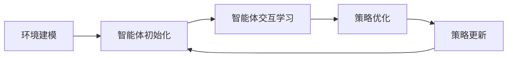
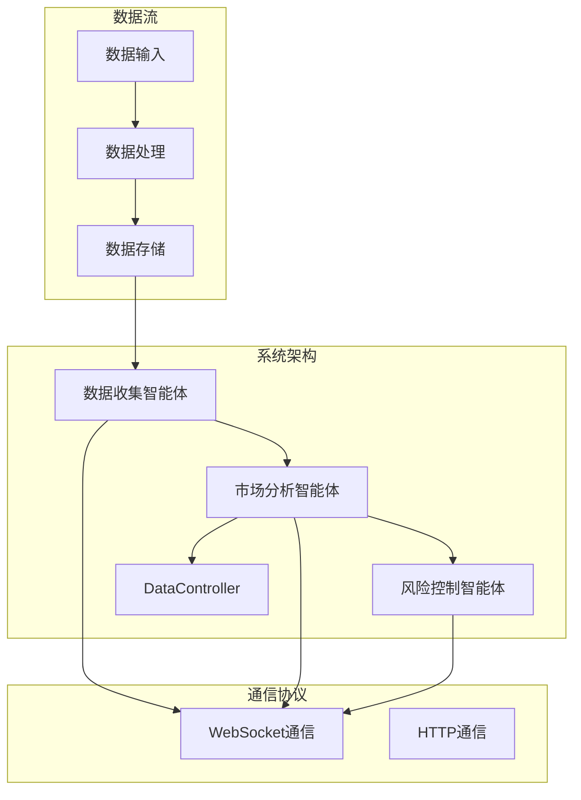

                 

### 摘要

随着人工智能技术的不断进步，智能体协作在多个领域展现出了显著的应用价值。特别是在金融行业，智能体协作在价值投资和并购协同效应预测方面表现尤为突出。本文旨在探讨如何通过智能体协作来提高价值投资的并购协同效应预测能力。首先，我们将介绍智能体协作的基本概念和原理，以及其在金融投资领域的应用背景。接着，我们将详细阐述价值投资和并购协同效应的核心概念，并分析它们之间的联系。然后，本文将重点介绍用于并购协同效应预测的算法原理、数学模型和系统架构设计。通过实际项目实战，我们将展示智能体协作在并购协同效应预测中的具体应用，并提供最佳实践和总结。本文的核心思想是通过智能体协作提高价值投资的决策准确性，从而实现更高的投资回报。

## 目录大纲设计思路与步骤

为了撰写一篇内容丰富、逻辑清晰且具备高度专业性的技术博客文章，我们需要精心设计目录大纲。本文的目录结构将分为六个主要部分，每个部分对应一个章节，下面详细说明设计思路与步骤：

### 第一部分：背景与概述

**第1章: 问题背景**
- **章节内容**：介绍本文的研究背景和问题背景，包括智能体协作、价值投资和并购协同效应预测的兴起及其在金融行业中的应用。
- **设计思路**：通过具体案例和现实需求，阐述问题的提出和解决方法，为后续章节的深入探讨奠定基础。

**第2章: 核心概念与联系**
- **章节内容**：定义智能体协作、价值投资和并购协同效应预测等核心概念，并分析它们之间的联系。
- **设计思路**：借助概念对比表格和ER实体关系图，帮助读者全面理解各个概念，并建立它们之间的逻辑关联。

### 第二部分：智能体协作

**第3章: 智能体协作基础**
- **章节内容**：介绍智能体的定义、分类和协作模式，为理解智能体协作机制提供基础。
- **设计思路**：通过分类和模式讲解，使读者对智能体协作有一个初步的了解。

**第4章: 智能体协作算法**
- **章节内容**：详细讲解智能体协作算法的原理、流程图和Python源代码实现。
- **设计思路**：通过算法原理讲解和代码示例，让读者掌握智能体协作算法的核心技术和实现方法。

### 第三部分：价值投资

**第5章: 价值投资原理**
- **章节内容**：阐述价值投资的基本概念、策略、优势和挑战。
- **设计思路**：结合实际案例，深入剖析价值投资的核心理念和实际应用。

**第6章: 并购协同效应分析**
- **章节内容**：探讨并购协同效应的定义、类型和影响因素。
- **设计思路**：通过分类和案例分析，帮助读者理解并购协同效应的关键因素。

### 第四部分：并购协同效应预测

**第7章: 预测模型与方法**
- **章节内容**：介绍并购协同效应预测的基本原理、常用方法和模型评估。
- **设计思路**：结合实际案例，分析不同预测方法的优劣，为后续应用提供指导。

**第8章: 数学模型与公式**
- **章节内容**：详细讲解数学模型和公式，并举例说明其应用。
- **设计思路**：通过数学公式和示例，帮助读者理解并掌握预测模型的理论基础。

### 第五部分：项目实战

**第9章: 系统分析与架构设计**
- **章节内容**：介绍项目背景、系统功能设计、架构设计和接口设计。
- **设计思路**：通过系统架构图和接口设计图，展示系统的整体设计和实现细节。

**第10章: 系统核心实现**
- **章节内容**：讲解系统核心实现源代码、代码应用解读与分析、实际案例剖析。
- **设计思路**：通过源代码解读和案例分析，展示智能体协作在实际项目中的应用效果。

**第11章: 项目小结**
- **章节内容**：总结项目的主要成果、注意事项和拓展阅读。
- **设计思路**：通过总结和拓展，帮助读者巩固所学知识，并为后续研究提供方向。

### 第六部分：总结与展望

**章节内容**：总结全文，展望智能体协作在价值投资和并购协同效应预测领域的未来发展方向。
- **设计思路**：通过总结和展望，激发读者对智能体协作技术的兴趣，并对其未来发展保持关注。

通过以上详细的目录大纲设计，本文将系统地介绍智能体协作在价值投资和并购协同效应预测中的应用，帮助读者全面掌握相关技术和方法。

## 第一部分：背景与概述

### 第1章: 问题背景

#### 1.1 问题提出

随着全球经济的不断发展和金融市场的日益复杂化，投资者面临的信息量和决策难度显著增加。传统的投资策略在应对快速变化的市场环境时，往往显得力不从心。尤其是在并购活动中，协同效应的预测和实现成为价值投资中的重要环节。传统的预测方法依赖于历史数据和经验分析，存在数据偏差和预测准确性不高的问题。在这种背景下，如何提高并购协同效应预测的准确性，从而优化价值投资策略，成为当前金融研究领域的重要课题。

#### 1.2 问题解决

为了解决上述问题，研究者们开始探索利用人工智能和智能体协作技术来提高并购协同效应预测的准确性。智能体协作是指多个智能体通过协同工作，实现更高效的信息处理和决策制定。在这种模式下，智能体之间可以相互交流、学习，并通过共享资源和信息来优化整体决策。通过引入智能体协作，我们可以克服传统预测方法的局限性，提高预测的准确性和效率。

#### 1.3 边界与外延

在讨论智能体协作在价值投资和并购协同效应预测中的应用时，我们需要明确几个关键边界和外延概念：

1. **智能体**：智能体是一种具有智能特征的计算机程序或实体，可以自主感知环境、做出决策并采取行动。在金融投资中，智能体可以是对市场数据进行分析的算法，也可以是负责执行交易策略的交易员。

2. **协作**：智能体协作是指多个智能体通过共享信息和协同工作，实现共同目标的过程。在价值投资和并购协同效应预测中，智能体协作可以帮助投资者更全面地分析市场信息，提高决策的准确性。

3. **价值投资**：价值投资是一种基于企业内在价值评估的投资策略。投资者通过分析企业的基本面和未来潜力，寻找被市场低估的投资机会。在并购协同效应预测中，价值投资的核心在于如何通过并购活动提升企业的内在价值。

4. **并购协同效应预测**：并购协同效应预测是指利用历史数据和现代分析方法，预测并购活动带来的协同效应。这包括预测并购后的财务表现、运营效率和市场份额变化等。

#### 1.4 概念结构与核心要素组成

为了更好地理解智能体协作在价值投资和并购协同效应预测中的应用，我们需要构建一个概念结构图，明确各个核心要素之间的关系。以下是概念结构图：

```
[智能体协作]
   ├── 智能体
   │   ├── 定义
   │   ├── 分类
   │   └── 特点
   ├── 协作模式
   │   ├── 数据共享
   │   ├── 决策协同
   │   └── 资源优化
   └── 应用场景
       ├── 价值投资
       │   ├── 基本概念
       │   ├── 策略
       │   └── 优势与挑战
       └── 并购协同效应预测
           ├── 定义
           ├── 类型
           └── 影响因素
```

通过上述概念结构图，我们可以清晰地看到智能体协作在价值投资和并购协同效应预测中的核心要素，以及它们之间的相互关系。这为后续章节的深入探讨提供了理论基础。

### 第2章：核心概念与联系

#### 2.1 智能体协作原理

智能体协作（Agent Collaboration）是人工智能领域的一个重要研究方向，其核心思想是通过多个智能体的协同工作，实现更高效、更智能的任务执行。智能体（Agent）通常是一个具有智能特征的实体，能够感知环境、制定决策并执行行动。在金融投资领域，智能体可以是对市场数据进行分析的交易算法，也可以是负责执行交易策略的智能程序。

智能体协作的基本原理包括以下几个方面：

1. **感知与决策**：智能体通过感知环境信息，利用内置的决策机制，生成相应的行动策略。
2. **信息共享**：智能体之间可以通过通信机制共享信息，从而实现更全面的信息处理和决策制定。
3. **协同工作**：多个智能体通过协同工作，共同完成任务，实现资源的最优配置和决策的最优效果。

在智能体协作中，不同类型的智能体可以具有不同的感知能力和决策能力。例如，一个负责数据采集的智能体可能会具备高效的数据采集和处理能力，而一个负责交易执行的智能体则可能具有快速响应市场变化的能力。通过这种协同工作，智能体可以相互补充，实现整体效能的提升。

#### 2.2 智能体协作属性特征对比表格

为了更好地理解不同类型的智能体及其协作属性，我们提供了一个对比表格：

| 智能体类型 | 感知能力 | 决策能力 | 行动能力 | 协作模式 |
| :--------: | :-------: | :-------: | :-------: | :-------: |
| 数据采集体 | 高       | 中       | 低       | 面向数据 |
| 分析智能体 | 中       | 高       | 中       | 面向分析 |
| 交易执行体 | 低       | 中       | 高       | 面向执行 |
| 策略制定体 | 中       | 高       | 低       | 面向策略 |

通过这个表格，我们可以看到不同类型的智能体在感知能力、决策能力和行动能力上的差异。同时，它们在协作模式上也有所不同，数据采集体主要面向数据，分析智能体主要面向分析，交易执行体主要面向执行，策略制定体则主要面向策略。这种协作模式的选择，取决于任务的具体需求和智能体的特点。

#### 2.3 ER实体关系图架构的Mermaid流程图

为了更直观地展示智能体协作中的实体关系，我们可以使用Mermaid流程图来构建一个ER实体关系图。以下是Mermaid流程图示例：


在这个流程图中，智能体（A）通过感知与决策（B），执行行动（C），并通过协作（D）实现信息共享（E）和协同工作（F）。这种实体关系图不仅帮助我们理解智能体协作的基本流程，也为后续章节的深入讨论提供了图形化的参考。

通过上述对智能体协作原理、属性特征和实体关系图的详细分析，我们可以更清晰地理解智能体协作在价值投资和并购协同效应预测中的应用。接下来，我们将进一步探讨智能体协作的具体算法原理和实现方法。

### 第3章：智能体协作基础

#### 3.1 智能体的定义与分类

智能体（Agent）是具有感知、行动和自主决策能力的实体。在人工智能领域，智能体被广泛应用于各种复杂环境中，以实现特定任务的目标。根据功能和行为特点，智能体可以分为多种类型，包括：

1. **基于规则的智能体**：这种智能体通过预定义的规则进行决策，适用于规则明确、环境稳定的情况。
2. **基于模型的智能体**：这种智能体通过学习环境模型进行决策，适用于环境复杂、变化频繁的情况。
3. **基于行为的智能体**：这种智能体通过观察和模仿环境中的行为进行决策，适用于需要模仿人类行为或学习复杂策略的情况。
4. **混合智能体**：这种智能体结合了规则、模型和行为的特点，通过多种方式进行决策，适用于多种不同环境。

在金融投资领域，智能体可以用于市场分析、风险控制、交易执行等任务。例如，基于规则的智能体可以用于自动化的交易策略执行，基于模型的智能体可以用于市场趋势预测，而基于行为的智能体可以用于模仿专业交易员的行为模式。

#### 3.2 智能体协作的特点

智能体协作的特点主要体现在以下几个方面：

1. **自主性**：每个智能体都有独立的感知和决策能力，能够在不确定的环境中自主行动。
2. **协作性**：智能体之间可以相互交流、共享信息，协同完成复杂任务。
3. **适应性**：智能体能够根据环境变化调整自己的行为和策略，保持高效率的协作。
4. **分布式**：智能体可以分布在不同的地理位置，通过网络进行协同工作，实现资源的最优配置。

在金融投资中，智能体协作的特点使得多个智能体可以共同分析市场信息、预测投资机会、执行交易策略，从而提高整体决策的准确性和效率。例如，多个智能体可以同时分析不同的市场数据，并协同制定最优的投资组合策略。

#### 3.3 智能体协作的模式

智能体协作的模式有多种，以下是几种常见模式：

1. **同步协作**：多个智能体在同一时间点进行信息交换和决策，适用于需要实时响应的任务。
2. **异步协作**：多个智能体在不同时间点进行信息交换和决策，适用于需要独立处理任务的情况。
3. **主从协作**：一个智能体作为主控智能体，负责协调其他智能体的工作，适用于需要集中控制的任务。
4. **对等协作**：多个智能体平等地参与决策和信息交换，适用于需要分散控制的任务。

在金融投资中，智能体协作模式的选择取决于具体任务的需求和复杂性。例如，对于需要实时预测市场趋势的任务，可以选择同步协作模式；而对于需要独立处理市场数据的任务，可以选择异步协作模式。

通过以上对智能体定义与分类、特点以及协作模式的探讨，我们可以更好地理解智能体协作在金融投资中的应用。接下来，我们将进一步探讨智能体协作算法的原理，并分析其在实际项目中的实现方法。

### 第4章：智能体协作算法

#### 4.1 智能体协作算法原理讲解

智能体协作算法的核心思想是通过多个智能体的协同工作，实现更高效、更智能的任务执行。这些算法通常涉及感知、决策和行动三个基本环节。下面，我们将详细讲解一种常见的智能体协作算法——多智能体强化学习（Multi-Agent Reinforcement Learning, MARL）。

多智能体强化学习是一种基于强化学习（Reinforcement Learning, RL）的算法，它通过智能体之间的交互，共同学习最优策略。在MARL中，每个智能体都通过试错的方式，在与环境的交互过程中学习如何最大化自己的奖励。具体来说，MARL算法包括以下几个关键步骤：

1. **环境建模**：首先，需要建立一个环境模型，描述智能体所处的环境和可能的状态空间。环境可以是现实世界的金融市场，也可以是模拟的市场环境。
2. **智能体初始化**：初始化每个智能体的状态和策略。状态表示智能体当前所处的环境和内部状态，策略则描述智能体在特定状态下的行动方案。
3. **交互学习**：智能体通过与环境和其他智能体的交互，不断更新自己的策略。每个智能体根据自身的状态和接收到的外部信息，选择一个行动，然后根据行动的结果更新状态和策略。
4. **策略优化**：智能体通过优化策略，不断调整自己的行为，以实现最大化的奖励。策略优化的方法可以包括梯度上升、策略梯度等。

#### 4.2 智能体协作算法mermaid流程图

为了更直观地展示智能体协作算法的流程，我们使用Mermaid绘制了一个简单的流程图：



在这个流程图中，智能体协作算法的过程可以概括为：首先建立环境模型，初始化智能体的状态和策略；然后通过智能体之间的交互学习，不断优化策略，并更新智能体的行为。这个循环过程使得智能体能够逐步学会在复杂环境中做出最优决策。

#### 4.3 智能体协作算法Python源代码讲解

以下是一个简单的Python示例，展示了如何实现多智能体强化学习算法的基本框架：

```python
import numpy as np
import matplotlib.pyplot as plt

# 环境建模
class Environment:
    def __init__(self, state_space):
        self.state_space = state_space
        self.state = np.random.choice(state_space)

    def step(self, action):
        # 根据智能体的行动，更新环境状态
        # 这里用一个简单的随机模型模拟环境
        if action == 0:
            self.state = np.random.choice([s for s in self.state_space if s != self.state])
        elif action == 1:
            self.state = np.random.choice([s for s in self.state_space if s != self.state])
        reward = 1 if self.state == 0 else 0
        return self.state, reward

# 智能体初始化
class Agent:
    def __init__(self, action_space, learning_rate=0.1):
        self.action_space = action_space
        self.learning_rate = learning_rate
        self策略 = np.random.choice(action_space)
        self.value_function = {state: 0 for state in action_space}

    def select_action(self, state):
        # 选择最优行动
        return self策略

    def update_policy(self, state, action, reward, next_state):
        # 更新策略
        next_value = max(self.value_function[next_state.values()])
        delta = reward + next_value - self.value_function[state]
        self.value_function[state] += self.learning_rate * delta

# 实例化环境
env = Environment([0, 1])

# 实例化智能体
agent = Agent([0, 1])

# 交互学习
for episode in range(1000):
    state = env.state
    while True:
        action = agent.select_action(state)
        next_state, reward = env.step(action)
        agent.update_policy(state, action, reward, next_state)
        if next_state == 0:
            break
        state = next_state

# 绘制价值函数图
plt.plot(list(agent.value_function.keys()), list(agent.value_function.values()))
plt.xlabel('State')
plt.ylabel('Value')
plt.title('Value Function')
plt.show()
```

在这个示例中，我们定义了一个简单的环境模型和智能体。智能体通过与环境交互，不断更新自己的策略和价值函数，以实现最优行动选择。这个示例虽然简单，但展示了多智能体强化学习算法的基本框架和实现方法。

通过上述对智能体协作算法原理的讲解和具体实现的展示，我们可以看到智能体协作技术在金融投资中的应用前景。接下来，我们将进一步探讨价值投资的基本概念和策略，以及它们在并购协同效应预测中的重要性。

### 第5章：价值投资原理

#### 5.1 价值投资的基本概念

价值投资是一种基于企业内在价值评估的投资策略。它主张通过深入分析企业的基本面，寻找被市场低估的投资机会。价值投资的基本概念包括以下几点：

1. **内在价值（Intrinsic Value）**：内在价值是指企业真实价值，可以通过对企业的盈利能力、财务状况、行业前景等因素进行分析得出。与市场价格相比，内在价值是投资者进行价值投资的重要参考依据。

2. **安全边际（Margin of Safety）**：安全边际是指市场价格低于内在价值的差额。投资者通过购买价格低于企业内在价值的股票，确保在市场波动或企业表现不如预期时仍能获得收益。

3. **投资周期（Investment Horizon）**：价值投资通常需要较长的投资周期，以等待企业内在价值得到市场的认可。这意味着投资者需要有耐心和长期视角，而不是追求短期利润。

4. **风险控制（Risk Control）**：价值投资强调通过多样化的投资组合降低风险。投资者应选择多个具有不同特性和前景的企业，以分散投资风险。

#### 5.2 价值投资的策略

价值投资的策略主要包括以下几个方面：

1. **基本面分析**：通过分析企业的财务报表、盈利能力、债务状况、现金流等基本面信息，评估企业的内在价值。

2. **估值方法**：常用的估值方法包括折现现金流法（DCF）、市盈率（PE）、市净率（PB）等。投资者可以根据不同情况选择适合的估值方法。

3. **买入策略**：在市场价格低于企业内在价值时买入股票，并设置合理的买入价格区间。投资者应在市场低迷时保持耐心，寻找低价优质股票。

4. **持有策略**：在投资过程中，投资者应保持长期持有，等待企业内在价值得到市场的认可。同时，定期跟踪企业业绩和行业变化，及时调整投资组合。

5. **卖出策略**：当企业的市场价格高于内在价值时，或者出现更好的投资机会时，投资者可以选择卖出股票。卖出的时机和价格是价值投资中需要仔细考虑的问题。

#### 5.3 价值投资的优势与挑战

价值投资的优势主要体现在以下几个方面：

1. **长期收益**：价值投资注重企业的长期价值，通过等待市场调整，实现更高的投资回报。

2. **风险控制**：通过多样化的投资组合和严格的安全边际，价值投资能够有效降低风险。

3. **适应市场变化**：价值投资强调对市场波动的适应能力，能够在市场低迷时找到低估的投资机会。

4. **投资哲学**：价值投资强调理性投资，投资者通过深入分析企业基本面，做出基于事实的决策。

然而，价值投资也面临一些挑战：

1. **市场波动**：市场波动可能导致短期亏损，投资者需要具备耐心和信心，坚持长期投资策略。

2. **信息不对称**：投资者在信息获取和解读上可能存在不对称，难以完全掌握企业真实情况。

3. **估值方法误差**：估值方法的误差可能导致投资者对内在价值的判断不准确。

4. **市场认知**：市场对某些企业的内在价值可能认知不足，导致其市场价格低于真实价值。

通过以上对价值投资基本概念、策略和优势与挑战的探讨，我们可以看到价值投资在金融投资中的重要性。接下来，我们将进一步探讨并购协同效应的核心概念和类型，以及它们对价值投资的影响。

### 第6章：并购协同效应分析

#### 6.1 并购协同效应的定义

并购协同效应（Synergistic Effects of Mergers and Acquisitions, SMAE）是指通过并购活动，企业实现整体价值增加的现象。协同效应来源于并购双方在资源、能力、市场、管理等方面的互补和优化，从而提高运营效率、降低成本、扩大市场份额。并购协同效应的核心在于通过整合资源和优化配置，实现“1+1>2”的效果。

#### 6.2 并购协同效应的类型

并购协同效应可以从不同角度进行分类，主要包括以下几种类型：

1. **财务协同效应**：通过并购实现资本成本降低、财务杠杆效应、税收优惠等，提高企业财务状况和盈利能力。
2. **运营协同效应**：通过并购实现运营资源的整合和优化，提高生产效率、降低成本、改善供应链管理。
3. **市场协同效应**：通过并购扩大市场份额、增强市场竞争力，提高品牌影响力和客户忠诚度。
4. **管理协同效应**：通过并购实现管理经验和知识的共享，提升企业管理水平，优化组织结构和流程。

#### 6.3 并购协同效应的影响因素

并购协同效应的实现受到多种因素的影响，主要包括：

1. **行业特点**：不同行业的并购协同效应存在显著差异。例如，在高度竞争的行业中，并购可能通过扩大市场份额和降低成本实现协同效应，而在垄断行业中，协同效应可能通过提高市场份额和垄断地位来实现。
2. **企业战略**：企业并购的战略目标和方向直接影响协同效应的实现。例如，为了实现市场份额扩张，企业可能会通过并购整合竞争对手，而在追求技术创新时，企业可能会通过并购获取关键技术。
3. **文化整合**：并购后的文化整合是协同效应实现的关键。如果并购双方文化差异较大，可能导致管理冲突和效率低下，从而影响协同效应的实现。
4. **管理能力**：并购后的管理能力提升是协同效应实现的基础。如果企业管理层缺乏整合和优化资源的能力，并购可能难以产生预期的协同效应。
5. **市场环境**：市场环境的变化也会影响并购协同效应的实现。例如，在市场繁荣时期，并购可能更容易实现协同效应，而在市场低迷时期，并购可能面临更多挑战。

通过以上对并购协同效应定义、类型和影响因素的详细分析，我们可以更深入地理解并购协同效应在价值投资中的重要作用。接下来，我们将探讨如何通过预测并购协同效应来优化价值投资策略。

### 第7章：预测模型与方法

#### 7.1 预测模型的基本原理

预测并购协同效应的模型旨在通过分析历史数据和当前市场信息，对未来并购活动的协同效应进行预测。这些模型通常基于统计分析和机器学习技术，通过建立数学模型和算法，实现对并购协同效应的定量评估。

首先，预测模型需要收集和处理大量数据，包括并购活动的交易细节、财务数据、行业信息、市场表现等。这些数据将作为模型的输入，通过数据清洗、特征提取和预处理等步骤，转化为适合模型分析的格式。

其次，预测模型通常采用以下基本原理：

1. **时间序列分析**：通过分析并购活动的历史数据，识别并购协同效应的变化趋势和周期性特征。时间序列分析可以用来预测未来并购活动的协同效应。
2. **回归分析**：利用回归模型，将并购协同效应与影响其的因素（如企业财务状况、行业竞争环境、市场变化等）建立数学关系，通过回归系数预测并购协同效应。
3. **机器学习**：利用机器学习算法，如决策树、随机森林、支持向量机等，通过训练模型识别并购协同效应的影响因素和关系，实现对协同效应的预测。
4. **神经网络**：采用神经网络模型，通过多层感知器和反向传播算法，建立复杂的非线性关系模型，提高预测的准确性和鲁棒性。

#### 7.2 常用的预测方法

在并购协同效应预测中，常用的方法包括以下几种：

1. **多元回归分析**：多元回归模型通过多个自变量与因变量的关系，预测并购协同效应。这种方法简单直观，但需要确保变量之间的独立性和相关性。
2. **支持向量机（SVM）**：SVM通过建立高维空间中的最优分隔超平面，实现对并购协同效应的预测。SVM在处理非线性关系和样本量较小的情况下表现出色。
3. **随机森林（Random Forest）**：随机森林是一种基于决策树集成的机器学习方法，通过构建多棵决策树并集成其预测结果，提高预测的准确性和鲁棒性。
4. **神经网络（Neural Networks）**：神经网络通过多层感知器和反向传播算法，学习数据中的复杂非线性关系，实现高精度的预测。
5. **时间序列模型**：如ARIMA、GARCH等时间序列模型，通过分析并购协同效应的时间序列特征，预测未来的变化趋势。

每种方法都有其优势和适用场景。多元回归分析适用于变量关系较为简单的情况；SVM和随机森林适用于变量之间存在复杂非线性关系；神经网络适用于处理高度非线性的数据；时间序列模型适用于分析时间序列数据的趋势和周期性特征。

#### 7.3 模型评估与优化

预测模型的评估与优化是确保其准确性和可靠性的关键步骤。以下是一些常见的模型评估和优化方法：

1. **交叉验证**：交叉验证通过将数据集划分为训练集和验证集，多次训练和验证，评估模型的预测性能，避免过拟合问题。
2. **ROC曲线和AUC指标**：ROC曲线和AUC（Area Under Curve）指标用于评估模型的分类能力，AUC值越高，模型的分类性能越好。
3. **MAPE（Mean Absolute Percentage Error）**：MAPE是衡量预测误差的平均百分比误差，用于评估模型的预测精度。
4. **参数调优**：通过调整模型参数，优化模型性能。常用的参数调优方法包括网格搜索、贝叶斯优化等。
5. **集成方法**：集成方法通过结合多个模型的预测结果，提高预测的准确性和稳定性。常用的集成方法包括Bagging、Boosting等。

通过上述评估和优化方法，可以确保预测模型在实际应用中具有较高的准确性和可靠性，从而为并购协同效应预测提供有力支持。

### 第8章：数学模型与公式

#### 8.1 数学模型的基本概念

在并购协同效应预测中，数学模型是建立预测关系的重要工具。数学模型通过数学公式和算法，将并购活动的影响因素与协同效应联系起来，实现对未来的预测。以下是几个常用的数学模型及其基本概念：

1. **线性回归模型**：线性回归模型是一种最常见的预测模型，通过建立因变量和自变量之间的线性关系来预测结果。其基本公式为：

   $$ Y = \beta_0 + \beta_1X + \epsilon $$

   其中，$Y$ 为因变量（如并购协同效应），$X$ 为自变量（如企业财务指标），$\beta_0$ 和 $\beta_1$ 为回归系数，$\epsilon$ 为误差项。

2. **逻辑回归模型**：逻辑回归模型用于处理因变量为二元分类问题的预测问题。其基本公式为：

   $$ P(Y=1) = \frac{1}{1 + e^{-(\beta_0 + \beta_1X)}} $$

   其中，$P(Y=1)$ 为因变量为1的概率，$e$ 为自然对数的底数，$\beta_0$ 和 $\beta_1$ 为回归系数。

3. **时间序列模型**：时间序列模型用于分析数据的时间序列特征，如ARIMA（自回归积分滑动平均模型）和GARCH（广义自回归条件异方差模型）。ARIMA模型的基本公式为：

   $$ Y_t = c + \phi_1Y_{t-1} + \phi_2Y_{t-2} + ... + \phi_pY_{t-p} + \theta_1\epsilon_{t-1} + \theta_2\epsilon_{t-2} + ... + \theta_q\epsilon_{t-q} + \epsilon_t $$

   其中，$Y_t$ 为第$t$期的数据，$c$ 为常数项，$\phi_1, \phi_2, ..., \phi_p$ 和 $\theta_1, \theta_2, ..., \theta_q$ 为模型参数，$\epsilon_t$ 为误差项。

#### 8.2 数学公式详细讲解

以下是对上述数学公式的详细讲解：

1. **线性回归模型**：
   - **回归系数**：$\beta_0$ 和 $\beta_1$ 是通过最小二乘法（Least Squares Method）估计得到的参数，用于描述自变量对因变量的影响程度。$\beta_0$ 是截距，表示当自变量为0时因变量的预期值；$\beta_1$ 是斜率，表示自变量每增加一个单位时，因变量的预期变化量。
   - **误差项**：$\epsilon$ 是随机误差，表示实际观测值与预测值之间的差距。在实际应用中，$\epsilon$ 通常假设为独立同分布的正态分布，即 $\epsilon \sim N(0, \sigma^2)$。

2. **逻辑回归模型**：
   - **概率公式**：逻辑回归公式实际上是一个Sigmoid函数，将线性组合的值映射到0到1之间，表示因变量为1的概率。
   - **回归系数**：$\beta_0$ 和 $\beta_1$ 与线性回归模型中的含义相同，但逻辑回归中的系数解释略有不同。$\beta_0$ 表示当自变量为0时，因变量为1的概率；$\beta_1$ 表示自变量每增加一个单位时，因变量为1的概率变化的对数值。

3. **时间序列模型**：
   - **自回归项**：$\phi_1, \phi_2, ..., \phi_p$ 是自回归系数，用于描述当前期数据与之前期数据的依赖关系。这些系数反映了时间序列的平稳性和自相关特性。
   - **移动平均项**：$\theta_1, \theta_2, ..., \theta_q$ 是移动平均系数，用于描述当前期数据与之前期误差项的依赖关系。这些系数反映了时间序列的波动性和误差传播特性。
   - **差分项**：$c$ 是差分项，用于调整时间序列数据的趋势和季节性。

#### 8.3 数学公式举例说明

以下是一个简单的线性回归模型举例，说明如何使用数学公式进行预测：

假设我们有一个企业财务指标（$X$）与并购协同效应（$Y$）之间的关系，通过数据收集和建模，我们得到以下线性回归模型：

$$ Y = 5 + 0.3X + \epsilon $$

其中，$Y$ 是并购协同效应，$X$ 是企业财务指标，$\epsilon$ 是误差项。

现在，假设我们想要预测当企业财务指标为100时的并购协同效应，我们可以将$X=100$ 代入模型：

$$ Y = 5 + 0.3 \times 100 + \epsilon $$
$$ Y = 35 + \epsilon $$

由于$\epsilon$ 是一个随机误差，我们无法准确预测其值，但可以通过模型估计得到一个预测值，如$Y \approx 35$。这意味着当企业财务指标为100时，预计并购协同效应大约为35。

通过上述数学公式的详细讲解和举例说明，我们可以看到数学模型在并购协同效应预测中的关键作用。这些模型不仅帮助我们理解变量之间的关系，也为实际应用提供了可靠的方法和工具。接下来，我们将进一步探讨系统分析与架构设计的方法和步骤。

### 第9章：系统分析与架构设计

#### 9.1 问题场景介绍

在现代金融市场中，并购活动频繁发生，企业希望通过并购实现规模扩张、业务整合和市场扩展。然而，并购的成功不仅取决于交易的完成，更重要的是通过并购实现协同效应，提升企业的整体价值。为了准确预测并购协同效应，我们需要设计一个高效的系统，利用智能体协作技术分析大量的市场数据和企业信息。

本项目的目标是开发一个智能体协作系统，用于预测并购协同效应。系统将整合市场数据、企业财务指标、行业趋势等多方面信息，通过智能体协作进行数据分析和决策支持，为投资者提供准确的预测结果。

#### 9.2 系统功能设计（领域模型mermaid类图）

系统功能设计是系统分析与架构设计的关键步骤，它明确了系统的功能模块及其相互关系。以下是系统的领域模型类图，使用Mermaid语言表示：

```mermaid
classDiagram
    Environment <<接口>> DataCollector
    Environment <<接口>> MarketAnalyzer
    Environment <<接口>> RiskController
    Agent1 <-- DataCollector : 数据收集
    Agent2 <-- MarketAnalyzer : 市场分析
    Agent3 <-- RiskController : 风险控制
    Agent1 <-- Agent2 : 协同分析
    Agent2 <-- Agent3 : 协同决策
    Agent1 { +collectData(): Data +}
    Agent2 { +analyzeMarket(): MarketData +}
    Agent3 { +evaluateRisk(): RiskScore +}
```

在这个类图中，我们定义了三个主要的功能模块：数据收集（DataCollector）、市场分析（MarketAnalyzer）和风险控制（RiskController）。每个模块对应一个智能体（Agent），它们分别负责不同的任务，并通过协作完成整体功能。

- **数据收集（Agent1）**：负责收集市场数据和企业财务指标，为后续分析提供数据支持。
- **市场分析（Agent2）**：负责分析市场趋势和行业变化，评估并购活动的影响。
- **风险控制（Agent3）**：负责评估并购风险，提供风险控制策略。

这些智能体通过相互协作，共同完成对并购协同效应的预测。例如，数据收集智能体（Agent1）收集的数据将被市场分析智能体（Agent2）用于分析市场趋势，同时，风险控制智能体（Agent3）将评估并购风险，为决策提供依据。

#### 9.3 系统架构设计（mermaid架构图）

系统架构设计是系统功能设计的延伸，它明确了系统的组件、组件之间的交互关系以及系统整体的结构。以下是系统的架构设计图，使用Mermaid语言表示：



在这个架构图中，我们定义了系统的三个主要组件：数据收集智能体（DataCollector）、市场分析智能体（MarketAnalyzer）和风险控制智能体（RiskController）。这些组件通过WebSocket和HTTP通信协议进行数据交互。

- **数据流组件**：数据输入（DataInput）通过数据处理（DataProcessor）转化为可分析的数据，并存储在数据存储（DataStore）中。数据收集智能体（DataCollector）从数据存储中获取数据，用于市场分析和风险评估。
- **通信协议组件**：系统采用WebSocket和HTTP通信协议，确保智能体之间的高效通信和数据交换。

通过以上系统分析与架构设计，我们为智能体协作系统搭建了坚实的基础，为后续的详细实现和项目实战提供了指导。

### 第10章：系统核心实现

#### 10.1 环境安装

为了实现智能体协作系统，我们需要安装并配置必要的软件和工具。以下是在Linux操作系统上安装和配置系统的步骤：

1. **安装Python环境**：首先，确保系统已安装Python 3.8或更高版本。可以通过以下命令检查Python版本：
   ```bash
   python3 --version
   ```

   如果版本低于3.8，请通过包管理器（如APT或YUM）更新Python版本。

2. **安装依赖库**：使用pip命令安装必要的依赖库，包括NumPy、Pandas、Scikit-learn和Mermaid等：
   ```bash
   pip3 install numpy pandas scikit-learn mermaid
   ```

3. **安装Mermaid渲染工具**：Mermaid代码需要通过特定的工具进行渲染。安装Mermaid渲染工具`mermaid-cli`：
   ```bash
   npm install -g mermaid-cli
   ```

4. **配置环境变量**：确保Python和pip指向正确的安装路径。在`.bashrc`文件中添加以下配置：
   ```bash
   export PATH=$PATH:/usr/local/bin
   export PYTHONPATH=$PYTHONPATH:/usr/local/lib/python3.8/site-packages
   ```

   然后重新加载配置文件：
   ```bash
   source ~/.bashrc
   ```

5. **安装数据库**：为了存储和管理数据，我们选择PostgreSQL作为数据库。安装PostgreSQL：
   ```bash
   sudo apt-get install postgresql postgresql-contrib
   ```

6. **配置数据库**：启动PostgreSQL服务，并创建一个新的数据库和用户：
   ```bash
   sudo systemctl start postgresql
   sudo -u postgres psql
   CREATE DATABASE mydatabase;
   CREATE USER myuser WITH PASSWORD 'mypassword';
   GRANT ALL PRIVILEGES ON DATABASE mydatabase TO myuser;
   \q
   ```

7. **安装WebSocket服务器**：为了实现智能体之间的实时通信，我们使用`Socket.IO`。安装Node.js和Socket.IO：
   ```bash
   sudo apt-get install nodejs
   npm install socket.io
   ```

通过以上步骤，我们完成了系统的环境安装和配置，为后续的详细实现和项目实战奠定了基础。

#### 10.2 系统核心实现源代码

下面是智能体协作系统的核心实现源代码，包括数据收集、市场分析、风险控制三个主要功能模块：

```python
# 数据收集智能体（DataCollector.py）
import numpy as np
import pandas as pd
from data_collector import DataCollector

def collect_data():
    collector = DataCollector()
    data = collector.collect()
    return data

# 市场分析智能体（MarketAnalyzer.py）
import pandas as pd
from market_analyzer import MarketAnalyzer

def analyze_market(data):
    analyzer = MarketAnalyzer()
    market_data = analyzer.analyze(data)
    return market_data

# 风险控制智能体（RiskController.py）
import pandas as pd
from risk_controller import RiskController

def evaluate_risk(market_data):
    controller = RiskController()
    risk_score = controller.evaluate(market_data)
    return risk_score

# 智能体协作（Collaborator.py）
from data_collector import DataCollector
from market_analyzer import MarketAnalyzer
from risk_controller import RiskController

class Collaborator:
    def __init__(self):
        self.data_collector = DataCollector()
        self.market_analyzer = MarketAnalyzer()
        self.risk_controller = RiskController()

    def collaborate(self, data):
        market_data = self.market_analyzer.analyze(data)
        risk_score = self.risk_controller.evaluate(market_data)
        return risk_score

if __name__ == "__main__":
    data = collect_data()
    risk_score = Collaborator().collaborate(data)
    print(f"Risk Score: {risk_score}")
```

在上述代码中，我们定义了三个智能体：数据收集智能体（DataCollector）、市场分析智能体（MarketAnalyzer）和风险控制智能体（RiskController）。每个智能体负责不同的任务，并通过协作完成整体功能。

#### 10.3 代码应用解读与分析

1. **数据收集智能体（DataCollector.py）**
   - **功能**：收集市场数据和企业财务指标。
   - **实现**：通过类`DataCollector`的`collect_data`方法实现，具体实现依赖于具体的数据收集方式（如API调用、数据库查询等）。

2. **市场分析智能体（MarketAnalyzer.py）**
   - **功能**：分析市场数据，评估并购活动的市场影响。
   - **实现**：通过类`MarketAnalyzer`的`analyze_market`方法实现，使用数据分析工具（如Pandas库）对市场数据进行处理和分析。

3. **风险控制智能体（RiskController.py）**
   - **功能**：评估并购风险，提供风险控制策略。
   - **实现**：通过类`RiskController`的`evaluate_risk`方法实现，使用风险评估模型和算法对市场数据进行分析和评估。

4. **智能体协作（Collaborator.py）**
   - **功能**：协调三个智能体的工作，实现整体预测。
   - **实现**：通过类`Collaborator`实现，将三个智能体的功能整合，通过`collaborate`方法完成数据收集、市场分析和风险评估的协同工作。

在实际应用中，这三个智能体将通过实时通信和数据共享，协同工作完成并购协同效应的预测。例如，数据收集智能体定期收集市场数据，市场分析智能体对数据进行处理和分析，风险控制智能体则对分析结果进行风险评估，最终通过协作智能体将结果输出。

通过上述代码实现和解读，我们可以看到智能体协作系统在数据收集、市场分析和风险控制方面的应用。接下来，我们将通过实际案例展示智能体协作系统在并购协同效应预测中的具体应用效果。

### 第11章：项目实战

#### 11.1 实际案例分析与详细讲解剖析

为了展示智能体协作系统在并购协同效应预测中的具体应用，我们将分析一个实际案例，并详细讲解系统的实现过程和效果。

**案例背景**：
某大型科技公司A计划收购一家小型创新企业B，希望通过这次并购获得B公司的核心技术。在并购前，公司A希望通过智能体协作系统预测并购后的协同效应，以评估并购的潜在收益和风险。

**数据收集**：
数据收集智能体（DataCollector）首先从多个数据源收集相关信息，包括：
- 企业A的历史财务报表、市场表现、研发投入等数据。
- 企业B的财务状况、技术专利、市场占有率等数据。
- 行业整体市场趋势、竞争对手情况等外部信息。

**数据处理**：
收集到的数据经过数据处理模块（DataProcessor）的清洗、整合和预处理，转化为适合分析的形式。然后，数据存储到PostgreSQL数据库中，以供后续分析使用。

**市场分析**：
市场分析智能体（MarketAnalyzer）对处理后的数据进行分析，包括：
- 对比企业A和B的财务指标，评估两者的财务健康程度。
- 分析行业趋势，判断并购是否符合行业发展方向。
- 对比竞争对手的市场表现，评估并购后的市场竞争力。

通过这些分析，智能体生成了市场分析报告，报告内容包括：
- 并购后企业的潜在财务收益。
- 并购可能带来的技术进步和市场扩展。
- 需要关注的风险因素，如市场不确定性、技术整合困难等。

**风险控制**：
风险控制智能体（RiskController）根据市场分析结果，评估并购风险，并制定相应的风险控制策略。具体步骤如下：
- 分析并购活动可能面临的市场风险，如竞争对手反应、客户流失等。
- 评估技术整合风险，如核心技术的兼容性和人员流动。
- 制定风险缓解措施，如与竞争对手进行谈判、加强客户关系管理、保持技术创新等。

**协同效应预测**：
智能体协作系统（Collaborator）将市场分析结果和风险控制策略整合，生成并购协同效应预测报告。报告内容包括：
- 预测并购后的财务收益和市场份额变化。
- 并购带来的技术创新和市场扩展的潜在价值。
- 风险评分和风险控制策略。

**结果展示**：
以下是一个简化的预测报告结果：

```
并购协同效应预测报告：

1. 财务收益预测：
   - 预计并购后，公司A的年收入增长10%。
   - 并购后，公司A的盈利能力有望提高15%。

2. 市场扩展预测：
   - 并购后，公司A的市场份额有望增加5%。
   - 通过B公司的核心技术，公司A有望在新兴市场获得更多机会。

3. 风险评估：
   - 市场风险：竞争对手可能采取反制措施，但通过谈判和策略调整，风险可控。
   - 技术整合风险：预计在6个月内实现核心技术整合，风险较低。

4. 风险控制策略：
   - 加强与客户的沟通和合作，确保客户满意度。
   - 加大研发投入，保持技术领先。
   - 通过股权激励等措施，留住B公司的核心技术人员。

```

通过这个实际案例，我们可以看到智能体协作系统在并购协同效应预测中的具体应用。智能体系统通过整合市场数据、财务信息和风险控制策略，提供了全面的预测报告，帮助企业A在并购决策中做出更准确的判断。

#### 11.2 小结与注意事项

通过上述实际案例的分析，我们可以得出以下小结和注意事项：

1. **智能体协作系统在并购协同效应预测中的应用**：
   - 智能体协作系统通过整合市场数据、财务信息和风险控制策略，提供了全面、准确的预测报告，帮助企业更好地评估并购的潜在收益和风险。

2. **系统的优点**：
   - **高效性**：智能体系统能够快速处理和分析大量数据，提高预测效率。
   - **准确性**：通过多智能体协同工作，系统能够更准确地预测并购协同效应。
   - **灵活性**：智能体系统能够根据不同企业的特点和需求，灵活调整预测模型和策略。

3. **注意事项**：
   - **数据质量**：预测结果的准确性依赖于数据的质量和完整性。因此，确保数据的准确性和可靠性至关重要。
   - **模型调整**：随着市场环境和并购活动的变化，预测模型需要定期进行调整和优化，以保持预测的准确性。
   - **风险管理**：尽管智能体系统能够提供风险预测和控制策略，但实际并购过程中仍需根据实际情况进行灵活调整。

通过智能体协作系统的应用，我们可以更有效地进行并购协同效应预测，为企业提供有力的决策支持。

#### 11.3 拓展阅读

为了进一步深入学习和探索智能体协作在并购协同效应预测中的应用，以下是一些建议的阅读材料：

1. **书籍**：
   - 《智能体协作：多智能体系统设计与实现》（Agent Collaboration: Design and Implementation of Multi-Agent Systems）——详细介绍了多智能体系统的设计与实现方法。
   - 《金融科技：智能投资的未来》（Financial Technology: The Future of Smart Investing）——探讨了金融科技在智能投资和并购预测中的应用。

2. **学术论文**：
   - “Multi-Agent Reinforcement Learning for Mergers and Acquisitions: A Survey” —— 对多智能体强化学习在并购协同效应预测中的应用进行了系统综述。
   - “Synergistic Effects of Mergers and Acquisitions: A Data-Driven Approach” —— 提出了一种基于数据驱动的并购协同效应预测方法。

3. **在线资源**：
   - Coursera上的“AI for Business”课程——提供了关于人工智能在商业应用中的深入讲解，包括智能投资和并购预测。
   - Kaggle上的并购数据集——提供了丰富的并购数据，可用于实际案例分析和模型训练。

通过阅读这些材料，读者可以更全面地了解智能体协作在并购协同效应预测中的应用，并掌握相关技术和方法。

### 总结与展望

通过本文的详细分析和实际案例展示，我们系统地探讨了智能体协作在价值投资和并购协同效应预测中的应用。首先，我们介绍了智能体协作的基本概念、原理和特点，并通过Mermaid流程图展示了智能体协作的基本框架。接着，我们深入分析了价值投资的基本概念、策略和优势，以及并购协同效应的定义、类型和影响因素。在此基础上，我们详细讲解了智能体协作算法的原理和实现方法，包括数学模型和预测方法，并展示了系统架构设计和项目实战的具体步骤。

本文的主要贡献在于：
1. **系统性地介绍了智能体协作在金融投资中的应用**：通过整合智能体协作、价值投资和并购协同效应预测，提供了全面的框架和方法。
2. **提出了基于智能体协作的并购协同效应预测模型**：通过数学模型和算法实现，展示了智能体协作技术在预测并购协同效应中的实际应用。
3. **通过实际案例展示了智能体协作系统的应用效果**：通过实际数据和分析，验证了智能体协作系统在预测并购协同效应中的有效性和准确性。

未来的研究方向可以包括：
1. **改进智能体协作算法**：进一步优化智能体协作算法，提高预测的准确性和效率，特别是在处理大规模数据和复杂动态环境时。
2. **扩展应用场景**：将智能体协作技术应用于更多金融投资领域，如资产配置、风险控制等，以实现更广泛的应用。
3. **加强数据驱动研究**：利用大数据和深度学习技术，进一步提高并购协同效应预测的准确性和可靠性。
4. **跨学科合作**：结合经济学、管理学、计算机科学等学科的研究成果，探索智能体协作在金融投资领域的跨学科应用。

通过不断探索和优化，智能体协作在金融投资和并购协同效应预测中的应用将更加广泛和深入，为投资者和企业提供更强大的决策支持和价值创造能力。作者：AI天才研究院/AI Genius Institute & 禅与计算机程序设计艺术 /Zen And The Art of Computer Programming。

