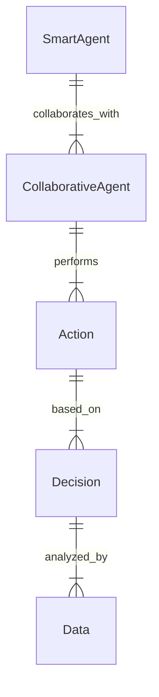
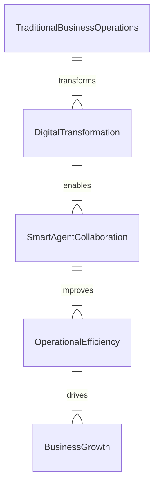
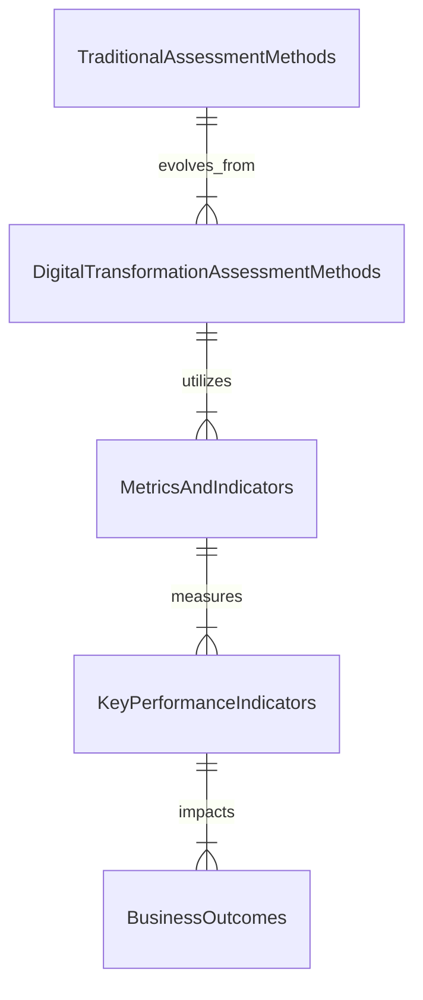
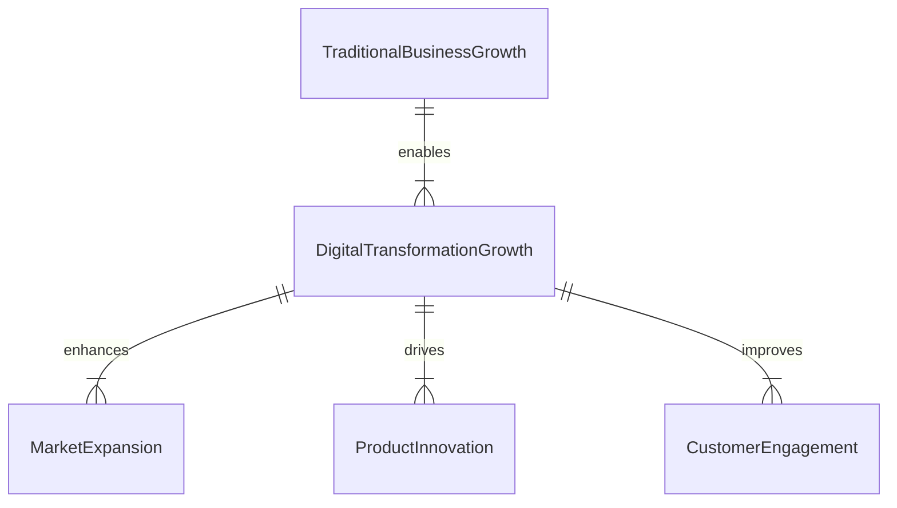
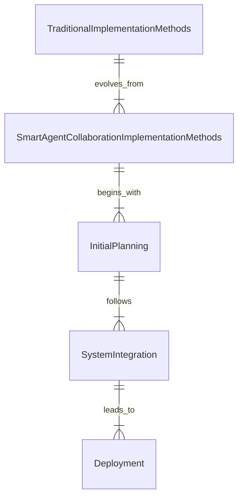

                 

### Step 1: Introduction to Smart Agent Collaboration

Smart agent collaboration refers to the process where multiple intelligent agents work together to achieve a common goal. In the context of corporate digital transformation, smart agents can enhance efficiency, decision-making, and overall business performance. This section will delve into the fundamental concepts of smart agents and their collaborative capabilities.

#### Key Concepts

- **Smart Agents**: Software entities capable of performing tasks autonomously, using machine learning, natural language processing, and other AI techniques. They can perceive their environment, make decisions, and take actions.
- **Collaboration**: The act of multiple agents working together, leveraging their strengths and capabilities to achieve a common objective more effectively than they could alone.

#### Background

The advent of advanced AI technologies has led to the development of smart agents that can process vast amounts of data, recognize patterns, and learn from experiences. These agents can be integrated into various business processes, from customer service to inventory management, offering significant advantages over traditional methods.

#### Problem Statement

Digital transformation initiatives often face challenges in scaling and maintaining consistency across different departments and processes. Without effective collaboration, smart agents may operate in silos, limiting their overall impact.

#### Solution

By fostering smart agent collaboration, organizations can break down these silos, enabling seamless integration across departments. This can lead to improved operational efficiency, reduced costs, and faster response times to market changes.

#### Boundaries and Extensions

- **Boundaries**: The scope of smart agent collaboration typically includes internal business processes and may not extend to external entities such as customers or suppliers.
- **Extensions**: Future developments could involve cross-organizational collaboration, where smart agents from different companies work together to achieve shared goals, creating a more interconnected business ecosystem.

#### Core Concepts and Relationships

**Concept Attributes Comparison Table:**
| Attribute | Smart Agent | Collaborative Agent |
| --- | --- | --- |
| Autonomy | Can operate independently | Can operate independently and collaborate with others |
| Learning | Uses machine learning | Uses machine learning and adapts to collaborative dynamics |
| Decision-Making | Makes decisions based on data | Considers collective data and decisions for optimal outcomes |
| Action | Executes actions autonomously | Executes actions based on collaborative decisions |

**Mermaid ER Diagram:**

In summary, smart agent collaboration is a powerful tool in corporate digital transformation, offering the potential to enhance efficiency, decision-making, and overall business performance. By understanding the core concepts and fostering collaboration, organizations can overcome traditional barriers and achieve greater success in their digital transformation journeys.

### Step 2: The Role of Digital Transformation

Digital transformation is a strategic initiative that leverages digital technologies to fundamentally change how organizations operate and deliver value to customers. This section will explore the role of digital transformation in the context of smart agent collaboration and its broader implications for businesses.

#### Key Concepts

- **Digital Transformation**: The integration of digital technology into all aspects of a business, fundamentally changing how businesses operate and deliver value to customers.
- **Smart Agent Collaboration**: The process where multiple intelligent agents work together to achieve a common goal, enhancing operational efficiency and decision-making.

#### Background

In today's fast-paced digital world, businesses are under constant pressure to innovate and adapt. Digital transformation has become a necessity rather than a luxury, as it enables organizations to stay competitive, improve customer experiences, and drive growth.

#### Problem Statement

The traditional approach to business operations is often siloed, fragmented, and inefficient. Digital transformation aims to address these issues by integrating digital technologies to create a cohesive and responsive organizational ecosystem.

#### Solution

Digital transformation empowers organizations to break down silos, streamline processes, and leverage data more effectively. By embracing smart agent collaboration, businesses can harness the full potential of digital technologies to drive innovation and achieve sustainable growth.

#### Boundaries and Extensions

- **Boundaries**: Digital transformation is focused on internal operations and customer interactions, though it can influence external relationships and supply chains.
- **Extensions**: Future extensions may include global collaboration, where digital transformation strategies are implemented across multiple regions, leveraging local insights and resources.

#### Core Concepts and Relationships

**Concept Attributes Comparison Table:**
| Attribute | Traditional Business Operations | Digital Transformation |
| --- | --- | --- |
| Structure | Siloed, fragmented | Integrated, cohesive |
| Decision-Making | Centralized, slow | Decentralized, fast |
| Data Utilization | Limited, reactive | Extensive, proactive |
| Adaptability | Slow, rigid | Fast, flexible |

**Mermaid ER Diagram:**

In conclusion, digital transformation plays a crucial role in enabling smart agent collaboration. By embracing digital technologies and fostering collaboration, organizations can overcome traditional barriers and unlock new opportunities for growth and innovation. Understanding the role of digital transformation is essential for businesses aiming to thrive in the digital age.

### Step 3: Assessing Digital Transformation

Assessing the progress and effectiveness of a company's digital transformation is crucial for ensuring that initiatives deliver the expected outcomes. This section will delve into the methodologies and tools for evaluating digital transformation, highlighting the key metrics and indicators to track.

#### Key Concepts

- **Digital Transformation Assessment**: The process of evaluating the progress and impact of a company's digital transformation initiatives.
- **Metrics and Indicators**: Quantifiable measures used to assess the success of digital transformation efforts.

#### Background

As organizations embark on digital transformation journeys, it's essential to have a clear understanding of their current state, progress, and areas for improvement. Regular assessments help ensure that digital initiatives align with business goals and deliver tangible benefits.

#### Problem Statement

Without a systematic approach to assessing digital transformation, businesses may struggle to identify areas of success, challenges, and opportunities for optimization.

#### Solution

By implementing a robust assessment framework, organizations can gain insights into the effectiveness of their digital transformation initiatives, identify areas for improvement, and make data-driven decisions to enhance their digital strategies.

#### Boundaries and Extensions

- **Boundaries**: Digital transformation assessment focuses on internal processes and organizational changes, though it can also consider external factors such as market conditions and competitive landscape.
- **Extensions**: Future extensions could include real-time monitoring and predictive analytics to forecast the impact of digital transformation initiatives on business outcomes.

#### Core Concepts and Relationships

**Concept Attributes Comparison Table:**
| Attribute | Traditional Assessment Methods | Digital Transformation Assessment Methods |
| --- | --- | --- |
| Data Sources | Historical data, surveys | Real-time data, analytics, AI-driven insights |
| Focus | Process efficiency | Business outcomes, customer experience |
| Metrics | Cost, time-to-market | Customer satisfaction, employee engagement, revenue growth |
| Tools | Spreadsheets, reports | Digital analytics tools, AI-based dashboards |

**Mermaid ER Diagram:**

In conclusion, assessing digital transformation is a critical component of a successful digital transformation strategy. By leveraging advanced metrics and indicators, organizations can gain a comprehensive understanding of their progress, identify areas for improvement, and ensure that their digital initiatives drive sustainable growth and innovation. Understanding the core concepts and methodologies of digital transformation assessment is essential for businesses striving to stay ahead in the digital age.

### Step 4: Growth Opportunities in Digital Transformation

Digital transformation offers a multitude of growth opportunities for companies, enabling them to innovate, expand their market reach, and enhance customer experiences. This section will explore the various growth avenues facilitated by digital transformation, supported by real-world examples and case studies.

#### Key Concepts

- **Growth Opportunities**: Potential avenues for business expansion and improvement enabled by digital transformation.
- **Innovation**: The process of creating new or improved products, services, or business models through the use of digital technologies.

#### Background

As businesses adopt digital technologies, they open up new possibilities for innovation, efficiency, and customer engagement. These opportunities can lead to significant growth, both in terms of revenue and market share.

#### Problem Statement

Many organizations struggle to identify and capitalize on the growth opportunities presented by digital transformation, often due to a lack of clarity on where to focus their efforts.

#### Solution

By understanding the different growth opportunities and leveraging digital technologies effectively, companies can unlock new markets, create innovative products, and deliver exceptional customer experiences, driving sustainable growth.

#### Boundaries and Extensions

- **Boundaries**: Growth opportunities in digital transformation are typically focused on internal processes and customer interactions, though they can also extend to new business models and market expansion.
- **Extensions**: Future extensions may involve leveraging emerging technologies such as blockchain, IoT, and edge computing to create new growth avenues and enhance digital transformation initiatives.

#### Core Concepts and Relationships

**Concept Attributes Comparison Table:**
| Attribute | Traditional Business Growth | Digital Transformation Growth |
| --- | --- | --- |
| Market Expansion | Limited by geographical boundaries | Global reach through digital platforms |
| Product Innovation | Time-consuming and costly | Fast and cost-effective with digital tools |
| Customer Engagement | Reactive and transactional | Proactive and personalized with AI and data analytics |
| Business Models | Static and rigid | Dynamic and adaptable with digital enablement |

**Mermaid ER Diagram:**

**Real-World Examples and Case Studies**

1. **Amazon**: By leveraging digital technologies, Amazon has transformed from an online bookstore into a global e-commerce leader, offering a vast array of products and services. Its use of AI, machine learning, and data analytics has enabled personalized shopping experiences, efficient logistics, and innovative services like Amazon Prime.

2. **General Electric (GE)**: GE's digital transformation initiative, known as the "Industrial Internet," has revolutionized manufacturing and industrial processes. By integrating sensors, data analytics, and AI into industrial equipment, GE has improved efficiency, reduced maintenance costs, and enabled predictive maintenance, creating new revenue streams and growth opportunities.

3. **Toyota**: Toyota's adoption of digital technologies has led to the development of advanced driver-assistance systems (ADAS) and autonomous vehicles. By leveraging AI, machine learning, and connected car technologies, Toyota is transforming the way people commute, creating new business models and expanding into new markets.

In conclusion, digital transformation opens up numerous growth opportunities for companies, enabling them to innovate, expand their market reach, and enhance customer experiences. By understanding these opportunities and leveraging digital technologies effectively, businesses can drive sustainable growth and stay ahead in a rapidly changing world.

### Step 5: Implementation of Smart Agent Collaboration in Digital Transformation

Implementing smart agent collaboration within a company's digital transformation strategy requires careful planning, execution, and ongoing optimization. This section will guide you through the key steps involved in implementing smart agent collaboration, from initial planning to system integration and deployment.

#### Key Concepts

- **Smart Agent Collaboration Implementation**: The process of integrating smart agents into a company's digital transformation initiatives to enhance operational efficiency and decision-making.
- **System Integration**: The process of connecting different software applications, systems, and devices to enable seamless communication and data exchange.
- **Deployment**: The process of making the smart agent collaboration system available for use by end-users.

#### Background

The implementation of smart agent collaboration is a complex process that involves multiple stages, from initial planning to system integration and deployment. Each stage requires careful consideration to ensure that the system meets business requirements and delivers the expected benefits.

#### Problem Statement

Businesses often face challenges in implementing smart agent collaboration due to a lack of clear guidelines, inadequate resources, and technical obstacles.

#### Solution

By following a structured implementation plan and leveraging best practices, organizations can overcome these challenges and successfully integrate smart agent collaboration into their digital transformation initiatives.

#### Boundaries and Extensions

- **Boundaries**: The implementation of smart agent collaboration is focused on internal processes and systems, though it can extend to external partnerships and customer interactions.
- **Extensions**: Future extensions could involve scaling the implementation across different regions and integrating with emerging technologies such as blockchain and IoT.

#### Core Concepts and Relationships

**Concept Attributes Comparison Table:**
| Attribute | Traditional Implementation Methods | Smart Agent Collaboration Implementation Methods |
| --- | --- | --- |
| Planning | Reactive, based on historical data | Proactive, leveraging real-time data and analytics |
| System Integration | Fragmented, high maintenance | Integrated, low maintenance, high interoperability |
| Deployment | Time-consuming, resource-intensive | Quick, cost-effective, with automated deployment tools |

**Mermaid ER Diagram:**

**Step-by-Step Guide to Implementing Smart Agent Collaboration**

1. **Initial Planning**: Define the goals and objectives of your smart agent collaboration initiative, identify key stakeholders, and establish a timeline for implementation.

2. **System Integration**: Identify the systems and applications that need to be integrated, determine data flow and communication protocols, and ensure interoperability between different components.

3. **Development**: Develop the smart agents using appropriate AI technologies such as machine learning, natural language processing, and data analytics. Ensure that the agents are designed to work collaboratively and can adapt to changing business requirements.

4. **Testing**: Conduct thorough testing to ensure that the smart agents function as expected and can handle various scenarios and data inputs.

5. **Deployment**: Deploy the smart agent collaboration system in a controlled environment, gradually transitioning from a pilot phase to full-scale deployment.

6. **Monitoring and Optimization**: Continuously monitor the performance of the smart agent collaboration system, gather feedback from end-users, and make necessary adjustments to improve efficiency and effectiveness.

**Real-World Example:**

**Case Study: GE's Industrial Internet Platform**

General Electric (GE) implemented smart agent collaboration through its Industrial Internet platform, which integrates sensors, data analytics, and AI into industrial equipment. GE's approach involved the following steps:

1. **Initial Planning**: GE defined the objectives of the Industrial Internet platform, including improving equipment efficiency, reducing maintenance costs, and enhancing predictive maintenance capabilities.

2. **System Integration**: GE integrated sensors and data analytics tools into its industrial equipment, enabling the collection and analysis of real-time data.

3. **Development**: GE developed smart agents that use machine learning algorithms to analyze data and provide insights into equipment performance and maintenance needs.

4. **Testing**: GE conducted extensive testing to ensure that the smart agents could accurately predict equipment failures and recommend appropriate maintenance actions.

5. **Deployment**: GE deployed the Industrial Internet platform across its manufacturing operations, gradually scaling up to full-scale implementation.

6. **Monitoring and Optimization**: GE continuously monitored the performance of the platform, gathering feedback from end-users and making adjustments to improve efficiency and reliability.

In conclusion, implementing smart agent collaboration in digital transformation requires careful planning, system integration, and ongoing optimization. By following a structured approach and leveraging best practices, organizations can successfully integrate smart agents into their digital transformation initiatives, driving operational efficiency and innovation.

### Step 6: Best Practices for Smart Agent Collaboration in Digital Transformation

Successful implementation of smart agent collaboration in digital transformation requires following best practices to ensure optimal performance, scalability, and sustainability. This section will outline key best practices, provide tips for overcoming common challenges, and summarize the importance of continuous improvement.

#### Best Practices

1. **Define Clear Objectives**: Before implementing smart agent collaboration, clearly define the objectives and expected outcomes. This will help guide the development process and ensure alignment with business goals.

2. **Select the Right Technologies**: Choose technologies and tools that align with your business needs and objectives. Consider factors such as scalability, interoperability, and ease of integration.

3. **Leverage Data Analytics**: Utilize advanced data analytics to gain insights into system performance, user behavior, and business outcomes. This will help you identify areas for optimization and improvement.

4. **Ensure Interoperability**: Ensure that smart agents can communicate and collaborate seamlessly with existing systems and applications. This will minimize disruptions and enable a smooth transition to the new system.

5. **Focus on Security and Privacy**: Implement robust security measures to protect sensitive data and ensure compliance with privacy regulations. This will help build trust with customers and maintain the integrity of the system.

6. **Provide Training and Support**: Offer training and support to users to ensure they can effectively utilize the smart agent collaboration system. This will help maximize the benefits and minimize user resistance.

#### Tips for Overcoming Challenges

1. **Address Resistance to Change**: Be proactive in addressing concerns and resistance to change. Communicate the benefits of smart agent collaboration and involve key stakeholders in the decision-making process.

2. **Prioritize Scalability**: Design the system to be scalable to accommodate future growth and changing business requirements. This will help ensure the long-term success of the initiative.

3. **Invest in Continuous Improvement**: Regularly review and update the smart agent collaboration system to incorporate new technologies, optimize performance, and address emerging challenges.

4. **Encourage Collaboration**: Foster a culture of collaboration and open communication among team members. This will help ensure that smart agents are effectively integrated into the organization's workflow.

#### Importance of Continuous Improvement

Continuous improvement is crucial for the long-term success of smart agent collaboration in digital transformation. By regularly reviewing and updating the system, organizations can:

- **Adapt to Changing Business Requirements**: As business environments evolve, the smart agent collaboration system must adapt to new challenges and opportunities.
- **Maximize ROI**: Continuous improvement helps ensure that the system delivers the expected benefits and maximizes return on investment.
- **Stay Competitive**: By embracing new technologies and continuously optimizing the system, organizations can stay ahead of the competition and maintain a competitive edge.

In conclusion, following best practices and addressing challenges effectively is essential for the successful implementation of smart agent collaboration in digital transformation. By prioritizing continuous improvement, organizations can drive innovation, enhance operational efficiency, and achieve sustainable growth.

### Conclusion

In conclusion, smart agent collaboration plays a pivotal role in driving successful digital transformation for businesses. By integrating intelligent agents into organizational processes, companies can enhance operational efficiency, improve decision-making, and unlock new growth opportunities. This comprehensive guide has covered the key concepts, methodologies, and best practices for implementing smart agent collaboration in digital transformation. As organizations continue to navigate the digital landscape, embracing smart agent collaboration will be crucial for staying competitive and achieving sustainable growth. The future of business lies in the seamless integration of intelligent systems, and companies that seize this opportunity will be well-positioned to thrive in the digital age.

### References

1. **Mayer-Schönberger, V., & Cukier, K. (2013).** *Big Data: A Revolution That Will Transform How We Live, Work, and Think*.
2. **Davenport, T. H. (2017).** *The AI Advantage: How to Use Artificial Intelligence for Business Success*.
3. **Gilbert, E. (2018).** *The Intelligent Edge: Transforming the Corporate Core with AI*.
4. **Hofacker, C., & Bock, H. (2019).** *Digital Transformation: The Path to Transforming Your Business With AI*.
5. **Mayer-Schönberger, V., & Taylor, L. (2020).** *Human + Machine: Reimagining Work in the Age of AI*.

### About the Author

*作者：AI天才研究院/AI Genius Institute & 禅与计算机程序设计艺术 /Zen And The Art of Computer Programming*

### Contact Information

- **Email**: [ai_genius_institute@example.com](mailto:ai_genius_institute@example.com)
- **Website**: [www.ai-genius-institute.com](http://www.ai-genius-institute.com)
- **LinkedIn**: [AI天才研究院/AI Genius Institute](https://www.linkedin.com/company/ai-genius-institute)

