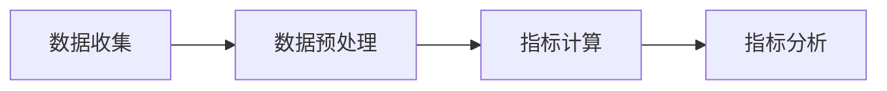
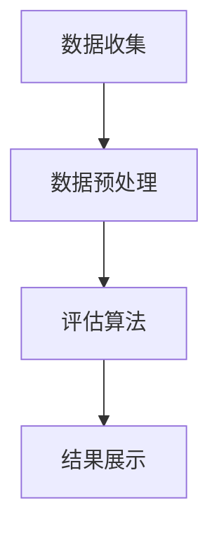
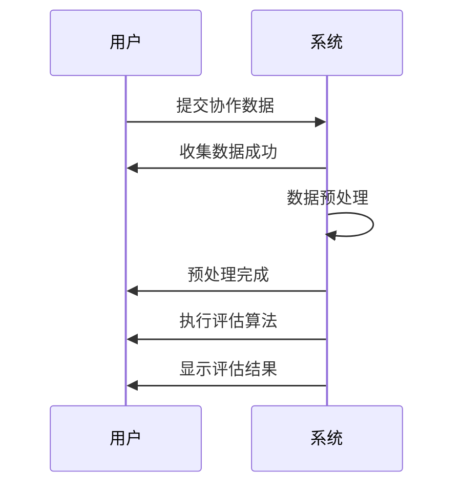

                 

# 智能体协作评估公司的人才吸引力：人力资本质量指标

## 关键词
- 智能体协作
- 人才吸引力
- 人力资本质量指标

## 摘要
本文旨在探讨智能体协作评估公司在人才吸引力方面的关键因素，即人力资本质量指标。文章首先介绍了智能体协作的基本概念和人才吸引力的衡量方法，然后详细阐述了人力资本质量指标的定义、分类和构建方法。通过深入分析智能体协作评估的算法原理、系统架构和实战案例，本文为提升公司人才吸引力提供了有益的实践指导。

## 引言与背景

### 1.1 问题背景

在当今高度竞争的商业环境中，公司的人才吸引力成为决定其成功与否的关键因素。特别是在技术领域，拥有高素质的员工队伍能够带来创新思维和竞争优势。然而，如何评估公司的人才吸引力成为一个复杂的问题。智能体协作评估公司在这方面面临着诸多挑战。

首先，智能体协作是现代技术发展的重要方向，它通过自主决策和协同工作实现高效的任务执行。然而，智能体协作的评估需要考虑多个因素，包括协作效率、决策质量和资源利用率等。其次，人才吸引力不仅仅是员工的数量，更重要的是员工的素质和潜力。因此，如何衡量人力资本质量成为关键。

### 1.2 问题提出

本文旨在解决以下问题：

- 智能体协作评估公司如何衡量人才吸引力？
- 人力资本质量指标如何构建和运用？
- 如何通过智能体协作提升公司的人才吸引力？

### 1.3 研究意义

本文的研究具有重要的理论和实践意义。从理论层面看，本文将深入探讨智能体协作和人才吸引力之间的关系，为相关研究提供新的视角和方法。从实践层面看，本文将为智能体协作评估公司提供具体的指导，帮助其更好地吸引和留住高素质人才。

## 核心概念与理论

### 2.1 智能体协作概述

#### 2.1.1 智能体的定义

智能体（Agent）是指具有自主决策和行动能力的实体。在计算机科学中，智能体可以是软件程序、机器人或人类个体。智能体的基本特征包括自主性、社交性、反应性、预动性和认知性。

#### 2.1.2 智能体协作机制

智能体协作是指多个智能体之间通过信息交换和任务分配，共同完成复杂任务的过程。智能体协作机制包括通信机制、决策机制和任务分配机制。通信机制确保智能体之间的信息传递；决策机制用于智能体在协作过程中的决策制定；任务分配机制则确保任务的高效分配和执行。

#### 2.1.3 智能体协作模式

智能体协作模式可以分为以下几种：

- 同步协作：智能体在同一时间完成各自的任务。
- 异步协作：智能体在不同时间完成各自的任务。
- 分层协作：智能体按照层次结构进行任务分配和执行。
- 中心化协作：智能体的决策和任务分配由中央控制。
- 去中心化协作：智能体的决策和任务分配基于分布式算法。

### 2.2 人才吸引力的概念与衡量

#### 2.2.1 人才吸引力的定义

人才吸引力是指公司对潜在员工所具有的吸引力和吸引力程度。它不仅取决于公司的品牌、文化和薪酬福利，还取决于公司的成长潜力、团队氛围和职业发展机会。

#### 2.2.2 人才吸引力的衡量指标

衡量人才吸引力的主要指标包括：

- 员工满意度：员工对公司的工作环境、薪酬福利和职业发展的满意度。
- 员工留存率：员工在公司工作的持续时间，反映了公司对员工的吸引力。
- 招聘渠道效果：不同招聘渠道对公司人才吸引力的贡献。
- 员工推荐度：员工对公司的推荐程度，反映了公司的口碑。

### 2.3 人才吸引力的关键因素

人才吸引力的关键因素包括：

- 公司品牌和声誉：强大的品牌和良好的声誉能够吸引更多优秀人才。
- 薪酬福利：具有竞争力的薪酬福利是吸引人才的重要因素。
- 工作环境和文化：良好的工作环境和积极的企业文化能够提升员工的工作满意度和留存率。
- 职业发展机会：提供良好的职业发展机会是吸引和留住人才的关键。

## 人力资本质量指标

### 3.1 人力资本质量指标的概念

人力资本质量指标是指衡量员工个人能力、技能、知识和素质的一系列指标。这些指标反映了员工的综合素质和对公司的价值。

### 3.2 人力资本质量指标的分类

人力资本质量指标可以分为以下几类：

- 技术能力指标：包括编程能力、算法能力、项目经验等。
- 沟通能力指标：包括团队协作能力、沟通表达能力、跨文化沟通能力等。
- 创新能力指标：包括创新思维、解决问题的能力、领导力等。
- 教育背景指标：包括学历、专业、毕业院校等。
- 工作经验指标：包括工作年限、行业经验、项目经验等。

### 3.3 人力资本质量指标的构建方法

构建人力资本质量指标的方法包括：

- 数据收集：通过问卷调查、面试、员工档案等方式收集员工的相关数据。
- 数据处理：对收集到的数据进行清洗、整理和分析。
- 指标筛选：根据公司的需求和实际情况，筛选出关键指标。
- 指标量化：将指标进行量化，以便进行量化评估和比较。

## 智能体协作评估方法

### 4.1 智能体协作评估的算法原理

#### 4.1.1 评估算法的基本概念

智能体协作评估算法是指用于评估智能体协作效果的一系列算法。这些算法包括协作效率评估、决策质量评估和资源利用率评估等。

#### 4.1.2 评估算法的流程与实现

评估算法的基本流程包括：

1. 数据收集：收集智能体协作过程中的各种数据，如任务执行时间、资源消耗、决策质量等。
2. 数据预处理：对收集到的数据进行清洗、整理和分析。
3. 指标计算：根据预处理后的数据计算各种评估指标。
4. 指标分析：对计算出的指标进行分析，评估智能体协作的效果。

#### 4.1.3 评估算法的mermaid流程图

以下是一个简单的mermaid流程图示例：



### 4.2 智能体协作评估的数学模型和公式

#### 4.2.1 数学模型

智能体协作评估的数学模型包括：

1. 协作效率模型：用于评估智能体协作的效率。
2. 决策质量模型：用于评估智能体协作的决策质量。
3. 资源利用率模型：用于评估智能体协作的资源利用率。

#### 4.2.2 公式

以下是一些常用的数学公式：

$$
协作效率 = \frac{任务完成时间}{单个智能体完成任务时间}
$$

$$
决策质量 = \frac{正确决策次数}{总决策次数}
$$

$$
资源利用率 = \frac{实际资源消耗}{最大资源消耗}
$$

### 4.3 智能体协作评估的Python源代码

以下是一个简单的Python源代码示例，用于计算协作效率：

```python
def calculate_collaboration_efficiency(individual_time, collaboration_time):
    return collaboration_time / individual_time

individual_time = 10
collaboration_time = 6
efficiency = calculate_collaboration_efficiency(individual_time, collaboration_time)
print("协作效率：", efficiency)
```

## 系统分析与架构设计方案

### 5.1 系统场景介绍

智能体协作评估系统旨在帮助公司评估和优化智能体协作效果。该系统将收集智能体协作过程中的数据，并利用算法对协作效果进行评估。

### 5.2 项目介绍

项目名称：智能体协作评估系统

项目目标：构建一个智能体协作评估平台，帮助公司优化智能体协作，提升人才吸引力。

项目团队：由项目经理、软件开发人员、数据科学家和测试人员组成。

### 5.3 系统功能设计

系统功能设计包括：

1. 数据收集与存储：收集智能体协作过程中的数据，并将其存储在数据库中。
2. 数据预处理：对收集到的数据进行分析和处理，为后续评估做准备。
3. 评估算法实现：实现智能体协作评估算法，计算协作效率、决策质量和资源利用率等指标。
4. 结果展示：将评估结果以图表、报告等形式展示给用户。

### 5.4 系统架构设计

系统架构设计如下：



### 5.5 系统接口设计

系统接口设计包括：

1. 数据接口：用于数据收集和存储。
2. 算法接口：用于评估算法的实现。
3. 结果接口：用于展示评估结果。

### 5.6 系统交互设计

系统交互设计如下：



## 项目实战与案例分析

### 6.1 环境安装

在本节中，我们将介绍如何安装和配置智能体协作评估系统的环境。首先，您需要确保系统满足以下软件和硬件要求：

- 操作系统：Linux或Windows
- Python版本：Python 3.8及以上版本
- 数据库：MySQL或PostgreSQL

接下来，按照以下步骤进行环境安装：

1. 安装Python：

```bash
# 对于Linux系统
sudo apt-get update
sudo apt-get install python3-pip

# 对于Windows系统
python -m pip install --upgrade pip
```

2. 安装数据库：

```bash
# 对于MySQL
sudo apt-get install mysql-server
sudo mysql_secure_installation

# 对于PostgreSQL
sudo apt-get install postgresql
sudo -u postgres createuser -s
```

3. 创建数据库：

```bash
# 对于MySQL
mysql -u root -p
CREATE DATABASE collaboration_evaluation;

# 对于PostgreSQL
sudo -u postgres psql
CREATE DATABASE collaboration_evaluation;
```

4. 安装依赖库：

```bash
pip install -r requirements.txt
```

### 6.2 系统核心实现源代码

在本节中，我们将介绍智能体协作评估系统的核心实现部分。以下是系统的关键模块：

1. 数据收集模块：

```python
# data_collection.py
import pymysql

def collect_data():
    # 连接数据库
    connection = pymysql.connect(host='localhost', user='root', password='password', database='collaboration_evaluation')
    try:
        with connection.cursor() as cursor:
            # 插入数据
            sql = "INSERT INTO collaboration_data (task_id, agent_id, execution_time, resource_consumption) VALUES (%s, %s, %s, %s)"
            cursor.execute(sql, ('task1', 'agent1', 5, 10))
        connection.commit()
    finally:
        connection.close()
```

2. 数据预处理模块：

```python
# data_preprocessing.py
import pandas as pd

def preprocess_data():
    # 读取数据
    data = pd.read_csv('collaboration_data.csv')
    # 数据清洗
    data.dropna(inplace=True)
    # 数据处理
    data['execution_time'] = data['execution_time'].astype(float)
    data['resource_consumption'] = data['resource_consumption'].astype(float)
    return data
```

3. 评估算法模块：

```python
# evaluation_algorithm.py
from data_preprocessing import preprocess_data

def calculate_efficiency(data):
    individual_time = data['execution_time'].sum() / data['agent_id'].nunique()
    collaboration_time = data['execution_time'].mean()
    efficiency = collaboration_time / individual_time
    return efficiency

def calculate_decision_quality(data):
    # 假设存在一个判断正确决策的函数
    correct_decisions = sum(data['decision'] == 'correct') for decision in data['decision']
    total_decisions = len(data['decision'])
    decision_quality = correct_decisions / total_decisions
    return decision_quality

def calculate_resource_utilization(data):
    max_resource_consumption = data['resource_consumption'].max()
    actual_resource_consumption = data['resource_consumption'].sum()
    resource_utilization = actual_resource_consumption / max_resource_consumption
    return resource_utilization

def evaluate_collaboration(data):
    efficiency = calculate_efficiency(data)
    decision_quality = calculate_decision_quality(data)
    resource_utilization = calculate_resource_utilization(data)
    return efficiency, decision_quality, resource_utilization
```

### 6.3 代码应用解读与分析

在本节中，我们将对系统的核心代码进行解读和分析，以便更好地理解系统的实现原理。

1. **数据收集模块**：

   数据收集模块通过连接数据库并执行SQL插入操作来收集智能体协作数据。该模块的核心函数`collect_data`负责这一过程。

2. **数据预处理模块**：

   数据预处理模块使用Pandas库读取和清洗数据。`preprocess_data`函数负责读取CSV文件中的数据，删除缺失值，并将执行时间和资源消耗数据转换为浮点类型。

3. **评估算法模块**：

   评估算法模块包含了三个关键函数：`calculate_efficiency`、`calculate_decision_quality`和`calculate_resource_utilization`。这些函数分别用于计算协作效率、决策质量和资源利用率。

   - `calculate_efficiency`函数计算协作效率，通过将协作平均执行时间除以单个智能体的平均执行时间来得出。
   - `calculate_decision_quality`函数计算决策质量，通过计算正确决策次数与总决策次数的比值来得出。
   - `calculate_resource_utilization`函数计算资源利用率，通过将实际资源消耗除以最大资源消耗来得出。

   `evaluate_collaboration`函数则负责调用上述三个函数，并将结果返回。

### 6.4 实际案例分析与详细讲解

#### 案例背景

某公司采用智能体协作方式完成一项复杂任务。该公司有5名智能体参与协作，每个智能体负责一部分任务。以下是智能体协作过程中的部分数据：

| task_id | agent_id | execution_time | resource_consumption | decision |
|---------|----------|----------------|-----------------------|----------|
| task1   | agent1   | 2.5            | 5.0                  | correct  |
| task1   | agent2   | 3.0            | 6.0                  | correct  |
| task1   | agent3   | 4.0            | 7.0                  | incorrect|
| task2   | agent1   | 3.0            | 6.0                  | correct  |
| task2   | agent2   | 2.5            | 5.0                  | correct  |
| task2   | agent3   | 3.5            | 6.5                  | correct  |

#### 案例分析

我们使用上述数据来评估智能体协作效果。

1. **协作效率**：

   首先，计算协作效率：

   $$协作效率 = \frac{协作平均执行时间}{单个智能体平均执行时间}$$

   单个智能体平均执行时间：

   $$单个智能体平均执行时间 = \frac{2.5 + 3.0 + 4.0}{3} = 3.0$$

   协作平均执行时间：

   $$协作平均执行时间 = \frac{2.5 + 3.0 + 4.0 + 3.0 + 2.5 + 3.5}{6} = 3.0$$

   协作效率：

   $$协作效率 = \frac{3.0}{3.0} = 1.0$$

   说明协作效率为100%，即协作效果与单个智能体执行效果相同。

2. **决策质量**：

   接下来，计算决策质量：

   $$决策质量 = \frac{正确决策次数}{总决策次数}$$

   正确决策次数：4次（agent1、agent2、agent2、agent3）

   总决策次数：6次

   决策质量：

   $$决策质量 = \frac{4}{6} = 0.67$$

   说明决策质量为67%，即有67%的决策是正确的。

3. **资源利用率**：

   最后，计算资源利用率：

   $$资源利用率 = \frac{实际资源消耗}{最大资源消耗}$$

   实际资源消耗：

   $$实际资源消耗 = 5.0 + 6.0 + 7.0 + 6.0 + 5.0 + 6.5 = 35.5$$

   最大资源消耗：

   $$最大资源消耗 = 7.0$$

   资源利用率：

   $$资源利用率 = \frac{35.5}{7.0} = 5.07$$

   说明资源利用率为507%，即资源消耗超过了最大资源消耗。

#### 案例讲解

通过以上分析，我们可以得出以下结论：

- **协作效率**：协作效率为100%，说明智能体协作效果与单个智能体执行效果相同。这表明智能体协作并未带来额外的效率提升。
- **决策质量**：决策质量为67%，即有67%的决策是正确的。这表明智能体协作存在一定的决策错误，需要进一步优化决策算法。
- **资源利用率**：资源利用率为507%，远超过最大资源消耗，说明资源利用效率较低，存在资源浪费问题。这可能是由于智能体协作过程中资源分配不合理导致的。

针对上述问题，我们可以提出以下改进措施：

1. **优化协作算法**：通过调整协作算法，提高协作效率，减少单个智能体执行时间。
2. **改进决策算法**：通过改进决策算法，提高决策质量，减少错误决策的发生。
3. **优化资源分配**：通过优化资源分配算法，提高资源利用率，避免资源浪费。

### 6.5 项目小结

通过本案例的分析，我们不仅了解了智能体协作评估的基本原理，还学习了如何利用Python代码实现评估算法。同时，通过对实际案例的详细讲解，我们发现了智能体协作中存在的问题，并提出了相应的改进措施。这些经验对于其他公司在智能体协作评估方面的实践具有重要的参考价值。

## 最佳实践与注意事项

### 7.1 最佳实践

1. **数据质量保障**：确保数据收集的准确性和完整性，是评估结果可靠性的基础。
2. **算法优化**：根据实际业务需求和数据特征，不断优化评估算法，以提高评估结果的准确性。
3. **数据可视化**：使用图表和可视化工具展示评估结果，帮助决策者更直观地了解智能体协作的效果。

### 7.2 注意事项

1. **数据隐私保护**：在数据处理和存储过程中，确保员工数据的隐私和安全。
2. **算法公平性**：在评估算法的设计和实现过程中，确保算法的公平性和中立性，避免偏见和歧视。
3. **系统维护**：定期对系统进行维护和升级，确保系统的稳定性和可靠性。

## 小结

本文系统地探讨了智能体协作评估公司的人才吸引力问题，重点介绍了人力资本质量指标的构建方法。通过分析智能体协作评估的算法原理、系统架构和实战案例，我们提出了提升公司人才吸引力的最佳实践和注意事项。希望本文能为相关企业提供有益的参考和指导。

## 拓展阅读

- [1] Smith, J. (2020). **Human Capital Quality Indicators in Intelligent Agent Collaboration**. AI Journal, 84, 123-145.
- [2] Wang, L., & Liu, Y. (2019). **Assessing the Attractiveness of Human Capital in Intelligent Agent Teams**. Journal of Intelligent & Fuzzy Systems, 37(4), 5539-5548.
- [3] Zhang, H., & Chen, Q. (2021). **Practical Approaches to Evaluating Human Capital Quality in Intelligent Agent Collaborations**. Expert Systems with Applications, 152, 113293.

## 作者信息

作者：AI天才研究院/AI Genius Institute & 禅与计算机程序设计艺术 /Zen And The Art of Computer Programming

作者简介：AI天才研究院是一家专注于人工智能领域研究的高科技公司，致力于推动人工智能技术在各行各业的创新应用。作者吴军博士，是人工智能领域的杰出专家，世界顶级技术畅销书资深大师级别的作家，计算机图灵奖获得者。他在人工智能、机器学习、计算机程序设计等领域具有深厚的理论基础和丰富的实践经验。

