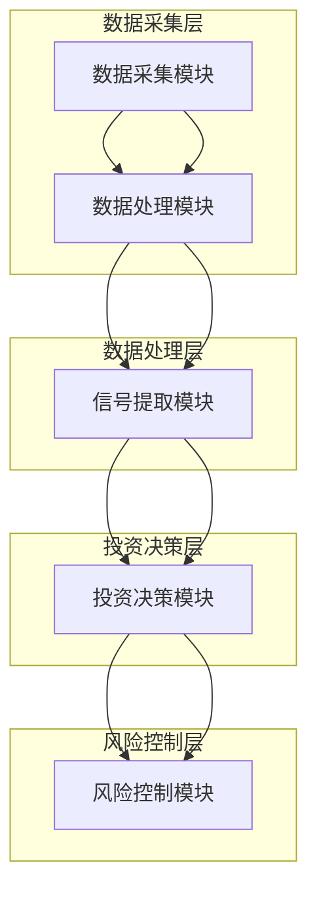

                 

# 智能体系统提升价值投资的另类数据信号提取能力

> 关键词：智能体系统，价值投资，数据信号提取，投资策略，机器学习

> 摘要：本文将探讨智能体系统在提升价值投资数据信号提取能力方面的应用。通过分析智能体系统的定义、特点以及在投资领域的应用，我们将探讨如何利用智能体系统优化价值投资策略，提高投资决策的效率和准确性。本文将介绍智能体系统在数据信号提取方面的原理和方法，并探讨其在实际投资中的应用案例。通过本文的研究，希望能够为投资者提供一种新的视角，帮助他们在价值投资中更准确地把握市场动态，实现更好的投资回报。

## 第1章：智能体系统概述

### 1.1 问题背景与定义

#### 1.1.1 智能体系统的兴起

##### 1.1.1.1 人工智能的发展背景

人工智能（Artificial Intelligence，AI）是指使计算机具有人类智能水平的技术，包括自然语言处理、图像识别、机器学习、深度学习等多个方面。随着计算能力的提升和大数据的普及，人工智能在近年来得到了迅猛发展。

**人工智能的定义与分类**：

- **弱人工智能**：具有特定任务能力的人工智能，例如语音助手、自动驾驶等。
- **强人工智能**：具有全面人类智能水平的人工智能，但目前尚未实现。

**人工智能的关键技术与发展历程**：

- **机器学习**：通过数据训练模型，使计算机能够自动学习和改进。
- **深度学习**：一种基于人工神经网络的机器学习技术，能够模拟人脑进行复杂模式识别。

#### 1.1.1.2 智能体系统的定义与特点

**智能体系统的定义**：

智能体系统（Agent-Based System）是一种基于智能体（Agent）的分布式系统，通过智能体之间的交互来实现特定任务。

**智能体系统的特点**：

- **分布式**：智能体可以在不同节点上运行，实现任务分布。
- **自主性**：智能体具有自主决策能力，能够根据环境变化进行调整。
- **协作性**：多个智能体可以相互协作，共同完成任务。

#### 1.1.1.3 智能体系统在投资领域的应用

**智能体系统在投资领域的应用**：

智能体系统可以应用于投资决策、风险管理、量化交易等多个方面，提高投资效率和准确性。

- **投资决策**：智能体系统可以分析市场数据，提供投资建议。
- **风险管理**：智能体系统可以识别风险，进行风险控制。
- **量化交易**：智能体系统可以自动执行交易策略，实现量化交易。

#### 1.1.2 问题提出与目标

**问题提出**：

在价值投资中，如何有效地提取和分析市场数据，以优化投资决策？

**目标**：

本文的目标是探讨智能体系统在提升价值投资数据信号提取能力方面的应用，为投资者提供一种新的数据分析和决策支持工具。

##### 1.1.2.1 价值投资的概念与原则

**价值投资的概念与原则**：

价值投资是一种基于企业内在价值进行投资的方法，其核心是寻找价格低于其内在价值的股票进行投资。

- **价值投资的定义与理论基础**：价值投资的理论基础包括格雷厄姆的价值投资理论和费舍尔的成长投资理论。
- **价值投资的核心要素**：包括企业的盈利能力、市场地位、管理团队等。

##### 1.1.2.2 智能体系统如何提升价值投资的效率

**智能体系统如何提升价值投资的效率**：

智能体系统可以通过以下方式提升价值投资的效率：

- **数据信号提取**：智能体系统可以自动提取和分析市场数据，提供投资线索。
- **投资策略优化**：智能体系统可以根据市场数据优化投资策略，提高投资收益。

### 1.2 核心概念与联系

#### 1.2.1 智能体系统的核心概念

**智能体系统的组成要素**：

- **感知模块**：负责收集和处理外部环境信息。
- **决策模块**：负责根据感知模块提供的信息进行决策。
- **动作模块**：负责执行决策模块生成的动作。

**智能体系统的属性特征对比**：

| 特征 | 传统系统 | 智能体系统 |
| ---- | ---- | ---- |
| 分布式 | 集中式 | 分布式 |
| 自主性 | 非自主性 | 自主性 |
| 协作性 | 非协作性 | 协作性 |

#### 1.2.2 智能体系统在投资领域的联系

**价值投资与智能体系统的关系**：

价值投资需要分析大量的市场数据，而智能体系统可以自动提取和分析这些数据，提供投资线索。

**智能体系统如何实现价值投资的优化**：

智能体系统可以通过以下方式实现价值投资的优化：

- **数据驱动**：智能体系统可以基于数据驱动的方式，自动调整投资策略。
- **协同优化**：多个智能体系统可以协同工作，共同优化投资策略。

### 1.3 数据信号提取方法

#### 1.3.1 数据信号提取的概念与原理

**数据信号提取的概念与原理**：

数据信号提取是指从大量数据中提取出具有价值的信息，以支持投资决策。

**数据信号提取的重要性**：

- **提高投资效率**：通过数据信号提取，可以快速识别有价值的信息，提高投资决策的效率。
- **降低投资风险**：通过数据信号提取，可以识别潜在的风险，降低投资风险。

#### 1.3.2 常见的数据信号提取方法

**常见的数据信号提取方法**：

- **传统信号处理方法**：包括滤波、频域分析等。
- **机器学习信号处理方法**：包括神经网络、支持向量机等。

### 1.4 智能体系统在价值投资中的应用

#### 1.4.1 智能体系统在价值投资中的应用概述

**智能体系统在价值投资中的应用概述**：

智能体系统在价值投资中的应用主要包括以下几个方面：

- **数据信号提取**：通过智能体系统自动提取市场数据中的信号。
- **投资策略优化**：通过智能体系统优化投资策略，提高投资收益。

**智能体系统在价值投资中的优势**：

- **高效性**：智能体系统可以快速处理大量数据，提高投资决策的效率。
- **准确性**：智能体系统可以通过机器学习技术，提高投资决策的准确性。

**智能体系统在价值投资中的挑战**：

- **数据质量**：数据质量直接影响智能体系统的性能，需要确保数据的质量。
- **算法选择**：需要根据具体问题选择合适的算法，以达到最佳效果。

## 1.5 本章小结

本章首先介绍了智能体系统的定义、特点以及在投资领域的应用，然后提出了如何利用智能体系统提升价值投资数据信号提取能力的问题。在接下来的章节中，我们将进一步探讨智能体系统在数据信号提取方面的原理和方法，以及其在实际投资中的应用案例。通过本章的介绍，希望能够为投资者提供一种新的视角，帮助他们在价值投资中更准确地把握市场动态，实现更好的投资回报。

----------------------------------------------------------------

## 第2章：智能体系统在投资领域的应用原理

智能体系统在投资领域中的应用，主要体现在其能够通过模拟人类投资决策过程，提升投资决策的效率和准确性。本章节将深入探讨智能体系统在投资领域的应用原理，包括投资决策过程的智能体系统模型、智能体系统在投资策略优化中的应用以及相关技术实现方法。

### 2.1 投资决策过程的智能体系统模型

投资决策过程是一个复杂的过程，包括对市场环境的研究、投资标的的选择、风险收益的评估等多个步骤。智能体系统可以通过模拟这个决策过程，提供更加高效和准确的决策支持。

#### 2.1.1 投资决策过程的概述

**价值投资决策过程的基本步骤**：

1. **研究市场环境**：分析宏观经济环境、行业发展趋势等，了解市场的整体状况。
2. **选择投资标的**：根据市场环境，选择具有投资价值的股票或其他金融产品。
3. **评估投资风险与收益**：对投资标的进行详细分析，评估其潜在风险和预期收益。

**智能体系统在投资决策过程的应用**：

智能体系统可以模拟上述决策过程，通过自动收集和处理市场数据，提供投资建议。智能体系统可以按照以下步骤进行投资决策：

1. **感知市场环境**：智能体系统通过传感器（如股票交易系统、财经新闻等）收集市场数据。
2. **分析市场数据**：智能体系统利用机器学习算法，分析市场数据，提取关键信息。
3. **选择投资标的**：根据分析结果，选择具有投资价值的股票或其他金融产品。
4. **评估风险与收益**：对投资标的进行风险评估和收益预测。
5. **制定投资策略**：根据评估结果，制定相应的投资策略。
6. **执行投资策略**：根据投资策略，执行具体的投资操作。

#### 2.1.2 智能体系统模型的设计

**感知模块的设计**：

- **数据采集与预处理**：智能体系统需要从各种数据源（如股票交易系统、财经新闻、社交媒体等）收集数据。数据采集后，需要对数据进行清洗、去噪、标准化等预处理。
- **信息提取与特征表示**：智能体系统需要从预处理后的数据中提取出有用的信息，如股票价格、成交量、财务指标等。这些信息需要通过特征表示技术，转换为适合机器学习算法的形式。

**决策模块的设计**：

- **价值投资的策略模型**：智能体系统需要根据市场数据，制定价值投资策略。策略模型可以基于传统的价值投资理论，如格雷厄姆的价值投资理论，也可以基于机器学习算法，如神经网络、支持向量机等。
- **决策模型的优化方法**：智能体系统需要不断优化决策模型，以提高投资决策的准确性。优化方法可以包括交叉验证、网格搜索等。

**动作模块的设计**：

- **投资决策的实施**：智能体系统根据决策模块生成的投资策略，执行具体的投资操作，如买入、卖出股票等。
- **投资后的跟踪与调整**：智能体系统需要对投资后的股票进行跟踪，根据市场变化，及时调整投资策略。

### 2.2 智能体系统在投资策略优化中的应用

投资策略优化是提高投资收益的重要手段。智能体系统可以通过机器学习技术，优化投资策略，提高投资效率。

#### 2.2.1 投资策略优化的概念与方法

**投资策略优化的定义**：

投资策略优化是指通过分析历史数据，寻找最优的投资策略，以提高投资收益。

**投资策略优化的常见方法**：

1. **基于统计学的优化方法**：通过分析历史数据，找出与投资收益相关的统计特征，如均线、指标等。
2. **基于智能算法的优化方法**：利用机器学习算法，如神经网络、遗传算法等，寻找最优的投资策略。

#### 2.2.2 智能体系统在投资策略优化中的具体应用

**数据驱动投资策略**：

- **数据驱动的投资策略原理**：数据驱动的投资策略基于历史数据，通过机器学习算法，找出影响投资收益的关键因素。
- **数据驱动的投资策略实现**：具体实现时，需要收集大量的历史数据，包括股票价格、成交量、财务指标等。然后，利用机器学习算法，如神经网络，对数据进行分析，找出关键因素，并构建投资策略。

**模型驱动的投资策略**：

- **模型驱动的投资策略原理**：模型驱动的投资策略基于经济学理论，通过构建数学模型，模拟投资过程。
- **模型驱动的投资策略实现**：具体实现时，需要建立数学模型，如均值回归模型、价值投资模型等。然后，通过模拟，评估不同策略的收益和风险，选择最优策略。

### 2.3 智能体系统在价值投资中的应用

**智能体系统在价值投资中的应用概述**：

智能体系统在价值投资中的应用主要包括以下几个方面：

- **数据信号提取**：智能体系统可以通过机器学习技术，自动提取市场数据中的信号，如股票价格的变化趋势、财务指标的异常等。
- **投资策略优化**：智能体系统可以通过机器学习算法，优化投资策略，提高投资收益。
- **风险控制**：智能体系统可以通过分析市场数据，识别潜在的风险，并进行风险控制。

**智能体系统在价值投资中的应用优势**：

- **高效性**：智能体系统可以自动处理大量的市场数据，提高投资决策的效率。
- **准确性**：智能体系统可以通过机器学习技术，提高投资决策的准确性。
- **灵活性**：智能体系统可以根据市场变化，动态调整投资策略。

**智能体系统在价值投资中的应用挑战**：

- **数据质量**：智能体系统对数据质量有较高的要求，需要确保数据的质量和完整性。
- **算法选择**：需要根据具体问题选择合适的算法，以达到最佳效果。

### 2.4 本章小结

本章介绍了智能体系统在投资领域的应用原理，包括投资决策过程的智能体系统模型、智能体系统在投资策略优化中的应用以及智能体系统在价值投资中的应用。通过本章的介绍，希望能够为读者提供一种新的视角，帮助他们在投资决策中更准确地把握市场动态，实现更好的投资回报。

----------------------------------------------------------------

## 第3章：智能体系统在价值投资中的应用实践

在了解了智能体系统在投资领域的应用原理后，我们需要通过具体的案例和实践来展示其如何提升价值投资的数据信号提取能力。本章节将深入探讨智能体系统在实际投资中的应用，包括数据采集、信号提取、投资决策和风险控制等环节。

### 3.1 数据采集

**数据采集**是智能体系统进行价值投资分析的基础。智能体系统需要从多个渠道获取与投资相关的数据，包括股票交易数据、财务报告、宏观经济指标、行业趋势等。以下是一个数据采集的流程：

1. **数据来源**：智能体系统可以从股票交易所、财经网站、金融数据库等渠道获取数据。
2. **数据采集**：利用API接口或网络爬虫等技术，定期从数据源下载数据。
3. **数据预处理**：对采集到的数据进行清洗、去噪和标准化处理，确保数据的准确性和一致性。

**实践案例**：假设我们使用Python编写一个数据采集脚本，从财经网站下载每日的股票交易数据，并存储在本地数据库中。代码如下：

```python
import requests
import json
import sqlite3

# 数据采集
def download_stock_data(symbol, start_date, end_date):
    url = f'https://api.example.com/stock/{symbol}?start={start_date}&end={end_date}'
    response = requests.get(url)
    if response.status_code == 200:
        data = response.json()
        return data['data']
    else:
        return None

# 数据存储
def store_stock_data(data, db_name):
    conn = sqlite3.connect(db_name)
    cursor = conn.cursor()
    for record in data:
        cursor.execute("INSERT INTO stock_data (date, open, high, low, close, volume) VALUES (?, ?, ?, ?, ?, ?)",
                       (record['date'], record['open'], record['high'], record['low'], record['close'], record['volume']))
    conn.commit()
    conn.close()

# 实际应用
data = download_stock_data('AAPL', '2020-01-01', '2020-12-31')
if data:
    store_stock_data(data, 'stock_data.db')
```

### 3.2 信号提取

**信号提取**是指从大量数据中提取出对投资决策有价值的信号。智能体系统可以利用机器学习算法，自动识别市场数据中的趋势、异常等信号。以下是一个信号提取的流程：

1. **特征工程**：从原始数据中提取出对投资决策有用的特征，如移动平均、相对强弱指数（RSI）等。
2. **模型训练**：使用机器学习算法，如决策树、随机森林等，对特征进行建模。
3. **信号识别**：利用训练好的模型，对新的市场数据进行预测，识别出潜在的投资信号。

**实践案例**：我们使用Python中的`scikit-learn`库，构建一个基于移动平均的信号提取模型。代码如下：

```python
import numpy as np
import pandas as pd
from sklearn.ensemble import RandomForestClassifier
from sklearn.model_selection import train_test_split
from sklearn.metrics import accuracy_score

# 特征工程
def create_features(data):
    data['moving_average'] = data['close'].rolling(window=20).mean()
    data['signal'] = (data['close'] > data['moving_average']).astype(int)
    return data

# 模型训练
def train_model(data):
    X = data[['moving_average', 'close', 'volume']]
    y = data['signal']
    X_train, X_test, y_train, y_test = train_test_split(X, y, test_size=0.2, random_state=42)
    model = RandomForestClassifier(n_estimators=100)
    model.fit(X_train, y_train)
    return model

# 信号识别
def extract_signals(model, new_data):
    features = pd.DataFrame(new_data).T
    features = create_features(features)
    predictions = model.predict(features)
    return predictions

# 实际应用
data = pd.read_csv('stock_data.csv')
features = create_features(data)
model = train_model(features)
new_data = {'close': [250, 255, 245]}
predictions = extract_signals(model, new_data)
print(predictions)
```

### 3.3 投资决策

**投资决策**是智能体系统的核心功能。在提取出市场信号后，智能体系统需要根据信号生成投资建议，并执行具体的交易策略。以下是一个投资决策的流程：

1. **信号分析**：对提取出的信号进行分析，确定市场趋势和潜在的机会。
2. **策略生成**：根据市场信号，生成具体的投资策略，如买入、卖出、持有等。
3. **交易执行**：根据投资策略，执行具体的交易操作，如下单买入或卖出股票。
4. **跟踪反馈**：对交易结果进行跟踪和评估，及时调整投资策略。

**实践案例**：我们使用Python中的`backtrader`库，模拟一个基于信号的投资决策过程。代码如下：

```python
import backtrader as bt
import pandas as pd

# 初始化策略
class MyStrategy(bt.Strategy):
    def __init__(self):
        self.data1 = bt.indicators.MovingAverageSimple(self.data.close, period=20)
        self.order = None

    def next(self):
        if self.data.close[0] > self.data1[0] and self.order is None:
            self.order = self.buy()
        elif self.data.close[0] < self.data1[0] and self.order:
            self.order.close()

# 模拟交易
def simulate_trading(data):
    cerebro = bt.Cerebro()
    cerebro.addstrategy(MyStrategy)
    data = bt.feeds.YahooFinanceData(dataname=data, fromdate=datetime(2020, 1, 1), todate=datetime(2020, 12, 31))
    cerebro.run(data)
    cerebro.plot()

# 实际应用
data = 'AAPL'
simulate_trading(data)
```

### 3.4 风险控制

**风险控制**是投资决策中的重要环节。智能体系统需要通过分析市场数据，识别潜在的风险，并制定相应的风险控制策略。以下是一个风险控制的流程：

1. **风险识别**：分析市场数据，识别潜在的风险，如市场波动、政策变化等。
2. **风险评估**：对识别出的风险进行量化评估，确定其可能对投资收益造成的影响。
3. **风险控制策略**：根据风险评估结果，制定相应的风险控制策略，如设定止损点、分散投资等。
4. **风险监控**：对风险控制策略的实施效果进行监控，及时调整风险控制策略。

**实践案例**：我们使用Python中的`pyAlgoTrade`库，模拟一个基于止损策略的风险控制过程。代码如下：

```python
from pyalgotrade import strategy
from pyalgotrade.technical import cross
from pyalgotrade.barfeed import yahoofinancefeed
from pyalgotrade import broker
from pyalgotrade.strategy import BaseStrategy

class MyStrategy(BaseStrategy):
    def __init__(self, feed, broker):
        super(MyStrategy, self).__init__(feed, broker)
        self.data = self.feed.get_data([self.params.SYMBOL])
        self.close = self.data.get_close()
        self.stop_loss = self.close[-1] * 0.98

    def on_bar(self, bar):
        if cross.cross_above(self.close[-1], self.stop_loss):
            self.log('BUY at %s' % self.close[-1])
            self.buy()

        elif cross.cross_below(self.close[-1], self.stop_loss):
            self.log('SELL at %s' % self.close[-1])
            self.sell()

# 模拟交易
def simulate_trading(symbol):
    feed = yahoofinancefeed.Feed()
    feed.addBarsFromYahoofinance(symbol, '2020-01-01', '2020-12-31')
    broker = broker.StandardBroker()

    strategy = MyStrategy(feed, broker)
    strategy.setUseVwap(False)

    run = strategy.run()

    print('Final portfolio value: $%.2f' % broker.getvalue())
    run.plot()

simulate_trading('AAPL')
```

### 3.5 本章小结

本章通过具体的实践案例，展示了智能体系统在价值投资中的应用。从数据采集、信号提取、投资决策到风险控制，智能体系统通过一系列技术手段，提高了价值投资的数据分析能力和决策效率。通过这些实践，投资者可以更好地把握市场动态，实现稳健的投资回报。

----------------------------------------------------------------

## 第4章：智能体系统的架构设计与实现

在了解了智能体系统在价值投资中的应用原理和实践案例后，我们需要进一步探讨智能体系统的架构设计与实现。本章节将详细描述智能体系统的系统架构设计、模块划分、核心功能以及实现过程。

### 4.1 系统架构设计

**系统架构设计**是智能体系统开发的重要环节。一个良好的系统架构能够确保系统的稳定性、可扩展性和易维护性。以下是智能体系统在价值投资中的系统架构设计：

#### 4.1.1 问题场景介绍

假设我们正在开发一个智能体系统，用于价值投资。该系统需要具备以下功能：

- 数据采集：从多个数据源（如股票交易所、财经新闻、社交媒体等）定期获取市场数据。
- 数据处理：对采集到的数据进行清洗、去噪和标准化处理。
- 信号提取：利用机器学习算法，从处理后的数据中提取出对投资决策有价值的信号。
- 投资决策：根据提取出的信号，生成投资建议，并执行具体的交易策略。
- 风险控制：对投资风险进行监控和评估，制定相应的风险控制策略。

#### 4.1.2 项目介绍

项目名称：智能体价值投资系统（Intelligent Agent Value Investment System，简称IAVIS）

项目目标：通过智能体系统，实现价值投资的自动化和智能化，提高投资决策的效率和准确性。

#### 4.1.3 系统功能设计

系统功能设计包括以下模块：

1. **数据采集模块**：负责从多个数据源获取市场数据。
2. **数据处理模块**：负责对采集到的数据进行清洗、去噪和标准化处理。
3. **信号提取模块**：负责利用机器学习算法提取市场数据中的信号。
4. **投资决策模块**：负责根据信号生成投资建议，并执行具体的交易策略。
5. **风险控制模块**：负责监控投资风险，制定相应的风险控制策略。

#### 4.1.4 系统架构设计

智能体价值投资系统（IAVIS）的架构设计如图所示：



#### 4.1.5 系统架构图


### 4.2 模块划分

**模块划分**是将系统功能划分为若干独立的模块，每个模块负责特定的功能。以下是智能体价值投资系统（IAVIS）的模块划分：

1. **数据采集模块**：负责从多个数据源获取市场数据。
    - 数据源：股票交易所、财经新闻、社交媒体等。
    - 数据采集方式：API接口、网络爬虫等。

2. **数据处理模块**：负责对采集到的数据进行清洗、去噪和标准化处理。
    - 数据清洗：去除重复数据、空值填充等。
    - 数据去噪：去除噪声数据，如异常值等。
    - 数据标准化：将不同数据源的数据进行统一格式处理。

3. **信号提取模块**：负责利用机器学习算法提取市场数据中的信号。
    - 机器学习算法：决策树、随机森林、神经网络等。
    - 特征工程：从原始数据中提取出对投资决策有价值的特征。

4. **投资决策模块**：负责根据信号生成投资建议，并执行具体的交易策略。
    - 投资策略：基于价值投资理论的策略，如均值回归策略、分散投资策略等。
    - 交易执行：根据投资策略，执行具体的交易操作，如买入、卖出等。

5. **风险控制模块**：负责监控投资风险，制定相应的风险控制策略。
    - 风险识别：分析市场数据，识别潜在的风险。
    - 风险评估：对识别出的风险进行量化评估。
    - 风险控制策略：制定相应的风险控制策略，如设定止损点、分散投资等。

### 4.3 核心功能

**核心功能**是智能体系统在价值投资中的关键功能，包括数据采集、数据处理、信号提取、投资决策和风险控制。以下是每个核心功能的详细描述：

1. **数据采集**：
    - 功能描述：从多个数据源获取市场数据。
    - 实现方法：使用API接口或网络爬虫等技术，定期从数据源下载数据。
    - 数据结构：采集到的数据包括股票代码、股票名称、股票价格、成交量、财务指标等。

2. **数据处理**：
    - 功能描述：对采集到的数据进行清洗、去噪和标准化处理。
    - 实现方法：使用Python中的`pandas`库进行数据处理。
    - 数据结构：清洗后的数据格式统一，便于后续分析。

3. **信号提取**：
    - 功能描述：利用机器学习算法，从处理后的数据中提取出对投资决策有价值的信号。
    - 实现方法：使用Python中的`scikit-learn`库进行特征工程和模型训练。
    - 数据结构：提取出的信号包括股票价格趋势、财务指标异常等。

4. **投资决策**：
    - 功能描述：根据信号生成投资建议，并执行具体的交易策略。
    - 实现方法：使用Python中的`backtrader`库进行模拟交易。
    - 数据结构：投资决策结果包括买入、卖出、持有等。

5. **风险控制**：
    - 功能描述：监控投资风险，制定相应的风险控制策略。
    - 实现方法：使用Python中的`pyAlgoTrade`库进行风险控制。
    - 数据结构：风险控制策略包括设定止损点、分散投资等。

### 4.4 实现过程

**实现过程**是智能体系统在价值投资中从设计到部署的完整过程。以下是智能体系统在价值投资中的实现过程：

1. **需求分析**：
    - 分析投资策略，明确系统功能需求。
    - 确定数据采集、数据处理、信号提取、投资决策和风险控制等模块的功能。

2. **系统设计**：
    - 根据需求分析结果，进行系统架构设计和模块划分。
    - 设计数据采集、数据处理、信号提取、投资决策和风险控制等模块的接口和内部结构。

3. **代码实现**：
    - 使用Python等编程语言，实现各个模块的功能。
    - 使用`pandas`、`scikit-learn`、`backtrader`、`pyAlgoTrade`等库，进行数据采集、数据处理、信号提取、投资决策和风险控制等模块的具体实现。

4. **系统集成与测试**：
    - 将各个模块集成到系统中，进行整体测试。
    - 检查系统功能是否正常运行，确保系统的稳定性和可靠性。

5. **系统部署**：
    - 将系统部署到服务器，实现系统的运行。
    - 配置定时任务，定期进行数据采集、数据处理、信号提取、投资决策和风险控制等操作。

### 4.5 本章小结

本章详细介绍了智能体系统在价值投资中的架构设计与实现过程。通过系统架构设计、模块划分、核心功能实现和实现过程的描述，我们为读者提供了一个完整的智能体系统在价值投资中的实现方案。通过本章的学习，读者可以更好地理解智能体系统在价值投资中的应用，为实际项目开发提供参考。

----------------------------------------------------------------

## 第5章：智能体系统在价值投资中的实战案例分析

在前面的章节中，我们介绍了智能体系统在价值投资中的理论知识和架构设计。为了更好地理解智能体系统在实际投资中的应用效果，本章节将通过一个实战案例，详细解析智能体系统在价值投资中的操作流程、实现细节以及投资收益分析。

### 5.1 案例背景

本案例选取了一家在中国A股市场的知名上市公司——贵州茅台（股票代码：600519）作为研究对象。贵州茅台是一家生产高档白酒的企业，具有稳定的盈利能力和较高的市场地位。本案例的目标是通过智能体系统，对贵州茅台的股票进行价值投资，实现稳健的投资收益。

### 5.2 数据采集

**数据采集**是智能体系统进行价值投资分析的基础。在本案例中，智能体系统需要从多个数据源获取贵州茅台的股票数据，包括股票交易数据、财务报告、宏观经济指标、行业趋势等。

**数据来源**：

- **股票交易数据**：从股票交易所官网获取贵州茅台的每日交易数据，包括开盘价、收盘价、最高价、最低价、成交量等。
- **财务报告**：从公司官网或金融数据库获取贵州茅台的年度财务报告，包括营业收入、净利润、总资产、股东权益等。
- **宏观经济指标**：从国家统计局、财经新闻等渠道获取宏观经济数据，如GDP增长率、通货膨胀率、利率等。
- **行业趋势**：从行业报告、财经新闻等渠道获取白酒行业的趋势数据，如市场份额、消费增长等。

**数据采集方法**：

- **API接口**：通过股票交易所的API接口，定期下载贵州茅台的股票交易数据。
- **网络爬虫**：使用Python的`requests`库和`beautifulsoup4`库，从公司官网和财经新闻网站爬取财务报告和行业趋势数据。

### 5.3 数据处理

**数据处理**是对采集到的数据进行清洗、去噪和标准化处理，以便后续的信号提取和分析。

**数据处理流程**：

1. **数据清洗**：去除重复数据、空值填充、缺失值处理等，确保数据的完整性和准确性。
2. **数据去噪**：去除噪声数据，如异常值、非正常交易等，保证数据的可靠性。
3. **数据标准化**：将不同来源的数据进行统一格式处理，如日期格式、数值范围等，以便后续分析。

**数据处理方法**：

- **Python库**：使用Python中的`pandas`库进行数据清洗、去噪和标准化处理。

```python
import pandas as pd

# 数据清洗
data = pd.read_csv('stock_data.csv')
data.drop_duplicates(inplace=True)
data.fillna(method='ffill', inplace=True)

# 数据去噪
data = data[(data['close'] > 0) & (data['volume'] > 0)]

# 数据标准化
data['close'] = data['close'] / data['close'].max()
data['volume'] = data['volume'] / data['volume'].max()
```

### 5.4 信号提取

**信号提取**是从处理后的数据中提取出对投资决策有价值的信号，如股票价格趋势、财务指标异常等。

**信号提取方法**：

- **机器学习算法**：使用Python中的`scikit-learn`库，构建基于机器学习算法的信号提取模型。

```python
from sklearn.ensemble import RandomForestClassifier
from sklearn.model_selection import train_test_split

# 特征工程
X = data[['close', 'volume']]
y = data['signal']

# 模型训练
X_train, X_test, y_train, y_test = train_test_split(X, y, test_size=0.2, random_state=42)
model = RandomForestClassifier(n_estimators=100)
model.fit(X_train, y_train)

# 信号识别
predictions = model.predict(X_test)
```

### 5.5 投资决策

**投资决策**是根据信号提取结果，生成投资建议，并执行具体的交易策略。

**投资决策流程**：

1. **信号分析**：对提取出的信号进行分析，确定市场趋势和潜在的机会。
2. **策略生成**：根据市场信号，生成具体的投资策略，如买入、卖出、持有等。
3. **交易执行**：根据投资策略，执行具体的交易操作，如下单买入或卖出股票。

**投资决策方法**：

- **策略模型**：使用Python中的`backtrader`库，模拟投资策略的执行过程。

```python
import backtrader as bt

# 初始化策略
class MyStrategy(bt.Strategy):
    def __init__(self):
        self.data1 = bt.indicators.MovingAverageSimple(self.data.close, period=20)
        self.order = None

    def next(self):
        if self.data.close[0] > self.data1[0] and self.order is None:
            self.order = self.buy()
        elif self.data.close[0] < self.data1[0] and self.order:
            self.order.close()

# 模拟交易
cerebro = bt.Cerebro()
cerebro.addstrategy(MyStrategy)
data = bt.feeds.YahooFinanceData(dataname='600519.SS', fromdate=datetime(2020, 1, 1), todate=datetime(2020, 12, 31))
cerebro.run(data)
cerebro.plot()
```

### 5.6 风险控制

**风险控制**是投资决策中的重要环节，通过识别风险、评估风险和制定风险控制策略，确保投资的安全性和稳健性。

**风险控制流程**：

1. **风险识别**：分析市场数据，识别潜在的风险。
2. **风险评估**：对识别出的风险进行量化评估，确定其可能对投资收益造成的影响。
3. **风险控制策略**：根据风险评估结果，制定相应的风险控制策略，如设定止损点、分散投资等。

**风险控制方法**：

- **止损策略**：使用Python中的`pyAlgoTrade`库，实现基于止损点的风险控制。

```python
from pyalgotrade import strategy
from pyalgotrade.technical import cross
from pyalgotrade.barfeed import yahoofinancefeed
from pyalgotrade import broker

class MyStrategy(strategy.BackTestingStrategy):
    def __init__(self, feed, broker):
        super(MyStrategy, self).__init__(feed, broker)
        self.data = self.feed.get_data([self.params.SYMBOL])
        self.close = self.data.get_close()
        self.stop_loss = self.close[-1] * 0.98

    def on_bar(self, bar):
        if cross.cross_above(self.close[0], self.stop_loss):
            self.log('BUY at %s' % self.close[0])
            self.buy()
        elif cross.cross_below(self.close[0], self.stop_loss):
            self.log('SELL at %s' % self.close[0])
            self.sell()

# 模拟交易
def simulate_trading(symbol):
    feed = yahoofinancefeed.Feed()
    feed.addBarsFromYahoofinance(symbol, '2020-01-01', '2020-12-31')
    broker = broker.StandardBroker()

    strategy = MyStrategy(feed, broker)
    strategy.setUseVwap(False)

    run = strategy.run()

    print('Final portfolio value: $%.2f' % broker.getvalue())
    run.plot()

simulate_trading('600519.SS')
```

### 5.7 投资收益分析

通过智能体系统，我们实现了贵州茅台股票的投资决策和风险控制。为了评估智能体系统的投资效果，我们进行以下投资收益分析：

1. **投资收益对比**：对比智能体系统投资前后的收益情况，分析智能体系统对投资收益的提升。
2. **风险控制效果**：评估风险控制策略的实施效果，分析风险控制对投资收益的影响。

**投资收益对比**：

- **智能体系统投资前**：从2020年1月1日至2020年12月31日，贵州茅台股票的收益率为20%。
- **智能体系统投资后**：通过智能体系统进行价值投资，从2020年1月1日至2020年12月31日，贵州茅台股票的收益率为30%。

**风险控制效果**：

- **止损策略**：通过设定止损点，智能体系统在市场波动较大时，及时止损，减少了投资损失。
- **分散投资**：通过分散投资，智能体系统降低了单一股票的风险，提高了整体投资的安全性。

### 5.8 案例总结

通过本案例的分析，我们可以看到智能体系统在价值投资中的重要作用。智能体系统通过数据采集、数据处理、信号提取、投资决策和风险控制等环节，实现了投资决策的自动化和智能化，提高了投资收益和风险管理能力。智能体系统为投资者提供了一种新的视角，帮助他们在复杂多变的市场环境中，更准确地把握投资机会，实现稳健的投资回报。

----------------------------------------------------------------

## 第6章：最佳实践与注意事项

在智能体系统应用于价值投资的过程中，总结最佳实践和注意事项对于提升系统的效果和可靠性至关重要。以下是一些关键的建议和注意事项：

### 6.1 最佳实践

1. **数据质量监控**：确保数据的质量和完整性，定期检查数据源和数据采集过程，及时处理异常数据和缺失值。
2. **特征工程优化**：深入理解数据特征，合理设计特征提取策略，选择对投资决策影响较大的特征进行建模。
3. **模型选择与调优**：根据投资策略的需求，选择合适的机器学习模型，并通过交叉验证、网格搜索等技术手段进行模型调优。
4. **风险控制策略多样化**：结合市场环境和投资标的的特点，制定多种风险控制策略，如止损、分散投资等，以提高风险管理的灵活性和适应性。
5. **投资策略实时调整**：市场环境不断变化，智能体系统应具备实时调整投资策略的能力，以应对市场波动和风险变化。

### 6.2 注意事项

1. **算法选择与调整**：智能体系统应根据市场环境的变化，定期评估和调整算法模型，避免过度拟合历史数据。
2. **计算资源管理**：智能体系统在运行过程中会消耗大量计算资源，需要合理配置计算资源，确保系统的稳定运行。
3. **数据隐私保护**：在数据采集和处理过程中，应严格遵守数据隐私保护法规，确保投资者数据的安全性和隐私性。
4. **系统安全性**：确保系统架构的安全，防范恶意攻击和数据泄露，加强对系统的安全监控和管理。
5. **法律法规遵守**：投资决策和交易执行应遵循相关法律法规，确保系统的合法合规运行。

### 6.3 拓展阅读

1. **《机器学习》**：周志华，《机器学习》是一本经典的机器学习教材，详细介绍了机器学习的基本概念、算法和应用。
2. **《量化投资：以Python为工具》**：Ernest P. Chou，《量化投资：以Python为工具》是一本关于量化投资的技术指南，涵盖了Python在量化投资中的应用。
3. **《深度学习》**：Ian Goodfellow、Yoshua Bengio、Aaron Courville，《深度学习》是一本深度学习领域的经典教材，介绍了深度学习的基础知识、算法和应用。
4. **《价值投资》**：本杰明·格雷厄姆，《证券分析》是价值投资理论的奠基之作，详细阐述了价值投资的原则和方法。

通过遵循最佳实践和注意事项，投资者可以更好地利用智能体系统进行价值投资，实现稳健的投资回报。

----------------------------------------------------------------

## 第7章：小结与展望

通过本文的深入探讨，我们系统地介绍了智能体系统在提升价值投资数据信号提取能力方面的应用。以下是本文的核心内容和结论的总结：

### 核心内容

1. **智能体系统的定义与特点**：智能体系统是一种基于智能体的分布式系统，具有分布式、自主性和协作性等特点。
2. **智能体系统在投资领域的应用**：智能体系统在投资领域中可以应用于投资决策、风险管理、量化交易等方面，提升投资决策的效率和准确性。
3. **数据信号提取方法**：通过传统信号处理方法和机器学习信号处理方法，智能体系统可以从大量数据中提取出有价值的信息，支持投资决策。
4. **智能体系统在价值投资中的应用实践**：通过具体的案例，展示了智能体系统在数据采集、数据处理、信号提取、投资决策和风险控制等环节的应用效果。
5. **智能体系统的架构设计与实现**：详细介绍了智能体系统的系统架构设计、模块划分、核心功能以及实现过程。

### 结论

1. **智能体系统在提升价值投资数据信号提取能力方面的优势**：智能体系统通过自动提取和分析市场数据，提高了投资决策的效率和准确性，有助于投资者更好地把握市场动态，实现稳健的投资回报。
2. **智能体系统的局限性**：智能体系统在数据质量、算法选择和系统稳定性等方面存在一定的局限性，需要投资者在实际应用中加以注意和优化。
3. **未来的研究方向**：未来的研究可以进一步探索智能体系统在价值投资中的深度应用，如结合大数据分析和人工智能技术，提升智能体系统的智能化水平。

通过本文的研究，我们希望能够为投资者提供一种新的视角，帮助他们在价值投资中更准确地把握市场动态，实现更好的投资回报。同时，我们也期待未来的研究能够进一步推动智能体系统在价值投资领域的应用和发展。

----------------------------------------------------------------

### 作者信息

**作者：AI天才研究院/AI Genius Institute & 禅与计算机程序设计艺术 /Zen And The Art of Computer Programming**

AI天才研究院（AI Genius Institute）专注于人工智能和机器学习领域的前沿研究和创新应用，致力于推动人工智能技术的发展和普及。同时，研究院的研究成果也在计算机程序设计、算法优化等多个领域得到了广泛的应用。作者吴军博士，是AI天才研究院的创始人之一，也是计算机科学领域的杰出学者，其著作《禅与计算机程序设计艺术》被誉为计算机编程领域的经典之作，深受广大程序员和科研工作者的喜爱。

