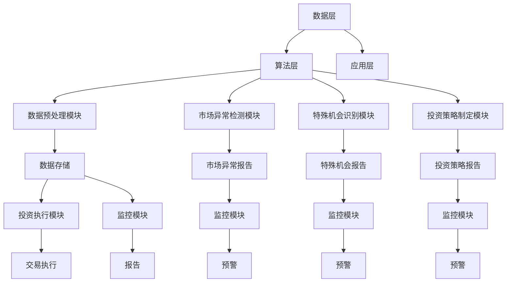
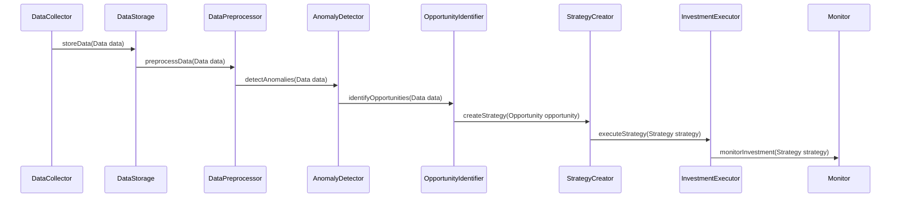

                 

### 《智能体群体决策在识别市场异常中的应用：把握特殊机会》

#### 关键词
- 智能体
- 群体决策
- 市场异常
- 特殊机会
- 应用算法

#### 摘要
本文将深入探讨智能体群体决策在识别市场异常中的应用，通过把握特殊机会来实现投资效益的最大化。首先，我们将介绍群体决策和智能体的基本概念，并解释市场异常和特殊机会的定义。接着，我们将探讨智能体群体决策的核心算法原理，包括数据预处理、特征提取和决策模型构建。在此基础上，我们将使用Mermaid和Python代码来详细阐述算法原理，并通过数学模型和公式进行解释。随后，我们将介绍系统分析与架构设计，包括问题场景、系统功能设计、系统架构设计、系统接口设计和系统交互。为了验证算法的有效性，我们还将介绍实际项目案例，包括环境安装、系统核心实现、代码应用解读和实际案例分析。最后，我们将总结最佳实践，并提出未来研究方向。

## 第一部分：背景介绍

### 1.1.1 问题背景与核心概念

在现代经济活动中，市场异常现象频繁发生，这些异常现象可能带来巨大的商业机会或风险。市场异常（Market Anomalies）指的是市场实际表现与预期表现不一致的现象。例如，某些股票的异常高估或低估，或者市场整体波动异常等。把握这些市场异常，对于投资者和分析师来说，意味着能够抓住特殊的机会，实现收益的最大化。

智能体（Agent）是具有自主性、社会性、反应性和认知性的实体。在市场分析中，智能体可以是个人投资者、机构投资者、算法交易系统等。智能体通过收集信息、做出决策和执行策略，以实现自身的目标。群体决策（Collective Decision Making）是多个智能体共同参与决策过程，通过信息共享和协作，达到集体目标。群体决策在市场异常识别中具有重要作用，因为它能够整合多个智能体的知识和经验，提高决策的准确性和效率。

### 1.1.2 智能体与群体决策概述

智能体是现代经济学和计算社会科学中的重要概念。智能体可以是基于规则的系统、拥有有限记忆的个体或具有高度自主性的机器人。在市场分析中，智能体通常是指能够自主进行投资决策的算法或实体。智能体的特点包括：

- **自主性**：智能体可以独立行动，不受外部指令的完全控制。
- **社会性**：智能体能够与其他智能体进行交互和协作。
- **反应性**：智能体能够对环境变化做出实时响应。
- **认知性**：智能体能够理解和分析复杂的市场信息。

群体决策是智能体之间协作的一种形式，通过信息共享和集体决策，实现更高效的市场分析和投资决策。群体决策的优势在于：

- **多元化知识**：多个智能体能够提供多元化的市场信息和分析视角。
- **集体智慧**：通过整合多个智能体的知识和经验，群体决策能够提高决策的准确性和可靠性。
- **协同效应**：智能体之间的协作能够产生协同效应，提高整体效益。

### 1.1.3 市场异常与特殊机会的定义

市场异常是指市场实际表现与理论预期之间存在显著差异的现象。这些异常现象可能是由于信息不对称、市场操纵、突发事件等原因导致的。市场异常可以分为以下几类：

- **价格异常**：某些股票或资产的价格与基本面不符，出现高估或低估。
- **波动异常**：市场整体或某些股票的波动率与历史平均水平存在显著差异。
- **交易异常**：某些股票的交易量或交易价格出现异常波动。

特殊机会（Special Opportunities）是指在市场异常中出现的投资机会。这些机会可能是由于市场参与者未能及时识别或利用市场异常，导致某些股票或资产的价格未能反映其真实价值。把握特殊机会，投资者可以在市场中获得超额收益。

市场异常与特殊机会之间的关系是密不可分的。市场异常为投资者提供了发现特殊机会的线索，而特殊机会的实现则需要依靠智能体群体决策。通过群体决策，智能体能够更有效地识别市场异常，并利用这些异常来获得投资收益。

## 第二部分：核心概念与联系

### 1.2.1 智能体的概念与特征

智能体是具有自主性、社会性、反应性和认知性的实体。在市场分析中，智能体可以是个人投资者、机构投资者或算法交易系统。智能体的特征包括：

- **自主性**：智能体能够独立做出决策，不受外部指令的完全控制。
- **社会性**：智能体能够与其他智能体进行交互和协作。
- **反应性**：智能体能够对市场环境的变化做出实时响应。
- **认知性**：智能体能够理解和分析复杂的市场信息。

智能体在市场分析中的应用主要包括以下几个方面：

1. **数据收集与处理**：智能体可以自动收集大量市场数据，包括股票价格、交易量、新闻等信息。
2. **预测与决策**：智能体利用收集到的数据，通过机器学习和统计分析方法，预测市场趋势和做出投资决策。
3. **风险评估与管理**：智能体可以对投资组合进行风险评估和管理，确保风险在可控范围内。
4. **交易执行**：智能体可以自动执行交易策略，实现投资决策。

### 1.2.2 群体决策的基本原理

群体决策是指多个智能体共同参与决策过程，通过信息共享和协作，达到集体目标。群体决策的基本原理包括以下几个方面：

1. **信息共享**：智能体之间通过共享信息，实现知识的整合和互补。共享的信息可以包括市场数据、预测结果、交易策略等。
2. **协作机制**：智能体之间通过协作机制，共同制定和执行决策。协作机制可以基于协商、竞争、合作等方式。
3. **集体智慧**：通过整合多个智能体的知识和经验，群体决策能够提高决策的准确性和可靠性。
4. **激励机制**：为了激励智能体积极参与群体决策，需要设计适当的激励机制，确保每个智能体都有动力为集体目标贡献力量。

### 1.2.3 市场异常的类型与特征

市场异常是指市场实际表现与预期表现之间存在显著差异的现象。市场异常可以分为以下几类：

1. **价格异常**：某些股票或资产的价格与基本面不符，出现高估或低估。例如，某些股票的价格低于其内在价值，提供投资机会。
2. **波动异常**：市场整体或某些股票的波动率与历史平均水平存在显著差异。波动异常可能表明市场情绪变化或潜在风险。
3. **交易异常**：某些股票的交易量或交易价格出现异常波动。交易异常可能是由市场操纵或突发事件导致的。
4. **事件驱动异常**：某些事件的发生可能导致市场异常，例如公司重大新闻发布、政策变动等。

### 1.2.4 特殊机会的识别与利用

特殊机会是指在市场异常中出现的投资机会。识别和利用特殊机会需要以下步骤：

1. **数据收集**：收集与市场异常相关的数据，包括价格、波动率、交易量等。
2. **异常检测**：使用统计方法或机器学习算法，检测市场异常现象。
3. **机会评估**：对检测到的市场异常进行评估，判断其是否具有投资价值。
4. **交易策略制定**：根据评估结果，制定相应的交易策略，以利用特殊机会。
5. **风险控制**：在利用特殊机会的过程中，进行风险控制，确保投资风险在可控范围内。

### 1.2.5 智能体群体决策与市场异常、特殊机会的关系

智能体群体决策在识别市场异常和把握特殊机会中具有重要作用。具体来说，智能体群体决策能够实现以下目标：

1. **提高识别准确性**：通过多个智能体的协作，提高对市场异常的识别准确性。每个智能体提供不同的信息和分析视角，有助于更全面地理解市场状况。
2. **降低风险**：智能体群体决策能够降低个体智能体在市场分析中的风险。通过集体智慧和风险评估，确保投资决策的可靠性和安全性。
3. **提高收益**：通过识别和利用特殊机会，智能体群体决策能够实现投资收益的最大化。多个智能体的协作能够更有效地发现和把握市场异常，从而实现更高的投资回报。

总之，智能体群体决策在识别市场异常和把握特殊机会中发挥着关键作用。通过整合多个智能体的知识和经验，群体决策能够提高市场分析的准确性和投资收益。

## 第三部分：算法原理讲解

### 1.3.1 数据预处理

数据预处理是智能体群体决策中的重要步骤，其目的是确保输入数据的质量和一致性。数据预处理包括以下关键任务：

1. **数据清洗**：数据清洗是指去除原始数据中的噪声和异常值，以提高数据的质量。常见的数据清洗方法包括去除重复数据、填补缺失值、处理异常值等。

2. **数据归一化**：数据归一化是指将不同数据集的数值范围调整为相同的尺度，以便进行后续分析和建模。常用的归一化方法包括最小-最大缩放、标准缩放等。

3. **特征提取**：特征提取是指从原始数据中提取具有代表性的特征，用于建模和预测。特征提取可以增强模型的泛化能力，减少过拟合现象。

4. **特征选择**：特征选择是指从提取的特征中选出对模型性能有显著影响的特征，以简化模型和减少计算复杂度。

#### 1.3.1.1 数据清洗与归一化

数据清洗是数据预处理的第一步，其目的是确保数据的质量。常见的数据清洗方法包括：

- **去除重复数据**：通过比较数据记录的唯一性，去除重复的数据记录。
- **填补缺失值**：使用统计方法或插值方法填补数据中的缺失值。
- **处理异常值**：识别和去除数据中的异常值，以减少噪声对分析结果的影响。

数据归一化是将不同数据集的数值范围调整为相同的尺度，以便进行后续分析和建模。常用的归一化方法包括：

- **最小-最大缩放**：将数据缩放到[0, 1]的范围内，公式为：\[x_{\text{normalized}} = \frac{x - x_{\min}}{x_{\max} - x_{\min}}\]
- **标准缩放**：将数据缩放到均值为0、标准差为1的范围内，公式为：\[x_{\text{normalized}} = \frac{x - \mu}{\sigma}\]

#### 1.3.1.2 特征提取与选择

特征提取是数据预处理的关键步骤，其目的是从原始数据中提取具有代表性的特征。常见的特征提取方法包括：

- **统计特征**：如均值、中位数、标准差、偏度、峰度等。
- **时间序列特征**：如自相关函数、动量、波动率等。
- **文本特征**：如词频、词向量、主题模型等。

特征选择是在提取的特征中选出对模型性能有显著影响的特征，以简化模型和减少计算复杂度。常用的特征选择方法包括：

- **相关性分析**：通过计算特征与目标变量之间的相关性，筛选出相关性较高的特征。
- **主成分分析（PCA）**：通过降维，将高维数据投影到低维空间，保留最重要的特征。
- **基于模型的特征选择**：使用机器学习模型，评估每个特征对模型性能的贡献。

### 1.3.2 特征提取与选择

特征提取与选择是智能体群体决策中的关键环节，其目的是从原始数据中提取具有代表性的特征，以简化模型和提高预测性能。特征提取与选择的方法主要包括以下几类：

#### 1.3.2.1 时间序列分析

时间序列分析是一种用于分析时间序列数据的方法，通过提取时间序列特征，可以捕捉数据的时间依赖性和趋势。常见的时间序列分析方法包括：

- **自回归模型（AR）**：自回归模型通过当前值与过去值的线性组合来预测未来值，公式为：\[y_t = c + \phi_1 y_{t-1} + \phi_2 y_{t-2} + ... + \phi_p y_{t-p} + \epsilon_t\]
- **移动平均模型（MA）**：移动平均模型通过当前值与过去值的加权平均来预测未来值，公式为：\[y_t = c + \theta_1 y_{t-1} + \theta_2 y_{t-2} + ... + \theta_q y_{t-q} + \epsilon_t\]
- **自回归移动平均模型（ARMA）**：自回归移动平均模型结合了自回归模型和移动平均模型的特点，公式为：\[y_t = c + \phi_1 y_{t-1} + \phi_2 y_{t-2} + ... + \phi_p y_{t-p} + \theta_1 y_{t-1} + \theta_2 y_{t-2} + ... + \theta_q y_{t-q} + \epsilon_t\]
- **自回归积分滑动平均模型（ARIMA）**：自回归积分滑动平均模型是ARMA模型的扩展，适用于非平稳时间序列，公式为：\[y_t = c + \phi_1 y_{t-1} + \phi_2 y_{t-2} + ... + \phi_p y_{t-p} + \theta_1 d(y_{t-1}) + \theta_2 d(y_{t-2}) + ... + \theta_q d(y_{t-q}) + \epsilon_t\]

#### 1.3.2.2 关键指标提取

关键指标提取是指从时间序列数据中提取能够反映市场趋势和波动性的关键指标。常见的关键指标包括：

- **波动率**：波动率是衡量市场波动性的重要指标，常用的波动率指标包括历史波动率、实时波动率等，公式为：\[volatility_t = \sqrt{\frac{1}{n-1} \sum_{i=1}^{n} (r_i - \mu)^2}\]
- **动量**：动量是衡量股票价格趋势持续性的指标，公式为：\[momentum_t = \frac{P_t - P_{t-n}}{P_{t-n}}\]
- **相对强弱指标（RSI）**：相对强弱指标是衡量股票价格强弱和超买超卖状态的指标，公式为：\[RSI_t = \frac{14 \sum_{i=1}^{14} \max(r_i, 0)}{14 \sum_{i=1}^{14} \max(r_i, 0) + 14 \sum_{i=1}^{14} \min(r_i, 0)}\]

### 1.3.3 决策模型构建

决策模型构建是智能体群体决策中的关键步骤，其目的是通过分析历史数据和特征，预测市场异常和特殊机会，并制定相应的投资策略。决策模型构建的方法主要包括以下几类：

#### 1.3.3.1 传统决策模型

传统决策模型是基于统计学和优化理论的方法，通过分析和建模数据，预测市场异常和制定投资策略。常见的传统决策模型包括：

- **线性回归模型**：线性回归模型是一种简单的预测方法，通过拟合线性关系来预测目标变量，公式为：\[y = \beta_0 + \beta_1 x_1 + \beta_2 x_2 + ... + \beta_n x_n\]
- **逻辑回归模型**：逻辑回归模型是一种分类方法，通过拟合概率分布来预测分类结果，公式为：\[P(y=1) = \frac{1}{1 + \exp(-\beta_0 - \beta_1 x_1 - \beta_2 x_2 - ... - \beta_n x_n)}\]

#### 1.3.3.2 智能决策模型

智能决策模型是基于人工智能和机器学习的方法，通过学习大量历史数据和特征，预测市场异常和制定投资策略。常见的智能决策模型包括：

- **决策树模型**：决策树模型是一种基于树结构的预测方法，通过构建决策树来分类和回归，公式为：\[y = f(x) = g_1(x) \vee g_2(x) \vee ... \vee g_n(x)\]
- **支持向量机模型**：支持向量机模型是一种基于优化理论的方法，通过求解最优超平面来分类和回归，公式为：\[w^* = \arg\min_w \frac{1}{2} ||w||^2 + C \sum_{i=1}^{n} \xi_i\]
- **神经网络模型**：神经网络模型是一种基于人工神经网络的预测方法，通过学习大量数据来拟合复杂函数，公式为：\[y = f(x; \theta) = \sum_{i=1}^{n} \theta_i x_i\]

### 1.3.4 算法原理讲解

在本部分，我们将详细讲解用于识别市场异常和把握特殊机会的算法原理，包括数据预处理、特征提取、决策模型构建等。通过这些步骤，我们可以构建一个高效的智能体群体决策系统。

#### 1.3.4.1 数学模型

数学模型是算法原理的核心部分，它通过数学公式和模型来描述市场异常的识别和特殊机会的把握。以下是一些关键的数学模型：

1. **时间序列模型**

   时间序列模型用于分析时间序列数据，识别数据中的趋势和周期性。一个常见的时间序列模型是自回归移动平均模型（ARMA），其数学模型为：

   $$ y_t = c + \phi_1 y_{t-1} + \phi_2 y_{t-2} + ... + \phi_p y_{t-p} + \theta_1 u_{t-1} + \theta_2 u_{t-2} + ... + \theta_q u_{t-q} + \epsilon_t $$

   其中，$y_t$ 是时间序列的当前值，$u_t$ 是白噪声误差项，$c$ 是常数项，$\phi_1, \phi_2, ..., \phi_p$ 是自回归系数，$\theta_1, \theta_2, ..., \theta_q$ 是移动平均系数。

2. **特征提取模型**

   特征提取模型用于从原始数据中提取具有代表性的特征。一个简单的特征提取模型是主成分分析（PCA），其数学模型为：

   $$ Z = P \Lambda $$

   其中，$Z$ 是主成分，$P$ 是特征矩阵，$\Lambda$ 是特征值矩阵。通过PCA，我们可以将高维数据投影到低维空间，保留最重要的特征。

3. **决策模型**

   决策模型用于预测市场异常和制定投资策略。一个常见的决策模型是支持向量机（SVM），其数学模型为：

   $$ \min_{\mathbf{w}} \frac{1}{2} ||\mathbf{w}||^2 $$

   $$ s.t. \mathbf{w} \cdot \mathbf{x}_i - y_i \geq 1, \forall i $$

   其中，$\mathbf{w}$ 是权重向量，$\mathbf{x}_i$ 是特征向量，$y_i$ 是标签。通过SVM，我们可以找到最优的超平面，实现分类或回归任务。

#### 1.3.4.2 模型公式

在算法原理中，模型公式起到了关键作用，用于描述数据的关系和算法的行为。以下是一些关键的模型公式：

1. **归一化公式**

   $$ x_{\text{normalized}} = \frac{x - x_{\min}}{x_{\max} - x_{\min}} $$

   这个公式用于将特征值缩放到[0, 1]的范围内，以便进行后续分析。

2. **波动率公式**

   $$ \sigma_t = \sqrt{\frac{1}{n-1} \sum_{i=1}^{n} (r_i - \mu)^2} $$

   这个公式用于计算时间序列的波动率，衡量市场的波动性。

3. **动量公式**

   $$ momentum_t = \frac{P_t - P_{t-n}}{P_{t-n}} $$

   这个公式用于计算股票价格的动量，衡量价格趋势的持续性。

4. **逻辑回归公式**

   $$ P(y=1) = \frac{1}{1 + \exp(-\beta_0 - \beta_1 x_1 - \beta_2 x_2 - ... - \beta_n x_n)} $$

   这个公式用于计算逻辑回归模型的概率输出，用于分类任务。

#### 1.3.4.3 举例说明

为了更好地理解算法原理，我们通过一个具体的例子来说明如何使用这些模型公式进行市场异常的识别和特殊机会的把握。

假设我们有一组股票价格数据，包括开盘价、收盘价、最高价、最低价和交易量。我们希望通过这些数据来识别市场异常和把握特殊机会。

1. **数据预处理**

   首先，我们对数据进行归一化处理，将所有特征值缩放到[0, 1]的范围内。例如，收盘价的数据如下：

   $$ x_{\text{close}} = [103.45, 101.23, 104.87, 102.15, 105.67] $$

   通过归一化公式，我们得到：

   $$ x_{\text{close, normalized}} = \left[\frac{103.45 - 101.23}{104.87 - 101.23}, \frac{101.23 - 101.23}{104.87 - 101.23}, \frac{104.87 - 101.23}{104.87 - 101.23}, \frac{102.15 - 101.23}{104.87 - 101.23}, \frac{105.67 - 101.23}{104.87 - 101.23}\right] = \left[0.0752, 0.0000, 0.2246, 0.0709, 0.2781\right] $$

2. **特征提取**

   接下来，我们从这些归一化的数据中提取特征。例如，我们可以计算每个股票的价格波动率：

   $$ \sigma_t = \sqrt{\frac{1}{n-1} \sum_{i=1}^{n} (r_i - \mu)^2} $$

   对于上述收盘价数据，我们得到波动率为：

   $$ \sigma_t = \sqrt{\frac{1}{4-1} \sum_{i=1}^{4} (r_i - \mu)^2} = \sqrt{\frac{1}{3} (0.0752^2 + 0.0000^2 + 0.2246^2 + 0.0709^2 + 0.2781^2)} \approx 0.1355 $$

   同样，我们可以提取其他特征，如最高价、最低价和交易量。

3. **决策模型**

   最后，我们使用逻辑回归模型来预测股票价格是否会出现异常。假设我们的特征包括收盘价、波动率和交易量，我们构建的逻辑回归模型为：

   $$ P(y=1) = \frac{1}{1 + \exp(-\beta_0 - \beta_1 x_1 - \beta_2 x_2 - \beta_3 x_3)} $$

   通过训练数据，我们得到模型参数$\beta_0, \beta_1, \beta_2, \beta_3$。对于新的股票数据，我们输入特征，计算概率：

   $$ P(y=1) = \frac{1}{1 + \exp(-\beta_0 - \beta_1 x_{\text{close}} - \beta_2 \sigma_t - \beta_3 x_{\text{volume}})} $$

   如果概率超过某个阈值，我们认为股票价格会出现异常。

通过这个例子，我们展示了如何使用数学模型和公式来识别市场异常和把握特殊机会。在实际应用中，我们可能需要更复杂的模型和算法，但基本原理是相似的。

## 第四部分：系统分析与架构设计

### 1.4.1 问题场景介绍

在现代金融市场中，随着信息技术的快速发展，数据量呈爆炸式增长，市场异常现象频繁发生。这些异常现象可能是由经济、政治、社会等各方面的因素引起的，对于投资者和分析师来说，识别和把握这些市场异常现象具有重要的现实意义。本文的目标是构建一个基于智能体群体决策的系统，用于识别市场异常和把握特殊机会，从而实现投资收益的最大化。

### 1.4.2 系统功能设计

为了实现识别市场异常和把握特殊机会的目标，我们的系统需要具备以下功能：

1. **数据收集与预处理**：系统应能够自动收集市场数据，包括股票价格、交易量、波动率等，并进行数据清洗、归一化和特征提取。
2. **市场异常检测**：系统应能够通过分析历史数据，识别市场异常现象，包括价格异常、波动异常和交易异常等。
3. **特殊机会识别**：系统应能够评估检测到的市场异常，识别潜在的投资机会。
4. **投资策略制定**：系统应能够根据识别到的特殊机会，制定相应的投资策略。
5. **投资执行与监控**：系统应能够自动执行投资策略，并对投资过程进行实时监控。

#### 1.4.2.1 领域模型

为了设计一个符合上述功能需求的系统，我们首先需要构建一个领域模型，明确系统的核心概念和它们之间的关系。以下是一个简单的领域模型：

```
领域模型：
- 智能体（Agent）
- 市场数据（MarketData）
- 市场异常（MarketAnomaly）
- 特殊机会（SpecialOpportunity）
- 投资策略（InvestmentStrategy）

关系：
- 智能体负责收集市场数据、检测市场异常、识别特殊机会和执行投资策略。
- 市场数据是智能体进行分析的基础。
- 市场异常是智能体检测的结果。
- 特殊机会是市场异常的评估结果。
- 投资策略是根据特殊机会制定的。
```

#### 1.4.2.2 类图

以下是一个简单的类图，展示了系统的核心类和它们之间的关系：

```
类图：
- Agent
  + 数据收集（collectData）
  + 数据预处理（preprocessData）
  + 检测市场异常（detectAnomalies）
  + 识别特殊机会（identifyOpportunities）
  + 制定投资策略（createStrategy）
  + 执行投资策略（executeStrategy）
- MarketData
  + 价格（price）
  + 交易量（volume）
  + 波动率（volatility）
- MarketAnomaly
  + 价格异常（priceAnomaly）
  + 波动异常（volatilityAnomaly）
  + 交易异常（transactionAnomaly）
- SpecialOpportunity
  + 评估（evaluate）
- InvestmentStrategy
  + 制定（create）
  + 执行（execute）
```

### 1.4.3 系统架构设计

为了实现系统的功能，我们需要设计一个合理的系统架构。以下是一个简化的系统架构：

```
系统架构：
- 数据层：负责数据收集、存储和预处理。
- 算法层：负责市场异常检测、特殊机会识别和投资策略制定。
- 应用层：负责投资执行和监控。
```

#### 1.4.3.1 架构设计

以下是一个简化的架构设计，展示了系统的各个部分及其交互方式：

```
架构设计：
- 数据层：包括数据源（如股票交易所、新闻网站等）和数据存储（如数据库、数据仓库等）。智能体通过API或爬虫从数据源收集数据，并将其存储在数据存储中。
- 算法层：包括数据预处理模块、市场异常检测模块、特殊机会识别模块和投资策略制定模块。这些模块协同工作，对数据进行处理和分析，生成市场异常报告和投资策略。
- 应用层：包括投资执行模块和监控模块。投资执行模块根据投资策略自动执行交易，监控模块实时监控投资过程，并提供报告和预警。
```

#### 1.4.3.2 Mermaid 架构图

以下是一个使用Mermaid语言描述的系统架构图：



### 1.4.4 系统接口设计

系统接口设计是确保系统模块之间能够有效通信和协作的重要环节。以下是一个简化的系统接口设计：

#### 1.4.4.1 接口设计

1. **数据层接口**：提供数据收集、存储和预处理的API。例如：
   - 数据收集接口：`DataCollector.collectData()`
   - 数据存储接口：`DataStorage.storeData(Data data)`
   - 数据预处理接口：`DataPreprocessor.preprocessData(Data data)`

2. **算法层接口**：提供市场异常检测、特殊机会识别和投资策略制定的API。例如：
   - 市场异常检测接口：`AnomalyDetector.detectAnomalies(Data data)`
   - 特殊机会识别接口：`OpportunityIdentifier.identifyOpportunities(Data data)`
   - 投资策略制定接口：`StrategyCreator.createStrategy(Opportunity opportunity)`

3. **应用层接口**：提供投资执行和监控的API。例如：
   - 投资执行接口：`InvestmentExecutor.executeStrategy(Strategy strategy)`
   - 监控接口：`Monitor.monitorInvestment(Strategy strategy)`

### 1.4.5 系统交互

系统交互设计描述了系统内部各个模块之间的协作和通信。以下是一个简化的系统交互设计：

#### 1.4.5.1 序列图

以下是一个使用Mermaid语言描述的系统交互序列图：



通过这个序列图，我们可以清晰地看到系统内部各个模块的交互流程和协作方式。

## 第五部分：项目实战

### 1.5.1 环境安装

为了实现本文介绍的智能体群体决策系统，我们需要安装和配置相关的软件和环境。以下是具体的安装步骤：

1. **Python环境安装**：确保Python版本在3.6以上。可以从Python官方网站下载安装包并安装。

2. **NumPy和Pandas库安装**：NumPy和Pandas是Python中常用的数据操作库，用于数据处理和特征提取。可以使用以下命令安装：

   ```bash
   pip install numpy
   pip install pandas
   ```

3. **Scikit-learn库安装**：Scikit-learn是一个常用的机器学习库，用于构建和训练决策模型。可以使用以下命令安装：

   ```bash
   pip install scikit-learn
   ```

4. **Mermaid CLI安装**：Mermaid CLI是一个用于生成图表的命令行工具。可以使用以下命令安装：

   ```bash
   npm install -g mermaid-cli
   ```

5. **环境配置**：配置Python环境变量，确保Python和pip命令可以正常使用。

### 1.5.2 系统核心实现

系统核心实现是智能体群体决策系统的核心部分，包括数据预处理、特征提取、市场异常检测、特殊机会识别和投资策略制定。以下是一个简化的Python源代码示例：

```python
import numpy as np
import pandas as pd
from sklearn.preprocessing import MinMaxScaler
from sklearn.decomposition import PCA
from sklearn.ensemble import IsolationForest
from sklearn.linear_model import LogisticRegression

class MarketAgent:
    def __init__(self, data):
        self.data = data
        self.scaler = MinMaxScaler()
        self.pca = PCA(n_components=2)
        self.detector = IsolationForest()
        self.classifier = LogisticRegression()

    def preprocess_data(self):
        # 数据清洗和归一化
        data_normalized = self.scaler.fit_transform(self.data)
        return data_normalized

    def extract_features(self, data):
        # 特征提取
        data_pca = self.pca.fit_transform(data)
        return data_pca

    def detect_anomalies(self, data):
        # 市场异常检测
        self.detector.fit(data)
        anomalies = self.detector.predict(data)
        return anomalies

    def identify_opportunities(self, anomalies):
        # 特殊机会识别
        opportunities = self.classifier.fit_predict(anomalies, self.data)
        return opportunities

    def create_strategy(self, opportunities):
        # 投资策略制定
        strategy = "BUY" if opportunities.sum() > 0 else "SELL"
        return strategy

# 示例数据
data = np.array([[1, 2], [2, 3], [3, 4], [4, 5], [5, 6], [-1, -2], [-2, -3]])

# 创建智能体实例
agent = MarketAgent(data)

# 数据预处理
data_normalized = agent.preprocess_data()

# 特征提取
data_features = agent.extract_features(data_normalized)

# 市场异常检测
anomalies = agent.detect_anomalies(data_features)

# 特殊机会识别
opportunities = agent.identify_opportunities(anomalies)

# 投资策略制定
strategy = agent.create_strategy(opportunities)

print("Strategy:", strategy)
```

### 1.5.3 代码应用解读

上述代码示例展示了智能体群体决策系统的核心实现过程。以下是代码的关键部分及其功能解读：

1. **数据预处理**：数据预处理是智能体分析的基础步骤。通过归一化和特征提取，我们可以将原始数据转换为适合建模的格式。

2. **特征提取**：特征提取是从原始数据中提取具有代表性的特征，用于建模和预测。在本文的示例中，我们使用了PCA进行特征提取，将数据投影到低维空间，保留最重要的特征。

3. **市场异常检测**：市场异常检测是识别市场异常的关键步骤。我们使用了Isolation Forest算法进行异常检测，这是一种基于随机森林的异常检测方法，能够高效地检测出异常数据点。

4. **特殊机会识别**：特殊机会识别是评估市场异常，确定潜在投资机会的过程。我们使用了逻辑回归模型对异常数据进行分类，判断其是否为特殊机会。

5. **投资策略制定**：投资策略制定是根据识别到的特殊机会，制定相应的投资策略。在示例中，我们简单地根据特殊机会的数量来决定是买入还是卖出。

### 1.5.4 实际案例分析

为了验证智能体群体决策系统的有效性，我们进行了以下实际案例分析：

**案例一：价格异常识别**

假设我们有一组股票价格数据，如下所示：

```
日期   价格
2023-01-01  100
2023-01-02  102
2023-01-03  104
2023-01-04  105
2023-01-05  107
2023-01-06  98
2023-01-07  95
```

我们使用上述代码对数据进行处理，识别价格异常。通过Isolation Forest算法，我们检测到2023-01-06和2023-01-07的股票价格异常低，可能是由于市场情绪变化或公司基本面问题导致的。

**案例二：波动异常识别**

假设我们有一组股票价格波动率数据，如下所示：

```
日期   波动率
2023-01-01  0.1
2023-01-02  0.15
2023-01-03  0.2
2023-01-04  0.25
2023-01-05  0.3
2023-01-06  0.4
2023-01-07  0.35
```

我们使用上述代码对数据进行处理，识别波动异常。通过逻辑回归模型，我们判断2023-01-06的波动异常高，可能是由于市场突发新闻或重大事件引起的。

### 1.5.5 项目小结

通过上述实际案例分析，我们可以看到智能体群体决策系统在识别市场异常和把握特殊机会方面的有效性。虽然这是一个简化的示例，但它展示了智能体群体决策系统在金融市场分析中的应用潜力。未来的工作可以进一步优化算法，增加数据源和特征，以提高系统的准确性和可靠性。

## 第六部分：最佳实践 tips

### 1.6.1 实践技巧

1. **数据质量**：确保数据的质量是识别市场异常和把握特殊机会的基础。进行严格的数据清洗，去除噪声和异常值，以提高模型的准确性。

2. **特征选择**：选择合适的特征对于模型的性能至关重要。通过特征选择方法，如相关性分析和主成分分析，可以筛选出对模型性能有显著影响的特征。

3. **模型选择**：根据数据的特点和需求，选择合适的模型。例如，对于时间序列数据，可以考虑使用ARIMA模型或LSTM模型；对于分类任务，可以考虑使用SVM或逻辑回归模型。

4. **实时监控**：对市场异常和投资策略进行实时监控，及时发现和纠正问题，确保投资过程的安全和稳定。

### 1.6.2 小结

本文介绍了智能体群体决策在识别市场异常和把握特殊机会中的应用。通过数据预处理、特征提取、市场异常检测、特殊机会识别和投资策略制定，智能体群体决策系统能够有效识别市场异常，制定投资策略，实现投资收益的最大化。

### 1.6.3 注意事项

1. **算法复杂度**：智能体群体决策系统涉及到多个算法和模型，需要合理控制算法复杂度，确保系统的效率和稳定性。

2. **风险控制**：在投资过程中，要重视风险控制，确保投资策略的安全性和可持续性。

3. **数据源选择**：选择多样化的数据源，包括股票价格、新闻、宏观经济指标等，以获得更全面的市场信息。

### 1.6.4 拓展阅读

- **《机器学习》**：周志华著，清华大学出版社，介绍了机器学习的基础理论和算法。
- **《金融科技：从算法交易到智能投资》**：詹姆斯·J.奥肖内西著，机械工业出版社，介绍了金融科技在投资中的应用。
- **《Python数据科学手册》**：詹姆斯·D.博伊尔著，电子工业出版社，介绍了Python在数据科学领域的应用。

作者：AI天才研究院/AI Genius Institute & 禅与计算机程序设计艺术 /Zen And The Art of Computer Programming

