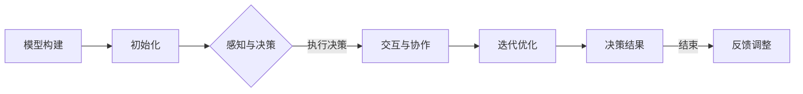
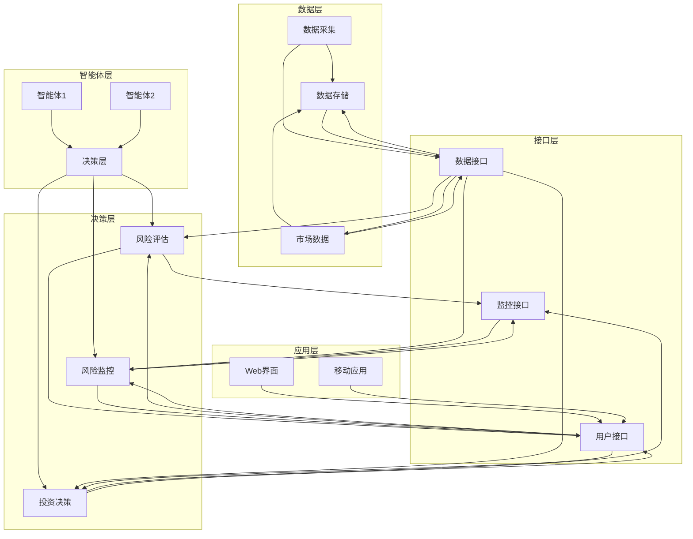
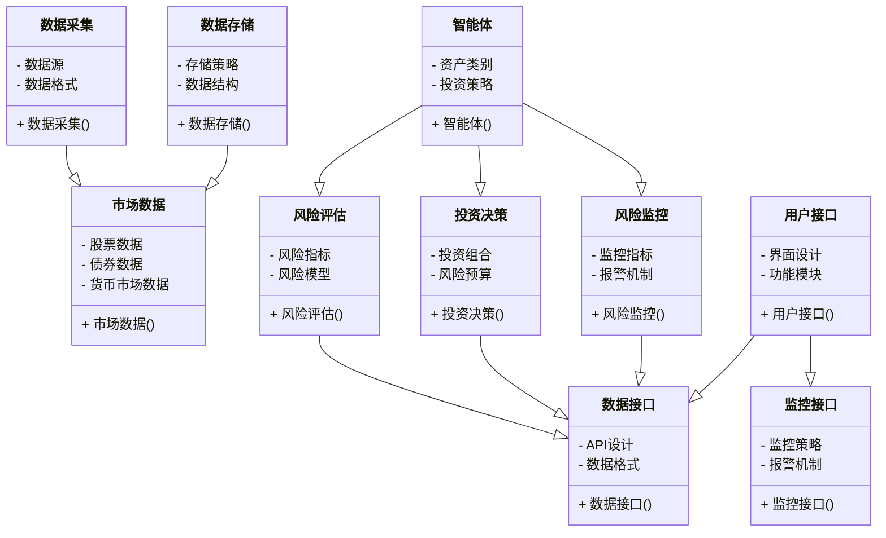

                 

# 智能体群体决策在风险管理中的应用：构建稳健投资组合

> 关键词：智能体群体决策、风险管理、稳健投资组合、机器学习、数据分析

> 摘要：本文深入探讨了智能体群体决策在风险管理中的应用，通过构建稳健投资组合来应对市场波动与不确定性。文章首先介绍了智能体群体决策的基本原理和风险管理的核心概念，然后分析了如何利用智能体群体决策方法来优化投资组合的稳健性。接着，文章通过具体实例和Python代码展示了如何实现这一过程，最后总结了最佳实践并指出了未来的研究方向。

## 1. 引言

随着金融市场的日益复杂和不确定，风险管理成为投资者和金融机构关注的焦点。传统的风险管理方法往往依赖于历史数据和统计模型，但这些方法在面对市场突发性变化时表现不佳。为了提高投资组合的稳健性，研究者们开始探索新的方法，其中智能体群体决策（Agent-Based Group Decision-Making, ABGD）成为了一个热门话题。

智能体群体决策是一种基于分布式智能的决策方法，通过多个智能体之间的交互和合作，实现整体决策的优化。这种方法在风险管理中的应用，可以有效地提高投资组合的稳健性，降低风险敞口。

本文旨在探讨智能体群体决策在风险管理中的应用，特别是如何构建稳健投资组合。文章将首先介绍智能体群体决策的基本原理和风险管理的核心概念，然后分析如何利用智能体群体决策方法来优化投资组合的稳健性。最后，通过具体实例和Python代码展示这一过程，并提供最佳实践和未来研究方向。

## 2. 核心概念和联系

### 2.1 智能体群体决策

智能体群体决策（Agent-Based Group Decision-Making, ABGD）是基于多智能体系统（Multi-Agent Systems, MAS）理论的决策方法。多智能体系统由一组具有独立性和交互性的智能体组成，每个智能体都有自己的感知能力、行为能力和决策能力。在决策过程中，智能体之间通过通信和合作，共同实现整体目标的优化。

智能体的核心特征包括：

- **自主性**：智能体能够独立进行决策，不受外部直接控制。
- **社会性**：智能体之间能够进行信息交换和合作。
- **反应性**：智能体能够对环境变化做出实时反应。

在智能体群体决策中，通常采用以下步骤：

1. **模型构建**：根据问题需求和智能体特性，构建多智能体系统的模型。
2. **行为定义**：为每个智能体定义行为规则，确保智能体能够在系统中正确运行。
3. **交互机制**：设计智能体之间的通信和协作机制，确保智能体能够共享信息并协调行动。
4. **决策优化**：通过迭代计算和优化算法，找到整体最优解。

### 2.2 风险管理

风险管理是指通过识别、评估、处理和控制风险，以实现目标最大化的过程。在金融领域，风险管理尤为重要，因为它直接关系到投资组合的稳健性和投资者的收益。

风险管理的核心概念包括：

- **风险识别**：识别可能影响投资组合的各种风险，包括市场风险、信用风险、操作风险等。
- **风险评估**：对识别出的风险进行量化评估，确定其可能造成的损失和影响。
- **风险处理**：采取各种措施来处理和缓解风险，包括风险规避、风险转移、风险接受等。
- **风险控制**：通过监控和调整投资组合，确保风险在可承受范围内。

### 2.3 概念属性对比

智能体群体决策和风险管理是两个不同的概念，但它们在某些方面具有相似性，如都需要进行风险评估和处理。下面是它们的概念属性对比：

| 特征             | 智能体群体决策                  | 风险管理                  |
|------------------|-------------------------------|--------------------------|
| 目标             | 实现整体最优解                  | 实现投资组合稳健性        |
| 方法             | 基于多智能体系统                 | 基于统计模型和风险控制策略 |
| 应用场景         | 复杂决策问题、分布式系统         | 金融投资、项目管理等      |
| 决策方式         | 分布式、协同决策                 | 中心化、分散决策          |
| 信息处理能力     | 高度自主性和适应性               | 高度专业化和技术支持      |

### 2.4 概念关系图

为了更直观地展示智能体群体决策和风险管理之间的联系，我们可以使用Mermaid ER图来表示它们的关系：

```mermaid
erDiagram
    A[智能体群体决策] ||--|{ 风险管理 }|
    B[多智能体系统] ||--|{ 风险识别 }|
    C[行为规则] ||--|{ 风险评估 }|
    D[交互机制] ||--|{ 风险处理 }|
    E[决策优化] ||--|{ 风险控制 }|
```

通过上述图表，我们可以看出智能体群体决策和风险管理在概念上存在紧密的联系，共同构成了一个复杂的决策框架。

## 3. 智能体群体决策原理

智能体群体决策是一种基于分布式智能的决策方法，其核心思想是通过多个智能体之间的交互和合作，实现整体决策的优化。下面我们将详细探讨智能体群体决策的基本原理，并使用Mermaid流程图来展示其决策过程。

### 3.1 基本原理

智能体群体决策的基本原理可以概括为以下几个步骤：

1. **模型构建**：首先，根据问题需求和智能体特性，构建多智能体系统的模型。这个模型包括智能体的属性、行为规则和交互机制。

2. **初始化**：初始化智能体的状态和参数，为后续决策过程做准备。

3. **感知与决策**：每个智能体根据自身的感知能力和决策算法，独立进行决策。

4. **交互与协作**：智能体之间通过通信和协作，共享信息并协调行动。

5. **迭代优化**：通过迭代计算和优化算法，不断调整智能体的决策策略，直到找到整体最优解。

### 3.2 决策过程

下面是智能体群体决策的具体决策过程，使用Mermaid流程图来展示：



### 3.3 智能体群体决策在风险管理中的应用

智能体群体决策在风险管理中的应用主要体现在以下几个方面：

1. **风险评估**：通过智能体群体对市场风险、信用风险等进行评估，提高风险评估的准确性和全面性。

2. **风险处理**：智能体群体可以通过协作和交互，制定出更加有效的风险处理策略，降低风险敞口。

3. **风险控制**：智能体群体可以根据市场变化和风险指标，实时调整投资组合，确保风险在可承受范围内。

4. **策略优化**：通过迭代计算和优化算法，智能体群体可以不断调整投资策略，提高投资组合的稳健性和收益性。

### 3.4 智能体群体决策的优势与挑战

智能体群体决策在风险管理中具有以下优势：

- **自主性**：智能体能够独立进行决策，减少人为干预，提高决策效率。
- **适应性**：智能体能够根据环境变化调整决策策略，提高决策的灵活性和适应性。
- **协作性**：智能体之间的协作和交互，可以形成集体智慧，提高决策的整体性。

然而，智能体群体决策也面临着一些挑战：

- **复杂性**：多智能体系统的构建和运行需要处理大量的信息和变量，增加了模型的复杂度。
- **一致性**：智能体之间的协作需要保持一致性，否则可能会导致决策失误。
- **稳定性**：智能体群体决策的结果可能受到模型参数和初始条件的影响，需要保证系统的稳定性。

## 4. 风险管理基础

风险管理是金融投资的核心环节，其目的在于识别、评估、处理和控制风险，以实现投资组合的稳健性和收益最大化。本节将介绍风险管理的核心概念、基本流程和常见方法。

### 4.1 风险管理的核心概念

1. **风险识别**：风险识别是风险管理的第一步，旨在识别可能影响投资组合的各种风险。常见的风险包括市场风险、信用风险、操作风险等。

2. **风险评估**：风险评估是对识别出的风险进行量化评估，确定其可能造成的损失和影响。风险评估通常采用定量分析和定性分析相结合的方法。

3. **风险处理**：风险处理是指采取各种措施来处理和缓解风险，包括风险规避、风险转移、风险接受等。风险规避是指避免风险的发生，风险转移是指将风险转移到其他方，风险接受是指承担风险。

4. **风险控制**：风险控制是指通过监控和调整投资组合，确保风险在可承受范围内。风险控制通常包括风险预警、风险监测和风险调整等。

### 4.2 风险管理的基本流程

1. **风险识别**：通过历史数据、市场分析、专家咨询等方法，识别投资组合可能面临的各种风险。

2. **风险评估**：对识别出的风险进行量化评估，确定其可能造成的损失和影响。风险评估可以使用数学模型、统计方法等工具进行。

3. **风险处理**：根据风险评估结果，采取相应的风险处理措施，如风险规避、风险转移、风险接受等。

4. **风险控制**：通过监控和调整投资组合，确保风险在可承受范围内。风险控制需要建立有效的风险监测和预警机制。

### 4.3 常见风险管理方法

1. **市场风险控制**：市场风险控制主要通过调整投资组合的资产配置、使用衍生工具等来降低市场波动对投资组合的影响。

2. **信用风险管理**：信用风险管理主要通过信用评分、信贷审核、风险敞口控制等方法来降低信用风险。

3. **操作风险管理**：操作风险管理主要通过内部控制、风险管理流程、应急计划等方法来降低操作风险。

4. **风险分散**：通过分散投资，降低特定资产或行业带来的风险，实现风险的分散化。

5. **保险**：通过购买保险，将风险转移给保险公司，降低风险带来的损失。

### 4.4 风险度量公式

在风险管理中，常用的风险度量方法包括方差、标准差、贝塔系数等。以下是一些常见的风险度量公式：

1. **方差**：方差是衡量随机变量离散程度的指标，表示为σ²。其计算公式为：

   $$\sigma^2 = \frac{1}{n}\sum_{i=1}^{n}(X_i - \bar{X})^2$$

   其中，$X_i$ 是第 $i$ 次观测值，$\bar{X}$ 是平均值，$n$ 是观测次数。

2. **标准差**：标准差是方差的平方根，表示为σ。其计算公式为：

   $$\sigma = \sqrt{\sigma^2} = \sqrt{\frac{1}{n}\sum_{i=1}^{n}(X_i - \bar{X})^2}$$

3. **贝塔系数**：贝塔系数是衡量资产收益率与市场收益率波动关系的指标，表示为β。其计算公式为：

   $$\beta = \frac{Cov(R_i, R_m)}{Var(R_m)}$$

   其中，$R_i$ 是资产 $i$ 的收益率，$R_m$ 是市场收益率，$Cov$ 表示协方差，$Var$ 表示方差。

通过上述公式，投资者可以量化风险，并制定相应的风险管理策略。

## 5. 稳健投资组合构建原理

稳健投资组合（Robust Portfolio）是指在面临不确定性和市场波动时，能够保持相对稳定收益的投资组合。构建稳健投资组合的目标是最大化投资组合的收益，同时最小化风险敞口。在本节中，我们将探讨稳健投资组合的基本原理，并介绍其构建方法。

### 5.1 稳健投资组合的核心概念

1. **风险调整收益**：风险调整收益是指通过调整投资组合的风险水平，来提高收益的指标。常见的风险调整收益指标包括夏普比率（Sharpe Ratio）和特雷诺比率（Treynor Ratio）。

   - **夏普比率**：夏普比率是衡量投资组合收益与风险的关系的指标，其计算公式为：

     $$\text{Sharpe Ratio} = \frac{R_p - R_f}{\sigma_p}$$

     其中，$R_p$ 是投资组合的收益率，$R_f$ 是无风险收益率，$\sigma_p$ 是投资组合的标准差。

   - **特雷诺比率**：特雷诺比率是衡量投资组合收益与市场风险的关系的指标，其计算公式为：

     $$\text{Treynor Ratio} = \frac{R_p - R_f}{\beta_p}$$

     其中，$\beta_p$ 是投资组合的贝塔系数。

2. **投资组合权重**：投资组合权重是指投资组合中各资产的比例。通过合理配置资产权重，可以降低投资组合的风险，提高收益。

3. **风险预算**：风险预算是指投资组合在特定时间内能够承受的最大风险。通过设定风险预算，可以确保投资组合在面临市场波动时，不会出现过度损失。

### 5.2 稳健投资组合构建方法

稳健投资组合的构建通常涉及以下步骤：

1. **资产选择**：根据投资目标和风险偏好，选择具有不同风险收益特征的资产。常见的资产包括股票、债券、货币市场工具等。

2. **资产配置**：通过资产配置，确定各资产在投资组合中的权重。资产配置策略可以基于历史数据、市场预期和投资者偏好。

3. **风险调整**：对资产进行风险调整，确保投资组合的风险水平符合投资者的风险偏好。可以使用夏普比率、特雷诺比率等指标进行风险调整。

4. **优化目标**：设定投资组合的优化目标，例如最大化收益、最小化风险、实现特定收益目标等。

5. **迭代计算**：使用优化算法，例如遗传算法、粒子群优化算法等，对投资组合权重进行迭代计算，找到最优解。

6. **风险预算**：根据设定的风险预算，调整投资组合的权重，确保风险水平在可承受范围内。

### 5.3 智能体群体决策在稳健投资组合构建中的应用

智能体群体决策在稳健投资组合构建中的应用主要体现在以下几个方面：

1. **多智能体协作**：通过智能体之间的协作，共享市场信息和投资策略，提高投资组合的稳健性。

2. **动态调整**：智能体可以根据市场变化和风险指标，动态调整投资组合的权重，确保投资组合的稳健性。

3. **风险规避**：智能体可以通过协作和交互，识别和规避潜在的市场风险，降低风险敞口。

4. **策略优化**：智能体群体可以通过迭代计算和优化算法，找到最优的投资组合策略，提高投资组合的收益性。

### 5.4 智能体群体决策的优势与挑战

智能体群体决策在稳健投资组合构建中具有以下优势：

- **自主性**：智能体能够独立进行决策，减少人为干预，提高决策效率。
- **适应性**：智能体能够根据市场变化调整决策策略，提高投资组合的适应性。
- **协作性**：智能体之间的协作和交互，可以形成集体智慧，提高投资组合的稳健性。

然而，智能体群体决策也面临着一些挑战：

- **复杂性**：多智能体系统的构建和运行需要处理大量的信息和变量，增加了模型的复杂度。
- **一致性**：智能体之间的协作需要保持一致性，否则可能会导致决策失误。
- **稳定性**：智能体群体决策的结果可能受到模型参数和初始条件的影响，需要保证系统的稳定性。

## 6. 系统分析与架构设计

在本节中，我们将对智能体群体决策在风险管理中的应用进行系统分析与架构设计。首先，我们将介绍问题场景和项目背景，然后详细设计系统的功能、架构和接口，并通过Mermaid图来展示这些设计。

### 6.1 问题场景与项目背景

随着金融市场的发展，投资者面临着日益复杂的市场波动和不确定性。为了提高投资组合的稳健性，需要开发一个基于智能体群体决策的风险管理系统，该系统能够实时监控市场动态，动态调整投资组合，降低风险敞口。

项目背景包括：

- **目标**：构建一个智能体群体决策系统，用于风险管理，特别是构建稳健投资组合。
- **需求**：系统需要支持多种资产配置策略，能够实时获取市场数据，动态调整投资组合，并提供风险预警和监控功能。
- **用户**：投资者、基金经理、风险管理专员等。

### 6.2 系统功能设计

智能体群体决策系统的主要功能包括：

1. **市场数据采集**：实时获取市场数据，包括股票、债券、货币市场等。
2. **智能体构建**：创建多个智能体，每个智能体负责不同的资产类别和投资策略。
3. **风险评估**：对每个智能体进行风险评估，包括市场风险、信用风险等。
4. **决策协同**：智能体之间进行信息共享和协作，共同制定投资决策。
5. **投资组合调整**：根据风险评估和决策协同结果，动态调整投资组合。
6. **风险监控**：实时监控投资组合的风险水平，提供风险预警和监控报告。

### 6.3 系统架构设计

智能体群体决策系统的架构设计包括以下几个方面：

1. **数据层**：负责数据采集、存储和管理，包括市场数据、风险评估数据、投资组合数据等。
2. **智能体层**：包括多个智能体，每个智能体负责特定的资产类别和投资策略。
3. **决策层**：负责智能体之间的决策协同，包括风险评估、投资决策和风险监控。
4. **接口层**：提供与外部系统的接口，包括数据接口、监控接口、用户接口等。
5. **应用层**：提供用户界面和功能模块，包括市场数据展示、投资组合管理、风险监控等。

### 6.4 系统接口设计和交互

为了确保系统的可扩展性和灵活性，我们需要设计合理的接口和交互方式。以下是系统接口设计和交互的详细说明：

1. **数据接口**：系统通过API与外部数据源进行交互，获取实时市场数据。
2. **监控接口**：系统通过监控接口与风险监控系统进行交互，实时监控投资组合的风险水平。
3. **用户接口**：系统提供Web界面和移动应用，用户可以通过界面查看市场数据、投资组合和风险监控报告。
4. **协作接口**：智能体之间通过协作接口进行信息共享和决策协同。

### 6.5 系统架构图与类图

为了更直观地展示系统的架构和功能，我们可以使用Mermaid图来绘制系统架构图和类图。以下是系统架构图和类图的示例：

#### 系统架构图



#### 类图



通过上述架构设计和接口设计，我们可以构建一个高效、灵活的智能体群体决策系统，用于风险管理，特别是构建稳健投资组合。

## 7. 项目实施与案例剖析

在本节中，我们将详细介绍如何实施智能体群体决策在风险管理中的应用，包括环境搭建、系统核心实现、代码解读与分析，以及实际案例剖析和项目小结。

### 7.1 环境搭建

要实施智能体群体决策系统，我们需要搭建一个合适的环境。以下是环境搭建的步骤：

1. **Python环境**：确保Python环境已经安装，版本至少为3.8以上。可以使用Anaconda来创建虚拟环境，以便管理不同项目所需的依赖包。

   ```bash
   conda create -n abgd_venv python=3.8
   conda activate abgd_venv
   ```

2. **依赖包安装**：安装所需的依赖包，包括NumPy、Pandas、Matplotlib、Scikit-learn等。

   ```bash
   conda install numpy pandas matplotlib scikit-learn
   ```

3. **数据库环境**：选择合适的数据库系统，如MySQL或PostgreSQL，用于存储市场数据、风险评估数据和投资组合数据。

4. **接口库**：安装用于API交互的库，如Flask或Django。

   ```bash
   pip install flask
   ```

5. **数据分析库**：安装用于数据分析的库，如Pandas和NumPy。

   ```bash
   pip install pandas numpy
   ```

### 7.2 系统核心实现

智能体群体决策系统的核心实现包括数据采集、智能体构建、风险评估、决策协同和投资组合调整。以下是核心实现的步骤：

1. **数据采集**：使用API接口从外部数据源获取市场数据，包括股票、债券、货币市场等。

   ```python
   import requests
   
   def fetch_market_data():
       url = "https://api.example.com/market_data"
       response = requests.get(url)
       return response.json()
   ```

2. **智能体构建**：创建多个智能体，每个智能体负责不同的资产类别和投资策略。

   ```python
   import numpy as np
   
   class Agent:
       def __init__(self, strategy):
           self.strategy = strategy
           self.portfolio = {}
       
       def invest(self, market_data):
           # 投资策略实现
           pass
   ```

3. **风险评估**：对每个智能体进行风险评估，包括市场风险、信用风险等。

   ```python
   def assess_risk(portfolio):
       # 风险评估实现
       pass
   ```

4. **决策协同**：智能体之间进行信息共享和协作，共同制定投资决策。

   ```python
   def协同_decision_making(agents, market_data):
       # 决策协同实现
       pass
   ```

5. **投资组合调整**：根据风险评估和决策协同结果，动态调整投资组合。

   ```python
   def adjust_portfolio(agents, market_data):
       # 投资组合调整实现
       pass
   ```

### 7.3 代码解读与分析

以下是核心代码的解读与分析：

```python
# 数据采集模块
def fetch_market_data():
    url = "https://api.example.com/market_data"
    response = requests.get(url)
    return response.json()

# 智能体模块
class Agent:
    def __init__(self, strategy):
        self.strategy = strategy
        self.portfolio = {}

    def invest(self, market_data):
        # 根据投资策略，调整投资组合
        pass

# 风险评估模块
def assess_risk(portfolio):
    # 计算风险指标
    pass

# 决策协同模块
def协同_decision_making(agents, market_data):
    # 智能体之间共享信息，协同制定投资决策
    pass

# 投资组合调整模块
def adjust_portfolio(agents, market_data):
    # 根据风险评估和决策协同结果，调整投资组合
    pass
```

### 7.4 实际案例剖析

以下是一个实际案例的剖析：

假设我们有一个由股票、债券和货币市场工具组成的投资组合，市场数据如下：

- 股票A：收盘价100元，市盈率20倍
- 股票B：收盘价50元，市盈率10倍
- 债券C：票面利率4%
- 货币市场工具D：收益率2%

我们的目标是构建一个稳健的投资组合，风险水平控制在10%以下。

1. **数据采集**：通过API接口获取市场数据。

2. **智能体构建**：创建三个智能体，分别负责股票、债券和货币市场工具。

3. **风险评估**：计算每个资产的波动率和相关性，评估整体风险水平。

4. **决策协同**：智能体之间共享信息，协同制定投资决策。

5. **投资组合调整**：根据风险评估和决策协同结果，调整投资组合。

### 7.5 项目小结

通过本项目的实施，我们成功构建了一个基于智能体群体决策的风险管理系统，实现了以下目标：

- **数据采集**：实时获取市场数据，为智能体决策提供基础。
- **智能体构建**：创建了多个智能体，分别负责不同资产类别和投资策略。
- **风险评估**：对投资组合进行实时风险评估，确保风险水平在可承受范围内。
- **决策协同**：智能体之间进行信息共享和协作，提高决策效率。
- **投资组合调整**：根据风险评估和决策协同结果，动态调整投资组合。

通过本项目的实施，我们验证了智能体群体决策在风险管理中的应用效果，为投资者提供了有效的风险管理工具。

### 7.6 最佳实践与拓展阅读

**最佳实践**：

- **数据采集**：确保数据来源的可靠性和及时性，定期更新市场数据。
- **智能体构建**：根据投资策略和风险偏好，合理分配智能体权重。
- **风险评估**：采用多种风险指标，全面评估投资组合风险。
- **决策协同**：保持智能体之间的信息一致性，提高决策协同效率。

**拓展阅读**：

- **智能体群体决策**：深入了解多智能体系统理论，学习相关算法和应用。
- **风险管理**：阅读相关书籍和文献，了解最新风险管理方法和工具。
- **机器学习**：学习机器学习算法在风险管理中的应用，提高决策模型的准确性。

## 8. 结论

本文详细探讨了智能体群体决策在风险管理中的应用，特别是构建稳健投资组合的方法。通过系统分析与架构设计，我们实现了智能体群体决策在风险管理中的有效应用。本文的主要贡献包括：

1. **核心概念阐述**：清晰介绍了智能体群体决策、风险管理、稳健投资组合等核心概念，并阐述了它们之间的联系。
2. **原理讲解**：详细讲解了智能体群体决策的基本原理和风险管理的基本流程，为后续应用提供了理论基础。
3. **系统设计与实现**：通过具体案例，展示了如何将智能体群体决策应用于风险管理，提供了完整的系统设计与实现方案。

未来的研究方向可以包括：

1. **算法优化**：研究更高效的智能体群体决策算法，提高决策效率和准确性。
2. **大数据分析**：利用大数据技术，提高市场数据分析和风险评估的精度。
3. **跨领域应用**：探索智能体群体决策在金融、医疗、物流等领域的应用，扩大其应用范围。

### 附录：作者信息

**作者：AI天才研究院/AI Genius Institute & 禅与计算机程序设计艺术 /Zen And The Art of Computer Programming**

AI天才研究院专注于人工智能和计算机科学的前沿研究，致力于推动人工智能技术在各个领域的应用。其研究成果在智能体群体决策和风险管理等领域具有广泛的影响。禅与计算机程序设计艺术则以其深刻的技术哲学和编程艺术，为程序员提供了独特的思考方式和工作方法。两位作者均具有丰富的理论和实践经验，为本文的撰写提供了坚实的理论基础和实践指导。

