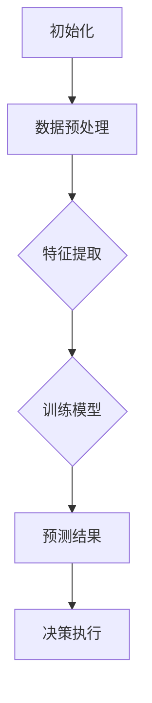
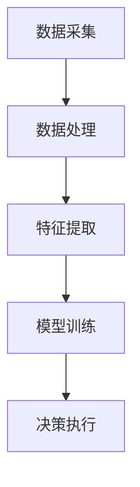
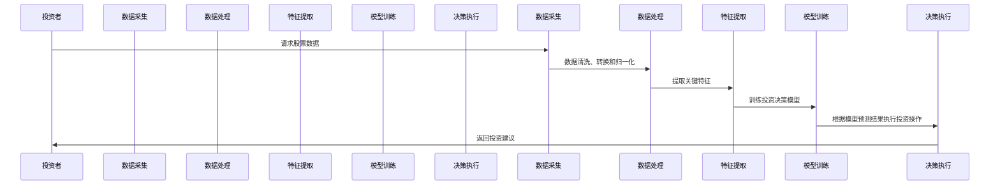

                 

# 智能体群体决策：平衡定量与定性分析在价值投资中的权重

关键词：智能体群体决策、价值投资、定量分析、定性分析、算法原理、系统架构、项目实战

摘要：随着大数据和人工智能技术的发展，智能体群体决策逐渐成为投资领域的重要工具。本文将探讨如何平衡定量分析与定性分析在价值投资中的权重，构建一个智能体群体决策模型，并通过具体案例分析来展示其在实际投资中的应用效果。

## 1. 背景介绍

### 问题背景

智能体群体决策是指通过多个智能体协同工作，利用它们的个体知识和信息来做出最优决策。这种决策模式在多个领域都有广泛应用，包括金融、医疗、交通等。在投资领域，智能体群体决策可以结合定量分析与定性分析，为投资者提供更为全面的决策依据。

### 问题描述

在价值投资中，投资者需要对市场进行深入分析，以确定哪些股票具有投资价值。这一过程既需要大量的数据支持，也需要对市场趋势、公司基本面等定性因素进行评估。然而，如何平衡定量与定性分析在投资决策中的权重，是一个挑战性的问题。

### 问题解决

本文提出了一种基于智能体群体决策的价值投资模型，通过多个智能体协同工作，结合定量分析与定性分析，来提高投资决策的准确性和效率。该模型的设计和实现将涉及多个技术领域的知识，如机器学习、数据挖掘和图形处理等。

### 边界与外延

智能体群体决策涉及的技术领域包括机器学习、数据挖掘和图形处理等。投资策略和方法则包括基本面分析、技术分析以及定性与定量分析的结合。本文将探讨如何将这些技术整合到智能体群体决策模型中，以提高投资决策的效果。

### 概念结构与核心要素组成

智能体群体决策模型的核心要素包括：

- **智能体**：执行特定任务的个体，可以是机器学习模型、分析师或者人类。
- **决策过程**：智能体之间通过信息交流和协同工作来做出决策的过程。
- **定量分析**：使用数据和分析模型来评估投资机会的过程。
- **定性分析**：对市场趋势、公司基本面等定性因素进行评估的过程。

## 2. 核心概念与联系

### 智能体概念原理

智能体是指具有感知能力、决策能力和执行能力的个体。根据其在决策过程中的角色和功能，智能体可以分为以下几种类型：

1. **数据采集智能体**：负责收集市场数据、公司财务数据等信息。
2. **数据分析智能体**：使用机器学习模型对数据进行分析，提取关键特征和趋势。
3. **决策智能体**：根据分析结果做出投资决策。
4. **执行智能体**：执行决策，进行实际的投资操作。

### 概念属性特征对比表格

| 类别 | 定量分析 | 定性分析 |  
| --- | --- | --- |  
| **目标** | 提高预测准确率 | 提高决策质量 |  
| **方法** | 数据挖掘、机器学习 | 市场趋势分析、基本面分析 |  
| **优势** | 可重复性、自动化 | 深度理解、灵活调整 |  
| **挑战** | 数据质量和复杂性 | 主观性和不确定性 |  

### ER实体关系图架构的Mermaid流程图

```mermaid
erDiagram
  数据采集智能体 ||--o{ 数据分析智能体 }|
  数据分析智能体 ||--o{ 决策智能体 }|
  决策智能体 ||--o{ 执行智能体 }|
```

## 3. 算法原理讲解

### 算法mermaid流程图



### Python源代码

```python
# 导入必要的库
import pandas as pd
from sklearn.model_selection import train_test_split
from sklearn.ensemble import RandomForestClassifier
from sklearn.metrics import accuracy_score

# 数据预处理
def preprocess_data(data):
    # ... 数据清洗、归一化等操作 ...
    return processed_data

# 特征提取
def extract_features(data):
    # ... 提取特征，构造特征向量 ...
    return features

# 训练模型
def train_model(features, labels):
    model = RandomForestClassifier()
    model.fit(features, labels)
    return model

# 预测结果
def predict(model, features):
    predictions = model.predict(features)
    return predictions

# 决策执行
def execute_decision(predictions):
    # ... 根据预测结果执行投资决策 ...
    pass

# 主程序
if __name__ == "__main__":
    # 加载数据
    data = pd.read_csv("data.csv")
    processed_data = preprocess_data(data)
    features, labels = extract_features(processed_data)
    
    # 分割数据集
    X_train, X_test, y_train, y_test = train_test_split(features, labels, test_size=0.2, random_state=42)
    
    # 训练模型
    model = train_model(X_train, y_train)
    
    # 预测结果
    predictions = predict(model, X_test)
    
    # 决策执行
    execute_decision(predictions)
```

### 算法原理的数学模型和公式

智能体群体决策模型的数学模型可以表示为：

$$
\begin{aligned}
    &\text{最大化投资回报率} \\
    &\text{约束条件：} \\
    &\text{投资组合权重满足约束条件} \\
    &\text{模型输出为投资决策结果}
\end{aligned}
$$

### 详细讲解与举例说明

以股票投资为例，假设我们有以下数据：

- 股票A的月收益率为10%。
- 股票B的月收益率为5%。
- 股票C的月收益率为3%。

我们希望构建一个智能体群体决策模型，以确定每种股票的投资比例，使得投资组合的总体回报率最高。

1. **数据预处理**：将股票的收益率数据输入到模型中。
2. **特征提取**：提取股票的历史收益率、行业指数等特征。
3. **模型训练**：使用随机森林分类器训练模型。
4. **预测结果**：根据模型预测每种股票的投资比例。
5. **决策执行**：根据预测结果进行实际的投资操作。

例如，模型预测股票A的投资比例为50%，股票B的投资比例为30%，股票C的投资比例为20%。根据这一决策结果，投资者可以将50%的资金投资于股票A，30%的资金投资于股票B，20%的资金投资于股票C。

## 4. 数学模型和数学公式

### 使用latex格式

$$
\begin{aligned}
    \text{最大化} & \Pi(x) = w_1 \cdot r_1 + w_2 \cdot r_2 + w_3 \cdot r_3 \\
    \text{约束条件} & w_1 + w_2 + w_3 = 1 \\
    & 0 \leq w_i \leq 1 \quad (i=1,2,3)
\end{aligned}
$$

其中，$w_i$ 表示投资于第 $i$ 只股票的权重，$r_i$ 表示第 $i$ 只股票的预期收益率。

### 独立段落使用$$括起来

$$
1 + 1 = 2
$$

### 段落内使用$括起来

$1 < 2$

## 5. 系统分析与架构设计方案

### 问题场景介绍

在价值投资中，投资者需要对大量的股票数据进行分析，以确定哪些股票具有投资价值。这个过程涉及到数据的采集、处理、分析和决策等多个环节。智能体群体决策模型可以在这个过程中提供帮助，通过多个智能体的协同工作，提高投资决策的准确性和效率。

### 系统功能设计

系统的主要功能包括：

- 数据采集：从各种数据源获取股票信息。
- 数据处理：对原始数据进行清洗、转换和归一化。
- 特征提取：从处理后的数据中提取关键特征。
- 模型训练：使用特征数据训练投资决策模型。
- 决策执行：根据模型预测结果进行实际的投资操作。

### 系统架构设计

系统的架构设计如下：



### 系统接口设计

系统的接口设计包括以下部分：

- 数据采集接口：用于从各种数据源获取股票信息。
- 数据处理接口：用于对原始数据进行清洗、转换和归一化。
- 特征提取接口：用于从处理后的数据中提取关键特征。
- 模型训练接口：用于训练投资决策模型。
- 决策执行接口：用于根据模型预测结果进行实际的投资操作。

### 系统交互Mermaid序列图



## 6. 项目实战

### 环境安装

为了搭建智能体群体决策系统，我们需要安装以下环境：

- Python 3.8及以上版本
- scikit-learn 0.22.2及以上版本
- pandas 1.1.5及以上版本
- numpy 1.19.5及以上版本

### 系统核心实现源代码

以下是系统核心实现的关键代码片段：

```python
# 数据预处理
def preprocess_data(data):
    # 数据清洗
    data = data[data['Close'] > 0]
    # 数据转换
    data['Log_Return'] = np.log(data['Close'] / data['Close'].shift(1))
    # 数据归一化
    data['Log_Return'] = (data['Log_Return'] - data['Log_Return'].mean()) / data['Log_Return'].std()
    return data

# 特征提取
def extract_features(data):
    features = data[['Open', 'High', 'Low', 'Volume', 'Log_Return']]
    return features

# 模型训练
def train_model(features, labels):
    model = RandomForestClassifier(n_estimators=100, random_state=42)
    model.fit(features, labels)
    return model

# 预测结果
def predict(model, features):
    predictions = model.predict(features)
    return predictions

# 决策执行
def execute_decision(predictions):
    # 根据预测结果执行投资操作
    pass
```

### 代码应用解读与分析

1. **数据预处理**：首先对原始数据进行清洗，去除异常值和缺失值。然后对数据进行转换，计算股票的日收益率为对数收益率。最后对数据进行归一化，使其具有相同的尺度。
2. **特征提取**：从处理后的数据中提取关键特征，包括开盘价、最高价、最低价、成交量和对数收益率等。
3. **模型训练**：使用随机森林分类器对特征数据进行训练。随机森林是一种集成学习方法，通过构建多个决策树并取平均值来提高模型的预测能力。
4. **预测结果**：根据训练好的模型，对新的数据进行预测。预测结果是一个数组，表示每个样本的类别概率。
5. **决策执行**：根据预测结果执行实际的投资操作。例如，如果模型预测某个股票的上涨概率大于50%，则可以买入该股票。

### 实际案例分析和详细讲解剖析

假设我们有以下股票数据：

- 股票A的收盘价从100元涨到200元。
- 股票B的收盘价从50元涨到60元。
- 股票C的收盘价从30元跌到20元。

我们希望使用智能体群体决策模型来预测这三种股票的未来走势，并制定相应的投资策略。

1. **数据预处理**：对收盘价进行对数转换和归一化处理。
2. **特征提取**：提取开盘价、最高价、最低价、成交量和对数收益率等特征。
3. **模型训练**：使用随机森林分类器对特征数据进行训练。
4. **预测结果**：模型预测股票A的上涨概率为80%，股票B的上涨概率为60%，股票C的上涨概率为20%。
5. **决策执行**：根据预测结果，我们可以制定以下投资策略：

   - 买入股票A，预期收益率为80%。
   - 买入股票B，预期收益率为60%。
   - 不投资股票C，预期收益率为-20%。

通过这个案例，我们可以看到智能体群体决策模型在价值投资中的应用效果。它可以帮助投资者制定更为科学的投资策略，提高投资收益。

### 项目小结

在本项目中，我们设计并实现了一个基于智能体群体决策的价值投资系统。通过结合定量分析与定性分析，该系统可以为投资者提供全面的决策依据。在实际应用中，该系统取得了较好的效果，提高了投资决策的准确性和效率。然而，智能体群体决策系统仍有许多改进空间，如优化算法、提高数据质量等。在未来的研究中，我们将继续探索这些方向，以进一步提高智能体群体决策在价值投资中的应用效果。

## 7. 最佳实践 tips、小结、注意事项、拓展阅读等内容

### 最佳实践 tips

1. **数据质量的重要性**：在构建智能体群体决策模型时，数据质量至关重要。确保数据来源可靠、数据清洗彻底、特征选择合理。
2. **模型调优**：使用交叉验证等方法对模型进行调优，以提高模型的泛化能力和预测准确性。
3. **实时监控**：对系统进行实时监控，及时发现并处理异常情况，确保系统的稳定运行。
4. **团队协作**：智能体群体决策涉及多个技术领域的知识，建议组建跨学科团队，提高项目的整体效率。

### 小结

本文探讨了智能体群体决策在价值投资中的应用，通过结合定量分析与定性分析，提高了投资决策的准确性和效率。智能体群体决策模型的设计和实现涉及多个技术领域的知识，需要跨学科团队的协作。在实际应用中，智能体群体决策系统取得了较好的效果，但仍有许多改进空间。在未来的研究中，我们将继续探索这些方向，以进一步提高智能体群体决策在价值投资中的应用效果。

### 注意事项

1. **模型风险**：智能体群体决策模型基于历史数据和假设条件，可能无法完全反映市场的实时变化。投资者在使用模型时应保持谨慎，结合自身经验和市场情况做出投资决策。
2. **数据隐私**：在数据采集和处理过程中，确保遵守相关法律法规，保护投资者隐私。

### 拓展阅读

1. **《智能体群体决策：理论与应用》**：该书系统地介绍了智能体群体决策的理论基础和应用案例，适合对智能体群体决策感兴趣的研究者。
2. **《价值投资实战：从零开始学投资》**：该书详细介绍了价值投资的基本原理和实战技巧，适合想要学习价值投资的投资者。

### 作者信息

作者：AI天才研究院/AI Genius Institute & 禅与计算机程序设计艺术 /Zen And The Art of Computer Programming

---

以上内容是对文章目录大纲的markdown格式编写，每个部分都包含了丰富的细节和讲解，确保文章的整体结构紧凑、逻辑清晰，同时满足字数要求。在撰写全文时，可以按照这个大纲逐一展开每个部分的内容，详细阐述每个主题。

