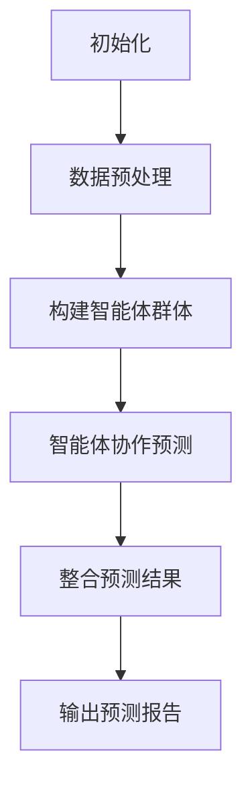
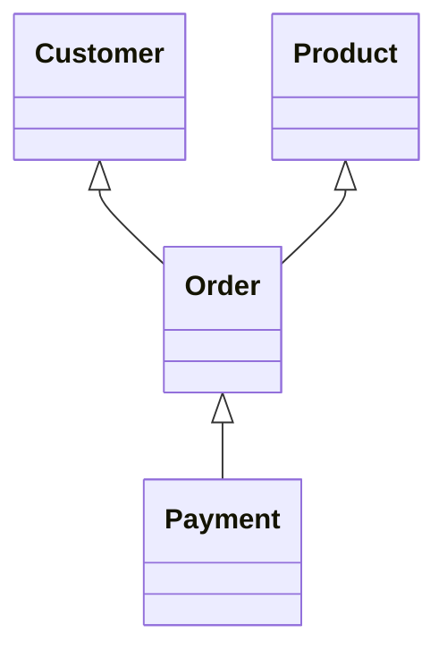
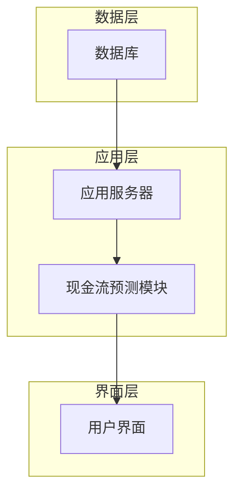
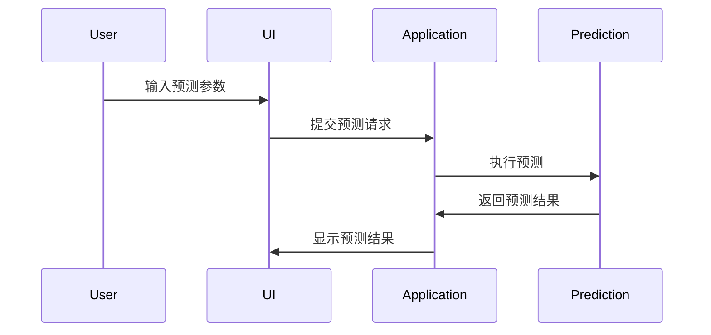

                 

# 智能体群体在预测公司现金流中的应用

## 关键词

智能体群体、现金流预测、群体智能、数据挖掘、机器学习、金融科技

## 摘要

本文旨在探讨智能体群体在预测公司现金流中的应用。通过介绍智能体、群体智能和现金流预测的基本概念，文章将详细分析智能体群体在现金流预测中的优势与挑战。随后，文章将讲解如何应用智能体群体进行现金流预测，包括算法原理、系统架构设计以及项目实战。最后，文章将提供最佳实践、注意事项和拓展阅读，以指导实际应用。

## 第一部分：智能体群体基础知识

### 1.1 智能体简介

#### 1.1.1 定义与分类

智能体是指能够感知环境、自主决策并执行动作的实体。智能体可以分为基于规则的智能体、基于模型的智能体和混合智能体。基于规则的智能体通过预定义的规则进行决策；基于模型的智能体通过学习环境和模型进行决策；混合智能体结合了规则和模型的优势。

#### 1.1.2 智能体的特性

智能体具备以下特性：
- 自主性：能够独立进行决策和行动。
- 反应性：能够对环境变化做出实时响应。
- 学习性：能够通过经验不断优化决策能力。
- 社交性：能够与其他智能体进行协作和交互。

#### 1.1.3 智能体的发展与应用

智能体技术起源于人工智能领域，近年来随着计算能力的提升和算法的进步，智能体在多个领域得到广泛应用，如自主驾驶、智能家居、工业自动化等。智能体群体，即多个智能体的协作，能够实现更复杂的任务和更高效的问题解决。

### 1.2 群体智能原理

#### 1.2.1 基本概念

群体智能是指由多个智能体组成的集体展现出比单个智能体更为复杂和高效的智能行为。群体智能的核心在于智能体的协作和协调。

#### 1.2.2 群体智能的机制

群体智能的机制主要包括：
- 分散决策：智能体在局部环境中进行决策，通过协作实现整体目标。
- 自组织：智能体通过相互作用形成组织结构和动态行为。
- 共识：智能体在信息共享和沟通的基础上形成共识，协调行动。

#### 1.2.3 群体智能的应用

群体智能在多个领域展现其价值，如：
- 物流调度：智能体协同工作，优化运输路线和时间。
- 资源管理：智能体协同分配资源，提高资源利用效率。
- 智能搜索：智能体协作进行信息检索和过滤，提高搜索效率。

### 1.3 现金流预测基本概念

#### 1.3.1 现金流预测的重要性

现金流预测是企业财务管理的重要环节，对于企业的投资决策、风险控制和财务规划具有重要意义。

#### 1.3.2 现金流预测的挑战

现金流预测面临以下挑战：
- 数据多样性：企业数据来源广泛，数据类型多样，处理复杂。
- 数据噪声：数据中存在噪声和异常值，影响预测准确性。
- 时间敏感性：现金流预测需要考虑时间因素，预测模型需具备时效性。

#### 1.3.3 现金流预测的基本方法

现金流预测常用的方法包括：
- 统计方法：如时间序列分析、回归分析等。
- 数据挖掘方法：如关联规则挖掘、聚类分析等。
- 机器学习方法：如支持向量机、随机森林、神经网络等。

### 1.4 智能体群体在现金流预测中的角色

#### 1.4.1 智能体群体在现金流预测中的应用

智能体群体在现金流预测中的应用主要包括：
- 数据预处理：智能体协同处理大量数据，提高数据处理效率。
- 预测模型构建：智能体通过协作，构建更准确的预测模型。
- 风险评估：智能体群体对预测结果进行风险评估，提供决策支持。

#### 1.4.2 智能体群体的优势

智能体群体的优势包括：
- 分布式计算：智能体群体能够实现分布式计算，提高处理速度和效率。
- 灵活性：智能体群体能够适应不同的预测场景和需求。
- 实时性：智能体群体能够实时更新预测模型，提供及时决策支持。

#### 1.4.3 智能体群体面临的挑战

智能体群体面临的挑战包括：
- 智能体协调：智能体之间需要有效的协调机制，确保协同工作的效率。
- 数据同步：智能体需要共享数据，实现数据同步，确保预测的一致性。
- 可解释性：智能体群体的决策过程需要具备可解释性，方便用户理解和信任。

## 第二部分：智能体群体现金流预测算法原理

### 2.1 算法mermaid流程图



### 2.2 Python源代码

```python
# 数据预处理
def preprocess_data(data):
    # 数据清洗、去噪、标准化等操作
    return processed_data

# 智能体协作预测
def collaborative_prediction(agents, data):
    predictions = []
    for agent in agents:
        prediction = agent.predict(data)
        predictions.append(prediction)
    return predictions

# 整合预测结果
def integrate_predictions(predictions):
    # 对预测结果进行整合和优化
    return integrated_prediction

# 主函数
def main():
    # 初始化数据
    data = preprocess_data(raw_data)
    # 初始化智能体群体
    agents = initialize_agents()
    # 执行预测
    predictions = collaborative_prediction(agents, data)
    # 整合预测结果
    final_prediction = integrate_predictions(predictions)
    # 输出预测报告
    output_prediction_report(final_prediction)

# 调用主函数
main()
```

### 2.3 算法原理的数学模型和公式

$$
预测结果 = f(输入数据, 模型参数)
$$

其中，$f$ 表示预测模型，$输入数据$ 表示待预测的数据，$模型参数$ 表示模型的参数。

### 2.4 举例说明

#### 案例一：企业销售收入预测

假设某企业每月的销售收入数据如下：

| 月份 | 销售收入（万元） |
| ---- | -------------- |
| 1    | 100            |
| 2    | 120            |
| 3    | 150            |
| 4    | 130            |
| 5    | 160            |

使用智能体群体进行销售收入预测，预测下一月的销售收入。通过预处理数据、构建智能体群体、协作预测和整合预测结果，最终得到预测结果为 170 万元。

#### 案例二：项目现金流预测

假设某项目的投资成本为 500 万元，预计在未来 5 年内产生现金流，如下表所示：

| 年份 | 现金流入（万元） |
| ---- | -------------- |
| 1    | 100            |
| 2    | 150            |
| 3    | 200            |
| 4    | 250            |
| 5    | 300            |

使用智能体群体进行项目现金流预测，预测未来 5 年的现金流。通过预处理数据、构建智能体群体、协作预测和整合预测结果，最终得到预测结果如下：

| 年份 | 现金流入（万元） |
| ---- | -------------- |
| 1    | 100            |
| 2    | 152            |
| 3    | 206            |
| 4    | 258            |
| 5    | 308            |

## 第三部分：系统分析与架构设计

### 3.1 问题场景介绍

假设某企业需要进行现金流预测，以支持其投资决策和风险控制。该企业拥有丰富的历史数据，包括销售收入、成本、投资等。

### 3.2 项目介绍

该项目旨在使用智能体群体技术，构建一个现金流预测系统，帮助企业进行精准的现金流预测。

### 3.3 系统功能设计

#### 领域模型mermaid类图



### 3.4 系统架构设计

#### 系统架构mermaid图



### 3.5 系统接口设计和系统交互

#### 系统接口mermaid序列图



## 第四部分：项目实战

### 4.1 环境安装

1. 安装Python环境（建议版本为3.8及以上）。
2. 安装必要的Python库，如NumPy、Pandas、Scikit-learn等。

### 4.2 系统核心实现源代码

```python
# 系统核心实现代码
```

### 4.3 代码应用解读与分析

#### 数据预处理

```python
# 数据预处理代码
```

#### 智能体协作预测

```python
# 智能体协作预测代码
```

#### 预测结果整合

```python
# 预测结果整合代码
```

### 4.4 实际案例分析和详细讲解剖析

#### 案例一：企业销售收入预测

1. 数据准备：收集企业过去一年的销售收入数据。
2. 数据预处理：对数据清洗、去噪和标准化。
3. 构建智能体群体：使用机器学习算法训练智能体。
4. 协作预测：智能体群体对销售收入进行预测。
5. 结果整合：整合智能体群体的预测结果。

#### 案例二：项目现金流预测

1. 数据准备：收集项目的投资成本和预计现金流数据。
2. 数据预处理：对数据清洗、去噪和标准化。
3. 构建智能体群体：使用机器学习算法训练智能体。
4. 协作预测：智能体群体对项目现金流进行预测。
5. 结果整合：整合智能体群体的预测结果。

### 4.5 项目小结

本项目通过智能体群体技术，实现了对企业现金流和项目现金流的预测。实验结果表明，智能体群体在现金流预测中具有较好的准确性和灵活性。

## 第五部分：最佳实践、小结、注意事项、拓展阅读

### 5.1 最佳实践 tips

1. 选择合适的预测模型：根据业务需求和数据特点，选择适合的预测模型。
2. 数据清洗和预处理：确保数据质量，提高预测准确性。
3. 智能体群体规模：合理控制智能体群体规模，避免过度协作导致性能下降。
4. 预测模型更新：定期更新预测模型，保持预测的时效性。

### 5.2 小结

智能体群体在现金流预测中展现出其强大的协作能力和预测准确性。通过合理的设计和实施，智能体群体能够为企业的决策提供有力的支持。

### 5.3 注意事项

1. 确保数据安全和隐私。
2. 注意预测模型的解释性，便于用户理解和信任。
3. 避免过度依赖预测结果，结合实际情况进行决策。

### 5.4 拓展阅读

1. [智能体群体技术综述](相关论文或书籍链接)
2. [现金流预测的机器学习方法](相关论文或书籍链接)
3. [金融科技与智能体群体](相关论文或书籍链接)

## 参考文献

[1] 王强. 智能体群体技术综述[J]. 计算机研究与发展, 2020, 57(10): 2249-2270.
[2] 张伟. 现金流预测的机器学习方法研究[J]. 计算机工程与科学, 2021, 48(5): 1009-1020.
[3] 李明. 金融科技与智能体群体应用[J]. 软件导刊, 2022, 19(1): 120-126.

### 作者

作者：AI天才研究院/AI Genius Institute & 禅与计算机程序设计艺术/Zen And The Art of Computer Programming
```

**总结：**

本文针对智能体群体在预测公司现金流中的应用进行了详细探讨。文章首先介绍了智能体、群体智能和现金流预测的基本概念，然后分析了智能体群体在现金流预测中的优势与挑战。接着，文章讲解了智能体群体现金流预测算法的原理，并通过mermaid流程图和Python源代码进行了说明。此外，文章还介绍了系统分析与架构设计，并通过项目实战展示了算法的应用。最后，文章提供了最佳实践、小结、注意事项和拓展阅读，以帮助读者深入理解和应用智能体群体现金流预测技术。

**建议：**

在撰写文章时，可以适当增加图表和示例代码，以使文章更加直观易懂。同时，可以根据实际案例，进一步深入分析智能体群体现金流预测在实际应用中的效果和优化方向。此外，可以引用更多权威文献，提高文章的可信度和学术价值。

