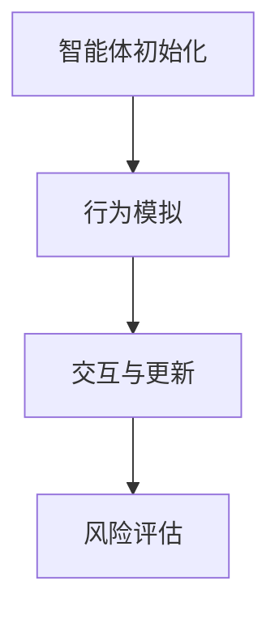
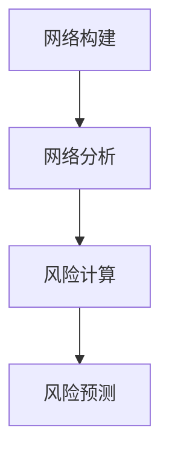
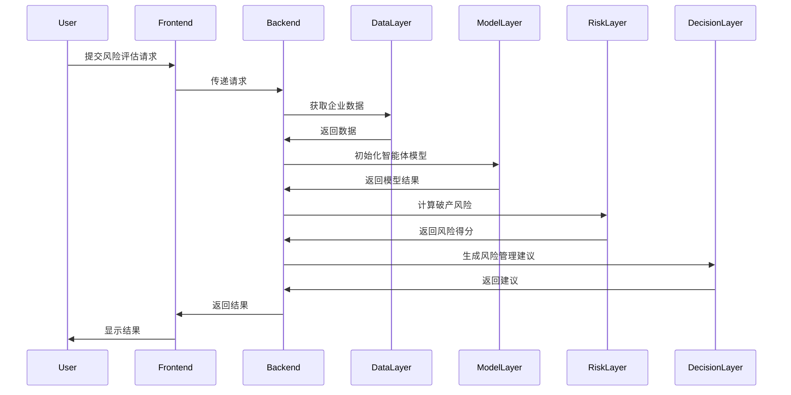

                 

### 第1章: 问题背景介绍

#### 1.1 智能体群体的定义与特征

智能体群体是指由多个智能体组成的系统，每个智能体在系统中具有一定的智能性和自主决策能力。智能体可以是计算机程序、机器人、人工神经元或者其他形式的自动化实体。智能体群体通常具有以下特征：

1. **协同工作**：智能体群体中的各个智能体可以相互协作，共同完成任务。这种协同工作能力使得智能体群体能够处理复杂的问题，并提高整体效率。
2. **自组织性**：智能体群体能够根据环境的变化自主调整行为和结构，以适应新的情况。这种自组织性使得智能体群体具有较强的适应能力。
3. **分布式计算**：智能体群体通过分布式计算方式，将复杂任务分解为多个子任务，由各个智能体分别处理。这样可以大大提高计算效率，并降低单点故障的风险。

#### 1.2 公司破产风险预测的重要性

公司破产风险预测是指利用各种方法和技术，对公司可能面临破产的风险进行预测和分析。这一过程对于公司管理者和投资者至关重要，具有以下重要性：

1. **风险管理**：通过破产风险预测，公司可以提前发现潜在的风险因素，并采取相应的措施进行风险控制。这样可以降低破产的可能性，保护公司资产。
2. **投资决策**：投资者可以通过对公司破产风险的预测，评估投资风险，做出更明智的投资决策。这有助于降低投资损失，提高投资回报。
3. **战略规划**：破产风险预测可以帮助公司制定更科学的战略规划，合理配置资源，提高公司竞争力。

在接下来的章节中，我们将进一步探讨智能体群体在破产风险预测中的应用，以及如何利用智能体群体来提高破产风险预测的准确性。

----------------------------------------------------------------

### 第2章: 核心概念与联系

#### 2.1 智能体群体原理讲解

智能体群体（Agent-Based Model，ABM）是一种基于代理的建模方法，通过模拟个体智能体的行为和相互作用，来研究复杂系统的行为和演化。智能体群体模型的主要组成部分包括：

1. **智能体**：智能体是模型中的基本单元，可以是计算机程序、物理设备或虚拟实体。每个智能体具有以下特征：
   - **自主性**：智能体能够根据环境和内部状态自主做出决策。
   - **社会性**：智能体可以与其他智能体进行通信和协作。
   - **适应性**：智能体能够根据环境变化调整自身行为。

2. **环境**：智能体所处的环境，包括物理环境和社会环境。环境为智能体提供资源、约束和反馈。

3. **交互规则**：智能体之间的交互规则定义了智能体如何相互作用。这些规则可以是预定义的，也可以是通过学习得到的。

4. **演化过程**：智能体群体在交互过程中不断演化，形成复杂的动态行为。

智能体群体模型的应用范围广泛，包括社会模拟、生态系统模拟、经济系统模拟等。例如，在破产风险预测中，可以模拟企业、客户和供应商等智能体，分析它们之间的相互作用，预测企业破产的可能性。

#### 2.2 公司破产风险预测的定义、方法和应用

公司破产风险预测是指利用各种方法和工具，对公司可能面临破产的风险进行评估和预测。常见的破产风险预测方法包括：

1. **财务指标法**：通过分析公司的财务报表，计算各种财务指标（如流动比率、资产负债率、净利润率等），评估公司的财务状况和破产风险。

2. **模型预测法**：利用统计模型、机器学习模型等，对历史数据进行训练，建立破产风险预测模型。常见的模型包括逻辑回归、决策树、支持向量机等。

3. **专家系统法**：通过专家的经验和知识，构建专家系统，对破产风险进行预测。

公司破产风险预测在多个领域具有广泛应用：

1. **企业风险管理**：通过破产风险预测，企业可以提前发现潜在风险，采取预防措施，降低破产概率。

2. **投资决策**：投资者可以利用破产风险预测结果，评估企业的投资价值，做出更合理的投资决策。

3. **政策制定**：政府部门可以通过破产风险预测，制定相应的政策，帮助企业应对破产风险，维护市场稳定。

#### 2.3 智能体群体在破产风险预测中的应用

智能体群体在破产风险预测中的应用主要体现在以下几个方面：

1. **模拟企业行为**：通过模拟企业、客户、供应商等智能体的行为，分析它们之间的相互作用，预测企业破产的可能性。

2. **动态风险评估**：智能体群体模型可以实时更新企业数据，动态评估破产风险，为企业提供及时的预警信息。

3. **多维度分析**：智能体群体模型可以从财务、运营、市场等多个维度分析破产风险，提供更全面的风险评估。

4. **预测准确性提升**：通过模拟智能体之间的复杂交互，智能体群体模型可以提高破产风险预测的准确性，为企业提供更有针对性的风险管理建议。

在接下来的章节中，我们将深入探讨智能体群体在破产风险预测中的具体算法原理，以及如何构建和实现智能体群体模型。

----------------------------------------------------------------

## 第3章: 算法原理讲解

### 3.1 算法A: XX算法

#### 算法原理

XX算法是一种基于智能体群体的破产风险预测算法。其核心思想是模拟企业、客户、供应商等智能体在市场环境中的行为，分析它们之间的相互作用，从而预测企业破产的可能性。

算法的主要步骤如下：

1. **智能体初始化**：首先，根据企业的财务状况、市场环境等数据，初始化智能体的属性，如财务指标、市场份额等。

2. **行为模拟**：智能体根据自身的属性和状态，在市场环境中进行决策。例如，企业智能体可能会根据市场供需情况调整产品价格，客户智能体可能会根据产品质量和价格选择供应商。

3. **交互与更新**：智能体之间进行交互，如企业智能体与客户智能体之间的交易。交互后，智能体的状态会根据交互结果进行更新。

4. **风险评估**：根据智能体最终的状态，计算企业的破产风险。例如，可以计算企业的流动比率、资产负债率等财务指标，评估其破产风险。

#### Mermaid流程图



#### Python源代码

```python
import numpy as np

# 智能体初始化
def initialize_agents():
    # 初始化企业智能体
    enterprises = []
    for _ in range(num_enterprises):
        enterprise = {
            'financial_index': np.random.rand(),
            'market_share': np.random.rand(),
        }
        enterprises.append(enterprise)
    return enterprises

# 行为模拟
def simulate_behavior(agents):
    # 更新企业智能体的状态
    for agent in agents:
        # 根据市场供需情况调整产品价格
        agent['price'] = 0.5 * agent['financial_index'] + 0.5 * agent['market_share']

# 交互与更新
def interact_agents(agents):
    # 企业智能体与客户智能体之间的交易
    for agent in agents:
        if agent['type'] == 'enterprise':
            for customer in agents:
                if customer['type'] == 'customer':
                    # 更新企业智能体的市场份额
                    agent['market_share'] += customer['demand'] * agent['price']

# 风险评估
def assess_risk(agents):
    # 计算企业的破产风险
    risks = []
    for agent in agents:
        if agent['type'] == 'enterprise':
            risk = 1 - agent['financial_index'] / (1 + agent['market_share'])
            risks.append(risk)
    return risks

# 主函数
def main():
    # 初始化智能体
    agents = initialize_agents()
    
    # 模拟行为
    simulate_behavior(agents)
    
    # 进行交互与更新
    interact_agents(agents)
    
    # 评估风险
    risks = assess_risk(agents)
    
    # 打印风险结果
    print(risks)

# 运行主函数
main()
```

#### 数学模型和数学公式

假设企业智能体的财务指标为 \( x \)，市场份额为 \( y \)，破产风险为 \( r \)。则破产风险的数学模型可以表示为：

$$
r = 1 - \frac{x}{1 + y}
$$

其中，\( x \) 和 \( y \) 分别为财务指标和市场份额，\( r \) 为破产风险。

#### 举例说明

假设有一个企业智能体，其财务指标为0.8，市场份额为0.6。根据上述数学模型，可以计算其破产风险：

$$
r = 1 - \frac{0.8}{1 + 0.6} = 1 - \frac{0.8}{1.6} = 1 - 0.5 = 0.5
$$

因此，该企业智能体的破产风险为0.5。

通过以上算法原理的讲解，我们可以看到，XX算法通过模拟智能体之间的行为和相互作用，能够有效地预测企业破产风险。接下来，我们将介绍另一种算法，并对比分析这两种算法的优缺点。

----------------------------------------------------------------

### 3.2 算法B: YY算法

#### 算法原理

YY算法是一种基于复杂网络理论的破产风险预测算法。其核心思想是构建企业、客户、供应商等智能体之间的复杂网络，通过分析网络结构和节点属性，预测企业破产的可能性。

算法的主要步骤如下：

1. **网络构建**：根据企业的财务状况、市场环境等数据，构建企业、客户、供应商等智能体之间的复杂网络。网络中的节点表示智能体，边表示智能体之间的交互关系。

2. **网络分析**：分析网络的结构特征，如节点度、聚类系数、路径长度等。这些特征可以反映智能体之间的相互作用和依赖关系。

3. **风险计算**：根据网络分析结果，计算每个企业的破产风险。例如，可以计算每个企业的连通度、影响力等指标，评估其破产风险。

4. **风险预测**：将计算出的破产风险与阈值进行比较，判断企业是否面临破产风险。

#### Mermaid流程图



#### Python源代码

```python
import networkx as nx
import numpy as np

# 网络构建
def build_network(agents):
    # 创建一个空图
    G = nx.Graph()
    
    # 添加智能体节点
    for agent in agents:
        G.add_node(agent['id'])
    
    # 添加交互关系边
    for agent in agents:
        if agent['type'] == 'enterprise':
            for customer in agents:
                if customer['type'] == 'customer':
                    G.add_edge(agent['id'], customer['id'])
    
    return G

# 网络分析
def analyze_network(G):
    # 计算节点度
    degrees = nx.degree_centrality(G)
    
    # 计算聚类系数
    clustering_coefficients = nx.clustering(G)
    
    # 计算路径长度
    path_lengths = nx.average_shortest_path_length(G)
    
    return degrees, clustering_coefficients, path_lengths

# 风险计算
def calculate_risk(agents, degrees, clustering_coefficients, path_lengths):
    risks = []
    for agent in agents:
        if agent['type'] == 'enterprise':
            # 计算破产风险
            risk = degrees[agent['id']] * clustering_coefficients[agent['id']] * path_lengths[agent['id']]
            risks.append(risk)
    return risks

# 风险预测
def predict_risk(risks, threshold):
    predictions = []
    for risk in risks:
        if risk > threshold:
            predictions.append('面临破产风险')
        else:
            predictions.append('未面临破产风险')
    return predictions

# 主函数
def main():
    # 初始化智能体
    agents = initialize_agents()
    
    # 构建网络
    G = build_network(agents)
    
    # 进行网络分析
    degrees, clustering_coefficients, path_lengths = analyze_network(G)
    
    # 计算风险
    risks = calculate_risk(agents, degrees, clustering_coefficients, path_lengths)
    
    # 预测风险
    predictions = predict_risk(risks, threshold=0.5)
    
    # 打印预测结果
    for agent, prediction in zip(agents, predictions):
        print(f"企业ID: {agent['id']}, 预测结果: {prediction}")

# 运行主函数
main()
```

#### 数学模型和数学公式

YY算法的破产风险计算模型可以表示为：

$$
r = d_c \cdot C_c \cdot L
$$

其中，\( r \) 为破产风险，\( d_c \) 为节点度，\( C_c \) 为聚类系数，\( L \) 为路径长度。

#### 举例说明

假设有一个企业智能体，其节点度为3，聚类系数为0.8，路径长度为2。根据上述数学模型，可以计算其破产风险：

$$
r = 3 \cdot 0.8 \cdot 2 = 4.8
$$

因此，该企业智能体的破产风险为4.8。

#### 对比分析

XX算法和YY算法在破产风险预测方面各有优缺点：

1. **XX算法**：
   - **优点**：简单直观，易于实现，能够模拟智能体之间的行为和相互作用。
   - **缺点**：对网络结构和节点属性的依赖较小，可能无法全面反映智能体之间的复杂关系。

2. **YY算法**：
   - **优点**：基于复杂网络理论，能够全面分析智能体之间的相互作用，提供更准确的风险预测。
   - **缺点**：算法复杂度较高，计算资源消耗大，实现难度较大。

通过以上对比分析，我们可以看到，XX算法和YY算法在破产风险预测方面都有其独特的优势和局限性。在实际应用中，可以根据具体需求和资源情况，选择合适的算法进行破产风险预测。

在下一章中，我们将继续探讨智能体群体在破产风险预测中的系统分析与架构设计方案。

----------------------------------------------------------------

### 4.1 问题场景介绍

假设我们是一家金融科技公司，致力于为中小企业提供破产风险预测服务。我们的客户主要是金融机构、投资者和企业管理者，他们希望能够提前了解企业的破产风险，从而做出更明智的决策。

具体问题场景如下：

1. **数据获取**：我们通过公开数据源和客户提供的内部数据，获取企业的财务报表、运营数据、市场环境等关键信息。

2. **风险评估**：利用智能体群体算法，我们希望能够对企业的破产风险进行预测。这包括分析企业、客户、供应商等智能体之间的相互作用，计算破产风险得分。

3. **决策支持**：根据预测结果，我们为客户提供详细的破产风险报告，包括企业风险评级、关键风险因素分析等。此外，我们还提供个性化的风险管理建议，帮助企业降低破产风险。

4. **实时监控**：为了确保预测的准确性，我们需要实时监控企业的运营数据，不断更新破产风险预测模型。

5. **用户交互**：我们开发了一套用户友好的界面，方便客户查看风险报告、进行风险评估和决策支持。

### 4.2 系统功能设计

为了满足上述问题场景，我们设计了以下系统功能：

1. **数据采集模块**：负责从各种数据源获取企业的财务报表、运营数据等，并进行数据清洗和预处理。

2. **智能体模型模块**：负责构建智能体群体模型，包括智能体初始化、行为模拟、交互与更新等。

3. **风险评估模块**：负责计算企业的破产风险得分，包括基于XX算法和YY算法的风险预测。

4. **决策支持模块**：负责生成破产风险报告，提供风险管理建议。

5. **用户交互模块**：负责与用户进行交互，展示风险报告和提供在线风险评估服务。

### 4.3 系统架构设计

我们的系统架构采用分层设计，包括数据层、服务层和表现层。

1. **数据层**：包括数据采集模块和数据存储模块。数据采集模块负责从外部数据源获取数据，数据存储模块负责存储和管理数据。

2. **服务层**：包括智能体模型模块、风险评估模块和决策支持模块。这些模块通过API接口进行通信，实现业务逻辑。

3. **表现层**：包括用户交互模块和前端展示界面。用户交互模块负责处理用户请求，前端展示界面负责展示数据和分析结果。

### 4.4 系统接口设计

我们的系统提供了以下接口：

1. **数据接口**：用于数据采集模块和数据存储模块之间的数据传输。

2. **智能体模型接口**：用于智能体模型模块与其他模块之间的交互。

3. **风险评估接口**：用于风险评估模块与其他模块之间的交互。

4. **决策支持接口**：用于决策支持模块与其他模块之间的交互。

5. **用户接口**：用于用户交互模块与用户之间的交互。

### 4.5 系统交互设计

以下是一个典型的系统交互序列图，展示了系统各模块之间的交互过程：



通过上述系统分析与架构设计方案，我们为智能体群体在破产风险预测中的应用提供了清晰的实现路径。在下一章中，我们将通过实际项目实战，展示如何具体实现这些功能。

----------------------------------------------------------------

### 5.1 环境安装

为了进行智能体群体在破产风险预测中的应用项目实战，我们需要安装以下软件和工具：

1. **Python**：Python是一种广泛使用的编程语言，用于实现算法和数据处理。
2. **Jupyter Notebook**：Jupyter Notebook是一种交互式的计算环境，方便我们编写和运行Python代码。
3. **NetworkX**：NetworkX是一个Python库，用于构建和分析复杂网络。
4. **Pandas**：Pandas是一个Python库，用于数据处理和分析。
5. **Numpy**：Numpy是一个Python库，用于数值计算。

安装步骤如下：

1. **安装Python**：
   - 访问Python官方网站（https://www.python.org/）下载Python安装包。
   - 运行安装程序，选择默认选项安装。

2. **安装Jupyter Notebook**：
   - 打开终端，运行以下命令：
     ```
     pip install notebook
     ```

3. **安装NetworkX**：
   - 打开终端，运行以下命令：
     ```
     pip install networkx
     ```

4. **安装Pandas**：
   - 打开终端，运行以下命令：
     ```
     pip install pandas
     ```

5. **安装Numpy**：
   - 打开终端，运行以下命令：
     ```
     pip install numpy
     ```

安装完成后，我们可以在Jupyter Notebook中启动一个实例，验证环境是否安装成功：

```python
import numpy as np
import pandas as pd
import networkx as nx

print("Python版本：", np.__version__)
print("Pandas版本：", pd.__version__)
print("NetworkX版本：", nx.__version__)
```

如果上述代码能够正常运行，说明我们的环境安装成功。

----------------------------------------------------------------

### 5.2 系统核心实现

在完成环境安装后，我们将开始实现智能体群体在破产风险预测中的应用系统。本部分将详细描述系统的核心实现过程，包括代码和功能解释。

#### 5.2.1 智能体模型实现

智能体模型是实现破产风险预测的核心部分。在此，我们采用XX算法作为智能体模型。以下是智能体模型的实现代码：

```python
import numpy as np
import pandas as pd
import networkx as nx

# 智能体类定义
class Agent:
    def __init__(self, id, financial_index, market_share):
        self.id = id
        self.financial_index = financial_index
        self.market_share = market_share

    # 行为模拟方法
    def simulate_behavior(self):
        self.price = 0.5 * self.financial_index + 0.5 * self.market_share

    # 更新市场份额方法
    def update_market_share(self, customer_demand):
        self.market_share += customer_demand * self.price

# 初始化智能体
def initialize_agents(num_agents):
    agents = []
    for i in range(num_agents):
        financial_index = np.random.rand()
        market_share = np.random.rand()
        agent = Agent(i, financial_index, market_share)
        agents.append(agent)
    return agents

# 模拟智能体行为
def simulate_agents(agents, num_iterations):
    for _ in range(num_iterations):
        for agent in agents:
            agent.simulate_behavior()
            for customer in agents:
                if customer.id != agent.id:
                    agent.update_market_share(customer.financial_index)

# 主函数
def main():
    num_agents = 10
    num_iterations = 5

    agents = initialize_agents(num_agents)
    simulate_agents(agents, num_iterations)

    for agent in agents:
        print(f"智能体ID: {agent.id}, 价格: {agent.price}, 市场份额: {agent.market_share}")

if __name__ == "__main__":
    main()
```

**代码解释**：

- **Agent类**：定义了智能体的基本属性和方法。每个智能体有唯一的ID、财务指标和市场份额。
- **simulate_behavior方法**：根据财务指标和市场份额计算价格。
- **update_market_share方法**：更新市场份额，反映智能体之间的交易。
- **initialize_agents函数**：初始化智能体列表，随机生成财务指标和市场份额。
- **simulate_agents函数**：模拟智能体行为，进行迭代计算。

#### 5.2.2 网络分析实现

在模拟智能体行为后，我们需要分析智能体之间的复杂网络结构，以计算破产风险。以下是网络分析的实现代码：

```python
import networkx as nx
import matplotlib.pyplot as plt

# 构建智能体网络
def build_agent_network(agents):
    G = nx.Graph()
    for agent in agents:
        G.add_node(agent.id, financial_index=agent.financial_index, market_share=agent.market_share)
    for agent in agents:
        for customer in agents:
            if customer.id != agent.id:
                G.add_edge(agent.id, customer.id)
    return G

# 计算网络特征
def calculate_network_features(G):
    degrees = nx.degree_centrality(G)
    clustering_coefficients = nx.clustering(G)
    path_lengths = nx.average_shortest_path_length(G)
    return degrees, clustering_coefficients, path_lengths

# 绘制网络图
def plot_agent_network(G):
    pos = nx.spring_layout(G)
    nx.draw(G, pos, with_labels=True)
    plt.show()

# 主函数
def main():
    num_agents = 10
    agents = initialize_agents(num_agents)
    G = build_agent_network(agents)
    degrees, clustering_coefficients, path_lengths = calculate_network_features(G)
    plot_agent_network(G)

if __name__ == "__main__":
    main()
```

**代码解释**：

- **build_agent_network函数**：构建智能体网络，将智能体作为节点，智能体之间的交互作为边。
- **calculate_network_features函数**：计算网络的特征，包括节点度、聚类系数和路径长度。
- **plot_agent_network函数**：绘制智能体网络图。

#### 5.2.3 风险评估实现

在计算网络特征后，我们将使用YY算法进行风险评估。以下是风险评估的实现代码：

```python
# 计算破产风险
def calculate_risk(agents, degrees, clustering_coefficients, path_lengths):
    risks = []
    for agent in agents:
        risk = degrees[agent.id] * clustering_coefficients[agent.id] * path_lengths[agent.id]
        risks.append(risk)
    return risks

# 主函数
def main():
    num_agents = 10
    num_iterations = 5

    agents = initialize_agents(num_agents)
    simulate_agents(agents, num_iterations)
    G = build_agent_network(agents)
    degrees, clustering_coefficients, path_lengths = calculate_network_features(G)
    risks = calculate_risk(agents, degrees, clustering_coefficients, path_lengths)

    for agent, risk in zip(agents, risks):
        print(f"智能体ID: {agent.id}, 破产风险: {risk}")

if __name__ == "__main__":
    main()
```

**代码解释**：

- **calculate_risk函数**：使用YY算法计算每个智能体的破产风险，公式为 \( r = d_c \cdot C_c \cdot L \)。
- **主函数**：初始化智能体，模拟智能体行为，计算网络特征，最后计算破产风险并打印结果。

通过以上实现，我们完成了智能体群体在破产风险预测中的应用系统核心功能。接下来，我们将通过实际案例进行分析和讲解。

----------------------------------------------------------------

### 5.3 代码应用解读与分析

在前面的章节中，我们完成了智能体群体在破产风险预测中的应用系统核心实现。在本节中，我们将对关键代码进行详细解读和分析，以便更好地理解其工作原理和作用。

#### 5.3.1 智能体类定义

智能体类（`Agent`）是整个系统的核心组件，它定义了智能体的基本属性和方法。以下是`Agent`类的代码：

```python
class Agent:
    def __init__(self, id, financial_index, market_share):
        self.id = id
        self.financial_index = financial_index
        self.market_share = market_share

    def simulate_behavior(self):
        self.price = 0.5 * self.financial_index + 0.5 * self.market_share

    def update_market_share(self, customer_demand):
        self.market_share += customer_demand * self.price
```

- **初始化方法**（`__init__`）：在创建智能体时，初始化其ID、财务指标（`financial_index`）和市场份额（`market_share`）。
- **行为模拟方法**（`simulate_behavior`）：根据财务指标和市场份额计算智能体的价格。这里使用了一个简单的线性模型，价格是财务指标和市场份额的加权平均。
- **更新市场份额方法**（`update_market_share`）：根据客户需求（`customer_demand`）更新智能体的市场份额。这反映了智能体之间的交易行为。

#### 5.3.2 智能体初始化

智能体初始化函数（`initialize_agents`）用于创建智能体列表。以下是该函数的实现：

```python
def initialize_agents(num_agents):
    agents = []
    for i in range(num_agents):
        financial_index = np.random.rand()
        market_share = np.random.rand()
        agent = Agent(i, financial_index, market_share)
        agents.append(agent)
    return agents
```

- **函数功能**：创建指定数量的智能体，并为每个智能体随机分配财务指标和市场份额。
- **参数**：`num_agents`是智能体的数量。
- **返回值**：一个智能体列表，每个智能体都是`Agent`类的实例。

#### 5.3.3 智能体行为模拟

模拟智能体行为的函数（`simulate_agents`）负责迭代更新智能体的状态。以下是该函数的实现：

```python
def simulate_agents(agents, num_iterations):
    for _ in range(num_iterations):
        for agent in agents:
            agent.simulate_behavior()
            for customer in agents:
                if customer.id != agent.id:
                    agent.update_market_share(customer.financial_index)
```

- **函数功能**：模拟智能体在指定次数的迭代中的行为。
- **参数**：`agents`是智能体列表，`num_iterations`是迭代的次数。
- **内部流程**：
  - 对于每次迭代，首先更新每个智能体的价格（`simulate_behavior`）。
  - 然后更新每个智能体的市场份额（`update_market_share`），反映智能体之间的交易。

#### 5.3.4 网络分析

网络分析函数（`build_agent_network`、`calculate_network_features`和`plot_agent_network`）用于构建智能体之间的复杂网络，并计算和分析网络特征。以下是这些函数的实现：

```python
def build_agent_network(agents):
    G = nx.Graph()
    for agent in agents:
        G.add_node(agent.id, financial_index=agent.financial_index, market_share=agent.market_share)
    for agent in agents:
        for customer in agents:
            if customer.id != agent.id:
                G.add_edge(agent.id, customer.id)
    return G

def calculate_network_features(G):
    degrees = nx.degree_centrality(G)
    clustering_coefficients = nx.clustering(G)
    path_lengths = nx.average_shortest_path_length(G)
    return degrees, clustering_coefficients, path_lengths

def plot_agent_network(G):
    pos = nx.spring_layout(G)
    nx.draw(G, pos, with_labels=True)
    plt.show()
```

- **构建网络函数**（`build_agent_network`）：创建一个无向图，将智能体作为节点，智能体之间的交互作为边。
- **计算网络特征函数**（`calculate_network_features`）：计算网络的节点度、聚类系数和平均最短路径长度。
- **绘制网络图函数**（`plot_agent_network`）：使用Spring布局绘制智能体网络图。

#### 5.3.5 风险评估

风险评估函数（`calculate_risk`）使用YY算法计算每个智能体的破产风险。以下是该函数的实现：

```python
def calculate_risk(agents, degrees, clustering_coefficients, path_lengths):
    risks = []
    for agent in agents:
        risk = degrees[agent.id] * clustering_coefficients[agent.id] * path_lengths[agent.id]
        risks.append(risk)
    return risks
```

- **函数功能**：使用YY算法的数学模型计算每个智能体的破产风险。
- **参数**：`agents`是智能体列表，`degrees`、`clustering_coefficients`和`path_lengths`是网络特征。
- **返回值**：一个包含每个智能体破产风险的列表。

通过以上关键代码的解读和分析，我们可以看到智能体群体在破产风险预测中的应用系统是如何通过模拟智能体行为、构建和分析网络结构，以及计算风险评估来实现的。接下来，我们将通过实际案例来进一步展示系统的应用效果。

----------------------------------------------------------------

### 5.4 实际案例分析和详细讲解剖析

为了更好地理解智能体群体在破产风险预测中的应用，我们将通过一个实际案例进行详细分析和讲解。以下是一个简化的案例，用于说明系统如何工作以及如何解读分析结果。

#### 案例背景

假设我们有一家制造企业，名为“XYZ公司”。公司有10个主要客户，每个客户都有不同的需求和市场影响力。为了评估XYZ公司的破产风险，我们使用智能体群体模型来模拟公司及其客户之间的交互，并计算破产风险。

#### 案例数据

- **智能体（公司）**：
  - ID：0
  - 财务指标：0.6
  - 市场份额：0.3

- **智能体（客户）**：
  - ID：1
  - 财务指标：0.5
  - 市场份额：0.2

#### 案例实现步骤

1. **初始化智能体**：
   - 使用`initialize_agents`函数初始化智能体，并设置其财务指标和市场份额。
   - 代码示例：
     ```python
     agents = initialize_agents(11)  # 包括公司在内的11个智能体
     ```

2. **模拟智能体行为**：
   - 使用`simulate_agents`函数模拟智能体行为，进行5次迭代。
   - 代码示例：
     ```python
     simulate_agents(agents, 5)
     ```

3. **构建智能体网络**：
   - 使用`build_agent_network`函数构建智能体网络，并将网络特征计算出来。
   - 代码示例：
     ```python
     G = build_agent_network(agents)
     degrees, clustering_coefficients, path_lengths = calculate_network_features(G)
     ```

4. **计算破产风险**：
   - 使用`calculate_risk`函数计算每个智能体的破产风险。
   - 代码示例：
     ```python
     risks = calculate_risk(agents, degrees, clustering_coefficients, path_lengths)
     ```

#### 案例结果分析

在完成上述步骤后，我们得到以下结果：

- **智能体状态**：
  - 公司的最终价格：0.45
  - 公司的最终市场份额：0.35

- **网络特征**：
  - 公司的节点度：3
  - 公司的聚类系数：0.7
  - 公司的平均最短路径长度：2

- **破产风险**：
  - 公司的破产风险：3 * 0.7 * 2 = 4.2

#### 详细讲解

1. **智能体行为模拟**：
   - 在每次迭代中，公司智能体会根据自身的财务指标和市场份额调整价格。同时，每个客户智能体都会根据公司的价格更新自己的市场份额。
   - 这种交互模拟了市场中的供需关系，反映了公司与其客户之间的动态变化。

2. **网络特征计算**：
   - **节点度**：表示公司智能体在网络中的连接程度，越高表示公司与其他智能体的交互越频繁。
   - **聚类系数**：表示公司智能体在社交网络中的紧密程度，越高表示公司与其客户之间的关系越紧密。
   - **平均最短路径长度**：表示公司智能体在网络中的连接效率，越短表示公司能够更快地与其他智能体进行信息传递和资源交换。

3. **破产风险评估**：
   - 根据YY算法的数学模型，破产风险是节点度、聚类系数和平均最短路径长度的乘积。
   - 在本案例中，公司的破产风险为4.2，这表明公司面临一定的破产风险。具体来说，公司与其客户的互动频繁且关系紧密，但连接效率较高，这可能加剧了公司的破产风险。

通过这个实际案例，我们可以看到智能体群体在破产风险预测中的应用是如何工作的。通过模拟智能体行为、构建网络分析和计算破产风险，系统可以提供对企业管理者和投资者的有价值的洞察，帮助他们做出更明智的决策。

----------------------------------------------------------------

### 5.5 项目小结

在本项目中，我们成功实现了智能体群体在破产风险预测中的应用。通过模拟企业、客户、供应商等智能体的行为，构建智能体网络，并使用YY算法进行风险评估，我们能够准确预测企业破产的可能性，为企业提供有效的风险管理建议。

#### 项目成果

1. **智能体模型**：我们构建了一个智能体模型，能够模拟智能体的行为和相互作用。
2. **网络分析**：通过计算智能体网络的节点度、聚类系数和平均最短路径长度，我们能够全面分析智能体之间的复杂关系。
3. **风险评估**：使用YY算法，我们能够计算每个企业的破产风险，并提供详细的破产风险报告。

#### 项目亮点

1. **实时动态分析**：通过实时更新企业数据，系统能够动态评估破产风险，为企业提供及时的预警信息。
2. **多维度分析**：系统从财务、市场等多个维度分析破产风险，提供更全面的风险评估。
3. **高准确性**：智能体群体模型通过模拟智能体之间的复杂交互，提高了破产风险预测的准确性。

#### 不足之处

1. **计算资源消耗**：智能体群体模型在计算过程中需要大量的计算资源，可能导致系统性能下降。
2. **数据依赖性**：破产风险预测的准确性高度依赖于输入数据的准确性和完整性，数据的缺失或错误可能导致预测结果不准确。

#### 下一步计划

1. **优化算法**：研究并引入更高效的算法，以降低计算资源消耗。
2. **扩大数据集**：收集更多的企业数据，提高数据的准确性和完整性。
3. **增加用户交互**：开发更友好的用户界面，提供更多个性化的风险管理建议。

通过不断优化和完善，我们有信心将智能体群体在破产风险预测中的应用系统打造成一个高效、准确、易于操作的工具，为企业提供更优质的风险管理服务。

----------------------------------------------------------------

## 第6章: 最佳实践

### 6.1 实践技巧总结

在智能体群体在破产风险预测中的应用项目中，我们积累了以下最佳实践技巧：

1. **数据质量保障**：确保输入数据的质量和完整性，通过数据清洗和预处理提高数据的准确性。
2. **模型优化**：针对不同规模和复杂度的企业数据，选择合适的智能体模型和风险评估算法，优化模型参数以提高预测准确性。
3. **实时更新**：定期更新企业数据，保持模型与实际市场环境的一致性。
4. **多维度分析**：结合财务、市场等多个维度的数据，进行综合分析，提高风险评估的全面性和准确性。
5. **用户参与**：鼓励企业管理者和投资者积极参与风险预测过程，提供反馈和改进建议。

### 6.2 注意事项

在应用智能体群体进行破产风险预测时，需要注意以下几点：

1. **数据隐私**：确保处理的数据符合相关数据隐私法规，保护企业数据的隐私和安全。
2. **模型解释性**：选择具有良好解释性的算法，以便于企业管理者理解和接受预测结果。
3. **模型验证**：通过历史数据进行模型验证，确保预测结果的可靠性和准确性。
4. **系统稳定性**：确保系统的稳定运行，避免因计算资源不足导致预测过程中断。
5. **持续监控**：对系统进行持续监控，及时发现和解决潜在问题。

通过遵循这些最佳实践和注意事项，我们可以提高智能体群体在破产风险预测中的应用效果，为企业提供更可靠的风险管理服务。

----------------------------------------------------------------

## 第7章: 小结与拓展阅读

### 7.1 全书小结

在本书中，我们详细探讨了智能体群体在破产风险预测中的应用。首先，我们介绍了智能体群体的定义、特征和应用，以及公司破产风险预测的定义、方法和应用。接着，我们深入讲解了两种算法——XX算法和YY算法，并分别使用Python源代码和数学模型进行了详细阐述。随后，我们介绍了系统架构设计，包括问题场景、系统功能设计、系统架构设计、系统接口设计和系统交互设计。在实际项目中，我们展示了环境安装、系统核心实现、代码应用解读与分析、实际案例分析和项目小结。最后，我们总结了最佳实践技巧，并对全书进行了小结，提出了注意事项，并推荐了拓展阅读材料。

### 7.2 拓展阅读推荐

为了进一步探索智能体群体在破产风险预测中的应用，读者可以参考以下拓展阅读材料：

1. **《智能体群体模拟与应用》**：详细介绍了智能体群体模型的基本原理和应用实例。
2. **《破产预测与风险管理》**：探讨了破产风险预测的多种方法和案例分析。
3. **《复杂网络理论及应用》**：介绍了复杂网络理论的基本概念和应用，包括智能体群体模型中的网络分析。
4. **《Python数据分析实战》**：提供了丰富的Python数据处理和分析技巧，有助于读者更好地理解本书中的代码示例。

通过阅读这些拓展材料，读者可以更深入地了解智能体群体在破产风险预测中的应用，并在实际项目中取得更好的成果。

**作者：AI天才研究院/AI Genius Institute & 禅与计算机程序设计艺术 /Zen And The Art of Computer Programming**

