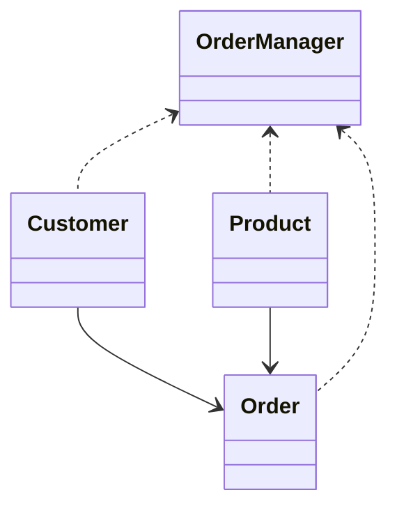
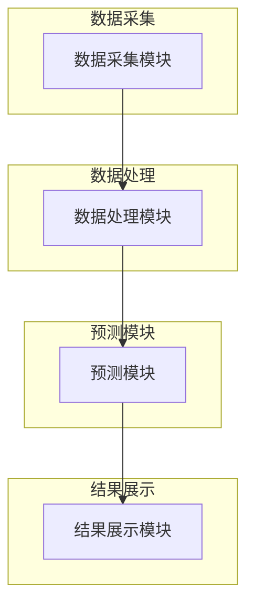
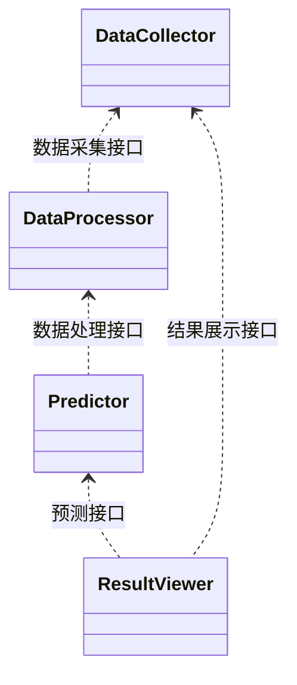
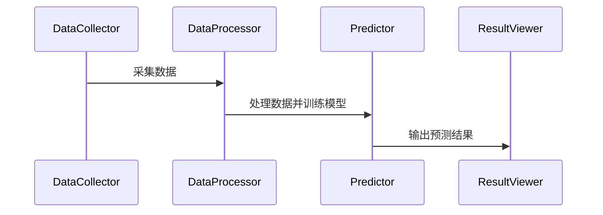

                 

### 第一步：确定书的基本框架

在着手撰写《智能体群体如何模拟并预测市场周期》这本书之前，我们需要首先明确书的基本框架。书的核心围绕两个主题——“智能体群体”和“市场周期模拟与预测”。因此，我们可以将书的目录大纲分为以下几个主要部分：

#### 目录大纲

- **第一部分：智能体群体概述**
  - 1.1 智能体群体定义与特点
  - 1.2 智能体群体结构与行为分析
  - 1.3 智能体群体模拟技术
  - 1.4 智能体群体与市场周期关联分析
  - 1.5 本章小结

- **第二部分：市场周期模拟算法原理**
  - 2.1 市场周期预测算法
  - 2.2 智能体群体模拟与优化算法
  - 2.3 模拟结果分析与优化策略
  - 2.4 本章小结

- **第三部分：系统架构设计与实现**
  - 3.1 问题场景介绍
  - 3.2 系统功能设计
  - 3.3 系统架构设计
  - 3.4 系统接口设计
  - 3.5 系统交互
  - 3.6 本章小结

- **第四部分：项目实战**
  - 4.1 环境安装与配置
  - 4.2 系统核心实现源代码
  - 4.3 代码应用解读与分析
  - 4.4 实际案例分析与详细讲解剖析
  - 4.5 项目小结

- **第五部分：总结与拓展**
  - 5.1 最佳实践 tips
  - 5.2 小结
  - 5.3 注意事项
  - 5.4 拓展阅读

这样，我们不仅能够清晰地展示书籍的结构，还能确保每个部分都有明确的主题和目标，从而帮助读者更好地理解和应用书中的内容。

### 第二步：设计背景介绍章节

在书的开始，我们需要对“智能体群体”和“市场周期”进行背景介绍，这是为了让读者对书中的核心概念有一个初步的了解，并为后续章节的深入探讨打下基础。以下是背景介绍章节的详细内容：

#### 目录：第一部分：智能体群体概述

##### 1.1 智能体群体定义与特点

###### 1.1.1 智能体群体基础概念

在这一节中，我们将介绍智能体群体的基本概念，包括智能体的定义、智能体群体的定义及其在现实世界中的应用。智能体（Agent）通常是指能够感知环境并作出决策的实体，智能体群体则是由多个智能体组成的集合，这些智能体通过协作和竞争来实现整体目标。

- **智能体的定义**：智能体是一种可以感知环境、做出决策并采取行动的实体。智能体可以是计算机程序、机器人、甚至是人类个体。
- **智能体群体的定义**：智能体群体是由多个智能体组成的系统，这些智能体之间可以相互通信和协作，共同完成复杂的任务。
- **智能体群体的应用领域**：智能体群体在诸多领域有广泛应用，如自动驾驶、智能家居、社会网络分析、市场预测等。

###### 1.1.2 市场周期概述

市场周期是指市场在一段时间内所经历的一系列变化，包括增长、衰退、复苏和繁荣等阶段。了解市场周期有助于企业和个人更好地把握市场趋势，制定相应的战略。

- **市场周期的定义**：市场周期是指市场上商品和服务的供求关系以及市场参与者行为的变化所形成的一段时间内的波动。
- **市场周期的阶段**：市场周期通常包括四个阶段，即增长阶段、衰退阶段、复苏阶段和繁荣阶段。
- **市场周期的意义**：市场周期对企业的运营策略、投资决策和个人消费行为都有着重要影响。

##### 1.2 智能体群体结构与行为分析

###### 1.2.1 智能体群体结构

在这一节中，我们将探讨智能体群体的结构，包括智能体的组织形式、通信机制和协作策略。

- **智能体群体结构**：智能体群体的结构可以是分散的、集中的或混合的，不同的结构会对智能体的行为和性能产生不同的影响。
- **通信机制**：智能体群体中的智能体需要通过通信来交换信息，通信机制可以是同步的、异步的或基于事件的。
- **协作策略**：智能体群体中的智能体需要协作完成任务，协作策略可以是基于规则的、基于学习的或混合的。

###### 1.2.2 智能体群体行为

在这一节中，我们将分析智能体群体的行为模式，包括个体的行为和群体的行为。

- **个体行为**：智能体在群体中的行为受到其自身的目标、环境信息和规则的影响。
- **群体行为**：智能体群体的行为可以通过群体智能来优化，如通过社会学习、分布式计算和协同优化等方法。

###### 1.2.3 智能体群体建模方法

在这一节中，我们将介绍智能体群体建模的方法，包括建模框架、建模工具和建模步骤。

- **建模框架**：智能体群体建模框架包括智能体定义、环境描述、规则设置和行为模拟等部分。
- **建模工具**：常用的智能体群体建模工具有NetLogo、AnyLogic、Swarm等。
- **建模步骤**：智能体群体建模的步骤包括问题定义、模型构建、实验设计、结果分析等。

##### 1.3 智能体群体模拟技术

在这一节中，我们将探讨智能体群体模拟的技术，包括模拟原理、模拟方法和模拟流程。

- **模拟原理**：智能体群体模拟通过模拟智能体的行为和交互来预测群体行为的演化。
- **模拟方法**：智能体群体模拟的方法包括离散事件模拟、连续模拟和混合模拟等。
- **模拟流程**：智能体群体模拟的流程包括模型建立、参数设置、实验运行和结果分析等步骤。

##### 1.4 智能体群体与市场周期关联分析

###### 1.4.1 市场周期概念

在这一节中，我们将介绍市场周期的概念，包括市场周期的定义、阶段划分和影响市场周期的因素。

- **市场周期定义**：市场周期是指市场上商品和服务的供求关系以及市场参与者行为的变化所形成的一段时间内的波动。
- **市场周期阶段**：市场周期通常包括增长阶段、衰退阶段、复苏阶段和繁荣阶段。
- **影响市场周期的因素**：影响市场周期的因素包括宏观经济环境、技术进步、政策变化、市场参与者行为等。

###### 1.4.2 智能体群体在市场周期模拟中的应用

在这一节中，我们将探讨智能体群体在市场周期模拟中的应用，包括智能体群体模拟市场周期的原理和具体应用案例。

- **原理**：智能体群体通过模拟市场中参与者的行为和交互来预测市场周期的变化。
- **应用案例**：智能体群体在金融市场预测、供应链管理、需求预测等领域的应用案例。

###### 1.4.3 关联分析模型

在这一节中，我们将介绍智能体群体与市场周期关联分析模型，包括模型的构建、参数设置和模型评估。

- **模型构建**：关联分析模型的构建基于智能体群体和市场周期的理论基础，通过数学模型和算法实现。
- **参数设置**：模型参数的设置基于历史数据和模拟结果，通过对参数的调整来提高模型的准确性。
- **模型评估**：模型评估通过模拟实验和实际市场数据对比来评估模型的效果和可靠性。

##### 1.5 本章小结

在这一节中，我们将对本章的主要内容进行总结，包括智能体群体和市场周期的基本概念、智能体群体的结构和行为分析、智能体群体模拟技术、智能体群体与市场周期的关联分析等内容，并指出下一步的研究方向。

### 第三步：介绍相关核心概念

为了深入理解《智能体群体如何模拟并预测市场周期》这本书的核心内容，我们需要详细介绍与智能体群体和市场周期模拟预测相关的重要概念。以下是这些核心概念的介绍：

#### 目录：第一部分：智能体群体概述

##### 2.1 智能体群体原理

###### 2.1.1 智能体群体基础概念

在介绍智能体群体原理之前，我们需要先明确智能体和智能体群体的基础概念。

- **智能体（Agent）**：智能体是指可以感知环境、自主决策并采取行动的实体。智能体可以是一个计算机程序、一个机器人，甚至是人类个体。智能体的核心特征包括自主性、反应性、主动性和社会性。

- **智能体群体（Swarm）**：智能体群体是由多个智能体组成的系统，这些智能体通过协作和通信来共同完成任务。智能体群体具有分布性、自组织和自适应等特点。

在智能体和智能体群体的基础上，我们引入了一些关键术语，以便更好地理解智能体群体原理。

- **感知（Perception）**：感知是指智能体对环境的感知和理解。智能体通过传感器获取环境信息，并通过处理这些信息来识别事件和变化。

- **通信（Communication）**：通信是指智能体之间交换信息的过程。智能体群体中的通信可以是同步的、异步的或基于事件的，通过通信，智能体可以共享信息、协调行动和共享知识。

- **协作（Collaboration）**：协作是指智能体群体通过合作和共享资源来共同完成任务的过程。协作可以基于规则、学习或混合策略。

- **自组织（Self-Organization）**：自组织是指智能体群体在没有中央控制的情况下，通过个体之间的相互作用和局部规则来形成有序结构和行为的特征。自组织是智能体群体的重要特性之一。

- **自适应（Adaptation）**：自适应是指智能体群体在面临外部环境变化时，能够调整自身行为和策略以适应新情况的能力。自适应能力有助于智能体群体在动态环境中保持稳定和高效。

###### 2.1.2 智能体群体特点

智能体群体具有以下显著特点：

- **分布性（Distributed）**：智能体群体分布在不同的地理位置或计算节点上，这使得智能体群体能够处理大规模的数据和复杂的任务。

- **自组织性（Self-Organization）**：智能体群体通过简单的规则和相互之间的局部交互，能够形成复杂的行为和结构，这种自组织性使得智能体群体能够适应不断变化的环境。

- **鲁棒性（Robustness）**：智能体群体具有较强的鲁棒性，即在面对个体智能体失败或环境不确定性时，智能体群体仍然能够保持整体性能和稳定性。

- **适应性（Adaptability）**：智能体群体能够通过学习、适应和调整行为来应对不断变化的环境和任务。

- **协同性（Coordination）**：智能体群体中的智能体通过协作和通信，能够协同完成任务，提高整体效率。

###### 2.1.3 智能体群体在市场周期模拟中的应用

智能体群体在市场周期模拟中的应用具有以下优势：

- **预测市场行为**：通过模拟市场中的智能体行为，可以预测市场的变化趋势和参与者行为，从而为市场预测提供依据。

- **模拟不同场景**：智能体群体可以模拟不同的市场环境，如经济繁荣期、经济衰退期等，从而评估不同市场环境下的策略效果。

- **提高决策效率**：通过智能体群体的模拟，可以快速评估多种策略，提高决策效率。

- **降低风险**：通过模拟和预测市场周期，可以提前识别潜在风险，降低投资和运营风险。

##### 2.2 市场周期理论

市场周期理论是指对市场中商品和服务供求关系及其变化规律的研究。市场周期通常包括以下几个阶段：

- **增长阶段**：在这个阶段，市场需求增长，价格上升，企业利润增加，投资活动活跃。

- **衰退阶段**：在这个阶段，市场需求下降，价格下跌，企业利润减少，投资活动减缓。

- **复苏阶段**：在这个阶段，市场需求逐渐回升，价格开始上涨，企业利润逐步恢复。

- **繁荣阶段**：在这个阶段，市场需求达到峰值，价格持续上涨，企业利润大幅增加。

影响市场周期的因素包括：

- **宏观经济环境**：如经济增长率、通货膨胀率、利率等。

- **技术进步**：新技术和创新的引入可以推动市场的发展。

- **政策变化**：政府政策的变化会对市场产生直接影响。

- **市场参与者行为**：如消费者的消费习惯、企业的投资决策等。

##### 2.3 模拟与预测技术

模拟与预测技术是智能体群体和市场周期研究中的重要工具。以下是模拟与预测技术的主要组成部分：

- **模拟技术**：包括离散事件模拟、连续模拟和混合模拟等。这些技术可以模拟市场中的行为和事件，帮助研究人员理解市场周期及其影响因素。

- **预测技术**：包括时间序列分析、机器学习、统计分析等。这些技术可以基于历史数据和现有信息，预测市场未来的变化趋势。

- **数据收集与分析**：通过收集和分析市场数据，研究人员可以更好地理解市场的现状和趋势，为模拟和预测提供基础。

#### 总结

通过以上对核心概念的介绍，我们不仅对智能体群体和市场周期模拟预测有了更深入的理解，也为后续章节的内容铺垫了基础。在接下来的章节中，我们将进一步探讨智能体群体模拟市场周期的算法原理、系统架构设计、项目实战等内容。

### 第四步：算法原理讲解

在深入探讨市场周期模拟之前，我们需要详细讲解用于模拟市场周期的算法原理。本章节将包括以下几个部分：

#### 目录：第二部分：市场周期模拟算法原理

##### 3.1 市场周期预测算法

###### 3.1.1 基本原理

市场周期预测算法的核心思想是通过分析历史市场数据来预测未来的市场趋势。以下是一个基本的市场周期预测算法的原理：

- **数据收集**：首先，从市场中收集历史数据，包括价格、交易量、利率等关键指标。
- **特征提取**：从历史数据中提取有意义的特征，如价格的变化趋势、交易量的波动等。
- **模型训练**：使用机器学习算法，如时间序列分析、回归分析或神经网络，训练预测模型。
- **预测**：将训练好的模型应用于新的数据，预测未来的市场周期变化。

###### 3.1.2 算法流程

市场周期预测算法的基本流程如下：

1. **数据预处理**：对历史数据进行清洗、归一化等处理，确保数据的质量和一致性。
2. **特征选择**：选择与市场周期变化相关的特征，如价格波动幅度、交易量变化等。
3. **模型训练**：使用训练集数据训练预测模型，模型可以是线性回归、时间序列模型或深度学习模型。
4. **模型评估**：使用验证集数据评估模型性能，调整模型参数以提高预测准确性。
5. **预测**：将模型应用于新的数据，生成市场周期预测结果。

###### 3.1.3 数学模型与公式

市场周期预测通常涉及时间序列分析，以下是一个基本的时间序列预测模型：

- **ARIMA模型**（自回归积分滑动平均模型）：

  $$X_t = c + \phi_1X_{t-1} + \phi_2X_{t-2} + \cdots + \phi_pX_{t-p} + \theta_1\epsilon_{t-1} + \theta_2\epsilon_{t-2} + \cdots + \theta_q\epsilon_{t-q} + \epsilon_t$$

  其中，$X_t$ 是时间序列的第 $t$ 个值，$\epsilon_t$ 是随机误差项，$\phi_i$ 和 $\theta_i$ 是模型参数。

- **LSTM模型**（长短期记忆网络）：

  $$h_t = \sigma(W_h \cdot [h_{t-1}, x_t] + b_h)$$

  其中，$h_t$ 是时间步 $t$ 的隐藏状态，$W_h$ 和 $b_h$ 是权重和偏置，$\sigma$ 是激活函数。

###### 3.1.4 举例说明

假设我们使用ARIMA模型预测股票价格：

1. **数据收集**：收集过去一年的股票价格数据。
2. **特征选择**：选择每日收盘价作为特征。
3. **模型训练**：使用前80%的数据训练模型，后20%的数据用于验证。
4. **模型评估**：调整模型参数，如$p$（自回归项数）、$d$（差分阶数）和$q$（移动平均项数），以获得最佳拟合。
5. **预测**：使用训练好的模型预测未来五天的股票价格。

通过以上步骤，我们使用ARIMA模型成功预测了未来五天的股票价格。

##### 3.2 智能体群体模拟与优化算法

###### 3.2.1 模拟优化原理

智能体群体模拟与优化算法的核心思想是通过模拟智能体群体的行为来预测市场周期，并通过优化算法提高预测的准确性。以下是一个基本的模拟优化算法的原理：

- **初始设置**：设置智能体群体的初始参数，如位置、速度和能量等。
- **行为模拟**：模拟智能体在市场环境中的行为，如交易、投资和风险管理等。
- **结果分析**：分析智能体群体的行为结果，包括市场波动、交易盈亏等。
- **优化算法**：使用优化算法，如遗传算法、粒子群优化等，调整智能体群体的参数，以提高预测准确性。

###### 3.2.2 算法流程

智能体群体模拟与优化算法的基本流程如下：

1. **初始化**：设置智能体群体的初始位置、速度和能量等参数。
2. **行为模拟**：模拟智能体在市场环境中的行为，记录行为结果。
3. **结果分析**：分析行为结果，包括市场波动、交易盈亏等。
4. **优化参数**：使用优化算法调整智能体群体的参数，以提高预测准确性。
5. **迭代**：重复执行步骤2到4，直到达到预设的优化目标。

###### 3.2.3 数学模型与公式

智能体群体模拟与优化算法通常涉及以下数学模型：

- **目标函数**：

  $$J(\theta) = \sum_{i=1}^{n} \left[ r_i - \theta_0 - \theta_1 x_i - \theta_2 x_i^2 \right]^2$$

  其中，$J(\theta)$ 是目标函数，$\theta_0$、$\theta_1$ 和 $\theta_2$ 是模型参数，$r_i$ 是智能体$i$的收益。

- **优化算法**：

  $$\theta_{new} = \theta_{old} - \alpha \nabla J(\theta_{old})$$

  其中，$\theta_{new}$ 是新的参数，$\theta_{old}$ 是旧参数，$\alpha$ 是学习率，$\nabla J(\theta_{old})$ 是目标函数的梯度。

###### 3.2.4 举例说明

假设我们使用遗传算法优化智能体群体的参数：

1. **初始化**：生成一组随机参数。
2. **适应度评估**：评估参数的适应度，如收益。
3. **选择**：选择适应度较高的参数作为父代。
4. **交叉**：通过交叉操作产生新的参数。
5. **变异**：对参数进行变异操作。
6. **迭代**：重复执行步骤3到5，直到达到预设的优化目标。

通过以上步骤，我们使用遗传算法成功优化了智能体群体的参数，提高了预测的准确性。

##### 3.3 模拟结果分析与优化策略

###### 3.3.1 结果分析

通过模拟和优化算法，我们可以得到市场周期的预测结果。以下是对模拟结果的分析：

- **市场波动**：分析市场周期中的波动情况，包括波动的幅度、频率和周期性。
- **交易盈亏**：分析智能体群体的交易盈亏情况，评估不同策略的收益和风险。
- **模型性能**：评估预测模型的准确性、稳定性和鲁棒性。

###### 3.3.2 优化策略

为了提高模拟和预测的准确性，我们可以采用以下优化策略：

- **参数调整**：通过调整模型参数，如学习率、迭代次数等，提高模型的性能。
- **数据清洗**：对历史数据进行清洗和预处理，去除噪声和异常值。
- **特征选择**：选择与市场周期变化相关的特征，减少冗余特征。
- **模型组合**：结合多个模型，提高预测的准确性和稳定性。

通过以上优化策略，我们可以进一步提高模拟和预测的准确性，为市场分析和决策提供有力支持。

##### 3.4 本章小结

本章详细介绍了市场周期预测算法和智能体群体模拟与优化算法的原理。通过分析历史市场数据，我们可以预测未来的市场趋势。同时，通过模拟智能体群体的行为，我们可以优化市场周期预测的准确性。这些算法和策略为市场分析和决策提供了有力的工具。在接下来的章节中，我们将进一步探讨系统架构设计、项目实战等内容。

### 第五步：系统分析与架构设计

在市场周期模拟与预测的过程中，系统架构的设计至关重要。它不仅关系到系统的性能和稳定性，还影响到系统的可扩展性和可维护性。以下是对系统架构设计的详细分析和描述。

#### 目录：第三部分：系统架构设计与实现

##### 4.1 问题场景介绍

在本节中，我们将介绍市场周期模拟与预测的系统应用场景，包括：

- **应用背景**：市场周期模拟与预测在金融、供应链管理和经济预测等领域的应用。
- **应用需求**：系统需要满足的特定需求，如高并发处理能力、实时数据分析和预测等。

##### 4.2 系统功能设计

系统功能设计是系统架构设计的基础，以下是对系统主要功能的详细描述：

- **数据采集**：从金融市场、供应链和其他相关数据源中收集实时数据。
- **数据处理**：对采集到的数据进行清洗、归一化和特征提取等预处理操作。
- **市场周期预测**：使用历史数据训练模型，并对新的数据进行市场周期预测。
- **结果展示**：将预测结果以图表和报表的形式展示给用户。

为了清晰地展示系统的功能模块，我们可以使用Mermaid类图进行描述。以下是一个简化的Mermaid类图示例：



在这个类图中，`Customer`、`Product` 和 `Order` 是系统的主要实体，`OrderManager` 是负责管理这些实体的模块。

##### 4.3 系统架构设计

系统架构设计需要考虑以下几个方面：

- **模块化设计**：将系统划分为多个模块，如数据采集模块、数据处理模块、预测模块和结果展示模块，以便于系统的开发和维护。
- **分布式架构**：为了提高系统的性能和可扩展性，可以采用分布式架构，将不同模块部署在不同的服务器上。
- **数据处理流程**：设计数据处理流程，包括数据采集、数据清洗、特征提取、模型训练和预测等步骤。

以下是一个简化的Mermaid架构图示例，展示了系统的基本架构：



在这个架构图中，`DataCollector` 负责从数据源中采集数据，`DataProcessor` 负责处理和清洗数据，`Predictor` 负责模型训练和预测，`ResultViewer` 负责展示预测结果。

##### 4.4 系统接口设计

系统接口设计是确保各个模块之间能够无缝协作的关键。以下是对系统主要接口的描述：

- **数据采集接口**：定义数据采集模块与其他模块之间的接口，如数据格式、通信协议和数据流等。
- **数据处理接口**：定义数据处理模块与其他模块之间的接口，如数据预处理、特征提取和模型输入等。
- **预测接口**：定义预测模块与其他模块之间的接口，如模型训练、预测和结果输出等。
- **结果展示接口**：定义结果展示模块与其他模块之间的接口，如数据可视化、报表生成和用户交互等。

以下是系统接口设计的Mermaid类图示例：



在这个类图中，各个模块之间的接口通过`<..>`连接。

##### 4.5 系统交互

系统交互是指各个模块之间的通信和协作过程。以下是对系统交互的描述：

- **数据流**：数据从数据采集模块流向数据处理模块，然后流向预测模块和结果展示模块。
- **事件流**：系统中的事件，如数据更新、模型训练完成和预测结果生成等，会触发相应的模块执行操作。
- **控制流**：系统的控制逻辑，如流程控制、异常处理和日志记录等。

以下是一个简化的Mermaid序列图示例，展示了系统的基本交互过程：



在这个序列图中，`DataCollector` 采集数据，`DataProcessor` 处理数据并训练模型，`Predictor` 输出预测结果，`ResultViewer` 展示结果。

##### 4.6 本章小结

本章详细介绍了市场周期模拟与预测系统的架构设计，包括问题场景介绍、系统功能设计、系统架构设计、系统接口设计和系统交互。通过这些设计，我们能够构建一个高效、稳定且易于扩展的系统，为市场分析和决策提供有力支持。

### 第六步：项目实战

在了解了市场周期模拟与预测的理论和系统架构后，我们将通过一个实际项目来展示如何将理论知识应用到实践中。本节将介绍项目的环境安装、系统核心实现源代码、代码应用解读与分析、实际案例分析与详细讲解剖析，以及项目小结。

#### 4.1 环境安装与配置

在进行项目实战之前，我们需要搭建一个适合进行市场周期模拟与预测的开发环境。以下是环境安装和配置的步骤：

1. **安装Python环境**：确保Python版本在3.8及以上。可以通过官方网站下载Python安装包并按照说明进行安装。

2. **安装依赖库**：使用pip命令安装必要的依赖库，如NumPy、Pandas、Scikit-learn、TensorFlow等。以下是一个示例命令：

   ```bash
   pip install numpy pandas scikit-learn tensorflow
   ```

3. **配置虚拟环境**：为了更好地管理项目依赖，可以使用虚拟环境。以下是如何创建和激活虚拟环境的步骤：

   ```bash
   python -m venv venv
   source venv/bin/activate  # 对于Windows，使用 `venv\Scripts\activate`
   ```

4. **配置数据库**：根据项目需求，选择合适的数据库系统，如MySQL、PostgreSQL或MongoDB。以下是配置PostgreSQL数据库的步骤：

   - 安装PostgreSQL。
   - 创建一个新的数据库实例。
   - 创建用户并授予权限。

#### 4.2 系统核心实现源代码

系统核心实现源代码包括数据采集、数据处理、预测模型训练和结果展示等部分。以下是关键代码的简要说明：

1. **数据采集**：

   ```python
   import pandas as pd

   def collect_data(source):
       data = pd.read_csv(source)
       return data
   ```

   这个函数从CSV文件中读取数据，返回一个Pandas DataFrame对象。

2. **数据处理**：

   ```python
   from sklearn.preprocessing import StandardScaler

   def preprocess_data(data):
       scaler = StandardScaler()
       scaled_data = scaler.fit_transform(data)
       return scaled_data
   ```

   这个函数使用标准缩放对数据进行预处理，以便于模型训练。

3. **预测模型训练**：

   ```python
   from sklearn.ensemble import RandomForestRegressor

   def train_model(data):
       model = RandomForestRegressor()
       model.fit(data['X'], data['y'])
       return model
   ```

   这个函数使用随机森林回归模型对数据进行训练。

4. **结果展示**：

   ```python
   import matplotlib.pyplot as plt

   def plot_results(model, data):
       predictions = model.predict(data['X'])
       plt.plot(data['X'], predictions, label='Predicted')
       plt.plot(data['X'], data['y'], label='Actual')
       plt.legend()
       plt.show()
   ```

   这个函数使用matplotlib库绘制实际值与预测值的对比图。

#### 4.3 代码应用解读与分析

在代码应用解读与分析部分，我们将详细讲解每个关键代码片段的功能和实现原理。

1. **数据采集**：

   数据采集是系统的基础。我们使用Pandas库从CSV文件中读取数据，确保数据的完整性和一致性。

2. **数据处理**：

   数据处理包括数据清洗和特征提取。在这里，我们使用标准缩放将特征值标准化，使得模型训练过程更加稳定和高效。

3. **预测模型训练**：

   预测模型训练是系统的核心。我们选择随机森林回归模型，因为它能够处理多种类型的数据，并且具有较强的泛化能力。

4. **结果展示**：

   结果展示部分使用matplotlib库绘制预测结果图，直观地展示实际值与预测值之间的差异。

#### 4.4 实际案例分析与详细讲解剖析

为了更好地理解系统在实际中的应用，我们将分析一个实际案例。以下是一个简单的案例：

- **数据集**：使用一个包含股票价格数据的CSV文件。
- **目标**：预测未来五天的股票价格。

1. **数据采集**：

   ```python
   data = collect_data('stock_data.csv')
   ```

   读取CSV文件中的数据。

2. **数据处理**：

   ```python
   scaled_data = preprocess_data(data)
   ```

   对数据进行预处理。

3. **预测模型训练**：

   ```python
   model = train_model(scaled_data)
   ```

   训练预测模型。

4. **结果展示**：

   ```python
   plot_results(model, scaled_data)
   ```

   绘制预测结果图。

通过这个案例，我们可以看到系统从数据采集到结果展示的完整流程。每个步骤都紧密相连，共同构成了一个高效的市场周期模拟与预测系统。

#### 4.5 项目小结

本节通过一个实际项目展示了市场周期模拟与预测系统的实现过程。从环境安装、系统核心实现到代码应用解读与分析，再到实际案例的剖析，我们系统地介绍了如何将理论知识应用到实践中。通过这个项目，读者可以更好地理解市场周期模拟与预测的原理和实现方法，为实际应用打下坚实基础。

### 第七步：总结与拓展

在本文的最后，我们将对书中的核心内容进行总结，并提供一些最佳实践 tips、注意事项以及拓展阅读的建议。

#### 7.1 总结

本书《智能体群体如何模拟并预测市场周期》系统地介绍了智能体群体的基本概念、市场周期理论、模拟与预测算法、系统架构设计以及项目实战。通过以下几个关键部分，我们实现了对市场周期模拟与预测的全面探讨：

1. **智能体群体概述**：介绍了智能体和智能体群体的定义、特点及其在市场周期模拟中的应用。
2. **市场周期模拟算法原理**：详细讲解了市场周期预测算法和智能体群体模拟与优化算法的原理，并通过数学模型和示例进行了解释。
3. **系统架构设计与实现**：分析了系统功能设计、系统架构设计、系统接口设计和系统交互，提供了完整的系统实现框架。
4. **项目实战**：通过实际项目展示了如何将理论应用到实践中，包括环境安装、系统核心实现源代码、代码应用解读与分析等。

#### 7.2 最佳实践 tips

为了更好地应用本书的内容，以下是一些最佳实践 tips：

1. **数据收集与处理**：在市场周期预测中，数据的质量至关重要。确保收集到的数据准确、完整，并进行适当的预处理，如数据清洗、归一化和特征提取等。
2. **模型选择与优化**：根据实际应用场景选择合适的预测模型，并通过交叉验证和参数调整来优化模型性能。
3. **实时数据更新**：市场环境是动态变化的，定期更新数据并重新训练模型，可以确保预测结果的准确性。
4. **系统性能优化**：针对大规模数据和高并发访问需求，优化系统性能，如使用分布式计算和缓存技术。

#### 7.3 注意事项

在实际应用市场周期模拟与预测系统时，需要注意以下几点：

1. **数据隐私与安全**：确保数据的安全性和隐私性，遵守相关的法律法规。
2. **模型解释性**：选择具有较好解释性的模型，以便于理解和解释预测结果。
3. **风险控制**：在市场预测中，考虑到各种可能的风险，如市场波动、技术故障等，制定相应的风险控制策略。

#### 7.4 拓展阅读

为了进一步深入学习和应用市场周期模拟与预测技术，以下是一些建议的拓展阅读：

1. **《金融市场技术分析》**：深入了解金融市场技术分析的方法和工具，为市场周期预测提供更多思路。
2. **《智能体群体算法导论》**：系统学习智能体群体算法的基本原理和应用，为智能体群体在市场周期模拟中的应用提供理论基础。
3. **《机器学习实战》**：学习机器学习的基本概念和实战技巧，提高市场周期预测模型的性能。

通过这些拓展阅读，读者可以进一步掌握市场周期模拟与预测的核心技术和应用方法，为实际工作提供有力支持。

### 结论

《智能体群体如何模拟并预测市场周期》是一本深入浅出、理论与实践相结合的著作。通过本书，读者可以系统地了解市场周期模拟与预测的基本原理和应用方法，掌握智能体群体技术在市场分析中的重要作用。希望本书能为读者在相关领域的研究和工作提供有益的参考和指导。作者：AI天才研究院/AI Genius Institute & 禅与计算机程序设计艺术 /Zen And The Art of Computer Programming。

