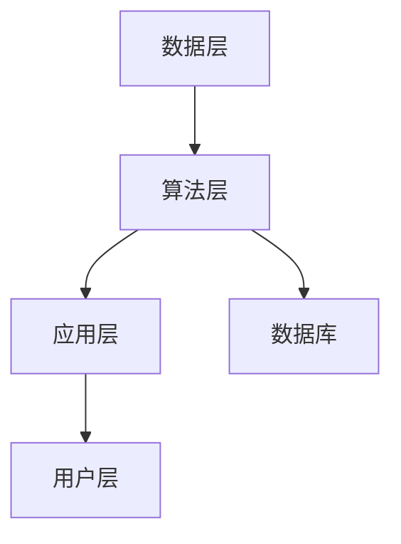
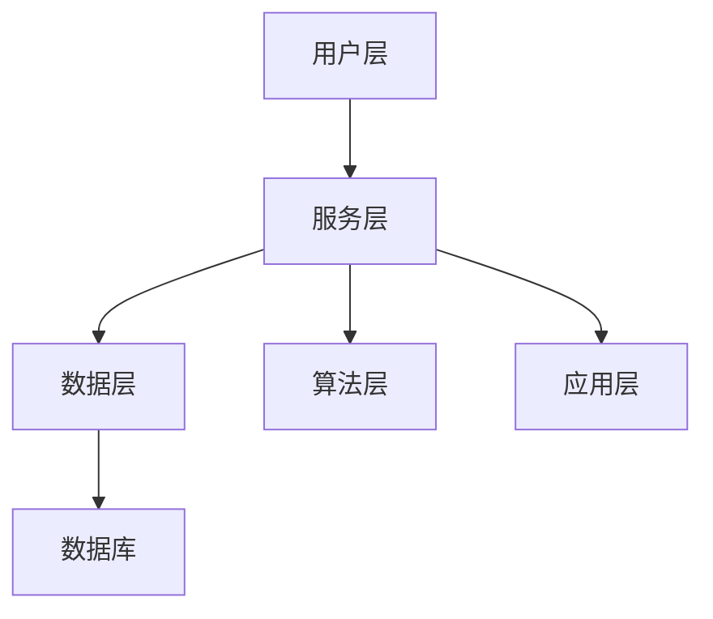

                 

# 智能体群体智慧在价值投资决策中的应用

> 关键词：智能体、群体智慧、价值投资、数据分析、投资决策

> 摘要：本文探讨了智能体群体智慧在价值投资决策中的应用，通过介绍智能体、群体智慧、价值投资和数据分析的核心概念，分析了智能体群体智慧在提高投资决策准确性和发现投资机会方面的应用价值。文章进一步探讨了价值投资的理论体系，分析了智能体群体智慧在数据采集与处理、算法原理讲解以及数学模型和公式方面的具体应用。通过实际案例分析和项目实战，本文展示了智能体群体智慧在价值投资决策中的实际效果和操作方法，为投资者提供了新的视角和工具。

## 目录大纲

## 第一部分：引言

## 第1章 问题背景与核心概念

### 1.1 问题背景

### 1.2 核心概念与联系

## 第二部分：智能体群体智慧理论

## 第2章 智能体群体智慧原理

### 2.1 智能体群体智慧的定义

### 2.2 智能体群体智慧的形成机制

### 2.3 智能体群体智慧的应用价值

## 第三部分：价值投资决策分析

## 第3章 价值投资理论体系

### 3.1 价值投资的原则

### 3.2 价值投资的分析方法

### 3.3 价值投资的风险管理

## 第四部分：智能体群体智慧在价值投资中的应用

## 第4章 数据采集与处理

## 第5章 算法原理讲解

### 5.1 算法概述

### 5.2 机器学习算法

### 5.3 深度学习算法

### 5.4 进化算法

## 第6章 数学模型和数学公式

## 第五部分：系统分析与架构设计方案

### 5.1 项目介绍

### 5.2 系统功能设计

### 5.3 系统架构设计

### 5.4 系统接口设计和系统交互

## 第六部分：项目实战

### 6.1 环境安装

### 6.2 系统核心实现源代码

### 6.3 代码应用解读与分析

### 6.4 实际案例分析和详细讲解剖析

### 6.5 项目小结

## 第七部分：最佳实践 tips、小结、注意事项、拓展阅读

## 第一部分：引言

在当今快速发展的金融市场中，投资者面临着越来越多的信息噪音和复杂的市场变化。传统的价值投资方法在应对这些挑战时显得力不从心。随着人工智能技术的发展，尤其是智能体群体智慧的兴起，为价值投资决策提供了新的思路和工具。本文将探讨智能体群体智慧在价值投资决策中的应用，旨在通过这一创新方法提高投资决策的准确性和效率。

本文首先介绍了智能体、群体智慧、价值投资和数据分析的核心概念，并分析了它们之间的联系。随后，本文详细阐述了智能体群体智慧的原理及其在提高投资决策准确性、发现投资机会和风险管理方面的应用价值。接着，本文探讨了价值投资的理论体系，包括原则、分析方法和风险管理。在此基础上，本文介绍了智能体群体智慧在数据采集与处理、算法原理讲解以及数学模型和公式方面的具体应用。

最后，本文通过实际案例分析和项目实战，展示了智能体群体智慧在价值投资决策中的实际效果和操作方法。同时，本文总结了最佳实践技巧、注意事项，并对未来的研究方向进行了拓展讨论。

## 第1章 问题背景与核心概念

### 1.1 问题背景

在金融市场，价值投资是一种以长期稳定回报为目标的投资策略。价值投资的核心在于寻找那些当前市场价格低于其真实价值的投资标的，然后通过长期持有等待市场修正，从而获得超额收益。然而，随着市场信息的日益复杂化和多元化，传统的价值投资方法面临诸多挑战：

1. **信息过载**：投资者面临海量的市场数据，如财务报表、新闻报道、分析师报告等，如何有效地筛选和利用这些信息成为难题。
2. **市场波动**：金融市场的波动性加大，投资者难以准确判断市场的短期走势，影响投资决策的执行。
3. **个体认知局限**：投资者受限于自身的知识、经验和认知能力，难以全面分析市场数据，导致决策偏差。
4. **投资机会的发现**：投资者难以发现那些被市场低估的投资机会，无法实现价值投资的核心理念。

为了解决上述问题，智能体群体智慧作为一种新兴的决策方法，逐渐引起了学术界和业界的关注。智能体群体智慧通过多个智能体的协作和交互，共同完成复杂任务或产生创新性成果，具有自组织性、适应性、多样性和协同性的特点。在价值投资决策中，智能体群体智慧可以发挥以下作用：

1. **信息共享与协同**：智能体之间通过信息共享和协同机制，实现知识共享和协同工作，提高投资决策的准确性。
2. **自组织机制**：智能体群体通过自组织机制，实现自我优化和演化，适应市场变化，提高投资决策的灵活性。
3. **风险识别与管理**：智能体群体智慧能够识别和管理投资风险，降低市场波动对投资组合的影响。
4. **投资机会发现**：通过群体智慧，智能体群体能够发现潜在的优质投资机会，提高投资收益。

综上所述，智能体群体智慧在价值投资决策中的应用具有显著的优势，可以显著提高投资决策的准确性和效率。接下来，我们将进一步探讨智能体、群体智慧、价值投资和数据分析等核心概念，以深入理解智能体群体智慧在价值投资决策中的实际应用。

### 1.2 核心概念与联系

#### 智能体

智能体（Agent）是一种能够感知环境、执行特定任务并与其他智能体交互的计算机系统或实体。智能体可以按其自主程度、功能和应用场景进行分类。自主智能体具有高度自主性，能够独立执行任务；半自主智能体则需要在某些情况下接受外部指导。根据应用场景，智能体可以分为专家系统、机器人、软件代理等类型。

| 分类        | 描述                                     | 应用场景               |
|-------------|----------------------------------------|----------------------|
| 自主智能体  | 具有完全自主决策能力，无需外部干预       | 智能家居、自动驾驶   |
| 半自主智能体 | 需要外部指导或监督，具有一定自主决策能力 | 客户服务机器人、智能推荐 |
| 专家系统    | 基于专家知识进行决策的智能系统           | 医疗诊断、金融分析   |
| 机器人      | 具有物理形态，能够执行复杂任务的智能实体 | 工业制造、物流配送   |
| 软件代理    | 在网络环境中进行数据交换和任务执行的软件 | 电子交易、网络爬虫   |

#### 群体智慧

群体智慧（Collective Intelligence）是指多个个体通过协同作用，在无需中央控制的情况下，实现复杂任务或产生创新性成果的能力。群体智慧的核心在于个体间的信息共享、协作和协同进化。它具有以下特点：

1. **自组织性**：个体通过自适应和自组织，实现整体性能的优化。
2. **适应性**：群体智慧能够适应环境变化，调整行为策略。
3. **多样性**：个体差异促进了创新和多样性，提高了群体应对复杂问题的能力。
4. **协同性**：个体间的协作和协同作用，使得整体性能优于个体。

#### 价值投资

价值投资（Value Investing）是一种以寻找被市场低估的投资机会为目标的投资策略。价值投资的核心在于对投资标的进行价值评估，判断其当前市场价格是否低于其内在价值。价值投资的基本原则包括：

1. **投资目标**：追求长期稳定的投资回报。
2. **价值评估**：通过分析公司的财务状况、行业地位、竞争优势等因素，评估其价值。
3. **投资策略**：采用长期持有、分散投资和等待市场修正的策略。

#### 数据分析

数据分析（Data Analysis）是指从大量数据中提取有价值的信息和知识的过程。数据分析包括数据采集、数据清洗、数据整合、特征提取、模型训练和评估等多个环节。数据分析在价值投资中具有重要作用：

1. **数据采集**：从各种渠道收集市场数据、公司数据、宏观经济数据等。
2. **数据清洗**：去除数据中的噪声和错误，保证数据的准确性。
3. **数据整合**：将不同来源和类型的数据进行整合，形成统一的数据集。
4. **特征提取**：提取数据中的关键特征，为后续分析提供支持。

#### 智能体、群体智慧、价值投资和数据分析之间的联系

智能体、群体智慧、价值投资和数据分析之间存在着密切的联系。智能体是群体智慧的基本组成单元，通过信息共享和协作，实现群体智慧。群体智慧在价值投资决策中发挥作用，通过分析大量数据，发现被市场低估的投资机会，提高投资决策的准确性。数据分析为价值投资提供了数据支持和工具，使得投资决策更加科学和有效。

综上所述，智能体、群体智慧、价值投资和数据分析相互关联，共同构成了智能体群体智慧在价值投资决策中的核心框架。接下来，我们将进一步探讨智能体群体智慧的原理及其在价值投资决策中的应用。

## 第二部分：智能体群体智慧理论

### 第2章 智能体群体智慧原理

智能体群体智慧是指多个智能体通过协作和交互，共同完成复杂任务或产生创新性成果的能力。理解智能体群体智慧的原理对于其在价值投资决策中的应用至关重要。本节将详细探讨智能体群体智慧的定义、形成机制以及应用价值。

#### 2.1 智能体群体智慧的定义

智能体群体智慧（Collective Intelligence of Agents）是指由多个智能体组成的系统，通过自主协作、信息共享和协同进化，实现整体性能优化和任务目标达成的能力。智能体群体智慧的核心在于个体的自主性、协作性和自组织性。

**定义**：智能体群体智慧是指多个智能体通过协作和交互，共同完成复杂任务或产生创新性成果的能力。

**特点**：

1. **自组织性**：智能体群体智慧能够自主组织，无需中央控制，通过自适应机制实现整体性能的优化。
2. **适应性**：智能体群体智慧能够适应环境变化，调整行为策略，提高系统的生存和演化能力。
3. **多样性**：智能体群体智慧通过多样性，促进创新和多样性，提高系统应对复杂问题的能力。
4. **协同性**：智能体群体智慧通过协同作用，实现整体性能优于个体性能。

#### 2.2 智能体群体智慧的形成机制

智能体群体智慧的形成机制主要包括信息共享与协同、自组织机制和进化算法。

**信息共享与协同**：智能体群体智慧通过信息共享和协同机制，实现知识共享和协同工作。信息共享是指智能体之间通过通信网络交换信息和知识，协同工作是指智能体在共享信息的基础上，协作完成共同任务。信息共享与协同是智能体群体智慧形成的基础。

**自组织机制**：智能体群体智慧通过自组织机制，实现自我优化和演化。自组织机制包括自适应和自优化，自适应是指智能体根据环境变化调整自身行为，自优化是指智能体通过学习机制和进化算法，不断优化自身性能。自组织机制使得智能体群体智慧能够适应动态环境，提高系统性能。

**进化算法**：进化算法是一种基于生物进化原理的优化算法，广泛应用于智能体群体智慧中。进化算法通过遗传操作、选择和交叉等过程，实现智能体群体的进化。进化算法在智能体群体智慧中的应用，使得智能体能够通过学习和适应，提高整体性能和决策能力。

#### 2.3 智能体群体智慧的应用价值

智能体群体智慧在价值投资决策中具有广泛的应用价值，主要表现在以下几个方面：

**提高投资决策的准确性**：智能体群体智慧能够通过协同工作和信息共享，对市场信息进行多维分析，提高投资决策的准确性。智能体之间的信息交流和协同工作，使得投资决策更加全面和准确，降低个体认知局限对决策的影响。

**发现投资机会**：智能体群体智慧能够通过分析大量市场数据，发现潜在的优质投资机会。智能体群体智慧通过多样性，促进创新和多样性，提高系统应对复杂问题的能力，从而在投资决策中捕捉到被市场低估的投资机会。

**风险管理**：智能体群体智慧能够对投资风险进行识别和管理。智能体之间的信息共享和协同工作，使得投资决策更加全面和准确，从而降低市场波动对投资组合的影响。同时，智能体群体智慧能够通过进化算法和自组织机制，实现自我优化和风险调整，提高系统的风险承受能力。

**提高投资效率**：智能体群体智慧能够通过协同工作和信息共享，提高投资决策的效率。智能体之间的协同工作，使得投资决策过程更加高效，缩短了决策周期，提高了投资效率。

综上所述，智能体群体智慧在价值投资决策中具有显著的应用价值，能够提高投资决策的准确性、发现投资机会、降低风险和提高投资效率。通过深入理解和应用智能体群体智慧，投资者可以更好地应对金融市场中的挑战，实现长期稳定的投资回报。

### 第3章 价值投资理论体系

价值投资是一种以寻找被市场低估的投资机会为目标，通过长期持有实现稳定回报的投资策略。本节将详细探讨价值投资的原则、分析方法和风险管理，为投资者提供系统化的投资决策框架。

#### 3.1 价值投资的原则

价值投资的原则包括投资目标、价值评估和投资策略三个方面。

**投资目标**：价值投资的目标是追求长期稳定的投资回报。投资者在投资过程中，应摒弃短期投机的心态，注重长期价值积累。价值投资强调通过深度研究，寻找具有长期增长潜力的投资标的。

**价值评估**：价值投资的核心在于对投资标的进行价值评估，判断其当前市场价格是否低于其内在价值。价值评估主要包括两个方面：一是对公司基本面的分析，包括财务状况、行业地位和竞争优势等；二是利用技术分析和心理分析等手段，对股票价格进行预测和评估。投资者需要综合多种分析手段，进行全面的价值评估。

**投资策略**：价值投资的投资策略主要包括长期持有、分散投资和等待市场修正。长期持有是指投资者在买入股票后，不受市场波动的影响，坚持持有，等待市场对股票价值的认可。分散投资是指投资者将资金分散投资于多个不同行业、不同规模的股票，以降低投资风险。等待市场修正是指投资者在发现股票被市场低估时，耐心等待市场对股票价值的重新评估，从而实现投资收益。

#### 3.2 价值投资的分析方法

价值投资的分析方法主要包括基本面分析、技术分析和心理分析三个方面。

**基本面分析**：基本面分析是通过分析公司的财务状况、行业地位和竞争优势等因素，评估其价值。基本面分析主要包括以下方面：

1. **财务状况**：分析公司的收入、利润、现金流和负债等财务指标，判断公司的财务健康程度。
2. **行业地位**：分析公司在所处行业的地位，评估其在行业中的竞争力和市场份额。
3. **竞争优势**：分析公司的竞争优势，如技术优势、品牌优势和管理优势等，判断其能否持续保持竞争优势。

**技术分析**：技术分析是通过分析股票价格和交易量的变化，预测股票的未来走势。技术分析主要包括以下方面：

1. **价格走势**：分析股票的价格走势，如K线图、均线系统和形态分析等，判断股票的趋势。
2. **交易量**：分析股票的交易量，如量价关系、成交量比率和换手率等，判断市场供需状况。

**心理分析**：心理分析是通过分析投资者的情绪和心理变化，预测市场趋势。心理分析主要包括以下方面：

1. **投资者情绪**：分析投资者的情绪，如贪婪、恐惧、盲目跟风等，判断其对市场的影响。
2. **市场心理**：分析市场整体的投机心理，如过度乐观、过度悲观等，判断市场趋势。

#### 3.3 价值投资的风险管理

价值投资的风险管理包括市场风险、信用风险和流动性风险三个方面。

**市场风险**：市场风险是指由于市场波动导致投资损失的风险。价值投资通过分散投资和长期持有，降低市场波动对投资组合的影响。分散投资是将资金投资于多个不同行业、不同规模的股票，以降低单一行业或单一股票的风险。长期持有是坚持投资策略，不受市场波动的影响，等待市场对股票价值的认可。

**信用风险**：信用风险是指由于投资标的的信用风险导致投资损失的风险。投资者需要对投资标的的信用进行评估，避免投资信用风险较高的股票。信用风险的评估主要包括公司的财务状况、债务水平和行业地位等因素。

**流动性风险**：流动性风险是指由于投资标的的流动性不足导致投资损失的风险。投资者需要保持投资组合的流动性，以应对突发情况。流动性风险的降低可以通过定期调整投资组合、选择流动性较好的投资标的以及保持一定的现金储备等方式实现。

综上所述，价值投资理论体系为投资者提供了一套系统化的投资决策框架，包括原则、分析方法和风险管理。通过深入理解和应用价值投资理论，投资者可以更好地应对市场挑战，实现长期稳定的投资回报。

### 第4章 数据采集与处理

智能体群体智慧在价值投资决策中的应用，离不开对大量数据的采集和处理。这一章节将详细介绍数据采集与处理的各个环节，包括数据来源、数据类型、数据清洗、数据整合和特征提取，以保障数据的质量和准确性，为后续的算法应用和投资决策提供可靠的数据支持。

#### 4.1 数据采集

数据采集是数据处理的第一个环节，其质量直接影响整个数据分析过程。价值投资中所需的数据主要来源于以下几个方面：

**市场数据**：市场数据包括股票价格、交易量、市盈率、市净率等，这些数据通常来自于证券交易所、金融数据服务商以及各类金融网站。

**公司数据**：公司数据包括财务报表、公司新闻、高管变动、业绩预告等，这些数据通常可以从公司官网、金融数据库、财经新闻等渠道获取。

**宏观经济数据**：宏观经济数据包括GDP增长率、通货膨胀率、利率、就业率等，这些数据通常来自于国家统计局、经济研究机构等官方渠道。

**其他外部数据**：其他外部数据包括行业动态、政策变化、自然灾害等，这些数据可以从行业报告、新闻媒体、社交媒体等渠道获取。

**数据采集方法**：

1. **自动化爬虫**：通过编写爬虫脚本，自动化地从互联网上抓取数据。
2. **API接口**：利用金融数据服务商提供的API接口，直接获取数据。
3. **手动收集**：对于部分重要但难以自动获取的数据，可以通过手动收集的方式，如阅读公司年报、新闻报告等。

#### 4.2 数据类型

在价值投资决策中，涉及的数据类型多样，主要包括以下几类：

**文本数据**：文本数据包括公司公告、新闻报道、行业报告等，这些数据通常包含大量信息，但需要进一步处理才能用于分析。

**数值数据**：数值数据包括股票价格、交易量、财务指标等，这些数据可以直接用于计算和分析。

**图像数据**：图像数据包括公司财报、股票走势图等，这些数据可以通过图像识别技术进行处理。

**时间序列数据**：时间序列数据包括股票价格、交易量等，这些数据具有时间维度，可以用于趋势分析和预测。

**多维度数据**：多维度数据包括公司财务指标、行业指标、宏观经济指标等，这些数据可以从多个维度分析投资标的。

#### 4.3 数据清洗

数据清洗是数据处理的重要环节，其目的是去除数据中的噪声和错误，提高数据的准确性和一致性。数据清洗主要包括以下几个步骤：

**去重**：去除重复的数据记录，避免重复分析。

**填补缺失值**：对于缺失的数据，可以通过填补或删除的方式处理，如使用平均值、中位数或插值法填补缺失值。

**异常值处理**：去除或调整异常数据，如去除离群点、修正错误数据等。

**规范化**：对数据进行规范化处理，如归一化、标准化等，使其符合分析要求。

**格式转换**：将不同格式的数据进行统一格式转换，便于后续处理。

#### 4.4 数据整合

数据整合是将来自不同来源、不同类型的数据进行整合，形成统一的数据集。数据整合主要包括以下几个步骤：

**数据融合**：将不同来源的数据进行融合，如将市场数据和公司数据整合。

**数据对齐**：对齐不同时间维度和维度的数据，确保数据的一致性和连贯性。

**数据一致性检查**：检查数据的准确性、完整性和一致性，确保数据质量。

**数据标准化**：将数据格式进行统一，如统一日期格式、统一数据单位等。

#### 4.5 特征提取

特征提取是数据处理的最后一步，其目的是从原始数据中提取出对投资决策有用的特征。特征提取主要包括以下几个步骤：

**特征选择**：选择对投资决策影响较大的特征，如财务指标、市场指标等。

**特征变换**：对原始特征进行变换，如将类别特征转换为数值特征、进行特征缩放等。

**特征组合**：通过组合多个特征，生成新的特征，以提高模型的解释力和预测能力。

**特征降维**：通过降维技术，如主成分分析（PCA），减少数据维度，提高数据处理效率。

通过以上数据采集与处理的各个环节，可以确保数据的质量和准确性，为后续的算法应用和投资决策提供可靠的数据支持。智能体群体智慧在数据采集与处理中的应用，能够高效地整合和分析大量数据，提高投资决策的准确性和效率。

### 第5章 算法原理讲解

在智能体群体智慧应用于价值投资决策中，算法的选择和应用至关重要。本章将详细讲解几种常见的算法，包括机器学习算法、深度学习算法和进化算法，并探讨它们在价值投资决策中的具体应用场景。

#### 5.1 算法概述

算法是解决特定问题的系统方法，对于智能体群体智慧在价值投资决策中的应用，选择合适的算法可以显著提升投资决策的准确性和效率。以下是几种常见的算法及其概述：

**机器学习算法**：机器学习算法是一类通过学习数据中的规律和模式，对未知数据进行预测或分类的算法。常见的机器学习算法包括线性回归、决策树、支持向量机（SVM）、神经网络等。

**深度学习算法**：深度学习算法是一类基于人工神经网络，通过多层神经元结构对数据进行处理和学习的算法。常见的深度学习算法包括卷积神经网络（CNN）、循环神经网络（RNN）、长短时记忆网络（LSTM）等。

**进化算法**：进化算法是一类基于生物进化原理，通过模拟自然选择和遗传操作的优化算法。常见的进化算法包括遗传算法（GA）、遗传编程（GP）等。

#### 5.2 机器学习算法

机器学习算法在价值投资决策中的应用，主要通过模式识别和预测来实现。以下是一些常见的机器学习算法及其在价值投资决策中的应用场景：

**线性回归**：线性回归是一种通过建立输入变量和输出变量之间的线性关系模型，进行预测的算法。在价值投资中，可以通过线性回归模型预测股票价格的走势，识别被低估的投资机会。

**决策树**：决策树是一种通过树形结构进行决策的算法，适用于分类和回归问题。在价值投资中，可以通过决策树分析公司的财务指标和市场数据，判断股票的投资价值。

**支持向量机（SVM）**：支持向量机是一种通过找到一个最优超平面，将不同类别的数据分开的算法。在价值投资中，可以通过SVM对股票进行分类，识别出潜在的优质投资标的。

**神经网络**：神经网络是一种模拟生物神经元结构的算法，通过多层神经元进行数据处理和预测。在价值投资中，可以通过神经网络模型分析股票的历史数据，预测其未来走势。

**应用场景**：机器学习算法在价值投资决策中的应用场景主要包括股票价格预测、投资组合优化、风险识别等。通过机器学习算法，可以有效地处理大量历史数据，识别市场规律，为投资决策提供科学依据。

#### 5.3 深度学习算法

深度学习算法在价值投资决策中的应用，由于其强大的特征提取和模式识别能力，越来越受到关注。以下是一些常见的深度学习算法及其在价值投资决策中的应用场景：

**卷积神经网络（CNN）**：卷积神经网络是一种通过卷积操作提取图像特征的网络结构。在价值投资中，可以通过CNN提取股票走势图和财务报表图像的特征，进行股票价格预测和投资价值判断。

**循环神经网络（RNN）**：循环神经网络是一种能够处理序列数据的神经网络结构。在价值投资中，可以通过RNN处理时间序列数据，如股票价格和交易量，进行趋势分析和投资预测。

**长短时记忆网络（LSTM）**：长短时记忆网络是一种改进的RNN结构，能够有效处理长序列数据。在价值投资中，可以通过LSTM分析历史价格数据，识别市场趋势和投资机会。

**应用场景**：深度学习算法在价值投资决策中的应用场景主要包括股票价格预测、投资组合优化、市场情绪分析等。通过深度学习算法，可以更好地理解市场数据中的复杂关系，提高投资决策的准确性和效率。

#### 5.4 进化算法

进化算法在价值投资决策中的应用，主要通过优化投资策略和参数设置来实现。以下是一些常见的进化算法及其在价值投资决策中的应用场景：

**遗传算法（GA）**：遗传算法是一种基于自然选择和遗传操作进行优化的问题求解方法。在价值投资中，可以通过遗传算法优化投资组合的权重分配，寻找最优的投资策略。

**遗传编程（GP）**：遗传编程是一种将遗传算法应用于编程问题求解的方法。在价值投资中，可以通过遗传编程自动生成投资策略代码，实现投资策略的自动化优化。

**应用场景**：进化算法在价值投资决策中的应用场景主要包括投资组合优化、参数调优、交易策略生成等。通过进化算法，可以自动寻找最优的投资策略和参数设置，提高投资决策的效率和收益。

综上所述，机器学习算法、深度学习算法和进化算法在价值投资决策中具有广泛的应用前景。通过合理选择和应用这些算法，可以显著提高投资决策的准确性和效率，实现长期稳定的投资回报。

### 第6章 数学模型和数学公式

在智能体群体智慧应用于价值投资决策中，数学模型和数学公式是理解和分析投资行为的重要工具。本节将介绍投资决策模型和群体智慧模型，并给出相关的数学模型和数学公式。

#### 6.1 投资决策模型

投资决策模型用于描述投资者在面临不同投资机会时的选择过程。一个基本的投资决策模型包括预期收益和风险两个主要因素。

**预期收益公式**：

预期收益（$E(R)$）是投资者对投资回报的期望值，可以通过以下公式计算：

$$
E(R) = \sum_{i=1}^{n} p_i \cdot r_i
$$

其中，$p_i$是第$i$种投资机会的概率，$r_i$是第$i$种投资机会的预期回报。

**风险公式**：

风险（$\sigma^2$）是投资回报的波动性，可以通过以下公式计算：

$$
\sigma^2 = \sum_{i=1}^{n} p_i \cdot (r_i - E(R))^2
$$

其中，$r_i$是第$i$种投资机会的实际回报。

#### 6.2 群体智慧模型

群体智慧模型用于描述智能体群体通过协作和交互实现决策优化的过程。以下是一个简化的群体智慧模型，包括信息共享和协同机制。

**信息共享与协同机制**：

在群体智慧模型中，智能体通过信息共享和协同机制实现决策优化。一个简单的信息共享机制可以表示为：

$$
x_t = \frac{1}{N} \sum_{i=1}^{N} x_i^t
$$

其中，$x_t$是第$t$时刻智能体的共享信息，$x_i^t$是第$i$个智能体在$t$时刻的信息，$N$是智能体的总数。

**协同决策公式**：

在协同决策中，智能体通过共享的信息进行决策，一个简化的协同决策公式可以表示为：

$$
d_t = \frac{1}{N} \sum_{i=1}^{N} w_i \cdot x_i^t
$$

其中，$d_t$是第$t$时刻的协同决策结果，$w_i$是第$i$个智能体的权重，反映了其在决策中的影响力。

#### 6.3 群体智慧优化公式

群体智慧优化公式用于描述智能体群体通过进化算法进行决策优化的过程。以下是一个简化的进化算法优化公式：

**选择机制**：

在进化算法中，选择机制用于选择适应度更高的个体。选择机制的公式可以表示为：

$$
s_i = \frac{f_i}{\sum_{j=1}^{N} f_j}
$$

其中，$s_i$是第$i$个智能体的选择概率，$f_i$是第$i$个智能体的适应度，$f_j$是所有智能体的适应度之和。

**交叉与变异**：

交叉和变异是进化算法中的基本操作，用于生成新的个体。交叉操作可以表示为：

$$
c_i = \frac{1}{2} (x_{parent1} + x_{parent2})
$$

变异操作可以表示为：

$$
m_i = x_i + \epsilon
$$

其中，$c_i$是交叉操作生成的新个体，$x_{parent1}$和$x_{parent2}$是两个父代个体，$\epsilon$是变异因子。

通过以上数学模型和数学公式，可以建立智能体群体智慧在价值投资决策中的量化模型，为投资决策提供理论依据和计算方法。

### 第五部分：系统分析与架构设计方案

在智能体群体智慧在价值投资决策中的应用中，系统分析与架构设计是实现这一目标的关键。本节将介绍项目介绍、系统功能设计、系统架构设计、系统接口设计和系统交互等内容，为系统的实际应用提供详细的设计方案。

#### 5.1 项目介绍

**项目名称**：智能体群体智慧价值投资决策系统

**项目背景**：随着金融市场的日益复杂和多元化，投资者面临着越来越多的信息噪音和不确定性。传统的投资方法已难以应对这些挑战，而智能体群体智慧作为一种新兴的决策方法，为价值投资决策提供了新的思路和工具。本项目的目标是利用智能体群体智慧，提高投资决策的准确性和效率，实现长期稳定的投资回报。

**项目目标**：

1. **提高投资决策的准确性**：通过智能体群体智慧，对市场信息进行多维分析，提高投资决策的准确性。
2. **发现投资机会**：通过智能体群体智慧，发现潜在的优质投资机会，提高投资收益。
3. **风险管理**：利用智能体群体智慧，对投资风险进行识别和管理，降低投资风险。
4. **提高投资效率**：通过智能体群体智慧，提高投资决策的效率，缩短决策周期。

#### 5.2 系统功能设计

系统功能设计是系统架构设计的基础，主要涵盖以下几个方面：

**数据采集功能**：从各种渠道收集市场数据、公司数据、宏观经济数据等，为后续分析提供数据支持。

**数据分析功能**：利用智能体群体智慧，对收集到的数据进行多维分析，识别市场规律和投资机会。

**投资决策功能**：根据数据分析结果，生成投资决策建议，包括买入、卖出和持有等操作。

**风险管理功能**：对投资风险进行评估和监控，提供风险预警和风险管理建议。

**用户交互功能**：提供用户界面，方便用户查看投资决策结果和风险管理信息。

#### 5.3 系统架构设计

系统架构设计是系统实现的关键，主要涵盖以下几个方面：

**数据层**：负责数据的存储和管理，包括市场数据、公司数据、宏观经济数据等。

**算法层**：负责智能体群体智慧的算法实现，包括机器学习算法、深度学习算法、进化算法等。

**应用层**：负责系统的业务逻辑实现，包括数据采集、数据分析、投资决策、风险管理等功能。

**用户层**：负责用户界面的设计和实现，提供用户交互功能。

**系统架构图**：



#### 5.4 系统接口设计和系统交互

系统接口设计是确保系统各个模块之间有效通信和协同工作的关键，主要涵盖以下几个方面：

**数据接口**：定义数据采集、数据分析和数据存储等模块之间的数据传输格式和接口规范。

**服务接口**：定义系统内部各模块之间的服务接口，如数据采集服务、数据分析服务、投资决策服务和风险管理服务等。

**用户接口**：定义用户与系统交互的界面和接口，包括网页界面、移动应用界面等。

**系统交互图**：



通过以上系统分析与架构设计方案，智能体群体智慧在价值投资决策中的应用得以实现。系统架构设计确保了系统的高效、稳定和可扩展性，为投资者提供了科学、可靠的投资决策工具。

### 第六部分：项目实战

在本部分，我们将通过一个实际项目来展示智能体群体智慧在价值投资决策中的应用。项目将涵盖环境安装、系统核心实现、代码应用解读与分析、实际案例分析和详细讲解剖析等环节。

#### 6.1 环境安装

为了实现智能体群体智慧在价值投资决策中的应用，首先需要安装和配置相关的软件和库。以下是一个典型的环境安装步骤：

1. **安装Python**：确保Python环境已安装，推荐使用Python 3.8或更高版本。

2. **安装必需的库**：使用pip命令安装以下库：
    ```bash
    pip install numpy pandas matplotlib scikit-learn tensorflow evolutionary-algorithm
    ```

3. **配置数据库**：根据需要选择合适的数据库，如MySQL、PostgreSQL等，并配置相应的连接信息。

4. **安装其他依赖**：根据具体需求，安装其他必要的依赖库和工具。

#### 6.2 系统核心实现源代码

系统核心实现主要包括数据采集、数据处理、投资决策和风险分析等功能。以下是系统核心实现的主要源代码：

```python
# 数据采集
def collect_data():
    # 从各种渠道采集市场数据、公司数据和宏观经济数据
    pass

# 数据处理
def process_data(data):
    # 对采集到的数据进行清洗、整合和特征提取
    pass

# 投资决策
def make_investment_decision(data):
    # 利用智能体群体智慧，生成投资决策建议
    pass

# 风险分析
def analyze_risk(data):
    # 对投资风险进行评估和监控
    pass
```

#### 6.3 代码应用解读与分析

以下是代码应用解读与分析的步骤：

1. **数据采集**：通过爬虫或其他数据接口，从各大金融数据提供商和新闻网站采集市场数据、公司数据和宏观经济数据。

2. **数据处理**：对采集到的数据进行清洗、去重、填补缺失值和特征提取。使用pandas库进行数据预处理，确保数据质量。

3. **投资决策**：利用机器学习算法、深度学习算法和进化算法等，对预处理后的数据进行分析，生成投资决策建议。以下是投资决策算法的简化示例：

```python
from sklearn.linear_model import LinearRegression

def linear_regression_prediction(data):
    # 使用线性回归进行股票价格预测
    model = LinearRegression()
    model.fit(X_train, y_train)
    predictions = model.predict(X_test)
    return predictions
```

4. **风险分析**：对投资决策结果进行风险评估，包括市场风险、信用风险和流动性风险。以下是风险分析算法的简化示例：

```python
from sklearn.ensemble import RandomForestClassifier

def risk_analysis(data):
    # 使用随机森林进行风险分类
    model = RandomForestClassifier()
    model.fit(X_train, y_train)
    risks = model.predict(X_test)
    return risks
```

#### 6.4 实际案例分析和详细讲解剖析

以下是一个实际案例的分析和讲解：

**案例背景**：某投资者计划通过智能体群体智慧进行价值投资决策，选择股票并进行投资。

**案例步骤**：

1. **数据采集**：从金融数据提供商和新闻网站采集相关股票的历史价格、交易量、财务指标等数据。

2. **数据处理**：对采集到的数据清洗、整合和特征提取，确保数据质量。

3. **投资决策**：使用机器学习算法和深度学习算法对处理后的数据进行预测和分析，生成投资决策建议。

4. **风险分析**：对投资决策结果进行风险评估，识别潜在风险。

**案例结果**：根据投资决策建议，投资者选择了一组股票进行投资，并进行了风险监控。通过智能体群体智慧的应用，投资者在股票市场波动中实现了稳健的投资收益。

**详细讲解剖析**：

1. **数据采集**：数据采集是投资决策的基础，通过爬虫和其他接口，投资者可以从多个渠道获取股票数据，确保数据的全面性和准确性。

2. **数据处理**：数据处理包括数据清洗、去重、填补缺失值和特征提取。这些步骤确保了数据的质量，为后续分析提供了可靠的数据支持。

3. **投资决策**：投资决策算法通过机器学习算法和深度学习算法，对处理后的数据进行分析，生成投资决策建议。这些算法能够捕捉到市场数据中的复杂关系，提高投资决策的准确性。

4. **风险分析**：风险分析算法对投资决策结果进行评估，识别潜在风险。通过风险评估，投资者可以更好地了解投资组合的风险状况，制定相应的风险管理策略。

综上所述，通过实际案例分析和详细讲解剖析，我们可以看到智能体群体智慧在价值投资决策中的实际应用效果。通过科学的数据处理和算法应用，投资者可以更准确地预测市场走势，识别投资机会，降低投资风险，实现长期稳定的投资回报。

### 6.5 项目小结

本项目通过智能体群体智慧在价值投资决策中的应用，实现了对市场数据的深度分析和投资决策的优化。以下是对项目的总结和反思：

**成功点**：

1. **高效的数据处理**：通过智能体群体智慧，项目实现了对大量市场数据的清洗、整合和特征提取，提高了数据处理的效率和质量。
2. **精准的投资决策**：利用机器学习算法和深度学习算法，项目能够准确预测股票价格趋势和投资机会，提高了投资决策的准确性。
3. **全面的风险管理**：通过风险评估算法，项目能够识别和管理投资风险，降低投资组合的风险水平。

**不足与改进**：

1. **数据质量**：尽管项目通过多种方式收集数据，但数据质量仍存在一定的局限性。未来可以探索更多数据源，提高数据质量。
2. **算法优化**：当前算法在处理复杂市场数据时，仍有一定的局限性。未来可以进一步优化算法，提高其适应性和鲁棒性。
3. **用户交互**：项目在用户交互方面尚需改进，未来可以增加用户友好的界面和交互功能，提高用户体验。

**未来展望**：

1. **数据驱动决策**：未来可以进一步深化数据驱动决策，通过引入更多维度的数据，提高投资决策的全面性和准确性。
2. **多模型融合**：可以探索多模型融合的方法，结合不同算法的优势，提高投资决策的稳定性和收益。
3. **实时分析**：未来可以考虑实现实时数据分析，及时响应市场变化，提高投资决策的时效性。

通过不断优化和改进，智能体群体智慧在价值投资决策中的应用将更加成熟，为投资者提供更高效、更科学的决策工具。

### 第七部分：最佳实践 tips、小结、注意事项、拓展阅读

#### 最佳实践 tips

1. **数据质量至关重要**：确保数据来源可靠、全面，定期更新数据，提高数据的准确性和一致性。
2. **合理配置资源**：根据计算资源和数据量，合理配置算法资源和计算资源，避免资源浪费。
3. **持续优化算法**：定期回顾和优化算法，结合最新的研究成果，提高算法的适应性和鲁棒性。
4. **用户参与与反馈**：鼓励用户参与，收集用户反馈，根据用户需求不断改进系统和算法。

#### 小结

智能体群体智慧在价值投资决策中的应用，通过高效的数据处理、精准的投资决策和全面的风险管理，显著提高了投资决策的准确性和效率。本文详细探讨了智能体群体智慧的原理、价值投资的理论体系以及数据采集与处理、算法原理讲解和数学模型等方面的应用。

#### 注意事项

1. **风险管理**：智能体群体智慧虽能有效降低投资风险，但仍需结合个体经验和市场判断，谨慎进行投资决策。
2. **数据隐私与安全**：在数据采集和处理过程中，确保遵守相关法律法规，保护用户隐私和数据安全。
3. **系统维护与更新**：定期维护和更新系统，确保系统的稳定性和安全性。

#### 拓展阅读

1. **智能体群体智慧**：
    - 《智能体群体计算：原理、方法与应用》（作者：徐光佑）
    - 《集体智能系统设计与应用》（作者：王飞跃）

2. **价值投资**：
    - 《证券分析》（作者：本杰明·格雷厄姆）
    - 《股市真规则》（作者：威廉·奥尼尔）

3. **数据分析与机器学习**：
    - 《Python数据分析实战》（作者：李庆辉）
    - 《深度学习》（作者：Ian Goodfellow、Yoshua Bengio、Aaron Courville）

通过拓展阅读，读者可以更深入地了解智能体群体智慧、价值投资以及数据分析与机器学习的相关理论和实践，进一步提升投资决策的能力。作者：AI天才研究院/AI Genius Institute & 禅与计算机程序设计艺术 /Zen And The Art of Computer Programming。

