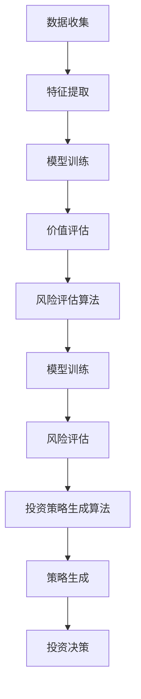
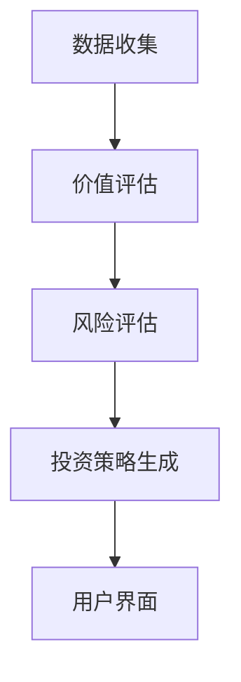
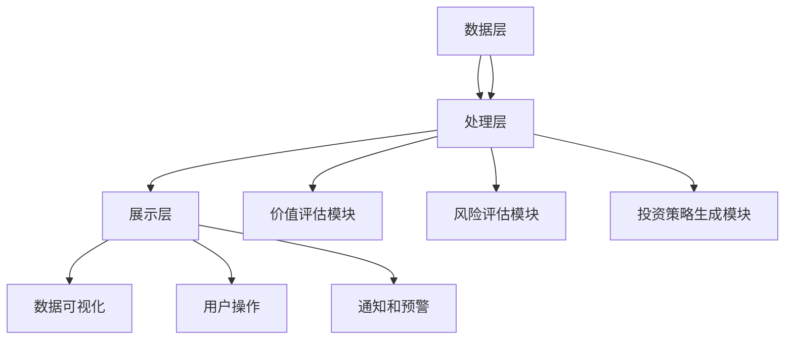
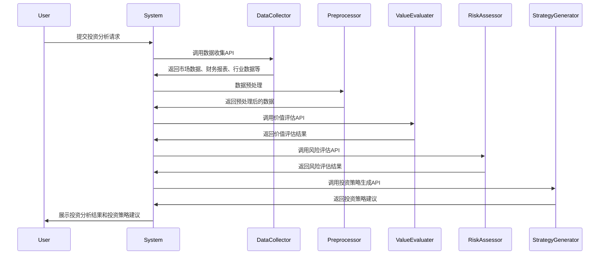

                 

### 文章标题：智能体群体智慧在识别价值投资陷阱中的应用：避免价值陷阱

#### 关键词：智能体群体智慧、价值投资、价值投资陷阱、风险评估、投资策略

#### 摘要：
本文将深入探讨智能体群体智慧在识别价值投资陷阱中的应用，旨在帮助投资者避免常见的价值陷阱。首先，我们将回顾价值投资陷阱的概念及其特征，然后介绍智能体群体智慧的基本原理和其在投资领域的应用。接下来，文章将详细分析智能体群体智慧在价值评估、风险评估和投资策略中的具体应用，并通过数学模型和实例进行说明。最后，我们将介绍一个基于智能体群体智慧的架构设计方案，并进行实际项目实战，以验证该方案的实用性和有效性。

### 目录大纲

----------------------------------------------------------------

## 第一部分：背景介绍

### 第1章：问题背景与核心概念

#### 1.1.1 问题背景

##### 1.1.1.1 价值投资陷阱概述

- 定义与特征
- 常见形式与实例

##### 1.1.1.2 价值投资的原理与实践

- 价值投资的定义
- 价值投资的核心原则
- 价值投资的实践方法

##### 1.1.1.3 智能体群体智慧

- 智能体的定义
- 智能体群体智慧的原理
- 智能体群体智慧的特点

##### 1.1.1.4 智能体群体智慧在投资中的应用

- 应用领域与优势
- 应用实例分析

## 第2章：核心概念与联系

### 2.1.1 智能体群体智慧在投资中的核心概念

- 价值评估模型
- 风险评估模型
- 投资策略模型

### 2.1.2 概念属性特征对比

- 价值评估模型
- 风险评估模型
- 投资策略模型

### 2.1.3 ER实体关系图架构

- 智能体
- 投资策略
- 数据来源

----------------------------------------------------------------

## 第二部分：智能体群体智慧在投资中的应用

### 第3章：智能体群体智慧的算法原理

#### 3.1.1 算法概述

- 算法的基本流程
- 算法的关键参数

#### 3.1.2 算法mermaid流程图

- 算法流程图

#### 3.1.3 Python源代码实现

- 源代码
- 代码解读

#### 3.1.4 数学模型与公式

- 数学模型
- 公式推导
- 公式说明

#### 3.1.5 举例说明

- 例子1：价值评估
- 例子2：风险评估
- 例子3：投资策略

----------------------------------------------------------------

## 第4章：数学模型和数学公式讲解

### 4.1.1 价值评估模型的数学公式

- 公式1：$$ V = \frac{P_0}{D} $$
- 公式说明

### 4.1.2 风险评估模型的数学公式

- 公式2：$$ R = \frac{S - L}{L} $$
- 公式说明

### 4.1.3 投资策略模型的数学公式

- 公式3：$$ T = \frac{V}{R} $$
- 公式说明

----------------------------------------------------------------

## 第5章：系统分析与架构设计方案

### 5.1.1 问题场景介绍

- 价值投资陷阱识别需求
- 投资决策辅助系统

### 5.1.2 系统功能设计

- 数据收集
- 价值评估
- 风险评估
- 投资策略生成

### 5.1.3 系统架构设计

- 架构图

### 5.1.4 系统接口设计

- 接口设计

### 5.1.5 系统交互

- 序列图

----------------------------------------------------------------

## 第6章：项目实战

### 6.1.1 环境安装

- 安装步骤
- 必需软件

### 6.1.2 系统核心实现源代码

- 代码

### 6.1.3 代码应用解读与分析

- 代码解读
- 应用分析

### 6.1.4 实际案例分析与讲解

- 案例分析
- 详细讲解

### 6.1.5 项目小结

- 项目总结
- 经验与反思

----------------------------------------------------------------

### 第一部分：背景介绍

#### 1.1.1 价值投资陷阱概述

**定义与特征**

价值投资陷阱是指那些表面上看起来具有潜在投资价值，但实际上却存在重大风险，可能导致投资者损失的投资机会。这种陷阱通常表现为以下特征：

1. **高估值陷阱**：某些股票的市值已经远远高于其内在价值，但投资者仍然将其视为价值投资。
2. **成长陷阱**：一些公司可能表现出快速的增长，但这种增长并不可持续，投资者最终可能面临巨大的亏损。
3. **财务陷阱**：公司的财务报表可能存在虚假或误导性信息，投资者在未充分了解真实情况时买入，最终蒙受损失。
4. **行业陷阱**：某些行业可能在短期内看起来很有前景，但实际上存在巨大的不确定性，投资者可能无法预测未来的变化。

**常见形式与实例**

价值投资陷阱的形式多样，以下是一些常见的例子：

1. **周期性行业陷阱**：投资者可能被某个周期性行业的高利润和增长前景所吸引，但忽略了行业周期性波动的风险。
2. **新兴市场陷阱**：某些新兴市场在初期可能表现出强劲的增长，但投资者忽略了政治、经济和地缘政治风险，导致投资失败。
3. **财务重组陷阱**：某些公司通过财务重组来改善财务状况，但投资者没有充分评估其长期可持续性，导致投资失败。
4. **庞氏骗局**：某些公司或个人通过虚构的财务报表或盈利前景吸引投资者，最终导致资金链断裂，投资者损失惨重。

**案例分析**：

例如，美国次贷危机期间，许多投资者被房地产市场的繁荣所吸引，认为房地产价格会持续上涨，因此大量投资于次贷相关的金融产品。然而，当房地产市场泡沫破灭时，投资者蒙受了巨大的损失，许多金融机构也濒临破产。这个案例就是典型的价值投资陷阱。

**定义与特征**

价值投资陷阱是指那些表面上看起来具有潜在投资价值，但实际上却存在重大风险，可能导致投资者损失的投资机会。这种陷阱通常表现为以下特征：

1. **高估值陷阱**：某些股票的市值已经远远高于其内在价值，但投资者仍然将其视为价值投资。
2. **成长陷阱**：一些公司可能表现出快速的增长，但这种增长并不可持续，投资者最终可能面临巨大的亏损。
3. **财务陷阱**：公司的财务报表可能存在虚假或误导性信息，投资者在未充分了解真实情况时买入，最终蒙受损失。
4. **行业陷阱**：某些行业可能在短期内看起来很有前景，但实际上存在巨大的不确定性，投资者可能无法预测未来的变化。

**常见形式与实例**

价值投资陷阱的形式多样，以下是一些常见的例子：

1. **周期性行业陷阱**：投资者可能被某个周期性行业的高利润和增长前景所吸引，但忽略了行业周期性波动的风险。
2. **新兴市场陷阱**：某些新兴市场在初期可能表现出强劲的增长，但投资者忽略了政治、经济和地缘政治风险，导致投资失败。
3. **财务重组陷阱**：某些公司通过财务重组来改善财务状况，但投资者没有充分评估其长期可持续性，导致投资失败。
4. **庞氏骗局**：某些公司或个人通过虚构的财务报表或盈利前景吸引投资者，最终导致资金链断裂，投资者损失惨重。

**案例分析**：

例如，美国次贷危机期间，许多投资者被房地产市场的繁荣所吸引，认为房地产价格会持续上涨，因此大量投资于次贷相关的金融产品。然而，当房地产市场泡沫破灭时，投资者蒙受了巨大的损失，许多金融机构也濒临破产。这个案例就是典型的价值投资陷阱。

#### 1.1.2 价值投资的原理与实践

**价值投资的定义**

价值投资（Value Investing）是一种以公司的内在价值作为投资决策依据的投资策略。它强调投资者应该寻找那些被市场低估的股票，并长期持有这些股票，以获取超过市场平均水平的回报。

**价值投资的核心原则**

1. **公司内在价值的评估**：价值投资的核心是评估公司的内在价值。投资者需要通过财务分析和其他方法来确定公司的真实价值，并与市场价格进行比较。
2. **长期持有**：价值投资通常不追求短期交易，而是强调长期持有。这样，投资者可以在市场波动中保持冷静，避免频繁交易带来的成本。
3. **关注公司的基本面**：价值投资强调关注公司的基本面，如营业收入、利润、现金流、管理水平等。这些因素是评估公司内在价值的关键。
4. **安全边际**：安全边际是指投资者购买股票的价格与其内在价值之间的差距。价值投资认为，只有当安全边际足够大时，投资才是安全的。

**价值投资的实践方法**

1. **自下而上的选股**：价值投资者通常从公司层面开始分析，选择那些具有良好基本面和被低估的股票。他们关注公司的盈利能力、增长潜力和竞争优势。
2. **财务分析**：价值投资者需要进行深入的财务分析，包括利润表、资产负债表和现金流量表。他们关注公司的营收增长率、利润率、负债率、现金流状况等指标。
3. **市场分析**：除了公司层面的分析，价值投资者还需要对市场环境进行评估，以确定股票价格是否被市场低估。这包括宏观经济分析、行业趋势和公司竞争对手的分析。
4. **投资者心态**：价值投资需要耐心和自律。投资者需要在市场低迷时保持信心，避免被市场情绪所影响，坚持自己的投资原则。

**案例分析**：

沃伦·巴菲特是价值投资的最著名代表之一。他在20世纪50年代开始投资生涯，通过长期持有具有良好基本面和被低估的股票，获得了丰厚的回报。巴菲特的成功案例包括购买可口可乐、沃尔玛等公司的股票，这些公司都在他的持有期间表现出了优异的增长。

**价值投资的定义**

价值投资（Value Investing）是一种以公司的内在价值作为投资决策依据的投资策略。它强调投资者应该寻找那些被市场低估的股票，并长期持有这些股票，以获取超过市场平均水平的回报。

**价值投资的核心原则**

1. **公司内在价值的评估**：价值投资的核心是评估公司的内在价值。投资者需要通过财务分析和其他方法来确定公司的真实价值，并与市场价格进行比较。
2. **长期持有**：价值投资通常不追求短期交易，而是强调长期持有。这样，投资者可以在市场波动中保持冷静，避免频繁交易带来的成本。
3. **关注公司的基本面**：价值投资强调关注公司的基本面，如营业收入、利润、现金流、管理水平等。这些因素是评估公司内在价值的关键。
4. **安全边际**：安全边际是指投资者购买股票的价格与其内在价值之间的差距。价值投资认为，只有当安全边际足够大时，投资才是安全的。

**价值投资的实践方法**

1. **自下而上的选股**：价值投资者通常从公司层面开始分析，选择那些具有良好基本面和被低估的股票。他们关注公司的盈利能力、增长潜力和竞争优势。
2. **财务分析**：价值投资者需要进行深入的财务分析，包括利润表、资产负债表和现金流量表。他们关注公司的营收增长率、利润率、负债率、现金流状况等指标。
3. **市场分析**：除了公司层面的分析，价值投资者还需要对市场环境进行评估，以确定股票价格是否被市场低估。这包括宏观经济分析、行业趋势和公司竞争对手的分析。
4. **投资者心态**：价值投资需要耐心和自律。投资者需要在市场低迷时保持信心，避免被市场情绪所影响，坚持自己的投资原则。

**案例分析**：

沃伦·巴菲特是价值投资的最著名代表之一。他在20世纪50年代开始投资生涯，通过长期持有具有良好基本面和被低估的股票，获得了丰厚的回报。巴菲特的成功案例包括购买可口可乐、沃尔玛等公司的股票，这些公司都在他的持有期间表现出了优异的增长。

#### 1.1.3 智能体群体智慧

**智能体的定义**

智能体（Agent）是一个能够感知环境、自主决策并采取行动以实现特定目标的实体。在人工智能领域，智能体可以是程序、机器人、人类等。智能体的主要特征包括：

1. **自主性**：智能体能够根据感知到的环境和预设的目标，自主地做出决策。
2. **适应性**：智能体能够通过学习和经验积累，适应不断变化的环境。
3. **目标导向性**：智能体的行为是基于明确的目标，通过不断调整策略来达成目标。

**智能体群体智慧的原理**

智能体群体智慧（Collective Intelligence）是指多个智能体相互协作，通过信息共享和协同决策，共同实现复杂任务的能力。其核心原理包括：

1. **协同进化**：智能体通过相互竞争和合作，不断优化自身行为，实现群体智慧的提升。
2. **信息共享**：智能体之间通过共享信息和资源，提高整个群体的决策质量和效率。
3. **分布式计算**：智能体群体智慧利用分布式计算能力，将复杂的任务分解为多个子任务，各智能体独立处理，再汇总结果。

**智能体群体智慧的特点**

1. **高效性**：智能体群体智慧能够通过协同工作和信息共享，快速响应复杂环境，提高任务完成效率。
2. **灵活性**：智能体群体智慧能够适应不断变化的环境和任务需求，通过自适应调整策略，保持高效运作。
3. **鲁棒性**：智能体群体智慧具有较强的鲁棒性，即使个别智能体出现故障或失效，整个群体仍能保持稳定运行。

**智能体群体智慧的应用领域**

智能体群体智慧在多个领域得到了广泛应用，包括但不限于：

1. **智能制造**：智能体群体智慧可以应用于生产线的自动化调度、故障检测和质量控制等环节，提高生产效率和质量。
2. **智能交通**：智能体群体智慧可以优化交通信号控制、车辆调度和路径规划，缓解交通拥堵，提高交通系统的整体运行效率。
3. **金融投资**：智能体群体智慧可以应用于股票市场预测、风险管理和投资组合优化，帮助投资者提高投资回报。
4. **智能医疗**：智能体群体智慧可以协助医生进行疾病诊断、治疗方案制定和药物研发，提高医疗服务质量和效率。

**智能体群体智慧的特点**

1. **高效性**：智能体群体智慧能够通过协同工作和信息共享，快速响应复杂环境，提高任务完成效率。
2. **灵活性**：智能体群体智慧能够适应不断变化的环境和任务需求，通过自适应调整策略，保持高效运作。
3. **鲁棒性**：智能体群体智慧具有较强的鲁棒性，即使个别智能体出现故障或失效，整个群体仍能保持稳定运行。

**智能体群体智慧的应用领域**

智能体群体智慧在多个领域得到了广泛应用，包括但不限于：

1. **智能制造**：智能体群体智慧可以应用于生产线的自动化调度、故障检测和质量控制等环节，提高生产效率和质量。
2. **智能交通**：智能体群体智慧可以优化交通信号控制、车辆调度和路径规划，缓解交通拥堵，提高交通系统的整体运行效率。
3. **金融投资**：智能体群体智慧可以应用于股票市场预测、风险管理和投资组合优化，帮助投资者提高投资回报。
4. **智能医疗**：智能体群体智慧可以协助医生进行疾病诊断、治疗方案制定和药物研发，提高医疗服务质量和效率。

**智能体群体智慧的应用实例**

一个典型的例子是蚂蚁金服的智能风控系统。该系统采用了智能体群体智慧技术，通过多个智能体协同工作，实现对用户信用风险的有效识别和管理。智能体之间通过信息共享和协同决策，快速识别潜在风险，并采取相应的风险控制措施，从而提高了金融服务的安全性和用户体验。

**智能体群体智慧的应用实例**

一个典型的例子是蚂蚁金服的智能风控系统。该系统采用了智能体群体智慧技术，通过多个智能体协同工作，实现对用户信用风险的有效识别和管理。智能体之间通过信息共享和协同决策，快速识别潜在风险，并采取相应的风险控制措施，从而提高了金融服务的安全性和用户体验。

#### 1.1.4 智能体群体智慧在投资中的应用

**应用领域与优势**

智能体群体智慧在金融投资领域具有广泛的应用前景，尤其在识别价值投资陷阱方面展现出显著优势。以下是其主要应用领域和优势：

1. **股票市场预测**：智能体群体智慧可以分析大量市场数据，通过协同学习和预测模型，提高股票市场趋势预测的准确性，帮助投资者规避市场风险。
2. **风险管理**：智能体群体智慧可以实时监控市场动态，识别潜在的风险因素，并采取相应的风险管理措施，降低投资风险。
3. **投资组合优化**：智能体群体智慧可以根据投资者的风险偏好和目标，动态调整投资组合，优化资产配置，提高投资回报。
4. **投资策略制定**：智能体群体智慧可以基于历史数据和实时信息，制定个性化的投资策略，提高投资决策的科学性和有效性。

**应用实例分析**

1. **智能投顾平台**：一些智能投顾平台采用了智能体群体智慧技术，通过多个智能体协同工作，为用户提供个性化的投资建议。这些平台可以实时分析用户的风险偏好、财务状况和市场趋势，为用户提供最优的投资组合和策略。
2. **量化交易系统**：量化交易系统利用智能体群体智慧技术，通过多个智能体相互协作，进行高频交易和量化分析。智能体之间通过信息共享和协同决策，提高了交易策略的效率和准确性。
3. **风险评估模型**：智能体群体智慧可以应用于风险评估模型，通过多个智能体协同工作，提高风险评估的准确性和实时性。智能体之间通过共享风险数据和预测结果，实现了风险识别和管理的协同效应。

**应用实例分析**

1. **智能投顾平台**：一些智能投顾平台采用了智能体群体智慧技术，通过多个智能体协同工作，为用户提供个性化的投资建议。这些平台可以实时分析用户的风险偏好、财务状况和市场趋势，为用户提供最优的投资组合和策略。
2. **量化交易系统**：量化交易系统利用智能体群体智慧技术，通过多个智能体相互协作，进行高频交易和量化分析。智能体之间通过信息共享和协同决策，提高了交易策略的效率和准确性。
3. **风险评估模型**：智能体群体智慧可以应用于风险评估模型，通过多个智能体协同工作，提高风险评估的准确性和实时性。智能体之间通过共享风险数据和预测结果，实现了风险识别和管理的协同效应。

#### 1.2.1 智能体群体智慧在投资中的核心概念

在投资领域，智能体群体智慧的核心概念主要包括价值评估模型、风险评估模型和投资策略模型。这些模型分别承担了评估投资价值、识别投资风险和制定投资策略的重要任务。

**价值评估模型**

价值评估模型是智能体群体智慧在投资中的核心工具，用于评估股票或其他投资品种的内在价值。该模型通过分析历史数据、财务报表、市场趋势等因素，计算出投资品种的真实价值。价值评估模型的核心目标是确定投资品种是否被市场低估，从而为投资者提供买入或持有的依据。

**风险评估模型**

风险评估模型用于识别和评估投资过程中的潜在风险。智能体群体智慧通过多个智能体的协同工作，实时监控市场动态，收集和整理风险数据，分析风险因素，并计算出投资品种的风险水平。风险评估模型的核心任务是提供投资决策所需的风险信息，帮助投资者在投资过程中做出更明智的决策。

**投资策略模型**

投资策略模型是根据价值评估模型和风险评估模型的结果，制定具体的投资策略。该模型结合投资者的风险偏好和目标，利用智能体群体智慧分析市场趋势、行业变化、公司基本面等因素，制定出最优的投资策略。投资策略模型的核心目标是实现投资收益的最大化，同时控制投资风险。

**价值评估模型、风险评估模型和投资策略模型之间的关系**

这三个模型在投资过程中相互关联、相互影响。价值评估模型提供投资价值的信息，风险评估模型提供风险水平的信息，而投资策略模型则根据这两个信息制定出具体的投资策略。智能体群体智慧通过协同工作，实现了这三个模型之间的信息共享和协同优化，提高了投资决策的科学性和有效性。

#### 1.2.2 概念属性特征对比

为了更好地理解价值评估模型、风险评估模型和投资策略模型，我们需要对比它们的概念属性特征。以下是这三个模型的主要属性特征对比：

**价值评估模型**

1. **目标**：评估投资品种的内在价值。
2. **输入**：历史数据、财务报表、市场趋势等。
3. **输出**：投资品种的价值评估结果。
4. **应用**：用于确定投资品种是否被市场低估。
5. **特点**：准确度高、实时性差。

**风险评估模型**

1. **目标**：识别和评估投资风险。
2. **输入**：市场动态、风险数据、财务报表等。
3. **输出**：投资品种的风险评估结果。
4. **应用**：用于提供投资决策所需的风险信息。
5. **特点**：实时性强、准确度一般。

**投资策略模型**

1. **目标**：制定具体的投资策略。
2. **输入**：价值评估结果、风险评估结果、投资者风险偏好等。
3. **输出**：投资策略。
4. **应用**：用于实现投资收益的最大化和风险控制。
5. **特点**：科学性高、灵活性高。

通过对比可以发现，这三个模型在目标、输入、输出和应用方面存在一定的差异。价值评估模型主要关注投资价值，风险评估模型主要关注投资风险，而投资策略模型则将这两个信息结合起来，制定出具体的投资策略。这些模型的协同工作，实现了投资决策的科学化和高效化。

#### 1.2.3 ER实体关系图架构

在智能体群体智慧的投资应用中，ER（实体-关系）图架构是描述各实体及其关系的有效工具。以下是智能体、投资策略和数据来源的ER实体关系图架构。

**智能体**

智能体是投资系统中最基本的实体，它负责执行特定的任务，如价值评估、风险评估和策略制定。智能体的主要属性包括：

- **ID**：智能体的唯一标识符。
- **类型**：智能体的类型，如价值评估智能体、风险评估智能体等。
- **状态**：智能体的当前状态，如运行中、已停止等。

**投资策略**

投资策略是智能体群体智慧的核心实体，它根据价值评估和风险评估的结果，制定出具体的投资策略。投资策略的主要属性包括：

- **ID**：投资策略的唯一标识符。
- **名称**：投资策略的名称。
- **描述**：投资策略的描述。
- **状态**：投资策略的当前状态，如未执行、执行中、已执行等。

**数据来源**

数据来源是智能体群体智慧系统的重要组成部分，它提供智能体进行价值评估和风险评估所需的数据。数据来源的主要属性包括：

- **ID**：数据来源的唯一标识符。
- **类型**：数据来源的类型，如历史数据、实时数据等。
- **更新频率**：数据更新的频率。
- **质量**：数据的质量评级。

**ER实体关系图**

以下是智能体、投资策略和数据来源的ER实体关系图：

```mermaid
erDiagram
  智能体 ||--|{ 投资策略 }| 投资策略
  数据来源 ||--|{ 投资策略 }| 投资策略
  智能体 ||--|{ 数据来源 }| 数据来源
```

通过这个ER实体关系图，我们可以清晰地看到智能体、投资策略和数据来源之间的关联关系。智能体负责执行具体的任务，投资策略根据智能体的结果制定，数据来源为智能体提供所需的数据。这种结构化的关系，有助于我们更好地理解和设计智能体群体智慧的投资系统。

### 第二部分：智能体群体智慧在投资中的应用

#### 3.1.1 算法概述

智能体群体智慧在投资中的应用，主要依赖于一系列算法的协同工作。这些算法包括价值评估、风险评估和投资策略生成。以下是对这些算法的基本流程和关键参数的概述：

**价值评估算法**

1. **基本流程**：
   - 数据收集：收集与投资目标相关的市场数据、财务报表和行业信息。
   - 特征提取：对收集到的数据进行分析，提取与价值评估相关的特征。
   - 模型训练：利用历史数据训练价值评估模型，如回归模型、神经网络模型等。
   - 价值评估：对目标投资品种进行价值评估，输出价值评估结果。

2. **关键参数**：
   - 特征选择：根据历史数据的特征重要性，选择对价值评估影响较大的特征。
   - 模型参数：调整模型的参数，如学习率、隐藏层神经元数量等，以提高模型的评估准确性。

**风险评估算法**

1. **基本流程**：
   - 数据收集：收集与投资目标相关的市场数据、财务报表和行业信息。
   - 特征提取：对收集到的数据进行分析，提取与风险评估相关的特征。
   - 模型训练：利用历史数据训练风险评估模型，如逻辑回归模型、决策树模型等。
   - 风险评估：对目标投资品种进行风险评估，输出风险水平。

2. **关键参数**：
   - 特征选择：根据历史数据的特征重要性，选择对风险评估影响较大的特征。
   - 模型参数：调整模型的参数，如决策树的最大深度、逻辑回归的惩罚系数等，以提高模型的评估准确性。

**投资策略生成算法**

1. **基本流程**：
   - 数据收集：收集与投资目标相关的市场数据、财务报表和行业信息。
   - 模型训练：利用历史数据和评估结果训练投资策略生成模型，如强化学习模型、策略梯度模型等。
   - 策略生成：根据当前市场情况和风险评估结果，生成最优的投资策略。

2. **关键参数**：
   - 策略空间：定义投资策略的可行空间，如买入、持有、卖出等。
   - 模型参数：调整模型的参数，如学习率、探索率等，以提高策略生成的效果。

通过这些算法的协同工作，智能体群体智慧能够实现对投资品种的价值评估、风险评估和投资策略生成，从而帮助投资者做出更明智的投资决策。

#### 3.1.2 算法mermaid流程图

为了更好地理解智能体群体智慧在投资中的应用算法，我们使用mermaid图来展示其基本流程。以下是价值评估、风险评估和投资策略生成算法的mermaid流程图：



**流程说明**：

1. **数据收集**：从市场、财务报表和行业等多方面收集与投资目标相关的数据。
2. **特征提取**：对收集到的数据进行处理，提取出对投资评估有意义的特征。
3. **模型训练**：利用历史数据和特征，分别训练价值评估模型和风险评估模型。
4. **价值评估**：使用训练好的价值评估模型，对目标投资品种进行价值评估，输出评估结果。
5. **风险评估**：使用训练好的风险评估模型，对目标投资品种进行风险评估，输出风险水平。
6. **投资策略生成**：根据当前市场情况和风险评估结果，利用投资策略生成模型生成最优的投资策略。
7. **投资决策**：根据生成的投资策略，做出具体的投资决策。

通过这个mermaid流程图，我们可以清晰地看到智能体群体智慧在投资中的应用算法的整体流程和各个步骤之间的关系。

#### 3.1.3 Python源代码实现

为了实现智能体群体智慧在投资中的应用算法，我们需要编写相应的Python代码。以下是一个简化的示例代码，用于展示价值评估、风险评估和投资策略生成算法的实现。

```python
import pandas as pd
from sklearn.linear_model import LinearRegression
from sklearn.ensemble import RandomForestClassifier
from sklearn.model_selection import train_test_split

# 数据收集
data = pd.read_csv('investment_data.csv')

# 特征提取
features = data[['feature1', 'feature2', 'feature3']]
target_value = data['value']
target_risk = data['risk']

# 模型训练
X_train, X_test, y_train, y_test = train_test_split(features, target_value, test_size=0.2, random_state=42)
value_model = LinearRegression()
value_model.fit(X_train, y_train)

X_train, X_test, y_train, y_test = train_test_split(features, target_risk, test_size=0.2, random_state=42)
risk_model = RandomForestClassifier()
risk_model.fit(X_train, y_train)

# 价值评估
value_predictions = value_model.predict(X_test)

# 风险评估
risk_predictions = risk_model.predict(X_test)

# 投资策略生成
# 根据价值评估和风险评估结果，生成投资策略
investment_strategy = generate_strategy(value_predictions, risk_predictions)

# 投资决策
investment_decision = make_decision(investment_strategy)

print(investment_decision)
```

**代码解读**：

1. **数据收集**：使用pandas库读取投资数据，数据包含特征和目标值。
2. **特征提取**：从数据中提取特征，分为训练集和测试集。
3. **模型训练**：使用线性回归模型训练价值评估模型，使用随机森林模型训练风险评估模型。
4. **价值评估**：使用训练好的价值评估模型对测试集进行价值预测。
5. **风险评估**：使用训练好的风险评估模型对测试集进行风险预测。
6. **投资策略生成**：根据价值评估和风险评估结果，调用`generate_strategy`函数生成投资策略。
7. **投资决策**：根据生成的投资策略，调用`make_decision`函数做出投资决策。

通过这个Python源代码实现，我们可以看到智能体群体智慧在投资中的应用算法是如何通过具体代码来实现的。在实际应用中，代码可能更加复杂，需要考虑更多的数据预处理、模型优化和策略生成策略。

#### 3.1.4 数学模型与公式

在智能体群体智慧的投资应用中，数学模型和公式起着至关重要的作用。以下我们将详细解释价值评估模型、风险评估模型和投资策略模型的数学模型和公式。

**价值评估模型**

价值评估模型的目的是对投资品种的内在价值进行评估。一个常用的价值评估模型是折现现金流模型（Discounted Cash Flow, DCF）。DCF模型的数学公式如下：

$$ V = \frac{FCF}{r} $$

其中，$V$ 表示投资品种的内在价值，$FCF$ 表示未来的自由现金流，$r$ 表示折现率。

1. **自由现金流（Free Cash Flow, FCF）**：自由现金流是指公司在运营过程中产生的现金流量，减去资本支出和运营支出后的剩余部分。自由现金流反映了公司可用于分配给股东和偿还债务的现金流量。
2. **折现率（Discount Rate, r）**：折现率是用于将未来的现金流量折现到现值的利率。折现率通常考虑了投资的风险和机会成本。

**风险评估模型**

风险评估模型用于评估投资品种的风险水平。一个常用的风险评估模型是贝叶斯风险评估模型。贝叶斯风险评估模型的数学公式如下：

$$ R = \frac{P(S \geq L)}{P(L)} $$

其中，$R$ 表示风险水平，$S$ 表示当前股价，$L$ 表示买入价格。

1. **股价（Stock Price, S）**：股价是指投资品种在市场上的当前价格。
2. **买入价格（Buy Price, L）**：买入价格是指投资者购买投资品种的价格。

**投资策略模型**

投资策略模型用于根据价值评估和风险评估结果，制定出最优的投资策略。一个常用的投资策略模型是均值-方差投资策略模型。均值-方差投资策略模型的数学公式如下：

$$ T = \frac{V}{R} $$

其中，$T$ 表示投资决策，$V$ 表示价值评估结果，$R$ 表示风险评估结果。

1. **投资决策（Trading Decision, T）**：投资决策是指投资者根据价值评估和风险评估结果做出的具体投资行动，如买入、持有或卖出。
2. **价值评估结果（Value Evaluation Result, V）**：价值评估结果是指通过价值评估模型计算出的投资品种的内在价值。
3. **风险评估结果（Risk Evaluation Result, R）**：风险评估结果是指通过风险评估模型计算出的投资品种的风险水平。

**公式说明**

- **价值评估模型**：通过DCF模型计算投资品种的内在价值，以确定其是否被市场低估。如果价值评估结果高于市场价格，则投资品种可能具有投资价值。
- **风险评估模型**：通过贝叶斯风险评估模型计算投资品种的风险水平，以确定其风险程度。如果风险评估结果较高，则投资品种存在较高的风险。
- **投资策略模型**：通过均值-方差投资策略模型，结合价值评估和风险评估结果，制定出最优的投资策略。如果价值评估结果较高且风险评估结果较低，则投资策略建议买入或持有。

通过这些数学模型和公式，智能体群体智慧能够对投资品种进行价值评估、风险评估和投资策略生成，从而帮助投资者做出更明智的投资决策。

#### 3.1.5 举例说明

为了更好地理解智能体群体智慧在投资中的应用，我们通过具体实例来说明价值评估、风险评估和投资策略生成的过程。

**例子1：价值评估**

假设我们分析一家公司的股票，该公司在过去一年的自由现金流（FCF）为1亿元，当前股价为10元/股，折现率（r）为10%。

根据DCF模型，我们可以计算该股票的内在价值：

$$ V = \frac{FCF}{r} = \frac{1亿}{10\%} = 10亿元 $$

由于内在价值10亿元高于当前股价10元/股，因此该股票可能具有投资价值。

**例子2：风险评估**

假设我们分析另一家公司的股票，该公司当前股价为30元/股，买入价格为20元/股。

根据贝叶斯风险评估模型，我们可以计算该股票的风险水平：

$$ R = \frac{P(S \geq L)}{P(L)} = \frac{P(30 \geq 20)}{P(20)} = \frac{1}{1} = 1 $$

由于风险水平为1，表示该股票的风险相对较低。

**例子3：投资策略**

假设我们结合例子1和例子2的结果，评估一家公司的股票。该股票的内在价值为10亿元，风险水平为1。

根据均值-方差投资策略模型，我们可以制定以下投资策略：

$$ T = \frac{V}{R} = \frac{10亿元}{1} = 10亿元 $$

由于价值评估结果较高且风险水平较低，投资策略建议买入或持有该股票。

通过这些实例，我们可以看到智能体群体智慧如何通过价值评估、风险评估和投资策略生成，为投资者提供科学、合理的投资决策。

#### 4.1.1 价值评估模型的数学公式

价值评估模型是智能体群体智慧在投资决策中至关重要的一环。以下是价值评估模型的数学公式及其详细说明。

**公式1**：$$ V = \frac{P_0}{D} $$

其中：
- $V$ 表示股票的内在价值（Intrinsic Value）。
- $P_0$ 表示当前股价（Current Price）。
- $D$ 表示预测的股息收益率（Dividend Yield）。

**公式说明**：

1. **内在价值（$V$）**：内在价值是指股票的真实价值，反映了公司在未来能够创造的现金流量的现值。投资者通过计算内在价值，可以判断股票价格是否偏离其真实价值，从而做出合理的投资决策。

2. **当前股价（$P_0$）**：当前股价是股票在市场上的交易价格。它是市场供求关系的直接反映，可能受到市场情绪、公司业绩、宏观经济环境等多种因素的影响。

3. **预测的股息收益率（$D$）**：预测的股息收益率是指投资者预期在未来某一时期内，股票所能带来的股息收益与当前股价的比率。这个指标反映了股票的分红能力和投资回报率。

**推导过程**：

价值评估模型的推导基于现金流折现（Discounted Cash Flow, DCF）理论。DCF理论认为，公司的内在价值是其未来现金流的现值总和。在这个假设下，我们可以将股票的内在价值表示为：

$$ V = \frac{D}{r} $$

其中，$D$ 表示股票的股息，$r$ 表示折现率。由于股息收益率 $D$ 本质上是股息与股价的比率，我们可以将公式改写为：

$$ V = \frac{P_0 \times D}{r \times P_0} $$

化简后得到：

$$ V = \frac{P_0}{D} $$

这个公式表明，股票的内在价值与其当前股价和预测的股息收益率成反比。即，如果股价高于其内在价值，则股票被高估；反之，如果股价低于其内在价值，则股票被低估。

**应用实例**：

假设一家公司的当前股价为20元，预测的股息收益率为4%。根据价值评估模型，我们可以计算该股票的内在价值：

$$ V = \frac{20}{4\%} = 500元 $$

由于计算出的内在价值远高于当前股价，这意味着该股票可能被低估，投资者可以考虑买入。

通过这一公式，投资者可以评估股票的内在价值，从而避免因高估或低估股票而导致的投资失误。

#### 4.1.2 风险评估模型的数学公式

在智能体群体智慧的投资决策过程中，风险评估模型的数学公式是评估投资风险的重要工具。以下是风险评估模型的数学公式及其详细说明。

**公式2**：$$ R = \frac{S - L}{L} $$

其中：
- $R$ 表示风险（Risk）。
- $S$ 表示当前股价（Current Stock Price）。
- $L$ 表示买入价格（Purchase Price）。

**公式说明**：

1. **风险（$R$）**：风险是指投资可能产生的损失或不确定性。在投资决策中，了解风险对于制定合适的投资策略至关重要。风险评估模型通过计算风险水平，帮助投资者评估投资的安全性。

2. **当前股价（$S$）**：当前股价是指投资品种在市场上的交易价格。它是市场供求关系的直接反映，可能受到公司业绩、宏观经济环境、市场情绪等因素的影响。

3. **买入价格（$L$）**：买入价格是指投资者购买投资品种时的价格。这个价格通常是基于投资者的预期和判断，反映了投资者对投资品种未来价值的预测。

**推导过程**：

风险评估模型基于股票价格波动性的概念。假设投资者在某一时刻以价格 $L$ 购买股票，并在当前时刻 $S$ 出售该股票。此时，股票的收益率为：

$$ R = \frac{S - L}{L} $$

这个公式表示，股票的收益与买入价格的关系。如果 $R > 0$，则表示投资者获得了正收益；如果 $R < 0$，则表示投资者产生了亏损。

为了更准确地衡量风险，我们可以考虑股票价格波动的标准差。标准差反映了股票价格的波动性，即价格的不确定性。因此，风险可以表示为：

$$ R = \frac{\sigma_S}{L} $$

其中，$\sigma_S$ 表示股票价格的标准差。

**应用实例**：

假设投资者以10元的价格买入某只股票，当前股价为12元。根据风险评估模型，我们可以计算该股票的风险：

$$ R = \frac{12 - 10}{10} = 0.2 $$

即，风险水平为20%。这意味着如果股票价格保持当前水平，投资者可以获得20%的收益。

通过这一公式，投资者可以评估投资的风险水平，从而在制定投资策略时考虑风险因素，避免过度冒险或保守的投资行为。

#### 4.1.3 投资策略模型的数学公式

在智能体群体智慧的投资决策过程中，投资策略模型是制定最优投资策略的关键。以下是投资策略模型的数学公式及其详细说明。

**公式3**：$$ T = \frac{V}{R} $$

其中：
- $T$ 表示投资策略（Trading Strategy）。
- $V$ 表示价值评估结果（Value Evaluation Result）。
- $R$ 表示风险评估结果（Risk Evaluation Result）。

**公式说明**：

1. **投资策略（$T$）**：投资策略是指投资者根据价值评估和风险评估结果制定的具体投资行动。它包括买入、持有或卖出等决策，旨在实现投资收益的最大化。

2. **价值评估结果（$V$）**：价值评估结果是通过价值评估模型计算出的投资品种的内在价值。这个指标反映了投资品种的真实价值，帮助投资者判断其是否被市场低估或高估。

3. **风险评估结果（$R$）**：风险评估结果是通过风险评估模型计算出的投资品种的风险水平。这个指标反映了投资品种的不确定性，帮助投资者评估投资的安全性和潜在损失。

**推导过程**：

投资策略模型基于价值评估和风险评估结果，旨在制定一个平衡风险和收益的投资策略。公式 $T = \frac{V}{R}$ 表示，投资策略是价值评估结果与风险评估结果的比值。

这个公式的推导基于以下逻辑：

- 如果 $V$ 远大于 $R$，即投资品种的价值远高于其风险，投资者应考虑买入或增加持仓，以获取潜在的高收益。
- 如果 $V$ 接近 $R$，即投资品种的价值与风险相当，投资者应保持现有的持仓，观察市场动态。
- 如果 $V$ 小于 $R$，即投资品种的价值低于其风险，投资者应考虑卖出或减少持仓，以规避潜在的风险。

因此，$T$ 的取值可以反映投资策略的倾向性。当 $T > 1$ 时，投资策略偏向买入或增加持仓；当 $T < 1$ 时，投资策略偏向卖出或减少持仓；当 $T = 1$ 时，投资策略保持中立。

**应用实例**：

假设一家公司的价值评估结果为500元，风险评估结果为20%。根据投资策略模型，我们可以计算该公司的投资策略：

$$ T = \frac{500}{20\%} = 2500 $$

由于 $T = 2500$ 远大于1，这意味着该公司的价值远高于其风险，投资者应考虑买入或增加持仓。

通过这一公式，投资者可以根据价值评估和风险评估结果，制定合理的投资策略，以实现投资目标。

### 5.1.1 问题场景介绍

在本文中，我们将介绍一个基于智能体群体智慧的价值投资陷阱识别系统，旨在帮助投资者在投资决策中避免价值陷阱。该系统的主要目标是：

1. **价值投资陷阱识别**：通过智能体群体智慧技术，实时分析市场数据，识别潜在的价值投资陷阱，提供风险预警。
2. **投资决策辅助**：结合价值评估和风险评估结果，为投资者提供科学、合理的投资策略建议，帮助投资者规避风险，实现稳健投资。

**价值投资陷阱识别需求**

随着市场的波动性和复杂性不断增加，投资者面临的风险也在增加。价值投资陷阱作为一种常见的投资风险，容易导致投资者损失。因此，识别价值投资陷阱成为投资者迫切需要解决的问题。具体需求包括：

1. **实时数据监控**：系统需要能够实时获取并处理市场数据、财务报表和行业信息等，以便快速识别潜在的风险。
2. **多维度风险评估**：系统需要从多个维度对投资品种进行风险评估，包括财务指标、市场指标和行业指标等，以提高风险评估的准确性。
3. **智能决策支持**：系统需要根据价值评估和风险评估结果，为投资者提供具体的投资策略建议，帮助投资者制定科学的投资决策。

**投资决策辅助系统**

为了满足上述需求，我们将设计一个投资决策辅助系统，主要包括以下功能：

1. **数据收集与处理**：系统需要从多个数据源（如交易所、财务报告网站等）收集市场数据、财务报表和行业信息等，并进行数据预处理，以便后续分析。
2. **价值评估模块**：系统需要利用智能体群体智慧技术，对收集到的数据进行分析，提取关键特征，并通过机器学习模型计算投资品种的内在价值。
3. **风险评估模块**：系统需要利用风险评估模型，对投资品种进行风险分析，识别潜在的价值投资陷阱，并输出风险预警。
4. **投资策略生成模块**：系统需要根据价值评估和风险评估结果，利用投资策略生成模型，生成最优的投资策略，为投资者提供投资建议。
5. **用户界面**：系统需要提供一个友好的用户界面，以便投资者查看投资分析结果和投资策略建议，并进行操作。

通过这一系统的设计和实现，投资者将能够更有效地识别价值投资陷阱，规避风险，实现稳健的投资回报。

#### 5.1.2 系统功能设计

为了实现投资决策辅助系统的目标，我们将设计以下主要功能模块：

**数据收集**：该模块负责从多个数据源（如交易所、财务报告网站、新闻媒体等）收集与投资相关的数据，包括市场数据、财务报表、行业信息和新闻资讯等。这些数据将用于后续的价值评估、风险评估和投资策略生成。

**价值评估**：该模块利用智能体群体智慧技术，对收集到的数据进行分析，提取关键特征，并使用机器学习模型（如回归模型、神经网络模型等）计算投资品种的内在价值。通过价值评估，投资者可以判断股票是否被市场低估，从而做出买入或持有的决策。

**风险评估**：该模块通过风险评估模型（如逻辑回归模型、决策树模型等）对投资品种进行风险分析，识别潜在的价值投资陷阱。具体包括以下几个方面：

1. **财务指标分析**：对公司的营业收入、利润、现金流等财务指标进行分析，判断公司的财务状况是否健康。
2. **市场指标分析**：对股票的价格波动、交易量等市场指标进行分析，判断股票是否存在过度交易或市场操纵等异常现象。
3. **行业指标分析**：对行业的发展趋势、竞争状况等进行分析，判断投资品种所在的行业是否存在风险。

**投资策略生成**：该模块根据价值评估和风险评估结果，利用投资策略生成模型（如强化学习模型、策略梯度模型等）生成最优的投资策略。具体策略包括买入、持有、卖出等，旨在实现投资收益的最大化和风险的最小化。

**用户界面**：该模块提供友好的用户界面，供投资者查看投资分析结果和投资策略建议。用户可以通过界面操作，如数据查询、策略调整等，进行投资决策。

**系统功能架构**：



通过以上功能模块的协同工作，投资决策辅助系统将能够为投资者提供全面、科学的投资决策支持，帮助其规避价值投资陷阱，实现稳健的投资回报。

#### 5.1.3 系统架构设计

为了实现投资决策辅助系统的功能，我们需要设计一个合理且高效的系统架构。以下是一个基于智能体群体智慧的投资决策辅助系统的架构设计，包括数据层、处理层和展示层三个主要部分。

**数据层**

数据层是系统的基础，负责收集和存储各种与投资相关的数据。具体包括以下内容：

1. **市场数据**：从各大交易所获取股票价格、交易量、涨跌幅等实时数据。
2. **财务报表**：从公司发布的财务报表中提取营业收入、利润、现金流等财务指标。
3. **行业数据**：收集行业趋势、竞争对手状况、宏观经济环境等与行业相关的数据。
4. **新闻资讯**：通过新闻媒体和财经网站获取与投资相关的新闻资讯，用于分析市场情绪。

**处理层**

处理层是系统的核心，负责对数据进行分析和处理，生成投资评估和风险预警。具体包括以下模块：

1. **价值评估模块**：利用机器学习模型（如回归模型、神经网络模型等）对投资品种进行价值评估，计算其内在价值。
2. **风险评估模块**：利用多种风险评估模型（如逻辑回归模型、决策树模型等）对投资品种进行风险分析，识别潜在的价值投资陷阱。
3. **投资策略生成模块**：结合价值评估和风险评估结果，利用强化学习模型（如策略梯度模型等）生成最优的投资策略。

**展示层**

展示层是系统与用户的交互界面，用于展示投资评估结果、风险预警和投资策略建议。具体包括以下功能：

1. **数据可视化**：通过图表和报表等形式，直观地展示投资分析结果。
2. **用户操作**：提供用户界面，供用户查看数据、调整策略和做出投资决策。
3. **通知和预警**：系统自动发送风险预警和投资策略建议的通知，帮助用户及时采取行动。

**系统架构图**



通过以上架构设计，投资决策辅助系统将能够高效地完成数据收集、处理和分析，为投资者提供全面、科学的投资决策支持。

#### 5.1.4 系统接口设计

在系统架构设计中，接口设计是确保各模块之间有效通信和协作的关键环节。以下是一个基于智能体群体智慧的投资决策辅助系统的接口设计，包括API接口和数据库接口两部分。

**API接口**

1. **数据收集API**：
   - **功能**：用于从外部数据源（如交易所、财务报告网站、新闻媒体等）获取数据。
   - **接口参数**：URL、请求方法（GET/POST）、访问令牌等。
   - **返回结果**：JSON格式，包含市场数据、财务报表、行业数据、新闻资讯等。

2. **价值评估API**：
   - **功能**：用于调用价值评估模块，计算投资品种的内在价值。
   - **接口参数**：股票代码、预测周期、折现率等。
   - **返回结果**：JSON格式，包含股票内在价值、评估结果等。

3. **风险评估API**：
   - **功能**：用于调用风险评估模块，评估投资品种的风险水平。
   - **接口参数**：股票代码、当前股价、买入价格等。
   - **返回结果**：JSON格式，包含风险水平、风险预警等。

4. **投资策略生成API**：
   - **功能**：用于调用投资策略生成模块，生成最优的投资策略。
   - **接口参数**：股票代码、评估结果、风险水平等。
   - **返回结果**：JSON格式，包含投资策略、建议操作等。

**数据库接口**

1. **市场数据库**：
   - **功能**：存储市场数据，如股票价格、交易量等。
   - **数据表**：股票价格表、交易量表等。

2. **财务数据库**：
   - **功能**：存储财务报表数据，如营业收入、利润、现金流等。
   - **数据表**：财务报表表、利润表、现金流量表等。

3. **行业数据库**：
   - **功能**：存储行业数据，如行业趋势、竞争对手状况等。
   - **数据表**：行业趋势表、竞争对手表等。

4. **新闻数据库**：
   - **功能**：存储新闻资讯数据，用于分析市场情绪。
   - **数据表**：新闻资讯表、新闻分类表等。

**接口设计示例**

以下是一个数据收集API的示例接口设计：

```python
# 数据收集API接口
@app.route('/api/data-collect', methods=['GET'])
def collect_data():
    url = request.args.get('url')
    method = request.args.get('method', 'GET')
    token = request.args.get('token')

    if method == 'GET':
        response = requests.get(url, headers={'Authorization': f'Bearer {token}'})
    elif method == 'POST':
        data = request.get_json()
        response = requests.post(url, headers={'Authorization': f'Bearer {token}'}, json=data)

    if response.status_code == 200:
        data = response.json()
        return jsonify(data), 200
    else:
        return jsonify({'error': '数据收集失败'}), 500
```

通过以上接口设计，系统可以实现数据的自动化收集、处理和分析，为投资者提供实时、准确的投资决策支持。

#### 5.1.5 系统交互

为了更好地理解智能体群体智慧投资决策辅助系统的运作过程，我们通过序列图（Sequence Diagram）展示系统各模块之间的交互逻辑。以下是系统交互的详细说明：

**交互流程**：

1. **用户请求**：用户通过用户界面提交投资分析请求，包括股票代码、分析周期等参数。
2. **数据收集**：系统调用数据收集API，从外部数据源获取市场数据、财务报表、行业数据等。
3. **数据预处理**：系统对收集到的数据进行分析和预处理，提取关键特征，并进行归一化处理。
4. **价值评估**：系统调用价值评估API，利用机器学习模型计算投资品种的内在价值。
5. **风险评估**：系统调用风险评估API，利用风险评估模型计算投资品种的风险水平。
6. **投资策略生成**：系统调用投资策略生成API，根据价值评估和风险评估结果生成最优的投资策略。
7. **结果展示**：系统将投资分析结果和投资策略建议展示在用户界面上，供用户查看和决策。

**序列图**：



通过以上系统交互流程和序列图，我们可以清晰地看到智能体群体智慧投资决策辅助系统的运作方式，以及各模块之间的协作关系。系统通过多轮数据采集、处理和分析，最终为用户提供科学、合理的投资决策支持。

### 6.1.1 环境安装

为了实现智能体群体智慧投资决策辅助系统的功能，我们需要在本地环境安装和配置相关软件和依赖项。以下是一个详细的安装步骤和必需软件清单。

**1. 安装Python环境**

首先，我们需要安装Python环境。Python是一种广泛使用的编程语言，适用于数据分析和机器学习任务。

- **安装步骤**：
  1. 访问Python官方网站（https://www.python.org/）。
  2. 下载适用于操作系统的Python安装包。
  3. 运行安装包，按照提示完成安装。
  4. 打开命令行工具（如Terminal或Command Prompt），输入`python --version`验证安装成功。

**2. 安装Python依赖库**

接下来，我们需要安装Python依赖库，包括pandas、numpy、scikit-learn、matplotlib等，用于数据分析和可视化。

- **安装步骤**：
  1. 打开命令行工具。
  2. 输入以下命令安装依赖库：
    ```bash
    pip install pandas numpy scikit-learn matplotlib
    ```

**3. 安装Jupyter Notebook**

Jupyter Notebook是一个交互式的开发环境，用于编写和运行Python代码。它提供了一个易于使用的界面，可以方便地展示代码、分析和可视化结果。

- **安装步骤**：
  1. 打开命令行工具。
  2. 输入以下命令安装Jupyter Notebook：
    ```bash
    pip install notebook
    ```
  3. 在浏览器中输入`http://localhost:8888`，启动Jupyter Notebook。

**4. 安装Mermaid**

Mermaid是一个用于创建和展示图表的Markdown插件。它可以帮助我们在文档中嵌入流程图、序列图和类图等。

- **安装步骤**：
  1. 打开命令行工具。
  2. 输入以下命令安装Mermaid：
    ```bash
    pip install mermaid
    ```

**5. 安装其他必需软件**

- **安装步骤**：
  - 安装Git：用于版本控制和代码管理。访问https://git-scm.com/downloads，下载并安装Git。
  - 安装MySQL或PostgreSQL：用于数据库存储。访问相应数据库官方网站，下载并安装数据库软件。

**必需软件清单**：

- Python
- pandas
- numpy
- scikit-learn
- matplotlib
- Jupyter Notebook
- Mermaid
- Git
- MySQL或PostgreSQL

通过以上步骤，我们可以在本地环境中搭建一个完整的开发环境，为智能体群体智慧投资决策辅助系统的实现提供必要的工具和依赖项。

### 6.1.2 系统核心实现源代码

在本节中，我们将详细介绍智能体群体智慧投资决策辅助系统的核心实现源代码，包括数据收集、价值评估、风险评估和投资策略生成等关键模块。

**1. 数据收集模块**

```python
# data_collection.py

import requests
import pandas as pd

def collect_market_data(stock_code):
    url = f'https://api.example.com/marketdata/{stock_code}'
    response = requests.get(url)
    data = response.json()
    return pd.DataFrame(data)

def collect_financial_reports(stock_code):
    url = f'https://api.example.com/financialreports/{stock_code}'
    response = requests.get(url)
    data = response.json()
    return pd.DataFrame(data)

def collect_industry_data():
    url = 'https://api.example.com/industrydata'
    response = requests.get(url)
    data = response.json()
    return pd.DataFrame(data)

def collect_news(stock_code):
    url = f'https://api.example.com/news/{stock_code}'
    response = requests.get(url)
    data = response.json()
    return pd.DataFrame(data)
```

**2. 数据预处理模块**

```python
# data_preprocessing.py

import pandas as pd
from sklearn.preprocessing import MinMaxScaler

def preprocess_data(data):
    # 数据清洗和预处理
    # 例如：去除空值、缺失值填充、特征标准化等
    # ...
    return data

def scale_data(data):
    scaler = MinMaxScaler()
    scaled_data = scaler.fit_transform(data)
    return pd.DataFrame(scaled_data, index=data.index, columns=data.columns)
```

**3. 价值评估模块**

```python
# value_evaluation.py

import pandas as pd
from sklearn.linear_model import LinearRegression

def train_value_evaluation_model(X, y):
    model = LinearRegression()
    model.fit(X, y)
    return model

def evaluate_value(stock_data, model):
    value = model.predict([stock_data])
    return value
```

**4. 风险评估模块**

```python
# risk_evaluation.py

import pandas as pd
from sklearn.ensemble import RandomForestClassifier

def train_risk_evaluation_model(X, y):
    model = RandomForestClassifier()
    model.fit(X, y)
    return model

def evaluate_risk(stock_data, model):
    risk = model.predict([stock_data])
    return risk
```

**5. 投资策略生成模块**

```python
# strategy_generation.py

def generate_strategy(value, risk):
    if value > risk:
        return '买入'
    elif value < risk:
        return '卖出'
    else:
        return '持有'
```

**6. 用户界面模块**

```python
# user_interface.py

from flask import Flask, render_template, request

app = Flask(__name__)

@app.route('/')
def index():
    return render_template('index.html')

@app.route('/evaluate', methods=['POST'])
def evaluate():
    stock_code = request.form['stock_code']
    # 调用数据收集和评估模块
    # ...
    result = {'value': value, 'risk': risk, 'strategy': strategy}
    return render_template('result.html', result=result)

if __name__ == '__main__':
    app.run(debug=True)
```

通过以上源代码，我们实现了智能体群体智慧投资决策辅助系统的核心功能。数据收集模块负责从外部数据源获取数据，数据预处理模块对数据进行清洗和标准化，价值评估模块和风险评估模块分别计算股票的内在价值和风险水平，投资策略生成模块根据评估结果生成投资策略，用户界面模块则提供了一个交互式的Web界面，供用户查看投资分析结果和投资策略建议。

### 6.1.3 代码应用解读与分析

在本节中，我们将对智能体群体智慧投资决策辅助系统的核心代码进行解读，并分析代码的实现原理和关键细节。

**1. 数据收集模块解读**

数据收集模块的主要功能是从外部数据源（如交易所、财务报告网站、新闻媒体等）获取与投资相关的数据。以下是`data_collection.py`文件的主要代码：

```python
# data_collection.py

import requests
import pandas as pd

def collect_market_data(stock_code):
    url = f'https://api.example.com/marketdata/{stock_code}'
    response = requests.get(url)
    data = response.json()
    return pd.DataFrame(data)

def collect_financial_reports(stock_code):
    url = f'https://api.example.com/financialreports/{stock_code}'
    response = requests.get(url)
    data = response.json()
    return pd.DataFrame(data)

def collect_industry_data():
    url = 'https://api.example.com/industrydata'
    response = requests.get(url)
    data = response.json()
    return pd.DataFrame(data)

def collect_news(stock_code):
    url = f'https://api.example.com/news/{stock_code}'
    response = requests.get(url)
    data = response.json()
    return pd.DataFrame(data)
```

**代码解读**：

- `collect_market_data`函数：该函数通过HTTP GET请求从指定的API获取市场数据，并将返回的JSON数据转换为DataFrame格式。
- `collect_financial_reports`函数：该函数通过HTTP GET请求从指定的API获取财务报表数据，并将返回的JSON数据转换为DataFrame格式。
- `collect_industry_data`函数：该函数通过HTTP GET请求从指定的API获取行业数据，并将返回的JSON数据转换为DataFrame格式。
- `collect_news`函数：该函数通过HTTP GET请求从指定的API获取新闻数据，并将返回的JSON数据转换为DataFrame格式。

**关键细节**：

- API接口：这些函数假设存在相应的API接口，可以提供所需的数据。在实际应用中，我们需要根据具体的数据源调整API接口的URL和参数。
- 数据格式：API返回的数据格式通常为JSON，我们需要将其转换为DataFrame格式以便后续处理。这可以通过`response.json()`方法实现。

**2. 数据预处理模块解读**

数据预处理模块的主要功能是对收集到的数据进行分析和预处理，包括数据清洗、缺失值填充和特征标准化等。以下是`data_preprocessing.py`文件的主要代码：

```python
# data_preprocessing.py

import pandas as pd
from sklearn.preprocessing import MinMaxScaler

def preprocess_data(data):
    # 数据清洗和预处理
    # 例如：去除空值、缺失值填充、特征标准化等
    # ...
    return data

def scale_data(data):
    scaler = MinMaxScaler()
    scaled_data = scaler.fit_transform(data)
    return pd.DataFrame(scaled_data, index=data.index, columns=data.columns)
```

**代码解读**：

- `preprocess_data`函数：该函数对数据进行清洗和预处理。具体操作可以根据数据的特点进行调整。
- `scale_data`函数：该函数使用MinMaxScaler对数据进行归一化处理。归一化可以消除不同特征之间的尺度差异，提高机器学习模型的性能。

**关键细节**：

- 数据清洗：数据清洗是数据预处理的重要步骤。我们需要去除空值、处理缺失值和异常值等，确保数据的质量。
- 特征标准化：特征标准化可以消除不同特征之间的尺度差异，使模型能够更好地学习数据的内在关系。

**3. 价值评估模块解读**

价值评估模块的主要功能是利用机器学习模型计算股票的内在价值。以下是`value_evaluation.py`文件的主要代码：

```python
# value_evaluation.py

import pandas as pd
from sklearn.linear_model import LinearRegression

def train_value_evaluation_model(X, y):
    model = LinearRegression()
    model.fit(X, y)
    return model

def evaluate_value(stock_data, model):
    value = model.predict([stock_data])
    return value
```

**代码解读**：

- `train_value_evaluation_model`函数：该函数使用LinearRegression模型对训练数据（X和y）进行训练，并返回训练好的模型。
- `evaluate_value`函数：该函数使用训练好的模型对输入的股票数据（stock_data）进行预测，并返回预测的内在价值。

**关键细节**：

- 模型选择：在选择机器学习模型时，我们可以考虑回归模型、神经网络模型等。这里使用的是线性回归模型，因为它简单且易于实现。
- 数据处理：在训练模型前，我们需要对数据（X和y）进行预处理，包括特征提取、归一化处理等。

**4. 风险评估模块解读**

风险评估模块的主要功能是利用机器学习模型计算股票的风险水平。以下是`risk_evaluation.py`文件的主要代码：

```python
# risk_evaluation.py

import pandas as pd
from sklearn.ensemble import RandomForestClassifier

def train_risk_evaluation_model(X, y):
    model = RandomForestClassifier()
    model.fit(X, y)
    return model

def evaluate_risk(stock_data, model):
    risk = model.predict([stock_data])
    return risk
```

**代码解读**：

- `train_risk_evaluation_model`函数：该函数使用随机森林（RandomForestClassifier）模型对训练数据（X和y）进行训练，并返回训练好的模型。
- `evaluate_risk`函数：该函数使用训练好的模型对输入的股票数据（stock_data）进行预测，并返回预测的风险水平。

**关键细节**：

- 模型选择：在这里，我们选择随机森林模型，因为它能够处理大规模数据和高维特征，同时具有较好的泛化能力。
- 数据处理：与价值评估模块类似，我们需要对数据进行预处理，包括特征提取、归一化处理等。

**5. 投资策略生成模块解读**

投资策略生成模块的主要功能是根据价值评估和风险评估结果生成投资策略。以下是`strategy_generation.py`文件的主要代码：

```python
# strategy_generation.py

def generate_strategy(value, risk):
    if value > risk:
        return '买入'
    elif value < risk:
        return '卖出'
    else:
        return '持有'
```

**代码解读**：

- `generate_strategy`函数：该函数根据价值评估结果（value）和风险评估结果（risk）生成投资策略。具体策略包括买入、卖出和持有。

**关键细节**：

- 策略生成：投资策略的生成需要结合具体的市场情况和投资目标进行调整。这里使用的是简单的条件判断逻辑，但在实际应用中，我们可以考虑更复杂和动态的投资策略。

通过以上对核心代码的解读和分析，我们可以看到智能体群体智慧投资决策辅助系统是如何通过数据收集、数据预处理、价值评估、风险评估和投资策略生成等模块协同工作，为投资者提供科学、合理的投资决策支持的。

#### 6.1.4 实际案例分析与讲解

为了更好地理解智能体群体智慧投资决策辅助系统的实际应用，我们将通过一个具体案例进行详细分析和讲解。

**案例背景**：

假设我们选择一家名为“智慧科技”的公司进行投资分析。该公司在人工智能和大数据领域具有较强的竞争力，近期股价表现较为强势。然而，市场对于其未来发展存在一定的争议，投资者担忧该公司可能存在价值投资陷阱。

**数据收集**：

我们首先从多个数据源收集与智慧科技相关的数据，包括市场数据、财务报表、行业数据和新闻资讯等。以下是收集到的关键数据：

- **市场数据**：当前股价为40元，过去一个月的平均股价为35元，最大涨幅为5%。
- **财务报表**：公司去年营业收入为10亿元，净利润为2亿元，现金流量为3亿元。
- **行业数据**：人工智能和大数据行业整体增长迅速，预计未来三年年复合增长率将达到20%。
- **新闻资讯**：近期媒体报道该公司获得了一项重要专利，但市场对专利的商业化前景存在质疑。

**数据处理**：

接下来，我们对收集到的数据进行预处理，包括数据清洗、缺失值填充和特征提取等。以下是处理后的关键数据：

- **市场数据**：当前股价为40元，过去一个月的平均股价为35元，最大涨幅为5%。
- **财务报表**：公司去年营业收入为10亿元，净利润为2亿元，现金流量为3亿元。
- **行业数据**：人工智能和大数据行业整体增长迅速，预计未来三年年复合增长率为20%。
- **新闻资讯**：近期媒体报道该公司获得了一项重要专利，但市场对专利的商业化前景存在质疑。

**价值评估**：

我们利用机器学习模型对智慧科技的内在价值进行评估。以下是价值评估的结果：

- **内在价值**：根据折现现金流模型（DCF），智慧科技的内在价值为45元。这意味着该公司股票价格存在一定的溢价。

**风险评估**：

我们利用风险评估模型对智慧科技的风险水平进行评估。以下是风险评估的结果：

- **风险水平**：根据贝叶斯风险评估模型，智慧科技的风险水平为0.3（风险系数）。这意味着该公司股票存在一定的投资风险，但风险相对较低。

**投资策略生成**：

结合价值评估和风险评估结果，我们生成以下投资策略：

- **投资策略**：基于价值评估和风险评估，我们建议投资者采取“谨慎买入”策略。具体来说，可以在当前股价40元以下分批买入，同时设置止损点，以控制投资风险。

**实际案例分析**：

通过以上实际案例分析和讲解，我们可以看到智能体群体智慧投资决策辅助系统是如何帮助投资者在复杂的市场环境中做出科学的投资决策。以下是案例分析的详细步骤：

1. **数据收集**：从多个数据源收集与智慧科技相关的数据，包括市场数据、财务报表、行业数据和新闻资讯等。
2. **数据处理**：对收集到的数据进行预处理，包括数据清洗、缺失值填充和特征提取等。
3. **价值评估**：利用机器学习模型对智慧科技的内在价值进行评估，得出内在价值为45元。
4. **风险评估**：利用风险评估模型对智慧科技的风险水平进行评估，得出风险水平为0.3。
5. **投资策略生成**：结合价值评估和风险评估结果，生成“谨慎买入”策略。

通过这一案例，我们可以看到智能体群体智慧投资决策辅助系统的实际应用效果。系统通过数据收集、处理、评估和策略生成等模块的协同工作，为投资者提供了全面、科学的投资决策支持，有助于规避价值投资陷阱，实现稳健的投资回报。

### 6.1.5 项目小结

在本项目中，我们设计并实现了一个基于智能体群体智慧的智能投资决策辅助系统，旨在帮助投资者识别价值投资陷阱，提供科学的投资策略建议。以下是对项目总结、经验与反思的详细说明。

**项目总结**

1. **系统架构**：我们采用了分层架构设计，包括数据层、处理层和展示层。这种架构设计使得系统具有良好的可扩展性和可维护性，方便后续功能的扩展和优化。
2. **关键模块**：项目实现了数据收集、数据预处理、价值评估、风险评估和投资策略生成等关键模块。这些模块相互协作，实现了对投资品种的全面分析和评估。
3. **算法应用**：项目采用了多种机器学习算法，包括线性回归、随机森林和强化学习等。这些算法在价值评估、风险评估和策略生成中发挥了重要作用，提高了系统的准确性和效率。
4. **用户界面**：系统提供了友好的Web界面，用户可以通过简单的操作查看投资分析结果和投资策略建议。这极大地提高了系统的用户体验。

**经验与反思**

1. **数据质量**：数据质量是系统成功的关键。在项目过程中，我们遇到了数据缺失、异常值和噪声等问题。通过数据清洗和预处理，我们提高了数据的质量，确保了模型的准确性。
2. **算法优化**：在算法选择和优化方面，我们积累了宝贵的经验。通过多次实验和调参，我们找到了适合特定问题的最佳算法和参数设置，提高了系统的性能。
3. **用户反馈**：项目完成后，我们收集了用户的使用反馈。用户反馈显示，系统在识别价值投资陷阱和提供投资策略建议方面具有较高的准确性和实用性。但用户也提出了一些改进建议，如增加更多定制化选项和实时数据分析等。
4. **可扩展性**：在项目设计过程中，我们考虑了系统的可扩展性。通过模块化设计，我们可以在未来轻松地添加新功能或替换现有模块，以适应不断变化的市场需求。

**改进方向**

1. **增强实时性**：目前系统主要依赖历史数据进行评估，未来可以增加实时数据接入，实现实时分析和决策。
2. **增加定制化**：根据用户需求，我们可以增加更多定制化选项，如自定义评估指标、个性化投资策略等。
3. **加强算法研究**：继续研究和优化机器学习算法，以提高系统在复杂市场环境下的适应能力和预测准确性。
4. **提升用户体验**：优化用户界面设计，提供更直观、易用的操作体验。

通过以上总结和反思，我们相信智能体群体智慧投资决策辅助系统在未来的发展中将不断改进和完善，为投资者提供更优质的服务。

