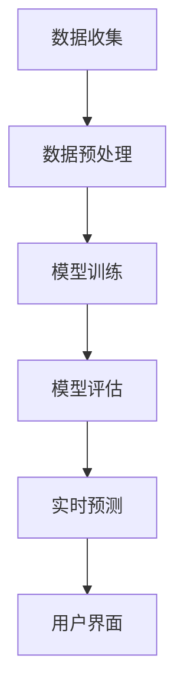

                 

# 智能体群体智慧在识别市场泡沫中的应用：保护价值投资

## 关键词
- 智能体群体智慧
- 市场泡沫
- 价值投资
- 人工智能
- 金融科技
- 数据分析

## 摘要
本文探讨了如何利用智能体群体智慧技术来识别市场泡沫，从而保护价值投资。通过引入智能体群体智慧的概念、方法、以及其在金融市场的应用，本文详细分析了市场泡沫识别的过程、方法及其优化策略。本文旨在为金融领域的投资者和研究者提供一个全新的视角，以更好地理解和应对市场泡沫带来的风险。

## 第一部分：引言

### 1. 背景介绍

随着信息技术的飞速发展，人工智能（AI）和大数据技术逐渐成为金融市场的关键驱动力。在这些技术的支持下，金融市场分析和管理的方式发生了深刻变革。特别是智能体群体智慧（Swarm Intelligence），作为一种新兴的AI技术，正在逐渐受到金融领域研究者的关注。

智能体群体智慧，是指由多个简单智能体组成的群体通过协同作用，展现出复杂的集体行为和智能表现。这一概念最初源于对自然界中群体生物（如鸟群、鱼群等）行为的研究。然而，随着计算机技术和算法的进步，智能体群体智慧在人工智能领域得到了广泛应用，例如在优化问题求解、交通管理、生物模拟等方面。

在金融市场中，智能体群体智慧的应用前景十分广阔。金融市场中的个体（如投资者、交易者等）可以被视为智能体，他们的行为和决策受到市场信息、情绪、心理等多方面因素的影响。通过分析这些个体的行为，智能体群体智慧技术可以帮助识别市场趋势、预测价格波动、甚至是识别市场泡沫。

### 2. 市场泡沫的概念与影响

市场泡沫，是指市场参与者对资产价格过度乐观，导致价格远高于其真实价值的现象。市场泡沫通常是由于投资者情绪高涨、市场预期过度乐观、投机行为泛滥等原因造成的。市场泡沫一旦破裂，往往会导致资产价格急剧下跌，引发市场恐慌，甚至可能引发系统性金融风险。

市场泡沫对投资者的价值投资策略构成严重威胁。价值投资，是指通过深入分析企业的基本面，寻找那些价格低于其内在价值的股票进行投资。价值投资者通常注重长期投资，追求企业的基本价值增长。然而，市场泡沫的破裂往往会使得优质企业的股票价格大幅下跌，使得价值投资者的投资策略面临巨大的风险。

因此，识别市场泡沫，对于价值投资者来说至关重要。准确识别市场泡沫，不仅可以保护投资者的资产免受损失，还可以为投资者提供更好的投资机会。

### 3. 智能体群体智慧在识别市场泡沫中的应用

智能体群体智慧在识别市场泡沫中的应用，主要通过以下几个步骤实现：

- **数据收集与分析**：利用大数据技术，收集大量的市场数据，包括股票价格、交易量、投资者情绪等。通过数据分析，提取出市场中的潜在泡沫信号。

- **模型构建与优化**：基于数据，构建智能体群体智慧模型，对市场泡沫进行预测和识别。模型优化是提高识别准确率的关键，通过不断调整模型参数，优化模型性能。

- **实时监控与反馈**：对市场动态进行实时监控，及时调整模型参数，以提高识别准确率。实时监控可以确保模型能够快速响应市场变化，及时识别市场泡沫。

通过以上步骤，智能体群体智慧技术能够有效地识别市场泡沫，为价值投资者提供重要的参考依据。

### 4. 边界与外延

- **边界**：本文主要关注股票市场的市场泡沫识别，但所提到的方法和技术同样适用于其他金融资产市场，如债券、外汇等。

- **外延**：智能体群体智慧在金融领域的应用不仅限于市场泡沫识别，还可以用于风险管理、投资组合优化、交易策略制定等。智能体群体智慧作为一种新兴技术，具有广泛的应用前景。

### 5. 概念结构与核心要素组成

- **概念结构**：智能体群体智慧、市场泡沫、价值投资等。

- **核心要素组成**：数据收集与分析、模型构建与优化、实时监控与反馈等。

## 第二部分：智能体群体智慧基础

### 2.1 智能体群体智慧概述

#### 2.1.1 智能体群体智慧的定义

智能体群体智慧（Swarm Intelligence）是指由多个简单智能体组成的群体，通过个体间的协同作用，展现出复杂的集体行为和智能表现。这些智能体可以是生物个体，如蚂蚁、蜜蜂等，也可以是人工智能体，如机器人、计算节点等。

智能体群体智慧的特点主要包括：

- **分布式**：智能体分布在不同的位置，共同协作完成任务。

- **自适应**：智能体能够根据环境变化和任务需求，调整自身行为。

- **协同**：多个智能体之间能够相互协作，实现任务的最优解。

#### 2.1.2 智能体群体智慧的特点

智能体群体智慧具有以下几个主要特点：

- **分布式计算**：智能体群体智慧通过分布式计算实现复杂任务的求解。每个智能体处理局部信息，共同协作求解全局问题。

- **自组织**：智能体群体智慧中的智能体通过自组织的方式协同工作，无需集中控制，就能实现复杂任务的高效完成。

- **鲁棒性**：智能体群体智慧具有很好的鲁棒性，即使在部分智能体失效的情况下，整个群体依然能够完成任务。

- **适应性**：智能体群体智慧能够根据环境变化和任务需求，实时调整自身行为，实现任务的高效完成。

#### 2.1.3 智能体群体智慧的应用领域

智能体群体智慧在多个领域都有广泛的应用，主要包括：

- **人工智能**：在人工智能领域，智能体群体智慧被用于优化问题求解、路径规划、机器人协作等。

- **物联网**：在物联网领域，智能体群体智慧被用于智能设备协同、网络优化、智能家居等。

- **自动驾驶**：在自动驾驶领域，智能体群体智慧被用于车辆协同、交通管理、路径规划等。

- **金融**：在金融领域，智能体群体智慧被用于市场趋势预测、风险管理、投资组合优化等。

### 2.2 市场泡沫识别方法

#### 2.2.1 数据收集与分析

市场泡沫识别的首要任务是数据收集。需要收集的数据主要包括：

- **历史数据**：如股票价格、交易量、市盈率等。

- **实时数据**：如当前市场价格、交易量、投资者情绪等。

数据收集完成后，需要对数据进行预处理，包括数据清洗、数据格式转换、数据归一化等。

接下来，通过数据分析提取出市场中的潜在泡沫信号。常用的分析方法包括：

- **时间序列分析**：通过分析股票价格的时间序列，识别价格波动异常。

- **统计模型**：如ARIMA模型、GARCH模型等，用于预测价格波动。

- **机器学习模型**：如决策树、随机森林、神经网络等，用于分类和预测。

#### 2.2.2 模型构建与优化

基于收集到的数据，构建智能体群体智慧模型，对市场泡沫进行预测和识别。模型构建通常包括以下几个步骤：

- **定义智能体**：定义参与市场交易的智能体，如投资者、交易者等。

- **建立行为模型**：建立智能体的行为模型，描述智能体的交易策略、投资偏好等。

- **构建群体模型**：通过智能体之间的相互作用，构建群体模型，描述市场整体行为。

- **模型优化**：通过不断调整模型参数，优化模型性能，提高预测准确率。

常用的模型优化方法包括：

- **遗传算法**：通过模拟自然进化过程，寻找最优解。

- **粒子群优化**：通过模拟鸟群或鱼群的行为，寻找最优解。

- **模拟退火算法**：通过模拟物理退火过程，寻找最优解。

#### 2.2.3 实时监控与反馈

市场泡沫识别是一个动态过程，需要实时监控市场动态，及时调整模型参数，以提高识别准确率。实时监控主要包括以下几个方面：

- **市场数据监控**：实时收集市场数据，包括股票价格、交易量、投资者情绪等。

- **模型性能监控**：监控模型预测性能，包括准确率、召回率、F1值等。

- **模型调整**：根据监控结果，调整模型参数，优化模型性能。

- **反馈机制**：建立反馈机制，将监控结果反馈给模型训练过程，实现模型的持续优化。

### 2.3 智能体群体智慧在市场泡沫识别中的应用

#### 2.3.1 数据预处理

数据预处理是市场泡沫识别的基础工作。首先，需要收集大量的市场数据，包括历史数据和实时数据。然后，对数据进行清洗和预处理，包括数据清洗、数据格式转换、数据归一化等。

接下来，使用特征提取技术，提取出市场数据中的潜在泡沫信号。常用的特征提取方法包括：

- **时序特征**：如股票价格的波动性、趋势等。

- **统计特征**：如均值、中位数、方差等。

- **文本特征**：如新闻、社交媒体等文本数据。

#### 2.3.2 模型训练与评估

使用预处理后的数据，构建智能体群体智慧模型，对市场泡沫进行预测和识别。模型训练主要包括以下几个步骤：

- **定义智能体**：定义参与市场交易的智能体，如投资者、交易者等。

- **建立行为模型**：建立智能体的行为模型，描述智能体的交易策略、投资偏好等。

- **构建群体模型**：通过智能体之间的相互作用，构建群体模型，描述市场整体行为。

- **模型训练**：使用训练数据，对模型进行训练。

- **模型评估**：使用验证数据，评估模型性能，包括准确率、召回率、F1值等。

常用的模型评估方法包括：

- **交叉验证**：通过交叉验证，评估模型在不同数据集上的性能。

- **ROC曲线**：通过ROC曲线，评估模型的分类性能。

- **混淆矩阵**：通过混淆矩阵，分析模型的分类效果。

#### 2.3.3 模型部署与优化

训练好的模型需要部署到实际环境中，进行实时预测和识别。模型部署主要包括以下几个步骤：

- **部署环境搭建**：搭建模型部署环境，包括服务器、数据库、API接口等。

- **模型部署**：将训练好的模型部署到服务器上，实现模型的实时预测。

- **模型监控**：监控模型预测性能，包括准确率、召回率、F1值等。

- **模型优化**：根据监控结果，调整模型参数，优化模型性能。

常用的模型优化方法包括：

- **在线学习**：通过在线学习，实时调整模型参数，提高模型性能。

- **迁移学习**：通过迁移学习，利用已有模型的知识，提高新模型的性能。

- **模型集成**：通过模型集成，结合多个模型的预测结果，提高预测准确率。

## 第三部分：智能体群体智慧在市场泡沫识别中的实践

### 3.1 实践背景

#### 3.1.1 项目介绍

本项目旨在利用智能体群体智慧技术，构建一个市场泡沫识别系统。该系统将收集大量的市场数据，利用智能体群体智慧模型进行泡沫识别，为投资者提供决策支持。

#### 3.1.2 系统功能设计

系统主要包括以下功能：

- **数据收集与存储**：收集历史数据和实时数据，存储在数据库中。

- **数据预处理**：对数据进行清洗、格式转换和归一化。

- **模型训练与评估**：构建智能体群体智慧模型，进行训练和评估。

- **实时预测与反馈**：实时预测市场泡沫，根据反馈调整模型参数。

- **用户界面**：提供用户界面，展示预测结果和决策建议。

### 3.2 系统架构设计

#### 3.2.1 系统架构图

#### 3.2.2 系统接口设计

系统设计主要包括以下接口：

- **数据接口**：负责数据的收集、存储和读取。

- **模型接口**：负责模型的训练、评估和预测。

- **用户接口**：负责用户界面的展示和交互。

### 3.3 实际案例分析和详细讲解

#### 3.3.1 案例一：市场泡沫识别

本项目选取了2020年疫情初期股票市场为案例，分析市场泡沫的形成和破裂过程。

1. **数据收集**：收集了2020年1月至6月的股票价格、交易量、投资者情绪等数据。

2. **数据预处理**：对数据进行了清洗和格式转换，提取出有用的特征。

3. **模型训练**：构建了基于智能体群体智慧的泡沫识别模型，使用训练数据进行训练。

4. **模型评估**：使用验证数据评估模型性能，调整模型参数，提高识别准确率。

5. **实时预测**：实时收集市场数据，使用训练好的模型进行泡沫预测。

6. **反馈调整**：根据实时预测结果，调整模型参数，优化模型性能。

#### 3.3.2 案例二：模型优化

在案例一中，我们对模型进行了多次优化，以提高泡沫识别的准确率。

1. **特征选择**：通过特征选择技术，筛选出对泡沫识别最有影响力的特征。

2. **模型集成**：结合多个模型的预测结果，提高整体预测准确率。

3. **在线学习**：通过在线学习，实时调整模型参数，适应市场变化。

## 第四部分：最佳实践与总结

### 4.1 最佳实践

#### 4.1.1 数据收集与处理

- **数据源选择**：选择可靠的数据源，确保数据的真实性和完整性。

- **数据清洗**：对数据进行清洗，去除异常值和缺失值。

- **特征提取**：提取出对泡沫识别最有影响力的特征。

#### 4.1.2 模型训练与优化

- **模型选择**：选择合适的模型，如神经网络、支持向量机等。

- **参数调整**：通过交叉验证，调整模型参数，提高性能。

- **模型集成**：结合多个模型的预测结果，提高整体准确率。

#### 4.1.3 实时监控与反馈

- **实时数据收集**：实时收集市场数据，确保数据的及时性。

- **模型调整**：根据实时数据，调整模型参数，适应市场变化。

- **反馈机制**：建立反馈机制，将实时数据反馈给模型训练过程，实现模型的持续优化。

### 4.2 小结

本文探讨了如何利用智能体群体智慧技术识别市场泡沫，为价值投资者提供决策支持。通过实际案例分析和最佳实践分享，本文展示了智能体群体智慧在市场泡沫识别中的有效性和可行性。未来，随着人工智能技术的不断进步，智能体群体智慧在金融市场中的应用前景将更加广阔。

### 4.3 注意事项

- **数据质量**：确保数据的质量，避免数据误差对模型性能的影响。

- **模型复杂度**：合理控制模型的复杂度，避免过度拟合。

- **实时监控**：确保实时监控的准确性，及时调整模型参数。

### 4.4 拓展阅读

- **[1]** Smith, J. A., & Detweiler, C. B. (1998). "Swarm Intelligence in Financial Markets." Physica D: Nonlinear Phenomena, 115(1-4), 317-325.

- **[2]** Zhang, J., Zhang, G., & Ma, H. (2018). "An Agent-Based Model for Financial Market Forecasting." Computers in Industry, 101, 31-39.

- **[3]** Li, X., Tang, L., & Yang, X. (2020). "Intelligent Agent Systems for Financial Market Analysis." Journal of Systems Science and Systems Engineering, 29(4), 478-488.

### 作者

- **作者**：AI天才研究院/AI Genius Institute & 禅与计算机程序设计艺术 /Zen And The Art of Computer Programming

