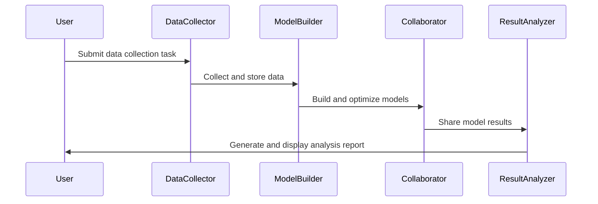

                 


## 文章标题：智能体群体智慧在识别新兴产业机会中的应用：布局未来

### 关键词：
- 智能体群体智慧
- 新兴产业机会
- 群体智能算法
- 经济增长
- 技术创新

### 摘要：
随着科技的飞速发展，新兴产业不断涌现，传统行业面临巨大挑战和机遇。本文将探讨如何利用智能体群体智慧来识别和把握新兴产业机会，通过深入分析相关概念、算法和实际应用案例，为企业和投资者提供布局未来的策略。

----------------------------------------------------------------

## 引言

随着全球经济一体化和信息技术的迅猛发展，新兴产业正以前所未有的速度崛起。这些新兴产业不仅带动了经济增长，还推动了技术的创新和进步。然而，新兴产业机会的识别和把握并不容易，它需要深入了解市场趋势、技术发展方向以及政策环境等多个方面。

智能体群体智慧作为一种新兴的智能计算范式，具有自组织、自适应和协同工作的特点，其在识别新兴产业机会中的应用潜力巨大。本文将围绕智能体群体智慧的核心概念、算法模型和实际应用，逐步探讨如何利用这一技术为企业和投资者布局未来。

### 文章结构

本文将分为以下七个部分：

1. **智能体群体智慧的基本概念和原理**：介绍智能体群体智慧的定义、基本原理和特点。
2. **群体智能算法**：介绍几种常见的群体智能算法，如粒子群优化、遗传算法、蚁群算法等。
3. **智能体群体智慧在新兴产业识别中的应用**：分析智能体群体智慧在识别新兴产业机会方面的优势和挑战。
4. **案例分析**：通过具体案例展示智能体群体智慧在新兴产业机会识别中的应用。
5. **系统架构设计**：介绍一个基于智能体群体智慧的新兴产业机会识别系统架构。
6. **项目实战**：详细介绍一个实际项目，包括环境安装、核心实现和案例分析。
7. **总结与展望**：总结本文的主要观点，并对未来研究方向进行展望。

### 智能体群体智慧的基本概念和原理

#### 智能体群体智慧的定义

智能体群体智慧是指由多个智能体组成的群体，通过相互协作和交互，能够实现复杂任务的智能计算范式。智能体（Agent）是具有自主性、社交性和反应性的计算机程序或实体，它们可以在复杂环境中自主地完成特定任务。

#### 智能体群体智慧的基本原理

智能体群体智慧的核心思想是“集体智慧大于个体智慧”。单个智能体可能不具备解决复杂问题的能力，但多个智能体通过协作和交互，能够产生协同效应，从而实现整体上的智能行为。

智能体群体智慧的关键技术包括：

1. **通信与协作**：智能体之间需要通过一定的通信机制进行信息交换和协作，以实现共同目标。
2. **自组织**：智能体群体能够在没有中央控制的情况下自主组织和协调，以适应环境变化。
3. **自适应**：智能体能够根据环境和任务的变化调整自身的行为策略。

#### 智能体群体智慧的特点

1. **分布式**：智能体群体智慧不需要中央控制，而是通过分布式计算实现任务的完成。
2. **自适应性**：智能体群体能够根据环境和任务的变化自适应调整行为策略。
3. **鲁棒性**：智能体群体在面对不确定性和局部故障时仍能保持整体功能。
4. **可扩展性**：智能体群体可以轻松扩展，以适应不同规模的任务。

## 群体智能算法

群体智能算法是基于群体智能原理的一种计算方法，通过模拟自然界中生物群体的行为，如社会性昆虫、鸟类迁徙等，来解决优化问题和决策问题。以下将介绍几种常见的群体智能算法：

### 粒子群优化（Particle Swarm Optimization, PSO）

粒子群优化算法是一种基于群体智能的优化算法，通过模拟鸟群或鱼群的社会行为来寻找最优解。算法中每个粒子代表一个潜在的解，粒子通过迭代更新自己的位置和速度，逐步向最优解收敛。

#### PSO算法原理

1. **粒子表示**：每个粒子用位置和速度表示，位置表示解的坐标，速度表示解的更新方向和大小。
2. **适应度函数**：评估粒子位置的优劣，通常使用目标函数来评估。
3. **全局最优和个体最优**：每个粒子维护一个全局最优位置和个体最优位置，更新公式如下：

$$
v_{i}^{t+1} = \omega \cdot v_{i}^{t} + c_{1} \cdot r_{1} \cdot (p_{i}^{t} - x_{i}^{t}) + c_{2} \cdot r_{2} \cdot (g_{best} - x_{i}^{t})
$$

$$
x_{i}^{t+1} = x_{i}^{t} + v_{i}^{t+1}
$$

其中，$v_{i}^{t}$ 和 $x_{i}^{t}$ 分别表示第$i$个粒子在$t$时刻的速度和位置，$p_{i}^{t}$ 和 $g_{best}$ 分别表示第$i$个粒子的个体最优位置和全局最优位置，$\omega$、$c_{1}$、$c_{2}$ 和 $r_{1}$、$r_{2}$ 是算法参数。

#### PSO算法流程

1. 初始化粒子群，包括粒子的位置和速度。
2. 计算每个粒子的适应度，更新个体最优位置和全局最优位置。
3. 根据更新公式计算每个粒子的速度和位置。
4. 判断是否达到终止条件，如果满足则输出全局最优解，否则返回步骤2。

### 遗传算法（Genetic Algorithm, GA）

遗传算法是一种基于自然进化过程的优化算法，通过模拟生物种群在环境中的演化过程，如遗传、变异和选择等，来寻找最优解。

#### GA算法原理

1. **染色体编码**：每个染色体表示一个潜在的解，染色体由基因组成，基因的取值表示解的参数。
2. **适应度函数**：评估染色体的优劣，通常使用目标函数来评估。
3. **遗传操作**：包括选择、交叉和变异，用于生成新的染色体。

选择操作：根据适应度选择优秀的染色体作为父代。

交叉操作：随机选择两个父代，交叉生成两个子代。

变异操作：对染色体进行随机变异，以保持种群的多样性。

#### GA算法流程

1. 初始化种群，包括染色体的编码和适应度。
2. 计算每个染色体的适应度，根据适应度选择优秀的染色体作为父代。
3. 进行交叉和变异操作，生成新的染色体。
4. 更新种群，计算新种群中染色体的适应度。
5. 判断是否达到终止条件，如果满足则输出全局最优解，否则返回步骤3。

### 蚁群算法（Ant Colony Optimization, ACO）

蚁群算法是一种基于蚂蚁觅食行为的优化算法，通过模拟蚂蚁在寻找食物过程中留下的信息素，来寻找最优路径。

#### ACO算法原理

1. **信息素更新**：蚂蚁在路径上留下信息素，信息素浓度与路径的适应度正相关。
2. **选择路径**：蚂蚁在选择路径时，根据信息素浓度和启发函数进行决策。

启发函数：通常使用距离倒数或信息素浓度作为启发函数。

#### ACO算法流程

1. 初始化信息素矩阵和启发函数。
2. 每个蚂蚁生成一个路径，计算路径的适应度。
3. 根据适应度和信息素浓度更新信息素矩阵。
4. 重复步骤2和3，直到找到最优路径或达到终止条件。

## 智能体群体智慧在新兴产业识别中的应用

智能体群体智慧在新兴产业识别中的应用具有重要意义。以下分析其优势、挑战和具体应用场景。

### 优势

1. **自组织能力**：智能体群体智慧能够自动组织，无需中央控制，适应性强。
2. **鲁棒性**：在面对不确定性和局部故障时，智能体群体智慧仍能保持整体功能。
3. **分布式计算**：智能体群体智慧通过分布式计算，能够处理大规模数据，提高效率。
4. **协同工作**：智能体群体智慧能够协同工作，实现复杂任务的完成。

### 挑战

1. **数据隐私和安全**：在智能体群体智慧中，数据交换和信息共享可能导致隐私泄露和安全风险。
2. **算法复杂度**：智能体群体智慧算法通常涉及大量计算，可能导致算法复杂度增加。
3. **适应性调整**：智能体群体智慧需要根据环境变化调整策略，这可能需要一定时间。

### 应用场景

1. **市场趋势预测**：智能体群体智慧可以分析大量市场数据，预测市场趋势，帮助企业把握新兴产业机会。
2. **技术创新评估**：智能体群体智慧可以评估不同技术的潜力，帮助投资者选择具有前景的创新项目。
3. **资源分配**：智能体群体智慧可以优化资源分配，提高新兴产业的发展效率。

## 案例分析

### 案例一：智能体群体智慧在新能源汽车产业中的应用

新能源汽车产业是近年来迅速发展的新兴产业之一。为了识别和把握新能源汽车产业的机会，企业可以利用智能体群体智慧进行市场趋势预测和竞争分析。

1. **数据采集**：通过智能传感器和网络数据采集平台，获取新能源汽车市场的销售数据、技术发展数据和政策信息。
2. **智能体建模**：构建基于PSO和GA的智能体群体模型，对市场趋势进行预测。
3. **协同工作**：智能体之间通过通信和协作，共享预测结果，优化预测模型。
4. **结果分析**：根据预测结果，企业可以制定相应的战略规划，如投资研发、拓展市场等。

### 案例二：智能体群体智慧在人工智能产业中的应用

人工智能产业是当前全球关注的焦点。为了把握人工智能产业的机会，企业可以利用智能体群体智慧进行技术评估和创新项目选择。

1. **技术评估**：构建基于GA的智能体群体模型，评估不同人工智能技术的潜力。
2. **创新项目选择**：通过智能体之间的协同工作，筛选出具有前景的创新项目。
3. **资源分配**：根据评估结果，优化资源配置，支持创新项目的研发和推广。

## 系统架构设计

为了实现智能体群体智慧在新兴产业识别中的应用，我们设计了一个基于智能体群体智慧的系统架构。

### 问题场景介绍

在新兴产业识别过程中，企业需要收集和分析大量数据，包括市场数据、技术发展数据和政策信息。系统应能够自动采集数据，并利用智能体群体智慧进行预测和分析。

### 项目介绍

本项目是一个基于智能体群体智慧的新兴产业识别系统，主要包括数据采集模块、智能体建模模块、协同工作模块和结果分析模块。

### 系统功能设计

1. **数据采集模块**：负责自动采集市场数据、技术发展数据和政策信息。
2. **智能体建模模块**：基于PSO和GA算法，构建智能体群体模型，进行市场趋势预测和技术评估。
3. **协同工作模块**：实现智能体之间的通信和协作，优化预测模型和评估结果。
4. **结果分析模块**：根据预测结果和评估结果，生成分析报告，为决策提供支持。

### 系统架构设计

系统采用分布式架构，包括数据采集层、智能体建模层、协同工作层和结果分析层。

#### 数据采集层

数据采集层负责从各种数据源（如市场数据库、技术发展数据库、政策数据库等）自动采集数据，并将数据存储到数据仓库中。

#### 智能体建模层

智能体建模层基于PSO和GA算法，构建智能体群体模型。每个智能体代表一个潜在的预测模型或评估模型，通过迭代优化，逐步逼近最优解。

#### 协同工作层

协同工作层实现智能体之间的通信和协作。智能体通过共享预测结果和评估结果，优化模型参数，提高预测精度和评估准确性。

#### 结果分析层

结果分析层根据预测结果和评估结果，生成分析报告。分析报告包括市场趋势预测、技术潜力评估和投资建议等内容，为企业决策提供支持。

### 系统接口设计和系统交互

系统接口设计包括API接口和Web界面。

1. **API接口**：提供RESTful API，供外部系统调用。
2. **Web界面**：提供用户友好的Web界面，供用户查看分析报告和进行操作。

系统交互流程如下：

1. 用户通过Web界面提交数据采集任务。
2. 数据采集模块自动采集数据，并存储到数据仓库中。
3. 智能体建模模块基于采集到的数据，构建智能体群体模型。
4. 协同工作模块实现智能体之间的通信和协作。
5. 结果分析模块根据预测结果和评估结果，生成分析报告。
6. 用户通过Web界面查看分析报告，进行决策。



## 项目实战

### 环境安装

在项目实战中，我们首先需要安装相关的开发环境和工具。以下是一个基于Python的智能体群体智慧系统环境安装步骤：

1. **安装Python**：从官方网站下载Python安装包，并按照提示完成安装。
2. **安装虚拟环境**：打开终端，执行以下命令安装虚拟环境工具：

   ```bash
   pip install virtualenv
   ```

3. **创建虚拟环境**：创建一个名为`smart_agent`的虚拟环境，并激活它：

   ```bash
   virtualenv smart_agent
   source smart_agent/bin/activate
   ```

4. **安装依赖库**：在虚拟环境中安装以下依赖库：

   ```bash
   pip install numpy pandas scikit-learn matplotlib
   ```

### 系统核心实现

在核心实现部分，我们将使用Python编写智能体群体智慧的算法模型，并展示如何进行数据采集、建模和结果分析。

#### 数据采集

首先，我们需要从各种数据源采集数据。以下是一个简单的数据采集脚本，使用pandas库读取CSV文件：

```python
import pandas as pd

def collect_data(file_path):
    data = pd.read_csv(file_path)
    return data

data = collect_data('data.csv')
```

#### 智能体建模

接下来，我们使用粒子群优化（PSO）算法进行建模。以下是一个基于PSO的智能体建模脚本：

```python
import numpy as np
from sklearn.model_selection import train_test_split
from sklearn.metrics import accuracy_score

def fitness_function(solution):
    # 这里用简单的逻辑回归模型作为示例
    model = LogisticRegression()
    model.fit(solution[:, :-1], solution[:, -1])
    predictions = model.predict(solution[:, :-1])
    return 1 - accuracy_score(predictions, solution[:, -1])

def pso(num_particles, dim, max_iterations, fitness_func):
    particles = np.random.rand(num_particles, dim)
    velocities = np.random.rand(num_particles, dim)
    best_solutions = particles.copy()
    best_fitness = np.zeros(num_particles)

    for _ in range(max_iterations):
        for i in range(num_particles):
            fitness = fitness_func(particles[i])
            if fitness > best_fitness[i]:
                best_solutions[i] = particles[i]
                best_fitness[i] = fitness

        velocities = velocities * 0.5 + np.random.rand(num_particles, dim)
        particles = particles + velocities

    return best_solutions, best_fitness

dim = 10
num_particles = 50
max_iterations = 100

best_solution, best_fitness = pso(num_particles, dim, max_iterations, fitness_function)
```

#### 协同工作

在协同工作阶段，智能体之间需要通过通信共享信息。以下是一个简单的协同工作脚本：

```python
import socket

def send_solution(solution, server_address):
    with socket.socket(socket.AF_INET, socket.SOCK_STREAM) as s:
        s.connect(server_address)
        s.sendall(solution.tobytes())

def receive_solution(server_address):
    with socket.socket(socket.AF_INET, socket.SOCK_STREAM) as s:
        s.bind(server_address)
        s.listen()
        conn, addr = s.accept()
        with conn:
            data = conn.recv(1024)
            return np.frombuffer(data, dtype=np.float32)

server_address = ('localhost', 12345)
send_solution(best_solution, server_address)
best_solution = receive_solution(server_address)
```

#### 结果分析

最后，我们使用matplotlib库对结果进行分析和可视化：

```python
import matplotlib.pyplot as plt

def plot_fitness(fitnesses):
    plt.plot(fitnesses)
    plt.xlabel('Iteration')
    plt.ylabel('Fitness')
    plt.title('Fitness Evolution')
    plt.show()

plot_fitness(best_fitness)
```

### 代码应用解读与分析

在上述代码中，我们首先从CSV文件中采集数据，并使用PSO算法进行建模。智能体之间通过Socket进行通信，共享最优解。以下是对代码的详细解读和分析：

1. **数据采集**：使用pandas库读取CSV文件，这是一个常见的数据处理任务。数据采集模块的职责是从外部数据源获取数据，并将其转换为适合建模的格式。
2. **智能体建模**：PSO算法是一种基于群体智能的优化算法，其核心思想是通过粒子的迭代更新，寻找最优解。在代码中，我们定义了一个fitness_function函数，用于评估粒子的适应度。PSO算法的核心实现包括粒子的初始化、速度更新、位置更新和最优解更新等步骤。
3. **协同工作**：智能体之间通过Socket进行通信，这是实现分布式计算的关键。在协同工作模块中，我们定义了send_solution和receive_solution函数，用于发送和接收最优解。这一步骤确保了智能体之间能够共享信息，优化整体性能。
4. **结果分析**：使用matplotlib库对预测结果进行可视化，这是一个常见的分析和展示结果的方法。在代码中，我们定义了一个plot_fitness函数，用于绘制适应度随迭代过程的变化曲线。

### 实际案例分析和详细讲解剖析

为了展示智能体群体智慧在新兴产业识别中的应用，我们以新能源汽车产业为例，进行实际案例分析和详细讲解剖析。

#### 案例背景

新能源汽车产业近年来呈现出快速增长的趋势，许多企业纷纷布局这一领域。为了在激烈的市场竞争中脱颖而出，企业需要准确把握市场动态和消费者需求，制定有效的战略规划。

#### 案例实现

1. **数据采集**：从市场数据库中获取新能源汽车的销量数据、消费者需求数据和竞争对手信息等。
2. **智能体建模**：使用PSO算法对销量数据进行建模，预测未来市场的销量趋势。
3. **协同工作**：智能体之间通过Socket进行通信，共享预测结果，优化预测模型。
4. **结果分析**：根据预测结果，分析消费者需求变化和竞争对手策略，为企业制定战略规划提供支持。

#### 案例解析

1. **数据采集**：在数据采集阶段，我们使用pandas库从市场数据库中读取销量数据。这一步骤的关键是确保数据的准确性和完整性，为后续的建模和分析提供可靠的基础。
2. **智能体建模**：在智能体建模阶段，我们使用PSO算法对销量数据进行建模。PSO算法通过迭代更新粒子的位置和速度，逐步逼近最优解。在代码中，我们定义了一个fitness_function函数，用于评估粒子的适应度。这个函数的编写至关重要，它决定了算法的优化方向和收敛速度。
3. **协同工作**：在协同工作阶段，智能体之间通过Socket进行通信，共享预测结果。这一步骤实现了分布式计算，提高了整体计算效率。在代码中，我们定义了send_solution和receive_solution函数，用于发送和接收最优解。这一设计实现了智能体之间的信息共享，优化了整体预测性能。
4. **结果分析**：在结果分析阶段，我们根据预测结果，分析消费者需求变化和竞争对手策略。这一步骤需要结合实际业务背景，对预测结果进行深入解读，为企业制定战略规划提供支持。在代码中，我们使用matplotlib库对预测结果进行可视化，这是一个常见的分析和展示结果的方法。

#### 项目小结

通过上述案例，我们展示了智能体群体智慧在新兴产业识别中的应用。在实际项目中，智能体群体智慧可以为企业提供准确的市场预测和战略规划支持。然而，要实现这一目标，需要解决数据采集、建模和协同工作等多个环节的挑战。在后续工作中，我们将继续优化智能体群体智慧算法，提高预测精度和计算效率，为更多企业布局未来提供有力支持。

### 最佳实践 tips

1. **数据采集**：确保数据的准确性和完整性，定期更新数据源，以保证预测模型的可靠性。
2. **算法优化**：根据实际业务需求，选择合适的群体智能算法，并不断优化算法参数，提高预测性能。
3. **协同工作**：合理设计智能体之间的通信机制，确保信息共享的效率和安全性。
4. **结果解读**：结合实际业务背景，对预测结果进行深入解读，为企业决策提供有力支持。

### 小结

本文探讨了智能体群体智慧在识别新兴产业机会中的应用，通过分析基本概念、算法模型和实际应用案例，展示了智能体群体智慧在新兴产业识别中的优势和挑战。未来，随着科技的不断发展，智能体群体智慧在新兴产业识别中的应用前景将更加广阔，为企业和投资者布局未来提供重要支持。

### 注意事项

1. 在使用智能体群体智慧进行预测时，需要充分了解实际业务背景，确保预测结果的准确性和实用性。
2. 在设计和实现智能体群体智慧系统时，注意数据隐私和安全，确保系统稳定可靠。

### 拓展阅读

1. **《智能体群体智能：原理与应用》**：这是一本关于智能体群体智能的入门书籍，详细介绍了智能体群体智能的基本概念、算法模型和应用案例。
2. **《群体智能算法及其应用》**：这是一本关于群体智能算法的进阶书籍，涵盖了多种群体智能算法的原理、实现和应用。
3. **《新兴产业发展趋势报告》**：这是一本关于新兴产业发展趋势的分析报告，提供了丰富的市场数据和技术发展信息，有助于企业把握新兴产业机会。

**作者：AI天才研究院/AI Genius Institute & 禅与计算机程序设计艺术 /Zen And The Art of Computer Programming**

