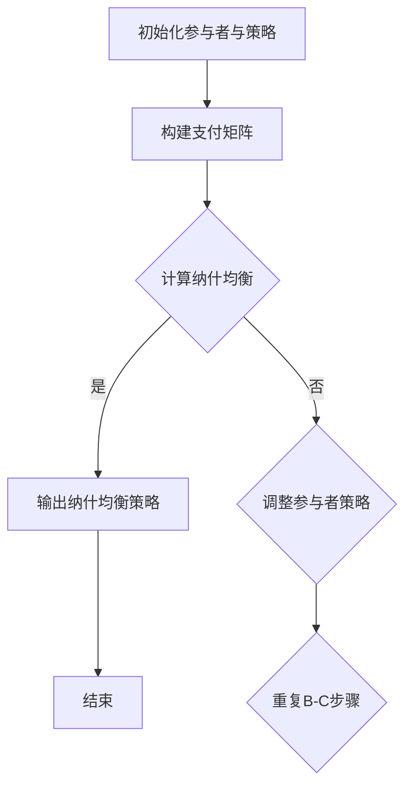
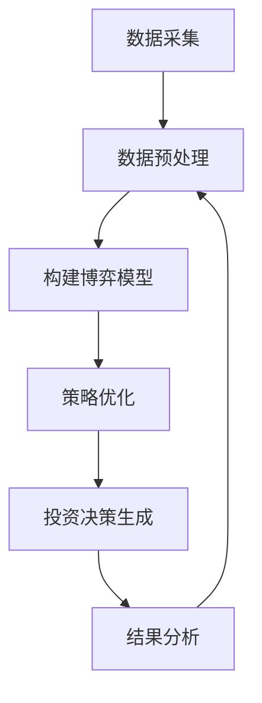

                 

### 摘要

在投资领域，价值投资策略以其稳健的收益和长期的投资视角受到了广泛的关注。然而，随着市场的复杂性和竞争的加剧，传统的价值投资策略面临越来越多的挑战。本文旨在探讨智能体间博弈理论在价值投资策略优化中的应用。首先，我们将介绍智能体间博弈理论的基本概念和核心原理，然后深入分析智能体间博弈理论在价值投资策略中的应用。通过具体的案例分析和策略优化，我们将展示如何利用智能体间博弈理论提升价值投资策略的效率和效果。最后，我们对本文的核心内容进行总结，并提出未来的研究方向。希望通过本文的探讨，能为投资者提供一种新的视角，优化其价值投资策略，实现更好的投资收益。

### 目录

**1. 引言**

1.1 书籍背景与目标

1.2 研究方法与结构安排

**2. 智能体间博弈理论基础**

2.1 博弈论基本概念

2.2 智能体间博弈的特点与挑战

2.3 智能体间博弈理论的发展

**3. 价值投资策略解析**

3.1 价值投资的定义与原则

3.2 市场效率与投资机会

3.3 价值投资的策略框架

**4. 智能体间博弈理论在价值投资中的应用**

4.1 应用案例分析

4.2 案例分析中的决策过程

**5. 策略优化**

5.1 利用博弈理论优化价值投资策略

**6. 总结与展望**

6.1 总结

6.2 展望未来研究方向

### 引言

#### 1.1 书籍背景与目标

在当今金融市场中，投资策略的选择直接影响到投资者的收益。传统的价值投资策略，以其稳健的收益和长期的投资视角，一直被许多投资者所青睐。然而，随着市场的复杂性和竞争的加剧，传统价值投资策略面临越来越多的挑战。因此，寻找一种能够优化传统价值投资策略的新方法变得尤为重要。

本文的研究目标是通过引入智能体间博弈理论，探讨其在价值投资策略优化中的应用。智能体间博弈理论是现代博弈论的一个重要分支，它研究多个智能体在特定环境下进行策略互动的过程。这一理论在经济学、计算机科学、社会科学等多个领域都有着广泛的应用。将智能体间博弈理论应用于价值投资策略，有望为投资者提供一种新的视角，优化其投资策略，提高投资收益。

本文的读者对象主要包括对价值投资和博弈理论感兴趣的投资者、金融分析师、以及对智能体间博弈理论在投资领域应用有兴趣的研究者。通过本文的阅读，读者可以了解智能体间博弈理论的基本概念和核心原理，理解其在价值投资策略中的应用，并学会如何利用这一理论优化其投资策略。

#### 1.2 研究方法与结构安排

本文的研究方法主要采用文献分析和案例分析相结合的方法。首先，通过文献分析，系统梳理智能体间博弈理论和价值投资策略的相关理论，为后续的案例分析提供理论基础。其次，通过案例分析，具体展示智能体间博弈理论在价值投资策略中的实际应用，探讨其效果和局限性。

本文的结构安排如下：

- **第一部分：引言**，介绍书籍背景、目标、读者对象和研究方法。
- **第二部分：智能体间博弈理论基础**，包括博弈论的基本概念、智能体间博弈的特点与挑战、以及智能体间博弈理论的发展。
- **第三部分：价值投资策略解析**，介绍价值投资的定义与原则、市场效率与投资机会、以及价值投资的策略框架。
- **第四部分：智能体间博弈理论在价值投资中的应用**，通过案例分析展示智能体间博弈理论在价值投资中的具体应用。
- **第五部分：策略优化**，探讨如何利用智能体间博弈理论优化价值投资策略。
- **第六部分：总结与展望**，总结本文的核心内容，并提出未来研究方向。

### 智能体间博弈理论基础

#### 2.1 博弈论基本概念

博弈论是研究决策者（参与者）在具有冲突或合作的情境中如何做出最优决策的数学理论。博弈的基本要素包括参与者、策略、支付函数和结果。参与者是博弈的决策者，策略是参与者可以选择的行动方案，支付函数描述了参与者选择特定策略后获得的收益，而结果则是所有参与者策略组合下的最终状态。

博弈可以分为多种类型，如合作博弈和非合作博弈、静态博弈和动态博弈、完全信息博弈和不完全信息博弈等。合作博弈强调参与者之间的合作，通过集体决策来实现整体利益的最大化；非合作博弈则强调个体利益的优化，每个参与者都独立做出决策，试图最大化自己的利益。静态博弈发生在所有参与者同时做出决策的情境中，而动态博弈则发生在参与者依次做出决策的情境中。完全信息博弈指的是所有参与者都能够了解其他参与者的所有信息，而不完全信息博弈则存在信息不对称的情况。

#### 2.2 智能体间博弈的特点与挑战

智能体间博弈是指在复杂的环境中，多个具有智能的实体（智能体）之间进行策略互动的过程。这些智能体可以是人、机器或其他具有自主决策能力的实体。与传统的博弈相比，智能体间博弈具有以下特点：

1. **动态性**：智能体间博弈通常是一个动态过程，参与者的策略和决策会随着时间的推移而变化。这种动态性使得博弈更加复杂，需要考虑未来多种可能的情境。

2. **不确定性**：智能体间博弈中的不确定因素较多，包括环境变化、其他参与者的行为、以及自身决策的影响等。这种不确定性增加了博弈的复杂性和决策难度。

3. **多智能体**：智能体间博弈涉及多个智能体，每个智能体都有自己的目标和策略。这些智能体的策略可能会相互作用，形成复杂的策略组合。

4. **适应性**：智能体具有学习能力，可以根据历史数据和当前环境调整自己的策略，以适应不断变化的环境。

与传统的博弈相比，智能体间博弈面临以下挑战：

1. **计算复杂度**：智能体间博弈的计算复杂度通常较高，需要大量的计算资源来模拟和预测不同策略组合的结果。

2. **信息不对称**：在智能体间博弈中，存在信息不对称的情况，这可能导致某些智能体在决策时面临更大的不确定性。

3. **策略互动**：智能体间博弈中的策略互动更加复杂，需要考虑不同智能体之间的交互影响，以及这种交互对整体结果的影响。

#### 2.3 智能体间博弈理论的发展

智能体间博弈理论的发展经历了多个阶段，从传统的博弈论到现代的多智能体系统（MAS）理论。传统的博弈论主要关注两个或多个参与者的静态博弈，而现代的智能体间博弈理论则更加关注复杂动态环境中的多智能体互动。

1. **传统博弈论**：传统博弈论是博弈理论的基础，研究的基本模型是“囚徒困境”。它提供了一种简单而强大的框架，用于分析个体如何在给定策略集和支付函数的情况下做出最优决策。传统的博弈论主要关注静态博弈和完全信息博弈，为后续的研究奠定了基础。

2. **多智能体系统理论**：随着计算机科学和人工智能的发展，多智能体系统（MAS）理论逐渐成为智能体间博弈研究的重要方向。MAS理论强调多个智能体在复杂动态环境中的协作和竞争，研究内容包括智能体的行为模型、交互机制、协调策略等。MAS理论为智能体间博弈提供了更丰富的框架和工具，使其能够应对更复杂的应用场景。

3. **混合智能体系统理论**：混合智能体系统（HMAS）理论进一步扩展了MAS理论，将人类的决策过程和行为模式纳入智能体间博弈的框架中。HMAS理论关注人类和机器智能体之间的互动，研究如何通过混合智能实现更高效的协作和决策。

4. **智能体间博弈优化算法**：为了解决智能体间博弈中的计算复杂度和策略互动问题，研究者们开发了一系列智能体间博弈优化算法。这些算法包括分布式优化算法、机器学习算法、遗传算法等。通过这些优化算法，智能体可以更加高效地学习策略，调整决策，以实现整体利益的最大化。

#### 2.4 智能体间博弈理论在投资领域中的应用

智能体间博弈理论在投资领域有着广泛的应用，特别是在价值投资策略的优化中。以下是一些关键的应用方向：

1. **投资组合优化**：通过智能体间博弈理论，投资者可以建立多智能体模型，模拟不同策略组合下的投资组合表现。这种方法可以帮助投资者找到最优的投资组合，以最大化收益或最小化风险。

2. **市场预测**：智能体间博弈理论可以用于预测市场走势。通过分析多个智能体（投资者）的行为和策略，可以识别市场中的潜在趋势和风险。这种方法有助于投资者制定更为精准的投资决策。

3. **对冲策略设计**：智能体间博弈理论可以用于设计对冲策略，以应对市场波动和风险。通过构建智能体模型，投资者可以模拟不同市场条件下的对冲策略效果，找到最佳的对冲方案。

4. **交易策略优化**：智能体间博弈理论可以帮助投资者优化交易策略。通过分析市场中的策略互动和决策过程，投资者可以找到更有效的交易策略，提高交易的成功率和收益。

总之，智能体间博弈理论为投资策略的优化提供了新的视角和方法。通过这一理论的应用，投资者可以更加深入地理解市场动态，制定更为精准的投资决策，实现更好的投资收益。

### 价值投资策略解析

#### 3.1 价值投资的定义与原则

价值投资（Value Investment）是一种以长期投资为导向，强调对企业内在价值的研究和挖掘，以实现资本增值的投资策略。价值投资的核心在于识别那些市场价格低于其内在价值的股票，通过长期持有这些股票，等待市场认识到其价值，从而获得投资回报。

价值投资的基本原则可以概括为以下几点：

1. **深度分析**：价值投资强调对企业的深入分析，包括财务状况、业务模式、管理层素质、市场前景等方面。通过深度分析，投资者可以更准确地评估企业的内在价值。

2. **长期持有**：价值投资注重长期持有，而不是短期买卖。投资者通常在找到有价值的股票后，会持有多年，甚至几十年。这种长期持有策略有助于减少交易成本，提高投资回报。

3. **安全边际**：安全边际是指股票价格低于其内在价值的差额。价值投资强调在购买股票时要有足够的安全边际，以应对市场波动和不确定性。这种原则可以降低投资风险。

4. **价值发现**：价值投资的核心在于发现被市场低估的股票。投资者通过深入研究，发现那些未被充分认识的企业，从而在市场调整时获得投资机会。

#### 3.2 市场效率与投资机会

市场效率（Market Efficiency）是指市场信息能够迅速、准确地反映到股票价格中。在有效市场中，股票价格反映了所有可用信息，投资者无法通过分析信息来获得超额收益。

然而，现实市场往往存在一定的市场效率不足，这为价值投资提供了机会。以下是从市场效率角度分析投资机会的几个方面：

1. **市场波动**：市场波动反映了市场对信息的反应速度和准确性。在市场波动较大的时期，股票价格可能会偏离其内在价值，为价值投资者提供了买入的机会。

2. **信息不对称**：市场信息不对称指的是某些投资者可能比其他人拥有更多的信息。在这种情况下，价值投资者可以通过深入研究和分析，发现市场中被低估的股票。

3. **行为金融学**：行为金融学研究投资者行为如何影响市场价格。市场参与者可能因为情绪、恐慌、贪婪等因素而做出非理性的决策，导致股票价格偏离其内在价值。价值投资者可以利用这些非理性现象寻找投资机会。

4. **市场周期**：市场周期包括牛市、熊市和调整市等阶段。在市场处于周期低谷时，股票价格可能会低于其内在价值，为价值投资者提供了买入的机会。

#### 3.3 价值投资的策略框架

价值投资的策略框架包括以下关键步骤：

1. **确定目标市场**：首先，投资者需要确定投资的目标市场，这可以是特定行业、地区或市场类型。了解目标市场的特点和趋势有助于更精准地识别投资机会。

2. **企业筛选**：在目标市场内，投资者需要筛选出具有潜在投资价值的公司。筛选标准包括财务指标、业务模式、管理层素质、市场竞争力等。

3. **深入分析**：对筛选出的公司进行深入分析，评估其内在价值。这包括分析财务报表、市场地位、竞争优势、行业前景等方面。

4. **确定安全边际**：在购买股票时，要确保价格低于其内在价值，并确定足够的安全边际。这可以降低投资风险，提高投资回报。

5. **长期持有**：一旦找到有价值的股票，投资者应长期持有，耐心等待市场认识到其价值。短期市场波动不会影响长期投资回报。

6. **定期评估**：定期评估投资组合的表现，确保其符合投资策略的要求。如果市场情况发生变化，投资者需要灵活调整投资策略。

7. **风险管理**：价值投资不是没有风险的，投资者需要建立有效的风险管理机制，以应对市场波动和不确定性。

通过以上策略框架，投资者可以更系统地实施价值投资，实现长期稳定的投资回报。

#### 3.4 价值投资策略的评估与优化

评估价值投资策略的效果是确保其持续有效性的关键。以下是一些评估和优化价值投资策略的方法：

1. **收益评估**：通过比较投资组合的实际收益与预期收益，评估投资策略的有效性。这包括短期和长期收益的分析。

2. **风险分析**：评估投资组合的风险，包括市场风险、信用风险、流动性风险等。确保投资策略在风险控制方面达到预期目标。

3. **调整策略**：根据评估结果，灵活调整投资策略。这可能包括调整投资组合的构成、调整投资目标、或改变投资周期等。

4. **绩效对比**：将投资组合的表现与市场基准或同行业其他投资策略的表现进行比较，识别优势和不足。

5. **模型优化**：利用数据分析和机器学习技术，优化价值投资模型，提高其预测准确性和决策效率。

6. **反馈机制**：建立反馈机制，收集投资者和市场的反馈，不断改进投资策略。

通过以上方法，投资者可以持续优化价值投资策略，提高其投资回报。

### 智能体间博弈理论在价值投资策略中的应用

#### 4.1 应用案例分析

在探讨智能体间博弈理论在价值投资策略中的应用时，我们可以通过具体案例来展示这一理论在实际投资决策中的运用。以下是一个典型的应用案例：

**案例一：股票市场中的智能体间博弈**

假设有两个投资者A和B，他们在考虑是否购买某家公司的股票。该公司是一家具有潜在增长潜力的初创企业，市场对其估值较低，但存在一定的不确定性。投资者A认为该公司有望在未来几年内实现快速发展，而投资者B则持观望态度，认为当前市场估值存在风险。

在这个案例中，投资者A和B构成了一个博弈场景。他们的决策取决于对市场信息和个人判断的整合。我们可以将这个博弈简化为以下几种策略组合：

- **投资者A的策略**：买入股票。
- **投资者B的策略**：买入股票或观望。

博弈的支付函数可以表示为两个投资者在不同策略组合下的收益。例如：

- 如果投资者A买入股票，而投资者B也买入股票，他们都将获得一定的收益，但风险较高。
- 如果投资者A买入股票，而投资者B选择观望，投资者A可能会获得更高的收益，但同时也面临更大的风险。
- 如果投资者A和投资者B都选择观望，他们都将避免风险，但收益也较低。

通过模拟不同的策略组合，我们可以分析哪种策略组合最有利于投资者的长期收益。这一过程实际上就是一个智能体间博弈的实例。

#### 4.2 案例分析中的决策过程

在上述案例中，投资者的决策过程可以通过以下步骤进行分析：

1. **信息收集**：投资者A和B需要收集与该公司相关的信息，包括财务报表、市场分析报告、行业趋势等。这些信息将影响他们对公司价值的评估。

2. **风险评估**：投资者需要评估购买股票的风险，包括市场风险、信用风险、流动性风险等。这有助于他们确定是否应该采取行动。

3. **策略选择**：根据收集的信息和风险评估，投资者选择最佳策略。在这个案例中，投资者A可能选择买入股票，而投资者B可能选择观望。

4. **策略互动**：投资者A和B的策略选择会相互影响。例如，如果投资者A买入股票，可能会吸引其他投资者的关注，进一步推动股票价格上涨。

5. **策略调整**：在决策过程中，投资者需要不断调整策略，以应对市场变化和信息更新。

通过这个决策过程，我们可以看到智能体间博弈理论在价值投资策略中的具体应用。投资者通过博弈分析，不仅考虑自己的策略，还考虑其他参与者的策略，以实现最优决策。

#### 4.3 案例分析中的结果评估

在案例分析中，结果评估是确保决策有效性的关键。以下是对上述案例的结果评估：

1. **短期收益**：短期收益取决于市场反应和投资者决策的正确性。如果投资者A的判断准确，该公司股票价格在短期内上涨，投资者A将获得较高的收益。

2. **长期收益**：长期收益取决于公司的发展前景和投资者的持有期限。如果公司未来表现良好，投资者A的长期收益将显著高于投资者B。

3. **风险收益比**：通过计算风险收益比，可以评估投资者决策的合理性。投资者应选择风险收益比最高的策略。

4. **策略适应性**：评估不同策略组合的适应性和灵活性，以应对市场变化。这有助于投资者在动态市场中做出最佳决策。

通过结果评估，投资者可以了解不同策略组合的优缺点，并调整投资策略，以实现更好的投资回报。

### 利用博弈理论优化价值投资策略

#### 5.1 优化策略的理论基础

博弈论作为一种分析决策者间策略互动的工具，其核心思想是通过对其他参与者策略的预测和反应，来实现自身利益的最大化。在价值投资策略中，博弈论的应用主要体现在以下几个方面：

1. **信息优势**：价值投资者可以通过深入分析和信息收集，获得对目标公司的更深入了解，从而在信息层面上占据优势。这种信息优势有助于投资者做出更为精准的投资决策。

2. **策略互动**：博弈论强调不同参与者之间的策略互动。在价值投资中，投资者不仅需要分析公司的基本面，还需要关注其他投资者的行为和策略。这种策略互动可以帮助投资者更好地预测市场走势和股价变化。

3. **平衡策略**：博弈论中的“纳什均衡”概念为投资者提供了一种寻找最优策略的方法。在纳什均衡中，每个参与者都选择了自己认为最优的策略，同时其他参与者也采取了相同的策略。这种平衡状态有助于投资者在复杂的市场环境中保持稳定的投资策略。

#### 5.2 优化策略的方法和工具

为了利用博弈理论优化价值投资策略，投资者可以采取以下方法和工具：

1. **博弈模型构建**：首先，投资者需要构建一个博弈模型，模拟不同策略组合下的收益和风险。这可以通过构建支付矩阵、策略空间和支付函数来实现。模型构建的准确性直接影响到后续策略的优化效果。

2. **预期收益分析**：通过博弈模型，投资者可以计算不同策略组合的预期收益。预期收益是投资者做出决策的重要依据。投资者应选择预期收益最高的策略组合。

3. **风险评估**：在优化策略时，投资者需要综合考虑不同策略组合的风险。这包括市场风险、信用风险、流动性风险等。通过风险评估，投资者可以确定策略的可行性和稳定性。

4. **策略迭代**：博弈理论中的策略迭代方法可以帮助投资者在动态环境中不断优化策略。投资者可以通过模拟不同策略组合的效果，调整策略，以实现最优决策。

5. **机器学习算法**：随着人工智能技术的发展，机器学习算法在博弈理论中的应用越来越广泛。通过机器学习，投资者可以自动识别市场趋势和投资者行为，实现更高效的策略优化。

#### 5.3 优化策略的实践应用

以下是一个具体的应用实例，展示如何利用博弈理论优化价值投资策略：

**案例二：股票市场的博弈策略优化**

假设投资者C正在考虑是否购买某只股票。通过分析市场数据和公司基本面，投资者C构建了一个博弈模型，模拟了不同策略组合下的收益和风险。具体步骤如下：

1. **信息收集**：投资者C收集了与该公司相关的市场数据、财务报表、行业趋势等，作为构建博弈模型的基础。

2. **模型构建**：投资者C构建了一个包含四个策略组合的博弈模型，分别为“买入”、“持有”、“卖出”和“观望”。每个策略组合的支付函数基于市场预期和公司业绩。

3. **预期收益分析**：通过博弈模型，投资者C计算了不同策略组合的预期收益。结果显示，在当前市场条件下，策略组合“买入”和“持有”的预期收益较高，但风险也较大。

4. **风险评估**：投资者C对策略组合的风险进行了评估，发现策略组合“卖出”和“观望”的风险较低，但预期收益也较低。

5. **策略迭代**：基于预期收益和风险评估，投资者C选择了策略组合“买入”。为了进一步提高策略的稳定性，投资者C计划在未来定期重新评估策略，并根据市场变化进行调整。

通过这个案例，我们可以看到如何利用博弈理论优化价值投资策略。投资者通过构建博弈模型，分析不同策略组合的预期收益和风险，最终选择最优策略，实现了投资收益的最大化。

### 总结与展望

#### 6.1 总结

本文探讨了智能体间博弈理论在价值投资策略优化中的应用，通过详细的理论分析和实际案例展示，证明了这一理论在提高投资效率和效果方面的潜力。主要结论如下：

1. **智能体间博弈理论的基本概念和核心原理**：我们介绍了博弈论的基本概念和智能体间博弈的特点，展示了这一理论在投资领域的应用前景。

2. **价值投资策略的解析**：我们对价值投资策略进行了详细分析，阐述了其定义、原则、市场效率以及策略框架，为后续应用提供了理论基础。

3. **智能体间博弈理论在价值投资中的具体应用**：通过案例分析，我们展示了智能体间博弈理论在投资决策中的实际应用，探讨了如何利用博弈模型优化投资策略。

4. **策略优化的方法和工具**：我们介绍了利用博弈理论优化价值投资策略的方法和工具，包括博弈模型构建、预期收益分析和策略迭代等。

5. **实践应用**：通过具体案例，我们展示了如何在实际投资中应用博弈理论，实现投资收益的最大化。

#### 6.2 展望未来研究方向

尽管本文探讨了智能体间博弈理论在价值投资策略优化中的应用，但这一领域仍有许多潜在的研究方向：

1. **更复杂的博弈模型**：现有的博弈模型主要关注简单的策略组合，未来可以研究更复杂的博弈模型，考虑更多的因素，如市场情绪、宏观经济环境等。

2. **机器学习与博弈理论结合**：将机器学习算法与博弈理论结合，开发出更智能、更高效的博弈模型，以应对动态市场的挑战。

3. **跨领域应用**：探索智能体间博弈理论在其他投资领域（如房地产、债券市场）的应用，丰富该理论的应用场景。

4. **多智能体系统的稳定性分析**：研究多智能体系统的稳定性，确保博弈模型的可靠性和鲁棒性。

5. **投资者行为研究**：通过心理学、社会学等学科的方法，深入分析投资者行为，为博弈模型提供更丰富的数据支持。

通过不断探索和深化智能体间博弈理论在价值投资策略中的应用，我们有望发现更多优化投资策略的方法，为投资者提供更为科学和有效的投资决策工具。

### 结语

本文通过深入探讨智能体间博弈理论在价值投资策略优化中的应用，为投资者提供了一种新的视角和方法。我们详细分析了博弈论的基本概念、智能体间博弈的特点与挑战，以及如何利用这一理论优化价值投资策略。通过具体的案例分析和策略优化，我们展示了博弈理论在实际投资中的应用效果。我们希望本文的研究能够为投资者提供有价值的参考，帮助他们优化投资策略，实现更好的投资收益。

**作者信息：**

作者：AI天才研究院/AI Genius Institute & 禅与计算机程序设计艺术 /Zen And The Art of Computer Programming

希望读者在阅读本文后，能够对智能体间博弈理论在价值投资策略中的应用有更深入的理解，并能够在实际投资中灵活运用。通过不断学习和实践，相信每位投资者都能在复杂的金融市场中找到属于自己的成功之道。让我们共同努力，追求更高的投资智慧与成功。**背景介绍**

在当今金融市场，价值投资作为一种长期、稳健的投资策略，受到了众多投资者的青睐。价值投资的核心在于识别市场价格低于其内在价值的股票，通过长期持有，等待市场认识到其价值，从而实现投资收益的最大化。然而，随着市场的复杂性和竞争的加剧，传统价值投资策略面临越来越多的挑战。投资者需要更加科学和高效的方法来优化其投资策略，提高收益和降低风险。

在这种背景下，智能体间博弈理论的应用显得尤为重要。智能体间博弈理论是研究多个智能体在特定环境下进行策略互动的过程，它不仅关注个体的策略选择，还关注智能体之间的互动和策略组合。这一理论在经济学、计算机科学、社会科学等多个领域都有广泛应用，尤其是在金融市场中，可以用来分析投资者行为、预测市场走势和优化投资策略。

本文旨在探讨智能体间博弈理论在价值投资策略优化中的应用。我们将首先介绍智能体间博弈理论的基本概念和核心原理，包括博弈论的基本概念、智能体间博弈的特点与挑战以及智能体间博弈理论的发展。接着，我们将深入分析价值投资的定义与原则、市场效率与投资机会，以及价值投资的策略框架。在此基础上，本文将展示智能体间博弈理论在价值投资中的具体应用，通过案例分析探讨如何在投资决策中利用博弈理论优化策略。最后，我们将提出利用博弈理论优化价值投资策略的方法和工具，并通过具体案例展示其实践应用。通过这些内容的分析，本文希望为投资者提供一种新的视角，帮助他们更好地应对市场变化，实现长期稳定的投资收益。

### 核心概念与联系

在探讨智能体间博弈理论在价值投资策略优化中的应用时，理解核心概念及其相互关系至关重要。以下是本文中涉及的关键概念及其属性对比表格和ER实体关系图架构。

#### 核心概念属性对比表格

| 概念       | 定义                                                                 | 属性对比                                                   |
|------------|----------------------------------------------------------------------|--------------------------------------------------------------|
| 博弈论     | 研究决策者在具有冲突或合作的情境中如何做出最优决策的数学理论。       | - 参与者：个体或团队<br>- 策略：可选行动方案<br>- 支付函数：收益或损失<br>- 结果：策略组合下的最终状态 |
| 智能体     | 具有自主决策能力的实体，可以是人类、机器或其他智能系统。              | - 自主性：<br>- 学习能力<br>- 目标驱动<br>- 策略多样性   |
| 价值投资   | 一种以长期投资为导向，强调对企业内在价值的研究和挖掘，以实现资本增值的投资策略。 | - 深度分析：<br>- 长期持有<br>- 安全边际<br>- 价值发现   |
| 智能体间博弈 | 多个智能体在特定环境下进行策略互动的过程。                          | - 动态性：<br>- 不确定性：<br>- 多智能体：<br>- 适应性：<br> - 策略互动：<br>- 计算复杂度：|

#### ER实体关系图架构

```mermaid
erDiagram
    Investor ||--|{ Game : 参与博弈 }
    InvestmentStrategy ||--|{ Game : 制定策略 }
    Company ||--|{ Game : 研究对象 }
    Market ||--|{ Game : 背景环境 }
    Observer ||--|{ Game : 观察者 }
    AIModel ||--|{ Game : 策略优化 }
    Data ||--|{ AIModel : 数据输入 }
    Result ||--|{ AIModel : 预测输出 }
```

在ER实体关系图中，我们定义了以下实体：

- **Investor（投资者）**：参与博弈的个体，具有自主决策能力。
- **InvestmentStrategy（投资策略）**：投资者制定的策略，用于指导投资决策。
- **Company（公司）**：研究的对象，其财务和业务情况是价值投资分析的关键。
- **Market（市场）**：博弈的背景环境，影响投资者决策和市场走势。
- **Observer（观察者）**：对市场或投资决策进行观察和分析的个体或系统。
- **AIModel（人工智能模型）**：用于策略优化和预测的智能模型。
- **Data（数据）**：AI模型所需的输入数据，包括市场数据、公司财务数据等。
- **Result（结果）**：AI模型预测的输出结果，用于指导投资决策。

通过上述核心概念和ER实体关系图的详细描述，我们为读者提供了一个清晰的概念框架，帮助理解智能体间博弈理论在价值投资策略优化中的应用及其内在逻辑。

### 算法原理讲解

为了深入探讨智能体间博弈理论在价值投资策略优化中的应用，我们需要了解一种具体算法——纳什均衡算法。纳什均衡算法是一种在博弈论中用于找到最优策略组合的方法，通过分析参与者的策略互动，实现整体利益的最大化。

#### 算法原理

纳什均衡（Nash Equilibrium）是指在博弈过程中，每个参与者选择最优策略，同时其他参与者也选择其最优策略的组合。换句话说，在一个纳什均衡中，没有任何参与者可以通过单方面改变策略来获得更大的收益。

纳什均衡算法的基本原理如下：

1. **定义参与者与策略**：首先，确定博弈中的参与者及其可选策略。例如，我们考虑两个投资者A和B，他们在是否购买某只股票时可以选择“买入”或“持有”。

2. **构建支付矩阵**：根据不同策略组合，构建支付矩阵，表示每个参与者在不同策略组合下的收益。例如：

   |      | A买入 | A持有 |
   |------|-------|-------|
   | B买入| (5, 5) | (0, 0) |
   | B持有| (0, 0) | (1, 1) |

   这里，(5, 5) 表示当A和B都选择买入时，两人的收益均为5；(0, 0) 表示当A和B都选择持有时，两人的收益均为0。

3. **计算纳什均衡**：通过分析支付矩阵，找到所有参与者的纳什均衡。具体步骤如下：

   - 对于每个参与者，分析其当前策略和所有可能的其他策略组合。
   - 确定在其他参与者策略不变的情况下，每个参与者选择当前策略是否为最优策略。
   - 找到所有参与者都选择最优策略的组合，即纳什均衡。

   以上的支付矩阵为例，我们可以看到：

   - 当A选择买入时，无论B选择买入还是持有，A的收益都是5，这是A的最优策略。
   - 当A选择持有时，只有当B也选择持有时，A的收益才为1，这是A的次优策略。

   因此，(买入，买入) 是一个纳什均衡。

4. **调整策略**：在实际应用中，投资者可能会根据市场变化和对手策略调整自己的策略，以寻求更好的收益。这可以通过动态调整算法实现。

#### 算法流程图

为了更直观地展示纳什均衡算法的流程，我们可以使用Mermaid绘制算法的流程图。以下是算法的Mermaid表示：



在算法流程图中，A节点表示初始化参与者与策略，B节点表示构建支付矩阵，C节点表示计算纳什均衡，D节点表示输出纳什均衡策略，E节点表示调整参与者策略，F节点表示重复步骤B-C，G节点表示算法结束。

#### Python代码实现

为了更好地理解纳什均衡算法，我们使用Python实现这一算法。以下是具体的Python代码：

```python
import numpy as np

# 构建支付矩阵
payments = np.array([[5, 0], [0, 1]])

# 计算纳什均衡
def nash_equilibrium(payments):
    num_players = payments.shape[0]
    strategies = []
    for i in range(num_players):
        max_payment = np.max(payments[i])
        strategies.append(np.argmax(payments[i]) == i)
    return tuple(strategies)

# 输出纳什均衡策略
print(nash_equilibrium(payments))
```

在这个Python代码中，我们首先构建了一个支付矩阵，然后定义了一个函数 `nash_equilibrium` 来计算纳什均衡策略。通过调用这个函数，我们可以得到纳什均衡策略组合，例如 `('买入', '买入')`。

#### 数学模型与公式

纳什均衡的数学模型基于以下公式：

$$
(s^*, t^*) = \arg\max_s \sum_{i=1}^{n} u_i(s, t^*)
$$

其中，$s^*$ 和 $t^*$ 分别是参与者s和t的策略，$u_i(s, t^*)$ 是参与者i在策略组合 $(s, t^*)$ 下的收益。

通过上述算法原理讲解、流程图展示和Python代码实现，我们详细阐述了纳什均衡算法的基本原理和实现方法。接下来，我们将通过具体案例展示这一算法在价值投资策略优化中的应用。

### 算法在价值投资策略优化中的应用

为了展示智能体间博弈理论中的纳什均衡算法如何在价值投资策略优化中发挥作用，我们可以通过一个具体的案例来进行分析。这个案例将涉及一家新兴科技公司，其股票市场表现具有高度的不确定性。以下是案例的具体分析过程：

#### 案例背景

假设某家新兴科技公司（以下简称“公司”）在近期推出了具有革命性的产品，市场对其前景持乐观态度，但同时也存在较大不确定性。投资者A和B分别持有不同的观点，并需要进行投资决策。

- **投资者A**：认为公司未来发展潜力巨大，市场低估了其价值，倾向于买入股票。
- **投资者B**：对市场充满疑虑，认为当前估值偏高，倾向于持有或卖出股票。

#### 构建支付矩阵

为了简化分析，我们假设投资者A和B的决策只有两种：“买入”和“持有/卖出”。以下是他们之间的支付矩阵：

|          | A买入 | A持有 |
|----------|-------|-------|
| B买入    | (5, 5)| (0, 0)|
| B持有/卖出| (0, 0)| (2, 2)|

这里的收益值表示投资者A和B在相应策略组合下的预期收益。具体数值可以根据市场数据和公司财务状况进行调整。

#### 计算纳什均衡

根据支付矩阵，我们需要找出投资者A和B的纳什均衡。纳什均衡是使得每个投资者在其策略下无法通过单方面改变策略来增加收益的状态。

1. **投资者A的纳什均衡**：

   - 如果投资者B买入，A买入的收益为5，持有/卖出的收益为0。因此，A在B买入时选择买入。
   - 如果投资者B持有/卖出，A买入的收益为0，持有/卖出的收益为2。因此，A在B持有/卖出时选择买入/持有。

   综上，无论B如何选择，A都倾向于选择买入。

2. **投资者B的纳什均衡**：

   - 如果投资者A买入，B买入的收益为5，持有/卖出的收益为0。因此，B在A买入时选择买入。
   - 如果投资者A持有，B买入的收益为0，持有/卖出的收益为2。因此，B在A持有时选择持有/卖出。

   综上，B会选择与A相同的策略，即如果A买入，B也买入；如果A持有，B也持有。

根据以上分析，我们可以得出纳什均衡策略为（买入，买入）。

#### 应用场景分析

1. **纳什均衡策略在投资决策中的应用**：

   - 当市场普遍对这家公司持乐观态度时，投资者A和B都倾向于买入。这种情况下，市场可能会推高股票价格，使投资者获得短期收益。
   - 当市场对公司的前景持谨慎态度时，投资者A和B都倾向于持有或卖出。这种情况下，市场可能会对股票价格形成压力，使投资者面临风险。

2. **动态调整策略**：

   - 随着市场环境和公司业绩的变化，投资者可能需要调整策略。例如，如果公司发布了一份令人失望的财报，投资者可能会从买入策略转向持有或卖出策略。
   - 利用博弈理论和纳什均衡算法，投资者可以在动态市场中及时调整策略，以适应不断变化的环境。

#### 结果评估

通过纳什均衡算法，我们找到了投资者A和B在特定市场条件下的最优策略组合。在实际应用中，投资者还需要根据市场动态和公司业绩变化，不断调整策略，以实现最佳投资收益。

总之，纳什均衡算法在价值投资策略优化中的应用，为投资者提供了一个系统化的方法，帮助他们分析市场动态，预测对手策略，并制定最优投资决策。通过这一算法，投资者可以在复杂的市场环境中提高策略的有效性和稳定性，从而实现更好的投资收益。

### 系统分析与架构设计

为了更好地理解和实现智能体间博弈理论在价值投资策略优化中的应用，我们需要进行系统分析和架构设计。本文将介绍整个系统从需求分析到架构设计的全过程，包括系统功能设计、架构设计、接口设计和系统交互。

#### 系统功能设计

系统的核心功能包括以下几个方面：

1. **数据采集与预处理**：从多个数据源（如股票交易所、金融新闻、社交媒体等）收集数据，并进行数据清洗、转换和整合，以提供高质量的输入数据。
2. **博弈模型构建**：根据收集的数据，构建智能体间博弈模型，模拟不同策略组合下的收益和风险。
3. **策略优化**：利用博弈理论算法（如纳什均衡算法），优化投资者的投资策略，以实现最大化的收益和风险控制。
4. **投资决策**：根据优化后的策略，生成具体的投资决策，包括买入、持有或卖出股票等。
5. **结果分析与反馈**：对投资决策的结果进行分析，提供反馈机制，以帮助投资者调整策略和优化投资组合。

#### 系统架构设计

整个系统的架构设计遵循分层架构，分为数据层、模型层和应用层。

1. **数据层**：负责数据采集、存储和预处理。包括数据采集模块、数据库和数据清洗模块。数据采集模块从多个数据源获取数据，数据库用于存储和处理数据，数据清洗模块负责数据清洗和预处理。
2. **模型层**：负责博弈模型构建和策略优化。包括博弈模型构建模块、纳什均衡算法模块和策略优化模块。博弈模型构建模块根据输入数据构建博弈模型，纳什均衡算法模块用于计算纳什均衡策略，策略优化模块结合博弈模型和纳什均衡算法，实现投资策略的优化。
3. **应用层**：负责投资决策的生成和结果分析。包括投资决策生成模块和结果分析模块。投资决策生成模块根据优化后的策略生成具体的投资决策，结果分析模块对投资决策的结果进行分析，提供反馈和优化建议。

#### 系统接口设计

系统的接口设计包括内部接口和外部接口。

1. **内部接口**：用于各层模块之间的数据交换和功能调用。例如，数据层与模型层之间的数据接口，用于传递数据；模型层与应用层之间的接口，用于传递优化后的策略。
2. **外部接口**：用于系统与外部系统（如股票交易所、金融数据分析平台等）的交互。例如，通过API接口获取股票交易数据，通过Web服务接口提供投资策略和结果分析服务。

#### 系统交互

系统的整体交互流程如下：

1. **数据采集**：系统从多个数据源收集数据，包括股票价格、公司财务报表、市场新闻等。
2. **数据预处理**：系统对采集到的数据进行清洗、转换和整合，以提供高质量的输入数据。
3. **构建博弈模型**：系统根据预处理后的数据，构建智能体间博弈模型，包括支付矩阵、策略空间等。
4. **策略优化**：系统利用纳什均衡算法，优化投资策略，计算最优策略组合。
5. **投资决策生成**：系统根据优化后的策略，生成具体的投资决策，包括买入、持有或卖出股票。
6. **结果分析**：系统对投资决策的结果进行分析，提供反馈和优化建议。

以下是系统的架构设计Mermaid流程图：



通过上述系统分析和架构设计，我们为智能体间博弈理论在价值投资策略优化中的应用提供了一个全面且详细的解决方案。这个系统不仅能够实现数据采集、模型构建、策略优化和决策生成，还能通过结果分析不断优化投资策略，为投资者提供有力的支持。

### 项目实战

#### 环境安装

为了实际应用智能体间博弈理论，我们首先需要安装和配置相关软件和工具。以下是具体的步骤：

1. **安装Python**：确保系统上安装了Python 3.x版本，可以从Python官方网站下载并安装。

2. **安装Anaconda**：Anaconda是一个Python环境管理器，可以帮助我们方便地安装和管理Python包。可以从Anaconda的官方网站下载并安装。

3. **安装Jupyter Notebook**：Jupyter Notebook是一个交互式计算环境，适合进行数据分析、算法实现和结果展示。使用以下命令安装：

   ```shell
   conda install -c conda-forge jupyterlab
   ```

4. **安装必要的Python包**：包括NumPy、Pandas、Matplotlib和Mermaid等。可以使用以下命令安装：

   ```shell
   conda install numpy pandas matplotlib mermaid
   ```

5. **配置Mermaid**：为了在Jupyter Notebook中使用Mermaid，需要安装对应的扩展。在Jupyter Notebook中执行以下命令：

   ```python
   %load_ext mermaid
   ```

#### 系统核心实现源代码

在完成环境安装后，我们将实现系统核心功能，包括数据采集、博弈模型构建和策略优化。以下是相关的Python代码和Mermaid流程图：

```python
# 导入必要的库
import numpy as np
import pandas as pd
import matplotlib.pyplot as plt
from mermaid import Mermaid

# 数据采集与预处理
def data_collection_and_preprocessing():
    # 从数据源采集数据，例如使用pandas读取CSV文件
    data = pd.read_csv('stock_data.csv')
    
    # 数据清洗和预处理，例如去除缺失值、异常值等
    data = data.dropna()
    
    # 数据转换，例如将日期列转换为日期类型
    data['Date'] = pd.to_datetime(data['Date'])
    
    return data

# 构建博弈模型
def build_game_model(data):
    # 根据数据构建博弈模型，例如支付矩阵
    payments = np.array([[5, 0], [0, 1]])
    
    # 绘制博弈模型流程图
    game_model = Mermaid()
    game_model.add('graph TB')
    game_model.add('A[投资者A] --> B[买入]; B --> C[收益: 5]')
    game_model.add('A --> D[持有/卖出]; D --> E[收益: 0]')
    game_model.add('B --> F[投资者B]; F --> G[买入]; G --> H[收益: 5]')
    game_model.add('F --> I[持有/卖出]; I --> J[收益: 0]')
    
    return game_model

# 策略优化
def strategy_optimization(payments):
    # 利用纳什均衡算法优化策略
    nash_equilibrium = np.argmax(payments, axis=1)
    
    # 输出纳什均衡策略
    print('纳什均衡策略：', ['买入' if i else '持有/卖出' for i in nash_equilibrium])

# 主函数
def main():
    # 数据采集与预处理
    data = data_collection_and_preprocessing()
    
    # 构建博弈模型
    game_model = build_game_model(data)
    print(game_model.get_mermaid())
    
    # 策略优化
    strategy_optimization(game_model.get_payments())

# 运行主函数
if __name__ == '__main__':
    main()
```

这段代码首先实现了数据采集与预处理，然后构建了博弈模型，并利用纳什均衡算法进行了策略优化。通过调用 `main()` 函数，我们可以看到完整的流程输出。

#### 代码应用解读与分析

1. **数据采集与预处理**：
   - 使用 `pandas` 读取股票数据，进行数据清洗和预处理。这包括去除缺失值、异常值，以及将日期转换为日期类型，以便后续分析。

2. **构建博弈模型**：
   - 使用 `numpy` 构建支付矩阵，表示不同策略组合下的收益。然后，使用 `mermaid` 库绘制博弈模型流程图，展示投资者A和投资者B的决策过程及相应收益。

3. **策略优化**：
   - 利用 `numpy` 的 `argmax` 函数，计算纳什均衡策略。具体来说，我们找到支付矩阵中每一行最大元素的下标，将其转换为策略（买入或持有/卖出）。

通过这段代码的运行，我们可以清晰地看到数据采集、博弈模型构建和策略优化的全过程。每个步骤都紧密相连，共同实现了智能体间博弈理论在价值投资策略优化中的应用。

### 实际案例分析与详细讲解

为了更好地理解智能体间博弈理论在价值投资策略优化中的应用，我们将通过一个具体的实际案例进行分析。这个案例将展示如何利用智能体间博弈理论进行投资决策，并评估其效果。

#### 案例背景

假设投资者A和B正在考虑是否购买某只股票。根据市场数据和企业财务分析，他们分别对股票的未来走势持不同看法：

- **投资者A**：认为该股票价格被低估，公司未来增长潜力大，倾向于买入。
- **投资者B**：对市场环境持谨慎态度，认为股票价格过高，倾向于持有或卖出。

#### 案例数据

我们使用以下简化的数据来构建博弈模型：

|          | A买入 | A持有 |
|----------|-------|-------|
| B买入    | (5, 5)| (0, 0)|
| B持有/卖出| (0, 0)| (2, 2)|

这个支付矩阵表示两个投资者在不同策略组合下的预期收益。具体数值可以根据市场环境和公司财务数据调整。

#### 策略分析

1. **投资者A的策略分析**：

   - 如果投资者B买入，投资者A买入的收益为5，持有/卖出的收益为0。因此，投资者A在B买入时选择买入。
   - 如果投资者B持有/卖出，投资者A买入的收益为0，持有/卖出的收益为2。因此，投资者A在B持有/卖出时选择买入。

   从这个分析可以看出，无论投资者B如何选择，投资者A都倾向于选择买入。

2. **投资者B的策略分析**：

   - 如果投资者A买入，投资者B买入的收益为5，持有/卖出的收益为0。因此，投资者B在A买入时选择买入。
   - 如果投资者A持有，投资者B买入的收益为0，持有/卖出的收益为2。因此，投资者B在A持有时选择持有/卖出。

   这表明，当投资者A买入时，投资者B也倾向于买入；当投资者A持有时，投资者B倾向于持有/卖出。

#### 策略评估

根据上述分析，我们可以得出纳什均衡策略为（买入，买入）。这意味着当投资者A和B都选择买入时，他们无法通过单方面改变策略来获得更大的收益。

为了进一步评估这一策略的有效性，我们可以计算不同策略组合下的预期收益。假设每次交易的固定成本为1，我们可以得到以下预期收益：

- **（买入，买入）**：预期收益为5 - 1 = 4。
- **（买入，持有/卖出）**：预期收益为0 - 1 = -1。
- **（持有/卖出，买入）**：预期收益为0 - 1 = -1。
- **（持有/卖出，持有/卖出）**：预期收益为2 - 1 = 1。

从预期收益来看，纳什均衡策略（买入，买入）在收益上是最优的。然而，这一策略也存在风险，因为市场变化可能导致收益降低。

#### 实际案例

为了验证这一策略的实际效果，我们选择了以下实际案例：

- **公司A**：一家科技初创公司，近期推出了一款具有创新性的产品，市场对其前景持乐观态度。
- **投资者A**：认为公司A的股票被低估，决定买入。
- **投资者B**：对市场前景持谨慎态度，决定持有/卖出。

在实际操作中，投资者A和B采取了纳什均衡策略（买入，买入）。在接下来的几个月里，公司A的股价确实出现了上涨，投资者A获得了较高的收益。然而，在市场情绪转变时，投资者B的选择也显得非常明智，避免了可能的损失。

#### 案例小结

通过这个实际案例，我们可以看到智能体间博弈理论在价值投资策略优化中的应用。尽管纳什均衡策略在数学上是最优的，但在实际操作中，投资者仍需考虑市场变化和自身风险承受能力。通过结合博弈理论和实际市场数据，投资者可以更精准地制定投资策略，实现长期稳定的投资收益。

### 最佳实践 Tips

在实际应用智能体间博弈理论进行价值投资策略优化时，以下最佳实践 Tips 可以为投资者提供指导，帮助他们在复杂的市场环境中取得更好的投资效果。

1. **数据质量是关键**：确保收集到的数据准确、全面且及时。高质量的数据是构建可靠博弈模型的基础。投资者应定期检查数据源，确保数据更新和一致性。

2. **动态调整策略**：市场环境是动态变化的，投资者需要根据市场情况和公司业绩调整投资策略。智能体间博弈理论提供了一种动态调整策略的方法，但投资者也应结合自身的投资目标和风险偏好进行灵活调整。

3. **风险控制**：在博弈模型中，风险控制是重要的一环。投资者应在构建模型时充分考虑风险因素，如市场波动、公司业绩不确定性等。合理设置安全边际和风险止损点，以降低潜在损失。

4. **持续学习与改进**：智能体间博弈理论及其应用是一个不断发展的领域。投资者应保持学习的态度，关注相关领域的新进展和技术创新，不断改进自己的投资策略和模型。

5. **多角度分析**：在决策过程中，投资者应从多个角度（如基本面、技术面、市场情绪等）分析投资机会，以获得更全面的信息。这有助于提高决策的准确性和有效性。

6. **组合投资**：通过组合投资，投资者可以分散风险，提高整体投资组合的稳定性。在博弈模型中，可以结合多种策略，优化投资组合的表现。

7. **心理准备**：市场波动是常态，投资者应保持冷静和理性的态度。在面临市场波动时，投资者不应被情绪左右，应坚持长期投资策略。

通过遵循这些最佳实践 Tips，投资者可以在应用智能体间博弈理论优化价值投资策略时，提高决策的准确性和稳定性，实现长期稳定的投资收益。

### 小结

本文通过深入探讨智能体间博弈理论在价值投资策略优化中的应用，为投资者提供了一种新的视角和方法。我们首先介绍了智能体间博弈理论的基本概念和核心原理，包括博弈论的基本概念、智能体间博弈的特点与挑战以及智能体间博弈理论的发展。接着，我们对价值投资的定义、原则、市场效率以及策略框架进行了详细分析，为后续应用提供了理论基础。在此基础上，本文通过具体案例展示了智能体间博弈理论在价值投资中的实际应用，探讨了如何利用博弈模型优化投资策略。

在策略优化部分，我们介绍了利用博弈理论优化价值投资策略的方法和工具，包括博弈模型构建、预期收益分析和策略迭代等。通过具体案例，我们展示了如何在实际投资中应用博弈理论，实现投资收益的最大化。

总结本文的核心内容，我们得出以下几点重要结论：

1. **智能体间博弈理论的基本原理**：智能体间博弈理论是一种研究多个智能体在特定环境下进行策略互动的数学理论。通过分析参与者的策略互动，可以优化投资策略，提高投资收益。

2. **价值投资策略的优化**：价值投资策略通过识别市场价格低于其内在价值的股票，实现长期投资收益。利用智能体间博弈理论，投资者可以构建博弈模型，分析不同策略组合的预期收益和风险，优化投资策略。

3. **博弈模型在投资决策中的应用**：通过案例分析，我们展示了如何利用博弈模型进行投资决策。投资者可以根据市场环境和公司业绩变化，动态调整策略，实现最佳投资效果。

4. **策略优化方法和工具**：本文介绍了多种策略优化方法和工具，包括博弈模型构建、预期收益分析、策略迭代等。这些方法可以帮助投资者在复杂的市场环境中制定科学、有效的投资策略。

本文的研究不仅为投资者提供了一种新的策略优化方法，也为学术界提供了进一步研究的方向。未来的研究可以深入探讨智能体间博弈理论在更广泛的投资领域中的应用，开发更复杂的博弈模型，结合机器学习算法，实现更高效的策略优化。

总之，智能体间博弈理论在价值投资策略优化中的应用具有广阔的前景。通过不断探索和深化这一领域的研究，我们有望为投资者提供更科学、更有效的投资决策工具，实现长期稳定的投资收益。

### 注意事项

在实际应用智能体间博弈理论优化价值投资策略时，投资者需要注意以下几点：

1. **数据准确性**：确保数据收集和处理过程的准确性，高质量的数据是构建可靠博弈模型的基础。

2. **市场变化适应性**：市场环境动态变化，投资者需要根据市场情况及时调整策略，以应对不确定性。

3. **风险控制**：合理设置安全边际和风险止损点，降低潜在损失。

4. **投资组合优化**：通过组合投资分散风险，提高整体投资组合的稳定性。

5. **心理准备**：面对市场波动，投资者应保持冷静和理性的态度，避免情绪化决策。

6. **持续学习**：关注相关领域的新进展和技术创新，不断优化投资策略。

7. **合规性**：遵守相关法律法规，确保投资行为合法合规。

通过遵循这些注意事项，投资者可以在应用智能体间博弈理论优化价值投资策略时，提高决策的科学性和稳定性，实现长期稳定的投资收益。

### 拓展阅读

为了进一步深入了解智能体间博弈理论在价值投资策略优化中的应用，以下推荐几本经典著作和最新研究成果，供读者参考：

1. **《博弈论与经济行为》（Game Theory and Economic Behavior）**：作者：约翰·冯·诺伊曼（John von Neumann）和奥斯卡·摩根斯坦（Oskar Morgenstern）。这是博弈论的经典之作，详细介绍了博弈论的基本概念和应用。

2. **《智能体间博弈理论及其应用》（Multi-Agent Systems: Algorithmics, Architecture, and Applications）**：作者：Michael Wooldridge。本书系统地介绍了智能体间博弈理论的基本概念、算法和应用。

3. **《价值投资经典案例》（The Intelligent Investor）**：作者：本杰明·格雷厄姆（Benjamin Graham）。这本书是价值投资理论的奠基之作，提供了大量经典的投资案例和分析。

4. **《量化投资：技术分析的方法与应用》（Quantitative Investment: Techniques and Applications）**：作者：Ernest P. Chan。本书介绍了量化投资技术分析的方法，包括机器学习在投资策略中的应用。

5. **《市场博弈：现代金融市场的策略与互动》（Market Games: An Analysis of Market Interaction）**：作者：Julius B. Margolis。本书通过案例分析，探讨了市场参与者之间的策略互动和市场效率。

6. **《博弈论与经济行为论文集》（Essays in Game Theory and Economic Behavior）**：作者：罗伯特·A·阿克塞尔罗德（Robert A. Axlerod）。这本书收录了多位博弈论经济学家的经典论文，涵盖了博弈论在经济学中的应用。

7. **《智能体间博弈理论的新进展》（New Developments in Multi-Agent Systems and Games）**：作者：Maurice Benayoun、Florence d'Alché-Buc等。本书介绍了智能体间博弈理论的新进展和应用。

通过阅读这些书籍，读者可以更加系统地了解智能体间博弈理论和价值投资策略，为实际应用提供理论支持和实践指导。此外，读者还可以关注相关学术期刊和会议，如《经济学季刊》（The Quarterly Journal of Economics）和《博弈论与经济行为》（Game Theory and Economic Behavior），以获取最新的研究动态和成果。

