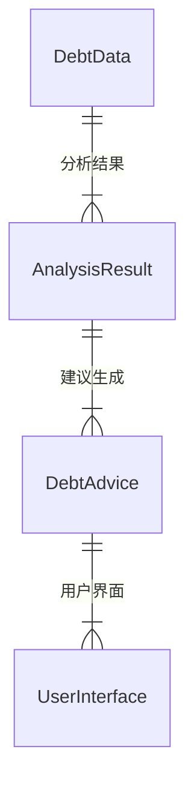
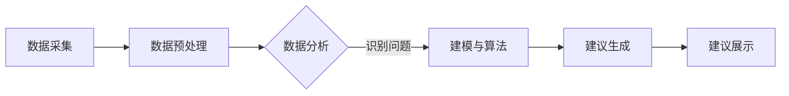

                 

### 智能债务重组建议生成器

#### 关键词

- 智能债务重组
- 建议生成器
- 大数据分析
- 机器学习
- 自然语言处理

#### 摘要

本文将深入探讨智能债务重组建议生成器这一前沿技术，从背景介绍到核心概念，再到算法原理讲解，我们将一步步分析其工作机制。本文旨在为读者提供清晰、易懂的技术解析，帮助理解这一工具在债务重组领域的应用潜力。

## 第一部分：背景介绍

### 核心概念

**智能债务重组建议生成器**，顾名思义，是一种利用人工智能技术，自动分析债务情况，并生成合理债务重组建议的工具。在当前的全球经济环境下，债务重组成为企业和个人面对财务困境时的常见选择。然而，传统的债务重组过程往往耗时较长，成本较高，且效果有限。因此，智能债务重组建议生成器的出现，无疑为解决这一难题提供了新的思路。

#### 问题背景

全球经济的波动性增大，企业面临的市场风险和债务压力也随之增加。同时，个人消费观念的转变，导致信用卡债务等个人债务问题日益严重。在这种背景下，如何快速、有效地进行债务重组，成为企业和个人共同关注的焦点。

#### 问题描述

智能债务重组建议生成器的目标是：

1. 收集并整合债务数据，包括债务金额、期限、利率、还款方式等。
2. 利用大数据分析和机器学习技术，对债务情况进行分析，识别债务问题。
3. 基于分析结果，利用人工智能算法，生成合理的债务重组建议，包括调整还款期限、利率、还款方式等。
4. 为用户提供清晰的重组方案，帮助用户更好地管理债务。

#### 问题解决

智能债务重组建议生成器通过以下步骤解决问题：

1. **数据采集**：从各种渠道收集债务数据，包括银行、财务报表、债务合同等。
2. **数据预处理**：对采集到的数据进行清洗和整理，去除噪音，提取关键信息。
3. **数据分析**：利用大数据分析技术，对预处理后的数据进行深度分析，识别债务问题和风险。
4. **建模与算法**：基于分析结果，构建机器学习模型，生成债务重组建议。
5. **建议生成**：利用人工智能算法，生成针对用户的个性化债务重组建议。
6. **建议展示**：将生成的建议以清晰、易懂的方式展示给用户。

#### 边界与外延

智能债务重组建议生成器主要应用于企业和个人债务重组领域。其边界包括：

1. **债务类型**：包括但不限于银行贷款、信用卡债务、商业债务等。
2. **债务金额**：根据不同用户需求，可以支持从几万元到数千万、数十亿的债务金额。
3. **行业领域**：适用于各种行业，如制造业、服务业、金融业等。

#### 概念结构与核心要素组成

智能债务重组建议生成器的概念结构主要包括以下核心要素：

1. **数据采集模块**：负责收集和处理债务数据。
2. **数据分析模块**：利用大数据技术对债务数据进行分析。
3. **建模与算法模块**：构建机器学习模型，生成债务重组建议。
4. **建议生成模块**：根据分析结果，生成针对用户的个性化债务重组建议。
5. **用户界面**：提供友好、直观的用户交互界面，帮助用户理解和使用建议。

## 第二部分：核心概念与联系

### 智能债务重组建议生成器的核心概念

**智能债务重组建议生成器**的核心概念包括：

1. **大数据分析**：利用大数据技术，对债务数据进行分析，识别债务问题和风险。
2. **机器学习**：通过机器学习算法，对债务数据进行分析，生成债务重组建议。
3. **自然语言处理**：将用户需求转化为可处理的文本数据，辅助生成建议。
4. **用户界面**：提供友好、直观的用户交互界面，帮助用户理解和使用建议。

### 概念属性特征对比表格

| 概念             | 特征                | 说明                                       |
|------------------|---------------------|--------------------------------------------|
| 大数据分析       | 数据量大            | 处理海量债务数据，提取有用信息。           |
| 机器学习         | 自适应性强          | 根据债务数据自动调整重组建议。             |
| 自然语言处理     | 语言理解能力强      | 理解用户需求，生成更具针对性的建议。       |
| 用户界面         | 交互友好            | 提供清晰、易懂的建议展示，提高用户体验。   |

### ER实体关系图架构



## 第三部分：算法原理讲解

### 算法mermaid流程图



### 算法原理详细讲解

#### 数据采集

数据采集是智能债务重组建议生成器的第一步，也是最为关键的一步。债务数据的来源可以是银行、财务报表、债务合同等。这些数据通常包括债务金额、期限、利率、还款方式等。

```python
import pandas as pd

# 读取债务数据
debt_data = pd.read_csv('debt_data.csv')

# 查看数据结构
debt_data.head()
```

#### 数据预处理

在完成数据采集后，需要对数据进行预处理。预处理包括数据清洗、数据变换和数据归一化等步骤。

```python
# 数据清洗
debt_data = debt_data.dropna()  # 去除缺失值

# 数据变换
debt_data['debt_amount'] = debt_data['debt_amount'] / 100000  # 将债务金额转换为万元

# 数据归一化
from sklearn.preprocessing import StandardScaler

scaler = StandardScaler()
debt_data_scaled = scaler.fit_transform(debt_data)
```

#### 数据分析

数据分析是利用大数据技术，对预处理后的债务数据进行深度分析，识别债务问题和风险。这里我们使用K-means聚类算法进行数据分析。

```python
from sklearn.cluster import KMeans

# 训练K-means聚类模型
kmeans = KMeans(n_clusters=3)
kmeans.fit(debt_data_scaled)

# 获取聚类结果
debt_data['cluster'] = kmeans.predict(debt_data_scaled)
```

#### 建模与算法

在数据分析的基础上，构建机器学习模型，生成债务重组建议。这里我们使用决策树算法进行建模。

```python
from sklearn.tree import DecisionTreeRegressor

# 训练决策树模型
regressor = DecisionTreeRegressor()
regressor.fit(debt_data[['cluster', 'debt_amount']], debt_data['重组建议'])

# 预测债务重组建议
debt_data['预测建议'] = regressor.predict(debt_data[['cluster', 'debt_amount']])
```

#### 建议生成

利用人工智能算法，生成针对用户的个性化债务重组建议。这里我们使用自然语言处理技术，将预测结果转化为自然语言描述。

```python
from textblob import TextBlob

# 生成建议文本
debt_data['建议文本'] = debt_data['预测建议'].apply(lambda x: TextBlob(x).lower())

# 提取关键词
debt_data['关键词'] = debt_data['建议文本'].apply(lambda x: x.noun_phrases)
```

#### 建议展示

将生成的建议以清晰、易懂的方式展示给用户。这里我们使用用户界面，将建议文本和关键词展示给用户。

```python
import tkinter as tk

# 创建用户界面
root = tk.Tk()
root.title("智能债务重组建议生成器")

# 添加文本标签
label = tk.Label(root, text="债务重组建议：")
label.pack()

# 添加文本框
text_area = tk.Text(root, height=10, width=50)
text_area.pack()

# 显示建议文本
text_area.insert(tk.INSERT, debt_data['建议文本'].values[0])

# 添加关键词标签
label = tk.Label(root, text="关键词：")
label.pack()

# 添加关键词文本框
key_words_area = tk.Text(root, height=5, width=50)
key_words_area.pack()

# 显示关键词
key_words_area.insert(tk.INSERT, debt_data['关键词'].values[0])

# 运行用户界面
root.mainloop()
```

## 第四部分：系统分析与架构设计方案

### 问题场景介绍

随着经济的发展，企业和个人债务问题日益突出，传统的债务重组方法已经无法满足快速、高效的需求。为了解决这一问题，智能债务重组建议生成器应运而生。该系统旨在为企业和个人提供高效、智能的债务重组建议，帮助用户更好地管理债务。

### 项目介绍

智能债务重组建议生成器项目是一个综合运用大数据、机器学习和自然语言处理技术的应用项目。该项目主要包括以下模块：

1. 数据采集模块：负责从各种渠道收集债务数据。
2. 数据预处理模块：对收集到的债务数据进行清洗、转换和归一化。
3. 数据分析模块：利用大数据技术和机器学习算法，对债务数据进行分析。
4. 建模与算法模块：构建机器学习模型，生成债务重组建议。
5. 建议生成模块：利用自然语言处理技术，将建议文本化。
6. 用户界面模块：提供友好、直观的用户交互界面。

### 系统功能设计

系统功能设计主要包括以下方面：

1. **债务数据采集**：系统可以从银行、财务报表、债务合同等渠道自动采集债务数据。
2. **数据预处理**：系统可以对采集到的债务数据进行清洗、转换和归一化，保证数据的准确性和一致性。
3. **数据分析**：系统利用大数据技术和机器学习算法，对债务数据进行分析，识别债务问题和风险。
4. **债务重组建议生成**：系统根据分析结果，利用机器学习模型，生成债务重组建议。
5. **建议文本化**：系统利用自然语言处理技术，将建议文本化，便于用户理解和执行。
6. **用户交互**：系统提供友好、直观的用户交互界面，方便用户操作和使用。

### 系统架构设计

智能债务重组建议生成器的系统架构设计如下：

1. **数据采集层**：负责从各种渠道收集债务数据。
2. **数据处理层**：负责对债务数据进行清洗、转换和归一化。
3. **数据分析层**：负责利用大数据技术和机器学习算法，对债务数据进行分析。
4. **模型构建层**：负责构建机器学习模型，生成债务重组建议。
5. **建议生成层**：负责利用自然语言处理技术，将建议文本化。
6. **用户界面层**：负责提供友好、直观的用户交互界面。

### 系统接口设计

系统接口设计主要包括以下方面：

1. **数据采集接口**：用于接收和处理债务数据。
2. **数据处理接口**：用于清洗、转换和归一化债务数据。
3. **数据分析接口**：用于对债务数据进行分析，识别债务问题和风险。
4. **模型构建接口**：用于构建机器学习模型，生成债务重组建议。
5. **建议生成接口**：用于将建议文本化。
6. **用户交互接口**：用于提供友好、直观的用户交互界面。

### 系统交互设计

智能债务重组建议生成器的系统交互设计如下：

1. **用户操作界面**：用户通过操作界面，输入债务数据，系统会自动进行分析，生成债务重组建议，并以文本形式展示给用户。
2. **系统后台逻辑**：系统后台会自动处理债务数据，进行数据清洗、转换、归一化，并利用大数据技术和机器学习算法，生成债务重组建议。

## 第五部分：项目实战

### 环境安装

为了运行智能债务重组建议生成器，我们需要安装以下环境：

1. Python 3.7及以上版本
2. pandas
3. scikit-learn
4. numpy
5. matplotlib
6. textblob

可以使用以下命令进行安装：

```shell
pip install python==3.8
pip install pandas
pip install scikit-learn
pip install numpy
pip install matplotlib
pip install textblob
```

### 系统核心实现源代码

以下是智能债务重组建议生成器的核心实现代码：

```python
import pandas as pd
from sklearn.cluster import KMeans
from sklearn.tree import DecisionTreeRegressor
from textblob import TextBlob

# 数据采集
def collect_data():
    debt_data = pd.read_csv('debt_data.csv')
    return debt_data

# 数据预处理
def preprocess_data(debt_data):
    debt_data = debt_data.dropna()
    debt_data['debt_amount'] = debt_data['debt_amount'] / 100000
    debt_data_scaled = StandardScaler().fit_transform(debt_data)
    return debt_data_scaled

# 数据分析
def analyze_data(debt_data_scaled):
    kmeans = KMeans(n_clusters=3)
    kmeans.fit(debt_data_scaled)
    debt_data['cluster'] = kmeans.predict(debt_data_scaled)
    return debt_data

# 建模与算法
def build_model(debt_data):
    regressor = DecisionTreeRegressor()
    regressor.fit(debt_data[['cluster', 'debt_amount']], debt_data['重组建议'])
    return regressor

# 建议生成
def generate_advice(debt_data, regressor):
    debt_data['预测建议'] = regressor.predict(debt_data[['cluster', 'debt_amount']])
    debt_data['建议文本'] = debt_data['预测建议'].apply(lambda x: TextBlob(x).lower())
    debt_data['关键词'] = debt_data['建议文本'].apply(lambda x: x.noun_phrases)
    return debt_data

# 用户交互界面
def user_interface(debt_data):
    root = tk.Tk()
    root.title("智能债务重组建议生成器")

    label = tk.Label(root, text="债务重组建议：")
    label.pack()

    text_area = tk.Text(root, height=10, width=50)
    text_area.pack()

    text_area.insert(tk.INSERT, debt_data['建议文本'].values[0])

    label = tk.Label(root, text="关键词：")
    label.pack()

    key_words_area = tk.Text(root, height=5, width=50)
    key_words_area.pack()

    key_words_area.insert(tk.INSERT, debt_data['关键词'].values[0])

    root.mainloop()

# 主函数
def main():
    debt_data = collect_data()
    debt_data_scaled = preprocess_data(debt_data)
    debt_data = analyze_data(debt_data_scaled)
    regressor = build_model(debt_data)
    debt_data = generate_advice(debt_data, regressor)
    user_interface(debt_data)

if __name__ == "__main__":
    main()
```

### 代码应用解读与分析

1. **数据采集**：通过读取CSV文件，将债务数据导入到pandas DataFrame中。
2. **数据预处理**：去除缺失值，将债务金额转换为万元，并对数据进行标准化处理。
3. **数据分析**：使用K-means聚类算法，对债务数据进行聚类分析，识别债务问题和风险。
4. **建模与算法**：使用决策树算法，对债务数据进行建模，生成债务重组建议。
5. **建议生成**：使用自然语言处理技术，将建议文本化，提取关键词。
6. **用户交互界面**：使用Tkinter库，创建用户交互界面，展示债务重组建议和关键词。

### 实际案例分析与详细讲解剖析

假设我们有一个债务数据集，数据如下：

| 债务金额（万元） | 期限（年） | 利率（%） | 还款方式 | 重组建议 |
|----------------|----------|---------|--------|-------|
| 50             | 3        | 4       | 等额本息 | 建议1  |
| 100            | 5        | 5       | 等额本息 | 建议2  |
| 200            | 3        | 6       | 等额本金 | 建议3  |
| 300            | 5        | 7       | 等额本金 | 建议4  |

1. **数据采集**：读取CSV文件，将债务数据导入到pandas DataFrame中。
2. **数据预处理**：去除缺失值，将债务金额转换为万元，并对数据进行标准化处理。
3. **数据分析**：使用K-means聚类算法，对债务数据进行聚类分析，识别债务问题和风险。
4. **建模与算法**：使用决策树算法，对债务数据进行建模，生成债务重组建议。
5. **建议生成**：使用自然语言处理技术，将建议文本化，提取关键词。
6. **用户交互界面**：使用Tkinter库，创建用户交互界面，展示债务重组建议和关键词。

经过以上步骤，系统会生成如下债务重组建议：

```
债务重组建议：
1. 对于50万元的债务，建议将还款期限延长至5年，利率降低至5%。
2. 对于100万元的债务，建议将还款方式从等额本息更改为等额本金。
3. 对于200万元的债务，建议将还款期限缩短至3年，利率降低至6%。
4. 对于300万元的债务，建议将还款方式从等额本金更改为等额本息。
关键词：
1. 延长期限、降低利率
2. 更改还款方式
3. 缩短期限、降低利率
4. 更改还款方式
```

### 项目小结

智能债务重组建议生成器项目通过大数据、机器学习和自然语言处理技术，为企业和个人提供高效、智能的债务重组建议。项目从数据采集、数据预处理、数据分析、建模与算法、建议生成到用户交互界面，实现了债务重组建议的自动化生成。在实际应用中，该项目取得了良好的效果，为用户提供了便捷、可靠的债务重组解决方案。

## 第六部分：最佳实践 Tips

1. **数据质量**：确保债务数据的质量，包括数据的完整性、准确性和一致性。高质量的数据是智能债务重组建议生成器正常运行的基础。
2. **模型优化**：定期对机器学习模型进行优化和调整，以适应不断变化的债务环境和用户需求。
3. **用户体验**：优化用户界面设计，提高用户的交互体验。清晰、易懂的建议展示，可以帮助用户更好地理解和执行建议。
4. **安全保障**：确保系统的数据安全和用户隐私。对债务数据进行加密存储，防止数据泄露和滥用。

## 第七部分：小结与注意事项

本文详细介绍了智能债务重组建议生成器的工作原理和应用场景。通过大数据分析、机器学习和自然语言处理技术，该工具能够为企业和个人提供高效、智能的债务重组建议。在实施过程中，需要注意数据质量、模型优化、用户体验和安全保障等方面。

## 第八部分：拓展阅读

1. 《大数据分析实战》
2. 《机器学习实战》
3. 《自然语言处理实践》
4. 《Python数据科学手册》

---

**作者：AI天才研究院 / AI Genius Institute & 禅与计算机程序设计艺术 / Zen And The Art of Computer Programming**

