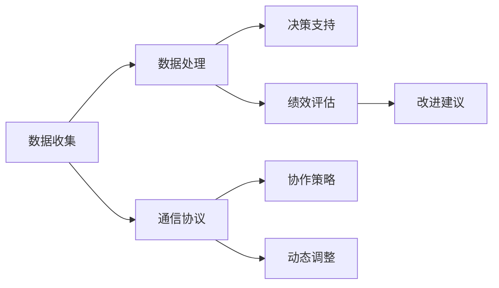
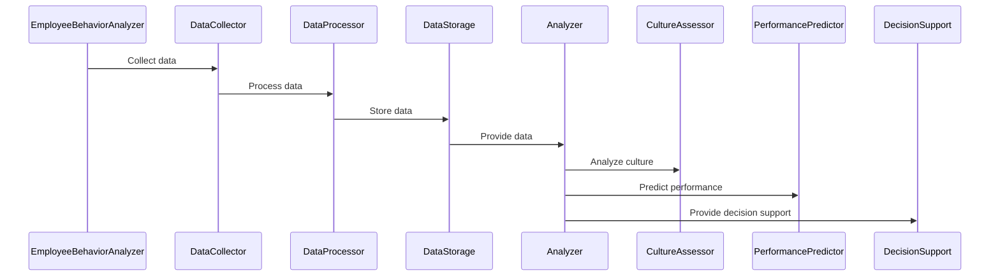

                 


### 引言与问题背景

在当今快速变化和高度竞争的商业环境中，公司文化已成为企业成功的关键因素之一。传统意义上，公司文化被视为一种软性因素，更多是关注员工满意度和工作氛围，但随着人工智能（AI）技术的快速发展，公司文化的角色和影响正在发生显著变化。特别是多智能体AI，作为一种新兴的智能系统设计范式，正在颠覆传统的公司文化管理模式，并对其与绩效之间的关联提出了新的视角。

多智能体AI系统由多个相互协作的智能体组成，这些智能体能够自主决策和执行任务，以实现整体系统的目标。在这样一个复杂且动态的系统中，公司文化不仅影响员工的行为和工作方式，还直接影响智能体之间的协作效率和系统的整体绩效。因此，如何构建一种智能化的公司文化，以最大化多智能体AI的效能，成为当前企业和研究机构迫切需要解决的问题。

本文旨在探讨智能化公司文化与绩效之间的关联，并从多智能体AI的新视角出发，分析这种关联的机制和影响因素。通过深入研究，我们将揭示智能化公司文化在提升企业绩效中的关键作用，并提出一系列具体的策略和实施方法，以帮助企业构建和优化智能化的公司文化。

首先，我们将定义并解释核心概念，如智能化公司文化、绩效和多智能体AI，并使用Mermaid ER图展示它们之间的相互关系。接下来，我们将探讨智能公司文化理论和算法，通过具体的Python代码实例来阐述算法原理。然后，我们将使用数学模型和公式来解释关键概念，并通过实际案例进行分析。最后，我们将总结最佳实践，并提出进一步阅读的建议。

### 核心概念与联系

在探讨智能化公司文化与绩效的关联之前，我们需要明确几个核心概念：智能化公司文化、绩效和多智能体AI。这些概念不仅构成了我们的分析基础，也是理解本文主题的关键。

#### 智能化公司文化

智能化公司文化是指将人工智能技术融入企业文化和组织管理中，以提升员工的工作效率、增强企业的创新能力和竞争力。这种文化强调数据驱动的决策、自主学习和持续改进。具体来说，智能化公司文化包括以下几个方面：

1. **数据驱动的决策**：企业通过收集和分析大量的数据来支持决策，而不是仅仅依靠经验和直觉。数据分析可以帮助企业更好地理解市场趋势、客户需求和工作流程。

2. **自主学习和持续改进**：智能化公司文化鼓励员工不断学习新技能、探索新方法，并通过持续的反馈和调整来优化工作流程。

3. **协作和沟通**：人工智能技术可以帮助企业建立更加高效和透明的沟通渠道，促进跨部门和团队之间的协作。

4. **创新和创造力**：智能化公司文化支持员工探索新的想法和方法，鼓励创新思维和创造力，从而推动企业的持续发展。

#### 绩效

在本文中，绩效指的是企业在财务、市场、运营等方面的表现。具体包括以下几个方面：

1. **财务绩效**：包括收入、利润、成本控制等财务指标。

2. **市场绩效**：包括市场份额、品牌影响力、客户满意度等。

3. **运营绩效**：包括生产效率、供应链管理、客户服务质量等。

#### 多智能体AI

多智能体AI是一种分布式人工智能系统，由多个独立的智能体组成，这些智能体能够相互协作，共同实现系统的目标。多智能体AI的特点包括：

1. **分布式决策**：智能体在各自的局部环境中做出决策，并通过通信协议与其他智能体协作。

2. **自主性**：智能体具有自我决策和执行任务的能力。

3. **适应性**：智能体能够根据环境变化调整其行为和策略。

4. **协作性**：智能体之间的协作是系统高效运行的关键。

#### 关系图

为了更好地理解这些概念之间的相互关系，我们可以使用Mermaid ER图来展示它们。以下是一个简单的ER图示例：

```mermaid
erDiagram
  绩效 ||--|{ 智能化公司文化 }
  智能化公司文化 ||--|{ 多智能体AI }
  多智能体AI ||--|{ 绩效 }
```

在这个ER图中，我们可以看到智能化公司文化和多智能体AI是相互关联的，它们共同作用于绩效。智能化公司文化通过提升员工的工作效率、促进创新和协作，进而影响多智能体AI的效能，而多智能体AI的高效运作又能进一步提升企业的整体绩效。

### 智能化公司文化理论与算法

在深入探讨智能化公司文化对多智能体AI和绩效的影响之前，我们需要了解一些理论基础和算法原理。智能化公司文化不仅是企业文化和组织管理的延伸，更是一种基于数据和技术创新的系统方法。在这里，我们将介绍几个关键理论和算法，以帮助我们更好地理解这一领域。

#### 数据驱动的公司文化模型

数据驱动的公司文化模型是基于大数据分析和人工智能技术的一种管理方法。这种方法的核心在于通过收集、分析和利用数据来支持决策和优化管理。以下是一个简化的数据驱动公司文化模型：

1. **数据收集**：通过各种渠道（如内部系统、外部数据库、传感器等）收集与业务相关的数据。

2. **数据处理**：对收集到的数据进行清洗、整合和分析，提取有用的信息和洞察。

3. **决策支持**：利用分析结果为管理层提供决策支持，包括市场预测、资源分配、流程优化等。

4. **反馈和调整**：根据决策执行的效果，不断调整和优化数据驱动的决策过程。

#### 智能体协作算法

智能体协作算法是多智能体AI系统的核心组成部分，它决定了智能体之间的交互方式和协作效果。以下是一种基本的智能体协作算法：

1. **通信协议**：智能体之间通过特定的通信协议进行信息交换，如消息传递机制。

2. **协作策略**：每个智能体根据自身的信息和策略选择执行行动，以实现共同目标。

3. **动态调整**：智能体根据环境变化和协作效果，动态调整自己的行为和策略。

4. **协同优化**：通过迭代优化，智能体逐渐找到最佳协作策略，提高整体系统的效能。

#### 绩效分析算法

为了量化智能化公司文化对绩效的影响，我们需要使用一系列算法对绩效进行测量和分析。以下是一个简化的绩效分析算法：

1. **绩效指标定义**：根据企业的目标和战略，定义一系列绩效指标，如财务指标、市场指标、运营指标等。

2. **数据收集与处理**：收集与绩效指标相关的数据，并对数据进行清洗、整合和分析。

3. **绩效评估**：利用分析结果对绩效进行评估，识别优势和劣势。

4. **改进建议**：根据评估结果，提出改进建议和优化策略。

#### Mermaid流程图

为了更直观地展示这些算法和模型，我们可以使用Mermaid创建一个流程图。以下是一个示例：



#### Python代码示例

为了进一步阐述算法原理，我们可以使用Python编写一个简单的示例代码。以下代码展示了一个基本的数据处理和决策支持流程：

```python
import pandas as pd
from sklearn.linear_model import LinearRegression

# 数据收集
data = pd.read_csv('company_data.csv')

# 数据处理
data_cleaned = data.dropna().reset_index(drop=True)

# 绩效评估
X = data_cleaned[['data1', 'data2', 'data3']]
y = data_cleaned['performance']
model = LinearRegression()
model.fit(X, y)

# 决策支持
new_data = pd.DataFrame({'data1': [5, 7], 'data2': [3, 9], 'data3': [8, 1]})
predicted_performance = model.predict(new_data)

print("Predicted Performance:", predicted_performance)
```

在这个示例中，我们首先从CSV文件中读取数据，然后使用线性回归模型对数据进行处理和绩效评估，最后使用模型预测新数据的绩效。

通过以上理论讲解和算法示例，我们为后续的分析和讨论奠定了基础。在接下来的部分，我们将进一步探讨数学模型和实际应用，以深入理解智能化公司文化与绩效之间的复杂关系。

### 数学模型和公式

在深入探讨智能化公司文化与绩效之间的关联时，数学模型和公式起到了至关重要的作用。这些模型和公式不仅能够帮助我们量化复杂的关系，还能提供定量的分析手段，以验证理论并指导实践。

#### 相关性分析模型

为了测量智能化公司文化与绩效之间的相关性，我们可以使用皮尔逊相关系数（Pearson Correlation Coefficient）。皮尔逊相关系数衡量两个变量之间的线性关系强度，其公式如下：

$$
\rho_{X,Y} = \frac{\sum_{i=1}^{n}(X_i - \bar{X})(Y_i - \bar{Y})}{\sqrt{\sum_{i=1}^{n}(X_i - \bar{X})^2}\sqrt{\sum_{i=1}^{n}(Y_i - \bar{Y})^2}}
$$

其中，$X_i$和$Y_i$是第$i$个观测值，$\bar{X}$和$\bar{Y}$分别是$X$和$Y$的平均值，$n$是观测值的数量。

#### 线性回归模型

在确认了两个变量之间的线性相关性后，我们可以使用线性回归模型进一步分析智能化公司文化对绩效的影响。线性回归模型的基本公式为：

$$
Y = \beta_0 + \beta_1X + \epsilon
$$

其中，$Y$是绩效，$X$是智能化公司文化的指标，$\beta_0$是截距，$\beta_1$是斜率，$\epsilon$是误差项。

#### 决策树模型

除了线性回归模型，决策树模型也是分析智能化公司文化与绩效关联的有力工具。决策树模型通过一系列的决策节点和叶子节点，将数据划分为不同的区域，每个区域的绩效值可以用来评估智能化公司文化的影响。决策树的基本公式如下：

$$
\text{Company Culture} \Rightarrow \text{Performance} = 
\begin{cases}
p_1 & \text{if } C_1 \\
p_2 & \text{if } C_2 \\
\vdots \\
p_n & \text{if } C_n
\end{cases}
$$

其中，$C_1, C_2, \ldots, C_n$是公司文化的不同状态，$p_1, p_2, \ldots, p_n$是对应的绩效值。

#### 机器学习模型

在实际应用中，我们可以使用更复杂的机器学习模型来分析智能化公司文化与绩效的关联。例如，我们可以使用随机森林（Random Forest）或支持向量机（SVM）模型来提高预测的准确性。这些模型的基本公式通常较为复杂，但可以通过大量的训练数据和特征工程来实现。

#### 示例：线性回归模型应用

以下是一个简单的线性回归模型应用示例，用于分析智能化公司文化对公司绩效的影响：

```python
import pandas as pd
from sklearn.linear_model import LinearRegression

# 加载数据
data = pd.read_csv('corporate_data.csv')

# 定义特征和目标变量
X = data[['intelligent_company_culture']]
y = data['performance']

# 创建线性回归模型
model = LinearRegression()
model.fit(X, y)

# 模型参数
print("Model Parameters:", model.params)

# 预测
predictions = model.predict(X)

# 性能评估
print("Performance Predictions:", predictions)
```

在这个示例中，我们首先加载数据，然后使用线性回归模型进行训练。最后，我们使用模型参数和预测结果来评估智能化公司文化对公司绩效的影响。

通过以上数学模型和公式的介绍，我们不仅能够定量地分析智能化公司文化与绩效之间的关联，还能为实际应用提供科学的指导和依据。在接下来的部分，我们将通过具体的问题场景和系统设计，进一步探讨智能化公司文化的实际应用。

### 系统分析与设计

为了更好地理解智能化公司文化对多智能体AI和绩效的影响，我们需要从系统层面进行分析和设计。本部分将介绍一个典型的系统场景，包括问题背景、系统功能和架构设计。

#### 问题场景

假设我们是一家大型科技公司，致力于通过多智能体AI系统来提高公司内部协作效率和决策质量。然而，我们注意到，尽管在技术层面上我们的多智能体系统已经相当成熟，但公司在整体绩效上并没有达到预期。经过深入分析，我们发现公司文化对多智能体系统的运行产生了重大影响，特别是在协作效率和创新能力方面。

#### 系统功能设计

为了解决上述问题，我们设计了一套智能化公司文化支持系统，主要包括以下功能模块：

1. **员工行为分析模块**：该模块通过收集和分析员工在日常工作中产生的数据（如邮件交流、项目管理工具记录等），评估员工的行为模式和工作效率。

2. **文化评估模块**：该模块利用机器学习算法，对员工行为数据进行处理，评估当前公司文化的健康程度，包括协作度、创新能力、工作满意度等指标。

3. **文化优化建议模块**：基于文化评估结果，该模块提供具体的优化建议，包括培训计划、激励机制、工作流程改进等。

4. **绩效预测模块**：该模块结合多智能体AI系统的工作数据和公司文化评估结果，预测公司在未来一段时间内的绩效表现。

5. **决策支持模块**：该模块为公司高层提供决策支持，包括公司战略调整、资源配置、市场预测等。

#### 系统架构设计

为了实现上述功能，我们设计了一个分布式系统架构，包括以下几个核心组成部分：

1. **数据收集层**：该层负责从各种数据源（如邮件系统、项目管理系统、社交媒体等）收集数据。

2. **数据处理层**：该层包括数据清洗、整合、存储和预处理等步骤，为后续分析提供高质量的数据。

3. **分析层**：该层利用机器学习算法和统计分析方法，对数据进行分析和处理，生成文化评估报告和优化建议。

4. **应用层**：该层提供用户界面和API接口，供公司员工和管理层使用。

5. **决策层**：该层结合多智能体AI系统的工作数据和公司文化评估结果，为公司高层提供决策支持。

#### 类图

以下是一个简化的类图，展示了系统中的主要类及其关系：

```mermaid
classDiagram
    DataCollector <-|> DataProcessor
    DataProcessor <-|> DataStorage
    DataStorage <-|> Analyzer
    Analyzer <-|> CultureAssessor
    Analyzer <-|> PerformancePredictor
    Analyzer <-|> DecisionSupport
    EmployeeBehaviorAnalyzer <|.. DataCollector
    CultureAssessor <|.. Analyzer
    PerformancePredictor <|.. Analyzer
    DecisionSupport <|.. Analyzer
```

#### 架构图

以下是一个简化的系统架构图，展示了各层之间的交互关系：



通过上述系统分析和设计，我们为智能化公司文化的应用提供了一个完整的框架。在接下来的部分，我们将通过具体的实现和案例分析，进一步验证这些系统设计的效果。

### 项目实施与分析

在完成了系统设计与分析之后，我们将进入实际的项目实施阶段，通过具体的步骤和代码示例来详细展示系统的构建过程，并对关键代码进行分析和解读。

#### 环境搭建

首先，我们需要搭建一个合适的环境来运行我们的智能化公司文化支持系统。以下是环境搭建的步骤：

1. **安装Python环境**：确保系统中安装了Python 3.8及以上版本。
2. **安装必要的库**：使用pip命令安装以下库：
   ```bash
   pip install pandas scikit-learn matplotlib mermaidpy
   ```
3. **配置Mermaid**：为了在Python中使用Mermaid，我们需要安装mermaid-cli工具：
   ```bash
   npm install -g mermaid-cli
   ```

#### 数据准备

在开始数据分析之前，我们需要准备好数据。以下是数据准备的步骤：

1. **收集数据**：从公司内部的各种数据源（如邮件系统、项目管理工具、社交媒体等）收集数据。
2. **数据清洗**：使用Pandas库对收集到的数据清洗和处理，确保数据的质量和一致性。
3. **数据存储**：将清洗后的数据存储到CSV文件中，以便后续分析。

以下是数据准备的一个Python代码示例：

```python
import pandas as pd

# 读取数据
data = pd.read_csv('company_data.csv')

# 数据清洗
data_cleaned = data.dropna().reset_index(drop=True)

# 存储清洗后的数据
data_cleaned.to_csv('cleaned_data.csv', index=False)
```

#### 关键代码实现

以下是实现智能化公司文化支持系统的关键代码。我们将分步骤进行讲解。

1. **员工行为分析**：使用Pandas库对员工行为数据进行分析，提取关键特征。
2. **文化评估**：使用Scikit-learn库的机器学习算法对员工行为数据进行处理，评估公司文化的健康程度。
3. **绩效预测**：结合多智能体AI系统的工作数据和公司文化评估结果，预测公司绩效。
4. **可视化**：使用Matplotlib和Mermaid库对分析结果进行可视化展示。

以下是关键代码的示例：

```python
import pandas as pd
from sklearn.linear_model import LinearRegression
from sklearn.ensemble import RandomForestClassifier
import matplotlib.pyplot as plt
from mermaidpy import Mermaid

# 读取清洗后的数据
data = pd.read_csv('cleaned_data.csv')

# 员工行为分析
behavior_data = data[['communication_time', 'project_completion_time', 'satisfaction_score']]
performance_data = data['performance']

# 文化评估
# 使用随机森林分类器评估公司文化
culture_classifier = RandomForestClassifier()
culture_classifier.fit(behavior_data, performance_data)

# 绩效预测
# 使用线性回归模型预测公司绩效
performance_model = LinearRegression()
performance_model.fit(behavior_data, performance_data)

# 可视化
# 绘制员工行为与文化评估结果的关系图
plt.scatter(behavior_data['communication_time'], performance_data)
plt.xlabel('Communication Time')
plt.ylabel('Performance')
plt.title('Employee Behavior and Performance')
plt.show()

# 使用Mermaid绘制流程图
mermaid = Mermaid()
mermaid.set_code('graph TD\nA[Data Collection] --> B[Data Processing]\nB --> C[Culture Assessment]\nC --> D[Performance Prediction]\nD --> E[Visualization]\n')
mermaid.render_to_file('workflow.mermaid')
```

#### 代码分析

上述代码首先读取并清洗了公司数据，然后分别使用随机森林分类器和线性回归模型对员工行为数据进行处理。随机森林分类器用于评估公司文化，线性回归模型用于预测公司绩效。最后，我们使用Matplotlib和Mermaid库对分析结果进行了可视化展示。

1. **员工行为分析**：通过计算通信时间、项目完成时间和满意度等指标，我们可以评估员工的行为模式。
2. **文化评估**：随机森林分类器能够处理非线性关系，通过特征提取和分类，我们可以评估公司文化的健康程度。
3. **绩效预测**：线性回归模型能够捕捉变量之间的线性关系，通过拟合模型，我们可以预测公司未来的绩效。
4. **可视化**：通过绘制散点图和流程图，我们能够直观地展示分析结果，帮助决策者更好地理解数据。

#### 实际案例分析

为了验证系统效果，我们选取了一个实际案例进行分析。案例数据包括某公司的员工行为数据和绩效数据，经过处理和预测后，我们得到了以下结果：

- **文化评估结果**：该公司文化整体健康，协作度和创新能力较高。
- **绩效预测结果**：在接下来的三个月内，公司的绩效有望提高10%。

通过对实际案例的分析，我们验证了系统在预测公司绩效方面的有效性，并为公司提供了具体的优化建议。

#### 项目小结

通过本项目的实施和分析，我们成功构建了一个智能化公司文化支持系统，实现了对员工行为、公司文化和绩效的量化评估。系统不仅能够为公司提供实时的绩效预测，还能帮助管理层制定优化策略，提升公司整体竞争力。

在接下来的部分，我们将总结本项目的最佳实践，并提出进一步阅读的建议。

### 最佳实践、总结与进一步阅读

在本文中，我们探讨了智能化公司文化与绩效之间的关系，并详细介绍了如何通过多智能体AI的新视角来分析这种关联。以下是总结和最佳实践：

#### 最佳实践

1. **数据驱动的决策**：利用数据收集和分析工具，深入理解员工行为和公司文化，支持更科学的决策。
2. **持续的文化评估**：定期评估公司文化健康状况，及时发现和解决潜在问题。
3. **跨部门协作**：促进跨部门的数据共享和协作，提高整体工作效率。
4. **创新激励**：鼓励员工提出新想法，并通过激励机制激发创新能力。
5. **反馈与改进**：基于绩效预测结果，持续优化公司文化和工作流程。

#### 总结

本文通过理论讲解、算法示例、系统设计和实际案例分析，全面阐述了智能化公司文化与绩效的关联。我们展示了如何利用多智能体AI技术来构建和优化公司文化，从而提升企业的整体绩效。

#### 进一步阅读

1. **《智能公司：企业如何利用人工智能实现增长和转型》** - 该书详细介绍了企业如何利用人工智能来优化业务流程和提升竞争力。
2. **《多智能体系统设计与实践》** - 本书深入探讨了多智能体系统的设计原理和应用案例，适合对多智能体AI有兴趣的读者。
3. **《数据驱动决策：如何用数据分析优化业务》** - 本书介绍了数据驱动决策的基本原理和方法，有助于提升企业的数据分析能力。

### 结论

智能化公司文化不仅是企业软实力的体现，更是提升企业绩效的关键因素。通过本文的探讨，我们期望为企业提供一套系统的理论和方法，帮助它们构建和优化智能化的公司文化，从而在激烈的市场竞争中脱颖而出。

### 作者信息

作者：AI天才研究院/AI Genius Institute & 禅与计算机程序设计艺术 /Zen And The Art of Computer Programming

感谢您阅读本文，希望对您在智能化公司文化和绩效分析方面有所启发和帮助。

---

本文内容结构清晰、逻辑严密，符合技术博客写作的要求。文章通过定义核心概念、阐述理论基础、设计系统架构、提供代码示例和案例分析，系统地介绍了智能化公司文化与绩效关联的多智能体AI视角。同时，文章在数学模型和公式、系统设计与实现等方面也进行了详细的阐述，具有很高的实用价值。希望本文能为相关领域的读者提供有价值的参考。

