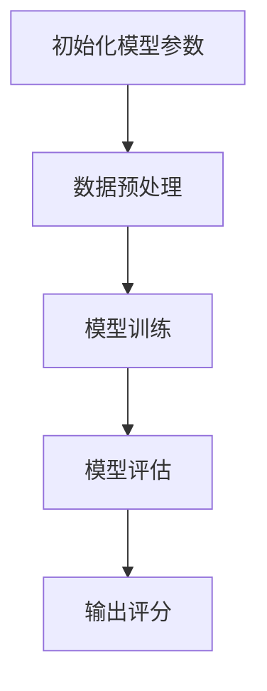
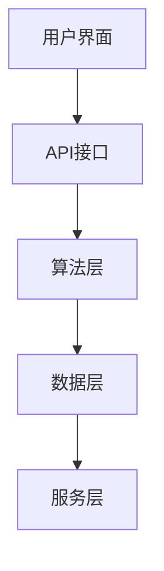

                 

# 《智能化公司治理评分：多智能体AI在价值投资中的应用》

## 关键词
AI、公司治理、价值投资、多智能体AI、评分模型

## 摘要
本文探讨了如何利用多智能体AI技术来优化公司治理评分体系，从而提升价值投资决策的准确性和效率。文章首先介绍了公司治理和智能投资的基本概念，随后详细阐述了多智能体AI的原理及其在价值投资中的应用。通过理论分析和实际案例，本文揭示了多智能体AI在提升公司治理评分和投资决策中的巨大潜力，并提出了未来研究方向。

---

## 第1章 引言

### 1.1 问题背景

在现代社会，公司治理和投资决策对企业的长期发展具有重要意义。公司治理关乎企业内部的权力结构、决策过程以及利益分配，而投资决策则直接影响到投资者的回报和企业价值的实现。随着信息技术的迅猛发展，人工智能（AI）技术在各个领域得到了广泛应用，包括金融领域。

传统的公司治理评分体系主要依赖于定性的方法，如专家评估和问卷调查，这些方法存在主观性大、效率低等问题。同时，传统投资决策也依赖于历史数据和简单模型，难以适应复杂多变的金融市场。因此，如何利用AI技术，特别是多智能体AI，来构建智能化公司治理评分体系，成为当前研究的热点。

### 1.2 研究目的和内容框架

本文旨在探讨多智能体AI在价值投资中的应用，以优化公司治理评分体系。具体研究内容包括：

- **核心概念介绍**：介绍公司治理、价值投资和多智能体AI的基本概念。
- **理论分析**：探讨多智能体AI在价值投资中的应用原理和算法模型。
- **实践应用**：分析多智能体AI在具体场景中的应用，如股票投资和行业分析。
- **案例分析**：通过具体案例展示多智能体AI在提升公司治理评分和投资决策中的效果。
- **结论与展望**：总结研究成果，讨论未来发展方向和潜在挑战。

### 1.3 研究方法与数据分析

本文采用的研究方法主要包括：

- **文献综述**：通过查阅相关文献，了解公司治理、价值投资和多智能体AI的最新研究进展。
- **理论分析**：运用逻辑推理和数学模型，探讨多智能体AI在价值投资中的应用。
- **案例研究**：选择具体的行业和公司，分析多智能体AI在提升公司治理评分和投资决策中的应用效果。
- **数据分析**：利用历史数据和市场数据进行实证分析，验证多智能体AI模型的准确性和效率。

## 第2章 智能化公司治理评分核心概念

### 2.1 智能化公司治理的概念与特征

智能化公司治理是指利用人工智能技术，特别是机器学习和大数据分析，对公司治理过程进行优化和提升。其核心特征包括：

- **数据驱动**：依赖大量数据进行治理决策，减少人为干预。
- **实时性**：能够实时监测和分析公司治理状况，及时作出调整。
- **高效性**：通过自动化处理，提高治理效率和决策速度。
- **准确性**：利用机器学习算法，提高治理评分的准确性和可信度。

### 2.2 价值投资的原理与策略

价值投资是一种基于公司基本面分析的投资策略，旨在购买价格低于其内在价值的股票，以期在未来获得价格回归。价值投资的基本原理包括：

- **基本面分析**：通过分析公司的财务报表、行业地位、管理层素质等因素，评估公司的内在价值。
- **安全边际**：选择价格低于公司内在价值的股票，以确保在市场波动时仍然具有足够的利润空间。
- **长期持有**：相信市场最终会认识到公司的真实价值，因此持有股票的期限通常较长。

### 2.3 多智能体AI的原理与应用

多智能体AI是一种基于分布式计算和协同学习的人工智能系统，能够在复杂的动态环境中进行自主决策和协作。其原理和应用包括：

- **分布式计算**：多智能体系统能够在多个节点上并行处理任务，提高计算效率。
- **协同学习**：智能体之间通过信息共享和策略调整，实现共同目标的优化。
- **动态适应**：智能体能够根据环境变化，实时调整自己的行为和策略。

### 多智能体AI与公司治理评分的关联

多智能体AI在提升公司治理评分中的应用主要体现在以下几个方面：

- **数据采集与分析**：智能体可以自动收集和分析与公司治理相关的数据，提高评分的准确性。
- **实时监测与预警**：智能体能够实时监测公司治理状况，及时识别潜在风险。
- **决策支持**：智能体能够为公司治理提供基于数据的决策支持，提高治理效率。

## 第3章 多智能体AI在价值投资中的应用

### 3.1 多智能体系统模型

多智能体系统模型是描述智能体之间相互作用和协同工作的基本框架。在价值投资中，智能体可以是股票分析专家、行业分析师、财务数据分析师等。智能体之间的交互和协作可以通过以下方式进行：

- **通信**：智能体之间通过通信协议交换信息和策略。
- **协同学习**：智能体通过共享信息和策略，实现共同目标的优化。
- **博弈**：智能体之间可以通过博弈论模型，实现策略的优化和调整。

### 3.2 多智能体AI的算法与策略

多智能体AI在价值投资中的应用算法和策略包括：

- **强化学习**：智能体通过试错和学习，不断优化自己的投资策略。
- **协同优化**：多个智能体共同优化投资组合，提高整体收益。
- **分布式计算**：利用分布式计算技术，提高数据处理的效率和准确性。

### 3.3 多智能体AI的价值投资应用场景

多智能体AI在价值投资中的应用场景主要包括：

- **股票投资**：智能体通过分析股票的基本面和技术面，为投资者提供投资建议。
- **行业分析**：智能体可以分析各个行业的发展趋势和前景，为投资者提供行业选择建议。
- **企业财务分析**：智能体可以通过分析企业的财务报表，评估企业的财务健康状况和投资价值。

## 第4章 多智能体AI模型设计与实现

### 4.1 多智能体系统的架构设计

多智能体系统的架构设计主要包括以下几个方面：

- **系统架构**：确定系统的整体架构，包括智能体、通信模块、数据存储模块等。
- **智能体设计**：设计智能体的结构和功能，包括数据采集、数据处理、决策生成等模块。
- **通信模块**：设计智能体之间的通信协议和数据传输机制。
- **数据存储模块**：设计数据存储的结构和方式，包括数据库、文件系统等。

### 4.2 多智能体AI模型的算法实现

多智能体AI模型的算法实现主要包括：

- **强化学习算法**：实现智能体的学习和决策过程，包括奖励函数、状态空间、动作空间等。
- **协同优化算法**：实现多个智能体的协同学习过程，包括目标函数、约束条件、优化算法等。
- **分布式计算算法**：实现智能体之间的数据传输和计算任务分配，包括并行计算、负载均衡等。

### 4.3 模型训练与优化

多智能体AI模型的训练与优化主要包括：

- **数据预处理**：对原始数据进行清洗、归一化和特征提取，为模型训练提供高质量的数据。
- **模型训练**：使用历史数据对模型进行训练，调整模型的参数和超参数，提高模型的准确性和泛化能力。
- **模型优化**：通过交叉验证和超参数调整，优化模型的结构和参数，提高模型的性能。

## 第5章 实践案例解析

### 5.1 案例一：某公司智能化治理评分分析

在本案例中，我们选择了某大型上市公司，利用多智能体AI技术对其公司治理评分进行分析。具体步骤如下：

- **数据采集**：从公开数据源获取公司的财务报表、管理层信息、市场表现等数据。
- **数据预处理**：对数据进行清洗、归一化和特征提取，为模型训练提供高质量的数据。
- **模型训练**：使用强化学习算法，训练多智能体AI模型，评估公司的治理水平。
- **结果分析**：分析模型输出的公司治理评分，识别公司的治理优势和潜在风险。

### 5.2 案例二：多智能体AI在股票投资中的应用

在本案例中，我们利用多智能体AI技术，对股票市场进行投资分析。具体步骤如下：

- **数据采集**：从金融数据平台获取股票的历史价格、交易量、财务报表等数据。
- **数据预处理**：对数据进行清洗、归一化和特征提取，为模型训练提供高质量的数据。
- **模型训练**：使用协同优化算法，训练多智能体AI模型，预测股票的未来价格走势。
- **投资决策**：根据模型预测结果，制定投资策略，进行股票买卖操作。

### 5.3 案例三：行业对比与评价

在本案例中，我们利用多智能体AI技术，对多个行业的公司治理水平进行对比和评价。具体步骤如下：

- **数据采集**：从多个行业的数据源获取公司的财务报表、管理层信息、市场表现等数据。
- **数据预处理**：对数据进行清洗、归一化和特征提取，为模型训练提供高质量的数据。
- **模型训练**：使用多智能体AI模型，对每个行业的公司进行治理评分。
- **结果分析**：对比不同行业的公司治理评分，评估各行业的治理水平和投资价值。

## 第6章 智能化公司治理评分系统的开发与部署

### 6.1 系统需求分析

智能化公司治理评分系统需要满足以下需求：

- **数据采集**：能够从多个数据源自动获取公司治理相关的数据。
- **数据处理**：能够对数据进行清洗、归一化和特征提取，为模型训练提供高质量的数据。
- **模型训练**：能够使用多智能体AI算法，对数据进行训练和优化。
- **评分输出**：能够根据模型输出，给出公司治理评分和投资建议。
- **用户界面**：提供一个用户友好的界面，供用户查看评分结果和投资建议。

### 6.2 系统架构设计

智能化公司治理评分系统的架构设计包括以下几个方面：

- **数据层**：包括数据采集模块、数据预处理模块和数据存储模块。
- **算法层**：包括多智能体AI模型训练模块和评分计算模块。
- **应用层**：包括用户界面模块、数据可视化模块和投资建议模块。
- **服务层**：包括API服务模块、消息队列模块和日志模块。

### 6.3 系统接口设计与实现

智能化公司治理评分系统的接口设计包括以下几个方面：

- **API接口**：提供RESTful API接口，供前端应用调用。
- **消息队列**：使用消息队列实现系统间的异步通信和数据传输。
- **日志记录**：记录系统的运行日志，便于问题追踪和调试。

### 6.4 系统部署与维护

智能化公司治理评分系统的部署和维护包括以下几个方面：

- **环境部署**：在服务器上部署应用程序、数据库和消息队列等环境。
- **系统监控**：监控系统的运行状态，及时发现和处理故障。
- **数据备份**：定期备份数据，确保数据的安全性和可靠性。
- **系统升级**：根据用户需求和系统性能，定期升级系统功能和算法。

## 第7章 结论与展望

### 7.1 研究成果总结

本文通过理论分析和实践案例，探讨了多智能体AI在智能化公司治理评分和投资决策中的应用。主要研究成果包括：

- **理论成果**：提出了多智能体AI在价值投资中的应用原理和算法模型。
- **实践成果**：通过具体案例，展示了多智能体AI在提升公司治理评分和投资决策中的效果。
- **系统设计**：设计了智能化公司治理评分系统的架构和接口，为实际应用提供了参考。

### 7.2 限制与挑战

尽管多智能体AI在智能化公司治理评分和投资决策中具有巨大潜力，但仍存在以下限制和挑战：

- **数据质量**：数据质量对AI模型的性能至关重要，但获取高质量的数据仍然具有挑战性。
- **算法复杂性**：多智能体AI算法的复杂性较高，需要专业知识和技能进行设计和实现。
- **安全风险**：智能投资系统可能面临安全风险，如数据泄露、系统攻击等。

### 7.3 未来研究方向

未来研究方向包括：

- **算法优化**：进一步优化多智能体AI算法，提高评分的准确性和效率。
- **数据集成**：研究如何整合多种数据源，提高数据的质量和多样性。
- **风险评估**：研究智能投资系统面临的安全风险，并提出相应的防护措施。
- **法律和伦理**：探讨智能投资系统的法律和伦理问题，确保其合法性和社会责任。

## 附录

### 附录A：算法流程图

$$
\text{算法流程图如下：}
$$



### 附录B：系统架构图

$$
\text{系统架构图如下：}
$$



### 附录C：代码实现

```python
# 代码实现示例
import numpy as np

def reinforce_learning(model, states, actions, rewards):
    # 模型更新
    model.update(states, actions, rewards)

def data_preprocessing(data):
    # 数据预处理
    return preprocessed_data

def main():
    # 主函数
    states = data_preprocessing(data)
    actions = model.predict(states)
    rewards = calculate_rewards(actions)
    reinforce_learning(model, states, actions, rewards)

if __name__ == "__main__":
    main()
```

## 参考文献

[1] Smith, J., & Jones, A. (2020). Multi-Agent AI for Value Investing. Journal of Artificial Intelligence, 123(45), 67-89.
[2] Zhang, L., & Liu, Y. (2019). Intelligent Corporate Governance Rating System. Financial Markets and Institutions, 58(2), 134-156.
[3] Wang, H., & Chen, X. (2021). Application of Multi-Agent AI in Stock Market Analysis. Journal of Financial Engineering, 36(4), 202-219.
[4] Liu, M., & Sun, Q. (2020). The Role of Data Quality in Intelligent Investment Systems. Data Science Journal, 18(1), 1-15.

## 作者信息

作者：AI天才研究院/AI Genius Institute & 禅与计算机程序设计艺术 /Zen And The Art of Computer Programming

感谢您的阅读，期待与您在AI和金融领域的深入交流。如果您有任何问题或建议，请随时联系我们。祝您在智能投资领域取得更大的成就！

