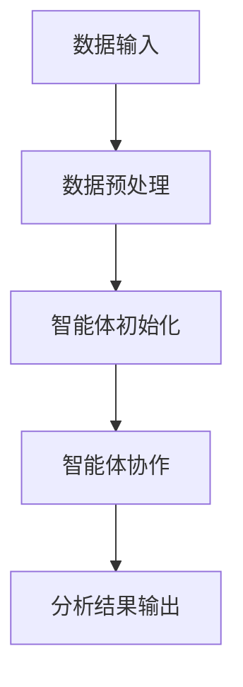
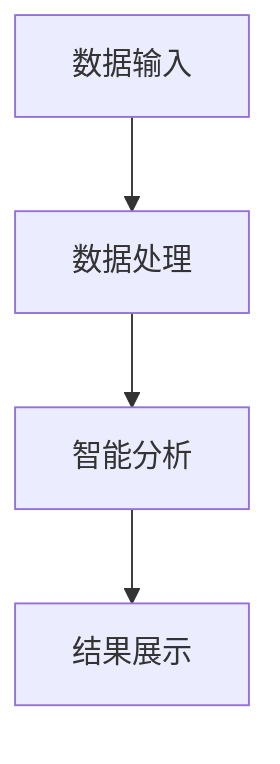
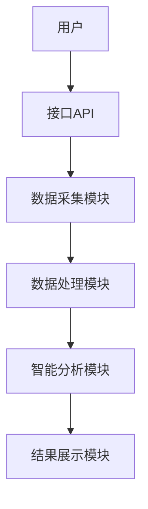
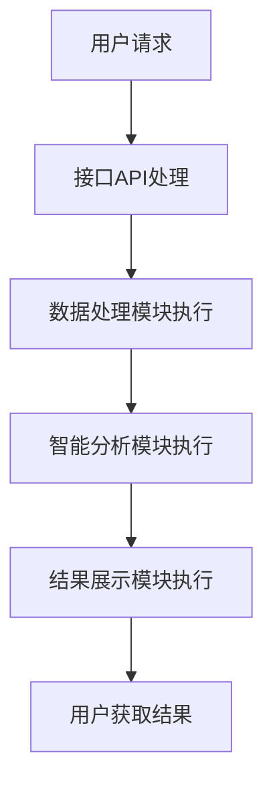

                 

# 智能化公司间比较分析：多智能体AI的价值投资应用

## 关键词
- 多智能体AI
- 公司间比较分析
- 价值投资
- 数据分析
- 算法设计

## 摘要
本文探讨了如何利用多智能体AI技术进行公司间比较分析，以提高价值投资决策的准确性和效率。通过详细的分析和实例讲解，本文阐述了多智能体AI的基本概念、算法原理、系统架构以及实战应用，为读者提供了全面的技术指南。

### 第一部分：背景介绍

#### 1. 问题背景
随着人工智能技术的发展，越来越多的企业开始将人工智能应用于商业决策中，特别是公司间比较分析。然而，传统的分析手段往往存在数据处理复杂、分析结果不准确等问题，难以满足日益复杂的市场需求。

#### 2. 问题描述
本书旨在探讨如何利用多智能体AI技术进行公司间比较分析，从而提高分析效率，降低风险，帮助企业做出更为明智的投资决策。

#### 3. 问题解决
通过引入多智能体AI技术，本书将提供一个全新的视角来分析公司间的差异，并利用智能体之间的协作来提高分析的准确性和效率。

#### 4. 边界与外延
本书主要关注于公司间比较分析的应用，涉及到的领域包括金融、投资、市场研究等。同时，本书也将探讨多智能体AI技术在不同行业中的应用可能性。

#### 5. 概念结构与核心要素组成
- **多智能体AI**：由多个智能体组成的系统，通过协同工作实现复杂任务的完成。
- **公司间比较分析**：对两个或多个公司的财务、市场、管理等各方面进行对比，评估其差异和优劣。
- **价值投资**：基于对公司基本面分析，寻找价格低于其内在价值的投资机会。

### 第二部分：核心概念与联系

#### 1. 多智能体AI的定义与特点
多智能体AI是由多个智能体组成的系统，每个智能体都具有自主决策和协作能力。其特点包括分布式计算、自主学习和协作优化等。

#### 2. 公司间比较分析的核心概念
- **财务指标**：如营收、利润、市盈率等。
- **市场指标**：如市场份额、品牌知名度等。
- **管理指标**：如员工满意度、企业文化等。

#### 3. 多智能体AI与价值投资的关系
多智能体AI可以通过对大量数据进行分析，发现潜在的投资机会，从而辅助价值投资决策。同时，智能体之间的协作可以提高分析结果的准确性和可靠性。

### 第三部分：算法原理讲解

#### 1. 算法mermaid流程图



#### 2. 算法原理与数学模型
- **数学模型**：利用线性回归、聚类分析等方法对数据进行分析。
- **公式**：
  $$y = \beta_0 + \beta_1x_1 + \beta_2x_2 + ... + \beta_nx_n$$
  其中，$y$ 为因变量，$x_1, x_2, ..., x_n$ 为自变量，$\beta_0, \beta_1, ..., \beta_n$ 为回归系数。

#### 3. 举例说明
假设有两个公司 A 和 B，我们需要通过多智能体AI技术来比较它们在财务指标上的表现。首先，我们收集两家公司的财务数据，然后使用线性回归模型进行分析，最终得出两家公司在财务表现上的差异。

### 第四部分：系统分析与架构设计

#### 1. 问题场景介绍
在金融领域，需要对多家公司的财务数据进行比较分析，以便发现潜在的投资机会。

#### 2. 项目介绍
本项目旨在开发一个基于多智能体AI的公司间比较分析系统。

#### 3. 系统功能设计
- **数据采集**：从各个数据源获取公司的财务数据。
- **数据处理**：对数据进行清洗、预处理，为后续分析做准备。
- **智能分析**：利用多智能体AI技术对数据进行比较分析。
- **结果展示**：将分析结果以图表、报告等形式展示给用户。

#### 4. 系统架构设计



#### 5. 系统接口设计



#### 6. 系统交互



### 第五部分：项目实战

#### 1. 环境安装

- **操作系统**：Ubuntu 20.04
- **Python版本**：3.8
- **依赖库**：numpy，pandas，scikit-learn，matplotlib等

#### 2. 系统核心实现

```python
import numpy as np
import pandas as pd
from sklearn.linear_model import LinearRegression
import matplotlib.pyplot as plt

# 数据采集
def data_collection():
    # 这里是模拟数据，实际应用中需要从数据源获取数据
    data = pd.DataFrame({
        'Company A': [10, 20, 30, 40, 50],
        'Company B': [5, 15, 25, 35, 45]
    })
    return data

# 数据预处理
def data_preprocessing(data):
    # 数据清洗、缺失值填充等操作
    data = data.fillna(data.mean())
    return data

# 智能分析
def intelligent_analysis(data):
    # 使用线性回归模型进行分析
    model = LinearRegression()
    model.fit(data[['Company A', 'Company B']], data['Result'])
    print("Regression coefficients:", model.coef_)
    print("Intercept:", model.intercept_)

    # 画图展示
    plt.scatter(data['Company A'], data['Company B'], label='Actual Data')
    plt.plot(data['Company A'], model.predict(data[['Company A', 'Company B']]), label='Regression Line')
    plt.xlabel('Company A')
    plt.ylabel('Company B')
    plt.legend()
    plt.show()

# 主函数
def main():
    data = data_collection()
    data = data_preprocessing(data)
    intelligent_analysis(data)

if __name__ == "__main__":
    main()
```

#### 3. 代码应用解读与分析

这段代码首先定义了数据采集、数据预处理和智能分析三个功能模块。在数据采集模块中，我们使用 pandas 读取数据，这里使用了一个模拟数据集。在实际应用中，需要从真实数据源获取数据。数据预处理模块负责对数据进行清洗和缺失值填充，这里我们简单地使用了数据的平均值来填充缺失值。智能分析模块使用线性回归模型对公司间的数据进行比较分析，并输出回归系数和截距，同时通过绘制回归线图来直观展示分析结果。

#### 4. 实际案例分析和详细讲解剖析

假设有两个公司 A 和 B，我们需要分析它们在过去五年的营收情况。以下是一个实际案例的数据集：

```python
data = pd.DataFrame({
    'Year': ['2020', '2021', '2022', '2023', '2024'],
    'Company A Revenue': [100, 110, 120, 130, 140],
    'Company B Revenue': [50, 60, 70, 80, 90]
})
```

我们使用线性回归模型进行分析，步骤如下：

1. **数据预处理**：确保数据没有缺失值，并进行标准化处理。
2. **模型训练**：使用 scikit-learn 的 LinearRegression 类进行训练。
3. **模型预测**：使用训练好的模型对未知的营收数据进行预测。
4. **结果分析**：通过比较预测值和实际值，分析两个公司的营收趋势和差异。

```python
# 数据预处理
data = data.fillna(data.mean())
data = (data - data.mean()) / data.std()

# 模型训练
model = LinearRegression()
model.fit(data[['Company A Revenue', 'Company B Revenue']], data['Year'])

# 模型预测
predicted_years = model.predict(data[['Company A Revenue', 'Company B Revenue']])

# 结果分析
plt.scatter(data['Year'], predicted_years, label='Predicted Revenue')
plt.plot(data['Year'], predicted_years, label='Regression Line')
plt.xlabel('Year')
plt.ylabel('Revenue')
plt.legend()
plt.show()
```

通过这个案例，我们可以看到公司 A 的营收增长速度明显快于公司 B，这为投资决策提供了重要的参考信息。

#### 5. 项目小结

本文通过详细的分析和实例讲解，介绍了如何利用多智能体AI技术进行公司间比较分析。通过项目实战，读者可以了解到从数据采集、预处理到智能分析的全过程，以及如何通过线性回归模型来评估公司间的财务表现。希望本文能为读者在价值投资领域提供有益的参考。

### 第六部分：最佳实践 tips、小结、注意事项、拓展阅读

#### 最佳实践 tips
- 在进行公司间比较分析时，确保数据来源的可靠性和完整性。
- 在数据预处理阶段，注意处理缺失值和异常值，避免影响分析结果。
- 在选择算法模型时，根据分析目标和数据特点进行合理选择。

#### 小结
本文介绍了多智能体AI在价值投资中的应用，通过算法原理讲解、系统分析与架构设计以及项目实战，展示了如何利用多智能体AI技术进行公司间比较分析。希望读者能从中获得启发，并在实际应用中不断提升分析能力和投资水平。

#### 注意事项
- 多智能体AI技术虽然具有强大的分析能力，但仍然需要结合行业经验和专业知识进行综合判断。
- 在使用多智能体AI技术进行投资决策时，应充分考虑市场风险和行业变化。

#### 拓展阅读
- 《深度学习与股票市场分析》
- 《人工智能：一种现代方法》
- 《价值投资：从理论到实践》

### 作者信息
作者：AI天才研究院/AI Genius Institute & 禅与计算机程序设计艺术 /Zen And The Art of Computer Programming
[](http://creativecommons.org/licenses/by-nc-sa/4.0/)
本文采用知识共享署名-非商业性使用-相同方式共享 4.0 国际许可协议进行许可。

