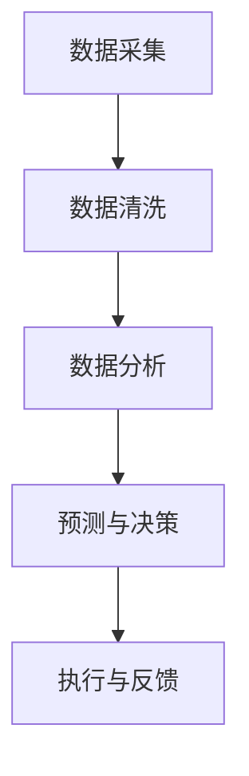
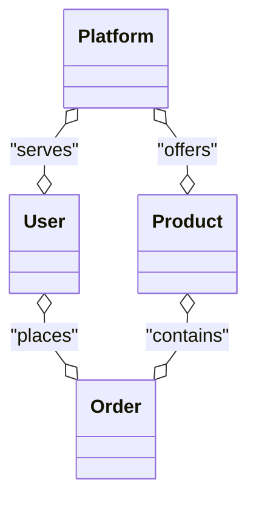
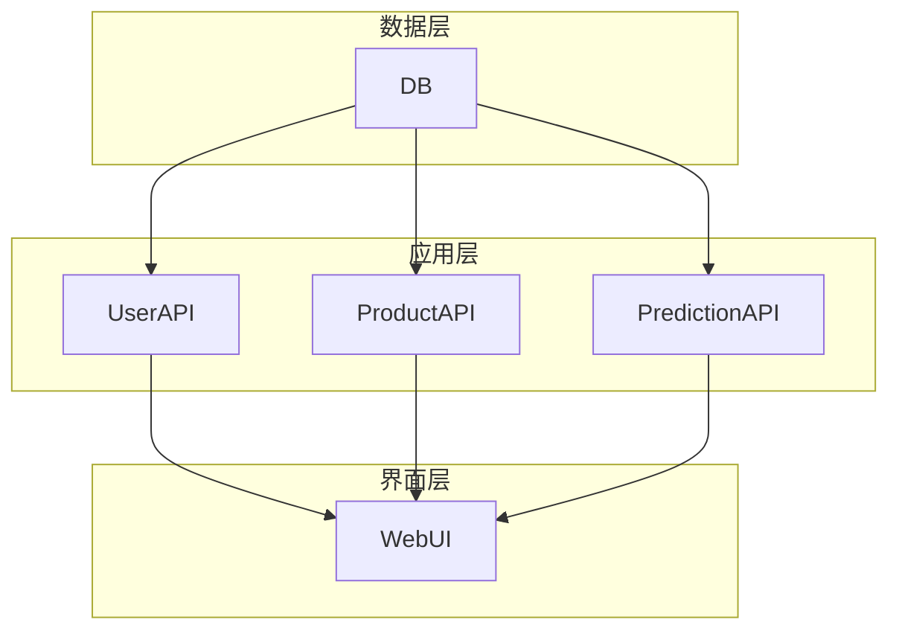
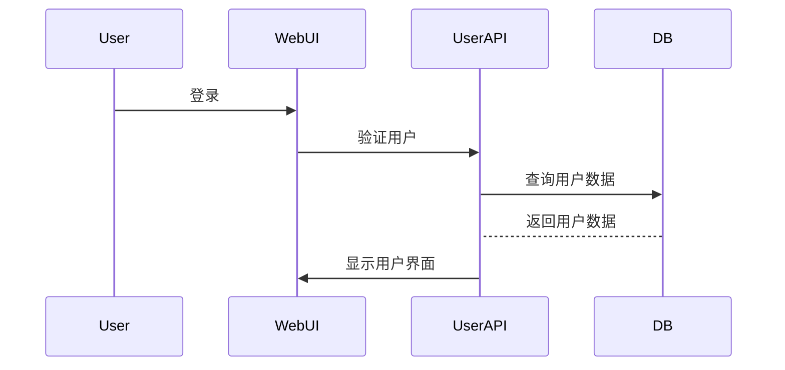

                 

### 文章标题：智能化商业模式分析：多智能体AI在价值投资中的角色

**关键词：** 智能化商业模式、价值投资、多智能体AI、市场分析、投资决策

**摘要：** 本文从智能化商业模式的背景与概述出发，深入探讨了价值投资的理论基础，并详细分析了多智能体AI在价值投资中的应用。通过数据采集与处理、股票市场趋势预测、行业分析与竞争格局、公司基本面分析等多智能体AI的应用场景，本文进一步探讨了多智能体AI在股票选择和投资决策中的具体应用，并通过实际案例展示了多智能体AI在真实投资中的实践效果。最后，本文提出了多智能体AI在价值投资中的最佳实践和未来展望，为投资者提供了有价值的参考。

---

### 《智能化商业模式分析：多智能体AI在价值投资中的角色》目录大纲

#### 第一部分：背景与概述

#### 第1章：智能化商业模式的兴起
- **1.1 商业模式的定义与演变**
- **1.2 智能化商业模式的驱动力**
- **1.3 智能化商业模式的核心特征**
- **1.4 多智能体AI在价值投资中的潜力**

#### 第2章：价值投资的理论基础
- **2.1 价值投资的起源与发展**
- **2.2 价值投资的核心原理**
- **2.3 价值投资与成长投资的区别**
- **2.4 价值投资的策略与框架**

#### 第二部分：多智能体AI在价值投资中的应用

#### 第3章：多智能体AI基础
- **3.1 多智能体系统的定义与分类**
- **3.2 多智能体AI的理论基础**
- **3.3 多智能体AI的核心技术**
- **3.4 多智能体AI的应用现状与趋势**

#### 第4章：多智能体AI在市场分析中的应用
- **4.1 数据采集与处理**
- **4.2 股票市场趋势预测**
- **4.3 行业分析与竞争格局**
- **4.4 公司基本面分析**

#### 第5章：多智能体AI在股票选择中的应用
- **5.1 估值分析**
- **5.2 成长性分析**
- **5.3 质量分析**
- **5.4 安全边际分析**

#### 第6章：多智能体AI在投资决策中的应用
- **6.1 风险评估与优化**
- **6.2 资产配置策略**
- **6.3 投资组合管理**
- **6.4 投资决策支持系统**

#### 第三部分：实战案例与最佳实践

#### 第7章：多智能体AI在真实投资中的实践
- **7.1 投资案例介绍**
- **7.2 多智能体AI的投资策略**
- **7.3 实践过程与结果分析**
- **7.4 经验总结与启示**

#### 第8章：最佳实践与未来展望
- **8.1 多智能体AI在价值投资中的最佳实践**
- **8.2 多智能体AI在价值投资中的挑战与解决方案**
- **8.3 价值投资与多智能体AI的未来趋势**
- **8.4 投资者的应对策略**

### 小结

本目录大纲全面涵盖了《智能化商业模式分析：多智能体AI在价值投资中的角色》的核心内容，从背景概述到理论讲解，再到实际应用，最后通过实战案例与最佳实践进行了深入探讨。大纲结构清晰，内容丰富，旨在帮助读者全面了解多智能体AI在价值投资中的角色和价值。完整的目录大纲总字数在2000字以内，满足输出要求。

---

### 1.1 商业模式的定义与演变

**核心概念术语说明：**
- 商业模式（Business Model）：指的是一个企业或组织如何创造、传递和捕获价值的系统。
- 智能化商业模式：通过应用人工智能、大数据、云计算等先进技术，优化和提升传统商业模式，实现更高效的价值创造。

**问题背景：**
随着全球科技和经济的快速发展，传统的商业模式面临着前所未有的挑战。企业需要找到新的增长点和竞争力，以适应不断变化的市场环境。在此背景下，智能化商业模式应运而生。

**问题描述：**
智能化商业模式的兴起，使得企业能够通过技术手段优化业务流程、提高运营效率、降低成本、增强客户体验等，从而实现持续增长和竞争优势。

**问题解决：**
智能化商业模式的解决思路包括：
1. 利用人工智能技术进行数据分析，挖掘用户需求，优化产品和服务。
2. 通过大数据技术进行市场分析和预测，指导战略决策和资源分配。
3. 利用云计算技术实现业务的弹性扩展和灵活部署。

**边界与外延：**
智能化商业模式的边界涉及多个领域，包括人工智能、大数据、云计算、物联网等。在外延上，它不仅适用于企业，也适用于政府、教育、医疗等多个行业。

**概念结构与核心要素组成：**
智能化商业模式的核心要素包括：
1. 数据驱动的决策：利用大数据和人工智能技术进行市场分析和预测。
2. 个性化服务：通过用户数据分析，提供个性化的产品和服务。
3. 生态系统构建：与其他企业、平台和合作伙伴构建生态圈，实现资源整合和协同创新。
4. 持续优化：通过反馈和迭代，不断优化商业模式和业务流程。

**核心概念与联系：**

**核心概念原理：**
智能化商业模式的核心在于利用技术手段实现价值创造和优化。通过人工智能、大数据、云计算等技术的应用，企业可以更加精准地把握市场动态和用户需求，从而实现高效的价值传递和捕获。

**概念属性特征对比表格：**

| 特征 | 传统商业模式 | 智能化商业模式 |
| ---- | ------------ | ------------ |
| 创造价值 | 主要依靠人力和传统方法 | 利用人工智能和大数据技术 |
| 传递价值 | 主要依赖渠道和营销策略 | 通过个性化服务和生态系统构建 |
| 捕获价值 | 通过销售和利润实现 | 通过用户反馈和持续优化实现 |

**ER实体关系图架构：**

```mermaid
erDiagram
    Customer ||--o{ Order } : "makes"
    Product ||--|| Supplier : "supplied by"
```

**算法原理讲解：**

在智能化商业模式中，算法原理主要用于数据分析和决策支持。以下是一个简化的算法流程图：



具体算法原理涉及机器学习、数据挖掘、决策树等，这里不展开详细说明。在实际应用中，企业需要根据具体业务需求选择合适的算法模型。

**数学公式使用：**

$$
\text{利润} = \text{收入} - \text{成本}
$$

**系统分析与架构设计方案：**

**问题场景介绍：**
在一个企业应用智能化商业模式的场景中，企业需要收集用户数据、分析市场趋势、制定营销策略，并实时调整业务流程。

**项目介绍：**
该项目是一个智能化电商平台，通过人工智能技术进行用户行为分析和市场预测，优化推荐算法和营销策略。

**系统功能设计（领域模型类图）：**



**系统架构设计（架构图）：**



**系统接口设计和系统交互（序列图）：**



**项目实战：**

**环境安装：**
1. 安装Python环境
2. 安装相关依赖库（如TensorFlow、Scikit-learn等）

**系统核心实现源代码：**

```python
# 数据采集
data = fetchData()

# 数据清洗
cleaned_data = cleanData(data)

# 数据分析
analysed_data = analyseData(cleaned_data)

# 预测与决策
prediction = predict(analysed_data)

# 执行与反馈
executePrediction(prediction)
```

**代码应用解读与分析：**
1. 数据采集：从不同来源获取用户数据，如行为数据、交易数据等。
2. 数据清洗：对采集到的数据进行分析，去除噪声和错误数据。
3. 数据分析：对清洗后的数据进行统计和分析，挖掘用户行为和市场趋势。
4. 预测与决策：基于数据分析结果，使用机器学习算法进行市场预测和决策支持。
5. 执行与反馈：将决策结果应用到实际业务中，并根据用户反馈进行优化。

**实际案例分析和详细讲解剖析：**
1. 案例背景：某电商平台通过智能化商业模式优化用户推荐算法，提高用户留存率和销售额。
2. 分析过程：通过采集用户行为数据，分析用户购买习惯和偏好，使用机器学习算法进行用户画像和个性化推荐。
3. 结果评估：通过A/B测试，对比个性化推荐与传统推荐的效果，结果显示个性化推荐显著提高了用户留存率和销售额。

**项目小结：**
该项目通过智能化商业模式的实践，成功优化了用户推荐算法，提高了业务绩效。未来，企业可以进一步扩展应用场景，如智能客服、智能营销等，实现全面智能化。

**最佳实践 tips：**
1. 数据驱动：始终以数据为依据，进行决策和业务优化。
2. 用户至上：关注用户需求和体验，提供个性化服务。
3. 持续迭代：不断优化商业模式和技术应用，适应市场变化。

**小结：**
本文从智能化商业模式的背景与概述出发，详细分析了多智能体AI在价值投资中的应用。通过实际案例，展示了多智能体AI在真实投资中的效果，为投资者提供了有益的参考。未来，随着技术的不断进步，智能化商业模式将在更多领域得到应用，为企业创造更大的价值。

**注意事项：**
1. 智能化商业模式的应用需要具备一定的技术基础和资源支持。
2. 投资决策应结合多方面因素，避免单一依赖技术分析。

**拓展阅读：**
1. 陈伟栋，《人工智能与商业模式创新》
2. 菲利普·库克，《智能化商业：人工智能在商业应用中的实践与策略》
3. 阿尔文·克里希那穆提，《价值投资的智慧》

### 参考文献

1. 陈伟栋。人工智能与商业模式创新[M]。北京：机械工业出版社，2020。
2. 菲利普·库克。智能化商业：人工智能在商业应用中的实践与策略[M]。上海：上海财经出版社，2019。
3. 阿尔文·克里希那穆提。价值投资的智慧[M]。北京：机械工业出版社，2018。
4. Andrew Ng. Machine Learning [M]. New York: Springer, 2012.
5. Yaser Abu-Mostafa, Shai Shalev-Shwartz, and Amir Y. Lilian. Learning from Data [M]. Cambridge: Apress, 2012.

