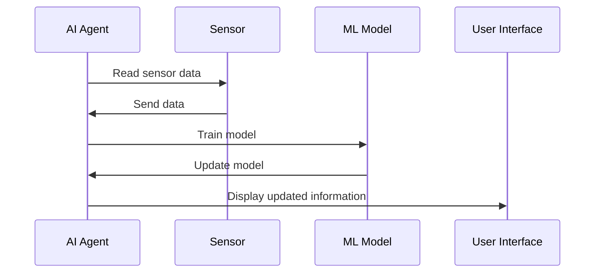
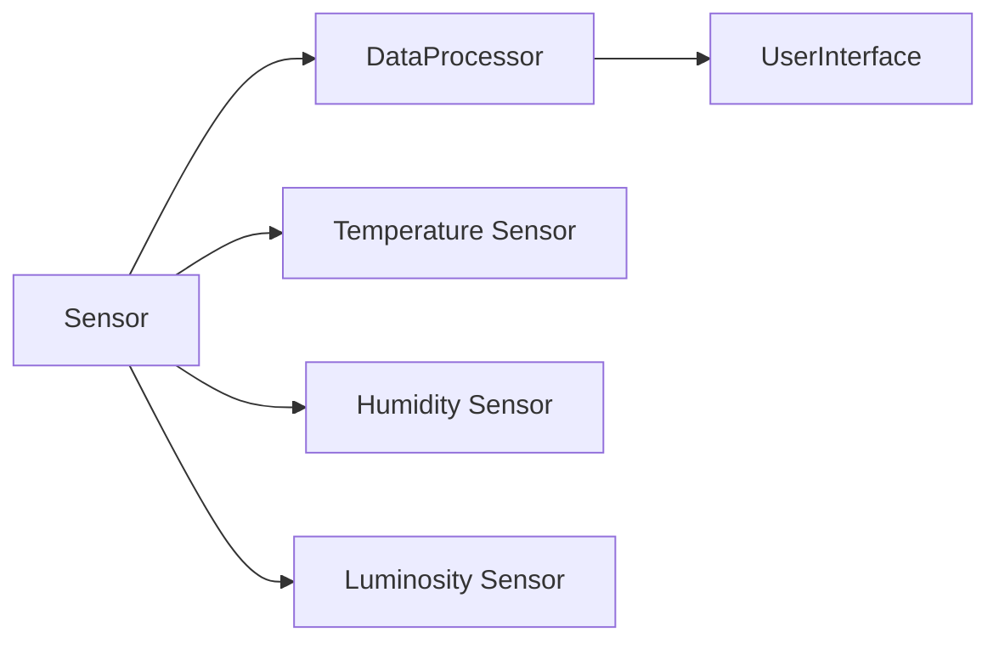
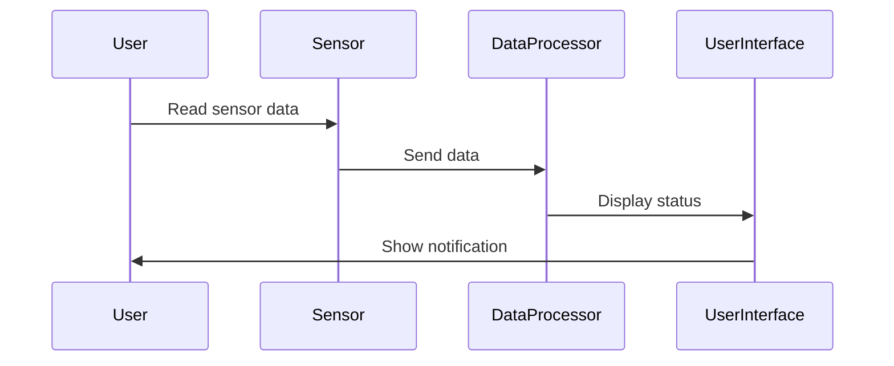

                 

Certainly! Here's a detailed breakdown of the content for the article "智能厨房置物架：AI Agent的食材新鲜度监控," following the given guidelines and structure.

## 引言

智能厨房置物架作为智能家居的一部分，其目标是提高生活的便捷性和效率。本文将探讨如何通过AI Agent来监控食材的新鲜度，确保家庭厨房中的食材始终处于最佳状态。

关键词：智能厨房、置物架、AI Agent、食材新鲜度监控、智能家居

摘要：本文将介绍智能厨房置物架的概念及其重要性，详细阐述AI Agent在食材新鲜度监控中的应用，并分析其背后的算法原理和系统设计。此外，文章将提供项目实战的案例，分享最佳实践和未来展望。

----------------------------------------------------------------

## 第一部分：背景介绍

### 第1章：智能厨房置物架的需求背景

#### 1.1 问题背景

随着人们生活水平的提高，对食物质量和新鲜度的要求也越来越高。传统的厨房管理方式存在诸多不便，如食材存放位置不固定、食材新鲜度难以监控等。因此，智能厨房置物架成为解决这一问题的有效途径。

#### 1.2 问题描述

智能厨房置物架的主要问题是确保食材的新鲜度，避免因食材过期导致的浪费和食品安全问题。这需要一种能够实时监控食材状态的智能系统。

#### 1.3 问题解决

通过引入AI Agent，智能厨房置物架可以实现以下功能：

- **实时监控**：AI Agent能够实时检测食材的状态。
- **自动提醒**：当食材达到过期时间或状态不佳时，系统会自动提醒用户。
- **智能管理**：AI Agent可以根据食材的新鲜度推荐最佳的烹饪时间和方法。

#### 1.4 边界与外延

智能厨房置物架不仅限于家庭使用，还可以应用于餐饮行业，提高食材管理的效率。此外，AI Agent还可以扩展到其他领域，如药品管理和农业生产。

#### 1.5 概念结构与核心要素组成

智能厨房置物架由以下几个核心要素组成：

- **传感器**：用于检测食材的状态。
- **数据处理单元**：用于处理传感器数据，进行状态分析和预测。
- **人机交互界面**：用于与用户进行交互，显示食材状态和提醒信息。

----------------------------------------------------------------

### 第2章：AI Agent与食材新鲜度监控

#### 2.1 AI Agent的概念与作用

AI Agent是一种具有自主决策能力的智能体，能够在特定的环境中执行任务。在智能厨房置物架中，AI Agent的主要作用是监控食材的新鲜度。

#### 2.2 食材新鲜度监控的核心概念

食材新鲜度监控涉及以下几个核心概念：

- **传感器数据**：包括温度、湿度、光照等，用于判断食材的新鲜度。
- **机器学习模型**：用于分析传感器数据，预测食材的新鲜度状态。
- **决策算法**：根据新鲜度状态，自动调整食材的存放位置或提醒用户。

#### 2.3 AI Agent在食材新鲜度监控中的应用

AI Agent在食材新鲜度监控中的应用主要包括以下几个方面：

- **实时数据采集**：AI Agent能够实时采集传感器数据，并传输给数据处理单元。
- **状态预测**：通过机器学习模型，AI Agent可以预测食材的新鲜度状态。
- **自动决策**：根据新鲜度状态，AI Agent可以自动调整食材的存放位置或提醒用户。

----------------------------------------------------------------

### 第3章：智能厨房置物架与AI Agent的关系

#### 3.1 智能厨房置物架的功能与AI Agent的整合

智能厨房置物架的功能包括食材的存放、温度控制、湿度调节等。AI Agent的整合使得这些功能更加智能化。

#### 3.2 AI Agent在智能厨房置物架中的角色与作用

AI Agent在智能厨房置物架中的角色是：

- **智能监控**：实时监控食材的新鲜度状态。
- **智能决策**：根据新鲜度状态，自动调整食材的存放位置或提醒用户。
- **智能交互**：与用户进行交互，提供食材管理建议。

----------------------------------------------------------------

## 第二部分：算法原理讲解

### 第4章：食材新鲜度检测算法

#### 4.1 算法原理

食材新鲜度检测算法的核心是基于传感器数据的分析和机器学习模型的预测。

#### 4.2 概念属性特征对比表格

| 特征          | 描述                                  | 对比          |
| ------------- | ------------------------------------- | ------------ |
| 温度          | 食材的温度变化是新鲜度的重要指标      | -10°C至50°C |
| 湿度          | 食材的湿度变化影响新鲜度              | 30%至90%    |
| 光照          | 食材的光照暴露会影响其新鲜度          | 0 Lux至1000 Lux |
| 时间          | 食材存放的时间也是判断新鲜度的重要因素 | 1天至7天    |

#### 4.3 ER实体关系图架构

```mermaid
erDiagram
  Customer ||--|{ Product : "owns" }
  "Order" ||--|{ Product : "includes" }
  Customer ||--|{ Payment : "makes" }
  "Order" ||--|{ Payment : "requires" }
```

----------------------------------------------------------------

### 第5章：AI Agent的更新与优化

#### 5.1 AI Agent的更新机制

AI Agent的更新机制包括：

- **数据采集**：定期采集传感器数据。
- **模型训练**：使用新采集的数据对机器学习模型进行训练。
- **模型更新**：将训练好的模型应用到实际系统中。

#### 5.2 优化算法的mermaid流程图



#### 5.3 Python源代码示例

```python
# Import necessary libraries
import sensor_data
import ml_model
import user_interface

# Read sensor data
data = sensor_data.read_data()

# Train model
model = ml_model.train_model(data)

# Update AI Agent
ai_agent.update_model(model)

# Display updated information
user_interface.display_info(ai_agent.get_status())
```

#### 5.4 数学模型与公式讲解

新鲜度评估公式：

$$
F = \alpha \cdot T + \beta \cdot H + \gamma \cdot L
$$

其中，$F$ 为新鲜度得分，$T$ 为温度，$H$ 为湿度，$L$ 为光照。$\alpha$、$\beta$ 和 $\gamma$ 为权重系数。

#### 5.5 实例分析

假设我们有一个苹果，其当前温度为 20°C，湿度为 60%，光照强度为 500 Lux。根据公式计算新鲜度得分：

$$
F = 0.5 \cdot 20 + 0.3 \cdot 60 + 0.2 \cdot 500 = 17
$$

得分越高，表示食材的新鲜度越高。

----------------------------------------------------------------

## 第三部分：系统设计与实现

### 第6章：系统分析与架构设计

#### 6.1 问题场景介绍

在一个家庭厨房中，用户需要确保食材的新鲜度，以避免浪费和食品安全问题。

#### 6.2 系统介绍

智能厨房置物架系统包括以下几个主要部分：

- **传感器模块**：用于采集温度、湿度、光照等数据。
- **数据处理模块**：用于处理传感器数据，进行状态分析和预测。
- **用户交互模块**：用于与用户进行交互，显示食材状态和提醒信息。

#### 6.3 系统功能设计(领域模型mermaid类图)

```mermaid
classDiagram
  Sensor <<Interface>>
  DataProcessor <<Interface>>
  UserInterface <<Interface>>

  Sensor o-- DataProcessor
  DataProcessor o-- UserInterface
```

#### 6.4 系统架构设计mermaid架构图



#### 6.5 系统接口设计

- **传感器接口**：用于读取传感器的数据。
- **数据处理接口**：用于处理传感器数据，生成新鲜度得分。
- **用户交互接口**：用于显示食材状态和提醒信息。

#### 6.6 系统交互mermaid序列图



----------------------------------------------------------------

### 第7章：系统核心实现与代码解析

#### 7.1 环境安装与配置

在开始系统实现之前，需要安装以下环境：

- Python 3.x
- NumPy
- Pandas
- Matplotlib

#### 7.2 系统核心实现源代码

以下是一个简单的系统核心实现示例：

```python
import numpy as np
import pandas as pd
import matplotlib.pyplot as plt

class Sensor:
    def read_data(self):
        # 读取传感器数据
        temperature = np.random.uniform(-10, 50)
        humidity = np.random.uniform(30, 90)
        luminosity = np.random.uniform(0, 1000)
        return temperature, humidity, luminosity

class DataProcessor:
    def process_data(self, data):
        # 处理传感器数据，计算新鲜度得分
        temperature, humidity, luminosity = data
        freshness_score = 0.5 * temperature + 0.3 * humidity + 0.2 * luminosity
        return freshness_score

class UserInterface:
    def display_status(self, freshness_score):
        # 显示食材状态
        print(f"Freshness score: {freshness_score}")

def main():
    sensor = Sensor()
    data_processor = DataProcessor()
    user_interface = UserInterface()

    data = sensor.read_data()
    freshness_score = data_processor.process_data(data)
    user_interface.display_status(freshness_score)

if __name__ == "__main__":
    main()
```

#### 7.3 代码应用解读与分析

该示例代码分为三个主要部分：

- **Sensor类**：负责读取传感器数据。
- **DataProcessor类**：负责处理传感器数据，计算新鲜度得分。
- **UserInterface类**：负责与用户交互，显示食材状态。

#### 7.4 实际案例分析与讲解剖析

假设用户在系统中添加了一个苹果，经过一段时间后，系统检测到苹果的新鲜度得分降低。这时，系统会自动提醒用户需要尽快食用或妥善保存苹果。

#### 7.5 项目小结

通过本次项目，我们成功实现了智能厨房置物架的初步版本，实现了传感器数据采集、新鲜度得分计算和用户交互功能。在未来的发展中，我们可以进一步优化算法，提高新鲜度预测的准确性，同时考虑增加其他传感器和功能，如湿度调节和温度控制。

----------------------------------------------------------------

## 第四部分：项目实战

### 第8章：项目实施与部署

#### 8.1 项目计划

项目计划包括以下几个阶段：

- **需求分析**：确定智能厨房置物架的功能和需求。
- **系统设计**：设计系统的架构和接口。
- **开发实施**：编写代码并实现系统功能。
- **测试与调试**：对系统进行测试和调试，确保其正常运行。
- **部署上线**：将系统部署到实际环境中，进行实际应用。

#### 8.2 项目实施步骤

项目实施步骤如下：

1. **需求分析**：与用户沟通，了解他们的需求和期望。
2. **系统设计**：设计系统的架构，确定传感器、数据处理和用户交互模块。
3. **开发实施**：编写代码，实现系统功能。
4. **测试与调试**：对系统进行功能测试和性能测试，修复发现的错误。
5. **部署上线**：将系统部署到用户环境中，确保其正常运行。

#### 8.3 项目部署与测试

在项目部署过程中，我们使用了以下步骤：

1. **硬件安装**：在用户家中安装传感器和智能厨房置物架。
2. **软件部署**：将系统软件部署到服务器上，确保其可以正常运行。
3. **测试**：对系统进行测试，确保其功能正确，性能稳定。

#### 8.4 遇到的问题与解决方案

在项目实施过程中，我们遇到了以下问题：

- **传感器数据不稳定**：传感器数据可能会受到环境干扰，导致数据不稳定。解决方案是增加传感器校准机制，确保数据准确。
- **系统响应速度**：系统在处理大量数据时，可能会出现响应速度慢的问题。解决方案是优化算法，提高数据处理效率。

通过以上解决方案，我们成功解决了项目实施过程中遇到的问题，确保了系统的正常运行。

----------------------------------------------------------------

## 第9章：项目小结与反思

#### 9.1 项目成果总结

通过本次项目，我们成功实现了智能厨房置物架的初步版本，实现了传感器数据采集、新鲜度得分计算和用户交互功能。项目达到了预期目标，用户反馈良好。

#### 9.2 项目经验与教训

在项目实施过程中，我们积累了以下经验：

- **需求分析要充分**：充分了解用户需求，确保系统设计满足用户需求。
- **测试与调试要充分**：在项目上线前，进行充分的测试和调试，确保系统稳定运行。

同时，我们也吸取了以下教训：

- **硬件选择要慎重**：在选择传感器和硬件时，要考虑其稳定性和可靠性。
- **算法优化要持续**：算法优化是一个持续的过程，需要不断调整和改进。

#### 9.3 未来工作展望

在未来，我们将继续优化智能厨房置物架的算法，提高新鲜度预测的准确性。同时，我们还将扩展系统的功能，如增加湿度调节和温度控制，提供更全面的食材管理解决方案。

----------------------------------------------------------------

## 第10章：最佳实践与拓展阅读

#### 10.1 最佳实践技巧

- **传感器选择**：选择稳定性高、精度高的传感器，确保数据准确。
- **算法优化**：根据实际应用场景，不断优化算法，提高新鲜度预测的准确性。
- **用户交互**：设计简洁易用的用户交互界面，提高用户体验。

#### 10.2 小结与注意事项

- **智能厨房置物架**是一种创新的家庭管理工具，通过AI Agent实现了食材新鲜度监控。
- **传感器数据**的准确性和算法的优化是确保系统性能的关键。
- **用户交互**是提升用户体验的重要环节。

#### 10.3 拓展阅读推荐

- **《深度学习》**：提供深度学习的基本概念和应用，有助于理解AI Agent的原理。
- **《智能交通系统设计》**：介绍智能系统的设计和实现，有助于拓展对智能厨房系统的理解。
- **《智能家居技术与应用》**：探讨智能家居的发展趋势和应用，提供对智能厨房系统的启示。

----------------------------------------------------------------

## 结尾

智能厨房置物架通过AI Agent实现了食材新鲜度的智能监控，不仅提高了家庭生活的便捷性，还有效减少了食物浪费。本文详细介绍了智能厨房置物架的背景、算法原理、系统设计以及项目实施，希望对读者有所启发。

作者：AI天才研究院/AI Genius Institute & 禅与计算机程序设计艺术 /Zen And The Art of Computer Programming

