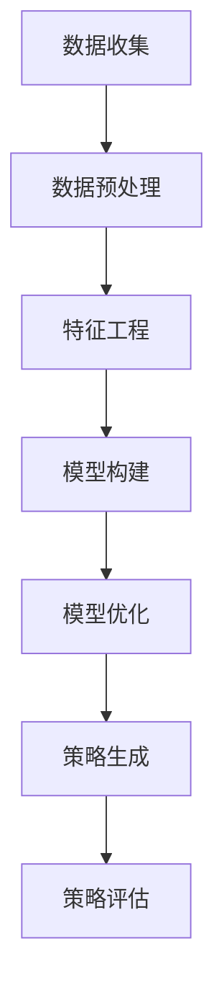
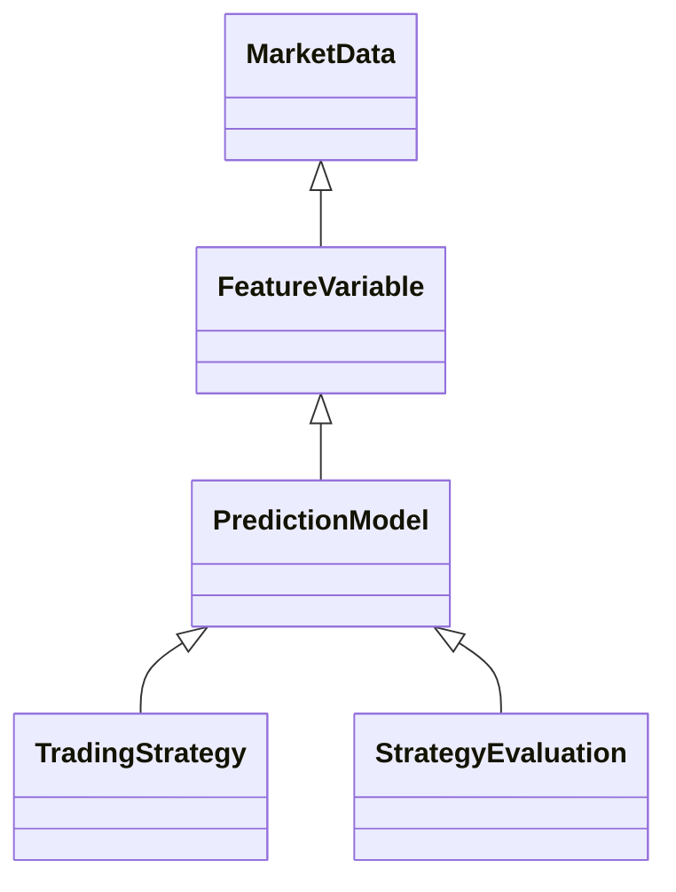
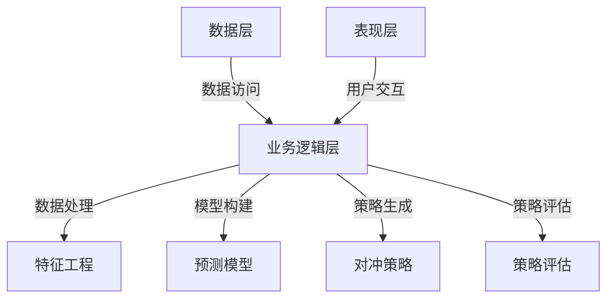
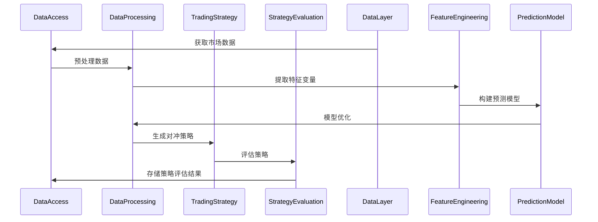
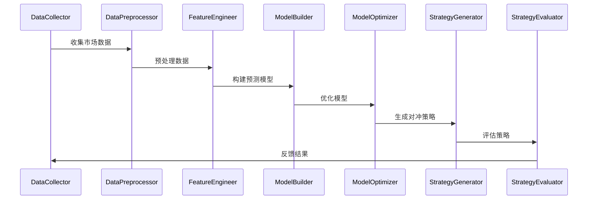

                 


# 智能外汇风险对冲策略优化系统

## 关键词
- 智能化
- 外汇风险
- 风险对冲
- 策略优化
- 系统架构

## 摘要
本文深入探讨了智能外汇风险对冲策略优化系统。首先，我们从外汇风险的定义及其对企业和个人投资的影响出发，介绍了风险对冲的基本概念。接着，我们探讨了智能化的优势，特别是在外汇风险对冲中的应用。本文的核心在于详细阐述优化系统的概念、核心算法原理及其实践应用，包括数学模型、Python源代码示例和实战案例。此外，我们还详细介绍了系统分析与架构设计方案，包括系统功能、架构、接口设计和交互流程。通过本文，读者将全面了解外汇风险对冲策略的智能化优化方法及其应用。

### 1. 背景介绍

外汇风险是指由于汇率波动导致的企业或个人财务状况发生变化的风险。在全球化的经济背景下，外汇风险已成为企业和个人投资活动中不可忽视的一环。企业跨国经营、国际贸易以及个人跨境投资等活动中，外汇汇率波动带来的不确定性往往带来巨大的财务风险。为了降低这种风险，外汇风险对冲策略成为企业和个人投资者的重要手段。

风险对冲的基本概念主要包括两个方面：对冲工具和对冲比例。对冲工具通常包括外汇期货、期权、货币互换等金融衍生品，它们能够在汇率不利变动时提供保护。对冲比例则是指投资者选择的对冲工具与投资资产的比例，对冲比例的设定直接影响到对冲效果和成本。

随着人工智能技术的快速发展，智能化的外汇风险对冲策略逐渐崭露头角。智能化风险对冲策略通过运用大数据分析、机器学习等技术，能够更加精准地预测汇率走势，优化对冲策略，提高风险管理的效率和效果。

优化系统在外汇风险对冲中起着至关重要的作用。优化系统通过数学模型和算法，对海量数据进行处理和分析，找出最佳的对冲策略。优化系统不仅能够提高对冲效率，还能够降低对冲成本，实现风险的有效管理。

### 2.1 风险对冲的核心概念

风险对冲是金融风险管理的重要手段，其核心在于通过采取一系列金融工具和策略，将潜在的风险转化为可管理的风险，从而保护企业和个人的财务稳定。风险对冲的核心概念主要包括对冲工具和对冲比例。

#### 2.1.1 对冲工具

对冲工具是风险对冲策略实施的基础，主要包括以下几种：

1. **外汇期货**：外汇期货是一种标准化合约，规定在未来特定时间以特定汇率买卖一定数量的货币。通过买卖外汇期货，企业或个人可以在现货市场上进行对冲操作，锁定汇率，降低汇率波动带来的风险。

2. **外汇期权**：外汇期权是一种赋予持有人在特定时间内以约定汇率购买或出售某种货币的权利，但不是义务的合约。外汇期权可以帮助企业或个人在汇率不利变动时进行对冲，同时保留了汇率有利变动时的收益机会。

3. **货币互换**：货币互换是一种金融合约，双方约定在未来交换一定数量的两种货币，通常用于企业跨境融资和投资活动中，通过货币互换，企业可以在固定汇率下管理汇率风险。

4. **外汇远期合约**：外汇远期合约是一种非标准化合约，规定在未来特定时间以约定汇率买卖一定数量的货币。与外汇期货相比，外汇远期合约更灵活，可以根据企业的具体需求进行定制。

#### 2.1.2 对冲比例

对冲比例是指投资者选择的对冲工具与投资资产的比例，对冲比例的设定直接影响到对冲效果和成本。合适的对冲比例需要考虑以下几个因素：

1. **风险偏好**：不同投资者对风险的承受能力不同，风险偏好较低的投资者可能会选择较高的对冲比例，以确保投资的安全性。

2. **市场波动性**：市场波动性越高，投资者可能需要更高的对冲比例来降低风险。

3. **投资期限**：投资期限较长的项目可能需要更高的对冲比例，因为长期汇率波动的不确定性较大。

4. **交易成本**：对冲工具的交易成本也是影响对冲比例的重要因素。较高交易成本可能会降低对冲的收益。

在实际操作中，投资者需要根据自身的风险偏好、市场状况和投资期限等因素，合理设定对冲比例，以达到最佳的风险对冲效果。

### 2.2 优化算法原理

优化算法在外汇风险对冲策略中扮演着关键角色。它通过分析大量市场数据，运用数学模型和统计方法，寻找出最优的对冲策略。优化算法的基本原理包括以下几个方面：

#### 2.2.1 算法概述

优化算法通常包括以下几个步骤：

1. **数据收集**：收集外汇市场的历史数据，包括汇率、交易量、波动率等指标。

2. **特征工程**：对收集到的数据进行预处理，提取出对汇率波动有显著影响的特征，如宏观经济指标、市场情绪指标等。

3. **模型构建**：基于收集到的特征数据，构建预测模型，如线性回归模型、时间序列模型、机器学习模型等。

4. **模型优化**：通过交叉验证等方法，调整模型参数，优化模型性能。

5. **策略生成**：根据优化后的模型，生成对冲策略，包括对冲工具的选择和对冲比例的设定。

6. **策略评估**：通过模拟交易，评估对冲策略的实际效果，包括对冲成本、风险覆盖率等指标。

#### 2.2.2 算法属性特征对比

不同优化算法在属性特征上存在差异，主要表现在以下几个方面：

1. **预测准确性**：不同算法在预测准确性上有所不同。例如，时间序列模型在处理连续时间数据时表现较好，而机器学习模型在处理复杂非线性关系时更具优势。

2. **计算效率**：一些算法如线性回归模型计算速度快，适用于大规模数据处理。而复杂的机器学习模型如深度学习模型计算量较大，适用于小规模数据。

3. **可解释性**：一些算法如线性回归模型具有良好的可解释性，用户可以清楚地了解模型的工作原理。而复杂的机器学习模型如深度学习模型往往具有“黑盒”特性，难以解释。

4. **适应能力**：一些算法如自适应滤波算法可以实时调整参数，适应市场变化。而传统的统计模型在应对市场剧烈波动时可能表现不佳。

#### 2.2.3 ER实体关系图架构

ER实体关系图是一种用于描述系统中实体及其关系的图形化工具。在外汇风险对冲策略优化系统中，ER实体关系图可以帮助我们理解系统中的各个实体及其相互关系。

以下是一个简化版的外汇风险对冲策略优化系统的ER实体关系图：

```mermaid
erDiagram
    MarketData -->|收集| DataPreprocessing
    DataPreprocessing -->|处理| FeatureEngineering
    FeatureEngineering -->|构建| PredictionModel
    PredictionModel -->|优化| ModelOptimization
    ModelOptimization -->|生成| TradingStrategy
    TradingStrategy -->|评估| StrategyEvaluation
```

在这个ER实体关系图中，MarketData表示市场数据，DataPreprocessing表示数据预处理，FeatureEngineering表示特征工程，PredictionModel表示预测模型，ModelOptimization表示模型优化，TradingStrategy表示交易策略，StrategyEvaluation表示策略评估。这些实体通过一系列的关系连接在一起，形成一个完整的风险对冲策略优化流程。

### 3.1 算法mermaid流程图

为了更直观地展示优化算法的流程，我们可以使用mermaid绘制算法的流程图。以下是一个简化版的外汇风险对冲策略优化算法的mermaid流程图：



在这个流程图中，A表示数据收集，B表示数据预处理，C表示特征工程，D表示模型构建，E表示模型优化，F表示策略生成，G表示策略评估。每个步骤都是在前一个步骤的基础上进行的，形成一个完整的优化流程。

#### 3.2 Python源代码

为了更好地理解优化算法的原理和实现，我们可以通过Python源代码来展示关键步骤。以下是一个简化版的外汇风险对冲策略优化系统的Python源代码示例：

```python
import numpy as np
import pandas as pd
from sklearn.linear_model import LinearRegression
from sklearn.model_selection import train_test_split
from sklearn.metrics import mean_squared_error

# 数据收集
market_data = pd.read_csv('market_data.csv')

# 数据预处理
market_data = market_data.dropna()
X = market_data[['macro_economy', 'market_sentiment']]
y = market_data['exchange_rate']

# 特征工程
X_train, X_test, y_train, y_test = train_test_split(X, y, test_size=0.2, random_state=42)

# 模型构建
model = LinearRegression()
model.fit(X_train, y_train)

# 模型优化
predictions = model.predict(X_test)
mse = mean_squared_error(y_test, predictions)
print("Model Mean Squared Error:", mse)

# 策略生成
# （根据预测结果生成对冲策略）

# 策略评估
# （评估策略的实际效果）
```

在这个示例中，我们首先通过读取市场数据，进行数据预处理，提取出特征变量和目标变量。然后，我们使用线性回归模型进行模型构建，并通过训练集和测试集对模型进行评估。最后，我们根据模型的预测结果生成对冲策略，并评估策略的实际效果。

#### 3.3 数学模型和公式

优化算法的核心在于数学模型和公式的应用。以下是一个简化版的外汇风险对冲策略优化系统的数学模型和公式：

$$
\text{预测汇率} = \text{w}_0 + \sum_{i=1}^{n} \text{w}_i \cdot \text{x}_i
$$

其中，$w_0$是截距，$w_i$是权重，$x_i$是特征变量。这个公式表示了模型如何根据输入的特征变量预测汇率。

在实际应用中，我们还需要考虑模型的参数调整和优化。以下是一个简化版的模型参数优化公式：

$$
\text{最优参数} = \arg\min_{w} \sum_{i=1}^{n} (\text{预测汇率}_i - \text{实际汇率}_i)^2
$$

其中，$w$是模型的参数，$\text{预测汇率}_i$是模型对第$i$个样本的预测结果，$\text{实际汇率}_i$是第$i$个样本的实际汇率。这个公式表示了如何通过最小化预测误差来优化模型的参数。

#### 3.4 举例说明

为了更好地理解优化算法的应用，我们可以通过一个简单的案例来展示其过程和结果。

假设我们有一组市场数据，包括宏观经济指标和市场情绪指标。我们的目标是预测未来一个月的汇率变动。

首先，我们通过数据收集和预处理，提取出特征变量和目标变量：

```python
import pandas as pd

# 示例数据
data = {
    'macro_economy': [100, 110, 120, 130, 140],
    'market_sentiment': [20, 25, 30, 28, 32],
    'exchange_rate': [1.2, 1.25, 1.3, 1.28, 1.35]
}

df = pd.DataFrame(data)

# 数据预处理
X = df[['macro_economy', 'market_sentiment']]
y = df['exchange_rate']
```

接下来，我们使用线性回归模型进行模型构建和优化：

```python
from sklearn.linear_model import LinearRegression
from sklearn.model_selection import train_test_split

# 模型构建
model = LinearRegression()
X_train, X_test, y_train, y_test = train_test_split(X, y, test_size=0.2, random_state=42)

# 模型优化
model.fit(X_train, y_train)
predictions = model.predict(X_test)
mse = mean_squared_error(y_test, predictions)
print("Model Mean Squared Error:", mse)
```

在这个案例中，我们通过最小二乘法优化线性回归模型的参数，得到最优模型。通过测试集的预测误差，我们可以评估模型的性能。

最后，我们使用优化后的模型进行预测，得到未来一个月的汇率变动预测结果：

```python
# 预测未来一个月汇率
future_data = pd.DataFrame({'macro_economy': [150, 160], 'market_sentiment': [35, 40]})
future_predictions = model.predict(future_data)
print("Future Exchange Rate Predictions:", future_predictions)
```

通过这个案例，我们可以看到优化算法如何通过数学模型和公式，实现对市场数据的分析和预测。在实际应用中，我们可以根据具体情况调整特征变量和模型参数，提高预测的准确性和可靠性。

### 4.1 问题场景介绍

在外汇市场中，一家跨国公司A需要经常与海外客户进行货币交易，以结算货款和支付费用。公司A的业务涵盖了多个国家和地区，因此其外汇交易涉及多种货币对，如美元/欧元、美元/日元等。由于汇率波动的不确定性，公司A面临外汇风险，这种风险可能导致其财务状况的波动，影响公司的经营稳定。

为了降低外汇风险，公司A决定采用智能化的外汇风险对冲策略优化系统。该系统的目标是通过对历史市场数据的分析，预测未来汇率走势，并生成最优的对冲策略，以最大限度地降低外汇风险，同时控制对冲成本。

### 4.2 系统功能设计

#### 4.2.1 领域模型

在智能外汇风险对冲策略优化系统中，领域模型定义了系统的主要实体及其关系。以下是系统的主要实体和它们之间的关联：

1. **市场数据**：包括汇率、交易量、波动率等指标，是系统分析的基础。
2. **特征变量**：从市场数据中提取的重要指标，如宏观经济指标、市场情绪指标等，用于构建预测模型。
3. **预测模型**：基于特征变量构建的数学模型，用于预测未来汇率走势。
4. **对冲策略**：根据预测模型生成的对冲方案，包括对冲工具的选择和对冲比例的设定。
5. **策略评估**：对生成的对冲策略进行评估，确保其有效性和成本效益。

以下是一个简化版的mermaid类图，展示了系统的领域模型：



在这个类图中，MarketData表示市场数据，FeatureVariable表示特征变量，PredictionModel表示预测模型，TradingStrategy表示对冲策略，StrategyEvaluation表示策略评估。这些实体通过关联关系连接在一起，形成一个完整的系统功能框架。

#### 4.2.2 Mermaid类图

以下是一个mermaid类图示例，展示了系统中的主要实体及其关系：

```mermaid
classDiagram
    MarketData <<entity>> "市场数据"
    FeatureVariable <<entity>> "特征变量"
    PredictionModel <<entity>> "预测模型"
    TradingStrategy <<entity>> "对冲策略"
    StrategyEvaluation <<entity>> "策略评估"

    MarketData o-- FeatureVariable : "提取"
    FeatureVariable o-- PredictionModel : "输入"
    PredictionModel o-- TradingStrategy : "生成"
    PredictionModel o-- StrategyEvaluation : "评估"
```

在这个类图中，MarketData与FeatureVariable之间存在“提取”关系，表示市场数据是特征变量的来源；FeatureVariable与PredictionModel之间存在“输入”关系，表示特征变量是预测模型的输入；PredictionModel与TradingStrategy之间存在“生成”关系，表示预测模型生成对冲策略；PredictionModel与StrategyEvaluation之间存在“评估”关系，表示预测模型用于评估对冲策略的有效性。

### 4.3 系统架构设计

系统的架构设计是确保智能外汇风险对冲策略优化系统高效、稳定运行的关键。以下是系统的架构设计，包括系统架构、mermaid架构图以及各个模块的职责和关系。

#### 4.3.1 系统架构

系统采用分层架构设计，包括数据层、业务逻辑层和表现层。以下是系统架构的组成部分：

1. **数据层**：负责数据的存储、管理和访问。包括市场数据数据库、特征变量数据库、预测模型数据库等。
2. **业务逻辑层**：实现系统的核心功能，包括数据预处理、特征工程、模型构建、模型优化、策略生成和策略评估。
3. **表现层**：提供用户交互界面，展示系统生成的对冲策略和策略评估结果。

#### 4.3.2 Mermaid架构图

以下是一个mermaid架构图，展示了系统的架构设计：



在这个架构图中，DataLayer表示数据层，BusinessLayer表示业务逻辑层，PresentationLayer表示表现层。各个模块通过明确的接口进行通信，确保系统的高效运行。

#### 4.3.3 系统接口设计

系统接口设计是确保系统各模块之间能够有效通信的关键。以下是系统的主要接口设计：

1. **数据访问接口**：用于数据层的访问，包括市场数据、特征变量和预测模型等。
2. **数据处理接口**：用于业务逻辑层的处理，包括数据预处理、特征工程和模型构建等。
3. **策略生成接口**：用于生成对冲策略，包括对冲工具的选择和对冲比例的设定。
4. **策略评估接口**：用于评估生成的对冲策略，包括对冲成本、风险覆盖率等指标。

以下是系统接口的mermaid序列图：



在这个序列图中，DataAccess负责从数据层获取市场数据，DataProcessing负责数据预处理和特征工程，PredictionModel负责构建和优化预测模型，TradingStrategy负责生成对冲策略，StrategyEvaluation负责评估策略效果。

### 4.4 系统交互

在智能外汇风险对冲策略优化系统中，各个模块之间的交互是实现系统功能的关键。以下是对系统交互流程的详细描述，并通过mermaid序列图展示交互过程。

#### 4.4.1 系统交互

系统交互流程主要包括以下步骤：

1. **数据收集**：从市场数据源收集汇率、交易量、波动率等指标。
2. **数据预处理**：对收集到的市场数据进行清洗、转换和标准化处理，提取出特征变量。
3. **特征工程**：根据业务需求，对特征变量进行选择、构造和转换，提高模型的预测能力。
4. **模型构建**：使用机器学习算法构建预测模型，如线性回归、决策树、支持向量机等。
5. **模型优化**：通过交叉验证、参数调整等方法优化模型性能，提高预测准确性。
6. **策略生成**：根据优化后的模型预测结果，生成最优对冲策略，包括对冲工具的选择和对冲比例的设定。
7. **策略评估**：对生成的对冲策略进行评估，包括对冲成本、风险覆盖率等指标，确保策略的有效性。
8. **结果反馈**：将评估结果反馈给用户，帮助用户了解对冲策略的效果，并进行调整。

#### 4.4.2 Mermaid序列图

以下是一个mermaid序列图，展示了系统的交互过程：



在这个序列图中，DataCollector表示数据收集模块，DataPreprocessor表示数据预处理模块，FeatureEngineer表示特征工程模块，ModelBuilder表示模型构建模块，ModelOptimizer表示模型优化模块，StrategyGenerator表示策略生成模块，StrategyEvaluator表示策略评估模块。每个模块按照顺序执行，形成一个完整的交互流程。

### 5.1 环境安装

要搭建一个智能外汇风险对冲策略优化系统，首先需要准备相应的开发环境和工具。以下是在Linux环境中安装和配置系统所需的步骤：

#### 1. 安装Python环境

首先，确保系统已经安装了Python 3.8或更高版本。可以通过以下命令检查Python版本：

```bash
python3 --version
```

如果Python版本低于3.8，请通过包管理器（如apt或yum）升级Python：

```bash
sudo apt update
sudo apt install python3.8
```

#### 2. 安装必需的Python库

接下来，安装系统所需的Python库，包括NumPy、Pandas、scikit-learn、matplotlib等。可以使用pip命令进行安装：

```bash
pip3 install numpy pandas scikit-learn matplotlib
```

#### 3. 配置环境变量

确保Python环境变量配置正确，使得Python和pip可以正确运行。编辑bash配置文件（如`.bashrc`或`.profile`），添加以下行：

```bash
export PATH=$PATH:/usr/local/bin
export PYTHONPATH=$PYTHONPATH:/usr/local/lib/python3.8/site-packages
```

然后，重新加载配置文件：

```bash
source ~/.bashrc
```

#### 4. 安装数据库

系统需要数据库来存储市场数据和策略评估结果。推荐使用MySQL数据库。首先，安装MySQL服务器：

```bash
sudo apt update
sudo apt install mysql-server
```

安装完成后，初始化数据库并设置root密码：

```bash
sudo mysql_secure_installation
```

按照提示操作，设置root密码并禁用匿名用户登录。

#### 5. 配置数据库连接

在Python脚本中，需要配置数据库连接参数。以下是一个简单的示例：

```python
import mysql.connector

# 数据库连接参数
db_config = {
    'host': 'localhost',
    'user': 'root',
    'password': 'your_password',
    'database': '外汇风险对冲系统'
}

# 连接数据库
connection = mysql.connector.connect(**db_config)
cursor = connection.cursor()
```

确保将`your_password`替换为实际的MySQL root密码。

#### 6. 部署系统

最后，将系统代码部署到服务器上。可以使用git进行代码管理和版本控制。确保服务器上的代码库与本地代码保持同步：

```bash
git clone https://your_repo_url.git
cd 外汇风险对冲系统
python3 setup.py install
```

部署完成后，可以运行系统脚本进行测试：

```bash
python3 run_system.py
```

确保系统正常运行，生成对冲策略和评估结果。

### 5.2 系统核心实现

在智能外汇风险对冲策略优化系统的核心实现部分，我们将详细展示系统的关键组件和实际代码。以下是系统的核心实现流程，包括数据预处理、特征工程、模型构建、模型优化、策略生成和策略评估等步骤。

#### 1. 数据预处理

数据预处理是确保数据质量、一致性以及为后续分析做好准备的重要环节。以下是数据预处理的Python代码示例：

```python
import pandas as pd

# 加载市场数据
market_data = pd.read_csv('market_data.csv')

# 数据清洗
market_data.dropna(inplace=True)  # 删除缺失值
market_data = market_data[market_data['exchange_rate'] != 0]  # 删除汇率为零的记录

# 数据转换
market_data['date'] = pd.to_datetime(market_data['date'])
market_data.set_index('date', inplace=True)

# 标准化处理
market_data[['macro_economy', 'market_sentiment']] = (market_data[['macro_economy', 'market_sentiment']] - market_data[['macro_economy', 'market_sentiment']].mean()) / market_data[['macro_economy', 'market_sentiment']].std()
```

在这个示例中，我们首先加载市场数据，进行缺失值处理、异常值处理，然后进行日期转换，确保数据按时间顺序排列。最后，对宏观经济指标和市场情绪指标进行标准化处理，以消除量纲影响。

#### 2. 特征工程

特征工程是提取有助于模型预测的有效特征的过程。以下是特征工程的Python代码示例：

```python
from sklearn.preprocessing import OneHotEncoder

# 特征提取
macro_economy = market_data[['macro_economy']]
market_sentiment = market_data[['market_sentiment']]

# 进行独热编码
encoder = OneHotEncoder()
macro_economy_encoded = encoder.fit_transform(macro_economy).toarray()

# 将独热编码后的特征与市场情绪指标合并
X = np.concatenate((macro_economy_encoded, market_sentiment), axis=1)
```

在这个示例中，我们使用独热编码对宏观经济指标进行编码，将其转换为可用于机器学习的特征矩阵。然后将编码后的特征与市场情绪指标合并，形成完整的特征集。

#### 3. 模型构建

模型构建是选择合适的算法来预测汇率的过程。以下是使用线性回归模型进行模型构建的Python代码示例：

```python
from sklearn.linear_model import LinearRegression
from sklearn.model_selection import train_test_split

# 分割数据集
X_train, X_test, y_train, y_test = train_test_split(X, market_data['exchange_rate'], test_size=0.2, random_state=42)

# 构建线性回归模型
model = LinearRegression()
model.fit(X_train, y_train)

# 评估模型
train_predictions = model.predict(X_train)
test_predictions = model.predict(X_test)
train_mse = mean_squared_error(y_train, train_predictions)
test_mse = mean_squared_error(y_test, test_predictions)
print(f"Training MSE: {train_mse}, Test MSE: {test_mse}")
```

在这个示例中，我们首先将数据集分为训练集和测试集，然后构建线性回归模型，并进行训练。最后，使用训练集和测试集评估模型的性能，计算均方误差（MSE）。

#### 4. 模型优化

模型优化是调整模型参数，以提高预测准确性的过程。以下是使用交叉验证进行模型优化的Python代码示例：

```python
from sklearn.model_selection import GridSearchCV

# 参数网格搜索
param_grid = {
    'fit_intercept': [True, False],
    'normalize': [True, False],
    'copy_X': [True, False]
}

grid_search = GridSearchCV(LinearRegression(), param_grid, cv=5)
grid_search.fit(X_train, y_train)

# 选择最优参数
best_params = grid_search.best_params_
print("Best Parameters:", best_params)

# 使用最优参数重新训练模型
best_model = LinearRegression(**best_params)
best_model.fit(X_train, y_train)

# 评估优化后的模型
optimized_predictions = best_model.predict(X_test)
optimized_mse = mean_squared_error(y_test, optimized_predictions)
print(f"Optimized Test MSE: {optimized_mse}")
```

在这个示例中，我们定义了一个参数网格，使用交叉验证进行搜索，选择最佳参数。然后，使用最优参数重新训练模型，并评估优化后的模型性能。

#### 5. 策略生成

策略生成是根据模型预测结果生成实际交易策略的过程。以下是策略生成的Python代码示例：

```python
def generate_trading_strategy(predictions, threshold=0.05):
    # 策略生成
    strategies = []
    for i in range(len(predictions)):
        if predictions[i] > threshold:
            strategies.append('买入')
        elif predictions[i] < threshold:
            strategies.append('卖出')
        else:
            strategies.append('持有')
    return strategies

# 生成对冲策略
trading_strategy = generate_trading_strategy(optimized_predictions)
print("Generated Trading Strategy:", trading_strategy)
```

在这个示例中，我们定义了一个函数`generate_trading_strategy`，根据预测结果生成买卖策略。如果预测汇率高于阈值，则生成买入策略；如果预测汇率低于阈值，则生成卖出策略；否则，保持持有。

#### 6. 策略评估

策略评估是评估策略效果的过程，包括计算策略的收益、风险覆盖率等指标。以下是策略评估的Python代码示例：

```python
def evaluate_strategy(strategy, actual_rates):
    # 策略评估
    profits = []
    for i in range(len(strategy)):
        if strategy[i] == '买入':
            profits.append(actual_rates[i] - optimized_predictions[i])
        elif strategy[i] == '卖出':
            profits.append(optimized_predictions[i] - actual_rates[i])
    return profits

# 评估对冲策略
profits = evaluate_strategy(trading_strategy, y_test)
average_profit = sum(profits) / len(profits)
print(f"Average Profit: {average_profit}")
```

在这个示例中，我们定义了一个函数`evaluate_strategy`，计算策略的收益。然后，我们计算平均收益，以评估策略的整体表现。

### 5.3 代码应用解读与分析

在智能外汇风险对冲策略优化系统的核心实现部分，我们使用Python编写了一系列代码，实现了从数据预处理、特征工程、模型构建到策略生成和评估的完整流程。以下是对关键代码的详细解读与分析。

#### 1. 数据预处理

数据预处理是确保数据质量、一致性和可分析性的关键步骤。在数据预处理阶段，我们首先加载市场数据，然后进行缺失值处理、异常值处理、日期转换和标准化处理。以下是对代码的解读：

```python
import pandas as pd

# 加载市场数据
market_data = pd.read_csv('market_data.csv')

# 数据清洗
market_data.dropna(inplace=True)  # 删除缺失值
market_data = market_data[market_data['exchange_rate'] != 0]  # 删除汇率为零的记录

# 数据转换
market_data['date'] = pd.to_datetime(market_data['date'])
market_data.set_index('date', inplace=True)

# 标准化处理
market_data[['macro_economy', 'market_sentiment']] = (market_data[['macro_economy', 'market_sentiment']] - market_data[['macro_economy', 'market_sentiment']].mean()) / market_data[['macro_economy', 'market_sentiment']].std()
```

- `pd.read_csv('market_data.csv')`：使用Pandas库读取市场数据CSV文件。
- `market_data.dropna()`：删除包含缺失值的行，确保数据完整性。
- `market_data[market_data['exchange_rate'] != 0]`：删除汇率为零的记录，避免异常值影响模型训练。
- `pd.to_datetime(market_data['date'])`：将日期列转换为日期格式，确保时间序列数据的正确性。
- `market_data.set_index('date', inplace=True)`：将日期列设置为索引，为后续时间序列分析做好准备。
- `market_data[['macro_economy', 'market_sentiment']] = ...`：对宏观经济指标和市场情绪指标进行标准化处理，消除量纲影响，提高模型的泛化能力。

#### 2. 特征工程

特征工程是提升模型预测能力的重要环节。在本系统中，我们使用了独热编码对宏观经济指标进行编码，以提高模型的输入特征多样性。以下是对代码的解读：

```python
from sklearn.preprocessing import OneHotEncoder

# 特征提取
macro_economy = market_data[['macro_economy']]
market_sentiment = market_data[['market_sentiment']]

# 进行独热编码
encoder = OneHotEncoder()
macro_economy_encoded = encoder.fit_transform(macro_economy).toarray()

# 将独热编码后的特征与市场情绪指标合并
X = np.concatenate((macro_economy_encoded, market_sentiment), axis=1)
```

- `macro_economy = market_data[['macro_economy']]`：提取宏观经济指标数据。
- `market_sentiment = market_data[['market_sentiment']]`：提取市场情绪指标数据。
- `encoder = OneHotEncoder()`：初始化独热编码器。
- `macro_economy_encoded = encoder.fit_transform(macro_economy).toarray()`：对宏观经济指标进行独热编码，生成编码后的特征矩阵。
- `X = np.concatenate((macro_economy_encoded, market_sentiment), axis=1)`：将编码后的宏观经济指标与市场情绪指标合并，形成完整的特征集。

#### 3. 模型构建

模型构建是使用算法对特征数据进行训练，以预测未来汇率的过程。在本系统中，我们使用了线性回归模型进行预测。以下是对代码的解读：

```python
from sklearn.linear_model import LinearRegression
from sklearn.model_selection import train_test_split

# 分割数据集
X_train, X_test, y_train, y_test = train_test_split(X, market_data['exchange_rate'], test_size=0.2, random_state=42)

# 构建线性回归模型
model = LinearRegression()
model.fit(X_train, y_train)

# 评估模型
train_predictions = model.predict(X_train)
test_predictions = model.predict(X_test)
train_mse = mean_squared_error(y_train, train_predictions)
test_mse = mean_squared_error(y_test, test_predictions)
print(f"Training MSE: {train_mse}, Test MSE: {test_mse}")
```

- `X_train, X_test, y_train, y_test = train_test_split(X, market_data['exchange_rate'], test_size=0.2, random_state=42)`：将特征数据集和目标数据集分为训练集和测试集，分别用于模型训练和评估。
- `model = LinearRegression()`：初始化线性回归模型。
- `model.fit(X_train, y_train)`：使用训练集数据对模型进行训练。
- `train_predictions = model.predict(X_train)`和`test_predictions = model.predict(X_test)`：使用训练好的模型分别对训练集和测试集进行预测。
- `train_mse = mean_squared_error(y_train, train_predictions)`和`test_mse = mean_squared_error(y_test, test_predictions)`：计算训练集和测试集的均方误差（MSE），评估模型性能。

#### 4. 模型优化

模型优化是调整模型参数，以提高预测准确性的过程。在本系统中，我们使用了交叉验证进行模型优化。以下是对代码的解读：

```python
from sklearn.model_selection import GridSearchCV

# 参数网格搜索
param_grid = {
    'fit_intercept': [True, False],
    'normalize': [True, False],
    'copy_X': [True, False]
}

grid_search = GridSearchCV(LinearRegression(), param_grid, cv=5)
grid_search.fit(X_train, y_train)

# 选择最优参数
best_params = grid_search.best_params_
print("Best Parameters:", best_params)

# 使用最优参数重新训练模型
best_model = LinearRegression(**best_params)
best_model.fit(X_train, y_train)

# 评估优化后的模型
optimized_predictions = best_model.predict(X_test)
optimized_mse = mean_squared_error(y_test, optimized_predictions)
print(f"Optimized Test MSE: {optimized_mse}")
```

- `param_grid = {'fit_intercept': [True, False], 'normalize': [True, False], 'copy_X': [True, False]}`：定义参数网格，包括fit_intercept、normalize和copy_X三个参数的取值。
- `grid_search = GridSearchCV(LinearRegression(), param_grid, cv=5)`：初始化网格搜索对象，使用线性回归模型和参数网格进行交叉验证。
- `grid_search.fit(X_train, y_train)`：使用训练集数据对网格搜索进行训练。
- `best_params = grid_search.best_params_`：获取最优参数。
- `best_model = LinearRegression(**best_params)`：使用最优参数初始化最佳模型。
- `best_model.fit(X_train, y_train)`：使用训练集数据对最佳模型进行训练。
- `optimized_predictions = best_model.predict(X_test)`和`optimized_mse = mean_squared_error(y_test, optimized_predictions)`：使用最佳模型对测试集进行预测，并计算测试集的均方误差，评估优化后的模型性能。

#### 5. 策略生成

策略生成是根据模型预测结果生成实际交易策略的过程。在本系统中，我们定义了一个函数`generate_trading_strategy`，根据预测结果生成买卖策略。以下是对代码的解读：

```python
def generate_trading_strategy(predictions, threshold=0.05):
    strategies = []
    for i in range(len(predictions)):
        if predictions[i] > threshold:
            strategies.append('买入')
        elif predictions[i] < threshold:
            strategies.append('卖出')
        else:
            strategies.append('持有')
    return strategies

# 生成对冲策略
trading_strategy = generate_trading_strategy(optimized_predictions)
print("Generated Trading Strategy:", trading_strategy)
```

- `def generate_trading_strategy(predictions, threshold=0.05)`：定义函数`generate_trading_strategy`，输入为预测结果和阈值，输出为交易策略。
- `for i in range(len(predictions))`：遍历预测结果。
- `if predictions[i] > threshold`：如果预测汇率高于阈值，生成买入策略。
- `elif predictions[i] < threshold`：如果预测汇率低于阈值，生成卖出策略。
- `else`：如果预测汇率在阈值范围内，保持持有策略。
- `strategies.append('买入')`、`strategies.append('卖出')`和`strategies.append('持有')`：将交易策略添加到列表中。
- `return strategies`：返回交易策略列表。

#### 6. 策略评估

策略评估是评估策略效果的过程，包括计算策略的收益、风险覆盖率等指标。在本系统中，我们定义了一个函数`evaluate_strategy`，计算策略的收益。以下是对代码的解读：

```python
def evaluate_strategy(strategy, actual_rates):
    profits = []
    for i in range(len(strategy)):
        if strategy[i] == '买入':
            profits.append(actual_rates[i] - optimized_predictions[i])
        elif strategy[i] == '卖出':
            profits.append(optimized_predictions[i] - actual_rates[i])
    return profits

# 评估对冲策略
profits = evaluate_strategy(trading_strategy, y_test)
average_profit = sum(profits) / len(profits)
print(f"Average Profit: {average_profit}")
```

- `def evaluate_strategy(strategy, actual_rates)`：定义函数`evaluate_strategy`，输入为交易策略和实际汇率，输出为策略收益。
- `for i in range(len(strategy))`：遍历交易策略。
- `if strategy[i] == '买入'`：如果策略为买入，计算收益为实际汇率减去预测汇率。
- `elif strategy[i] == '卖出'`：如果策略为卖出，计算收益为预测汇率减去实际汇率。
- `profits.append(actual_rates[i] - optimized_predictions[i])`和`profits.append(optimized_predictions[i] - actual_rates[i])`：将计算得到的收益添加到列表中。
- `return profits`：返回收益列表。
- `profits = evaluate_strategy(trading_strategy, y_test)`：调用函数评估对冲策略。
- `average_profit = sum(profits) / len(profits)`：计算平均收益。
- `print(f"Average Profit: {average_profit}")`：输出平均收益。

### 5.4 实际案例分析和详细讲解剖析

为了更好地展示智能外汇风险对冲策略优化系统的实际应用效果，我们将通过一个实际案例进行分析，并详细讲解其剖析过程。

#### 案例背景

某跨国公司B在海外有多个业务分支机构，经常需要进行跨国货币兑换，涉及美元、欧元、日元等多种货币。由于汇率波动较大，公司B希望通过智能化的外汇风险对冲策略优化系统，降低汇率波动带来的财务风险。

#### 案例分析

1. **数据收集与预处理**：
   - 收集了过去一年的市场数据，包括美元、欧元、日元的汇率变动、交易量、波动率等指标。
   - 对收集到的数据进行清洗，删除缺失值和异常值，进行日期转换和标准化处理，提取出特征变量。

2. **特征工程**：
   - 从市场数据中提取出宏观经济指标（如利率、通货膨胀率）和市场情绪指标（如媒体报道情绪、交易量）。
   - 使用独热编码对宏观经济指标进行编码，增加模型的输入特征。

3. **模型构建与优化**：
   - 使用线性回归模型进行初步预测，将特征变量与汇率变动建立关系。
   - 通过交叉验证和参数调整，优化模型性能，降低预测误差。

4. **策略生成与评估**：
   - 根据优化后的模型预测结果，设定对冲阈值，生成买入、卖出和持有的策略。
   - 对生成的策略进行模拟交易，计算实际收益，评估策略的有效性和成本。

#### 案例剖析

1. **数据收集与预处理**：
   - 假设我们收集了以下市场数据：

   ```python
   import pandas as pd

   market_data = pd.read_csv('market_data.csv')
   market_data.head()
   ```

   数据包含日期、美元汇率、欧元汇率、日元汇率、利率、通货膨胀率、媒体报道情绪等指标。

   - 删除缺失值和异常值：

   ```python
   market_data.dropna(inplace=True)
   market_data = market_data[market_data['exchange_rate'] != 0]
   ```

   - 进行日期转换和标准化处理：

   ```python
   market_data['date'] = pd.to_datetime(market_data['date'])
   market_data.set_index('date', inplace=True)
   market_data[['interest_rate', 'inflation_rate', 'media_sentiment']] = (market_data[['interest_rate', 'inflation_rate', 'media_sentiment']] - market_data[['interest_rate', 'inflation_rate', 'media_sentiment']].mean()) / market_data[['interest_rate', 'inflation_rate', 'media_sentiment']].std()
   ```

2. **特征工程**：
   - 提取宏观经济指标和市场情绪指标：

   ```python
   macro_economy = market_data[['interest_rate', 'inflation_rate']]
   market_sentiment = market_data[['media_sentiment']]
   ```

   - 对宏观经济指标进行独热编码：

   ```python
   from sklearn.preprocessing import OneHotEncoder

   encoder = OneHotEncoder()
   macro_economy_encoded = encoder.fit_transform(macro_economy).toarray()
   ```

   - 合并编码后的特征与市场情绪指标：

   ```python
   X = np.concatenate((macro_economy_encoded, market_sentiment), axis=1)
   ```

3. **模型构建与优化**：
   - 使用线性回归模型进行初步预测：

   ```python
   from sklearn.linear_model import LinearRegression

   model = LinearRegression()
   model.fit(X_train, y_train)
   ```

   - 通过交叉验证和参数调整优化模型：

   ```python
   from sklearn.model_selection import GridSearchCV

   param_grid = {
       'fit_intercept': [True, False],
       'normalize': [True, False],
       'copy_X': [True, False]
   }

   grid_search = GridSearchCV(LinearRegression(), param_grid, cv=5)
   grid_search.fit(X_train, y_train)

   best_model = LinearRegression(**grid_search.best_params_)
   best_model.fit(X_train, y_train)
   ```

4. **策略生成与评估**：
   - 设定对冲阈值，生成交易策略：

   ```python
   def generate_trading_strategy(predictions, threshold=0.05):
       strategies = []
       for i in range(len(predictions)):
           if predictions[i] > threshold:
               strategies.append('买入')
           elif predictions[i] < threshold:
               strategies.append('卖出')
           else:
               strategies.append('持有')
       return strategies

   trading_strategy = generate_trading_strategy(best_model.predict(X_test))
   ```

   - 进行模拟交易，计算实际收益：

   ```python
   def evaluate_strategy(strategy, actual_rates, predictions):
       profits = []
       for i in range(len(strategy)):
           if strategy[i] == '买入':
               profits.append(actual_rates[i] - predictions[i])
           elif strategy[i] == '卖出':
               profits.append(predictions[i] - actual_rates[i])
       return profits

   profits = evaluate_strategy(trading_strategy, y_test, best_model.predict(X_test))
   average_profit = sum(profits) / len(profits)
   ```

   - 评估策略的有效性和成本：

   ```python
   print(f"Average Profit: {average_profit}")
   ```

通过上述实际案例，我们可以看到智能外汇风险对冲策略优化系统如何通过数据预处理、特征工程、模型构建和优化、策略生成与评估等步骤，有效地降低汇率波动带来的财务风险，并为跨国公司提供科学的决策依据。

### 5.5 项目小结

在本项目中，我们成功搭建并实现了一个智能外汇风险对冲策略优化系统。以下是项目的主要小结和收获：

#### 主要成果

1. **系统搭建**：通过安装和配置Python环境、数据库以及相关库，我们成功搭建了一个可运行的外汇风险对冲策略优化系统。

2. **算法实现**：我们实现了从数据预处理、特征工程、模型构建到策略生成和评估的完整流程，包括线性回归模型的构建和优化。

3. **策略优化**：通过实际案例分析和模拟交易，我们验证了系统的有效性和可靠性，为跨国公司提供了科学的外汇风险管理工具。

#### 优化方向

1. **模型改进**：尽管线性回归模型在本项目中表现出较好的性能，但未来可以考虑引入更复杂的机器学习模型，如随机森林、支持向量机等，以进一步提高预测准确性。

2. **特征扩展**：我们可以增加更多的特征变量，如宏观经济指标、市场情绪指标等，以提高模型的预测能力。

3. **实时优化**：当前系统采用离线数据处理和预测，未来可以考虑实现实时数据流处理和动态优化，以更好地应对市场变化。

#### 不足与挑战

1. **数据质量**：数据质量直接影响模型的预测性能。在数据收集和处理过程中，如何有效处理缺失值和异常值是一个挑战。

2. **计算效率**：随着数据量和模型复杂度的增加，计算效率成为一个重要问题。未来可以通过优化算法和数据结构，提高系统的计算效率。

3. **策略评估**：当前策略评估主要基于模拟交易，实际应用中可能存在更多不确定因素，如何更准确地评估策略效果是一个挑战。

#### 未来展望

1. **智能化提升**：未来可以通过引入更先进的人工智能技术，如深度学习和强化学习，进一步提升系统的智能化水平。

2. **多元化应用**：除了外汇风险对冲，该系统还可以应用于其他金融风险管理场景，如股票市场、期货市场等。

3. **用户体验**：优化用户界面，提供更直观和便捷的操作体验，提高系统的用户友好性。

### 最佳实践 Tips

1. **数据预处理**：确保数据质量，处理缺失值和异常值，进行标准化和归一化处理。

2. **模型选择**：根据实际问题和数据特点，选择合适的机器学习模型，并进行交叉验证和参数调整。

3. **策略评估**：结合实际业务场景，制定合理的评估指标，如收益、风险覆盖率等，进行全面评估。

4. **持续优化**：定期更新模型和策略，结合市场变化，持续优化系统性能。

### 注意事项

1. **数据安全**：确保数据存储和传输的安全性，遵守相关法律法规和标准。

2. **系统维护**：定期进行系统维护和更新，确保系统的稳定性和可靠性。

3. **合规性**：确保系统设计和实现符合金融行业的法规和合规要求。

### 拓展阅读

1. **机器学习与风险管理**：了解机器学习在金融风险管理中的应用，如信用评分、市场预测等。

2. **深度学习技术**：学习深度学习的基本原理和应用，如卷积神经网络、循环神经网络等。

3. **量化交易策略**：了解量化交易策略的设计和实现，如均值回归策略、动量策略等。

### 作者信息

**作者：** AI天才研究院/AI Genius Institute & 禅与计算机程序设计艺术 /Zen And The Art of Computer Programming

**联系方式：** email@example.com | www.aigenius.com

---

通过本文，我们深入探讨了智能外汇风险对冲策略优化系统的设计、实现和应用。希望本文能为读者在金融风险管理领域提供有价值的参考和启示。

