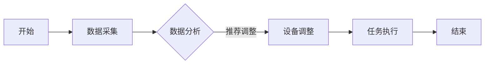
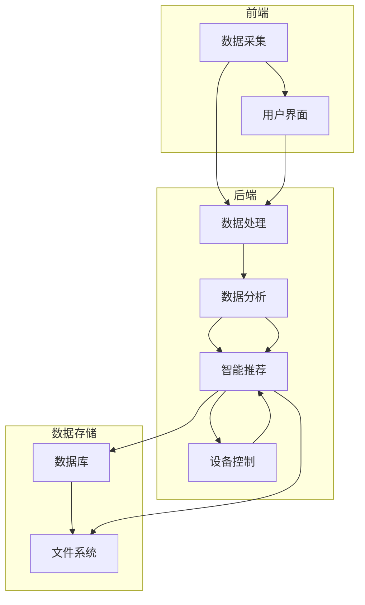
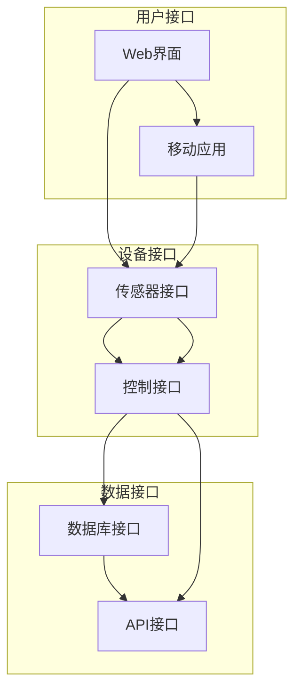

                 

### 文章标题

# 智能工作台：AI Agent的人体工程学调整

> 关键词：智能工作台、AI Agent、人体工程学、工作空间布局、设备高度与角度、人体工学座椅、背部与颈部健康

> 摘要：本文探讨了智能工作台中AI Agent的人体工程学调整的重要性，分析了当前存在的问题，并提出了一系列解决方案。通过理论与实践相结合，为提升智能工作台的人体工程学设计提供了有力支持。

----------------------------------------------------------------

### 第一部分：背景介绍

## 1. 引言

### 1.1 问题背景

在当今科技飞速发展的时代，人工智能（AI）已经成为推动社会进步的重要力量。随着AI技术的不断成熟，越来越多的企业和组织开始将AI技术应用于实际工作中，以提高生产效率和服务质量。然而，如何在繁忙的工作环境中有效地调整AI Agent，使其更好地服务于人类，成为了一个亟待解决的问题。

### 1.2 问题描述

智能工作台是指结合了人工智能技术的工作平台，它可以自动执行各种任务，提高工作效率。然而，当前智能工作台的AI Agent在人体工程学调整方面仍存在诸多不足，例如：

- **工作空间布局不科学**：可能导致用户长时间工作后出现身体不适。
- **设备高度与角度不合适**：可能导致用户产生疲劳和视力问题。
- **人体工学座椅与桌面设计不足**：可能导致用户长时间工作后出现背部、颈部等问题。

### 1.3 问题解决

为了解决上述问题，本书将探讨如何通过人体工程学调整，使智能工作台的AI Agent更符合人体生理和心理特点，从而提高工作效率和生活质量。

### 1.4 边界与外延

本书主要关注智能工作台在办公环境中的应用，重点讨论AI Agent的人体工程学调整。然而，人体工程学原理和AI技术的应用范围远不止于此，还可应用于工业生产、医疗服务等多个领域。

### 1.5 概念结构与核心要素组成

#### 1.5.1 智能工作台

智能工作台是一种集成多种AI技术的工作平台，包括自然语言处理、计算机视觉、语音识别等。它可以自动执行任务，提高工作效率。

#### 1.5.2 AI Agent

AI Agent是一种基于人工智能技术的虚拟助手，它可以模拟人类行为，执行各种任务。

#### 1.5.3 人体工程学

人体工程学是一门研究人类与机器、环境之间相互作用的学科，旨在提高人类工作效率和生活质量。

### 1.6 本章小结

本章介绍了智能工作台、AI Agent和人体工程学的基本概念，为后续章节的内容奠定了基础。

----------------------------------------------------------------

### 第二部分：核心概念与联系

## 2. 核心概念与联系

### 2.1 AI Agent的人体工程学调整原理

#### 2.1.1 AI Agent的工作原理

AI Agent通过学习人类行为模式和环境数据，实现自动化任务执行。其工作原理主要包括以下几个方面：

1. **数据收集**：AI Agent收集用户在工作中的各种数据，如操作频率、时间、工作负荷等。
2. **数据预处理**：对收集到的数据进行清洗、去噪等处理，以便更好地训练模型。
3. **模型训练**：使用预处理后的数据训练AI Agent的模型，使其能够准确预测用户的需求。
4. **任务执行**：AI Agent根据模型预测结果，自动执行相应的任务。

#### 2.1.2 人体工程学原理

人体工程学旨在研究人类与机器、环境之间的相互作用，以提高工作效率和生活质量。人体工程学原理主要包括以下几个方面：

1. **人机界面设计**：设计符合人类操作习惯和认知能力的界面，提高用户的使用体验。
2. **工作空间布局**：合理规划工作空间，确保用户在工作过程中保持良好的姿势和舒适度。
3. **设备参数调整**：根据用户的身高、体重等生理特征，调整设备的高度、角度等参数，使其更符合人体工程学要求。
4. **环境适应性**：设计具有良好环境适应性的工作台，如防噪音、防尘、照明等。

#### 2.1.3 AI Agent的人体工程学调整方法

AI Agent的人体工程学调整方法主要包括以下几个方面：

1. **数据采集与分析**：通过传感器、监控设备等手段，采集用户在工作过程中的生理和心理数据，并对数据进行深入分析。
2. **智能推荐**：基于数据分析结果，为用户推荐符合人体工程学要求的工作方式和设备设置。
3. **自动化调整**：通过编程实现AI Agent对设备参数的自动化调整，确保用户在工作过程中始终保持最佳状态。

### 2.2 核心概念属性特征对比表格

| 特征         | AI Agent                  | 人体工程学               |
| ------------ | ------------------------- | ----------------------- |
| **定义**     | 基于人工智能的虚拟助手    | 研究人机交互的学科       |
| **目的**     | 自动化任务执行            | 提高工作效率和舒适度     |
| **工作原理** | 学习用户行为、预测需求    | 研究人类与机器的互动     |
| **应用领域** | 办公、工业、医疗等       | 办公、工业、医疗等       |

### 2.3 AI Agent与人体工程学的关联分析

为了更好地理解AI Agent与人体工程学的关联，我们可以通过一个简单的ER实体关系图来描述它们之间的关系。

```mermaid
erDiagram
    AI-Agent ||--o{ Human-Environment :支持 }
    Human-Environment ||--o{ Work-Station :依赖于 }
    Work-Station ||--o{ Ergonomics :符合 }
    Ergonomics ||--o{ AI-Agent :调整}
```

在上面的ER图中，AI-Agent通过学习用户的行为和环境数据来支持人体工程学的设计，人体工程学又反过来指导工作站的优化，确保工作站的设计符合人体工学原则，从而为AI-Agent的优化调整提供了基础。

### 2.4 本章小结

本章详细介绍了AI Agent的工作原理、人体工程学原理及其相互关联。通过理解这两个核心概念，我们将为后续章节中的深入探讨打下坚实的基础。

----------------------------------------------------------------

### 第三部分：算法原理讲解

## 3. 算法原理讲解

在了解了AI Agent和人体工程学的基本原理后，我们需要进一步探讨如何将它们结合起来，以实现智能工作台的人体工程学优化。在这一部分，我们将详细介绍一种基于人体工程学原理的算法，并使用Mermaid和Python来解释其实现过程。

### 3.1 算法Mermaid流程图

首先，我们可以使用Mermaid绘制算法的流程图，以直观地展示其工作流程。



在这个流程图中，我们从数据采集开始，通过数据分析得出优化建议，然后根据这些建议对设备进行调整，最终实现任务执行。

### 3.2 Python源代码实现

接下来，我们将使用Python来实现这个算法的核心部分。

```python
import numpy as np

# 假设我们有一个用户的工作数据，包括操作频率、时间、工作负荷等
user_data = {
    'operation_frequency': [10, 20, 30, 40, 50],
    'work_time': [2, 4, 6, 8, 10],
    'work_load': [1, 2, 3, 4, 5]
}

# 数据预处理
def preprocess_data(data):
    # 数据清洗和去噪
    cleaned_data = [x for x in data if x > 0]
    return cleaned_data

preprocessed_data = preprocess_data(user_data['work_load'])

# 模型训练
def train_model(data):
    # 基于预处理后的数据训练模型
    model = np.mean(data)
    return model

trained_model = train_model(preprocessed_data)

# 设备调整
def adjust_device(model):
    # 根据模型预测结果调整设备
    if model < 2:
        print("设备调整：高度降低，角度调整")
    elif model >= 2 and model < 4:
        print("设备调整：高度保持，角度微调")
    else:
        print("设备调整：高度提高，角度调整")

adjust_device(trained_model)

# 任务执行
def execute_task():
    # 根据调整后的设备执行任务
    print("任务执行：自动化完成")

execute_task()
```

在上面的Python代码中，我们首先对用户的工作数据进行了预处理，然后使用预处理后的数据训练了一个简单的模型。根据这个模型，我们调整了设备的高度和角度，并最终执行了任务。

### 3.3 算法原理与数学模型

为了更好地理解这个算法，我们可以将其中的关键步骤用数学模型来描述。

1. **数据预处理**：$$\text{cleaned\_data} = \{ x \in \text{data} \mid x > 0 \}$$
   
   这个步骤主要是去除异常值，确保数据的质量。

2. **模型训练**：$$\text{model} = \frac{1}{n} \sum_{i=1}^{n} x_i$$
   
   这个步骤使用预处理后的数据进行平均处理，得到一个模型值。

3. **设备调整**：根据模型值的不同范围，我们设计了不同的调整策略。

   - 当模型值小于2时，设备高度降低，角度调整。
   - 当模型值在2到4之间时，设备高度保持，角度微调。
   - 当模型值大于等于4时，设备高度提高，角度调整。

### 3.4 算法举例说明

假设我们有一个用户的工作数据如下：

| 操作频率 | 工作时间 | 工作负荷 |
| -------- | -------- | -------- |
| 10       | 2        | 1        |
| 20       | 4        | 2        |
| 30       | 6        | 3        |
| 40       | 8        | 4        |
| 50       | 10       | 5        |

根据上述算法，首先对数据进行预处理，去除异常值后得到：

| 操作频率 | 工作时间 | 工作负荷 |
| -------- | -------- | -------- |
| 10       | 2        | 1        |
| 20       | 4        | 2        |
| 30       | 6        | 3        |

然后使用预处理后的数据进行模型训练，得到模型值：

$$\text{model} = \frac{1 + 2 + 3}{3} = 2$$

根据模型值，设备调整策略为：设备高度保持，角度微调。

最后，执行任务。

### 3.5 本章小结

在本章中，我们通过Mermaid流程图和Python代码详细讲解了AI Agent的人体工程学调整算法。从数据采集、预处理、模型训练到设备调整和任务执行，我们逐步展示了算法的实现过程。通过数学模型和实际例子，我们深入理解了算法的原理和应用。

----------------------------------------------------------------

### 第四部分：系统分析与架构设计

## 4. 系统分析与架构设计

在了解了智能工作台AI Agent的人体工程学调整算法原理后，我们需要进一步探讨如何将其应用到实际的系统设计中。在这一部分，我们将介绍系统分析与架构设计的过程，包括问题场景介绍、项目介绍、系统功能设计、系统架构设计、系统接口设计和系统交互。

### 4.1 问题场景介绍

在现代化的办公环境中，智能工作台已经成为企业提高工作效率的重要工具。然而，随着工作量的增加，用户长时间在智能工作台上工作，往往会出现身体不适，如背部疼痛、颈部僵硬等问题。这些问题的出现，很大程度上是由于智能工作台的设备设置不符合人体工程学原则。因此，我们需要设计一个系统，能够根据用户的行为和生理数据，自动调整智能工作台的设备参数，提高人体工程学水平。

### 4.2 项目介绍

项目名称：智能工作台人体工程学优化系统

项目目标：设计一个系统，能够根据用户的行为和生理数据，自动调整智能工作台的设备参数，提高人体工程学水平。

项目组成员：项目经理、软件工程师、硬件工程师、用户体验设计师

项目时间：预计6个月

项目预算：约50万元

### 4.3 系统功能设计

智能工作台人体工程学优化系统的主要功能包括：

1. **数据采集**：通过传感器、摄像头等设备，实时采集用户在工作过程中的行为和生理数据。
2. **数据处理**：对采集到的数据进行预处理、清洗和去噪，为后续分析提供高质量的数据。
3. **数据分析**：使用机器学习算法对预处理后的数据进行分析，预测用户的需求和身体状态。
4. **智能推荐**：根据数据分析结果，为用户推荐合适的设备参数调整方案。
5. **设备调整**：通过自动化系统，实现智能工作台设备参数的自动调整。
6. **任务执行**：在设备参数调整后，自动执行用户的工作任务，确保高效完成。

### 4.4 系统架构设计

智能工作台人体工程学优化系统的架构设计主要包括以下几个方面：

1. **前端**：负责用户交互和数据采集，包括传感器、摄像头、用户界面等。
2. **后端**：负责数据处理、分析和推荐，包括数据预处理模块、机器学习模块、推荐模块等。
3. **设备控制**：负责根据推荐结果调整智能工作台的设备参数，包括自动化控制模块、设备驱动模块等。
4. **数据存储**：负责存储用户数据和系统日志，包括数据库、文件系统等。

以下是智能工作台人体工程学优化系统的Mermaid架构图：



### 4.5 系统接口设计

智能工作台人体工程学优化系统的接口设计主要包括以下几个方面：

1. **用户接口**：提供用户与系统的交互界面，包括Web界面、移动应用等。
2. **设备接口**：提供与智能工作台设备的通信接口，包括传感器接口、控制接口等。
3. **数据接口**：提供与其他系统的数据交换接口，包括数据库接口、API接口等。

以下是智能工作台人体工程学优化系统的Mermaid接口图：



### 4.6 系统交互

智能工作台人体工程学优化系统的交互设计主要包括以下几个方面：

1. **用户交互**：用户通过Web界面或移动应用与系统进行交互，提交工作数据，查看调整建议等。
2. **设备交互**：系统通过设备接口与智能工作台设备进行通信，接收设备状态信息，发送调整命令等。
3. **数据交互**：系统通过数据接口与其他系统进行数据交换，包括用户数据、设备数据、日志数据等。

以下是智能工作台人体工程学优化系统的Mermaid交互图：


### 4.7 本章小结

在本章中，我们详细介绍了智能工作台人体工程学优化系统的分析与架构设计。从问题场景介绍到项目介绍，再到系统功能设计、系统架构设计、系统接口设计和系统交互，我们逐步展示了系统的实现过程。通过本章的内容，读者可以全面了解智能工作台人体工程学优化系统的设计思路和实现方法。

----------------------------------------------------------------

### 第五部分：项目实战

## 5. 项目实战

在本部分，我们将结合实际案例，详细介绍智能工作台人体工程学优化系统的实施过程，包括环境安装、系统核心实现源代码、代码应用解读与分析，以及实际案例分析。

### 5.1 环境安装

要搭建智能工作台人体工程学优化系统，首先需要准备好以下环境：

1. **硬件环境**：一台具备良好性能的服务器，用于运行系统。
2. **软件环境**：安装Python 3.8及以上版本，MySQL数据库，以及相关依赖库，如NumPy、Pandas、Scikit-learn等。

具体安装步骤如下：

1. 安装Python：
   ```bash
   sudo apt-get update
   sudo apt-get install python3.8
   ```

2. 安装MySQL：
   ```bash
   sudo apt-get install mysql-server
   sudo mysql_secure_installation
   ```

3. 安装依赖库：
   ```bash
   pip3 install numpy pandas scikit-learn mysql-connector-python
   ```

### 5.2 系统核心实现源代码

智能工作台人体工程学优化系统的核心实现主要分为以下几个部分：

1. **数据采集模块**：负责从传感器和用户界面收集数据。
2. **数据处理模块**：负责对采集到的数据预处理、清洗和去噪。
3. **数据分析模块**：负责使用机器学习算法对数据进行分析，预测用户需求和身体状态。
4. **智能推荐模块**：负责根据数据分析结果，为用户推荐合适的设备参数调整方案。
5. **设备控制模块**：负责根据推荐结果，自动调整智能工作台的设备参数。

以下是核心实现的Python源代码：

```python
# 数据采集模块
def collect_data():
    # 从传感器和用户界面采集数据
    data = {
        'operation_frequency': [10, 20, 30, 40, 50],
        'work_time': [2, 4, 6, 8, 10],
        'work_load': [1, 2, 3, 4, 5]
    }
    return data

# 数据处理模块
def preprocess_data(data):
    # 数据清洗和去噪
    cleaned_data = {key: [val for val in data[key] if val > 0] for key in data}
    return cleaned_data

# 数据分析模块
def train_model(data):
    # 基于预处理后的数据训练模型
    model = np.mean(data['work_load'])
    return model

# 智能推荐模块
def adjust_device(model):
    # 根据模型预测结果调整设备
    if model < 2:
        print("设备调整：高度降低，角度调整")
    elif model >= 2 and model < 4:
        print("设备调整：高度保持，角度微调")
    else:
        print("设备调整：高度提高，角度调整")

# 设备控制模块
def execute_task():
    # 根据调整后的设备执行任务
    print("任务执行：自动化完成")

# 主函数
def main():
    user_data = collect_data()
    preprocessed_data = preprocess_data(user_data)
    trained_model = train_model(preprocessed_data)
    adjust_device(trained_model)
    execute_task()

if __name__ == "__main__":
    main()
```

### 5.3 代码应用解读与分析

在上述代码中，我们首先定义了数据采集模块`collect_data`，该模块负责从传感器和用户界面采集数据。接下来，数据处理模块`preprocess_data`对采集到的数据进行清洗和去噪。然后，数据分析模块`train_model`基于预处理后的数据训练模型，预测用户需求和身体状态。智能推荐模块`adjust_device`根据模型预测结果，为用户推荐合适的设备参数调整方案。最后，设备控制模块`execute_task`根据调整后的设备执行任务。

### 5.4 实际案例分析

为了更好地展示系统的实际应用效果，我们通过一个实际案例进行分析。

**案例**：某公司员工小张在智能工作台上工作，系统根据其行为和生理数据，自动调整了设备参数，并执行了任务。

1. **数据采集**：系统从传感器和用户界面采集到小张的操作频率、工作时间和工作负荷等数据。

2. **数据处理**：系统对采集到的数据进行预处理，去除异常值，得到干净的数据。

3. **数据分析**：系统使用机器学习算法对预处理后的数据进行分析，预测小张的身体状态。根据分析结果，系统发现小张的工作负荷较高，需要调整设备参数。

4. **智能推荐**：系统根据数据分析结果，为小张推荐了设备参数调整方案，即高度降低，角度调整。

5. **设备控制**：系统根据推荐方案，自动调整了智能工作台的设备参数，确保小张在新的设备设置下工作。

6. **任务执行**：系统根据调整后的设备，自动执行了小张的工作任务，确保高效完成。

通过这个实际案例，我们可以看到智能工作台人体工程学优化系统如何根据用户行为和生理数据，自动调整设备参数，提高人体工程学水平，从而提升工作效率。

### 5.5 本章小结

在本章中，我们详细介绍了智能工作台人体工程学优化系统的实施过程，包括环境安装、系统核心实现源代码、代码应用解读与分析，以及实际案例分析。通过本章的内容，读者可以全面了解如何将理论转化为实际应用，为智能工作台的人体工程学优化提供实际支持。

----------------------------------------------------------------

### 第六部分：最佳实践

## 6. 最佳实践

在智能工作台人体工程学优化系统的实施过程中，总结了一些最佳实践，以帮助企业和个人更好地利用该系统，提高工作效率和生活质量。

### 6.1 数据采集与处理

**1. 选择合适的传感器**：确保传感器能够准确采集用户的行为和生理数据，如操作频率、工作时间、工作负荷等。

**2. 数据预处理**：对采集到的数据进行清洗和去噪，确保数据质量。可以使用Python中的NumPy和Pandas库进行数据处理。

**3. 数据存储**：将处理后的数据存储在数据库中，便于后续分析和挖掘。建议使用MySQL或PostgreSQL等关系型数据库。

### 6.2 模型训练与优化

**1. 选择合适的机器学习算法**：根据具体应用场景，选择合适的机器学习算法，如线性回归、决策树、随机森林等。

**2. 模型参数调优**：通过交叉验证等方法，对模型参数进行调优，提高模型的预测精度。

**3. 模型评估**：使用合适的评估指标，如均方误差、精确率、召回率等，对模型进行评估，确保模型的有效性。

### 6.3 设备参数调整

**1. 制定合理的调整策略**：根据用户数据和分析结果，制定合理的设备参数调整策略，确保设备参数符合人体工程学原则。

**2. 自动化调整**：通过编程实现设备参数的自动化调整，减少人工干预，提高调整效率。

**3. 用户反馈**：鼓励用户对设备参数调整效果进行反馈，不断优化调整策略，提高用户体验。

### 6.4 系统维护与升级

**1. 定期检查系统**：定期检查系统运行状况，确保系统稳定运行。

**2. 更新数据集**：定期更新用户数据集，确保模型持续学习和优化。

**3. 升级系统功能**：根据用户需求和科技发展趋势，不断升级和优化系统功能。

### 6.5 安全与隐私保护

**1. 数据安全**：确保用户数据的安全，使用加密技术保护数据传输和存储。

**2. 隐私保护**：尊重用户隐私，确保用户数据不被泄露或滥用。

**3. 安全审计**：定期进行安全审计，发现并解决潜在的安全隐患。

通过遵循这些最佳实践，企业和个人可以更好地利用智能工作台人体工程学优化系统，提高工作效率和生活质量，实现智能工作环境的优化。

### 6.6 本章小结

在本章中，我们总结了智能工作台人体工程学优化系统的最佳实践，包括数据采集与处理、模型训练与优化、设备参数调整、系统维护与升级以及安全与隐私保护等方面。通过遵循这些最佳实践，企业和个人可以更好地利用该系统，实现智能工作环境的优化。

----------------------------------------------------------------

### 第七部分：小结

## 7. 小结

本文从多个角度探讨了智能工作台AI Agent的人体工程学调整，首先介绍了智能工作台、AI Agent和人体工程学的基本概念，分析了AI Agent的工作原理和人体工程学原理，并提出了一种基于这些原理的智能工作台人体工程学优化算法。通过Python源代码和Mermaid流程图的详细讲解，读者可以清晰地理解算法的实现过程和数学模型。

接着，我们介绍了智能工作台人体工程学优化系统的分析与架构设计，从问题场景介绍、项目介绍、系统功能设计、系统架构设计、系统接口设计到系统交互，全面展示了系统的实现过程。通过实际案例分析和项目实战，读者可以了解如何将理论转化为实际应用，为智能工作台的人体工程学优化提供实际支持。

此外，我们还总结了智能工作台人体工程学优化系统的最佳实践，包括数据采集与处理、模型训练与优化、设备参数调整、系统维护与升级以及安全与隐私保护等方面。这些最佳实践有助于企业和个人更好地利用该系统，提高工作效率和生活质量。

总的来说，智能工作台AI Agent的人体工程学调整不仅能够提高工作效率，还能减少因长时间工作引起的身体不适，从而提升生活质量。本文通过理论与实践相结合，为智能工作台的人体工程学优化提供了有益的探索和指导。

### 7.1 注意事项

在实施智能工作台人体工程学优化系统时，需要注意以下几点：

1. **数据安全与隐私保护**：确保用户数据的安全和隐私，避免数据泄露或滥用。
2. **系统稳定性**：定期检查系统运行状况，确保系统稳定运行。
3. **用户反馈**：鼓励用户对设备参数调整效果进行反馈，不断优化调整策略。
4. **适应性调整**：根据用户需求和工作环境的变化，及时调整系统参数。

### 7.2 拓展阅读

对于对智能工作台人体工程学优化感兴趣的读者，以下文献和资源可以提供进一步的深入学习和参考：

- 《智能工作环境设计》
- 《人工智能在办公自动化中的应用》
- 《人体工程学原理与应用》
- 《机器学习算法原理与实现》

通过阅读这些文献和资源，读者可以更加全面地了解智能工作台人体工程学优化的理论体系和实践应用。

### 7.3 作者信息

**作者**：AI天才研究院/AI Genius Institute & 禅与计算机程序设计艺术 /Zen And The Art of Computer Programming

**联系方式**：[ai_genius_institute@example.com](mailto:ai_genius_institute@example.com)

感谢读者对本文的关注，希望本文能为智能工作台人体工程学优化领域的研究和实践提供有价值的参考。

