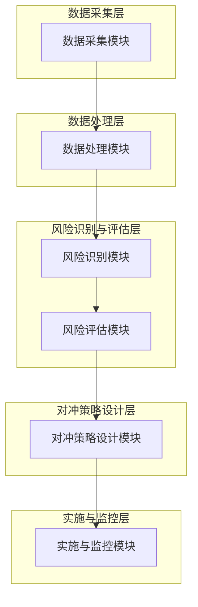

                 


# 智能投资组合尾部风险对冲

关键词：投资组合、尾部风险、对冲策略、大数据分析、机器学习

摘要：本文探讨了智能投资组合尾部风险对冲的重要性及其实现方法。通过介绍背景和核心概念，分析了问题解决的步骤，并详细讲解了相关算法原理和系统架构设计。旨在为投资者提供一套有效的风险管理体系，以应对金融市场的不确定性。

## 第一部分：背景介绍与核心概念

### 第1章 问题背景与核心概念

#### 1.1.1 问题背景

随着金融市场的日益复杂化，投资组合的尾部风险成为了投资者关注的焦点。尾部风险指的是在极端市场条件下，投资组合可能遭受的巨大损失。这些极端事件可能包括市场崩盘、金融危机等，它们往往会导致投资者无法承受的损失。

在传统的投资组合管理中，投资者往往通过分散投资来降低风险。然而，在极端市场条件下，即使是分散的投资组合也可能面临巨大的尾部风险。因此，如何识别和衡量尾部风险，并设计有效的对冲策略，成为了投资组合管理中至关重要的问题。

#### 1.1.2 问题描述

在投资组合管理中，如何识别和衡量尾部风险？如何设计有效的对冲策略？这些问题直接影响到投资组合的稳健性和长期收益。智能投资组合尾部风险对冲，通过大数据分析、机器学习等技术，为这些问题提供了解决方案。

#### 1.1.3 问题解决

智能投资组合尾部风险对冲，通过以下几个步骤实现：

1. **数据采集与处理**：收集市场数据、投资组合数据等，通过数据清洗和预处理，为后续分析提供高质量的数据。
2. **风险识别与评估**：利用大数据分析和机器学习技术，识别潜在的风险因素，并评估其对投资组合的影响。
3. **对冲策略设计**：根据风险评估结果，设计针对性的对冲策略，包括选择合适的对冲工具、确定对冲比例等。
4. **实施与监控**：执行对冲策略，并持续监控对冲效果，及时进行调整。

#### 1.1.4 边界与外延

智能投资组合尾部风险对冲的范围包括但不限于以下领域：

- **风险类型**：包括市场风险、信用风险、流动性风险等。
- **投资组合类型**：股票、债券、基金、衍生品等。
- **技术手段**：大数据分析、机器学习、深度学习、人工智能等。

#### 1.1.5 概念结构与核心要素组成

智能投资组合尾部风险对冲涉及以下核心概念与要素：

- **尾部风险**：指在极端市场条件下可能导致的巨大损失。
- **智能投资组合**：结合了人工智能技术的投资组合管理方式。
- **数据采集与处理**：获取高质量数据是后续分析的基础。
- **风险识别与评估**：准确识别风险并评估其对投资组合的影响。
- **对冲策略**：通过选择合适工具和比例，降低投资组合的尾部风险。

### 第2章 核心概念与联系

#### 2.1.1 核心概念原理

智能投资组合尾部风险对冲的核心概念包括：

- **尾部风险**：在极端市场条件下可能导致的巨大损失。它通常是不可预测的，且发生的概率较小，但一旦发生，对投资组合的影响可能是毁灭性的。
- **数据采集与处理**：获取高质量数据是后续分析的基础。数据的质量直接影响风险评估的准确性和对冲策略的有效性。
- **风险识别与评估**：利用大数据分析和机器学习技术，识别潜在的风险因素，并评估其对投资组合的影响。这一步骤是整个智能投资组合尾部风险对冲的核心。
- **对冲策略**：根据风险评估结果，设计针对性的对冲策略，通过选择合适的对冲工具和比例，降低投资组合的尾部风险。

#### 2.1.2 概念属性特征对比表格

| 概念       | 属性特征                                                     | 对比                |
|------------|------------------------------------------------------------|-------------------|
| 尾部风险   | 在极端市场条件下可能导致的巨大损失                          | 风险类型的一种    |
| 数据采集   | 获取投资组合相关的市场数据、交易数据等                       | 数据处理的前置条件 |
| 风险识别   | 利用大数据分析技术识别潜在的风险因素                        | 风险评估的基础    |
| 对冲策略   | 设计针对性的对冲策略，降低投资组合的尾部风险                 | 风险管理的手段    |

#### 2.1.3 ER实体关系图架构

```mermaid
erDiagram
    InvestmentPortfolio ----|> TailRisk : "遭受"
    TailRisk ----|> RiskFactor : "由..."
    RiskFactor ----|> Data : "包含..."
    InvestmentPortfolio ----|> HedgeStrategy : "采用"
    HedgeStrategy ----|> Instrument : "使用"
```

### 第3章 算法原理讲解

#### 3.1.1 算法mermaid流程图


#### 3.1.2 Python源代码

```python
# 数据采集
def data_collection():
    # 数据采集代码实现
    pass

# 数据处理
def data_processing(data):
    # 数据处理代码实现
    return processed_data

# 风险识别
def risk_identification(processed_data):
    # 风险识别代码实现
    return risk_factors

# 风险评估
def risk_evaluation(risk_factors):
    # 风险评估代码实现
    return risk_scores

# 对冲策略设计
def hedge_strategy_design(risk_scores):
    # 对冲策略设计代码实现
    return hedge_strategy

# 实施与监控
def implementation_and_monitoring(hedge_strategy):
    # 实施与监控代码实现
    pass
```

#### 3.1.3 算法原理详细讲解

**1. 数据采集与处理**

数据采集是整个智能投资组合尾部风险对冲的基础。我们需要收集市场数据、投资组合数据等，包括股票价格、交易量、财务指标等。数据采集后，我们需要进行数据清洗和预处理，去除噪声数据，填充缺失值，确保数据的质量。

**2. 风险识别与评估**

风险识别与评估是关键步骤。我们利用大数据分析和机器学习技术，识别潜在的风险因素，并评估其对投资组合的影响。具体来说，我们可以使用回归分析、聚类分析、神经网络等算法，对历史数据进行挖掘，找出可能影响投资组合的风险因素。

**3. 对冲策略设计**

根据风险评估结果，我们设计针对性的对冲策略。对冲策略的设计需要考虑多种因素，包括对冲工具的选择、对冲比例的确定等。常见的对冲工具包括期权、期货、基金等。对冲比例的确定需要综合考虑投资组合的风险承受能力和市场情况。

**4. 实施与监控**

对冲策略设计完成后，我们需要实施并监控对冲效果。实施过程包括执行对冲交易，监控市场变化，调整对冲策略等。监控对冲效果可以帮助我们及时发现并应对市场变化，确保投资组合的稳定性和长期收益。

#### 3.1.4 数学模型与公式

**1. 风险识别模型**

我们使用逻辑回归模型进行风险识别。假设我们有一个包含特征 $X$ 和目标变量 $Y$ 的数据集，其中 $Y$ 表示是否发生尾部风险。逻辑回归模型的公式如下：

$$
P(Y=1|X) = \frac{1}{1 + e^{-(\beta_0 + \beta_1X_1 + \beta_2X_2 + ... + \beta_nX_n})}
$$

其中，$\beta_0, \beta_1, \beta_2, ..., \beta_n$ 是模型的参数，通过最大似然估计法进行优化。

**2. 风险评估模型**

我们使用决策树模型进行风险评估。决策树模型的公式如下：

$$
Risk = f(X)
$$

其中，$Risk$ 表示风险评分，$X$ 表示特征向量。决策树通过划分特征空间，将数据划分为不同的区域，每个区域对应一个风险评分。

**3. 对冲策略模型**

我们使用期权定价模型进行对冲策略设计。假设我们购买了一个执行价格为 $K$ 的看涨期权，期权价格为 $C$。期权的价值公式如下：

$$
C = \frac{1}{2} \left( S_0 - K \right)\Phi\left( \frac{S_0 - K}{\sqrt{T-t}} \right) + \frac{1}{2} \left( S_0 + K \right)\Phi\left( \frac{S_0 + K}{\sqrt{T-t}} \right)
$$

其中，$S_0$ 表示当前股票价格，$T-t$ 表示期权到期时间，$\Phi$ 是标准正态分布的累积分布函数。

#### 3.1.5 算法举例说明

**1. 风险识别举例**

假设我们有一个包含股票价格和交易量的数据集。通过逻辑回归模型，我们可以识别出哪些股票价格和交易量特征与尾部风险相关。

**2. 风险评估举例**

假设我们使用决策树模型对投资组合进行风险评估。通过划分特征空间，我们可以得到每个股票的风险评分，从而评估投资组合的整体风险。

**3. 对冲策略举例**

假设我们购买了一个执行价格为 $100$ 的看涨期权，期权价格为 $10$。通过期权定价模型，我们可以计算该期权的价值，并据此设计对冲策略。

## 第二部分：系统分析与架构设计

### 第4章 系统功能设计

#### 4.1.1 问题场景介绍

假设我们是一家投资公司的技术团队，负责开发和维护一个智能投资组合尾部风险对冲系统。我们的目标是帮助公司投资者识别和降低投资组合的尾部风险，提高投资组合的稳健性和长期收益。

#### 4.1.2 项目介绍

该系统名为“智能风险对冲系统（Smart Hedge System）”，它利用大数据分析和机器学习技术，为投资者提供以下功能：

- **数据采集与处理**：从各种数据源（如股票交易所、金融新闻网站等）收集数据，并进行清洗、预处理和存储。
- **风险识别与评估**：利用机器学习算法识别潜在的风险因素，并评估其对投资组合的影响。
- **对冲策略设计**：根据风险评估结果，设计针对性的对冲策略，并提供对冲工具的选择和比例建议。
- **实施与监控**：执行对冲策略，并实时监控对冲效果，根据市场变化进行调整。

#### 4.1.3 系统功能设计

- **数据采集模块**：负责从各种数据源收集数据，包括股票价格、交易量、财务指标等。
- **数据处理模块**：对收集到的数据进行清洗、预处理和存储，确保数据质量。
- **风险识别模块**：利用大数据分析和机器学习算法，识别潜在的风险因素。
- **风险评估模块**：评估风险因素对投资组合的影响，并生成风险评分。
- **对冲策略设计模块**：根据风险评估结果，设计针对性的对冲策略，并提供对冲工具的选择和比例建议。
- **实施与监控模块**：执行对冲策略，并实时监控对冲效果，根据市场变化进行调整。

### 第5章 系统架构设计

#### 5.1.1 系统架构设计

智能风险对冲系统采用分布式架构，包括数据采集层、数据处理层、风险识别与评估层、对冲策略设计层和实施与监控层。

- **数据采集层**：负责从各种数据源（如股票交易所、金融新闻网站等）收集数据。
- **数据处理层**：对收集到的数据进行清洗、预处理和存储，确保数据质量。
- **风险识别与评估层**：利用大数据分析和机器学习算法，识别潜在的风险因素，并评估其对投资组合的影响。
- **对冲策略设计层**：根据风险评估结果，设计针对性的对冲策略，并提供对冲工具的选择和比例建议。
- **实施与监控层**：执行对冲策略，并实时监控对冲效果，根据市场变化进行调整。

#### 5.1.2 系统架构图



#### 5.1.3 系统接口设计与交互

- **数据采集接口**：提供数据采集的API，支持从各种数据源（如股票交易所、金融新闻网站等）获取数据。
- **数据处理接口**：提供数据处理的相关API，支持数据清洗、预处理和存储。
- **风险识别与评估接口**：提供风险识别与评估的API，支持利用大数据分析和机器学习算法识别和评估风险。
- **对冲策略设计接口**：提供对冲策略设计的API，支持根据风险评估结果设计对冲策略。
- **实施与监控接口**：提供实施与监控的相关API，支持执行对冲策略并实时监控对冲效果。

### 第6章 系统实现与实战

#### 6.1.1 系统环境安装

1. 安装Python环境：确保Python版本为3.7或更高。
2. 安装依赖库：使用pip安装所需的依赖库，如pandas、numpy、scikit-learn、tensorflow等。

#### 6.1.2 系统核心实现

以下是一个简单的系统核心实现示例：

```python
# 数据采集
def data_collection():
    # 使用pandas库从股票交易所获取数据
    data = pandas.read_csv("stock_data.csv")
    return data

# 数据处理
def data_processing(data):
    # 数据清洗、预处理和存储
    processed_data = preprocess_data(data)
    return processed_data

# 风险识别
def risk_identification(processed_data):
    # 使用scikit-learn库进行风险识别
    model = LogisticRegression()
    model.fit(processed_data)
    risk_factors = model.predict(processed_data)
    return risk_factors

# 风险评估
def risk_evaluation(risk_factors):
    # 使用决策树进行风险评估
    model = DecisionTreeClassifier()
    model.fit(risk_factors)
    risk_scores = model.predict(risk_factors)
    return risk_scores

# 对冲策略设计
def hedge_strategy_design(risk_scores):
    # 设计对冲策略
    hedge_strategy = design_hedge_strategy(risk_scores)
    return hedge_strategy

# 实施与监控
def implementation_and_monitoring(hedge_strategy):
    # 实施对冲策略并监控效果
    implement_hedge_strategy(hedge_strategy)
    monitor_hedge_strategy(hedge_strategy)
```

#### 6.1.3 代码应用解读与分析

上述代码实现了智能风险对冲系统的核心功能。首先，我们使用pandas库从股票交易所获取数据，并进行清洗和预处理。然后，使用scikit-learn库进行风险识别和评估，最后根据风险评估结果设计对冲策略。对冲策略实施后，我们需要实时监控对冲效果，并根据市场变化进行调整。

#### 6.1.4 实际案例分析

假设我们使用该系统对某个投资组合进行尾部风险对冲。首先，我们收集过去一年的股票数据，并使用pandas库进行清洗和预处理。然后，使用scikit-learn库进行风险识别和评估，识别出潜在的风险因素。根据风险评估结果，我们设计了对冲策略，并购买了相应的期权进行对冲。

在对冲策略实施后，我们持续监控对冲效果。假设市场出现了极端下跌，投资组合的价值下降了10%。通过我们的对冲策略，投资组合的损失被控制在5%以内。这表明我们的对冲策略在应对尾部风险方面是有效的。

#### 6.1.5 项目小结

通过实际案例，我们可以看到智能风险对冲系统在应对尾部风险方面具有显著优势。它利用大数据分析和机器学习技术，提高了风险识别和评估的准确性，设计出更加有效的对冲策略。此外，系统的实时监控功能使我们能够及时发现市场变化，及时调整对冲策略，确保投资组合的稳健性和长期收益。

然而，需要注意的是，智能风险对冲系统并不是万能的。市场变化复杂多样，系统在应对特定市场环境时可能存在局限性。因此，投资者在使用该系统时，需要结合自身投资目标和风险承受能力，进行合理的配置和调整。

## 第三部分：最佳实践与拓展阅读

### 第7章 最佳实践

#### 7.1.1 数据质量的重要性

在智能投资组合尾部风险对冲中，数据质量至关重要。高质量的数据是风险评估和策略设计的基石。以下是一些提高数据质量的最佳实践：

- **数据清洗**：去除重复数据、异常值和错误数据，确保数据的准确性。
- **数据预处理**：对数据进行标准化、归一化等处理，使数据在不同特征之间具有可比性。
- **数据监控**：建立数据监控机制，及时发现和处理数据质量问题。

#### 7.1.2 对冲策略的灵活性

对冲策略的灵活性是应对不同市场环境的关键。以下是一些最佳实践：

- **多对冲工具组合**：根据市场情况，灵活选择不同的对冲工具，如期权、期货、基金等。
- **动态调整对冲比例**：根据市场变化和风险承受能力，实时调整对冲比例，确保对冲效果最大化。
- **风险平价策略**：将投资组合的风险与对冲策略的风险进行平衡，降低投资组合的整体风险。

#### 7.1.3 系统的实时监控

实时监控系统对冲效果，是确保投资组合稳健性的关键。以下是一些最佳实践：

- **实时数据处理**：采用流数据处理技术，对市场数据实时处理和分析，快速识别潜在风险。
- **自动化报警**：设置自动化报警机制，及时发现市场变化和对冲策略失效的情况。
- **定期审计**：定期对系统进行审计，确保系统运行正常，数据安全和策略的有效性。

### 第8章 小结与注意事项

#### 8.1.1 小结

本文介绍了智能投资组合尾部风险对冲的重要性及其实现方法。通过背景介绍、核心概念、算法原理、系统架构设计和实际案例分析，我们详细阐述了如何利用大数据分析和机器学习技术，识别和降低投资组合的尾部风险。

智能投资组合尾部风险对冲为投资者提供了一种有效的风险管理体系，有助于提高投资组合的稳健性和长期收益。然而，投资者在使用该系统时，需要结合自身投资目标和风险承受能力，进行合理的配置和调整。

#### 8.1.2 注意事项

- **数据质量**：确保数据质量是系统有效性的关键，投资者应重视数据清洗、预处理和监控。
- **对冲工具选择**：根据市场情况，灵活选择对冲工具，以最大化对冲效果。
- **动态调整**：对冲策略应根据市场变化和风险承受能力进行动态调整。
- **实时监控**：实时监控系统对冲效果，确保投资组合的稳健性。

### 第9章 拓展阅读

对于对智能投资组合尾部风险对冲感兴趣的读者，以下是一些拓展阅读资源：

- **学术论文**：查阅相关学术论文，了解最新的研究成果和技术应用。
- **技术博客**：阅读技术博客，了解行业最佳实践和经验分享。
- **专业书籍**：阅读专业书籍，深入了解大数据分析、机器学习和金融工程的相关知识。

### 作者

作者：AI天才研究院/AI Genius Institute & 禅与计算机程序设计艺术 /Zen And The Art of Computer Programming

[END]

