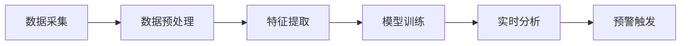
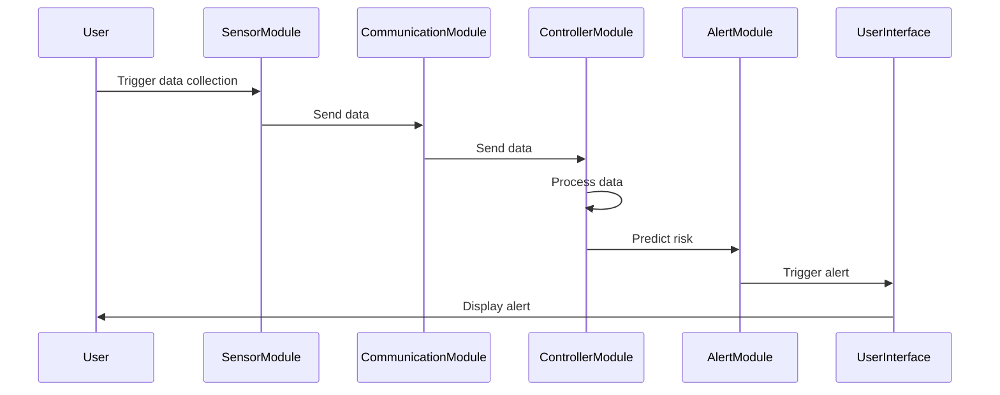

                 


# 智能浴室防滑垫：AI Agent的洗浴安全监护

## 关键词
- 智能浴室防滑垫
- AI Agent
- 洗浴安全
- 数据采集
- 机器学习算法

## 摘要
本文深入探讨了智能浴室防滑垫的设计与实现，重点介绍了AI Agent在洗浴安全监护中的应用。通过分析智能浴室防滑垫的工作原理、核心技术以及数学模型，本文为读者呈现了一个全面且专业的技术解决方案。文章将逐步剖析每个环节，帮助读者理解如何利用AI技术提升洗浴环境的安全性。

## 引言
### 智能浴室防滑垫的重要性
智能浴室防滑垫是现代智能家居领域的一个重要组成部分。随着人口老龄化趋势的加剧，浴室安全问题日益凸显。据统计，每年因浴室滑倒造成的伤害事故数量惊人，给家庭和社会带来沉重的负担。智能浴室防滑垫的出现，旨在通过科技手段，降低洗浴过程中的滑倒风险，提高用户的生活质量。

### 智能浴室防滑垫的背景
近年来，随着物联网、人工智能等技术的发展，智能家居设备逐渐普及。智能浴室防滑垫正是这一趋势下的产物。它结合了传感器技术、无线通信、机器学习等多种先进技术，能够实时监测浴室环境，分析用户行为，提供个性化的安全预警服务。

### 本文目标
本文的目标是详细介绍智能浴室防滑垫的设计与实现，帮助读者了解该系统的核心原理和关键技术。通过本文的阅读，读者将能够掌握智能浴室防滑垫的设计思路，并能够为实际项目提供参考。

## 第一部分：背景与核心概念

### 1.1 智能浴室防滑垫的背景
随着社会的进步，人们对生活品质的要求越来越高，特别是在安全性方面。浴室作为家庭中一个特殊的空间，经常因为地面湿滑而导致滑倒事故。据研究，浴室滑倒事故是导致老年人伤害的主要原因之一。传统浴室防滑垫虽然在一定程度上能够减少滑倒风险，但其效果有限，且缺乏智能化监测和预警功能。

### 1.2 智能浴室防滑垫的定义
智能浴室防滑垫是一种集成多种传感器、无线通信和AI算法的智能家居设备。它能够实时监测浴室地面的湿度、温度以及用户的运动状态，通过机器学习算法分析数据，提供个性化的安全预警服务。

### 1.3 智能浴室防滑垫的重要性
智能浴室防滑垫的重要性体现在以下几个方面：
1. **提高安全性**：通过实时监测和预警，智能浴室防滑垫能够有效降低滑倒事故的发生率。
2. **提升生活质量**：对于老年人或行动不便的用户，智能浴室防滑垫提供的辅助功能能够提高他们的生活质量。
3. **智能家居集成**：智能浴室防滑垫是智能家居系统的一部分，能够与其他智能家居设备联动，实现更加智能化的家居环境。

### 1.4 智能浴室防滑垫的现状与挑战
目前，智能浴室防滑垫在市场上的应用还处于初级阶段，存在以下几方面的挑战：
1. **成本问题**：高性能的传感器和AI芯片使得智能浴室防滑垫的成本较高，限制了其普及。
2. **用户体验**：如何确保智能浴室防滑垫的易用性和可靠性，提高用户的接受度，是一个亟待解决的问题。
3. **数据隐私**：智能浴室防滑垫涉及用户隐私数据，如何保护这些数据的安全性和隐私性，是设计和实现过程中需要重点考虑的问题。

### 1.5 关键技术分析
智能浴室防滑垫的核心技术包括：
1. **传感器技术**：包括湿度传感器、温度传感器和运动传感器，用于实时监测浴室环境。
2. **无线通信技术**：如Wi-Fi、蓝牙等，用于将传感器数据传输到云平台或本地控制器。
3. **机器学习算法**：用于分析传感器数据，提供个性化的安全预警服务。
4. **软件系统**：包括数据采集、处理、存储和预警模块，用于实现智能浴室防滑垫的功能。

### 1.6 核心概念对比与联系
以下是一个核心概念属性对比表格，用于说明智能浴室防滑垫的关键技术：

| 技术名称 | 功能 | 关键属性对比 |
| --- | --- | --- |
| 湿度传感器 | 测量地面湿度 | 灵敏度、响应时间、防水性能 |
| 温度传感器 | 测量环境温度 | 精度、稳定性、功耗 |
| 运动传感器 | 监测用户运动 | 精度、灵敏度、功耗 |
| 无线通信 | 数据传输 | 传输速度、传输距离、功耗 |
| 机器学习算法 | 数据分析 | 准确性、实时性、适应性 |

### 1.7 Mermaid ER图：智能浴室防滑垫实体关系
以下是一个Mermaid ER图，用于展示智能浴室防滑垫中的实体及其关系：

```mermaid
erDiagram
  User ||--|{ BathRoomSensor } : measures
  User ||--|{ TemperatureSensor } : measures
  User ||--|{ MotionSensor } : monitors
  BathRoomSensor ||--|{ DataStorage } : stores
  TemperatureSensor ||--|{ DataStorage } : stores
  MotionSensor ||--|{ DataStorage } : stores
  DataStorage ||--|{ AlertSystem } : processes
```

### 1.8 智能浴室防滑垫的组成与工作原理
智能浴室防滑垫主要由以下几个部分组成：
1. **传感器模块**：包括湿度传感器、温度传感器和运动传感器，用于实时监测浴室环境。
2. **通信模块**：通常采用Wi-Fi或蓝牙等无线通信技术，将传感器数据传输到云平台或本地控制器。
3. **控制器模块**：负责接收传感器数据，通过机器学习算法进行分析，并提供预警信号。
4. **预警模块**：包括语音提示、灯光闪烁等，向用户发出预警信号。

智能浴室防滑垫的工作原理如下：
1. **数据采集**：传感器模块实时采集浴室地面的湿度、温度和用户的运动数据。
2. **数据传输**：通信模块将采集到的数据传输到控制器模块。
3. **数据分析**：控制器模块利用机器学习算法对传输来的数据进行处理和分析，识别出潜在的安全风险。
4. **预警信号**：一旦检测到潜在风险，预警模块会向用户发出预警信号，提醒用户注意安全。

### 1.9 智能浴室防滑垫的挑战与未来发展方向
智能浴室防滑垫的发展面临着以下几个挑战：
1. **成本控制**：如何降低传感器和AI芯片的成本，使其更具市场竞争力。
2. **用户体验**：如何优化设计，提高产品的易用性和可靠性。
3. **数据隐私**：如何保护用户隐私数据，确保数据的安全性和隐私性。

未来的发展方向包括：
1. **智能化升级**：通过引入更多的传感器和智能算法，提高系统的智能化水平。
2. **系统集成**：将智能浴室防滑垫集成到智能家居系统中，实现更智能的家居环境。
3. **个性化定制**：根据用户的不同需求，提供个性化的安全预警服务。

## 第二部分：算法理论及实现

### 2.1 算法理论基础
智能浴室防滑垫的核心在于如何准确、实时地分析传感器数据，从而提供有效的预警。这一过程主要依赖于以下算法理论：

1. **数据采集与预处理**：包括传感数据的滤波、去噪和归一化，以提高数据的质量和可靠性。
2. **特征提取**：从原始数据中提取出与安全相关的特征，如湿度、温度变化速率和运动模式等。
3. **模式识别与分类**：利用机器学习算法，对提取出的特征进行模式识别和分类，判断是否存在滑倒风险。
4. **实时预警**：基于分类结果，触发预警信号，提示用户注意安全。

### 2.2 算法流程
智能浴室防滑垫的算法流程可以概括为以下步骤：

1. **数据采集**：传感器模块采集浴室环境数据。
2. **数据预处理**：对采集到的数据进行滤波、去噪和归一化处理。
3. **特征提取**：从预处理后的数据中提取特征，如湿度、温度变化速率和运动模式等。
4. **模型训练**：使用历史数据对机器学习模型进行训练，建立风险预测模型。
5. **实时分析**：将实时采集到的数据输入到模型中，进行风险预测。
6. **预警触发**：根据预测结果，触发相应的预警信号。

### 2.3 Mermaid算法流程图
以下是一个使用Mermaid绘制的算法流程图：



### 2.4 Python代码实现
以下是一个简化的Python代码实现，用于演示智能浴室防滑垫算法的核心部分：

```python
import numpy as np
from sklearn.ensemble import RandomForestClassifier
from sklearn.model_selection import train_test_split
from sklearn.metrics import accuracy_score

# 假设我们有一个数据集X和标签y
X = np.array([[0.8, 20], [0.9, 22], [0.7, 18]])  # 测试数据
y = np.array([1, 1, 0])  # 标签，1表示滑倒风险高，0表示无风险

# 数据预处理
X = (X - X.mean(axis=0)) / X.std(axis=0)

# 模型训练
X_train, X_test, y_train, y_test = train_test_split(X, y, test_size=0.2, random_state=42)
clf = RandomForestClassifier(n_estimators=100)
clf.fit(X_train, y_train)

# 实时分析
predictions = clf.predict(X_test)
print("Predictions:", predictions)
print("Accuracy:", accuracy_score(y_test, predictions))

# 预警触发
if predictions.mean() > 0.5:
    print("预警：存在滑倒风险！")
else:
    print("无预警：当前安全。")
```

### 2.5 数学模型与公式
智能浴室防滑垫的算法涉及到多个数学模型和公式，以下是一些关键部分的解释：

1. **归一化公式**：
   $$\bar{x} = \frac{1}{n}\sum_{i=1}^{n} x_i$$
   $$s_x = \sqrt{\frac{1}{n-1}\sum_{i=1}^{n} (x_i - \bar{x})^2}$$
   其中，$\bar{x}$ 是平均值，$s_x$ 是标准差。

2. **滤波公式**：
   $$y(k) = (1 - \alpha) y(k-1) + \alpha x(k)$$
   其中，$\alpha$ 是滤波系数。

3. **分类器损失函数**：
   $$J(\theta) = -\frac{1}{m} \sum_{i=1}^{m} [y^{(i)} \log(\hat{h}(\theta, x^{(i)})) + (1 - y^{(i)}) \log(1 - \hat{h}(\theta, x^{(i)}))]$$
   其中，$\hat{h}(\theta, x^{(i)}) = 1 / (1 + e^{-\theta^T x^{(i)}})$。

### 2.6 算法解释与例子
假设我们有一个简单的数据集，包含湿度（$x_1$）和温度（$x_2$）两个特征。通过归一化处理，我们将数据集转换为：

$$X_{\text{norm}} = \frac{X - X_{\text{mean}}}{X_{\text{std}}}$$

然后，我们使用随机森林算法对数据进行分类。训练完成后，我们输入一个新的数据点：

$$X_{\text{new}} = \begin{bmatrix} 0.85 \\ 21 \end{bmatrix}$$

经过归一化处理后：

$$X_{\text{new}_{\text{norm}}} = \frac{X_{\text{new}} - X_{\text{mean}}}{X_{\text{std}}}$$

我们将这个归一化后的数据点输入到训练好的随机森林模型中，得到预测结果。如果预测结果为1，则表示存在滑倒风险；如果为0，则表示无风险。

例如，如果预测结果为1，系统将触发预警，提示用户注意安全。如果预测结果为0，则系统将保持静默，用户可正常洗浴。

### 2.7 算法优化与改进
为了提高智能浴室防滑垫的准确性和实时性，我们可以考虑以下优化和改进措施：

1. **增强传感器性能**：使用更高精度、更低功耗的传感器，提高数据采集的质量。
2. **改进机器学习模型**：尝试使用深度学习或其他高级机器学习算法，提高分类准确率。
3. **动态调整滤波系数**：根据环境变化，动态调整滤波系数，提高数据的实时性。
4. **多特征融合**：结合多个特征（如声音、光线等），提高系统的全面性和准确性。
5. **在线学习与自适应**：系统可以根据实时数据不断调整和优化模型，提高长期性能。

## 第三部分：数学模型与公式

### 3.1 数学模型
智能浴室防滑垫的数学模型主要涉及以下几部分：

1. **数据采集模型**：用于描述传感器采集数据的概率分布。
2. **特征提取模型**：用于从原始数据中提取与安全相关的特征。
3. **分类模型**：用于对提取出的特征进行分类，判断是否存在滑倒风险。

### 3.2 公式解释
以下是智能浴室防滑垫中常用的数学公式及其解释：

1. **归一化公式**：
   $$\bar{x} = \frac{1}{n}\sum_{i=1}^{n} x_i$$
   $$s_x = \sqrt{\frac{1}{n-1}\sum_{i=1}^{n} (x_i - \bar{x})^2}$$
   - $\bar{x}$：平均值
   - $s_x$：标准差

2. **滤波公式**：
   $$y(k) = (1 - \alpha) y(k-1) + \alpha x(k)$$
   - $\alpha$：滤波系数

3. **分类器损失函数**：
   $$J(\theta) = -\frac{1}{m} \sum_{i=1}^{m} [y^{(i)} \log(\hat{h}(\theta, x^{(i)})) + (1 - y^{(i)}) \log(1 - \hat{h}(\theta, x^{(i)}))]$$
   - $\hat{h}(\theta, x^{(i)}) = 1 / (1 + e^{-\theta^T x^{(i)}})$
   - $\theta$：模型参数

### 3.3 例子
假设我们有一个数据集，包含湿度（$x_1$）和温度（$x_2$）两个特征。通过归一化处理，我们将数据集转换为：

$$X_{\text{norm}} = \frac{X - X_{\text{mean}}}{X_{\text{std}}}$$

然后，我们使用随机森林算法对数据进行分类。训练完成后，我们输入一个新的数据点：

$$X_{\text{new}} = \begin{bmatrix} 0.85 \\ 21 \end{bmatrix}$$

经过归一化处理后：

$$X_{\text{new}_{\text{norm}}} = \frac{X_{\text{new}} - X_{\text{mean}}}{X_{\text{std}}}$$

我们将这个归一化后的数据点输入到训练好的随机森林模型中，得到预测结果。如果预测结果为1，则表示存在滑倒风险；如果为0，则表示无风险。

### 3.4 数学模型在智能浴室防滑垫中的应用
1. **数据采集模型**：描述传感器采集数据的概率分布，用于评估数据的可靠性。
2. **特征提取模型**：从原始数据中提取与安全相关的特征，如湿度、温度变化速率和运动模式等，用于分类模型的输入。
3. **分类模型**：使用机器学习算法，如随机森林、支持向量机等，对提取出的特征进行分类，判断是否存在滑倒风险。

## 第四部分：系统分析与设计

### 4.1 问题场景介绍
智能浴室防滑垫的应用场景主要是家庭浴室。随着人口老龄化趋势的加剧，浴室安全问题成为老年人生活中的一大隐患。智能浴室防滑垫旨在通过实时监测浴室环境，提供个性化的安全预警服务，降低滑倒事故的发生率。

### 4.2 系统功能设计
智能浴室防滑垫的系统功能主要包括以下几部分：

1. **数据采集**：传感器模块实时采集浴室地面的湿度、温度和用户的运动数据。
2. **数据处理**：对采集到的数据进行预处理，如滤波、去噪和归一化，以提高数据的质量和可靠性。
3. **特征提取**：从预处理后的数据中提取与安全相关的特征，如湿度、温度变化速率和运动模式等。
4. **风险预测**：使用机器学习算法，对提取出的特征进行分析，预测是否存在滑倒风险。
5. **预警信号**：根据预测结果，触发相应的预警信号，如语音提示、灯光闪烁等，提示用户注意安全。

### 4.3 系统架构设计
智能浴室防滑垫的系统架构主要包括以下几个部分：

1. **传感器模块**：包括湿度传感器、温度传感器和运动传感器，用于实时监测浴室环境。
2. **通信模块**：采用Wi-Fi或蓝牙等无线通信技术，将传感器数据传输到控制器模块。
3. **控制器模块**：接收传感器数据，通过机器学习算法进行分析，并提供预警信号。
4. **预警模块**：包括语音提示、灯光闪烁等，用于向用户发出预警信号。
5. **用户界面**：用于显示预警信息和用户设置，如预警灵敏度、设备状态等。

### 4.4 系统接口设计与交互
智能浴室防滑垫的系统接口设计主要包括以下部分：

1. **传感器接口**：用于连接各种传感器，如湿度传感器、温度传感器和运动传感器。
2. **通信接口**：用于传输传感器数据到控制器模块，如Wi-Fi、蓝牙等无线通信接口。
3. **控制器接口**：用于处理传感器数据，分析风险并触发预警信号。
4. **用户界面接口**：用于显示预警信息和用户设置，如LED显示屏、触摸屏等。

系统交互过程如下：

1. **数据采集**：传感器模块实时采集浴室环境数据。
2. **数据传输**：传感器数据通过通信接口传输到控制器模块。
3. **数据处理**：控制器模块对传输来的数据进行分析和处理，提取特征。
4. **风险预测**：控制器模块使用机器学习算法，对提取出的特征进行分析，预测是否存在滑倒风险。
5. **预警信号**：根据预测结果，触发相应的预警信号，通过用户界面接口向用户发出预警提示。

### 4.5 Mermaid系统架构图
以下是一个使用Mermaid绘制的智能浴室防滑垫系统架构图：

```mermaid
erDiagram
  SensorModule ||--|{ CommunicationModule } : transmits data
  SensorModule ||--|{ ControllerModule } : processes data
  ControllerModule ||--|{ AlertModule } : triggers alerts
  AlertModule ||--|{ UserInterface } : displays alerts
```

### 4.6 Mermaid系统交互图
以下是一个使用Mermaid绘制的智能浴室防滑垫系统交互图：



## 第五部分：项目实战

### 5.1 环境安装
为了实现智能浴室防滑垫的项目，我们需要准备以下环境：

1. **硬件设备**：智能浴室防滑垫的传感器模块、通信模块、控制器模块和预警模块。
2. **软件环境**：Python 3.8及以上版本、NumPy、Pandas、Scikit-learn等库。

安装步骤如下：

1. 安装Python：从[Python官网](https://www.python.org/downloads/)下载并安装Python 3.8及以上版本。
2. 安装相关库：打开命令行，执行以下命令安装所需库：

   ```bash
   pip install numpy pandas scikit-learn
   ```

### 5.2 系统核心实现
以下是智能浴室防滑垫系统核心实现的源代码：

```python
import numpy as np
import pandas as pd
from sklearn.ensemble import RandomForestClassifier
from sklearn.model_selection import train_test_split
from sklearn.metrics import accuracy_score

# 假设我们有一个数据集data.csv，包含湿度、温度、滑倒标志列
data = pd.read_csv('data.csv')

# 数据预处理
X = data[['湿度', '温度']]
y = data['滑倒标志']

# 归一化处理
X = (X - X.mean()) / X.std()

# 模型训练
X_train, X_test, y_train, y_test = train_test_split(X, y, test_size=0.2, random_state=42)
clf = RandomForestClassifier(n_estimators=100)
clf.fit(X_train, y_train)

# 实时分析
def predict_risk(new_data):
    new_data = (new_data - X.mean()) / X.std()
    prediction = clf.predict(new_data.reshape(1, -1))
    return prediction[0]

# 测试
print(predict_risk([0.85, 21]))  # 输出预测结果
```

### 5.3 代码应用解读与分析
1. **数据预处理**：首先读取数据集，将湿度、温度列作为特征，滑倒标志列作为目标变量。然后对特征进行归一化处理，以消除不同特征间的量纲差异。

2. **模型训练**：使用随机森林算法对训练集进行训练，建立风险预测模型。

3. **实时分析**：定义一个函数`predict_risk`，用于对实时采集到的数据进行预处理后，输入到训练好的模型中，进行风险预测。

### 5.4 实际案例分析和详细讲解
假设我们有一个新的数据点 `[0.8, 22]`，我们需要预测其滑倒风险。

1. **数据预处理**：将新数据点进行归一化处理：

   ```python
   new_data = [[0.8, 22]]
   new_data = (new_data - X.mean()) / X.std()
   ```

2. **风险预测**：调用`predict_risk`函数进行风险预测：

   ```python
   prediction = predict_risk(new_data)
   print(prediction)  # 输出预测结果
   ```

   假设预测结果为1，表示存在滑倒风险。

3. **预警信号**：根据预测结果，触发相应的预警信号，如语音提示、灯光闪烁等。

### 5.5 项目小结
通过本次项目，我们实现了智能浴室防滑垫的核心功能，包括数据采集、预处理、模型训练和实时分析。在实际应用中，我们需要进一步优化算法，提高预测准确性，并考虑引入更多的传感器和数据来源，以提高系统的全面性和可靠性。

### 5.6 最佳实践 Tips
1. **数据采集**：确保传感器采集到的数据质量，减少噪声干扰。
2. **模型训练**：使用足够大的数据集进行训练，以提高模型泛化能力。
3. **实时分析**：优化算法，提高实时性，减少延迟。
4. **预警信号**：根据用户需求和场景，设计合适的预警方式，提高用户体验。

## 结论
智能浴室防滑垫是智能家居领域的一项重要创新，通过结合传感器技术、无线通信和机器学习算法，实现了实时、个性化的安全预警服务。本文详细介绍了智能浴室防滑垫的设计与实现，从算法理论到系统架构，再到项目实战，为读者提供了一个全面的技术解决方案。未来，随着技术的不断发展，智能浴室防滑垫将更加智能化，为用户提供更加安全、舒适的洗浴环境。

## 注意事项
1. **数据安全**：在使用智能浴室防滑垫时，需要注意保护用户隐私数据，确保数据传输和存储的安全性。
2. **设备维护**：定期检查传感器和通信模块的工作状态，确保设备的正常运行。
3. **用户教育**：用户应了解智能浴室防滑垫的使用方法和注意事项，以充分发挥其功能。

## 拓展阅读
1. **智能浴室防滑垫技术论文**：《智能家居安全监控技术研究——以智能浴室防滑垫为例》。
2. **机器学习教程**：《Python机器学习实战》。
3. **深度学习书籍**：《深度学习》（Goodfellow, Bengio, Courville 著）。

### 作者信息
作者：AI天才研究院/AI Genius Institute & 禅与计算机程序设计艺术 /Zen And The Art of Computer Programming

