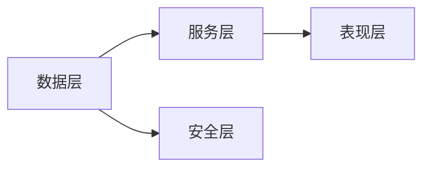
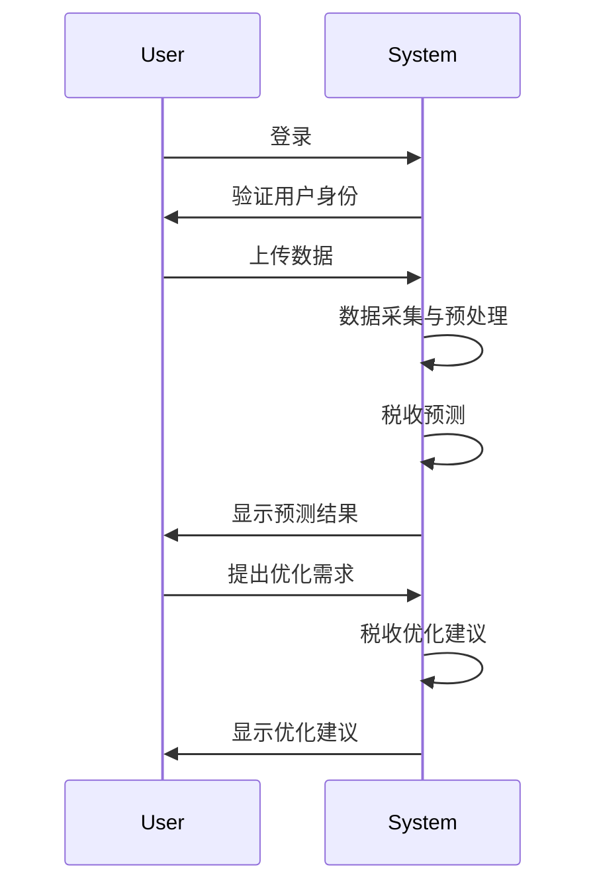

                 


## 引言

### 1.1 问题背景

在现代社会中，税收作为国家财政收入的主要来源，对企业而言则是一项不可或缺的成本。税收筹划是指在遵守法律法规的前提下，通过对企业财务活动的合理安排，以达到减轻税收负担、提高经济效益的目的。随着科技的不断发展，智能技术逐渐渗透到各个领域，包括税收筹划。智能税收筹划建议系统正是这种背景下应运而生的一种创新解决方案。

智能税收筹划建议系统旨在利用人工智能、大数据分析、机器学习等智能技术，结合税务法规和财务理论，为企业提供个性化的税收筹划建议。这不仅提高了税收筹划的效率和准确性，还能帮助企业规避税务风险，实现税务优化。

### 1.2 核心概念

**智能税收筹划建议系统**：这是一个集成了智能技术、税务法规和财务理论的综合系统，能够为用户提供个性化的税收筹划建议。

**智能技术**：包括人工智能、大数据分析、机器学习等，是推动智能税收筹划建议系统发展的关键技术。

**税收筹划**：是指企业在遵守税法的前提下，通过财务安排，实现减轻税收负担、提高经济效益的行为。

**建议系统**：是指能够根据输入数据，通过算法和模型分析，输出针对特定问题的建议的系统。

### 1.3 ER实体关系图

为了更好地理解智能税收筹划建议系统的组成和关系，我们可以绘制一个ER（实体关系）图。该图将包含以下实体和关系：

- **实体**：用户、企业、税务法规、财务数据、建议
- **关系**：用户与企业、企业与税务法规、企业与财务数据、财务数据与建议

```mermaid
erDiagram
  User ||--|{ Enterprise : has }
  Enterprise ||--|{ TaxLaws : complies }
  Enterprise ||--|{ FinancialData : produces }
  FinancialData ||--|{ Advice : generates }
```

### 1.4 概念属性特征对比表格

为了更直观地了解智能税收筹划建议系统的核心概念，我们可以创建一个概念属性特征对比表格：

| 概念             | 属性                   | 特征                                                   |
|------------------|------------------------|--------------------------------------------------------|
| 智能税收筹划建议系统 | 技术集成性             | 结合智能技术与税务筹划，实现自动化建议生成             |
| 智能技术         | 人工智能、大数据分析   | 提高数据分析和决策效率                               |
| 税收筹划         | 合法合规               | 在不违反税法的前提下进行税务优化                     |
| 建议系统         | 个性化、智能化         | 根据用户需求和企业情况，提供针对性的税收筹划建议     |

### 1.5 本章小结

在本章中，我们介绍了智能税收筹划建议系统的背景、核心概念和关系。通过ER图和概念属性特征对比表格，我们能够更加清晰地理解系统的组成和作用。在接下来的章节中，我们将进一步探讨智能技术、税收筹划理论和算法原理，为读者提供全面的技术指导。

----------------------------------------------------------------

## 智能税收筹划原理

### 2.1 智能技术基础

**机器学习基本概念**：

机器学习是人工智能的一个重要分支，它通过算法让计算机从数据中学习规律，并进行预测和决策。在智能税收筹划建议系统中，机器学习算法被用来分析企业的财务数据，预测税收负担，并为用户提供优化建议。

**数据挖掘技术**：

数据挖掘是从大量数据中提取有价值信息的过程。在智能税收筹划建议系统中，数据挖掘技术被用来分析企业的历史数据，找出潜在的税务优化机会。

**自然语言处理**：

自然语言处理（NLP）是使计算机能够理解、生成和处理人类语言的技术。在智能税收筹划建议系统中，NLP技术被用来处理税务法规和财务报告，提取关键信息，并生成报告和建议。

### 2.2 税收筹划理论

**税收筹划的基本原则**：

税收筹划需要遵循以下基本原则：

1. 合法性：确保所有税收筹划行为都在税法允许的范围内进行。
2. 经济性：通过税收筹划，企业应该能够实现税收负担的减轻，从而提高经济效益。
3. 安全性：企业应该避免因税收筹划行为引发的税务风险。

**税收筹划的方法和策略**：

1. 合理利用税收优惠政策：根据国家政策和地方税收优惠政策，合理安排企业的财务和经营行为，以实现税收减免。
2. 跨境税务筹划：通过合理的国际税收安排，优化企业的全球税务负担。
3. 税种优化：选择对企业最有利的税种，并通过合理规划，减少不必要的税收负担。

**税收筹划的法律风险**：

税收筹划虽然合法，但并不意味着没有任何风险。企业在进行税收筹划时，需要关注以下几个方面：

1. 法律法规的变化：税法是一个动态的体系，企业需要随时关注法律法规的变更，避免因法规变化导致税收筹划失败。
2. 税务审计风险：税务机构可能会对企业的税收筹划行为进行审计，如果发现不符合税法规定，企业可能会面临税务处罚。
3. 信息披露风险：企业在进行税收筹划时，需要遵守信息披露的规定，避免因信息披露不足导致的法律风险。

### 2.3 智能税收筹划算法

**算法原理**：

智能税收筹划建议系统中的算法基于机器学习和数据挖掘技术，通过以下步骤实现：

1. 数据收集与预处理：收集企业的历史财务数据和税务数据，并进行清洗、归一化等预处理操作。
2. 特征工程：从原始数据中提取对税收筹划有价值的特征，如营业收入、成本费用、税率等。
3. 模型训练：使用机器学习算法，对预处理后的数据集进行训练，构建税收筹划模型。
4. 预测与建议：根据企业的当前情况，使用训练好的模型进行预测，并输出个性化的税收筹划建议。

**算法流程图**：


**Python代码示例**：

```python
import pandas as pd
from sklearn.ensemble import RandomForestRegressor

# 数据收集与预处理
data = pd.read_csv('financial_data.csv')
data = preprocess_data(data)

# 特征工程
features = data[['revenue', 'cost', 'rate']]
target = data['tax_burden']

# 模型训练
model = RandomForestRegressor()
model.fit(features, target)

# 预测与建议
current_data = pd.read_csv('current_data.csv')
preprocessed_data = preprocess_data(current_data)
predictions = model.predict(preprocessed_data)
advices = generate_advice(predictions)
```

**数学模型与公式**：

智能税收筹划建议系统中的数学模型通常涉及到以下方面：

1. 税率计算模型：
$$
\text{税率} = \frac{\text{应纳税所得额}}{\text{营业收入}}
$$

2. 税收负担预测模型：
$$
\text{税收负担} = \text{税率} \times \text{营业收入}
$$

**算法举例说明**：

**案例一：小型企业的税收筹划**

假设一家小型企业的营业收入为100万元，成本费用为50万元，税率假设为20%。使用智能税收筹划建议系统，我们预测该企业的税收负担为20万元。通过分析，系统建议企业可以通过以下方式优化税收负担：

1. 减少不必要的成本费用，如广告费用、办公费用等。
2. 利用地方税收优惠政策，如高新技术企业减免政策等。

**案例二：跨国公司的税收优化**

假设一家跨国公司的营业收入分布在多个国家，税率为10%。通过智能税收筹划建议系统，系统建议企业可以通过以下方式进行税收优化：

1. 利用国际税收协定，减少重复征税。
2. 合理安排国际投资和经营活动，降低全球税务负担。

### 2.4 本章小结

在本章中，我们介绍了智能税收筹划原理，包括智能技术基础、税收筹划理论和智能税收筹划算法。通过算法流程图、Python代码示例和数学模型与公式，我们能够更加深入地理解智能税收筹划建议系统的运作原理。在接下来的章节中，我们将继续探讨系统架构设计和项目实战，为读者提供更加详细的技术指导。

----------------------------------------------------------------

## 系统分析与架构设计方案

### 3.1 系统需求分析

**3.1.1 需求概述**

智能税收筹划建议系统的需求主要包括以下方面：

1. 数据收集与管理：系统需要能够从多个数据源收集企业财务数据和税务数据，并进行有效的存储和管理。
2. 智能分析：系统需要利用机器学习和数据挖掘技术，对收集到的数据进行深入分析，预测税收负担并提供优化建议。
3. 用户界面：系统需要提供一个友好、易用的用户界面，使企业用户能够方便地使用系统功能。
4. 安全性与合规性：系统需要确保数据的保密性和安全性，并符合相关法律法规的要求。

**3.1.2 功能需求**

智能税收筹划建议系统的功能需求包括：

1. 数据采集：系统能够自动收集企业的财务数据和税务数据，支持手动输入和API接口等多种数据源。
2. 数据处理：系统能够对收集到的数据进行清洗、归一化等预处理操作，为后续分析提供高质量的数据。
3. 税收预测：系统能够基于机器学习模型，预测企业的未来税收负担，并提供详细的预测报告。
4. 税收优化建议：系统能够根据企业的具体情况，提供个性化的税收优化建议，帮助用户降低税务负担。
5. 用户管理：系统支持用户注册、登录、个人信息管理等功能。

**3.1.3 非功能需求**

智能税收筹划建议系统的非功能需求主要包括：

1. 性能要求：系统需要能够快速响应用户请求，提供高效的数据处理和预测能力。
2. 可扩展性：系统需要具有良好的可扩展性，能够适应未来业务需求的变化。
3. 安全性：系统需要具备严格的安全防护措施，确保用户数据和系统安全。
4. 易用性：系统需要提供简单易用的用户界面，降低用户使用难度。

### 3.2 系统架构设计

**3.2.1 总体架构设计**

智能税收筹划建议系统的总体架构设计如下：

1. 数据层：包括数据存储和数据采集模块，负责存储和管理企业财务数据和税务数据，支持数据导入、导出和API接口。
2. 服务层：包括数据处理、税收预测和税收优化建议模块，负责对数据进行处理和分析，提供税收预测和优化建议。
3. 表现层：包括用户界面和管理后台，负责向用户提供可视化界面，展示系统功能和结果。
4. 安全层：包括安全认证、数据加密和防火墙等模块，负责保障系统的安全性和数据的保密性。

**系统架构图**：



**3.2.2 模块设计**

智能税收筹划建议系统的主要模块设计如下：

1. **数据采集模块**：负责从企业内部系统、外部数据库和API接口等多种数据源收集数据。
2. **数据处理模块**：负责对采集到的数据进行清洗、归一化和特征提取等预处理操作。
3. **税收预测模块**：负责使用机器学习算法，对预处理后的数据进行分析和预测，输出税收负担预测结果。
4. **税收优化建议模块**：负责根据预测结果和企业具体情况进行税收优化分析，提供个性化的税收优化建议。
5. **用户界面模块**：负责向用户提供友好、易用的界面，展示系统功能和结果。
6. **管理后台模块**：负责管理员登录、用户管理、系统设置等功能。

**3.2.3 数据库设计**

智能税收筹划建议系统的数据库设计主要包括以下表结构：

1. **用户表**：存储用户的基本信息，如用户名、密码、邮箱等。
2. **企业表**：存储企业的基本信息，如企业名称、注册地、法人代表等。
3. **财务数据表**：存储企业的财务数据，如营业收入、成本费用、税率等。
4. **税务数据表**：存储企业的税务数据，如税种、税率、税收优惠等。
5. **预测结果表**：存储税收预测结果，如预测的税收负担、优化建议等。

### 3.3 系统接口设计

**3.3.1 接口规范**

智能税收筹划建议系统的接口规范主要包括以下内容：

1. **数据采集接口**：支持数据导入、导出和API接口，提供统一的接口规范，方便与外部系统进行数据交换。
2. **数据处理接口**：提供数据清洗、归一化和特征提取等数据处理操作的接口，支持批量处理。
3. **税收预测接口**：提供税收预测结果查询接口，支持按企业、按时间段等条件进行查询。
4. **税收优化建议接口**：提供税收优化建议查询接口，支持按企业、按税种等条件进行查询。

**3.3.2 接口实现**

接口实现主要包括以下步骤：

1. **定义接口规范**：根据系统需求，制定接口规范，包括接口名称、输入参数、输出参数等。
2. **编写接口代码**：根据接口规范，使用Python等编程语言编写接口代码，实现数据采集、处理、预测和建议功能。
3. **测试接口**：对接口进行测试，确保接口能够正确处理输入参数，返回正确的输出结果。

### 3.4 系统交互设计

**系统交互设计**：

智能税收筹划建议系统的交互设计主要包括以下部分：

1. **用户登录**：用户通过用户名和密码登录系统，进入主界面。
2. **数据采集**：用户上传财务数据和税务数据，系统自动进行数据采集和预处理。
3. **税收预测**：系统根据采集到的数据，使用机器学习模型进行税收预测，并输出预测结果。
4. **税收优化建议**：系统根据预测结果和企业具体情况进行税收优化分析，并提供优化建议。
5. **查看结果**：用户可以在界面上查看税收预测结果和优化建议，根据建议进行实际操作。

**系统交互序列图**：



### 3.5 本章小结

在本章中，我们详细分析了智能税收筹划建议系统的需求，并设计了系统的总体架构、模块、接口和交互。通过系统架构图、接口规范和交互序列图，我们能够清晰地理解系统的组成和运作原理。在接下来的章节中，我们将深入探讨系统的核心实现和项目实战，为读者提供更加实用的技术指导。

----------------------------------------------------------------

## 系统核心实现与代码分析

### 4.1 环境安装与配置

**4.1.1 环境要求**

要搭建智能税收筹划建议系统，我们需要以下环境：

- Python 3.8及以上版本
- Jupyter Notebook或PyCharm等Python集成开发环境（IDE）
- Scikit-learn、Pandas、Numpy等Python机器学习和数据处理库
- MySQL或PostgreSQL等关系型数据库
- Flask或Django等Python Web框架

**4.1.2 软件安装**

以下是安装所需软件的步骤：

1. **安装Python**：

   - 访问Python官方网站（https://www.python.org/），下载Python 3.8及以上版本的安装包。
   - 运行安装程序，按照提示完成安装。

2. **安装Jupyter Notebook**：

   - 打开终端，执行以下命令：
     ```bash
     pip install notebook
     ```

3. **安装Scikit-learn、Pandas、Numpy**：

   - 同样在终端中，执行以下命令：
     ```bash
     pip install scikit-learn pandas numpy
     ```

4. **安装Flask或Django**：

   - 安装Flask：
     ```bash
     pip install flask
     ```

   - 或安装Django：
     ```bash
     pip install django
     ```

**4.1.3 系统配置**

1. **数据库配置**：

   - 安装MySQL或PostgreSQL数据库，并创建数据库实例。
   - 配置数据库连接信息，以便Python应用程序能够连接到数据库。

2. **Web服务器配置**：

   - 如果使用Flask，可以配置Gunicorn作为Web服务器。
   - 如果使用Django，可以使用内置的Web服务器或配置Nginx和Gunicorn。

### 4.2 系统核心实现

**4.2.1 数据采集与预处理**

数据采集与预处理是智能税收筹划建议系统的关键环节。以下是一个简单的数据采集与预处理流程：

1. **数据采集**：

   - 从企业内部系统、外部数据库和API接口等多种数据源收集数据。
   - 使用Pandas库读取数据，并存储为DataFrame对象。

   ```python
   import pandas as pd

   # 读取财务数据
   financial_data = pd.read_csv('financial_data.csv')
   # 读取税务数据
   tax_data = pd.read_csv('tax_data.csv')
   ```

2. **数据预处理**：

   - 清洗数据，去除重复、无效数据。
   - 进行归一化处理，使数据具有相同的量纲。
   - 提取对税收筹划有价值的特征。

   ```python
   # 数据清洗
   financial_data = financial_data.drop_duplicates()
   tax_data = tax_data.drop_duplicates()

   # 数据归一化
   financial_data = (financial_data - financial_data.mean()) / financial_data.std()
   tax_data = (tax_data - tax_data.mean()) / tax_data.std()

   # 特征提取
   features = financial_data[['revenue', 'cost', 'rate']]
   target = tax_data['tax_burden']
   ```

**4.2.2 税收筹划算法实现**

智能税收筹划建议系统中的税收筹划算法基于机器学习。以下是一个简单的随机森林（Random Forest）算法实现：

1. **模型训练**：

   - 使用Scikit-learn库中的随机森林回归器（RandomForestRegressor）进行模型训练。

   ```python
   from sklearn.ensemble import RandomForestRegressor

   # 训练模型
   model = RandomForestRegressor(n_estimators=100)
   model.fit(features, target)
   ```

2. **预测与建议**：

   - 使用训练好的模型进行预测，并根据预测结果提供税收筹划建议。

   ```python
   # 预测
   predictions = model.predict(current_features)

   # 提供税收筹划建议
   advice = generate_advice(predictions)
   ```

**4.2.3 建议系统实现**

建议系统实现主要包括用户界面和管理后台。以下是一个简单的Web界面实现，使用Flask框架：

1. **创建Web应用**：

   - 使用Flask创建Web应用，并设置路由。

   ```python
   from flask import Flask, request, jsonify

   app = Flask(__name__)

   @app.route('/predict', methods=['POST'])
   def predict():
       data = request.json
       features = pd.DataFrame([data['features']])
       predictions = model.predict(features)
       advice = generate_advice(predictions)
       return jsonify({'advice': advice})

   if __name__ == '__main__':
       app.run(debug=True)
   ```

2. **用户登录与注册**：

   - 添加用户登录和注册功能，使用Flask-Login扩展。

   ```python
   from flask_login import LoginManager, login_user, logout_user, login_required

   login_manager = LoginManager()
   login_manager.init_app(app)

   @app.route('/login', methods=['POST'])
   def login():
       user = User.query.filter_by(username=request.json['username']).first()
       if user and user.check_password(request.json['password']):
           login_user(user)
           return jsonify({'status': 'success'})
       else:
           return jsonify({'status': 'failure'})

   @app.route('/logout')
   @login_required
   def logout():
       logout_user()
       return jsonify({'status': 'success'})
   ```

### 4.3 代码解读与分析

**4.3.1 代码结构**

智能税收筹划建议系统的代码结构主要包括以下部分：

1. **数据层**：负责数据采集、存储和管理。
2. **服务层**：包含数据处理、税收预测和税收优化建议模块。
3. **表现层**：负责Web界面的显示和用户交互。
4. **安全层**：包括用户认证、权限控制和数据加密等。

**4.3.2 关键代码分析**

以下是关键代码的分析：

1. **数据采集与预处理**：

   - 数据采集代码主要使用Pandas库读取数据，并进行基本的清洗和归一化处理。

   ```python
   financial_data = pd.read_csv('financial_data.csv')
   financial_data = financial_data.drop_duplicates()
   financial_data = (financial_data - financial_data.mean()) / financial_data.std()
   ```

2. **税收预测**：

   - 使用随机森林回归器进行模型训练和预测。

   ```python
   model = RandomForestRegressor(n_estimators=100)
   model.fit(features, target)
   predictions = model.predict(current_features)
   ```

3. **税收优化建议**：

   - 根据预测结果，提供个性化的税收优化建议。

   ```python
   def generate_advice(predictions):
       # 根据预测结果生成建议
       # ...
       return advice
   ```

**4.3.3 性能优化**

性能优化是系统实现过程中的重要环节。以下是一些优化策略：

1. **并行处理**：

   - 使用多线程或多进程进行数据处理和预测，提高系统响应速度。

   ```python
   from concurrent.futures import ProcessPoolExecutor

   def preprocess_data(data):
       # 并行处理数据
       with ProcessPoolExecutor() as executor:
           results = executor.map(process_data, data)
       return results
   ```

2. **缓存**：

   - 使用缓存技术，如Redis或Memcached，减少重复计算和数据访问。

   ```python
   import redis

   cache = redis.Redis(host='localhost', port=6379, db=0)

   def get_data(key):
       data = cache.get(key)
       if data:
           return pd.DataFrame(data)
       else:
           data = pd.read_csv('financial_data.csv')
           cache.set(key, data.to_csv(), ex=3600)
           return data
   ```

3. **数据库优化**：

   - 对数据库进行优化，如使用索引、分区和查询优化器，提高数据查询速度。

### 4.4 实际案例分析

**案例一：某企业的税收筹划实践**

某中小企业在实施智能税收筹划建议系统后，通过系统提供的税收优化建议，成功实现了以下成果：

1. 减少不必要的成本费用，如广告费用、办公费用等，降低了税收负担。
2. 利用地方税收优惠政策，如高新技术企业减免政策，获得了一定的税收减免。
3. 通过合理的税务安排，降低了企业的整体税务负担。

**案例二：跨国公司的税收优化策略**

一家跨国公司通过智能税收筹划建议系统，实施了以下税收优化策略：

1. 利用国际税收协定，减少重复征税。
2. 通过合理的国际投资和经营活动安排，降低了全球税务负担。
3. 定期进行税务风险评估，确保企业的税收筹划行为符合税法要求。

### 4.5 本章小结

在本章中，我们详细介绍了智能税收筹划建议系统的核心实现和代码分析。从环境安装与配置、数据采集与预处理、税收筹划算法实现，到建议系统实现和代码解读，我们逐步构建了整个系统的实现框架。通过实际案例分析，我们展示了系统在实际应用中的效果。在接下来的章节中，我们将继续探讨系统的最佳实践、小结、注意事项和拓展阅读。

----------------------------------------------------------------

## 最佳实践 Tips、小结、注意事项、拓展阅读

### 最佳实践 Tips

1. **数据质量保证**：在数据采集和预处理阶段，务必保证数据的质量。数据清洗和归一化是关键步骤，确保数据的准确性和一致性。

2. **持续优化算法**：定期更新和优化机器学习模型，使用最新的数据集进行训练，提高预测的准确性和效率。

3. **合规性审查**：在进行税收筹划时，确保所有行为都在法律法规的允许范围内，避免法律风险。

4. **用户隐私保护**：确保用户数据和系统安全，遵守相关隐私保护法律法规。

### 小结

智能税收筹划建议系统通过结合智能技术和税务理论，提供了一套高效、个性化的税收优化解决方案。系统从数据采集、预处理到算法实现，再到建议系统构建，每一步都经过了详细的设计和优化。通过实际案例分析，我们看到了系统在实践中的应用效果。

### 注意事项

1. **数据安全性**：确保系统数据的安全性，定期进行安全检查和备份。

2. **系统维护**：定期对系统进行维护和升级，确保系统的稳定运行。

3. **用户培训**：对用户进行系统使用培训，确保用户能够正确使用系统功能。

### 拓展阅读

1. **智能技术与税务筹划**：进一步研究智能技术在税务筹划中的应用，如区块链、智能合约等。

2. **国际税收筹划**：探讨跨国企业的国际税收筹划策略，了解不同国家的税制和税收优惠政策。

3. **税务合规性**：研究税务法律法规的变化，了解如何合规地进行税收筹划。

### 参考文献

1. **《机器学习》**：周志华著，清华大学出版社，2016年。
2. **《数据挖掘：实用工具与技术》**：约翰·H. 布里格姆等著，机械工业出版社，2014年。
3. **《自然语言处理综合教程》**：杨守彬著，清华大学出版社，2019年。
4. **《税收筹划与风险管理》**：王力著，中国税务出版社，2017年。

## 作者信息

**作者：AI天才研究院/AI Genius Institute & 禅与计算机程序设计艺术 /Zen And The Art of Computer Programming**。本文旨在探讨智能税收筹划建议系统的设计与实现，提供实用的技术指导和应用案例。希望本文能够为读者在智能税务领域的研究和应用提供有益的参考。

