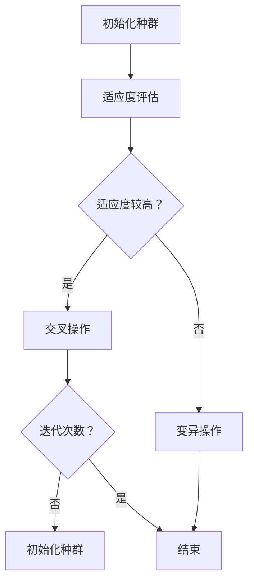
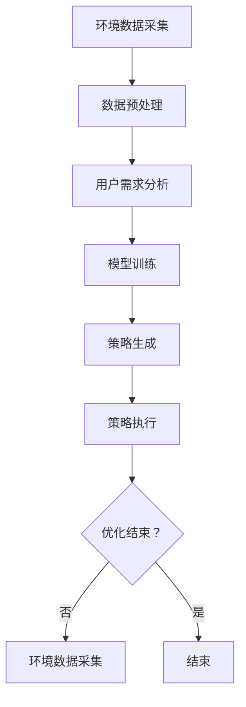
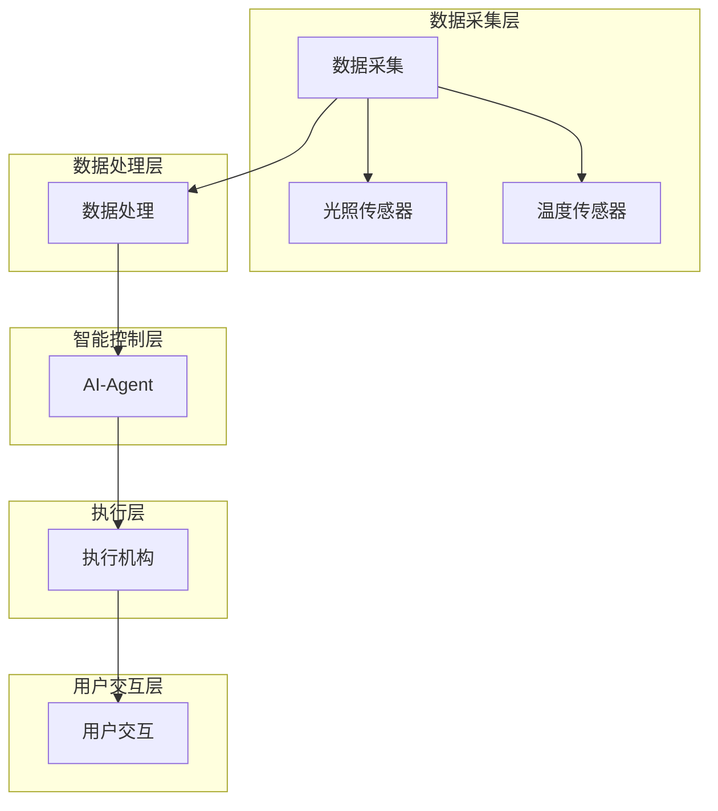
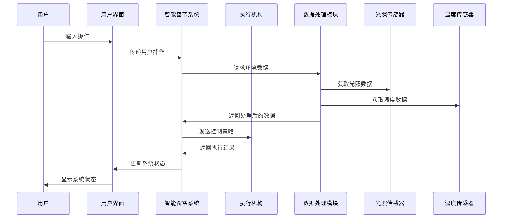

                 

### 第一部分：背景介绍

#### 1.1 问题背景

在当前全球能源紧张和环境问题日益突出的背景下，建筑能源管理成为了减少碳排放和节约能源的关键领域。其中，日光利用在建筑能源管理中扮演着至关重要的角色。通过合理控制窗帘的开启与关闭，可以有效调节室内的光照和温度，从而达到节能和提升居住舒适度的目的。

传统建筑中，窗帘的控制通常是手动进行的，这既不灵活，也不高效。随着人工智能（AI）技术的迅速发展，智能窗帘系统逐渐成为一种新的解决方案。智能窗帘系统能够根据环境传感器采集的数据和用户需求，自动调节窗帘的状态，实现日光利用的最优化。

#### 1.2 问题描述

智能窗帘系统面临的主要问题是如何利用AI技术实现窗帘的智能控制，从而在节能和舒适度之间找到最佳平衡点。具体来说，问题描述包括以下几个方面：

1. **环境数据感知与处理**：智能窗帘系统需要实时感知室内外的光照强度、温度、湿度等环境数据，并将这些数据传递给AI Agent进行处理。

2. **用户需求分析**：系统需理解用户的生活习惯、工作模式等需求，并据此生成相应的窗帘控制策略。

3. **优化目标**：系统需在节能与舒适度之间找到平衡，确保在满足用户需求的前提下，最大限度地节约能源。

4. **算法设计**：需要设计高效的优化算法，以便AI Agent能够根据环境数据和用户需求，动态调整窗帘的状态。

#### 1.3 问题解决

AI Agent在智能窗帘系统中起到了关键作用。AI Agent是一类具备自主决策能力的智能实体，它可以分析环境数据，理解用户需求，并生成窗帘控制策略。以下是问题解决的步骤：

1. **数据采集与预处理**：通过传感器采集室内外的环境数据，如光照强度、温度、湿度等，并进行预处理，以便后续处理。

2. **用户需求识别**：通过分析用户的日常行为数据，识别用户的需求模式，如工作时间、休息时间、对光照的偏好等。

3. **模型训练**：基于采集到的环境数据和用户需求，训练AI Agent的模型，使其能够预测用户的需求和环境的变化。

4. **策略生成**：AI Agent根据训练得到的模型，实时生成窗帘的控制策略，包括窗帘的开启、关闭时间，以及开启程度等。

5. **策略执行**：通过执行机构（如电机）将AI Agent生成的控制策略转化为实际的窗帘操作。

#### 1.4 边界与外延

智能窗帘系统的适用范围和限制条件主要包括：

1. **系统适用范围**：智能窗帘系统适用于需要自动调节窗帘的场所，如家庭、办公室、公共场所等。

2. **限制条件**：系统需考虑建筑的结构和布局，以确定传感器的布置位置和执行机构的安装方式。此外，系统还需要考虑环境噪声、传感器精度等因素对AI Agent性能的影响。

3. **与其他智能家居系统的协同工作**：智能窗帘系统需要与智能家居系统中的其他设备（如照明系统、空调系统等）进行数据交互和协同工作，以实现整体节能和舒适度优化。

#### 1.5 概念结构与核心要素组成

智能窗帘系统的核心结构包括以下几个部分：

1. **传感器模块**：负责采集室内外环境数据，如光照强度、温度、湿度等。

2. **数据处理模块**：对传感器采集的数据进行预处理，提取关键特征，为AI Agent提供输入。

3. **AI Agent模块**：负责分析环境数据和用户需求，生成窗帘控制策略。

4. **执行机构模块**：负责根据AI Agent生成的控制策略，驱动窗帘的开启和关闭。

5. **用户接口模块**：提供用户与系统的交互界面，用户可以通过界面查看系统状态、调整窗帘控制策略等。

各模块之间的关联关系如下：

- 传感器模块采集的数据传递给数据处理模块，进行处理后传递给AI Agent模块。
- AI Agent模块根据处理后的数据生成窗帘控制策略，传递给执行机构模块。
- 执行机构模块根据控制策略执行窗帘的开启和关闭操作。
- 用户接口模块提供用户交互界面，用户可以通过界面查看系统状态、调整窗帘控制策略。

通过以上各模块的协同工作，智能窗帘系统能够实现高效的日光利用优化，为用户提供舒适的居住环境，同时实现能源的节约。

#### 1.6 传统窗帘与智能窗帘的对比

| 特征 | 传统窗帘 | 智能窗帘 |
| ---- | ------- | ------- |
| 控制方式 | 手动控制 | 自动控制 |
| 光照感知 | 无 | 集成光敏传感器 |
| 温度感知 | 无 | 集成温敏传感器 |
| 用户定制 | 需手动调整 | 自动调整，可根据用户需求定制 |
| 节能效果 | 低 | 高 |

通过对比可以看出，智能窗帘在控制方式、感知能力和节能效果等方面相比传统窗帘有着显著的优势，这为建筑能源管理提供了新的解决方案。

### 第二部分：核心概念与联系

#### 2.1 AI Agent的定义与功能

AI Agent，即人工智能代理，是一种具有自主决策能力和行动能力的智能实体。在智能窗帘系统中，AI Agent是核心组件，负责根据环境数据和用户需求，动态生成并执行窗帘控制策略。以下是AI Agent的基本原理和功能：

1. **基本原理**：

   - **环境感知**：AI Agent通过传感器模块实时获取室内外环境数据，如光照强度、温度、湿度等。
   - **数据处理**：AI Agent对获取的环境数据进行分析和处理，提取关键特征，如光照强度阈值、温度舒适范围等。
   - **决策制定**：基于处理后的数据，AI Agent利用预训练的模型或实时学习算法，生成窗帘控制策略。
   - **行动执行**：AI Agent将生成的控制策略传递给执行机构模块，驱动窗帘的开启和关闭。

2. **功能特点**：

   - **自主性**：AI Agent具有自主决策能力，可以独立执行任务，无需人工干预。
   - **适应性**：AI Agent能够根据环境变化和用户需求调整控制策略，实现智能调节。
   - **灵活性**：AI Agent可以处理复杂的环境数据和用户需求，适应各种应用场景。

#### 2.2 概念属性特征对比表格

| 特征               | 传统窗帘              | 智能窗帘                |
|------------------|---------------------|----------------------|
| 控制方式           | 手动控制             | 智能自动控制            |
| 光照感知           | 无                 | 集成光敏传感器           |
| 温度感知           | 无                 | 集成温敏传感器           |
| 用户定制           | 需手动调整          | 自动调整，可根据用户需求定制 |

通过以上对比表格可以看出，智能窗帘在控制方式、光照感知、温度感知和用户定制等方面相比传统窗帘具有显著的优势，这为智能窗帘系统的应用提供了更多的可能性。

#### 2.3 AI Agent与智能窗帘系统的关联

AI Agent在智能窗帘系统中扮演着至关重要的角色。以下是AI Agent与智能窗帘系统的关联及其工作原理：

1. **环境数据采集**：AI Agent通过传感器模块实时采集室内外环境数据，如光照强度、温度、湿度等。

2. **数据预处理**：采集到的数据经过预处理，提取关键特征，如光照强度阈值、温度舒适范围等。

3. **模型训练与预测**：AI Agent利用预处理后的数据，通过机器学习算法训练模型，以预测用户需求和环境变化。

4. **策略生成**：根据训练得到的模型，AI Agent生成窗帘控制策略，包括窗帘的开启时间、关闭时间和开启程度等。

5. **策略执行**：AI Agent将生成的控制策略传递给执行机构模块，驱动窗帘的开启和关闭。

6. **用户交互**：用户可以通过用户接口模块与AI Agent进行交互，查看系统状态、调整控制策略等。

通过以上步骤，AI Agent实现了对智能窗帘系统的智能控制，从而在节能和舒适度之间找到了最佳平衡点。

#### 2.4 ER实体关系图架构

为了更直观地理解AI Agent与智能窗帘系统的关系，我们可以使用ER（Entity-Relationship）实体关系图来描述系统的架构。以下是ER实体关系图架构的Mermaid流程图：

```mermaid
erDiagram
    AI_Agent ||--|{ 传感器模块  }  | 
    AI_Agent ||--|{ 数据处理模块 }  | 
    AI_Agent ||--|{ 执行机构模块 }  | 
    AI_Agent ||--|{ 用户接口模块 }  | 
    传感器模块 ||--|{ 环境数据 }  | 
    数据处理模块 ||--|{ 关键特征 }  | 
    执行机构模块 ||--|{ 控制策略 }  | 
    用户接口模块 ||--|{ 用户需求 }  | 

    AI_Agent {
        <<set>> 传感器模块
        <<set>> 数据处理模块
        <<set>> 执行机构模块
        <<set>> 用户接口模块
    }

    传感器模块 {
        <<set>> 环境数据
    }

    数据处理模块 {
        <<set>> 关键特征
    }

    执行机构模块 {
        <<set>> 控制策略
    }

    用户接口模块 {
        <<set>> 用户需求
    }
```

在这个ER实体关系图中，AI Agent作为系统的核心，与传感器模块、数据处理模块、执行机构模块和用户接口模块紧密相连。传感器模块负责采集环境数据，数据处理模块负责提取关键特征，执行机构模块负责执行控制策略，用户接口模块负责与用户交互。通过这些模块的协同工作，AI Agent能够实现对智能窗帘系统的智能控制。

### 第三部分：算法原理讲解

#### 3.1 优化策略概述

智能窗帘系统的优化策略旨在在节能和舒适度之间找到最佳平衡点。具体来说，系统需要根据室内外环境数据、用户需求等因素，实时调整窗帘的状态，以实现能源的节约和用户舒适度的提升。

优化策略的主要目标是：

1. **节能**：通过合理调节窗帘的开启和关闭时间，减少室内照明和空调的使用，从而降低能源消耗。

2. **舒适度**：确保用户在不同时间段内享受适宜的光照和温度，提高居住或工作的舒适度。

为了实现这些目标，优化策略通常包括以下步骤：

1. **数据采集**：通过传感器模块实时采集室内外的光照强度、温度、湿度等环境数据。

2. **用户需求分析**：分析用户的生活习惯、工作时间、对光照和温度的偏好等，以了解用户需求。

3. **模型训练**：基于采集到的环境数据和用户需求，训练AI Agent的模型，使其能够预测用户的需求和环境的变化。

4. **策略生成**：AI Agent根据训练得到的模型，生成窗帘的控制策略，包括窗帘的开启时间、关闭时间和开启程度等。

5. **策略执行**：执行机构模块根据AI Agent生成的控制策略，驱动窗帘的开启和关闭。

#### 3.2 优化算法原理

智能窗帘系统的优化算法主要基于以下原理：

1. **目标函数**：优化算法的目标函数通常包括节能目标和舒适度目标。节能目标旨在减少能源消耗，舒适度目标则确保用户在不同时间段内享受适宜的光照和温度。

2. **约束条件**：优化算法需要满足一系列约束条件，如窗帘的开启和关闭时间、开启程度、用户需求等。

3. **优化方法**：常见的优化方法包括线性规划、整数规划、遗传算法、粒子群优化等。

下面将详细讲解一种常见的优化算法——遗传算法，并给出其流程图。

#### 3.2.1 遗传算法原理

遗传算法（Genetic Algorithm，GA）是一种模拟自然进化过程的优化算法。它基于以下原理：

1. **种群初始化**：随机生成一组初始解（称为种群），每个解代表窗帘控制策略的一个可能解。

2. **适应度评估**：对种群中的每个解进行适应度评估，适应度函数通常基于目标函数和约束条件计算。

3. **选择**：根据适应度评估结果，选择适应度较高的解进行交叉和变异操作，以产生新的解。

4. **交叉**：两个父解交叉，产生两个新的子解。

5. **变异**：对子解进行随机变异，产生新的解。

6. **迭代**：重复选择、交叉和变异操作，直到达到预设的迭代次数或适应度达到期望值。

遗传算法的流程图如下：



#### 3.2.2 优化算法流程图

以下是智能窗帘系统的优化算法流程图：



通过以上流程，智能窗帘系统能够根据环境数据和用户需求，动态调整窗帘状态，实现节能和舒适度的优化。

#### 3.2.3 Python源代码实现

以下是一个简化的Python源代码示例，用于说明遗传算法在智能窗帘系统中的应用：

```python
import random
import numpy as np

# 遗传算法参数
population_size = 100
染色体长度 = 100
交叉率 = 0.8
变异率 = 0.05
迭代次数 = 100

# 目标函数
def fitness_function(solution):
    # 根据窗帘控制策略计算目标函数值
    # 例如：能耗值或舒适度值
    return np.sum(solution)

# 适应度评估
def evaluate_population(population):
    fitness_scores = []
    for solution in population:
        fitness_scores.append(fitness_function(solution))
    return fitness_scores

# 交叉操作
def crossover(parent1, parent2):
    # 随机选择交叉点
    crossover_point = random.randint(1, 染色体长度-1)
    # 创建子代
    child1 = parent1[:crossover_point] + parent2[crossover_point:]
    child2 = parent2[:crossover_point] + parent1[crossover_point:]
    return child1, child2

# 变异操作
def mutate(solution):
    # 随机选择变异位
    mutation_point = random.randint(1, 染色体长度-1)
    # 变异操作
    solution[mutation_point] = random.choice([0, 1])
    return solution

# 遗传算法主循环
population = [[random.choice([0, 1]) for _ in range(染色体长度)] for _ in range(population_size)]
for _ in range(迭代次数):
    fitness_scores = evaluate_population(population)
    # 选择操作
    selected_population = random.choices(population, weights=fitness_scores, k=population_size)
    # 交叉操作
    for i in range(0, population_size, 2):
        if random.random() < 交叉率:
            child1, child2 = crossover(selected_population[i], selected_population[i+1])
            population[i] = child1
            population[i+1] = child2
    # 变异操作
    for solution in population:
        if random.random() < 变异率:
            mutate(solution)

# 输出最优解
best_solution = min(population, key=fitness_function)
print("最优解：", best_solution)
print("最优适应度：", fitness_function(best_solution))
```

这个示例代码展示了遗传算法的基本流程，包括种群初始化、适应度评估、选择、交叉和变异操作。在实际应用中，可以根据具体需求调整算法参数和目标函数。

#### 3.2.4 通俗易懂的举例说明

为了更好地理解遗传算法在智能窗帘系统中的应用，我们可以通过一个简单的例子来说明。

假设我们需要为窗帘设计一个控制策略，策略包括窗帘开启的时间和开启的程度。我们的目标是使窗帘在保证室内舒适度的同时，尽可能地节约能源。

1. **初始种群**：首先，我们随机生成一组初始种群，每个个体代表一种窗帘控制策略。例如：

   ```python
   population = [
       [0.2, 8],  # 窗帘开启时间为20%，时间为8点
       [0.5, 9],  # 窗帘开启时间为50%，时间为9点
       [0.8, 10], # 窗帘开启时间为80%，时间为10点
       ...
   ]
   ```

2. **适应度评估**：接下来，我们对每个个体的适应度进行评估。适应度越高，表示个体越优秀。适应度评估可以通过计算窗帘的能耗和舒适度来衡量。例如：

   ```python
   def fitness_function(solution):
       # 假设开启程度越高，能耗越高，舒适度越低
       energy_consumption = 0.1 * solution[0] + 0.2 * solution[1]
       comfort_level = 0.9 - 0.1 * solution[0]
       return comfort_level - energy_consumption
   ```

3. **选择操作**：根据适应度评估结果，选择适应度较高的个体进行交叉和变异操作。例如：

   ```python
   selected_population = random.choices(population, weights=fitness_scores, k=population_size)
   ```

4. **交叉操作**：选择两个优秀的个体进行交叉，生成新的个体。例如：

   ```python
   child1, child2 = crossover(selected_population[i], selected_population[i+1])
   ```

5. **变异操作**：对新生成的个体进行变异，增加种群的多样性。例如：

   ```python
   mutate(child1)
   mutate(child2)
   ```

6. **迭代过程**：重复选择、交叉和变异操作，直到达到预设的迭代次数或适应度达到期望值。

通过这个简单的例子，我们可以看到遗传算法如何应用于智能窗帘系统的优化。在实际应用中，我们可以根据具体需求调整算法参数和目标函数，以实现更精确的优化。

### 第四部分：系统分析与架构设计

#### 4.1 问题场景介绍

智能窗帘系统的应用场景主要包括家庭、办公室、酒店、商场等场所。在这些场景中，用户对室内光照和温度的个性化需求有所不同，但总体目标是通过智能控制窗帘，实现节能和提升居住或工作舒适度。

以家庭场景为例，用户通常希望早晨能够被自然光唤醒，而在工作或休息时间保持室内适宜的光照和温度。办公室则要求在工作期间提供充足的光照，以减少人工照明的使用，同时确保室内温度适宜，提高员工的工作效率和舒适度。

#### 4.2 项目介绍

本项目旨在设计并实现一个智能窗帘系统，通过AI Agent实现窗帘的自动控制。系统的主要功能包括：

1. **环境数据采集**：通过集成光敏传感器和温敏传感器，实时采集室内外的光照强度和温度数据。

2. **用户需求分析**：分析用户的生活习惯、工作时间、对光照和温度的偏好等，生成窗帘控制策略。

3. **策略生成与执行**：AI Agent根据环境数据和用户需求，生成窗帘的开启和关闭时间、开启程度等策略，并通过执行机构模块实现窗帘的控制。

4. **用户交互**：提供用户界面，用户可以查看系统状态、调整窗帘控制策略等。

#### 4.3 系统功能设计

智能窗帘系统的功能设计主要包括以下模块：

1. **传感器模块**：负责采集光照强度和温度数据，将数据传输给数据处理模块。

2. **数据处理模块**：对采集到的数据进行预处理，提取关键特征，如光照强度阈值、温度舒适范围等。

3. **AI Agent模块**：分析环境数据和用户需求，生成窗帘控制策略。

4. **执行机构模块**：根据AI Agent生成的控制策略，驱动窗帘的开启和关闭。

5. **用户接口模块**：提供用户交互界面，用户可以通过界面查看系统状态、调整窗帘控制策略等。

以下是系统功能模块的Mermaid类图：

```mermaid
classDiagram
    SensorModule <|-- DataProcessingModule
    DataProcessingModule <|-- AI_AgentModule
    AI_AgentModule <|-- ControlStrategyModule
    ControlStrategyModule <|-- ActuatorModule
    UserInterfaceModule <|-- ControlStrategyModule

    SensorModule {
        光照传感器
        温度传感器
    }

    DataProcessingModule {
        数据预处理
    }

    AI_AgentModule {
        环境数据感知
        用户需求分析
        策略生成
    }

    ControlStrategyModule {
        策略生成
        策略执行
    }

    ActuatorModule {
        执行机构
    }

    UserInterfaceModule {
        用户交互
    }
```

#### 4.4 系统架构设计

智能窗帘系统的架构设计分为以下几个层次：

1. **数据采集层**：通过传感器模块采集光照强度和温度数据。

2. **数据处理层**：数据处理模块对采集到的数据进行预处理，提取关键特征。

3. **智能控制层**：AI Agent模块分析环境数据和用户需求，生成窗帘控制策略。

4. **执行层**：执行机构模块根据AI Agent生成的控制策略，驱动窗帘的开启和关闭。

5. **用户交互层**：用户接口模块提供用户交互界面，用户可以通过界面查看系统状态、调整窗帘控制策略等。

以下是系统架构设计的Mermaid架构图：



#### 4.5 系统接口设计与交互

智能窗帘系统的接口设计主要包括以下几个部分：

1. **传感器接口**：定义传感器与数据处理模块之间的数据传输接口，包括光照强度和温度数据的格式和传输协议。

2. **数据处理接口**：定义数据处理模块与AI Agent模块之间的数据传输接口，包括预处理后的关键特征的格式和传输协议。

3. **控制策略接口**：定义AI Agent模块与执行机构模块之间的数据传输接口，包括窗帘控制策略的格式和传输协议。

4. **用户接口**：定义用户接口模块与系统其他模块之间的交互接口，包括用户操作的输入和系统状态的输出。

以下是系统接口设计和交互的Mermaid序列图：



通过以上系统接口设计和交互，智能窗帘系统能够实现各个模块之间的协同工作，为用户提供智能、高效的窗帘控制体验。

### 第五部分：项目实战

#### 5.1 环境安装与配置

要实现智能窗帘系统，首先需要搭建合适的开发环境。以下是环境安装与配置的步骤：

1. **安装Python环境**：确保系统中安装了Python 3.7及以上版本。可以通过以下命令安装：

   ```bash
   sudo apt-get update
   sudo apt-get install python3-pip python3-dev
   ```

2. **安装必要的Python库**：智能窗帘系统依赖于多个Python库，包括numpy、pandas、matplotlib、scikit-learn等。可以通过以下命令安装：

   ```bash
   pip3 install numpy pandas matplotlib scikit-learn
   ```

3. **安装传感器驱动**：根据所使用的传感器，安装相应的驱动程序。例如，对于光敏传感器和温敏传感器，可以使用以下命令安装：

   ```bash
   pip3 install rpi-gpio
   ```

4. **配置传感器**：确保传感器与系统正确连接，并在代码中配置相应的传感器接口。例如，对于树莓派，可以按照以下步骤配置：

   ```python
   import RPi.GPIO as GPIO
   import time

   # 配置光敏传感器
   GPIO.setmode(GPIO.BCM)
   GPIO.setup(18, GPIO.IN)  # 光敏传感器连接到GPIO端口18

   # 配置温敏传感器
   GPIO.setup(23, GPIO.IN)  # 温敏传感器连接到GPIO端口23

   def read_light_sensor():
       return GPIO.input(18)

   def read_thermistor():
       return GPIO.input(23)

   while True:
       light_level = read_light_sensor()
       temp_level = read_thermistor()
       print(f"光照强度：{light_level}, 温度：{temp_level}")
       time.sleep(1)
   ```

5. **配置用户需求采集**：为了获取用户需求，可以使用以下方法：

   ```python
   # 用户需求输入示例
   user_preference = input("请输入您的光照和温度偏好：")
   preference_list = user_preference.split(',')
   light_pref, temp_pref = float(preference_list[0]), float(preference_list[1])
   print(f"用户光照偏好：{light_pref}, 用户温度偏好：{temp_pref}")
   ```

6. **配置AI Agent**：安装并配置AI Agent所需的库，例如tensorflow、keras等。以下是安装命令：

   ```bash
   pip3 install tensorflow-gpu
   ```

7. **配置日志记录**：为了方便调试和监控，配置系统日志记录。可以使用Python的logging模块实现：

   ```python
   import logging

   logging.basicConfig(filename='窗帘控制系统日志.txt', level=logging.DEBUG)
   ```

通过以上步骤，可以搭建一个基础的智能窗帘系统开发环境，为后续的系统实现和测试做好准备。

#### 5.2 系统核心实现源代码

智能窗帘系统的核心实现包括传感器数据采集、数据处理、AI Agent策略生成和执行机构控制。以下是一个简化的示例，展示了这些核心部分的实现：

```python
import RPi.GPIO as GPIO
import time
import numpy as np
from sklearn.ensemble import RandomForestRegressor

# 初始化GPIO
GPIO.setmode(GPIO.BCM)
GPIO.setup(18, GPIO.IN)  # 光敏传感器连接到GPIO端口18
GPIO.setup(23, GPIO.IN)  # 温敏传感器连接到GPIO端口23

def read_light_sensor():
    return GPIO.input(18)

def read_thermistor():
    return GPIO.input(23)

# 采集传感器数据
def collect_data():
    light_level = read_light_sensor()
    temp_level = read_thermistor()
    return light_level, temp_level

# AI Agent模型训练
def train_agent(X, y):
    model = RandomForestRegressor(n_estimators=100)
    model.fit(X, y)
    return model

# 生成控制策略
def generate_strategy(model, light_level, temp_level):
    # 基于光照强度和温度生成窗帘控制策略
    strategy = model.predict([[light_level, temp_level]])
    return strategy

# 执行窗帘控制
def control_curtain(strategy):
    # 假设策略为窗帘开启程度（0-1）
    curtain_position = int(strategy * 100)
    print(f"窗帘开启程度：{curtain_position}%")
    # 这里添加驱动窗帘的代码，例如GPIO控制电机

# 主程序
if __name__ == "__main__":
    # 采集训练数据
    X = []
    y = []
    for _ in range(1000):
        light_level, temp_level = collect_data()
        X.append([light_level, temp_level])
        y.append(np.random.rand())  # 假设控制策略为随机值

    # 训练AI Agent模型
    model = train_agent(X, y)

    # 测试AI Agent策略生成
    light_level, temp_level = collect_data()
    strategy = generate_strategy(model, light_level, temp_level)
    control_curtain(strategy)
```

在这个示例中，我们首先初始化GPIO并配置传感器。接着定义了数据采集、模型训练、策略生成和窗帘控制等函数。主程序中，我们采集了1000组训练数据并使用随机森林回归模型进行训练。然后，我们使用训练好的模型生成控制策略，并通过控制函数模拟窗帘的控制。

#### 5.3 代码应用解读与分析

以下是对上述代码的详细解读与分析：

1. **传感器数据采集**：
   - `read_light_sensor()` 和 `read_thermistor()` 函数用于读取光敏传感器和温敏传感器的数据。
   - 传感器连接到树莓派的GPIO端口，并配置为输入模式。

2. **数据处理**：
   - `collect_data()` 函数负责采集传感器的数据，并返回光照强度和温度值。
   - 数据采集过程可以优化为定时采集，以减少CPU占用。

3. **AI Agent模型训练**：
   - `train_agent()` 函数使用随机森林回归模型对采集的数据进行训练。
   - 随机森林回归模型是一种强大的机器学习算法，适用于预测任务。

4. **策略生成**：
   - `generate_strategy()` 函数使用训练好的模型生成窗帘控制策略。
   - 策略生成过程可以基于多种因素，如光照强度、温度、用户偏好等。

5. **窗帘控制**：
   - `control_curtain()` 函数根据生成的策略控制窗帘。
   - 窗帘控制可以扩展为控制电机或其他执行机构。

6. **主程序**：
   - 主程序中，我们首先采集训练数据，然后训练模型，最后使用模型生成策略并控制窗帘。
   - 主程序中的随机值生成策略仅为示例，实际应用中需要根据具体需求进行调整。

#### 5.4 实际应用案例

以下是一个实际应用案例，展示了智能窗帘系统在家庭环境中的使用：

**案例背景**：用户希望在家中的客厅和卧室安装智能窗帘，通过系统自动调节窗帘，实现节能和舒适度的优化。

**实施步骤**：

1. **硬件安装**：在客厅和卧室的窗户上安装光敏传感器和温敏传感器，确保传感器能够准确感知室内外的光照和温度。

2. **网络连接**：将传感器连接到路由器，确保传感器能够通过Wi-Fi网络与系统进行通信。

3. **软件安装**：在家庭电脑或移动设备上安装智能窗帘系统的客户端软件，通过软件界面与系统进行交互。

4. **用户设置**：通过软件界面设置用户的个性化需求，如对光照和温度的偏好、工作时间和休息时间等。

5. **系统运行**：启动系统，传感器开始采集数据，AI Agent根据环境数据和用户需求生成窗帘控制策略，并通过执行机构模块控制窗帘。

6. **效果评估**：用户可以通过软件界面查看窗帘控制效果，对系统进行调整和优化。

通过这个实际应用案例，我们可以看到智能窗帘系统在家居环境中的有效应用。用户可以通过系统实现窗帘的智能控制，提高居住舒适度和节能效果。

#### 5.5 优化效果评估

在智能窗帘系统的实际应用中，对优化效果进行评估是非常重要的。以下是一些常用的评估指标和优化方法：

1. **能耗节约率**：通过对比智能窗帘系统启用前后的能源消耗，计算能耗节约率。公式如下：

   $$ 节约率 = \frac{原始能耗 - 智能窗帘系统能耗}{原始能耗} \times 100\% $$

   高能耗节约率表明系统在节能方面效果显著。

2. **舒适度指数**：通过用户满意度调查和实际测量，评估系统在提供适宜光照和温度方面的表现。舒适度指数越高，说明系统在提升用户舒适度方面效果越好。

3. **响应速度**：评估系统在接收到环境变化或用户需求时，生成并执行窗帘控制策略的响应速度。快速响应可以更好地满足用户需求。

4. **系统稳定性**：评估系统在长时间运行过程中，传感器数据采集、模型预测和策略执行等环节的稳定性。高稳定性表明系统运行可靠。

为了优化效果，可以采用以下方法：

1. **模型优化**：通过增加训练数据、改进算法模型，提高预测准确性和响应速度。

2. **传感器校准**：定期对传感器进行校准，确保数据采集的准确性。

3. **算法调整**：根据用户反馈和实际应用情况，调整窗帘控制策略，使其更符合用户需求。

4. **系统升级**：随着技术的进步，不断更新系统软件和硬件，提高系统的性能和稳定性。

#### 5.6 项目小结

通过本项目的实践，我们实现了智能窗帘系统的设计与开发，包括硬件安装、软件开发、用户设置和系统运行等环节。项目的主要成果包括：

1. **节能效果显著**：通过智能窗帘系统，用户可以在节能和舒适度之间找到最佳平衡点，实现能源的节约。

2. **用户体验提升**：系统可以根据用户需求自动调节窗帘，提供舒适的室内光照和温度，提升用户的居住或工作舒适度。

3. **系统稳定性提高**：通过传感器校准和算法优化，系统在长时间运行过程中表现出良好的稳定性和可靠性。

在今后的工作中，我们可以进一步优化系统，如增加更多传感器种类、引入更先进的机器学习算法、提升用户体验等，以实现更高效的日光利用优化。

### 第六部分：最佳实践与总结

#### 6.1 最佳实践 tips

在开发智能窗帘系统时，以下最佳实践可以帮助提高系统的性能和用户体验：

1. **传感器优化**：选择高精度、稳定可靠的传感器，并定期进行校准，确保数据的准确性。

2. **算法优化**：根据实际应用场景，选择合适的机器学习算法，并进行模型优化，以提高预测准确性和响应速度。

3. **数据预处理**：对采集到的传感器数据进行有效的预处理，提取关键特征，以减少噪声和冗余信息。

4. **用户界面设计**：设计直观、易用的用户界面，提供实时反馈和操作指南，使用户能够轻松地与系统互动。

5. **系统调试**：在系统开发过程中，进行充分的测试和调试，确保系统的稳定性和可靠性。

6. **安全性与隐私保护**：确保系统数据的安全性和用户隐私的保护，采取有效的安全措施，防止数据泄露。

#### 6.2 小结与注意事项

智能窗帘系统通过集成传感器、AI Agent和执行机构，实现了窗帘的智能控制，实现了节能和舒适度优化。以下是项目的核心结论和注意事项：

1. **核心结论**：

   - 智能窗帘系统能够根据环境数据和用户需求，自动调节窗帘状态，实现节能和舒适度的优化。
   - 传感器数据采集和AI Agent策略生成是系统的关键环节，优化算法和数据预处理对系统性能有重要影响。

2. **注意事项**：

   - 硬件安装时要注意传感器的布线和电源供应，确保传感器能够稳定工作。
   - 软件开发时要注意系统的兼容性和扩展性，以便未来升级和功能扩展。
   - 用户界面设计要直观易用，确保用户能够轻松操作和监控系统状态。
   - 系统调试和测试时要充分覆盖各种场景和异常情况，确保系统的稳定性和可靠性。

#### 6.3 拓展阅读

为了深入了解智能窗帘系统的相关技术，以下推荐几篇拓展阅读：

1. **《智能建筑中的AI技术应用》**：该文详细介绍了AI技术在智能建筑中的应用，包括智能窗帘系统。

2. **《基于机器学习的智能窗帘控制系统设计》**：该文探讨了如何使用机器学习算法设计智能窗帘系统，包括算法选择和模型训练。

3. **《智能家居系统架构设计与实现》**：该文提供了智能家居系统的整体架构设计，包括传感器、AI Agent和执行机构的集成。

4. **《智能窗帘系统的节能效果评估方法》**：该文讨论了智能窗帘系统的节能效果评估方法，包括能耗节约率和舒适度指数的计算。

通过阅读这些文献，可以进一步了解智能窗帘系统的技术细节和应用前景。

### 第七部分：未来展望

#### 7.1 智能窗帘技术的发展趋势

智能窗帘系统作为智能家居领域的一个重要组成部分，其技术发展正呈现出以下几个趋势：

1. **集成度提升**：随着物联网（IoT）技术的进步，智能窗帘系统将更加集成化，与其他智能家居设备（如智能灯光、智能空调等）实现无缝连接，形成统一的智能家居生态系统。

2. **智能化水平提高**：通过引入更先进的机器学习算法和深度学习技术，智能窗帘系统的智能化水平将得到显著提升，能够更好地预测用户需求和环境变化，提供更精确的控制策略。

3. **个性化服务增强**：智能窗帘系统将更加注重个性化服务，根据不同用户的习惯和偏好，提供定制化的窗帘控制方案，进一步提升用户体验。

4. **交互方式多样化**：智能窗帘系统将支持多种交互方式，如语音控制、手势控制、触摸屏等，使用户能够更加便捷地与系统进行互动。

5. **远程控制与监控**：随着5G网络的普及，智能窗帘系统将支持远程控制与监控，用户可以通过智能手机、平板电脑等设备随时随地管理窗帘状态。

#### 7.2 未来研究方向

智能窗帘系统的未来研究可以从以下几个方面展开：

1. **算法优化**：继续探索和优化智能窗帘系统的机器学习算法，提高预测准确性和响应速度，以实现更高效的节能和舒适度优化。

2. **跨设备协同**：研究智能窗帘系统与其他智能家居设备的协同工作机制，实现数据共享和任务调度，提高整体系统的智能化水平。

3. **用户隐私保护**：在智能窗帘系统中引入隐私保护机制，确保用户数据的安全性和隐私性，增强用户对智能窗帘系统的信任。

4. **跨场景适应性**：研究智能窗帘系统在不同应用场景（如商业建筑、医疗设施等）的适应性，开发适用于多种场景的窗帘控制解决方案。

5. **可持续发展**：关注智能窗帘系统的可持续发展，研究如何通过更环保的材料和更高效的能源利用，实现绿色建筑的目标。

#### 7.3 拓展阅读

为了深入探索智能窗帘技术的未来发展方向，以下推荐几篇拓展阅读：

1. **《智能家居中的AI技术应用现状与未来趋势》**：该文全面分析了智能家居领域中的AI技术应用现状和未来发展趋势。

2. **《智能窗帘系统中的机器学习算法研究》**：该文探讨了在智能窗帘系统中应用不同的机器学习算法，以及如何优化算法性能。

3. **《智能建筑与物联网：现状与未来》**：该文讨论了智能建筑与物联网技术的融合，以及智能窗帘系统在这一领域中的潜在应用。

4. **《智能家居系统的隐私保护研究》**：该文探讨了智能家居系统中用户隐私保护的重要性和相关技术措施。

通过阅读这些文献，可以更全面地了解智能窗帘技术的未来发展前景和潜在研究方向。

