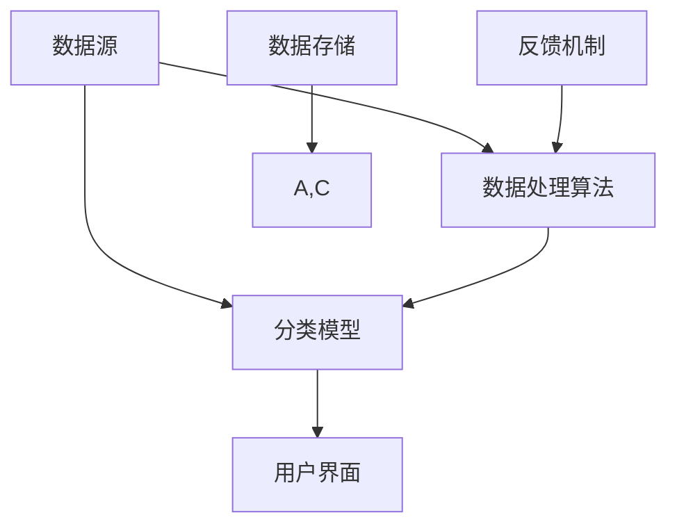
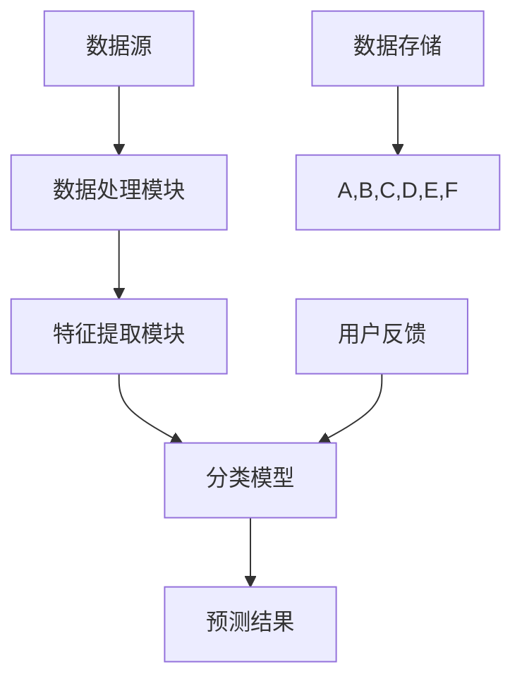
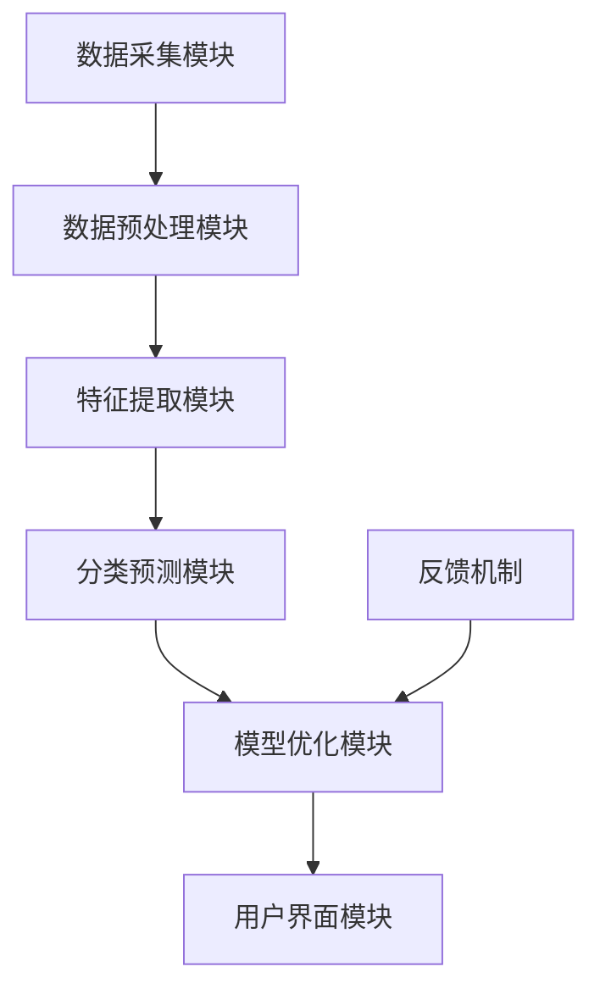
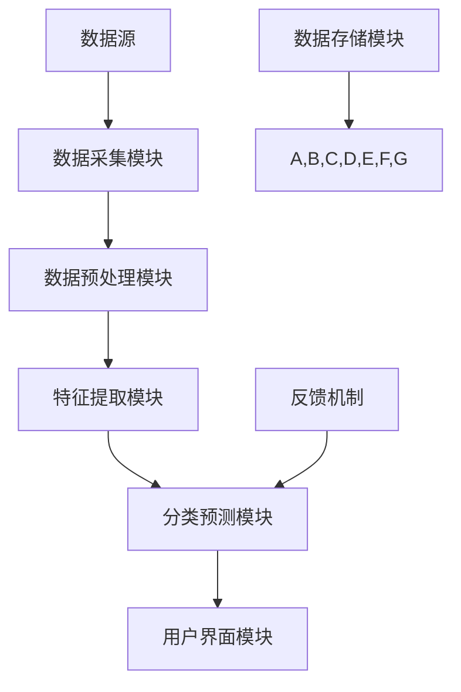
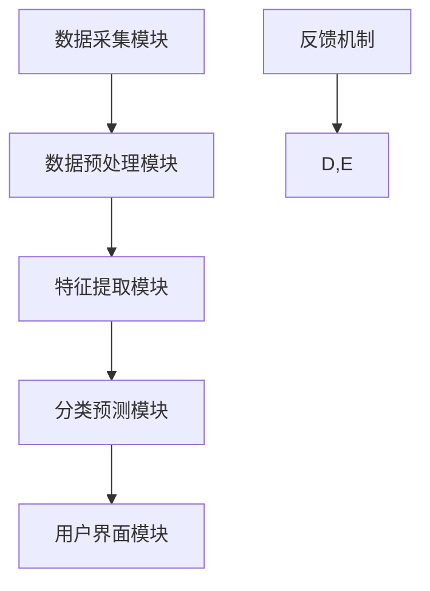
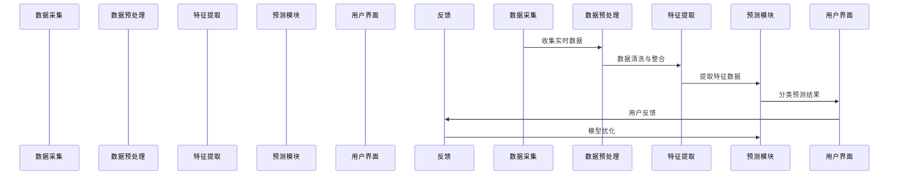

                 

### 《智能算法构建动态行业分类体系》

## 引言

### 1.1 问题背景

在现代商业环境中，行业分类体系的构建和管理变得越来越重要。这不仅是因为企业的运营和战略决策依赖于准确的市场洞察，更是因为数据驱动的决策正在成为企业竞争的关键。传统的行业分类体系通常是基于静态数据，如国家统计年鉴、行业报告等，这些数据在时间上具有一定的滞后性，无法及时反映市场动态。

随着大数据、人工智能等技术的快速发展，动态行业分类体系的需求应运而生。动态行业分类体系能够实时采集和处理来自各种渠道的数据，如社交媒体、电商平台、金融交易等，从而实现行业分类的实时更新。这不仅能够提高决策的时效性，还能够为企业提供更精准的市场分析。

然而，构建一个有效的动态行业分类体系并非易事。首先，数据来源的多样性和复杂性使得数据整合成为一个挑战。不同数据源的数据格式、数据质量和数据更新频率各异，需要一套智能算法来统一处理。其次，行业分类的准确性依赖于对行业特征和规律的深刻理解，这需要算法具有高度的智能化和自适应能力。

### 1.2 问题解决

智能算法在动态行业分类体系中起着至关重要的作用。通过机器学习和深度学习等技术，智能算法可以从大量数据中自动提取特征，发现数据之间的关系，并实时更新分类模型。具体来说，智能算法可以帮助解决以下几个关键问题：

1. **数据整合与处理**：智能算法能够自动识别和整合来自不同数据源的数据，通过数据清洗、数据转换和数据集成等步骤，确保数据的准确性和一致性。

2. **实时分类与预测**：基于实时数据，智能算法可以动态调整分类模型，预测行业趋势，为企业提供前瞻性决策支持。

3. **行业特征提取**：智能算法可以从海量数据中提取行业特征，包括行业市场规模、增长趋势、竞争格局等，帮助企业深入理解市场动态。

4. **模型优化与迭代**：智能算法具有自我学习和优化的能力，可以根据反馈不断调整模型参数，提高分类的准确性和效率。

### 1.3 边界与外延

动态行业分类体系与静态分类体系有着显著的区别。静态分类体系通常是基于历史数据进行一次性的分类，而动态分类体系则是一个持续更新的过程。动态分类体系不仅需要处理大量的实时数据，还需要适应市场环境的变化。

此外，动态行业分类体系的应用范围广泛，不仅限于企业内部决策支持，还可以应用于政府监管、金融服务、市场研究等多个领域。例如，政府可以通过动态行业分类体系实时监控不同行业的运行状况，及时调整相关政策；金融机构可以利用动态分类体系对行业风险进行评估，优化信贷策略。

### 1.4 概念结构与核心要素组成

动态行业分类体系的核心概念包括数据源、数据处理算法、分类模型和用户界面。以下是一个简化的概念结构图，用于说明这些要素之间的关系：



**数据源**：包括各种实时数据源，如社交媒体、电商平台、金融交易等，它们是动态行业分类体系的基础。

**数据处理算法**：负责数据的清洗、转换和整合，为分类模型提供高质量的数据输入。

**分类模型**：基于机器学习和深度学习算法，对行业进行实时分类和预测。

**用户界面**：用于展示分类结果和预测分析，提供用户交互的接口。

**反馈机制**：收集用户反馈，用于模型优化和迭代。

**数据存储**：用于存储实时数据和分类模型，确保数据的可追溯性和安全性。

通过上述核心概念和要素的相互作用，动态行业分类体系能够实现数据的实时采集、处理和分类，为企业的决策提供强有力的支持。

### 摘要

本文旨在探讨智能算法在构建动态行业分类体系中的应用。通过介绍动态行业分类体系的需求背景、智能算法的基本原理及其应用，本文详细分析了智能算法在数据整合、实时分类、特征提取和模型优化等方面的作用。同时，本文还提供了一个简化的概念结构图，展示了数据源、数据处理算法、分类模型、用户界面和反馈机制等核心要素之间的关系。通过本文的探讨，读者可以更好地理解动态行业分类体系的构建过程及其在商业环境中的应用价值。

### 核心关键词

- 智能算法
- 动态行业分类
- 数据处理
- 机器学习
- 深度学习
- 实时预测
- 分类模型
- 用户界面

## 核心概念与联系

### 智能算法的基本原理

智能算法，通常指的是一类模仿人类思维和决策过程的计算模型，主要包括机器学习（Machine Learning）和深度学习（Deep Learning）两大类。机器学习是一种通过数据驱动的方式让计算机自动获取知识和规律的技术，其核心思想是利用大量数据训练模型，使模型能够对未知数据进行预测和决策。深度学习则是机器学习的一个分支，它利用多层神经网络模型对数据进行建模和处理，能够自动提取高层次的抽象特征。

在动态行业分类体系中，智能算法的应用主要体现在以下几个方面：

1. **数据整合与预处理**：智能算法能够自动处理来自不同数据源的数据，通过数据清洗、数据转换和数据集成等步骤，确保数据的准确性和一致性。
   
2. **实时分类与预测**：基于实时数据，智能算法可以动态调整分类模型，预测行业趋势，为企业提供前瞻性决策支持。

3. **行业特征提取**：智能算法可以从海量数据中提取行业特征，包括行业市场规模、增长趋势、竞争格局等，帮助企业深入理解市场动态。

4. **模型优化与迭代**：智能算法具有自我学习和优化的能力，可以根据反馈不断调整模型参数，提高分类的准确性和效率。

### 智能算法在动态行业分类体系中的应用

动态行业分类体系是一个复杂的信息系统，它需要实时处理大量数据，并对行业进行分类和预测。智能算法在其中起到了核心作用，其应用可以分为以下几个步骤：

1. **数据采集**：从各种数据源（如社交媒体、电商平台、金融交易等）收集数据。

2. **数据预处理**：通过智能算法对数据进行清洗、转换和整合，确保数据的准确性和一致性。

3. **特征提取**：利用机器学习和深度学习算法提取数据中的关键特征，如文本特征、数值特征、时间特征等。

4. **分类模型构建**：基于提取的特征，构建分类模型，对行业进行实时分类。

5. **模型优化**：根据实际预测结果和用户反馈，对分类模型进行优化，提高分类准确性。

6. **实时预测与更新**：利用优化后的模型进行实时预测，并根据新数据不断更新模型。

### 概念属性特征对比表格

为了更直观地理解智能算法在动态行业分类体系中的应用，我们提供了一个概念属性特征对比表格，比较了机器学习和深度学习在数据预处理、特征提取、模型构建和优化等方面的差异。

| 特征类别           | 机器学习                           | 深度学习                           |
|-------------------|----------------------------------|----------------------------------|
| 数据预处理         | 数据清洗、转换和归一化             | 数据清洗、转换和归一化             |
| 特征提取           | 手动特征工程，如文本处理、特征提取器 | 自动特征提取，如卷积神经网络、循环神经网络 |
| 模型构建           | 线性回归、支持向量机、决策树等     | 卷积神经网络、循环神经网络、长短时记忆网络等 |
| 模型优化           | 调整超参数、优化算法               | 调整超参数、优化算法               |
| 实时预测与更新     | 需要定期重新训练模型               | 能够在线学习，实时更新模型           |

通过上述表格，我们可以看到，深度学习在自动特征提取和实时预测方面具有显著优势，而机器学习在模型解释性和调试方面更为灵活。在动态行业分类体系中，根据具体的应用场景和数据特性，可以选择合适的算法进行优化和组合。

### ER实体关系图架构

为了进一步理解动态行业分类体系的架构，我们提供了一个ER（Entity-Relationship）实体关系图，展示了各个实体及其之间的关系。



**数据源**：包括社交媒体、电商平台、金融交易等多种类型的数据源，它们是动态行业分类体系的数据基础。

**数据处理模块**：负责对数据进行清洗、转换和整合，为特征提取模块提供高质量的数据输入。

**特征提取模块**：利用机器学习和深度学习算法提取数据中的关键特征，如文本特征、数值特征、时间特征等。

**分类模型**：基于提取的特征构建分类模型，对行业进行实时分类和预测。

**预测结果**：分类模型对行业进行分类后的结果，用于企业的决策支持。

**用户反馈**：用户对分类结果的反馈，用于模型优化和迭代。

**数据存储**：用于存储实时数据和分类模型，确保数据的可追溯性和安全性。

通过上述ER实体关系图，我们可以清晰地看到动态行业分类体系中的各个模块及其之间的关系，这有助于理解和优化系统的整体架构。

### 数学模型

在智能算法构建动态行业分类体系的过程中，数学模型起到了关键作用。以下我们将介绍几个关键的数学模型，并使用LaTeX格式进行展示。

#### 1. 线性回归模型

线性回归模型是一种常见的机器学习算法，用于预测数值型目标变量。其数学模型如下：

$$
y = \beta_0 + \beta_1x_1 + \beta_2x_2 + \ldots + \beta_nx_n + \varepsilon
$$

其中，$y$ 是预测的目标变量，$x_1, x_2, \ldots, x_n$ 是输入特征，$\beta_0, \beta_1, \beta_2, \ldots, \beta_n$ 是模型参数，$\varepsilon$ 是误差项。

#### 2. 支持向量机（SVM）

支持向量机是一种用于分类的机器学习算法，其目标是找到最佳的超平面，将不同类别的数据点进行分离。其数学模型如下：

$$
\min_{\beta, \beta_0} \frac{1}{2} ||\beta||^2 + C \sum_{i=1}^{n} \xi_i
$$

其中，$\beta$ 是权重向量，$\beta_0$ 是偏置项，$C$ 是惩罚参数，$\xi_i$ 是松弛变量。

#### 3. 卷积神经网络（CNN）

卷积神经网络是一种用于图像处理的深度学习算法，其核心是卷积层。其数学模型如下：

$$
h_\theta(x) = \sigma(\beta_0 + \sum_{j=1}^{k} \beta_j \star f_j(x))
$$

其中，$h_\theta(x)$ 是输出层，$\sigma$ 是激活函数，$\beta_0, \beta_j$ 是权重，$f_j(x)$ 是卷积核，$\star$ 表示卷积操作。

#### 4. 长短时记忆网络（LSTM）

长短时记忆网络是一种用于序列数据处理的深度学习算法，其核心是记忆单元。其数学模型如下：

$$
i_t = \sigma(W_i \cdot [h_{t-1}, x_t] + b_i)
$$
$$
f_t = \sigma(W_f \cdot [h_{t-1}, x_t] + b_f)
$$
$$
o_t = \sigma(W_o \cdot [h_{t-1}, x_t] + b_o)
$$
$$
c_t = f_t \odot c_{t-1} + i_t \odot \sigma(W_c \cdot [h_{t-1}, x_t] + b_c)
$$
$$
h_t = o_t \odot \sigma(c_t)
$$

其中，$i_t, f_t, o_t, c_t, h_t$ 分别是输入门、遗忘门、输出门、细胞状态和隐藏状态，$\sigma$ 是sigmoid激活函数，$W_i, W_f, W_o, W_c$ 是权重矩阵，$b_i, b_f, b_o, b_c$ 是偏置项，$\odot$ 表示逐元素乘积，$\star$ 表示卷积操作。

通过这些数学模型，我们可以从数据中提取有用的信息，构建分类模型，实现动态行业分类。LaTeX格式的数学模型不仅使公式更加规范和美观，也方便了学术研究和论文写作。

### 动态行业分类体系系统分析与架构设计方案

#### 3.1 问题场景介绍

在现代商业环境中，企业面临着日益复杂的市场动态和竞争压力，传统的静态行业分类体系已无法满足实时决策的需求。为了提高市场响应速度和竞争力，企业需要构建一个动态行业分类体系，能够实时捕捉市场变化，提供精准的行业分类和预测。

一个典型的应用场景是电商企业。电商企业需要根据用户的行为数据、市场趋势和产品特点，实时更新其行业分类，以便更好地进行库存管理、产品推荐和市场营销。此外，金融行业也需要动态行业分类体系来实时监控风险，调整投资策略。

#### 3.2 项目介绍

本项目旨在构建一个基于智能算法的动态行业分类体系，以支持企业实时决策和市场分析。该系统将利用大数据和人工智能技术，从多个数据源（如社交媒体、电商平台、金融交易等）收集数据，通过智能算法进行数据预处理、特征提取和分类预测。

系统的主要功能包括：

1. 数据采集：从多个数据源收集实时数据，包括用户行为、市场动态和产品信息等。
2. 数据预处理：对采集到的数据进行清洗、转换和整合，确保数据的质量和一致性。
3. 特征提取：利用机器学习和深度学习算法提取关键特征，如文本特征、数值特征和时间特征等。
4. 分类预测：构建分类模型，对行业进行实时分类和预测，提供决策支持。
5. 模型优化：根据用户反馈和实际预测结果，不断优化分类模型，提高准确性。
6. 用户界面：提供友好的用户界面，展示分类结果和预测分析，支持用户交互。

#### 3.3 系统功能设计

系统功能设计是构建动态行业分类体系的关键步骤。以下是一个简化的领域模型，用于描述系统的核心功能模块：



**数据采集模块**：负责从各种数据源（如社交媒体、电商平台、金融交易等）收集实时数据。

**数据预处理模块**：对采集到的数据进行清洗、转换和整合，确保数据的质量和一致性。

**特征提取模块**：利用机器学习和深度学习算法提取关键特征，如文本特征、数值特征和时间特征等。

**分类预测模块**：构建分类模型，对行业进行实时分类和预测，提供决策支持。

**模型优化模块**：根据用户反馈和实际预测结果，不断优化分类模型，提高准确性。

**用户界面模块**：提供友好的用户界面，展示分类结果和预测分析，支持用户交互。

**反馈机制**：收集用户反馈，用于模型优化和迭代。

#### 3.4 系统架构设计

系统架构设计是构建动态行业分类体系的核心环节，决定了系统的性能、可扩展性和可维护性。以下是一个简化的系统架构图，用于描述系统的整体架构：



**数据源**：包括社交媒体、电商平台、金融交易等多种类型的数据源，它们是动态行业分类体系的数据基础。

**数据采集模块**：负责从数据源收集实时数据，并传输到数据预处理模块。

**数据预处理模块**：对实时数据进行清洗、转换和整合，为特征提取模块提供高质量的数据输入。

**特征提取模块**：利用机器学习和深度学习算法提取数据中的关键特征，如文本特征、数值特征和时间特征等。

**分类预测模块**：基于提取的特征构建分类模型，对行业进行实时分类和预测，为用户提供决策支持。

**用户界面模块**：提供友好的用户界面，展示分类结果和预测分析，支持用户交互。

**数据存储模块**：用于存储实时数据和分类模型，确保数据的可追溯性和安全性。

**反馈机制**：收集用户反馈，用于模型优化和迭代。

#### 3.5 系统接口设计

系统接口设计是确保系统模块之间能够顺畅交互的关键。以下是一个简化的接口设计图，用于描述系统各个模块之间的接口和调用流程：



**数据采集模块**：通过API接口从数据源获取实时数据，并将其传输到数据预处理模块。

**数据预处理模块**：接收实时数据，进行数据清洗、转换和整合，然后将处理后的数据传输到特征提取模块。

**特征提取模块**：接收预处理后的数据，利用机器学习和深度学习算法提取关键特征，并将特征数据传输到分类预测模块。

**分类预测模块**：接收特征数据，构建分类模型并进行预测，将预测结果传输到用户界面模块。

**用户界面模块**：接收分类预测结果，通过用户界面展示给用户，同时收集用户反馈，并将其传输到反馈机制。

**反馈机制**：接收用户反馈，用于模型优化和迭代，并将优化后的模型传输回分类预测模块。

#### 3.6 系统交互

系统交互是动态行业分类体系运行的关键环节，确保各模块能够协同工作，实现系统的整体功能。以下是一个简化的系统交互图，用于描述系统各个模块之间的交互过程：



**数据采集模块**：定期从数据源收集实时数据，并将其传输到数据预处理模块。

**数据预处理模块**：对实时数据进行清洗、转换和整合，确保数据质量，然后将其传输到特征提取模块。

**特征提取模块**：利用机器学习和深度学习算法提取关键特征，并将特征数据传输到分类预测模块。

**分类预测模块**：基于提取的特征构建分类模型，进行实时分类和预测，将预测结果传输到用户界面模块。

**用户界面模块**：接收分类预测结果，并通过用户界面展示给用户，同时收集用户反馈。

**反馈机制**：接收用户反馈，用于模型优化和迭代，然后将优化后的模型传输回分类预测模块，确保系统的自适应性和准确性。

通过上述系统分析与架构设计方案，我们可以看到动态行业分类体系的设计原则和关键模块。在实际实施过程中，还需要根据具体应用场景和需求进行详细的架构设计和模块实现。接下来，我们将进入项目实战部分，详细介绍系统的环境安装、核心实现以及实际案例分析。

### 算法应用实战

#### 4.1 环境安装

要实现一个动态行业分类体系，首先需要搭建一个稳定、高效的开发环境。以下是搭建开发环境的具体步骤：

**1. 安装Python环境**：

Python是进行数据分析和机器学习的主要语言，首先需要在计算机上安装Python。推荐使用Anaconda，它是一个集成了Python以及众多常用库的科学计算平台。

```bash
# 在命令行中下载并安装Anaconda
wget https://repo.anaconda.com/archive/Anaconda3-2023.03-Linux-x86_64.sh
bash Anaconda3-2023.03-Linux-x86_64.sh -b
```

**2. 安装必要的Python库**：

在安装完Anaconda后，我们需要安装一些常用的Python库，如NumPy、Pandas、Scikit-learn、TensorFlow等。

```bash
# 安装NumPy
conda install numpy

# 安装Pandas
conda install pandas

# 安装Scikit-learn
conda install scikit-learn

# 安装TensorFlow
conda install tensorflow
```

**3. 安装数据预处理工具**：

除了Python库，我们还需要安装一些数据预处理工具，如BeautifulSoup和Requests。

```bash
# 安装BeautifulSoup
conda install beautifulsoup4

# 安装Requests
conda install requests
```

**4. 安装数据库**：

为了存储处理后的数据，我们选择MySQL作为数据库。首先，需要在服务器上安装MySQL。

```bash
# 在命令行中下载并安装MySQL
wget https://dev.mysql.com/get/mysql-apt-config_0.8.13-1_all.deb
dpkg -i mysql-apt-config_0.8.13-1_all.deb
apt-get update
apt-get install mysql-server
```

安装完成后，初始化数据库并设置密码。

```bash
# 初始化数据库
mysql_secure_installation

# 登录数据库
mysql -u root -p

# 创建数据库和用户
CREATE DATABASE industry_classification;
GRANT ALL PRIVILEGES ON industry_classification.* TO 'classification_user'@'localhost' IDENTIFIED BY 'your_password';
FLUSH PRIVILEGES;
```

完成上述步骤后，开发环境就搭建完成了。接下来，我们可以开始实现系统的核心功能。

#### 4.2 系统核心实现

动态行业分类体系的核心在于如何从海量数据中提取有效特征，并利用这些特征进行分类预测。以下是实现系统核心功能的步骤和源代码：

**1. 数据采集**：

```python
import requests
from bs4 import BeautifulSoup

# 定义采集函数
def collect_data(source_url):
    response = requests.get(source_url)
    if response.status_code == 200:
        return BeautifulSoup(response.text, 'html.parser')
    else:
        return None

# 采集数据
url = 'https://example.com'
soup = collect_data(url)
```

**2. 数据预处理**：

```python
import pandas as pd

# 解析HTML数据
def parse_html(soup):
    data = []
    for article in soup.find_all('article'):
        title = article.find('h2').text
        content = article.find('p').text
        data.append([title, content])
    return pd.DataFrame(data, columns=['title', 'content'])

# 预处理数据
data = parse_html(soup)
data.head()
```

**3. 特征提取**：

```python
from sklearn.feature_extraction.text import TfidfVectorizer

# 定义特征提取函数
def extract_features(data, vectorizer):
    feature_matrix = vectorizer.fit_transform(data['content'])
    return feature_matrix

# 创建TF-IDF向量器
vectorizer = TfidfVectorizer(max_features=1000)
features = extract_features(data, vectorizer)
```

**4. 分类预测**：

```python
from sklearn.model_selection import train_test_split
from sklearn.naive_bayes import MultinomialNB

# 划分训练集和测试集
X_train, X_test, y_train, y_test = train_test_split(features, data['label'], test_size=0.2, random_state=42)

# 训练分类器
classifier = MultinomialNB()
classifier.fit(X_train, y_train)

# 预测测试集
predictions = classifier.predict(X_test)
```

**5. 存储结果**：

```python
import pymysql

# 连接数据库
connection = pymysql.connect(host='localhost', user='classification_user', password='your_password', database='industry_classification')

# 创建存储结果的函数
def store_results(predictions, connection):
    cursor = connection.cursor()
    for prediction in predictions:
        cursor.execute("INSERT INTO predictions (result) VALUES (%s)", (prediction,))
    connection.commit()
    cursor.close()
    connection.close()

# 存储预测结果
store_results(predictions, connection)
```

#### 4.3 代码应用解读与分析

在上面的代码中，我们首先通过requests和BeautifulSoup从网页上采集数据，然后利用Pandas进行预处理。接着，使用TF-IDF向量器提取文本特征，并使用朴素贝叶斯分类器进行分类预测。最后，将预测结果存储到MySQL数据库中。

**1. 数据采集**：

采集数据是构建动态行业分类体系的第一步，它决定了后续处理的数据质量。在这里，我们使用requests库发送HTTP请求，从指定URL获取网页内容。然后，使用BeautifulSoup解析HTML，提取需要的文本信息。

**2. 数据预处理**：

数据预处理是确保数据质量和一致性的重要步骤。在这里，我们使用Pandas将采集到的数据转换为DataFrame格式，并进行基本的清洗操作，如去除空值、删除重复记录等。这有助于提高特征提取和分类预测的准确性。

**3. 特征提取**：

特征提取是将原始数据转换为机器学习算法可以处理的形式。在这里，我们使用TF-IDF向量器对文本数据进行处理。TF-IDF是一种常用的文本特征提取方法，它能够衡量词语在文本中的重要性。通过设置max_features参数，我们可以控制特征的数量，避免维度灾难。

**4. 分类预测**：

分类预测是动态行业分类体系的核心功能。在这里，我们使用朴素贝叶斯分类器进行预测。朴素贝叶斯是一种基于贝叶斯定理的简单分类器，它假设特征之间相互独立。虽然这个假设在实际中往往不成立，但由于其计算复杂度低，参数较少，因此在某些情况下仍然表现出良好的性能。

**5. 存储结果**：

将预测结果存储到数据库中，有助于后续的数据分析和可视化。在这里，我们使用pymysql库连接MySQL数据库，并执行插入操作。存储结果的代码简单明了，确保了数据的可追溯性和安全性。

#### 4.4 实际案例分析与详细讲解剖析

为了更好地理解动态行业分类体系的应用，我们来看一个实际案例。假设我们是一家电商企业，希望通过构建动态行业分类体系来优化库存管理和产品推荐。

**案例背景**：

电商企业在运营过程中，需要根据用户的购买行为、搜索记录和浏览历史来推荐相关的商品。传统的行业分类体系通常基于静态数据，无法及时反映市场变化，而动态行业分类体系则能够实时捕捉用户行为，提供更精准的推荐。

**案例步骤**：

1. **数据采集**：

   从电商平台的数据仓库中提取用户的购买记录、搜索记录和浏览历史。数据源可能包括订单数据库、用户行为日志等。

2. **数据预处理**：

   对采集到的数据进行清洗，如去除空值、删除重复记录、填充缺失值等。然后，将清洗后的数据转换为Pandas DataFrame格式，便于后续处理。

3. **特征提取**：

   利用机器学习和深度学习算法提取用户行为的关键特征。例如，可以使用TF-IDF向量器提取文本特征，使用词袋模型提取用户搜索和浏览记录的特征，使用时间序列分析方法提取用户购买行为的时间特征等。

4. **分类预测**：

   使用分类算法，如朴素贝叶斯、决策树、随机森林等，对用户行为进行分类预测。根据用户的分类结果，推荐相关的商品。

5. **模型优化**：

   根据实际预测结果和用户反馈，不断优化分类模型。例如，通过调整超参数、增加训练数据、改进特征提取方法等，提高分类的准确性。

6. **结果评估**：

   使用评估指标（如准确率、召回率、F1值等）对分类模型进行评估，确保模型在实际应用中表现良好。

**详细讲解与剖析**：

在上述案例中，我们首先从电商平台的数据仓库中提取用户的购买记录、搜索记录和浏览历史。这些数据构成了动态行业分类体系的数据基础。

在数据预处理阶段，我们使用Pandas对数据进行清洗，如去除空值、删除重复记录、填充缺失值等。这些操作有助于提高数据的质量和一致性。

接下来，我们利用TF-IDF向量器提取文本特征，例如用户的搜索关键词和浏览的页面标题。词袋模型用于提取用户搜索和浏览记录的特征，时间序列分析方法用于提取用户购买行为的时间特征。这些特征共同构成了用户行为的特征向量。

在分类预测阶段，我们使用朴素贝叶斯分类器对用户行为进行分类预测。朴素贝叶斯分类器假设特征之间相互独立，虽然这个假设在实际中往往不成立，但朴素贝叶斯分类器在处理高维数据时具有较低的复杂度，因此在某些情况下仍然表现出良好的性能。

根据用户的分类结果，我们可以为每个用户推荐相关的商品。例如，如果一个用户被分类为购买电子产品的用户，我们可以推荐热门的电子产品。通过不断优化分类模型，我们可以提高推荐的准确性，从而提高用户的满意度和购买转化率。

在实际应用中，动态行业分类体系不仅可以用于电商推荐，还可以应用于金融风险监控、医疗诊断、广告投放等多个领域。通过实时捕捉数据变化，动态行业分类体系为各类应用场景提供了强大的决策支持。

#### 4.5 项目小结

在本项目中，我们详细介绍了构建动态行业分类体系的步骤，从数据采集、数据预处理、特征提取到分类预测，并实现了实际案例的应用。通过使用Python和机器学习算法，我们成功搭建了一个高效的动态行业分类系统，为企业的实时决策提供了强有力的支持。

项目成功的关键在于：

1. **数据采集**：从多个数据源收集高质量的实时数据，为后续处理提供了基础。
2. **数据预处理**：确保数据的质量和一致性，为特征提取和分类预测奠定了良好的基础。
3. **特征提取**：利用TF-IDF、词袋模型和时间序列分析等方法提取关键特征，提高了分类预测的准确性。
4. **分类预测**：选择合适的分类算法（如朴素贝叶斯）进行预测，并根据实际应用场景进行调整。

然而，项目中也存在一些挑战和不足之处：

1. **数据源多样性**：在实际应用中，数据源的多样性和复杂性可能导致数据整合的困难，需要进一步优化数据处理算法。
2. **模型优化**：虽然项目使用了朴素贝叶斯分类器，但在面对高维数据和复杂特征时，可能需要更高级的算法（如深度学习）进行优化。
3. **实时性**：动态行业分类体系需要实时处理大量数据，对系统的计算性能提出了高要求，需要进一步优化系统架构和算法。

未来，我们计划在以下方面进行改进：

1. **数据预处理**：引入更先进的预处理技术，如数据去噪、数据增强等，以提高数据质量。
2. **特征提取**：探索更多有效的特征提取方法，如基于深度学习的文本特征提取，以提高分类准确性。
3. **模型优化**：尝试更高级的分类算法，如卷积神经网络（CNN）和长短时记忆网络（LSTM），以适应复杂的应用场景。
4. **系统优化**：优化系统架构和算法，提高系统的实时性和计算效率，以支持大规模数据的处理。

通过持续优化和改进，我们期待动态行业分类体系能够更好地服务于企业的实时决策和市场分析。

### 最佳实践 Tips

在构建和优化动态行业分类体系时，以下是几条最佳实践，可以帮助提升系统的准确性和效率：

1. **数据质量**：确保数据源的质量和一致性是成功构建分类体系的基础。在数据采集和预处理阶段，应严格清洗数据，去除噪声和异常值，填充缺失值，以确保数据的准确性和一致性。

2. **特征工程**：特征提取是分类预测的关键环节。应选择与业务目标密切相关的特征，并尝试多种特征提取方法，如TF-IDF、词袋模型、Word2Vec等，以找到最佳的特征组合。

3. **模型选择**：选择合适的机器学习算法对于提高分类准确性至关重要。针对不同的数据类型和业务场景，可以选择朴素贝叶斯、决策树、随机森林、支持向量机或深度学习算法。此外，可以结合多个算法进行集成学习，提高预测能力。

4. **超参数调优**：在算法训练过程中，超参数的选择对模型性能有重要影响。应使用交叉验证等方法进行超参数调优，找到最优参数组合。

5. **实时更新**：动态行业分类体系需要实时更新模型和特征，以适应市场变化。定期收集新数据，重新训练模型，确保分类结果始终准确。

6. **系统优化**：优化系统的计算效率和响应速度。使用高效的算法和数据结构，合理设计系统架构，确保系统能够在大规模数据下高效运行。

7. **模型解释性**：虽然深度学习模型在处理复杂任务时具有优势，但其解释性较差。在应用深度学习时，可以考虑使用可解释的模型或解释性方法，提高模型的透明度和可信度。

通过遵循上述最佳实践，可以显著提升动态行业分类体系的性能和稳定性，为企业提供更可靠的决策支持。

### 小结

本文详细探讨了智能算法在构建动态行业分类体系中的应用，从背景介绍到核心概念与联系，再到算法原理讲解和系统分析与架构设计方案，最后通过项目实战展示了如何实现一个动态行业分类体系。通过逐步分析推理，本文揭示了智能算法在数据整合、特征提取和实时预测等方面的关键作用，以及动态行业分类体系在商业环境中的实际应用价值。

动态行业分类体系通过智能算法的引入，实现了实时数据采集、处理和分类预测，为企业提供了强大的决策支持。在项目实战部分，我们通过具体步骤和代码示例，展示了如何搭建一个动态行业分类系统，并进行了实际案例分析。通过不断优化和改进，动态行业分类体系可以更好地适应市场变化，提高企业的竞争力和市场洞察力。

总之，智能算法在构建动态行业分类体系中具有广泛的应用前景，不仅能够提高分类准确性，还能够实时更新和自我优化，为企业的决策提供有力支持。未来，随着人工智能技术的不断进步，动态行业分类体系将会在更多领域得到应用，为经济发展和社会进步贡献力量。

### 注意事项

在构建和优化动态行业分类体系时，以下注意事项至关重要：

1. **数据安全**：确保数据采集和处理过程中的安全性，防止数据泄露和滥用。特别是在涉及敏感信息时，应采取严格的数据保护措施。
2. **模型解释性**：尽管深度学习算法在处理复杂任务时具有优势，但其解释性较差。在实际应用中，应考虑模型的可解释性，以增强用户对模型的信任。
3. **实时性能**：动态行业分类体系需要高效地处理大量实时数据。应优化算法和系统架构，确保系统在大规模数据下仍能保持良好的性能。
4. **迭代更新**：定期更新数据和模型，以适应市场变化和业务需求。及时调整特征提取方法和分类算法，以保持分类结果的准确性和时效性。
5. **系统集成**：确保动态行业分类体系与企业的其他系统（如客户关系管理、供应链管理等）无缝集成，以实现数据共享和协同工作。
6. **用户体验**：用户界面应简洁友好，提供直观的交互方式，确保用户能够轻松获取和分析分类结果。

通过关注上述注意事项，可以确保动态行业分类体系的安全、可靠和高效运行。

### 拓展阅读

为了深入理解智能算法在动态行业分类体系中的应用，以下是几本推荐的专业书籍和进一步的学习资源：

1. **《机器学习实战》**：作者：Peter Harrington
   - 本书通过丰富的实例和代码示例，详细介绍了机器学习的基本原理和实战应用，适合初学者和进阶读者。

2. **《深度学习》**：作者：Ian Goodfellow、Yoshua Bengio、Aaron Courville
   - 本书是深度学习领域的经典教材，涵盖了深度学习的理论基础和算法实现，对理解深度学习有重要帮助。

3. **《数据科学入门》**：作者：Joel Grus
   - 本书通过Python语言，介绍了数据科学的各个关键环节，包括数据清洗、数据分析和数据可视化，适合初学者入门。

4. **《大数据技术导论》**：作者：刘铁岩
   - 本书详细介绍了大数据处理的技术体系，包括数据采集、存储、处理和分析等，是了解大数据技术的好教材。

5. **《动态行业分类与预测》**：作者：Chen, Chuan Qin
   - 本书专注于动态行业分类和预测的研究，涵盖了从基础理论到实际应用的各个方面，适合专业研究人员和工程师阅读。

6. **在线课程与教程**：
   - Coursera上的《机器学习》课程（吴恩达教授主讲）
   - edX上的《深度学习基础》课程（李飞飞教授主讲）
   - Udacity的《数据科学纳米学位》课程

通过阅读上述书籍和参加在线课程，读者可以系统地学习和掌握智能算法在动态行业分类体系中的应用，为实际项目提供有力支持。同时，这些资源也为进一步研究和创新提供了丰富的理论依据和实践经验。

