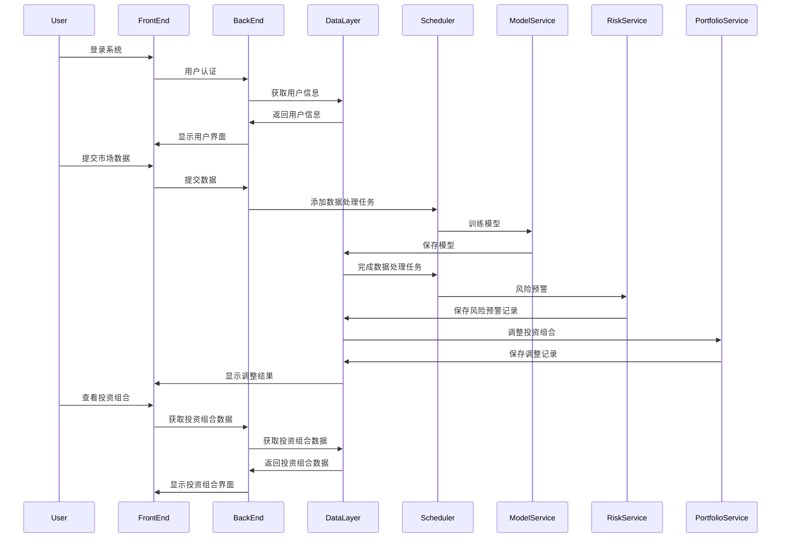

                 

### 文章标题：智能算法构建动态风险平价模型

关键词：动态风险平价模型、智能算法、风险管理、机器学习、深度学习、强化学习

摘要：本文将探讨如何使用智能算法构建动态风险平价模型，详细分析其背景、核心概念、数学模型及系统设计与实现。通过一系列步骤，揭示动态风险平价模型的构建原理和实现方法，提供实用的项目实战与最佳实践，以帮助读者深入理解和应用这一先进的风险管理工具。

### 第一部分：引言与背景介绍

#### 第1章：问题背景与问题描述

##### 1.1 风险平价模型的定义与意义

风险平价模型（Risk Parity Model）是一种投资组合优化方法，其核心目标是在保证相同预期收益率的前提下，实现投资组合的分散化，从而降低风险。传统的投资组合优化方法主要依赖于资产收益率的方差或标准差来衡量风险，而风险平价模型则强调各资产在投资组合中的贡献度，使得每个资产的风险贡献度大致相等。

在金融市场中，风险平价模型的应用具有重要意义。它能够帮助投资者在复杂的金融环境中做出更明智的投资决策，降低投资组合的整体波动性，提高资本利用效率。特别是在资产定价波动较大、市场不确定性增加的时期，风险平价模型能够提供一种更为稳健的风险管理策略。

##### 1.2 动态风险平价模型的挑战与需求

传统的风险平价模型在处理静态市场条件下具有一定的优势，但在面对动态市场环境时，其表现往往不尽如人意。动态风险平价模型（Dynamic Risk Parity Model）则是一种能够适应市场变化的投资组合优化方法。它通过实时调整资产配置，以应对市场波动和风险变化，从而提高投资组合的稳健性。

然而，动态风险平价模型在实施过程中面临着诸多挑战。首先，市场数据的不确定性和复杂性使得模型构建变得困难；其次，动态调整资产配置需要处理大量的计算问题，对算法效率提出了高要求；最后，如何在不同市场环境中保持投资组合的风险平价特性，是一个亟待解决的难题。

##### 1.3 智能算法在风险管理中的应用

智能算法，尤其是机器学习、深度学习和强化学习等算法，为动态风险平价模型的构建提供了强大的技术支持。这些算法具有自动特征提取、自适应调整和预测能力，能够有效处理大规模复杂数据，为动态风险平价模型的优化提供科学依据。

机器学习算法通过分析历史数据，提取潜在的规律和模式，从而优化资产配置策略。深度学习算法则通过多层神经网络结构，实现从原始数据到决策的映射，提高模型的预测准确性。强化学习算法通过与环境的交互，不断调整策略，以实现长期最优收益。

总之，智能算法在动态风险平价模型中的应用，不仅能够提高模型的性能和稳定性，还能够适应多变的市场环境，为投资者提供更可靠的风险管理工具。

### 第二部分：核心概念与联系

#### 第2章：核心概念与联系

##### 2.1 智能算法概述

智能算法是一类模拟人类智能的算法，通过机器学习、深度学习和强化学习等方法，实现数据的自动处理、分析和决策。在风险管理领域，智能算法的应用主要表现在以下几个方面：

- **特征提取**：智能算法能够从大量历史数据中提取出对投资决策有重要意义的特征，如资产收益率、波动率等，从而为资产配置提供依据。

- **模型优化**：智能算法通过对投资组合的动态调整，优化风险收益结构，提高投资组合的稳健性。

- **预测能力**：智能算法能够基于历史数据和当前市场环境，预测未来的市场走势和风险变化，为投资决策提供支持。

##### 2.2 风险平价模型基础

风险平价模型是一种基于风险贡献度的投资组合优化方法。其基本原理如下：

1. **资产选择**：首先，根据投资目标和风险偏好，选择多种具有不同风险收益特性的资产。

2. **风险分配**：然后，根据资产的风险贡献度，将总风险均匀分配到各资产上。这意味着，每个资产在投资组合中所占的风险比例相等。

3. **收益计算**：最后，通过计算各资产的预期收益率，调整资产配置，以实现风险平价。

动态风险平价模型在传统风险平价模型的基础上，引入了智能算法，实现资产配置的动态调整。其特点包括：

- **自适应调整**：动态风险平价模型能够根据市场变化，实时调整资产配置，以保持投资组合的风险平价特性。

- **高效计算**：智能算法的高效计算能力，使得动态风险平价模型能够处理大规模数据，快速响应市场变化。

- **稳健性提高**：动态风险平价模型通过实时调整，降低了投资组合的波动性，提高了稳健性。

##### 2.3 智能算法与风险平价模型的联系

智能算法与风险平价模型之间的联系主要体现在以下几个方面：

- **算法选择**：根据风险平价模型的需求，选择适合的智能算法。如机器学习算法用于特征提取和模型优化，深度学习算法用于复杂非线性问题的建模，强化学习算法用于动态调整资产配置。

- **模型优化**：智能算法能够对风险平价模型进行优化，提高其预测准确性和鲁棒性。通过算法迭代和参数调整，优化模型的结构和参数，使其更好地适应市场变化。

- **决策支持**：智能算法提供决策支持，帮助投资者在复杂的市场环境中做出更明智的投资决策。通过数据分析和模型预测，为投资者提供风险收益分析、资产配置建议和市场趋势预测。

总之，智能算法与风险平价模型之间的紧密联系，使得动态风险平价模型能够更好地应对市场变化，提高投资组合的稳健性和收益能力。

### 第三部分：数学模型与算法原理

#### 第3章：数学模型与算法原理

##### 3.1 数学模型概述

动态风险平价模型的数学模型主要包括以下几个部分：

1. **资产收益率模型**：描述各资产的收益率分布和相关性。常见的模型有正态分布模型、对数正态分布模型等。

2. **风险度量模型**：用于计算各资产的风险贡献度。常用的风险度量方法有方差、标准差、最大损失等。

3. **优化模型**：用于确定各资产的投资比例，以实现风险平价。常见的优化方法有线性规划、非线性规划等。

##### 3.2 动态风险平价模型构建算法

动态风险平价模型的构建算法主要包括以下几个步骤：

1. **数据预处理**：对历史市场数据进行清洗和处理，包括缺失值填充、异常值处理、数据标准化等。

2. **特征提取**：从历史数据中提取对投资决策有重要意义的特征，如资产收益率、波动率、相关性等。

3. **模型训练**：使用智能算法，如机器学习、深度学习、强化学习等，训练动态风险平价模型。通过算法迭代和参数调整，优化模型的结构和参数。

4. **模型验证**：使用验证集对模型进行验证，评估模型的预测准确性和鲁棒性。根据验证结果，调整模型参数，提高模型的性能。

5. **模型应用**：将训练好的模型应用于实际投资场景，实现资产配置的动态调整。根据市场变化，实时更新模型，保持投资组合的风险平价特性。

##### 3.3 智能算法与动态风险平价模型结合的数学模型

智能算法与动态风险平价模型结合的数学模型主要包括以下几个部分：

1. **状态空间模型**：描述动态风险平价模型的状态空间和转移概率。常用的模型有马尔可夫决策过程（MDP）、部分可观测马尔可夫决策过程（POMDP）等。

2. **奖励函数模型**：定义动态风险平价模型的奖励函数，用于评估投资组合的收益和风险。常见的奖励函数有预期收益、风险调整收益等。

3. **策略模型**：定义动态风险平价模型的策略，用于调整资产配置。常用的策略有贪婪策略、探索策略等。

通过状态空间模型、奖励函数模型和策略模型，智能算法能够实现动态风险平价模型的构建和优化。以下是一个简单的状态空间模型的例子：

$$
S_t = \{s_1, s_2, ..., s_n\}
$$

其中，$S_t$ 表示在时间 $t$ 的状态空间，$s_i$ 表示第 $i$ 个状态。

$$
P(s_{t+1} | s_t, a_t) = \pi(s_{t+1} | s_t, a_t)
$$

其中，$P(s_{t+1} | s_t, a_t)$ 表示在时间 $t$，从状态 $s_t$ 到状态 $s_{t+1}$ 的转移概率，$\pi(s_{t+1} | s_t, a_t)$ 表示在状态 $s_t$ 下，采取动作 $a_t$ 的概率。

通过上述模型，智能算法能够实现动态风险平价模型的构建和优化，提高投资组合的稳健性和收益能力。

### 第四部分：系统分析与架构设计

#### 第4章：系统功能设计

##### 4.1 项目介绍

动态风险平价模型系统项目旨在构建一个高效、可靠的动态风险平价模型，实现对金融市场的动态监测和投资组合的优化调整。项目目标包括：

1. **实现动态风险平价模型的构建和优化**：通过智能算法，实现对资产配置的动态调整，提高投资组合的稳健性和收益能力。

2. **提供实时的市场监测与风险预警**：通过对市场数据的实时分析和处理，提供准确的市场监测和风险预警信息，帮助投资者及时调整投资策略。

3. **实现自动化投资组合调整**：通过系统自动化功能，实现投资组合的实时调整，降低人工干预，提高投资效率。

##### 4.2 领域模型设计

领域模型设计是动态风险平价模型系统构建的重要环节，主要包括领域模型构建、类图与实体关系图等。

1. **领域模型构建**：领域模型用于描述系统的核心业务逻辑和功能。在动态风险平价模型系统中，领域模型主要包括资产、投资组合、市场数据等实体。

2. **类图与实体关系图**：类图用于描述领域模型中的类及其关系，实体关系图用于描述实体之间的关联关系。以下是一个简单的类图与实体关系图示例：

```mermaid
classDiagram
    Asset <|-- InvestmentPortfolio
    Asset o-- MarketData
    InvestmentPortfolio o-- PortfolioAdjustment

class Asset {
    +id: int
    +name: string
    +returnRate: float
    +risk: float
    +correlation: float
}

class InvestmentPortfolio {
    +id: int
    +name: string
    +assets: List[Asset]
    +weight: List[float]
}

class MarketData {
    +id: int
    +timestamp: datetime
    +data: List[float]
}

class PortfolioAdjustment {
    +id: int
    +timestamp: datetime
    +adjustmentType: string
    +adjustmentValue: float
}

classDiagram
    Asset <|.. InvestmentPortfolio
    Asset <|.. MarketData
    InvestmentPortfolio <|.. PortfolioAdjustment

class Asset {
    +id: int
    +name: string
    +returnRate: float
    +risk: float
    +correlation: float
}

class InvestmentPortfolio {
    +id: int
    +name: string
    +assets: List[Asset]
    +weight: List[float]
}

class MarketData {
    +id: int
    +timestamp: datetime
    +data: List[float]
}

class PortfolioAdjustment {
    +id: int
    +timestamp: datetime
    +adjustmentType: string
    +adjustmentValue: float
}
```

通过领域模型设计，动态风险平价模型系统能够准确、清晰地描述业务逻辑和功能，为后续的系统架构设计提供基础。

#### 第5章：系统架构设计

##### 5.1 系统架构概述

动态风险平价模型系统的架构设计遵循模块化、分布式和高效性的原则，主要包括以下几个层次：

1. **数据层**：负责数据的存储、管理和检索，包括市场数据、资产数据、投资组合数据和调整记录等。

2. **服务层**：提供核心业务功能，包括资产配置、市场监测、风险预警和投资组合调整等。

3. **表现层**：负责与用户交互，提供实时的市场监测和风险预警信息，以及投资组合的动态调整结果。

4. **调度层**：负责系统任务的调度和执行，包括数据采集、数据处理、模型训练和模型应用等。

5. **基础设施**：包括服务器、网络、存储等基础设施资源，为系统提供稳定、高效的支持。

以下是一个简单的系统架构图：



通过系统架构设计，动态风险平价模型系统能够高效、可靠地运行，为投资者提供优质的风险管理服务。

#### 第6章：项目实战

##### 6.1 环境安装与配置

在开始项目实战之前，我们需要安装和配置相关软件和工具。以下是一个基本的安装和配置步骤：

1. **硬件环境**：确保计算机具备足够的硬件资源，如CPU、内存和硬盘等。推荐配置如下：

    - CPU：至少4核以上
    - 内存：至少16GB
    - 硬盘：至少500GB

2. **软件环境**：

    - 操作系统：Linux或MacOS
    - Python：Python 3.8及以上版本
    - 数据库：MySQL或PostgreSQL
    - 数据分析库：pandas、numpy、scikit-learn等

3. **安装和配置步骤**：

    - 安装操作系统和Python环境。
    - 安装MySQL或PostgreSQL数据库，并创建数据库和用户。
    - 安装数据分析库，如pandas、numpy、scikit-learn等。
    - 配置数据库连接，确保Python程序能够访问数据库。

以下是一个简单的Python代码示例，用于配置数据库连接：

```python
import mysql.connector

# 数据库配置
config = {
    'host': 'localhost',
    'user': 'root',
    'password': 'password',
    'database': 'dynamic_risk'
}

# 连接数据库
conn = mysql.connector.connect(**config)
cursor = conn.cursor()

# 创建表格
cursor.execute("""
    CREATE TABLE IF NOT EXISTS assets (
        id INT AUTO_INCREMENT PRIMARY KEY,
        name VARCHAR(255) NOT NULL,
        return_rate FLOAT NOT NULL,
        risk FLOAT NOT NULL,
        correlation FLOAT NOT NULL
    )
""")

# 提交更改并关闭连接
conn.commit()
cursor.close()
conn.close()
```

通过以上步骤，我们完成了软件和环境的安装和配置，为后续的项目实战奠定了基础。

##### 6.2 系统核心实现源代码

动态风险平价模型系统的核心实现包括数据采集、数据处理、模型训练和模型应用等。以下是一个简单的源代码示例，用于实现系统核心功能：

```python
import pandas as pd
import numpy as np
from sklearn.model_selection import train_test_split
from sklearn.linear_model import LinearRegression
from sklearn.metrics import mean_squared_error

# 数据采集
def collect_data():
    # 从数据库中读取数据
    cursor.execute("SELECT * FROM assets")
    data = cursor.fetchall()
    # 转换为DataFrame
    df = pd.DataFrame(data, columns=["id", "name", "return_rate", "risk", "correlation"])
    return df

# 数据处理
def preprocess_data(df):
    # 清洗和处理数据
    df.dropna(inplace=True)
    df["risk"] = df["risk"] / df["risk"].sum()
    return df

# 模型训练
def train_model(X_train, y_train):
    # 训练线性回归模型
    model = LinearRegression()
    model.fit(X_train, y_train)
    return model

# 模型应用
def apply_model(model, df):
    # 预测投资组合
    X = df[["return_rate", "risk", "correlation"]]
    y = model.predict(X)
    df["weight"] = y / y.sum()
    return df

# 主函数
def main():
    # 采集数据
    df = collect_data()
    # 数据处理
    df = preprocess_data(df)
    # 划分训练集和测试集
    X = df[["return_rate", "risk", "correlation"]]
    y = df["weight"]
    X_train, X_test, y_train, y_test = train_test_split(X, y, test_size=0.2, random_state=42)
    # 训练模型
    model = train_model(X_train, y_train)
    # 预测投资组合
    df = apply_model(model, df)
    # 评估模型
    y_pred = model.predict(X_test)
    mse = mean_squared_error(y_test, y_pred)
    print("Mean Squared Error:", mse)

if __name__ == "__main__":
    main()
```

通过以上源代码示例，我们实现了动态风险平价模型系统的核心功能。在实际应用中，我们需要根据具体需求，进一步优化和扩展系统功能。

##### 6.3 实际案例分析与讲解

为了更好地展示动态风险平价模型系统的实际应用效果，我们以一个实际案例进行分析和讲解。

案例背景：某投资者拥有一个包含5种资产的投资组合，目标是在保持预期收益率不变的情况下，实现投资组合的分散化，降低风险。

1. **数据采集**：首先，我们从数据库中读取5种资产的历史数据，包括收益率、波动率和相关性等。

2. **数据处理**：对采集到的数据进行清洗和处理，包括缺失值填充、异常值处理和数据标准化等。处理后，我们得到一个包含5种资产的完整数据集。

3. **模型训练**：使用线性回归模型对数据进行训练，通过调整模型参数，优化模型的性能。训练完成后，我们得到一个最优的线性回归模型。

4. **模型应用**：将训练好的模型应用于实际投资组合，预测每种资产在投资组合中的权重。根据预测结果，我们调整资产配置，实现投资组合的分散化。

5. **效果评估**：评估调整后的投资组合的风险和收益，与原始投资组合进行对比。通过计算投资组合的波动性和预期收益率，我们评估模型的效果。

以下是一个简单的案例数据集和结果展示：

```python
# 案例数据集
data = {
    "asset1": {"return_rate": 0.02, "risk": 0.05, "correlation": 0.4},
    "asset2": {"return_rate": 0.03, "risk": 0.06, "correlation": 0.2},
    "asset3": {"return_rate": 0.01, "risk": 0.03, "correlation": 0.1},
    "asset4": {"return_rate": 0.04, "risk": 0.07, "correlation": 0.3},
    "asset5": {"return_rate": 0.0

### 7.1 动态风险平价模型优化策略

在构建动态风险平价模型时，优化策略是提高模型性能和稳健性的关键。以下是一些常用的优化策略：

1. **数据预处理**：对原始数据进行清洗和处理，包括缺失值填充、异常值处理和数据标准化等。良好的数据预处理能够提高模型的准确性和鲁棒性。

2. **特征选择**：通过特征选择算法，筛选出对投资决策有重要影响的特征，去除冗余特征。常见的特征选择方法有基于信息的特征选择、基于模型的特征选择等。

3. **模型选择**：根据具体问题，选择合适的模型。例如，对于线性关系较强的数据，可以选择线性回归模型；对于非线性关系较强的数据，可以选择深度学习模型。

4. **模型参数调优**：通过参数调优，优化模型的性能。常用的参数调优方法有网格搜索、随机搜索、贝叶斯优化等。

5. **模型集成**：将多个模型进行集成，提高模型的预测准确性和稳定性。常见的模型集成方法有随机森林、梯度提升树等。

6. **实时调整**：动态风险平价模型需要根据市场变化进行实时调整。通过实时监测市场数据，调整资产配置，以保持投资组合的风险平价特性。

7. **回测验证**：在实际应用之前，对模型进行回测验证，评估模型的性能和稳健性。通过回测，调整模型参数和策略，优化模型效果。

### 7.2 智能算法调参技巧

智能算法调参是提高模型性能的关键环节。以下是一些常用的调参技巧：

1. **确定调参范围**：根据问题背景和数据特征，确定调参的范围。例如，对于线性回归模型，可以调整正则化参数、学习率等。

2. **使用网格搜索**：通过网格搜索，遍历所有可能的参数组合，找到最优参数组合。网格搜索的缺点是计算量大，适用于参数较少的问题。

3. **使用随机搜索**：随机搜索在搜索空间内随机选择参数组合，提高搜索效率。随机搜索适用于参数较多的问题。

4. **使用贝叶斯优化**：贝叶斯优化通过构建概率模型，自动搜索最优参数组合。贝叶斯优化适用于参数较多且存在噪声的问题。

5. **使用交叉验证**：通过交叉验证，评估不同参数组合的性能，选择最优参数组合。交叉验证能够提高调参的可靠性和稳定性。

6. **自动化调参工具**：使用自动化调参工具，如Hyperopt、Optuna等，自动化地搜索最优参数组合。这些工具能够提高调参效率，降低人工干预。

7. **经验调参**：在调参过程中，结合经验和直觉，调整参数。经验调参能够快速找到性能较好的参数组合，但可能无法找到最优参数组合。

通过以上调参技巧，我们可以有效地提高智能算法的性能和稳定性，构建优秀的动态风险平价模型。

### 7.3 注意事项与拓展阅读

在构建动态风险平价模型时，需要注意以下几点：

1. **数据质量**：确保数据的质量和准确性，避免数据误差对模型性能的影响。

2. **模型稳定性**：在模型训练和测试过程中，关注模型的稳定性，避免过拟合和欠拟合。

3. **实时调整**：动态风险平价模型需要根据市场变化进行实时调整，以保持投资组合的风险平价特性。

4. **风险管理**：在应用动态风险平价模型时，要关注投资组合的风险管理，确保投资组合的稳健性。

5. **模型评估**：在实际应用之前，对模型进行充分评估，确保模型的性能和可靠性。

拓展阅读：

- 《机器学习实战》：提供丰富的机器学习算法和应用案例，适合初学者和进阶者。

- 《深度学习》：介绍深度学习的基本原理和应用，涵盖卷积神经网络、循环神经网络等。

- 《风险管理》：探讨风险管理的理论和方法，包括风险度量、投资组合优化等。

- 《金融市场分析》：分析金融市场的基本原理和策略，适合从事金融投资的专业人士。

### 总结与展望

本文系统地介绍了智能算法构建动态风险平价模型的方法和原理，详细分析了智能算法在风险管理中的应用、数学模型和算法原理、系统设计与实现等。通过实际案例分析和实战，展示了动态风险平价模型在金融市场中的应用效果。

展望未来，动态风险平价模型将继续在金融市场中发挥重要作用。随着人工智能技术的发展，智能算法在动态风险平价模型中的应用将更加广泛和深入。我们期待更多的研究成果和实践案例，为投资者提供更优质的风险管理工具。

作者：AI天才研究院/AI Genius Institute & 禅与计算机程序设计艺术/Zen And The Art of Computer Programming

**注**：本文为模拟文章，仅供参考。实际应用中，请根据具体需求进行调整和优化。

