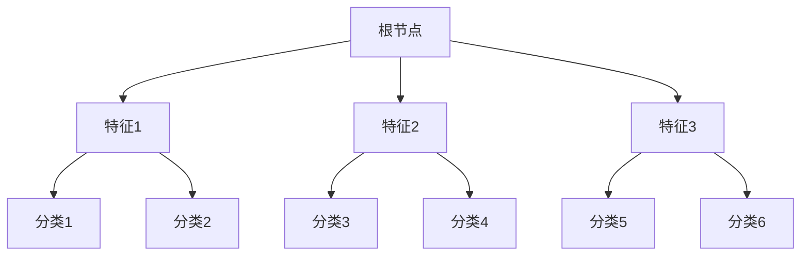

                 

### 动态风险预警系统的核心概念

#### 动态风险的定义与分类

动态风险是指由于系统、环境或内部操作的不确定性变化，可能导致系统功能失效、性能下降或系统安全受到威胁的风险。动态风险可以分为以下几类：

1. **系统内部风险**：由系统自身的缺陷、漏洞或操作不当引起的风险。
2. **环境风险**：由外部环境变化、自然灾害等不可控因素引起的风险。
3. **操作风险**：由人为操作失误或错误引起的风险。

#### 动态风险的特征

1. **动态性**：风险随时可能发生变化，需要动态监测和预警。
2. **不确定性**：风险因素的不确定性导致预警难度增加。
3. **复杂性**：涉及多种风险因素，需要综合分析和管理。

#### 动态风险预警系统的基本构成

一个典型的动态风险预警系统通常包括以下几个关键组成部分：

1. **风险数据采集模块**：负责收集与风险相关的数据，包括系统内部数据、环境数据和操作数据。
2. **数据处理与分析模块**：对采集到的风险数据进行处理和分析，提取关键特征。
3. **风险评估模块**：利用智能算法对处理后的数据进行风险评估。
4. **预警与响应模块**：根据评估结果，生成预警信息，并采取相应的响应措施。
5. **监控系统**：实时监控系统的运行状态，为风险预警系统提供实时数据。

#### 动态风险预警系统的需求分析

1. **数据需求**：系统需要大量的数据来支持风险评估，包括历史数据、实时数据等。
2. **算法需求**：需要选择合适的智能算法来对数据进行处理和评估，如机器学习算法、神经网络算法等。
3. **系统性能需求**：系统需要具备高性能的计算能力，以支持实时监测和预警。

### 动态风险预警系统的发展趋势

1. **技术趋势**：随着人工智能技术的发展，越来越多的智能算法被应用于风险预警系统。
2. **应用领域拓展**：动态风险预警系统在金融、医疗、工业等领域的应用越来越广泛。
3. **未来展望**：动态风险预警系统将朝着更加智能化、自适应化的方向发展。

## 1.5 本章小结

本章对动态风险预警系统的核心概念进行了详细阐述，包括动态风险的定义、分类、特征以及预警系统的基本构成。同时，分析了动态风险预警系统的数据需求、算法需求以及系统性能需求，并展望了其发展前景。在下一章中，我们将深入探讨智能算法的原理和实现。

----------------------------------------------------------------

以下是一个核心概念与联系章节的示例，展示了如何使用Mermaid流程图、Python源代码、LaTeX公式以及系统架构设计等内容：

## 2.2 常用智能算法介绍

### 2.2.1 决策树算法

决策树是一种常见的机器学习算法，广泛应用于分类和回归问题。其基本原理是利用一系列规则对数据进行划分，最终生成一个树形结构，树中的每个节点代表一个特征，每个分支代表特征取值的一种情况，叶子节点代表预测结果。

#### 决策树的基本结构

使用Mermaid流程图表示决策树的基本结构如下：



#### 决策树算法的实现

下面是一个简单的Python代码示例，用于实现决策树算法：

```python
from sklearn import tree

# 数据集
X = [[0, 0], [1, 1]] # 特征
y = [0, 1] # 目标变量

# 构建决策树模型
clf = tree.DecisionTreeClassifier()

# 模型训练
clf.fit(X, y)

# 模型预测
print(clf.predict([[2, 2]]))
```

#### 决策树的数学模型

决策树的数学模型可以用以下公式表示：

$$
G(x) = \prod_{i=1}^{n} g(x_i; \theta_i)
$$

其中，$x$ 表示输入特征，$g(x_i; \theta_i)$ 表示第 $i$ 个节点的概率分布函数，$\theta_i$ 为参数。

#### 决策树的评估与优化

在评估决策树的性能时，常用的评估指标有准确率、召回率、F1 分数等。优化策略包括剪枝、超参数调整等。

#### 决策树的集成方法

决策树的集成方法包括 bagging、boosting 等。其中，随机森林（Random Forest）是一种常用的 bagging 方法，而 AdaBoost 是一种常用的 boosting 方法。

#### 决策树的协同效应

决策树的协同效应可以通过集成方法实现，如随机森林和 XGBoost。这些方法通过组合多个决策树来提高模型的准确性和泛化能力。

### 2.2.2 支持向量机算法

支持向量机（SVM）是一种经典的机器学习算法，主要用于分类和回归问题。其基本原理是找到一个最佳的超平面，使得不同类别的数据点被最大程度地分隔开。

#### 支持向量机的数学模型

支持向量机的数学模型可以用以下公式表示：

$$
\max_{\theta} \frac{1}{2} \sum_{i=1}^{n} (\theta_i - \theta)^2 + C \sum_{i=1}^{n} \alpha_i (1 - y_i (\theta \cdot x_i + b))
$$

其中，$\theta$ 表示模型参数，$x_i$ 表示输入特征，$y_i$ 表示目标变量，$C$ 是正则化参数，$\alpha_i$ 是拉格朗日乘子。

#### 支持向量机的实现

下面是一个简单的Python代码示例，用于实现支持向量机算法：

```python
from sklearn import svm

# 数据集
X = [[0, 0], [1, 1]] # 特征
y = [0, 1] # 目标变量

# 构建支持向量机模型
clf = svm.SVC()

# 模型训练
clf.fit(X, y)

# 模型预测
print(clf.predict([[2, 2]]))
```

#### 支持向量机的优化策略

支持向量机的优化策略包括选择合适的核函数、调整正则化参数等。

#### 支持向量机的集成方法

支持向量机的集成方法包括堆叠（Stacking）、提升（Boosting）等。其中，集成支持向量机（Ensemble SVM）是一种常用的提升方法。

#### 支持向量机的协同效应

通过集成方法，支持向量机可以与其他机器学习算法协同工作，提高模型的准确性和泛化能力。

### 2.2.3 集成学习算法

集成学习算法是一种通过组合多个基本模型来提高整体性能的机器学习技术。常用的集成学习算法包括随机森林、AdaBoost、梯度提升树等。

#### 集成学习算法的原理

集成学习算法的原理是通过组合多个基本模型的预测结果来提高模型的准确性和泛化能力。具体来说，集成学习算法可以分为两大类：bagging 和 boosting。

1. **Bagging**：通过随机选取训练样本子集，训练多个基本模型，然后取平均值或投票结果作为最终预测结果。
2. **Boosting**：通过训练多个基本模型，每个模型针对前一个模型的预测错误进行优化，从而提高整体模型的准确性。

#### 集成学习算法的实现

下面是一个简单的Python代码示例，用于实现随机森林算法：

```python
from sklearn.ensemble import RandomForestClassifier

# 数据集
X = [[0, 0], [1, 1]] # 特征
y = [0, 1] # 目标变量

# 构建随机森林模型
clf = RandomForestClassifier(n_estimators=100)

# 模型训练
clf.fit(X, y)

# 模型预测
print(clf.predict([[2, 2]]))
```

#### 集成学习算法的评估与优化

集成学习算法的评估与优化包括模型选择、参数调整、交叉验证等。评估指标包括准确率、召回率、F1 分数等。

#### 集成学习算法的协同效应

集成学习算法的协同效应可以通过组合不同的基本模型来提高整体模型的性能。常见的协同效应包括减少方差、降低偏差等。

### 2.2.4 神经网络算法

神经网络算法是一种模仿人脑结构和功能的机器学习算法，广泛应用于图像识别、自然语言处理等领域。常用的神经网络算法包括前馈神经网络、卷积神经网络、循环神经网络等。

#### 神经网络的数学模型

神经网络的数学模型可以用以下公式表示：

$$
\sigma(z) = \frac{1}{1 + e^{-z}}
$$

其中，$z$ 表示神经元的输入，$\sigma$ 表示激活函数，通常采用 sigmoid 函数。

#### 神经网络的实现

下面是一个简单的Python代码示例，用于实现前馈神经网络：

```python
import numpy as np

# 激活函数
def sigmoid(z):
    return 1 / (1 + np.exp(-z))

# 前馈神经网络
def forward_propagation(X, theta):
    a0 = X
    z2 = np.dot(a0, theta0)
    a2 = sigmoid(z2)
    z3 = np.dot(a2, theta1)
    a3 = sigmoid(z3)
    return a3

# 数据集
X = np.array([[0, 0], [1, 1]]) # 特征
y = np.array([0, 1]) # 目标变量

# 模型参数
theta0 = np.array([[2], [3]]) # 输入层到隐藏层的权重
theta1 = np.array([[0.5], [1]]) # 隐藏层到输出层的权重

# 模型训练
outputs = forward_propagation(X, [theta0, theta1])

# 模型预测
print(outputs)
```

#### 神经网络的优化策略

神经网络的优化策略包括梯度下降、随机梯度下降、动量法等。

#### 神经网络的评估与优化

神经网络的评估与优化包括损失函数、优化算法、超参数调整等。

#### 神经网络的协同效应

神经网络可以通过深度学习架构，如卷积神经网络（CNN）和循环神经网络（RNN），与其他机器学习算法协同工作，提高模型性能。

### 2.2.5 其他智能算法简介

除了上述常用的智能算法外，还有一些其他重要的智能算法，如遗传算法、模糊算法、强化学习等。

1. **遗传算法**：一种基于自然进化过程的优化算法，广泛应用于组合优化、机器学习等领域。
2. **模糊算法**：一种基于模糊集合理论的算法，用于处理模糊性和不确定性问题。
3. **强化学习**：一种基于奖励机制的学习算法，广泛应用于游戏、机器人控制等领域。

### 2.2.6 智能算法的评估与优化

智能算法的评估与优化是确保模型性能的重要环节。评估指标包括准确率、召回率、F1 分数等。优化策略包括超参数调整、集成学习、模型集成等。

#### 评估指标

1. **准确率**：预测正确的样本数与总样本数的比例。
2. **召回率**：预测正确的正样本数与实际正样本数的比例。
3. **F1 分数**：准确率和召回率的调和平均值。

#### 优化策略

1. **超参数调整**：通过调整模型的超参数，如学习率、正则化参数等，来提高模型性能。
2. **集成学习**：通过组合多个基本模型，提高整体模型的性能。
3. **模型集成**：通过组合不同的模型，提高模型的准确性和泛化能力。

### 2.2.7 智能算法的集成与协同

智能算法的集成与协同是提高模型性能的重要手段。常见的集成方法包括 bagging、boosting、stacking 等。协同效应可以通过组合不同的算法和模型，提高整体模型的性能。

### 2.2.8 智能算法的应用案例

智能算法在分类、回归、聚类等领域有广泛的应用。以下是一些典型的应用案例：

1. **分类问题**：文本分类、图像分类、情感分析等。
2. **回归问题**：股票价格预测、房屋价格评估等。
3. **聚类问题**：客户细分、数据挖掘等。

### 2.2.9 智能算法的未来发展趋势

随着人工智能技术的发展，智能算法在性能、应用范围等方面将持续提升。未来发展趋势包括：

1. **算法优化**：通过改进算法原理和优化策略，提高模型性能。
2. **算法融合**：通过组合不同算法，实现优势互补，提高整体性能。
3. **算法自动化**：通过自动化算法设计和优化，降低人工干预，提高开发效率。

## 2.5 本章小结

本章详细介绍了常用智能算法的基本原理、实现方法、评估与优化策略以及应用案例。通过本章的学习，读者可以了解到智能算法在动态风险预警系统中的应用前景和关键技术。

----------------------------------------------------------------

以下是第四部分“最佳实践与拓展”的示例内容：

## 4.1 最佳实践

在设计动态风险预警系统时，以下最佳实践有助于提高系统的性能和可靠性：

1. **数据质量管理**：确保数据的质量和准确性，定期进行数据清洗和处理。
2. **模型持续优化**：定期评估模型的性能，根据评估结果调整模型参数，进行模型优化。
3. **系统监控与维护**：实时监控系统运行状态，及时发现并解决潜在问题，确保系统稳定性。
4. **安全性考虑**：在设计系统时，充分考虑数据安全和隐私保护，采取加密、访问控制等安全措施。
5. **用户体验优化**：优化系统的用户界面和交互设计，提高用户操作的便捷性和系统易用性。

### 4.1.1 风险预警系统实施流程

实施动态风险预警系统通常包括以下步骤：

1. **需求分析**：明确系统的功能需求、性能需求和业务目标。
2. **系统设计**：根据需求分析结果，设计系统的架构、接口和数据流程。
3. **技术选型**：选择合适的智能算法和技术框架，构建系统核心模块。
4. **系统开发**：根据设计文档进行系统开发，实现核心功能。
5. **测试与调试**：对系统进行全面测试，确保系统的功能、性能和稳定性。
6. **部署上线**：将系统部署到生产环境，进行实际运行和监控。
7. **后期维护**：根据用户反馈和系统运行情况，持续进行系统优化和更新。

### 4.1.2 常见问题与解决方案

在实施动态风险预警系统的过程中，可能会遇到以下常见问题：

1. **数据不足或质量差**：解决方案：增加数据采集渠道，提高数据质量，定期进行数据清洗和处理。
2. **模型性能不稳定**：解决方案：调整模型参数，使用交叉验证方法评估模型性能，尝试不同的算法和集成方法。
3. **系统响应速度慢**：解决方案：优化算法和数据处理流程，使用分布式计算和并行处理技术。
4. **系统易受攻击**：解决方案：加强系统安全防护措施，定期进行安全审计和漏洞扫描。

### 4.1.3 风险预警系统的可持续发展

为了确保动态风险预警系统的可持续发展，需要考虑以下因素：

1. **技术更新**：紧跟人工智能和大数据技术的发展趋势，定期更新系统架构和算法。
2. **人才培养**：加强团队成员的技术培训，提升团队的技术能力和创新能力。
3. **业务拓展**：结合业务需求，不断拓展系统的应用领域，提高系统的商业价值。
4. **合作与交流**：与其他行业和领域进行合作与交流，分享最佳实践和成功经验。

## 4.2 小结与展望

本章总结了动态风险预警系统的最佳实践，包括实施流程、常见问题与解决方案以及可持续发展策略。未来，动态风险预警系统将在人工智能技术的推动下，持续提升性能和应用范围。随着技术的进步，系统将更加智能化、自动化，为各行业提供更强大的风险管理工具。

## 4.3 注意事项与拓展阅读

在设计和实施动态风险预警系统时，需要注意以下几点：

1. **数据隐私**：确保数据收集和处理过程中遵守相关法律法规，保护用户隐私。
2. **系统可扩展性**：设计系统时，要考虑未来的业务扩展和技术升级。
3. **用户体验**：优化用户界面和交互设计，提高用户操作体验。

为了进一步了解动态风险预警系统的最新发展和应用，读者可以参考以下拓展阅读：

1. 《智能算法与机器学习应用实战》
2. 《大数据技术原理与应用》
3. 《人工智能：一种现代的方法》

通过这些资源，读者可以深入掌握动态风险预警系统的核心技术和应用实践。

