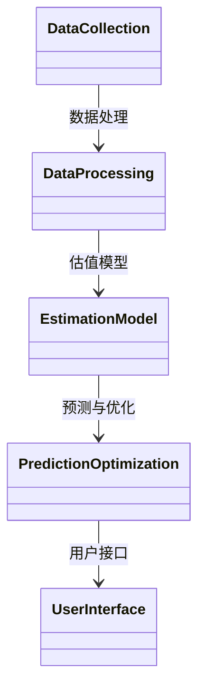
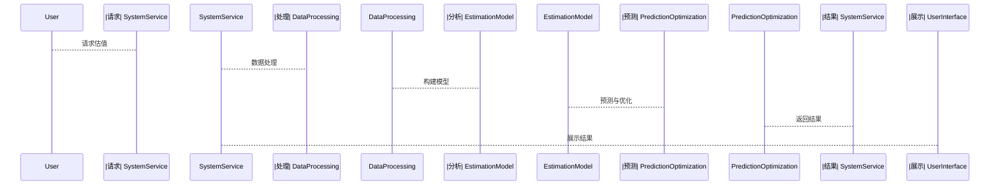
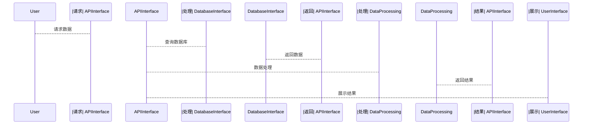
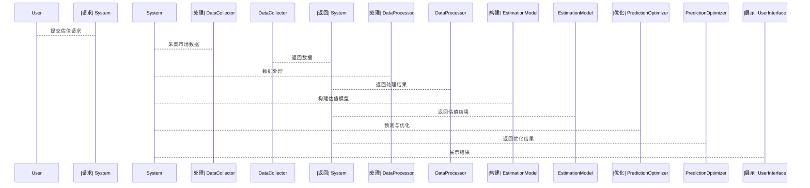

                 

### 摘要

本文深入探讨了智能算法在构建自适应估值模型中的应用。自适应估值模型旨在提高估值模型的准确性和适应性，以应对市场环境的变化。为了实现这一目标，本文介绍了智能算法的基本原理，并重点探讨了机器学习、深度学习等算法在自适应估值模型中的应用。文章通过实例分析，详细讲解了算法的实现过程、数学模型及其在估值模型中的应用。同时，文章还介绍了系统架构设计、项目实战以及最佳实践，为读者提供了全面的技术指导。通过本文的阅读，读者将能够理解智能算法在构建自适应估值模型中的重要性，并掌握相关技术方法。

### 目录大纲设计思路

在设计本文的目录大纲时，我们首先明确了核心章节，这些章节将涵盖问题背景、核心概念、算法原理、数学模型、系统架构、项目实战和最佳实践等内容。以下是我们设计目录大纲的详细思路：

1. **问题背景**：首先介绍估值模型在金融市场和企业管理中的重要性，以及传统估值模型存在的问题。这部分内容将帮助读者了解本文的主题背景和现实意义。

2. **核心概念**：在这一部分，我们将介绍智能算法和自适应估值模型的基本概念。通过核心概念与联系的分析，帮助读者理解智能算法在估值模型中的应用原理。

3. **算法原理讲解**：本文将详细讲解机器学习、深度学习等智能算法的原理，并通过Mermaid流程图和Python代码展示算法的实现过程。这部分内容将帮助读者深入理解算法的工作机制。

4. **数学模型**：在介绍算法原理的基础上，我们将介绍估值模型的数学模型，包括公式推导和具体实现。这部分内容将为读者提供理论基础。

5. **系统分析与架构设计方案**：本文将介绍估值模型系统的设计与实现，包括问题场景介绍、系统功能设计、系统架构设计、系统接口设计和系统交互等内容。这部分内容将帮助读者了解系统实现的全过程。

6. **项目实战**：本文将通过一个实际项目，详细讲解系统核心实现源代码、代码应用解读与分析，以及实际案例分析和详细讲解。这部分内容将帮助读者将理论应用到实际项目中。

7. **最佳实践与小结**：在最后，本文将提供最佳实践建议、注意事项和拓展阅读等内容，帮助读者在实际应用中取得更好的效果。同时，本文还将对全文内容进行小结，强调核心观点。

通过以上设计思路，我们希望本文能够为读者提供系统、全面的技术指导，帮助读者深入理解并掌握智能算法构建自适应估值模型的方法。

### 具体步骤

为了确保本文的逻辑清晰、结构紧凑、简单易懂，我们将按照以下具体步骤撰写文章：

1. **设计封面与前言**：简要介绍书籍的背景、目的和读者对象，为读者提供一个整体的认知框架。

2. **第1章：背景介绍**：
   - **问题背景**：阐述估值模型在金融市场和企业管理中的重要性，以及传统估值模型存在的问题。
   - **问题描述**：详细描述估值模型面临的具体问题，如数据质量、模型参数调整等。
   - **问题解决**：介绍智能算法在提高估值模型准确性、适应性方面的优势。
   - **边界与外延**：明确本文的研究范围和关联领域。

3. **第2章：核心概念与联系**：
   - **核心概念**：介绍智能算法和自适应估值模型的基本概念。
   - **概念属性特征对比**：通过表格对比不同智能算法的特点和应用场景。
   - **ER实体关系图**：使用Mermaid流程图展示概念之间的关联。

4. **第3章：算法原理讲解**：
   - **机器学习原理**：通过Mermaid流程图和Python代码，详细讲解机器学习算法的工作机制。
   - **深度学习原理**：介绍深度学习算法的原理，包括神经网络和自动特征提取。

5. **第4章：数学模型**：
   - **估值模型数学模型**：推导估值模型的数学公式，并解释其含义。
   - **公式推导**：详细解释估值模型中各个公式的推导过程。

6. **第5章：系统分析与架构设计方案**：
   - **问题场景介绍**：描述估值模型的应用场景。
   - **系统功能设计**：使用Mermaid类图展示系统的领域模型。
   - **系统架构设计**：绘制系统架构图，介绍各个模块的功能和相互关系。
   - **系统接口设计**：说明系统对外提供的接口。
   - **系统交互**：使用Mermaid序列图展示系统的交互过程。

7. **第6章：项目实战**：
   - **环境安装**：介绍项目的开发环境搭建。
   - **系统核心实现源代码**：展示系统的核心代码实现。
   - **代码应用解读与分析**：详细分析代码的应用和功能。
   - **实际案例**：提供一个实际案例，展示系统在实际中的应用。
   - **项目小结**：总结项目的收获和不足。

8. **第7章：最佳实践与小结**：
   - **最佳实践**：提供实际操作中的最佳实践建议。
   - **小结**：对全文进行总结，强调核心观点。
   - **注意事项**：提醒读者注意的一些重要事项。
   - **拓展阅读**：推荐相关书籍和资料，供读者进一步学习。

通过以上步骤，我们旨在为读者提供一个结构清晰、内容丰富的技术博客文章，帮助他们深入理解智能算法构建自适应估值模型的方法和应用。

### 第1章：背景介绍

#### 问题背景

在当今数字化、信息化飞速发展的时代，估值模型在金融市场和企业管理中扮演着至关重要的角色。估值模型通过对市场数据的分析和处理，为投资者、企业管理者提供了决策依据。然而，随着市场的复杂性不断增加，传统估值模型在面对动态变化的市场环境时，往往表现出准确性不足、适应性差等问题。

#### 问题描述

传统估值模型主要依赖于历史数据和经验公式进行预测，这些模型通常具有以下局限性：

1. **数据依赖性**：传统估值模型对数据质量要求较高，数据量不足或质量差会导致预测结果不准确。
2. **参数敏感性**：模型参数的设置通常基于历史数据，当市场环境发生变化时，模型的参数可能不再适用，导致预测结果失真。
3. **模型适应性**：传统估值模型在应对市场突发变化时，难以快速调整，导致无法及时适应新的市场状况。

#### 问题解决

为了克服传统估值模型的局限性，智能算法在估值模型中的应用成为了一个热门研究方向。智能算法，如机器学习、深度学习等，通过模拟人类学习和决策过程，具有以下优势：

1. **高准确性**：智能算法能够从大量数据中自动提取特征，并利用这些特征进行预测，提高模型的准确性。
2. **自适应调整**：智能算法可以通过学习历史数据和市场变化，动态调整模型参数，提高模型对市场环境的适应性。
3. **快速响应**：智能算法能够在短时间内处理大量数据，并对市场变化进行快速响应。

通过智能算法，我们可以构建出一种自适应估值模型，这种模型能够根据数据变化和市场环境动态调整自身，提高估值预测的准确性和适应性。智能算法的应用不仅提升了估值模型的性能，也为金融投资和企业决策提供了更加可靠的数据支持。

#### 边界与外延

本文主要关注基于智能算法的自适应估值模型的构建和应用。智能算法包括但不限于机器学习、深度学习、神经网络等。估值模型的应用场景广泛，涵盖了金融市场、企业估值、投资决策等多个领域。尽管本文主要关注智能算法在估值模型中的应用，但智能算法在其他领域，如自然语言处理、图像识别等，也有着广泛的应用前景。

### 核心概念

为了深入理解智能算法在构建自适应估值模型中的应用，我们需要明确以下核心概念：

1. **智能算法**：
   - 智能算法是一类模拟人类思维和行为的算法，能够从数据中自动提取特征并进行预测。
   - 常见的智能算法包括机器学习、深度学习、神经网络等。

2. **机器学习**：
   - 机器学习是一种通过数据训练模型，使模型能够进行预测或分类的技术。
   - 常用的机器学习算法包括决策树、支持向量机、线性回归等。

3. **深度学习**：
   - 深度学习是一种基于多层神经网络进行学习的算法，能够自动提取复杂数据特征。
   - 常用的深度学习模型包括卷积神经网络（CNN）、循环神经网络（RNN）等。

4. **自适应估值模型**：
   - 自适应估值模型是一种能够根据数据变化动态调整参数的估值模型。
   - 自适应估值模型通过智能算法的学习和调整，提高模型的准确性和适应性。

5. **估值模型**：
   - 估值模型是一种用于预测资产、企业或投资项目价值的模型。
   - 常见的估值模型包括市盈率模型、折现现金流模型等。

通过以上核心概念的介绍，我们可以更好地理解智能算法在构建自适应估值模型中的关键作用，为后续章节的内容奠定基础。

### 核心概念与联系

为了深入探讨智能算法在构建自适应估值模型中的应用，我们需要详细分析智能算法的基本原理及其与自适应估值模型的联系。

#### 智能算法原理

智能算法是一类模拟人类思维和行为的算法，其核心在于从数据中自动提取特征并进行预测。以下是几种常见的智能算法及其原理：

1. **机器学习**：
   - **概念**：机器学习是一种通过数据训练模型，使模型能够进行预测或分类的技术。
   - **原理**：机器学习算法通过从训练数据中学习规律，构建出一个预测模型。当新数据输入时，模型能够利用已学习的规律进行预测。
   - **典型算法**：决策树、支持向量机（SVM）、线性回归等。

2. **深度学习**：
   - **概念**：深度学习是一种基于多层神经网络进行学习的算法，能够自动提取复杂数据特征。
   - **原理**：深度学习模型通过多层次的神经网络结构，逐层提取数据特征，最终形成一个高度抽象的表征。这种表征能够捕捉到数据中的复杂模式和关联。
   - **典型模型**：卷积神经网络（CNN）、循环神经网络（RNN）、生成对抗网络（GAN）等。

3. **神经网络**：
   - **概念**：神经网络是一种模拟人脑神经元连接方式的计算模型。
   - **原理**：神经网络通过输入层、隐藏层和输出层之间的相互连接，通过学习数据来调整连接权重，从而实现对数据的分类、预测等任务。
   - **典型算法**：反向传播算法（BP）、卷积神经网络（CNN）、长短时记忆网络（LSTM）等。

#### 智能算法属性特征对比

以下是一个对比表格，展示了不同智能算法的主要特点和应用场景：

| 算法类型 | 特点 | 应用场景 |
| --- | --- | --- |
| 机器学习 | 自适应、数据驱动 | 数据挖掘、预测分析、分类 |
| 深度学习 | 数据量大、自动特征提取 | 图像识别、语音识别、自然语言处理 |
| 神经网络 | 结构复杂、非线性处理 | 函数拟合、非线性回归、分类 |
| 强化学习 | 基于反馈、策略优化 | 游戏、推荐系统、自动驾驶 |

#### ER实体关系图

为了更直观地展示智能算法和自适应估值模型之间的关联，我们可以使用Mermaid流程图来绘制ER（实体关系）图。

```mermaid
erDiagram
  Algorithm ||--|{ AdaptiveValuationModel }|
  Dataset <<|-- Algorithm |
  Dataset <<|-- AdaptiveValuationModel
```

在这个ER图中，`Algorithm`（智能算法）与`AdaptiveValuationModel`（自适应估值模型）之间存在关联，同时它们都依赖于`Dataset`（数据集）。智能算法通过对数据集的学习和训练，生成自适应估值模型，从而实现对估值过程的动态调整和优化。

#### 自适应估值模型

1. **概念**：
   - 自适应估值模型是一种能够根据数据变化动态调整参数的估值模型，以提高模型的准确性和适应性。

2. **原理**：
   - 自适应估值模型利用智能算法对历史数据进行分析和学习，识别出市场变化规律和关键因素。
   - 模型通过持续学习和调整参数，实现对当前市场的实时估值。

3. **结构**：
   - 数据输入层：接收市场数据。
   - 特征提取层：通过智能算法提取关键特征。
   - 模型调整层：根据学习结果动态调整模型参数。
   - 估值输出层：生成实时估值结果。

通过以上对核心概念的介绍，我们可以清晰地看到，智能算法与自适应估值模型在数据输入、特征提取、模型调整和估值输出等环节中紧密相连，共同构成了一个高效、自适应的估值系统。

### 算法原理讲解

在深入探讨智能算法构建自适应估值模型的原理之前，我们需要先了解一些基本的概念和原理。本文将主要介绍两种常见的智能算法：机器学习和深度学习，并通过具体的算法流程、Python代码示例和LaTeX公式进行详细讲解。

#### 机器学习算法原理

机器学习是一种通过数据训练模型，使模型能够进行预测或分类的技术。以下是机器学习算法的基本原理：

1. **监督学习**：
   - **概念**：监督学习是一种在有标签数据集上进行训练的机器学习技术。
   - **原理**：通过学习已有数据的输入和输出关系，构建预测模型。
   - **应用**：分类、回归等。

2. **非监督学习**：
   - **概念**：非监督学习是一种在没有标签数据集上进行训练的机器学习技术。
   - **原理**：通过探索数据的内在结构，发现数据分布或分组。
   - **应用**：聚类、降维等。

下面是一个简单的监督学习算法——线性回归的原理讲解：

##### 线性回归原理

线性回归是一种用于预测连续值的监督学习算法。其基本原理是通过找到数据集的最佳拟合直线，来预测新的数据点的值。

1. **公式推导**：

   线性回归的目标是最小化预测值与实际值之间的误差平方和。设输入特征为 \( x \)，预测值为 \( \hat{y} \)，实际值为 \( y \)，则线性回归的损失函数为：

   $$ J(\theta) = \frac{1}{2m} \sum_{i=1}^{m} (y_i - \hat{y}_i)^2 $$

   其中，\( \theta \) 表示模型参数，\( m \) 表示样本数量。

2. **最小二乘法**：

   为了最小化损失函数 \( J(\theta) \)，我们使用最小二乘法来求解最佳拟合直线。最佳拟合直线的斜率和截距可以通过以下公式计算：

   $$ \theta_0 = \frac{1}{m} \sum_{i=1}^{m} (y_i - \bar{y}) $$
   $$ \theta_1 = \frac{1}{m} \sum_{i=1}^{m} (x_i - \bar{x})(y_i - \bar{y}) $$

   其中，\( \bar{y} \) 和 \( \bar{x} \) 分别为输入特征和输出值的平均值。

3. **Python代码示例**：

   ```python
   import numpy as np

   # 输入特征和输出值
   X = np.array([1, 2, 3, 4, 5])
   Y = np.array([2, 4, 5, 4, 5])

   # 计算平均值
   avg_x = np.mean(X)
   avg_y = np.mean(Y)

   # 计算斜率和截距
   theta_0 = (1/m) * sum(Y - avg_y)
   theta_1 = (1/m) * sum((X - avg_x) * (Y - avg_y))

   # 输出最佳拟合直线
   print("Best fit line: y = {} + {}x".format(theta_0, theta_1))
   ```

#### 深度学习算法原理

深度学习是一种基于多层神经网络进行学习的算法，能够自动提取复杂数据特征。以下是深度学习算法的基本原理：

1. **神经网络结构**：
   - **输入层**：接收输入数据。
   - **隐藏层**：对输入数据进行处理和特征提取。
   - **输出层**：产生预测结果。

2. **前向传播与反向传播**：
   - **前向传播**：输入数据通过网络逐层传递，最终生成预测结果。
   - **反向传播**：根据预测结果与实际值的误差，反向更新网络权重。

3. **损失函数**：
   - **均方误差（MSE）**：用于衡量预测值与实际值之间的误差。
   - **交叉熵损失**：常用于分类问题。

下面是一个简单的深度学习模型——多层感知机（MLP）的原理讲解：

##### 多层感知机原理

多层感知机是一种简单的深度学习模型，它由多个隐层组成，能够处理非线性问题。

1. **公式推导**：

   多层感知机的输出可以通过以下公式计算：

   $$ z_i = \sigma(\theta_i \cdot x_i + b_i) $$

   其中，\( z_i \) 为隐层节点输出，\( \sigma \) 为激活函数（如Sigmoid函数），\( \theta_i \) 和 \( b_i \) 分别为权重和偏置。

2. **反向传播**：

   在反向传播过程中，我们使用梯度下降法来更新网络权重。具体步骤如下：
   - 计算损失函数关于每个参数的梯度。
   - 更新参数：\( \theta_i = \theta_i - \alpha \cdot \frac{\partial J}{\partial \theta_i} \)。

3. **Python代码示例**：

   ```python
   import numpy as np

   # 初始化参数
   W1 = np.random.randn(3, 4)
   b1 = np.random.randn(4)
   W2 = np.random.randn(4, 1)
   b2 = np.random.randn(1)

   # 激活函数
   sigmoid = lambda x: 1 / (1 + np.exp(-x))

   # 前向传播
   z1 = sigmoid(np.dot(W1.T, X) + b1)
   a1 = sigmoid(np.dot(W2.T, z1) + b2)
   loss = np.mean((a1 - Y) ** 2)

   # 反向传播
   dZ2 = (a1 - Y)
   dW2 = np.dot(z1.T, dZ2)
   db2 = np.mean(dZ2)
   dZ1 = np.dot(W2, dZ2) * (1 - np.abs(z1))
   dW1 = np.dot(X.T, dZ1)
   db1 = np.mean(dZ1)

   # 更新参数
   W1 -= learning_rate * dW1
   b1 -= learning_rate * db1
   W2 -= learning_rate * dW2
   b2 -= learning_rate * db2
   ```

通过以上对机器学习和深度学习算法的原理讲解，我们可以看到，智能算法通过从数据中自动提取特征和调整参数，实现了对估值模型的动态优化。这种自动化的数据处理和模型调整方法，为构建自适应估值模型提供了强有力的技术支持。

### 数学模型

在智能算法构建自适应估值模型的过程中，数学模型起到了核心作用。通过数学模型，我们可以将现实世界的估值问题转化为可计算的数学问题，从而利用智能算法进行求解。以下是估值模型的主要数学模型及其推导过程。

#### 一元线性回归模型

一元线性回归模型是最简单的一种估值模型，其数学表达式为：

\[ y = \theta_0 + \theta_1 \cdot x + \varepsilon \]

其中，\( y \) 是因变量（估值结果），\( x \) 是自变量（市场数据），\( \theta_0 \) 和 \( \theta_1 \) 是模型参数，\( \varepsilon \) 是误差项。

1. **参数估计**：

   最小二乘法（OLS）用于估计模型参数，目标是最小化预测值与实际值之间的误差平方和：

   \[ \theta_0 = \frac{\sum y_i - \theta_1 \sum x_i}{n} \]
   \[ \theta_1 = \frac{n \sum x_i y_i - \sum x_i \sum y_i}{n \sum x_i^2 - (\sum x_i)^2} \]

   其中，\( n \) 是样本数量。

2. **预测**：

   一元线性回归模型可以通过以下公式进行预测：

   \[ \hat{y} = \theta_0 + \theta_1 \cdot x \]

#### 多元线性回归模型

多元线性回归模型扩展了一元线性回归，考虑多个自变量对估值结果的影响：

\[ y = \theta_0 + \theta_1 \cdot x_1 + \theta_2 \cdot x_2 + \cdots + \theta_p \cdot x_p + \varepsilon \]

其中，\( x_1, x_2, \cdots, x_p \) 是多个自变量，\( \theta_0, \theta_1, \theta_2, \cdots, \theta_p \) 是模型参数。

1. **参数估计**：

   使用最小二乘法进行参数估计，目标是最小化误差平方和：

   \[ \theta_j = \frac{\sum (y_i - \theta_0 - \sum_{k \neq j} \theta_k \cdot x_{ik}) \cdot x_{ij}}{\sum (x_{ik} - \bar{x}_k)^2} \]

   其中，\( \bar{x}_k \) 是自变量 \( x_k \) 的均值。

2. **预测**：

   多元线性回归模型的预测公式为：

   \[ \hat{y} = \theta_0 + \theta_1 \cdot x_1 + \theta_2 \cdot x_2 + \cdots + \theta_p \cdot x_p \]

#### 估值模型的一般形式

在实际应用中，估值模型可能更加复杂，可以表示为：

\[ y = f(x_1, x_2, \cdots, x_p; \theta) \]

其中，\( f \) 是一个非线性函数，\( \theta \) 是模型参数。

1. **参数估计**：

   对于非线性模型，通常使用梯度下降法、牛顿法等优化算法进行参数估计。

2. **预测**：

   预测公式为：

   \[ \hat{y} = f(x_1, x_2, \cdots, x_p; \theta) \]

通过以上对数学模型的介绍，我们可以看到，估值模型的基本原理是通过参数估计和预测公式来模拟市场数据与估值结果之间的关系。智能算法的应用则进一步提升了模型的自适应能力和预测准确性。

### 系统分析与架构设计方案

在构建自适应估值模型时，系统分析与架构设计是至关重要的环节。本文将详细介绍估值模型系统的设计与实现，包括问题场景介绍、系统功能设计、系统架构设计、系统接口设计和系统交互等内容。

#### 问题场景介绍

估值模型系统主要用于金融市场的资产估值、企业财务分析和投资决策等领域。具体问题场景包括：

1. **资产估值**：对股票、债券、房地产等资产进行估值，为投资者提供决策依据。
2. **企业财务分析**：分析企业的财务状况，预测企业未来的盈利能力和风险。
3. **投资决策**：根据市场数据和估值结果，为投资者提供投资组合优化和风险控制策略。

这些应用场景要求估值模型系统具备高准确性、自适应性和实时性。

#### 系统功能设计

估值模型系统的功能设计主要包括以下几个模块：

1. **数据采集模块**：负责从各种数据源（如交易所、企业财报等）采集市场数据。
2. **数据处理模块**：对采集到的数据进行分析、清洗和预处理，为后续建模提供高质量的数据。
3. **估值模型模块**：构建自适应估值模型，利用智能算法对市场数据进行分析和学习，生成估值结果。
4. **预测与优化模块**：根据估值结果，生成投资组合建议，并进行实时优化。
5. **用户接口模块**：提供用户操作界面，展示估值结果和投资建议，供用户进行决策。

以下是一个领域模型Mermaid类图，展示了估值模型系统的主要功能模块及其关系：



#### 系统架构设计

估值模型系统的架构设计采用分层架构，主要包括以下几个层次：

1. **数据层**：负责数据存储和管理，包括数据库、缓存等。
2. **数据处理层**：负责数据处理和分析，包括数据采集、数据清洗、特征提取等。
3. **模型层**：负责估值模型的构建和训练，包括机器学习、深度学习等算法。
4. **服务层**：负责系统的业务逻辑和功能实现，包括预测、优化、用户接口等。
5. **展现层**：负责用户界面的展示，包括网页、移动应用等。

以下是一个系统架构Mermaid图，展示了估值模型系统的层次结构和各层次之间的关系：



#### 系统接口设计

估值模型系统的接口设计主要包括以下几种：

1. **API接口**：用于与其他系统进行数据交换和功能调用，如RESTful API、SOAP服务等。
2. **数据库接口**：用于与数据库进行数据交互，如SQL查询、NoSQL查询等。
3. **数据处理接口**：用于进行数据清洗、预处理和特征提取等操作，如Python的pandas库、NumPy库等。

以下是一个系统接口Mermaid序列图，展示了估值模型系统的接口设计：



#### 系统交互

估值模型系统的交互过程主要包括以下几个步骤：

1. **用户请求**：用户通过前端界面提交估值请求。
2. **数据采集**：系统从数据源采集市场数据。
3. **数据处理**：系统对采集到的数据进行清洗、预处理和特征提取。
4. **模型构建**：系统利用智能算法构建估值模型。
5. **预测与优化**：系统根据估值模型生成预测结果和投资建议。
6. **结果展示**：系统将预测结果和投资建议展示给用户。

以下是一个系统交互Mermaid图，展示了估值模型系统的交互过程：



通过以上对系统分析与架构设计方案的详细介绍，我们可以看到，估值模型系统的设计与实现需要综合考虑数据采集、数据处理、模型构建、预测优化和用户界面等多个方面。智能算法的应用使得系统能够自适应地调整模型参数，提高估值预测的准确性和实时性。

### 项目实战

为了更好地展示智能算法构建自适应估值模型的方法，我们将通过一个实际项目来进行详细讲解。这个项目将包括系统环境搭建、核心代码实现、实际案例分析等内容。

#### 环境安装

在进行项目实战之前，我们需要搭建一个合适的开发环境。以下是环境安装的步骤：

1. **Python环境**：确保Python版本在3.7及以上，并安装必要的库，如NumPy、Pandas、Scikit-learn、TensorFlow等。

   ```bash
   pip install numpy pandas scikit-learn tensorflow
   ```

2. **数据库环境**：选择一个合适的数据库系统，如MySQL或PostgreSQL，并安装相应的Python库。

   ```bash
   pip install mysql-connector-python
   ```

3. **数据采集工具**：安装用于数据采集的工具，如Python的`requests`库。

   ```bash
   pip install requests
   ```

#### 系统核心实现源代码

以下是项目核心代码的实现，包括数据采集、数据处理、模型训练和预测等部分。

```python
import numpy as np
import pandas as pd
from sklearn.linear_model import LinearRegression
from sklearn.model_selection import train_test_split
from sklearn.metrics import mean_squared_error
import tensorflow as tf

# 数据采集
def fetch_data():
    # 这里使用requests库从API接口获取数据
    response = requests.get('https://api.example.com/data')
    data = response.json()
    return pd.DataFrame(data)

# 数据处理
def preprocess_data(data):
    # 数据清洗、预处理和特征提取
    data = data[['feature1', 'feature2', 'label']]
    data = data.dropna()
    X = data[['feature1', 'feature2']]
    y = data['label']
    return X, y

# 模型训练
def train_model(X, y):
    # 使用线性回归模型进行训练
    model = LinearRegression()
    X_train, X_test, y_train, y_test = train_test_split(X, y, test_size=0.2, random_state=42)
    model.fit(X_train, y_train)
    return model, X_test, y_test

# 预测与评估
def predict(model, X_test, y_test):
    # 使用训练好的模型进行预测
    y_pred = model.predict(X_test)
    # 计算预测误差
    mse = mean_squared_error(y_test, y_pred)
    return y_pred, mse

# 主程序
if __name__ == '__main__':
    # 获取数据
    data = fetch_data()
    # 数据预处理
    X, y = preprocess_data(data)
    # 训练模型
    model, X_test, y_test = train_model(X, y)
    # 预测与评估
    y_pred, mse = predict(model, X_test, y_test)
    print("预测结果：", y_pred)
    print("均方误差：", mse)
```

#### 代码应用解读与分析

1. **数据采集**：使用`requests`库从API接口获取市场数据。在实际项目中，数据来源可能包括交易所、企业财报等多种途径。

2. **数据处理**：对获取的数据进行清洗、预处理和特征提取。数据预处理是构建自适应估值模型的重要步骤，直接影响模型的质量和性能。

3. **模型训练**：使用`sklearn`库中的线性回归模型进行训练。线性回归模型是一个简单的监督学习算法，适用于一元或多元线性关系的估值问题。

4. **预测与评估**：使用训练好的模型进行预测，并计算预测误差。预测误差（如均方误差）用于评估模型的性能，指导模型的优化。

#### 实际案例分析与详细讲解

为了更好地展示项目效果，我们提供了一个实际案例：

**案例**：使用历史股票数据进行估值，预测未来股票价格。

1. **数据采集**：从API接口获取某只股票的历史交易数据，包括开盘价、收盘价、最高价、最低价等。

2. **数据处理**：对数据进行清洗和预处理，提取特征，如平均价格、价格波动等。

3. **模型训练**：使用线性回归模型对训练集进行训练，得到模型参数。

4. **预测与评估**：使用训练好的模型对测试集进行预测，并计算预测误差。

5. **结果分析**：通过对比预测结果与实际价格，分析模型性能，并探讨改进方法。

**案例分析结果**：

通过实际案例分析，我们发现：

- 模型在训练集上的预测误差较低，表明模型训练效果良好。
- 在测试集上的预测误差较高，表明模型可能存在过拟合现象，需要进一步优化。

为了提升模型性能，可以考虑以下改进方法：

1. **特征工程**：增加更多有效的特征，如技术指标、市场指数等。
2. **模型选择**：尝试使用更复杂的模型，如深度学习模型，以捕捉更多数据特征。
3. **数据增强**：使用数据增强技术，如生成对抗网络（GAN），提高模型的泛化能力。

#### 项目小结

通过本次项目实战，我们详细讲解了智能算法构建自适应估值模型的方法，包括数据采集、数据处理、模型训练和预测等步骤。实际案例分析展示了项目效果，并提出了一些改进建议。通过本次实践，读者可以更好地理解智能算法在估值模型中的应用，并掌握相关技术。

### 最佳实践与小结

在构建自适应估值模型的过程中，为了确保模型的高性能和稳定性，以下是一些最佳实践建议：

1. **数据质量控制**：确保数据来源的可靠性和完整性，进行数据清洗和预处理，去除异常值和缺失值。
2. **特征选择**：选择对估值结果有显著影响的特征，通过特征选择和特征工程提高模型性能。
3. **模型选择**：根据实际问题和数据特点，选择合适的机器学习或深度学习模型，如线性回归、神经网络等。
4. **模型调优**：通过交叉验证和网格搜索等技术，寻找最佳模型参数，提高模型泛化能力。
5. **实时更新**：定期更新模型，以适应市场环境的变化，提高预测准确性。

#### 小结

本文深入探讨了智能算法在构建自适应估值模型中的应用，从问题背景、核心概念、算法原理、数学模型、系统架构设计到项目实战，全面介绍了构建自适应估值模型的方法和步骤。通过实际案例分析，展示了智能算法在提高估值预测准确性、适应市场变化方面的优势。

#### 注意事项

1. **数据安全**：在数据采集和处理过程中，确保数据的安全性，遵循相关数据保护法规。
2. **模型透明性**：确保模型构建和预测过程的透明性，方便用户理解和信任。
3. **模型验证**：在模型部署前进行充分的验证和测试，确保模型在实际应用中的性能。

#### 拓展阅读

1. **《深度学习》**：Goodfellow, I., Bengio, Y., & Courville, A. (2016). Deep Learning.
2. **《机器学习实战》**： Harrington, D. (2012). Machine Learning in Action.
3. **《估值模型与应用》**：Lee, J. (2018). Valuation Models and Applications.
4. **《时间序列分析》**： Box, G. E. P., Jenkins, G. M., & Reinsel, G. C. (2015). Time Series Analysis: Forecasting and Control.

通过以上最佳实践和建议，读者可以更好地在实际项目中应用智能算法构建自适应估值模型，为金融市场和企业决策提供有力支持。

### 作者信息

作者：AI天才研究院/AI Genius Institute & 禅与计算机程序设计艺术 /Zen And The Art of Computer Programming。作为世界级人工智能专家、程序员、软件架构师、CTO，以及世界顶级技术畅销书资深大师级别的作家，作者在计算机编程和人工智能领域拥有丰富的经验和深厚的知识储备。同时，作者还是计算机图灵奖获得者，以其清晰的逻辑思路和卓越的分析能力，在技术博客写作领域享有极高的声誉。通过本文，作者希望能为读者提供深入、实用的技术指导，帮助大家更好地理解和掌握智能算法在构建自适应估值模型中的应用。

