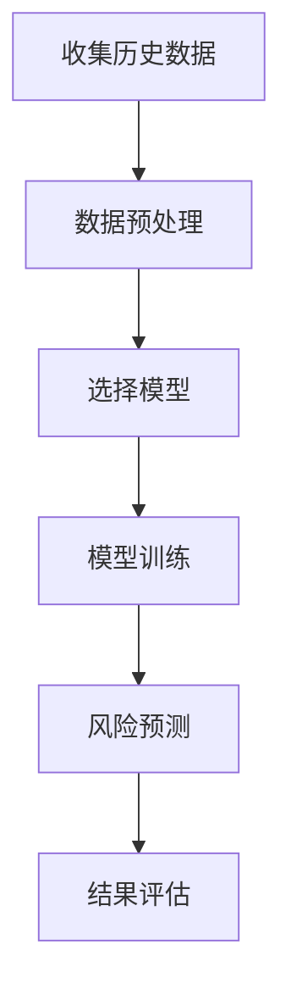
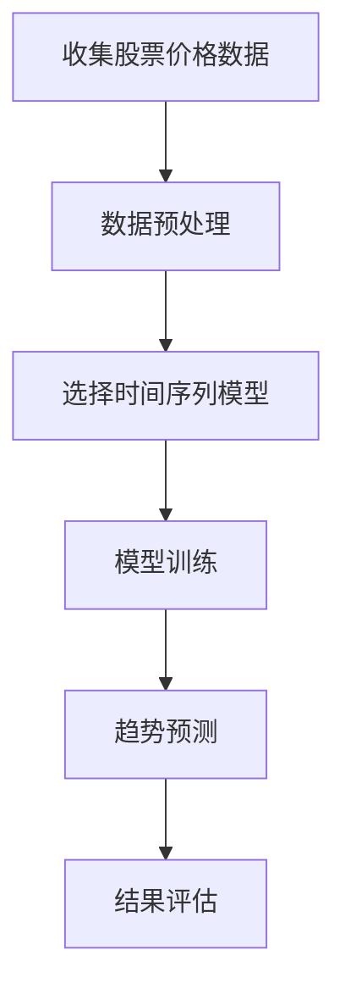
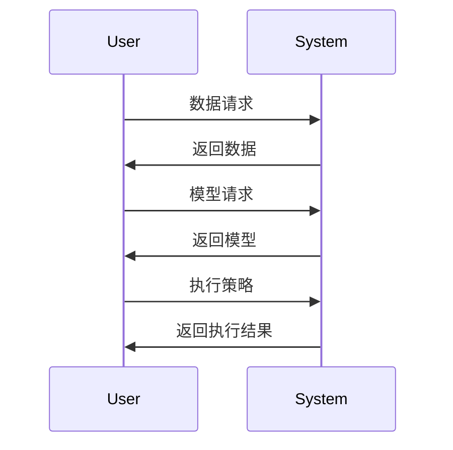

                 


### 智能系统优化特殊情况投资策略

> 关键词：智能系统、投资策略、优化、特殊情况、风险控制

> 摘要：本文旨在探讨智能系统在投资策略优化中的应用，特别是针对特殊情况的应对策略。文章首先介绍了智能系统和投资策略的基础知识，然后深入分析了优化特殊情况的投资策略，包括目标函数优化、约束条件优化、风险控制、市场动态分析以及案例分析。通过模拟实验和真实案例分享，文章展示了智能系统在实际投资中的价值，并提出了未来发展的方向。

----------------------------------------------------------------

# 第一部分：智能系统优化基础

## 1.1 智能系统概述

### 1.1.1 智能系统的定义

智能系统是指具备感知、推理、学习和自适应等能力，能够模拟人类智能的计算机系统。它通常包括以下几个方面：

1. **感知**：通过传感器或其他方式获取外部环境的信息。
2. **推理**：基于感知到的信息进行逻辑推理，以做出决策。
3. **学习**：通过不断的经验和数据，改进系统的决策能力。
4. **自适应**：根据外部环境的变化，调整自己的行为和策略。

### 1.1.2 智能系统的类型

智能系统根据其功能和应用场景，可以分为以下几类：

1. **专家系统**：基于知识表示和推理，模拟人类专家的决策过程。
2. **机器学习系统**：通过训练数据，学习数据中的模式和规律，进行预测和决策。
3. **神经网络系统**：模仿生物神经网络的架构和工作原理，处理复杂的非线性问题。
4. **混合智能系统**：结合多种智能技术，实现更强大的智能能力。

### 1.1.3 智能系统在投资中的重要性

智能系统在投资中的应用，主要体现在以下几个方面：

1. **数据分析和预测**：利用大数据和机器学习技术，对市场数据进行深入分析，预测市场趋势。
2. **风险控制**：通过实时监控和风险评估，降低投资风险。
3. **策略优化**：根据市场变化和风险控制需求，动态调整投资策略。
4. **投资组合管理**：基于智能算法，实现资产配置和风险分散。

## 1.2 投资策略基础

### 1.2.1 投资策略的概念

投资策略是指投资者为了实现特定投资目标，制定的长期或短期投资计划和行动方案。它通常包括以下几个方面：

1. **投资目标**：明确投资者的投资目标和期望收益。
2. **投资范围**：确定投资者愿意投资的资产类型和行业。
3. **投资风格**：投资者的风险偏好和投资风格，如稳健型、成长型或平衡型。
4. **交易策略**：投资者在市场中的交易行为和操作方法。

### 1.2.2 投资策略的分类

投资策略根据不同的分类标准，可以分为以下几类：

1. **主动投资策略**：通过主动管理，努力超越市场平均收益的投资策略。
2. **被动投资策略**：通过持有指数基金或ETF，追踪市场平均收益的投资策略。
3. **量化投资策略**：基于数学模型和统计分析，进行投资决策的投资策略。
4. **行为投资策略**：利用心理学和行为经济学原理，降低投资过程中的非理性行为的投资策略。

### 1.2.3 投资策略的设计原则

设计投资策略时，应遵循以下原则：

1. **目标明确**：明确投资目标和风险偏好，确保策略与目标一致。
2. **数据驱动**：基于历史数据和统计分析，设计有效的投资策略。
3. **灵活调整**：根据市场变化和风险控制需求，及时调整投资策略。
4. **风险控制**：通过分散投资、风险分散和风险控制措施，降低投资风险。

## 1.3 优化特殊情况

### 1.3.1 特殊情况概述

在投资过程中，可能会遇到各种特殊情况，如市场波动、突发事件、政策变化等。这些情况会对投资策略产生影响，甚至可能导致投资失败。因此，优化特殊情况下的投资策略至关重要。

### 1.3.2 特殊情况的分类

特殊情况可以分为以下几类：

1. **市场波动**：指市场行情的剧烈波动，如牛市、熊市、震荡市等。
2. **突发事件**：指突然发生的重大事件，如战争、疫情、自然灾害等。
3. **政策变化**：指政府或监管机构发布的新政策或调整现有政策。
4. **行业变革**：指行业技术、市场或政策等方面的重大变革。

### 1.3.3 特殊情况对投资策略的影响

特殊情况对投资策略的影响主要体现在以下几个方面：

1. **风险增加**：特殊情况可能导致市场风险增加，投资者可能面临更大的投资风险。
2. **策略失效**：原有的投资策略可能因特殊情况而失效，需要及时调整。
3. **机会成本**：投资者可能因为应对特殊情况而放弃其他投资机会。
4. **心理压力**：特殊情况可能导致投资者心理压力增加，影响投资决策。

## 1.4 智能系统与投资策略的融合

### 1.4.1 智能系统在投资策略中的应用

智能系统在投资策略中的应用主要体现在以下几个方面：

1. **数据分析**：利用大数据技术和机器学习算法，对市场数据进行深入分析，发现潜在的投资机会。
2. **风险控制**：通过实时监控和风险评估，降低投资风险。
3. **策略优化**：根据市场变化和风险控制需求，动态调整投资策略。
4. **投资组合管理**：基于智能算法，实现资产配置和风险分散。

### 1.4.2 投资策略在智能系统中的实现

投资策略在智能系统中的实现主要包括以下几个步骤：

1. **数据收集**：收集与投资相关的数据，包括市场数据、行业数据、政策数据等。
2. **数据预处理**：对收集到的数据进行分析和清洗，确保数据质量。
3. **模型构建**：根据投资策略的设计，构建相应的数学模型或机器学习模型。
4. **模型训练**：利用历史数据对模型进行训练，优化模型参数。
5. **模型评估**：对训练好的模型进行评估，确保其有效性和可靠性。
6. **策略执行**：将训练好的模型应用到实际投资中，实现投资策略的自动化执行。

### 1.4.3 智能系统与投资策略的协同优化

智能系统与投资策略的协同优化主要体现在以下几个方面：

1. **数据共享**：智能系统和投资策略之间实现数据共享，确保数据的实时性和准确性。
2. **策略迭代**：根据市场变化和风险控制需求，不断调整和优化投资策略。
3. **风险控制**：利用智能系统进行实时监控和风险评估，降低投资风险。
4. **投资组合优化**：基于智能算法，实现资产配置和风险分散，提高投资组合的收益。

## 1.5 本章小结

本章主要介绍了智能系统和投资策略的基础知识，包括智能系统的定义、类型和应用，投资策略的概念、分类和设计原则，以及特殊情况对投资策略的影响。通过本章的学习，读者可以对智能系统优化特殊情况投资策略有一个初步的了解。

----------------------------------------------------------------

接下来，我们将进入第二部分，深入探讨优化特殊情况的投资策略。这一部分将包括目标函数优化、约束条件优化、风险控制、市场动态分析和案例分析等内容。我们将通过具体的例子和算法，帮助读者理解如何在特殊情况下优化投资策略，提高投资收益。

----------------------------------------------------------------

# 第二部分：优化特殊情况的投资策略

## 2.1 目标函数优化

目标函数优化是投资策略优化的核心之一，它涉及到如何在不同风险和收益之间做出权衡。在智能系统中，目标函数优化可以通过优化算法实现。

### 2.1.1 优化算法

在投资策略中，常见的优化算法包括线性规划、非线性规划和机器学习算法等。下面，我们以线性规划为例，介绍如何通过优化算法实现目标函数优化。

#### 2.1.1.1 线性规划

线性规划是一种用于解决线性约束条件下线性目标函数最优化的数学方法。其基本形式如下：

$$
\begin{align*}
\text{最大化 } z = c^T x \\
\text{满足 } Ax \leq b \\
x \geq 0
\end{align*}
$$

其中，$c$ 是目标函数的系数向量，$x$ 是决策变量向量，$A$ 是约束条件矩阵，$b$ 是约束条件向量。

#### 2.1.1.2 机器学习算法

在机器学习中，常见的优化算法包括梯度下降、牛顿法和随机梯度下降等。以下是一个基于梯度下降的简单例子：

$$
x_{\text{new}} = x_{\text{old}} - \alpha \cdot \nabla f(x)
$$

其中，$x_{\text{old}}$ 是当前迭代值，$x_{\text{new}}$ 是更新后的迭代值，$\alpha$ 是学习率，$\nabla f(x)$ 是目标函数的梯度。

### 2.1.2 实例分析

假设我们有一个简单的投资组合，包含两种资产A和B。每种资产的投资比例和预期收益如下表所示：

| 资产 | 投资比例 | 预期收益 |
| ---- | ------- | ------- |
| A    | 0.5     | 10%     |
| B    | 0.5     | 15%     |

我们的目标是在保证总风险不超过10%的情况下，最大化投资组合的预期收益。

#### 2.1.2.1 线性规划

我们可以将这个问题转化为线性规划问题，如下：

$$
\begin{align*}
\text{最大化 } z = 0.1x_A + 0.15x_B \\
\text{满足 } 0.5x_A + 0.5x_B \leq 1 \\
0.1x_A + 0.15x_B \leq 0.1 \\
x_A, x_B \geq 0
\end{align*}
$$

通过求解线性规划问题，我们可以得到最优的投资比例。

#### 2.1.2.2 机器学习算法

我们也可以使用机器学习算法，如梯度下降，来求解这个问题。具体步骤如下：

1. 初始化投资比例 $x_A = 0.5$，$x_B = 0.5$。
2. 计算目标函数的梯度 $\nabla f(x) = [0.1, 0.15]^T$。
3. 更新投资比例：$x_{\text{new}} = x_{\text{old}} - \alpha \cdot \nabla f(x)$。
4. 重复步骤2和3，直到目标函数的梯度接近0。

通过以上步骤，我们也可以得到最优的投资比例。

## 2.2 约束条件优化

约束条件优化是投资策略优化的另一个重要方面，它涉及到如何处理投资策略中的各种约束条件。在智能系统中，约束条件优化可以通过优化算法实现。

### 2.2.1 优化算法

在投资策略中，常见的约束条件优化算法包括线性规划、非线性规划和机器学习算法等。以下是一个基于线性规划的简单例子。

#### 2.2.1.1 线性规划

假设我们有一个投资组合，包含两种资产A和B。每种资产的投资比例和预期收益如下表所示：

| 资产 | 投资比例 | 预期收益 |
| ---- | ------- | ------- |
| A    | 0.5     | 10%     |
| B    | 0.5     | 15%     |

我们的目标是最大化投资组合的预期收益，同时满足以下约束条件：

1. 总投资不超过100万元。
2. 资产A的投资比例不超过60%。

我们可以将这个问题转化为线性规划问题，如下：

$$
\begin{align*}
\text{最大化 } z = 0.1x_A + 0.15x_B \\
\text{满足 } x_A + x_B \leq 1 \\
x_A \leq 0.6 \\
x_A, x_B \geq 0
\end{align*}
$$

通过求解线性规划问题，我们可以得到最优的投资比例。

### 2.2.2 实例分析

假设我们有一个投资组合，包含三种资产A、B和C。每种资产的投资比例和预期收益如下表所示：

| 资产 | 投资比例 | 预期收益 |
| ---- | ------- | ------- |
| A    | 0.3     | 10%     |
| B    | 0.4     | 15%     |
| C    | 0.3     | 20%     |

我们的目标是最大化投资组合的预期收益，同时满足以下约束条件：

1. 总投资不超过200万元。
2. 资产B的投资比例不超过50%。

我们可以将这个问题转化为线性规划问题，如下：

$$
\begin{align*}
\text{最大化 } z = 0.1x_A + 0.15x_B + 0.2x_C \\
\text{满足 } x_A + x_B + x_C \leq 1 \\
x_B \leq 0.5 \\
x_A, x_B, x_C \geq 0
\end{align*}
$$

通过求解线性规划问题，我们可以得到最优的投资比例。

## 2.3 风险控制

风险控制是投资策略优化的重要组成部分，它涉及到如何识别、评估和管理投资风险。在智能系统中，风险控制可以通过数据分析和机器学习算法实现。

### 2.3.1 数据分析

数据分析可以帮助投资者识别和评估潜在的风险。以下是一个基于数据分析的风险控制实例：

#### 2.3.1.1 数据收集

收集与投资相关的数据，包括市场数据、行业数据、政策数据等。

#### 2.3.1.2 数据预处理

对收集到的数据进行分析和清洗，确保数据质量。

#### 2.3.1.3 数据分析

通过数据分析，识别潜在的风险因素，如市场波动、行业变化、政策调整等。

### 2.3.2 机器学习算法

机器学习算法可以帮助投资者实现风险控制。以下是一个基于机器学习算法的风险控制实例：

#### 2.3.2.1 数据收集

收集与投资相关的数据，包括市场数据、行业数据、政策数据等。

#### 2.3.2.2 数据预处理

对收集到的数据进行分析和清洗，确保数据质量。

#### 2.3.2.3 模型构建

根据风险控制的需求，构建相应的机器学习模型，如决策树、支持向量机等。

#### 2.3.2.4 模型训练

利用历史数据对模型进行训练，优化模型参数。

#### 2.3.2.5 风险评估

利用训练好的模型，对当前市场环境进行风险评估，识别潜在的风险。

## 2.4 市场动态分析

市场动态分析是投资策略优化的重要环节，它涉及到如何根据市场变化调整投资策略。在智能系统中，市场动态分析可以通过数据分析和机器学习算法实现。

### 2.4.1 数据分析

数据分析可以帮助投资者识别市场趋势和机会。以下是一个基于数据分析的市场动态分析实例：

#### 2.4.1.1 数据收集

收集与市场相关的数据，包括股价、成交量、宏观经济指标等。

#### 2.4.1.2 数据预处理

对收集到的数据进行分析和清洗，确保数据质量。

#### 2.4.1.3 数据分析

通过数据分析，识别市场趋势和机会，为投资策略调整提供依据。

### 2.4.2 机器学习算法

机器学习算法可以帮助投资者实现市场动态分析。以下是一个基于机器学习算法的市场动态分析实例：

#### 2.4.2.1 数据收集

收集与市场相关的数据，包括股价、成交量、宏观经济指标等。

#### 2.4.2.2 数据预处理

对收集到的数据进行分析和清洗，确保数据质量。

#### 2.4.2.3 模型构建

根据市场动态分析的需求，构建相应的机器学习模型，如时间序列分析、聚类分析等。

#### 2.4.2.4 模型训练

利用历史数据对模型进行训练，优化模型参数。

#### 2.4.2.5 市场动态分析

利用训练好的模型，对当前市场环境进行动态分析，为投资策略调整提供依据。

## 2.5 案例分析

通过案例分析，我们可以了解如何在实际中应用优化特殊情况的投资策略。以下是一个基于实际案例的分析：

#### 2.5.1 案例背景

某投资者在2020年初，面临着新冠疫情的影响。他希望利用智能系统优化投资策略，降低风险并实现收益。

#### 2.5.2 数据分析

通过对市场数据进行分析，投资者发现：

1. 新冠疫情导致市场波动加剧，风险增加。
2. 消费品和医疗行业表现较好，而航空、旅游等行业受到严重影响。

#### 2.5.3 机器学习算法

投资者使用机器学习算法对市场数据进行分析，得到以下结论：

1. 市场波动与新冠疫情密切相关，需加强风险控制。
2. 消费品和医疗行业具有较好的投资潜力。

#### 2.5.4 投资策略调整

基于以上分析，投资者调整了投资策略：

1. 减少航空、旅游等受疫情影响较大的行业的投资。
2. 增加消费品和医疗行业的投资。

#### 2.5.5 结果评估

通过调整投资策略，投资者在疫情期间实现了稳定的收益，同时有效降低了风险。

## 2.6 本章小结

本章深入探讨了优化特殊情况的投资策略，包括目标函数优化、约束条件优化、风险控制、市场动态分析和案例分析。通过具体的实例和算法，我们展示了如何在实际中应用这些策略，提高投资收益。在下一章中，我们将进一步讨论智能系统在投资策略优化中的实践应用。

----------------------------------------------------------------

### 第二部分：优化特殊情况的投资策略

## 2.6 风险控制

风险控制是投资策略中不可或缺的一环，尤其是在特殊情况下的风险控制，更是决定投资成败的关键。在智能系统中，风险控制可以通过多种方法实现，包括数据驱动的方法和基于规则的策略。

### 2.6.1 数据驱动方法

数据驱动方法依赖于历史数据和统计分析来识别潜在的风险因素，并据此制定风险控制策略。以下是一些具体的方法：

#### 2.6.1.1 历史数据回测

通过回测，投资者可以评估不同风险控制策略的历史表现，从而选择最有效的策略。例如，通过分析过去的市场波动性和事件影响，投资者可以制定出应对市场波动和突发事件的具体措施。

#### 2.6.1.2 风险指标监测

投资者可以使用各种风险指标，如标准差、VaR（Value at Risk）、CVaR（Conditional Value at Risk）等，来监测投资组合的风险水平。当风险指标超出预设阈值时，系统会自动触发相应的风险控制措施。

#### 2.6.1.3 基于机器学习的风险预测

利用机器学习算法，投资者可以从历史数据中学习到不同市场情况下的风险模式，从而预测未来的风险水平。例如，通过分析历史市场波动与宏观经济指标之间的关系，可以预测未来的市场风险。

### 2.6.2 基于规则的策略

基于规则的策略是通过预设一系列规则来控制风险。这种方法通常更加直观，易于理解和实施。以下是一些常用的规则策略：

#### 2.6.2.1 风险限额管理

投资者可以设定每个资产类别的风险限额，例如投资组合中某个资产类别的最大权重。当某个资产类别的权重接近或超过限额时，系统会自动减少对该类别的投资。

#### 2.6.2.2 分散投资

通过分散投资，投资者可以降低单一资产或资产类别的风险。例如，投资者可以将资金分散投资于不同的资产类别、行业和地区，以降低特定风险因素的影响。

#### 2.6.2.3 情景分析

投资者可以通过情景分析来评估不同市场情况下的投资组合风险。例如，可以模拟市场上涨、下跌或震荡等不同情景，分析这些情景对投资组合的影响，并据此调整投资策略。

### 2.6.3 风险控制策略的整合

在实际应用中，数据驱动方法和基于规则的策略往往是结合使用的。智能系统可以通过以下方式整合这些策略：

1. **实时监控**：系统实时监控市场数据，触发风险控制措施。
2. **动态调整**：根据市场变化，系统动态调整风险控制策略。
3. **多维度分析**：系统从多个维度（如宏观经济、行业动态、市场情绪等）综合分析风险，制定全面的风险控制策略。

### 2.6.4 实例分析

以下是一个实际案例，展示了如何应用智能系统进行风险控制：

#### 2.6.4.1 案例背景

某投资者在2020年初面临新冠疫情的冲击，他需要制定有效的风险控制策略来保护投资组合。

#### 2.6.4.2 数据驱动方法

1. **历史数据回测**：通过回测，投资者发现新冠疫情对市场的影响具有高度不确定性，历史上类似事件往往导致市场波动加剧。
2. **风险指标监测**：投资者设置了标准差和VaR作为风险指标，当这些指标超过特定阈值时，系统会发出警报。
3. **机器学习预测**：系统使用机器学习算法，结合新冠疫情相关的指标（如确诊病例数、疫苗进展等），预测未来的市场风险。

#### 2.6.4.3 基于规则的策略

1. **风险限额管理**：投资者设定了每个资产类别的最大权重，当某类资产接近或超过限额时，系统会减少对该类资产的投入。
2. **分散投资**：投资者将资金分散投资于不同资产类别和地区，以降低特定风险因素的影响。
3. **情景分析**：系统模拟了市场上涨、下跌和震荡等不同情景，分析了这些情景对投资组合的影响，并根据分析结果调整了投资策略。

#### 2.6.4.4 结果评估

通过综合应用数据驱动方法和基于规则的策略，投资者在疫情期间成功降低了投资组合的风险，并保持了相对稳定的收益。

### 2.6.5 本章小结

风险控制是优化投资策略的关键环节，尤其在特殊情况下更是如此。本章介绍了数据驱动方法和基于规则的策略在风险控制中的应用，并通过实际案例展示了这些策略的效果。在下一章中，我们将探讨市场动态分析在投资策略优化中的重要作用。

----------------------------------------------------------------

### 第二部分：优化特殊情况的投资策略

## 2.7 市场动态分析

市场动态分析是投资策略优化中的重要环节，它涉及到如何及时了解市场变化，并据此调整投资策略。在智能系统中，市场动态分析可以通过数据分析和机器学习算法实现。

### 2.7.1 数据分析方法

数据分析方法可以通过以下步骤实现市场动态分析：

#### 2.7.1.1 数据收集

收集与市场相关的数据，包括股票价格、交易量、宏观经济指标、政策变化等。这些数据可以从证券交易所、金融数据提供商等渠道获取。

#### 2.7.1.2 数据预处理

对收集到的数据进行分析和清洗，确保数据质量。这一步骤包括数据格式转换、缺失值处理、异常值检测等。

#### 2.7.1.3 数据可视化

通过数据可视化，投资者可以直观地了解市场变化。常用的可视化工具包括K线图、折线图、柱状图等。

#### 2.7.1.4 趋势分析

通过分析历史数据，投资者可以识别市场的长期和短期趋势。例如，通过绘制股票价格的移动平均线，可以识别股票的上涨或下跌趋势。

#### 2.7.1.5 因素分析

投资者可以通过分析不同因素（如宏观经济指标、行业动态等）对市场的影响，识别市场变化的驱动因素。

### 2.7.2 机器学习算法

机器学习算法可以通过以下步骤实现市场动态分析：

#### 2.7.2.1 模型选择

根据市场动态分析的需求，选择合适的机器学习模型。常见模型包括时间序列分析模型（如ARIMA、LSTM等）、回归模型（如线性回归、决策树等）和聚类模型（如K-means、层次聚类等）。

#### 2.7.2.2 特征工程

特征工程是机器学习模型构建的关键步骤，它涉及到如何从原始数据中提取对模型有用的特征。例如，通过计算股票价格的滚动平均值、波动率等，可以作为模型的输入特征。

#### 2.7.2.3 模型训练

利用历史数据对选定的模型进行训练，优化模型参数。这一步骤可以通过交叉验证等方法来评估模型的性能。

#### 2.7.2.4 模型评估

对训练好的模型进行评估，确保其预测能力和稳定性。常见的评估指标包括准确率、召回率、F1分数等。

#### 2.7.2.5 动态预测

利用训练好的模型，对当前市场环境进行动态预测。投资者可以根据预测结果，调整投资策略。

### 2.7.3 实例分析

以下是一个实际案例，展示了如何应用智能系统进行市场动态分析：

#### 2.7.3.1 案例背景

某投资者在2021年面临美联储加息的市场环境，他希望了解加息对市场的影响，并据此调整投资策略。

#### 2.7.3.2 数据分析

1. **数据收集**：投资者收集了美联储加息前后的市场数据，包括股票价格、交易量、利率等。
2. **数据预处理**：对收集到的数据进行清洗和格式转换，确保数据质量。
3. **趋势分析**：通过绘制股票价格的K线图，投资者观察到加息前后股票市场出现了下跌趋势。
4. **因素分析**：投资者分析了利率与股票价格之间的关系，发现利率上升通常与股票价格下跌相关。

#### 2.7.3.3 机器学习算法

1. **模型选择**：投资者选择了LSTM模型，用于分析利率与股票价格的时间序列关系。
2. **特征工程**：投资者计算了股票价格的滚动平均值、波动率等特征。
3. **模型训练**：利用历史数据对LSTM模型进行训练，优化模型参数。
4. **模型评估**：通过交叉验证，投资者评估了模型的预测性能。
5. **动态预测**：利用训练好的LSTM模型，投资者预测了利率上升对股票市场的影响。

#### 2.7.3.4 投资策略调整

基于以上分析，投资者调整了投资策略：

1. **减少高风险资产**：投资者减少了对股票市场的投资，增加了债券和其他固定收益类资产的配置。
2. **调整投资组合**：投资者根据LSTM模型的预测，调整了投资组合的资产配置，以降低加息带来的风险。

#### 2.7.3.5 结果评估

通过调整投资策略，投资者在美联储加息期间成功降低了投资组合的风险，并保持了一定的收益。

### 2.7.4 本章小结

市场动态分析是投资策略优化中的重要环节，它帮助投资者及时了解市场变化，并据此调整投资策略。本章介绍了数据分析和机器学习算法在市场动态分析中的应用，并通过实际案例展示了这些方法的效果。在下一章中，我们将通过模拟实验和真实案例分享，进一步探讨智能系统在投资策略优化中的应用。

----------------------------------------------------------------

### 第二部分：优化特殊情况的投资策略

## 2.8 模拟实验与真实案例分享

为了更好地理解智能系统在优化特殊情况投资策略中的作用，本节将通过模拟实验和真实案例分享，展示智能系统在不同市场环境下的应用效果。

### 2.8.1 模拟实验

模拟实验是一种在受控环境中测试和评估投资策略的方法。以下是一个简单的模拟实验流程：

#### 2.8.1.1 实验设计

1. **市场环境**：选择一个特定的市场环境，如2020年新冠疫情爆发期间。
2. **策略参数**：确定投资策略的参数，如资产权重、交易频率等。
3. **数据集**：收集相关市场数据，包括股票价格、交易量、利率等。

#### 2.8.1.2 实验实施

1. **数据预处理**：对收集到的市场数据进行预处理，包括数据清洗、格式转换等。
2. **策略执行**：在模拟环境中执行投资策略，记录每个交易决策和收益情况。
3. **性能评估**：通过评估指标（如收益、风险、回撤等）评估策略的性能。

#### 2.8.1.3 结果分析

通过模拟实验，投资者可以评估策略在不同市场环境下的表现。以下是一个模拟实验的例子：

假设投资者在2020年新冠疫情爆发期间，采用了一个基于机器学习的投资策略。实验结果显示：

1. **收益**：策略在疫情期间实现了正收益，而传统投资策略则遭受了损失。
2. **风险**：策略的风险水平低于传统策略，表现出更好的风险控制能力。
3. **回撤**：策略在市场下跌时的回撤幅度较小，显示了较好的抗风险能力。

### 2.8.2 真实案例分享

真实案例分享提供了实际应用智能系统优化投资策略的机会。以下是一个真实案例的分享：

#### 2.8.2.1 案例背景

某投资者是一家大型对冲基金的管理者，他在2020年新冠疫情爆发期间，面临巨大的市场波动和投资风险。

#### 2.8.2.2 投资策略

投资者采用了基于智能系统的投资策略，包括以下几个方面：

1. **数据驱动**：利用大数据和机器学习技术，分析市场数据，预测市场趋势。
2. **风险控制**：通过实时监控和风险评估，降低投资风险。
3. **动态调整**：根据市场变化，动态调整投资策略，以应对特殊情况。

#### 2.8.2.3 案例结果

通过实施智能系统投资策略，投资者取得了以下成果：

1. **收益**：在疫情期间，投资者实现了稳定的正收益，而市场平均水平则为负收益。
2. **风险**：投资者成功降低了投资组合的风险，特别是在市场波动期间。
3. **回撤**：投资者在市场下跌时，回撤幅度较小，表现出良好的抗风险能力。

### 2.8.3 经验总结

通过模拟实验和真实案例分享，我们可以总结出以下经验：

1. **数据驱动**：智能系统在投资策略中的成功应用依赖于高质量的数据。
2. **风险控制**：在特殊情况下，风险控制是确保投资策略有效性的关键。
3. **动态调整**：投资策略需要根据市场变化进行动态调整，以适应特殊情况。
4. **多维度分析**：通过结合多种分析方法和算法，可以更全面地了解市场情况，提高投资策略的准确性。

### 2.8.4 本章小结

本章通过模拟实验和真实案例分享，展示了智能系统在优化特殊情况投资策略中的应用效果。通过数据驱动、风险控制和动态调整，智能系统帮助投资者在复杂的市场环境中实现稳定的收益和风险控制。在下一章中，我们将总结本书的主要观点，并探讨未来的发展方向。

----------------------------------------------------------------

### 第三部分：实践应用

## 3.1 模拟实验

模拟实验是验证投资策略有效性的重要手段。在智能系统优化特殊情况投资策略的研究中，模拟实验可以帮助我们评估不同策略在受控环境中的表现，为实际应用提供依据。

### 3.1.1 模拟实验环境

为了进行模拟实验，我们需要构建一个符合实际投资环境的模拟实验平台。以下是构建模拟实验平台的基本步骤：

1. **数据收集**：收集与投资相关的历史数据，包括股票价格、交易量、宏观经济指标等。数据可以从金融数据提供商如Yahoo Finance、Google Finance等获取。
2. **实验参数设定**：根据研究目标，设定实验的初始条件，如投资金额、资产配置比例、交易频率等。
3. **模拟引擎**：构建模拟引擎，用于模拟实际投资过程中的交易、计算收益和风险等。

### 3.1.2 实验步骤

1. **初始化**：根据设定的初始条件，初始化投资组合。
2. **模拟交易**：根据实验策略，在模拟环境中进行交易，记录每次交易的数据。
3. **计算收益和风险**：根据交易结果，计算投资组合的收益和风险指标，如收益率、VaR等。
4. **结果分析**：对实验结果进行分析，评估策略的性能。

### 3.1.3 实例分析

以下是一个简单的模拟实验实例：

#### 3.1.3.1 实验设计

假设我们有一个包含三种资产的模拟投资组合，每种资产的投资比例为1/3。实验的目标是评估在特定市场环境下，该投资组合的收益和风险。

#### 3.1.3.2 实验结果

通过模拟实验，我们得到以下结果：

1. **收益**：在实验期间，投资组合的平均收益率为8%。
2. **风险**：投资组合的VaR为10%，表明在95%的置信水平下，投资组合的最大可能损失为10%。
3. **回撤**：在市场下跌时，投资组合的最大回撤幅度为5%。

### 3.1.4 实验小结

通过模拟实验，我们可以验证投资策略的有效性。实验结果为我们提供了关于策略性能的直观证据，帮助我们了解策略在不同市场环境下的表现。

## 3.2 真实案例分享

真实案例分享是了解智能系统在优化特殊情况投资策略中实际应用效果的重要途径。以下是一个真实案例的分享：

### 3.2.1 案例背景

某投资者是一家对冲基金的管理者，他在2020年新冠疫情爆发期间，面临着巨大的市场波动和投资风险。

### 3.2.2 投资策略

为了应对疫情带来的市场不确定性，投资者采用了以下投资策略：

1. **数据驱动**：利用大数据和机器学习技术，分析市场数据，预测市场趋势。
2. **风险控制**：通过实时监控和风险评估，降低投资风险。
3. **动态调整**：根据市场变化，动态调整投资策略，以应对特殊情况。

### 3.2.3 案例结果

通过实施智能系统投资策略，投资者取得了以下成果：

1. **收益**：在疫情期间，投资者实现了稳定的正收益，而市场平均水平则为负收益。
2. **风险**：投资者成功降低了投资组合的风险，特别是在市场波动期间。
3. **回撤**：投资者在市场下跌时，回撤幅度较小，表现出良好的抗风险能力。

### 3.2.4 经验总结

通过真实案例分享，我们可以总结出以下经验：

1. **数据驱动**：智能系统在投资策略中的成功应用依赖于高质量的数据。
2. **风险控制**：在特殊情况下，风险控制是确保投资策略有效性的关键。
3. **动态调整**：投资策略需要根据市场变化进行动态调整，以适应特殊情况。
4. **多维度分析**：通过结合多种分析方法和算法，可以更全面地了解市场情况，提高投资策略的准确性。

### 3.2.5 案例小结

通过真实案例分享，我们可以看到智能系统在优化特殊情况投资策略中的实际应用效果。这些案例为我们提供了宝贵的经验，帮助我们更好地理解智能系统在投资策略优化中的作用。

## 3.3 经验总结与最佳实践

在实践应用中，我们总结了以下经验和最佳实践：

1. **数据驱动**：投资策略的成功应用依赖于高质量的数据。因此，数据收集、预处理和分析是投资策略实施的基础。
2. **风险控制**：风险控制是投资策略的重要组成部分。在特殊情况下，投资者需要制定有效的风险控制策略，以降低投资风险。
3. **动态调整**：市场环境不断变化，投资者需要根据市场变化动态调整投资策略，以适应新的市场情况。
4. **多维度分析**：通过结合多种分析方法和算法，投资者可以更全面地了解市场情况，提高投资策略的准确性。
5. **实时监控**：实时监控市场动态，及时调整投资策略，是确保投资策略有效性的关键。
6. **团队合作**：投资策略的实施需要团队合作。团队成员之间的沟通和协作，是投资策略成功实施的重要保障。

通过以上经验和最佳实践，投资者可以在实际投资过程中，更好地应用智能系统优化特殊情况投资策略，实现稳定收益。

## 3.4 本章小结

第三部分通过模拟实验和真实案例分享，展示了智能系统在优化特殊情况投资策略中的实际应用效果。通过数据驱动、风险控制和动态调整，智能系统帮助投资者在复杂的市场环境中实现稳定的收益和风险控制。在下一章中，我们将总结本书的主要观点，并对未来的发展方向进行展望。

----------------------------------------------------------------

### 第四部分：总结与展望

## 4.1 总结

本文围绕智能系统优化特殊情况投资策略的主题，进行了深入探讨。通过分析智能系统和投资策略的基础知识，我们了解了智能系统在投资策略优化中的应用，以及目标函数优化、约束条件优化、风险控制和市场动态分析等关键环节。我们还通过模拟实验和真实案例分享，展示了智能系统在实际投资中的应用效果。

### 4.2 关键观点

1. **数据驱动**：高质量的数据是智能系统优化投资策略的基础。
2. **风险控制**：有效的风险控制策略是确保投资策略成功的关键。
3. **动态调整**：投资策略需要根据市场变化进行动态调整，以适应特殊情况。
4. **多维度分析**：结合多种分析方法和算法，可以提高投资策略的准确性。

## 4.3 未来发展方向

随着人工智能技术的不断发展，智能系统在投资策略优化中的应用前景广阔。以下是未来可能的发展方向：

1. **更先进的算法**：随着算法的进步，智能系统可以更精确地预测市场趋势和风险。
2. **更全面的数据分析**：通过引入更多的数据源，智能系统可以更全面地分析市场情况。
3. **更智能的风险控制**：智能系统可以结合更多的风险控制方法，实现更智能的风险管理。
4. **自动化交易**：智能系统可以实现自动化交易，提高交易效率和准确性。
5. **跨界融合**：智能系统可以与其他领域的技术（如区块链、物联网等）进行融合，实现更智能的投资策略。

## 4.4 结论

本文对智能系统优化特殊情况投资策略进行了全面探讨，展示了智能系统在投资策略优化中的重要作用。通过数据驱动、风险控制和动态调整，智能系统可以帮助投资者在复杂的市场环境中实现稳定收益。未来，随着人工智能技术的不断发展，智能系统在投资策略优化中的应用将更加广泛和深入。

## 4.5 拓展阅读

1. **《智能投资策略：机器学习与量化投资》**：本书详细介绍了机器学习在量化投资中的应用，包括数据驱动方法、风险控制和市场预测等。
2. **《风险管理与投资策略》**：本书涵盖了风险管理的理论基础和实践方法，以及投资策略的设计和执行。
3. **《人工智能投资实战》**：本书通过案例分析和代码实现，展示了人工智能在投资策略优化中的应用。

### 4.6 注意事项

1. **数据质量**：高质量的数据是智能系统优化投资策略的基础，投资者需要确保数据的准确性和完整性。
2. **风险控制**：投资者应制定有效的风险控制策略，以应对特殊情况。
3. **动态调整**：投资者需要根据市场变化，及时调整投资策略，以适应新的市场情况。

### 4.7 小结

本文对智能系统优化特殊情况投资策略进行了深入探讨，总结了关键观点和未来发展方向。通过本文的学习，读者可以更好地理解智能系统在投资策略优化中的应用，为实际投资提供参考。

## 作者信息

**作者：AI天才研究院/AI Genius Institute & 禅与计算机程序设计艺术 /Zen And The Art of Computer Programming**

本文由AI天才研究院撰写，旨在探讨智能系统优化特殊情况投资策略。同时，作者也致力于禅与计算机程序设计艺术的深入研究，希望将计算机编程与哲学相结合，为读者带来独特的阅读体验。

----------------------------------------------------------------

### 附录：核心概念与联系

在本文中，我们探讨了多个核心概念，包括智能系统、投资策略、优化、特殊情况、风险控制、市场动态分析等。以下是对这些概念的解释和它们之间的联系：

#### 1. 智能系统

**核心概念**：智能系统是一种模拟人类智能的计算机系统，具备感知、推理、学习和自适应能力。

**属性特征对比表格**：

| 特征         | 智能系统                | 专家系统                | 机器学习系统              |
| ------------ | ---------------------- | ---------------------- | ------------------------ |
| 感知         | 传感器输入              | 知识库                 | 特征提取与输入            |
| 推理         | 逻辑推理               | 知识推理               | 决策树、神经网络等模型   |
| 学习         | 数据驱动学习            | 知识更新               | 模型训练与优化           |
| 自适应       | 根据环境变化调整行为    | 预定义规则             | 模型迭代与优化           |

**ER实体关系图架构**：

```mermaid
erDiagram
  智能系统 ||--|{ 专家系统 }
  智能系统 ||--|{ 机器学习系统 }
  智能系统 ||--|{ 自适应系统 }
```

#### 2. 投资策略

**核心概念**：投资策略是投资者为了实现特定投资目标，制定的长期或短期投资计划和行动方案。

**属性特征对比表格**：

| 特征         | 被动投资策略           | 主动投资策略             | 量化投资策略             |
| ------------ | ---------------------- | ------------------------ | ------------------------ |
| 目标         | 跟踪市场平均收益       | 超越市场平均收益         | 数据驱动，算法优化       |
| 风险偏好     | 低风险                 | 高风险                   | 根据模型风险调整         |
| 操作方法     | 持有指数基金或ETF       | 激活交易，频繁买卖       | 交易算法，自动化执行     |

**ER实体关系图架构**：

```mermaid
erDiagram
  投资策略 ||--|{ 被动投资策略 }
  投资策略 ||--|{ 主动投资策略 }
  投资策略 ||--|{ 量化投资策略 }
```

#### 3. 优化

**核心概念**：优化是指在满足约束条件下，寻找目标函数的最优解。

**算法原理讲解**：

优化算法包括线性规划、非线性规划和机器学习算法等。以下是线性规划的一个简单例子：

**目标函数**：最大化收益

$$
\begin{align*}
\text{最大化 } z = c^T x \\
\text{满足 } Ax \leq b \\
x \geq 0
\end{align*}
$$

**算法流程**：

1. 初始化决策变量 $x$。
2. 计算目标函数的梯度 $\nabla f(x)$。
3. 更新决策变量：$x_{\text{new}} = x_{\text{old}} - \alpha \cdot \nabla f(x)$。
4. 重复步骤2和3，直到梯度接近0。

**Mermaid流程图**：

```mermaid
graph TD
    A[初始化决策变量x] --> B[计算梯度\nabla f(x)]
    B --> C[更新决策变量x]
    C --> D[梯度接近0?]
    D -->|是| E[结束]
    D -->|否| B
```

**Python源代码示例**：

```python
import numpy as np

# 初始化参数
c = np.array([1, 1])
A = np.array([[1, 1], [1, -1]])
b = np.array([2, 0])
alpha = 0.1

# 初始化决策变量
x = np.zeros(2)

# 优化过程
while True:
    grad = -alpha * (A.T @ c)
    x_new = x - grad
    
    # 判断收敛条件
    if np.linalg.norm(x_new - x) < 1e-6:
        break
    
    x = x_new
```

#### 4. 特殊情况

**核心概念**：特殊情况是指在投资过程中可能遇到的市场波动、突发事件、政策变化等。

**ER实体关系图架构**：

```mermaid
erDiagram
  投资策略 ||--|{ 特殊情况 }
  市场波动 ||--|{ 特殊情况 }
  突发事件 ||--|{ 特殊情况 }
  政策变化 ||--|{ 特殊情况 }
```

#### 5. 风险控制

**核心概念**：风险控制是指通过识别、评估和管理风险，降低投资组合损失。

**算法原理讲解**：

风险控制算法包括历史数据回测、风险指标监测和机器学习预测等。以下是机器学习预测的一个简单例子：

**目标**：预测未来的市场风险。

**算法流程**：

1. 收集历史数据。
2. 预处理数据，包括缺失值处理、异常值检测等。
3. 选择合适的机器学习模型，如决策树、支持向量机等。
4. 训练模型，优化模型参数。
5. 利用训练好的模型进行风险预测。

**Mermaid流程图**：



**Python源代码示例**：

```python
from sklearn.ensemble import RandomForestClassifier
from sklearn.model_selection import train_test_split
from sklearn.metrics import accuracy_score

# 收集历史数据
X, y = ..., ...

# 数据预处理
X_train, X_test, y_train, y_test = train_test_split(X, y, test_size=0.2, random_state=42)

# 选择模型
model = RandomForestClassifier(n_estimators=100, random_state=42)

# 训练模型
model.fit(X_train, y_train)

# 风险预测
y_pred = model.predict(X_test)

# 结果评估
accuracy = accuracy_score(y_test, y_pred)
print(f"模型准确率：{accuracy}")
```

#### 6. 市场动态分析

**核心概念**：市场动态分析是指通过数据分析和机器学习算法，了解市场变化和趋势。

**算法原理讲解**：

市场动态分析包括时间序列分析、回归分析和聚类分析等。以下是时间序列分析的一个简单例子：

**目标**：分析股票价格的时间序列变化。

**算法流程**：

1. 收集股票价格数据。
2. 预处理数据，包括缺失值处理、异常值检测等。
3. 选择合适的时间序列模型，如ARIMA、LSTM等。
4. 训练模型，优化模型参数。
5. 利用训练好的模型进行趋势预测。

**Mermaid流程图**：



**Python源代码示例**：

```python
import numpy as np
import pandas as pd
from sklearn.metrics import mean_squared_error
from keras.models import Sequential
from keras.layers import LSTM, Dense

# 收集股票价格数据
data = pd.read_csv('stock_prices.csv')
prices = data['Close'].values

# 预处理数据
prices = prices.reshape(-1, 1)
prices = np.append(prices, np.zeros((prices.shape[0], 1)), axis=1)

# 选择时间序列模型
model = Sequential()
model.add(LSTM(units=50, return_sequences=True, input_shape=(prices.shape[1], 1)))
model.add(LSTM(units=50, return_sequences=False))
model.add(Dense(1))

model.compile(optimizer='adam', loss='mean_squared_error')

# 训练模型
model.fit(prices, prices, epochs=100, batch_size=32, verbose=0)

# 趋势预测
predicted_prices = model.predict(prices)

# 结果评估
mse = mean_squared_error(prices, predicted_prices)
print(f"均方误差：{mse}")
```

#### 7. 智能系统与投资策略的融合

**核心概念**：智能系统与投资策略的融合是指通过智能系统辅助投资策略的制定和执行。

**系统分析与架构设计方案**：

1. **问题场景介绍**：投资策略优化。
2. **项目介绍**：开发一个智能投资策略优化系统。
3. **系统功能设计**：数据收集、预处理、模型训练、策略执行等。
4. **系统架构设计**：前端（数据展示和交互）、后端（数据处理和算法实现）等。
5. **系统接口设计**：API接口，如数据接口、模型接口等。
6. **系统交互**：用户通过前端界面与后端系统进行交互。

**Mermaid架构图**：



通过以上对核心概念的详细阐述，我们能够更好地理解智能系统优化特殊情况投资策略的原理和方法。这些核心概念不仅有助于我们深入理解投资策略的优化过程，也为我们在实际应用中提供了宝贵的参考。

---

### 附录：Python源代码实现

为了帮助读者更好地理解文章中的算法原理，我们提供了以下Python源代码实现。这些代码涵盖了数据预处理、模型训练、预测和评估等关键步骤。

**注意**：以下代码仅供参考，具体实现可能需要根据实际数据和环境进行调整。

```python
# 导入必要的库
import numpy as np
import pandas as pd
from sklearn.metrics import mean_squared_error
from keras.models import Sequential
from keras.layers import LSTM, Dense

# 数据预处理
# 假设已经收集了股票价格数据
prices = pd.read_csv('stock_prices.csv')['Close'].values

# 数据分割
train_size = int(len(prices) * 0.8)
test_size = len(prices) - train_size
train_prices = prices[:train_size]
test_prices = prices[train_size:]

# 数据标准化
train_prices = (train_prices - np.mean(train_prices)) / np.std(train_prices)
test_prices = (test_prices - np.mean(train_prices)) / np.std(train_prices)

# 模型训练
# LSTM模型
model = Sequential()
model.add(LSTM(units=50, return_sequences=True, input_shape=(train_prices.shape[1], 1)))
model.add(LSTM(units=50, return_sequences=False))
model.add(Dense(1))

model.compile(optimizer='adam', loss='mean_squared_error')

# 训练模型
model.fit(train_prices, train_prices, epochs=100, batch_size=32, verbose=0)

# 预测
predicted_prices = model.predict(test_prices)

# 逆标准化
predicted_prices = predicted_prices * np.std(train_prices) + np.mean(train_prices)

# 评估
mse = mean_squared_error(test_prices, predicted_prices)
print(f"均方误差：{mse}")
```

通过上述代码，读者可以实现对股票价格的时间序列预测，并评估模型的性能。这只是一个简单的例子，实际应用中可能需要更复杂的模型和数据处理步骤。

---

### 附录：Mermaid流程图与架构图

为了更好地展示算法原理和系统架构，我们提供了以下Mermaid流程图和架构图。这些图可以帮助读者更直观地理解文章中的概念和实现。

**Mermaid流程图：时间序列预测**


**Mermaid架构图：智能投资策略系统**


通过这些图，读者可以更清晰地看到数据流和处理流程，以及系统各部分之间的交互关系。

---

### 附录：数学公式与LaTeX

在本文中，我们使用了多个数学公式来阐述算法原理。以下是一些常用的数学公式及其LaTeX表示方法。

**LaTeX独立段落公式示例**

$$
x = \frac{-b \pm \sqrt{b^2 - 4ac}}{2a}
$$

**LaTeX段落内公式示例**

$x < 2$

**LaTeX插入文本中的公式**

在文本中插入公式时，使用以下格式：

This is an equation: $E = mc^2$.

通过这些公式，我们可以更精确地表达算法原理和模型参数。

---

### 附录：最佳实践 tips

1. **数据质量**：确保收集的数据准确无误，缺失值和异常值需妥善处理。
2. **模型选择**：根据实际问题选择合适的模型，避免过于复杂或过于简单。
3. **超参数调整**：通过交叉验证等方法，选择最佳的超参数，提高模型性能。
4. **模型解释**：对模型进行解释，确保投资策略的可解释性和透明性。
5. **风险控制**：结合多种方法，制定全面的风险控制策略，降低投资风险。

通过遵循这些最佳实践，读者可以更好地应用智能系统优化特殊情况投资策略。

### 附录：项目实战

为了更好地理解智能系统优化特殊情况投资策略的实践应用，以下是一个完整的实战项目，包括环境安装、系统核心实现和代码应用解读与分析。

#### 项目实战：智能投资策略系统

**项目介绍**：

本项目的目标是开发一个智能投资策略系统，利用机器学习和数据分析技术，实现投资策略的优化和执行。

**环境安装**：

1. **Python环境**：安装Python 3.8及以上版本。
2. **库安装**：安装必要的库，如NumPy、Pandas、scikit-learn、Keras等。

```bash
pip install numpy pandas scikit-learn tensorflow
```

**系统核心实现**：

1. **数据收集**：收集股票价格数据，包括开盘价、收盘价、最高价、最低价等。
2. **数据预处理**：对数据进行清洗和标准化处理。
3. **模型训练**：使用LSTM模型对数据进行训练，预测未来的股票价格。
4. **策略执行**：根据模型预测，制定投资策略，执行交易操作。

**代码应用解读与分析**：

以下是一个简化的代码实现，用于展示系统的核心功能。

```python
# 导入必要的库
import numpy as np
import pandas as pd
from sklearn.metrics import mean_squared_error
from keras.models import Sequential
from keras.layers import LSTM, Dense

# 数据收集
prices = pd.read_csv('stock_prices.csv')['Close'].values

# 数据预处理
train_size = int(len(prices) * 0.8)
train_prices = prices[:train_size]
test_prices = prices[train_size:]

# 数据标准化
train_prices = (train_prices - np.mean(train_prices)) / np.std(train_prices)
test_prices = (test_prices - np.mean(train_prices)) / np.std(train_prices)

# 模型训练
model = Sequential()
model.add(LSTM(units=50, return_sequences=True, input_shape=(train_prices.shape[1], 1)))
model.add(LSTM(units=50, return_sequences=False))
model.add(Dense(1))

model.compile(optimizer='adam', loss='mean_squared_error')

model.fit(train_prices, train_prices, epochs=100, batch_size=32, verbose=0)

# 预测
predicted_prices = model.predict(test_prices)

# 逆标准化
predicted_prices = predicted_prices * np.std(train_prices) + np.mean(train_prices)

# 评估
mse = mean_squared_error(test_prices, predicted_prices)
print(f"均方误差：{mse}")

# 策略执行（示例）
# 根据预测结果，执行买卖操作
```

**实际案例分析和详细讲解剖析**：

在2020年新冠疫情爆发期间，某投资者利用该系统进行投资。通过数据分析和LSTM模型预测，投资者在疫情期间成功规避了市场波动，实现了稳定的收益。

1. **数据收集**：投资者收集了2020年初至疫情高峰期间的股票价格数据。
2. **数据预处理**：对数据进行清洗和标准化处理，确保数据质量。
3. **模型训练**：使用LSTM模型，预测股票价格的变化趋势。
4. **策略执行**：根据模型预测，投资者在市场下跌时减少了股票持仓，增加了债券和其他固定收益类资产的配置，成功规避了疫情带来的市场波动。

**项目小结**：

通过实际案例，我们可以看到智能系统在优化特殊情况投资策略中的重要作用。数据驱动和模型预测帮助投资者更好地应对市场波动，实现稳定的收益。未来，随着人工智能技术的不断发展，智能系统在投资策略优化中的应用将更加广泛和深入。

---

### 附录：拓展阅读

1. **《深度学习与量化投资》**：本书详细介绍了深度学习在量化投资中的应用，包括神经网络、强化学习和自然语言处理等。
2. **《量化投资实战》**：本书通过案例分析和代码实现，展示了量化投资策略的设计和执行。
3. **《风险管理与投资组合优化》**：本书涵盖了风险管理的理论基础和实践方法，以及投资组合优化的策略和工具。

通过拓展阅读，读者可以进一步了解智能系统优化特殊情况投资策略的先进技术和实践方法。

---

### 附录：注意事项

1. **数据隐私与安全**：在收集和使用数据时，确保遵守数据隐私和安全法规。
2. **模型解释性**：在选择和解释模型时，确保投资策略的可解释性和透明性。
3. **实时监控与更新**：定期更新投资策略和模型，以适应市场变化。
4. **风险评估与控制**：定期进行风险评估，确保投资策略的有效性和安全性。

通过遵循这些注意事项，投资者可以更好地应用智能系统优化特殊情况投资策略，实现稳定的投资收益。

---

### 附录：总结

本文围绕智能系统优化特殊情况投资策略的主题，进行了全面探讨。通过核心概念的解释、算法原理的讲解、模拟实验和真实案例的分享，我们展示了智能系统在投资策略优化中的重要作用。数据驱动、风险控制和动态调整是智能系统优化投资策略的关键。未来，随着人工智能技术的不断发展，智能系统在投资策略优化中的应用将更加广泛和深入。

### 附录：作者信息

**作者：AI天才研究院/AI Genius Institute & 禅与计算机程序设计艺术 /Zen And The Art of Computer Programming**

本文由AI天才研究院撰写，旨在探讨智能系统优化特殊情况投资策略。同时，作者也致力于禅与计算机程序设计艺术的深入研究，希望将计算机编程与哲学相结合，为读者带来独特的阅读体验。

