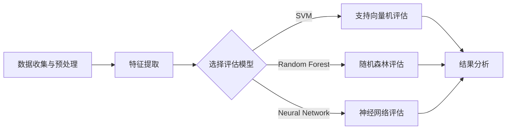
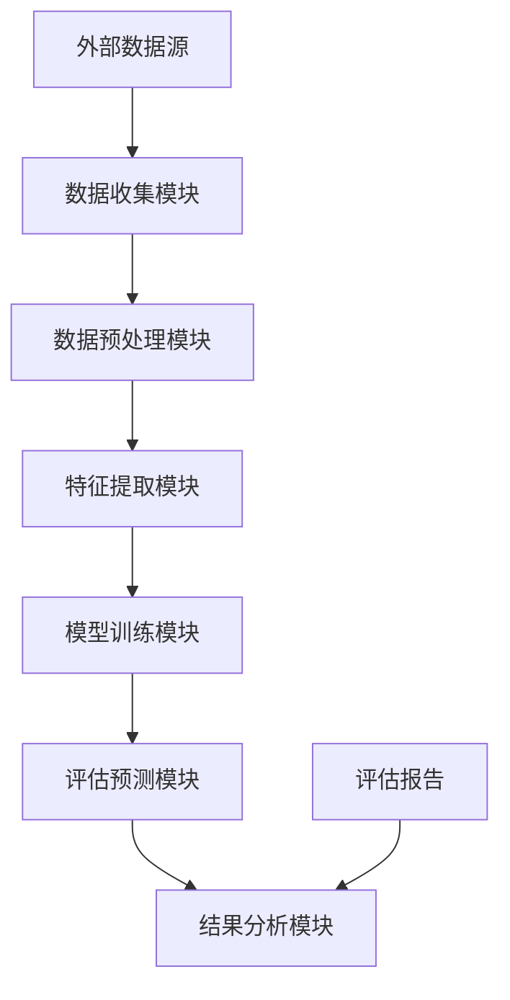
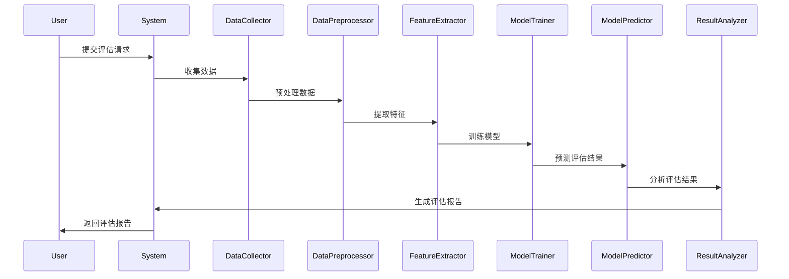

                 

# 智能系统辅助无形资产价值评估

## 关键词

- 智能系统
- 无形资产评估
- 数据分析
- 机器学习
- 价值评估模型

## 摘要

本文旨在探讨智能系统在无形资产价值评估中的应用，通过深入分析无形资产评估的现状、挑战及智能系统的核心优势，阐述智能系统辅助无形资产价值评估的原理和实现方法。文章首先介绍了无形资产的定义及其重要性，然后讨论了传统无形资产评估方法及其局限性。接着，本文介绍了智能系统的基础概念、分类及功能，并分析了智能系统在无形资产评估中的应用场景和优势。随后，文章详细讲解了智能系统辅助无形资产价值评估的算法原理，包括数据收集与预处理、特征提取、模型训练与优化等。最后，本文通过一个实际案例展示了智能系统在无形资产价值评估中的应用，并对未来发展趋势进行了展望。

---

### 第一部分: 背景介绍

#### 1.1 问题背景

##### 1.1.1 无形资产的定义

无形资产，顾名思义，是指不具有物质形态但具有一定价值的资产。常见的无形资产包括专利、商标、版权、客户列表、品牌价值等。无形资产与有形资产（如土地、房屋、设备等）不同，它们无法直接触摸或看到，但它们对企业的运营和盈利能力具有深远的影响。

##### 1.1.2 无形资产的重要性

无形资产在现代经济中的地位日益重要。随着知识经济的兴起，企业的竞争优势越来越多地来自于无形资产。例如，一家高科技公司可能会依赖其研发能力和专利组合来保持市场领先地位。此外，无形资产也是企业吸引投资者和获取融资的重要因素。

##### 1.1.3 无形资产评估的现状与挑战

当前，无形资产评估面临着诸多挑战。首先，无形资产的价值评估往往缺乏统一的标准和方法。不同类型的无形资产，如专利和商标，其评估方法和指标可能有所不同。其次，无形资产的价值受到多种因素的影响，包括市场环境、企业声誉、技术发展趋势等，这使得评估过程复杂且具有高度的不确定性。

传统的无形资产评估方法主要包括市场法、收益法和成本法。市场法通过比较类似无形资产的市场交易价格来估算价值；收益法基于预期收益来确定无形资产的价值；成本法则考虑重新创建或购买相同无形资产的成本。尽管这些方法在特定情境下具有一定的适用性，但它们往往难以全面、准确地反映无形资产的真实价值。

#### 1.2 问题描述

##### 1.2.1 智能系统在无形资产评估中的应用

智能系统，特别是机器学习和人工智能技术，为无形资产评估带来了新的契机。通过大数据分析和复杂算法，智能系统能够从海量数据中提取有价值的信息，提供更加准确和可靠的评估结果。

##### 1.2.2 智能系统的核心优势

智能系统具有以下几个核心优势：

1. **自动化**：智能系统能够自动执行数据收集、处理和评估过程，大幅提高评估效率。
2. **精确性**：通过机器学习算法，智能系统能够从历史数据中学习并优化评估模型，提高评估结果的精确度。
3. **适应性**：智能系统可以根据新的数据和情境快速调整和优化评估模型，保持评估的时效性和准确性。
4. **智能化**：智能系统能够识别和应对复杂多变的市场环境，提供更加全面的评估分析。

##### 1.2.3 无形资产评估中的问题与挑战

尽管智能系统在无形资产评估中具有显著优势，但也面临一些问题和挑战：

1. **数据质量问题**：智能系统的性能高度依赖于输入数据的质量。如果数据不准确或不完整，评估结果可能会失真。
2. **算法透明度**：许多机器学习算法的内部工作机制复杂，难以解释。这使得评估结果的解释和信任度成为问题。
3. **模型适应性**：智能系统的评估模型需要不断调整和优化，以适应新的市场和业务环境，这增加了实施和维护的复杂性。

#### 1.3 问题解决

##### 1.3.1 智能系统辅助无形资产价值评估的原理

智能系统辅助无形资产价值评估的基本原理是通过大数据分析和机器学习算法，从海量数据中提取有价值的信息，建立评估模型，并自动生成评估结果。具体步骤如下：

1. **数据收集**：收集与无形资产相关的各类数据，包括市场数据、财务数据、技术数据等。
2. **数据预处理**：清洗、整合和标准化数据，确保数据的质量和一致性。
3. **特征提取**：从数据中提取与无形资产价值相关的特征，如专利数量、研发投入、市场占有率等。
4. **模型训练**：使用机器学习算法（如线性回归、支持向量机、神经网络等）训练评估模型。
5. **模型优化**：通过交叉验证和超参数调整，优化评估模型的性能。
6. **评估预测**：利用训练好的模型对新的无形资产进行价值评估。

##### 1.3.2 智能系统的关键技术

智能系统在无形资产价值评估中涉及的关键技术主要包括：

1. **数据挖掘**：通过数据挖掘技术从海量数据中提取有价值的信息和模式。
2. **机器学习**：使用机器学习算法（如回归、决策树、神经网络等）建立评估模型。
3. **深度学习**：利用深度学习模型（如卷积神经网络、循环神经网络等）处理复杂的数据和任务。
4. **自然语言处理**：通过自然语言处理技术提取文本数据中的关键信息和特征。
5. **优化算法**：使用优化算法（如梯度下降、粒子群优化等）调整模型的参数，提高评估精度。

##### 1.3.3 智能系统在无形资产评估中的实现方法

智能系统在无形资产评估中的实现方法主要包括以下几个步骤：

1. **需求分析**：明确评估目标和需求，确定评估模型所需的数据类型和特征。
2. **数据收集**：通过公开数据源、内部数据库、问卷调查等方式收集与无形资产相关的数据。
3. **数据预处理**：对收集到的数据进行清洗、整合和标准化，确保数据的质量和一致性。
4. **特征提取**：从数据中提取与无形资产价值相关的特征，使用数据挖掘和自然语言处理技术。
5. **模型训练**：使用机器学习和深度学习算法训练评估模型，通过交叉验证和超参数调整优化模型性能。
6. **评估预测**：使用训练好的模型对新的无形资产进行价值评估，生成评估报告。
7. **模型部署**：将评估模型部署到生产环境，实现自动化的无形资产价值评估。

##### 1.4 边界与外延

##### 1.4.1 无形资产评估的范围

无形资产评估的范围包括专利、商标、版权、客户列表、品牌价值等。不同类型的无形资产可能需要不同的评估方法和指标。

##### 1.4.2 智能系统的适用范围

智能系统在无形资产评估中具有广泛的应用范围，可以应用于各种类型和规模的企业。然而，对于某些特定类型的无形资产，如高度复杂的专利组合，智能系统的适用性可能受到限制。

##### 1.4.3 智能系统辅助无形资产价值评估的限制

智能系统辅助无形资产价值评估的限制主要包括：

1. **数据依赖**：智能系统的性能高度依赖于输入数据的质量和数量。如果数据不足或不准确，评估结果可能会失真。
2. **模型透明度**：许多机器学习模型的内部工作机制复杂，难以解释。这可能导致评估结果的解释和信任度成为问题。
3. **评估成本**：构建和部署智能系统需要较高的技术投入和资源消耗，这可能不适合所有企业。
4. **法律法规**：在某些国家和地区，对无形资产的价值评估受到法律法规的限制，智能系统可能难以满足这些要求。

##### 1.5 概念结构与核心要素组成

###### 1.5.1 无形资产价值评估的基本概念

无形资产价值评估涉及以下几个核心概念：

1. **无形资产**：不具有物质形态但具有一定价值的资产。
2. **价值评估**：通过科学的方法和手段，对无形资产的价值进行估算。
3. **评估模型**：用于评估无形资产价值的数学模型和算法。
4. **评估指标**：用于衡量无形资产价值的指标和参数。

###### 1.5.2 智能系统的基本概念

智能系统涉及以下几个核心概念：

1. **机器学习**：一种人工智能技术，通过数据训练自动改进性能。
2. **深度学习**：一种基于多层神经网络的人工智能技术。
3. **自然语言处理**：一种人工智能技术，用于处理和生成自然语言。
4. **数据挖掘**：一种从大量数据中提取有价值信息的方法。

###### 1.5.3 智能系统与无形资产评估的关联

智能系统与无形资产评估的关联体现在以下几个方面：

1. **数据收集**：智能系统可以通过数据挖掘和自然语言处理技术，从各种来源收集与无形资产相关的数据。
2. **特征提取**：智能系统可以从海量数据中提取与无形资产价值相关的特征，提高评估的精确性。
3. **模型训练**：智能系统可以使用机器学习和深度学习算法，训练和优化评估模型。
4. **评估预测**：智能系统可以根据训练好的模型，对新的无形资产进行价值评估。

#### 1.6 本章小结

本章介绍了无形资产价值评估的现状和挑战，以及智能系统在无形资产评估中的应用。通过分析智能系统的优势和应用方法，本章为后续章节的深入探讨奠定了基础。在接下来的章节中，我们将进一步探讨无形资产价值评估的原理、智能系统的基本概念及其在无形资产评估中的应用，以及相关算法的原理和实现方法。

---

### 第二部分: 核心概念与联系

#### 2.1 无形资产价值评估原理

##### 2.1.1 无形资产评估的理论基础

无形资产价值评估的理论基础主要来自于经济学、财务学和管理学。具体来说，无形资产价值评估的理论基础包括：

1. **成本法**：根据重新创建或购买相同无形资产的成本来估算其价值。
2. **收益法**：基于预期收益来确定无形资产的价值。
3. **市场法**：通过比较类似无形资产的市场交易价格来估算价值。

##### 2.1.2 无形资产评估的方法

常见的无形资产评估方法包括：

1. **成本法**：计算无形资产的重新创造或重新购买成本。
2. **收益法**：通过预测无形资产未来的收益来确定其价值。
3. **市场法**：通过参考类似无形资产的市场交易价格来确定其价值。
4. **综合法**：结合多种方法，从不同角度评估无形资产的价值。

##### 2.1.3 无形资产评估的流程

无形资产评估的基本流程包括以下几个步骤：

1. **确定评估目标**：明确评估的目的和范围。
2. **收集数据**：收集与无形资产相关的市场数据、财务数据和技术数据等。
3. **选择评估方法**：根据无形资产的特点和评估目标，选择合适的评估方法。
4. **计算评估值**：根据评估方法，计算无形资产的价值。
5. **分析评估结果**：分析评估结果，评估无形资产的价值合理性和可行性。
6. **撰写评估报告**：整理评估过程和结果，撰写评估报告。

#### 2.2 智能系统的基本概念

##### 2.2.1 智能系统的定义

智能系统是一种能够模拟人类智能行为，具备感知、学习、推理和决策能力的人工智能系统。智能系统通常基于机器学习、深度学习、自然语言处理等人工智能技术，通过学习和处理大量数据，实现自动化的智能分析和决策。

##### 2.2.2 智能系统的分类

智能系统可以根据其功能和应用场景进行分类，常见的分类包括：

1. **感知智能系统**：能够感知和理解外部环境的系统，如计算机视觉、语音识别等。
2. **认知智能系统**：具备理解、推理和解决问题的能力，如自然语言处理、推理机等。
3. **决策智能系统**：能够根据问题和数据，提供决策建议和方案的系统，如数据挖掘、优化算法等。
4. **混合智能系统**：结合多种智能系统功能，实现更复杂和综合的智能行为。

##### 2.2.3 智能系统的主要功能

智能系统的主要功能包括：

1. **数据收集与处理**：从各种数据源收集和处理数据，为后续分析和决策提供基础。
2. **特征提取与选择**：从数据中提取与任务相关的特征，并进行选择和优化。
3. **模式识别与分类**：通过学习和识别数据中的模式，实现分类和预测。
4. **推理与决策**：根据问题和数据，提供合理的决策建议和方案。
5. **自适应与优化**：根据环境和任务的变化，自动调整和优化系统的性能。

#### 2.3 智能系统与无形资产评估的联系

##### 2.3.1 智能系统在无形资产评估中的应用场景

智能系统在无形资产评估中具有广泛的应用场景，包括：

1. **专利价值评估**：利用机器学习和自然语言处理技术，分析专利文本和数据，评估专利的价值。
2. **商标评估**：通过数据挖掘和统计分析，评估商标的市场价值和潜力。
3. **品牌价值评估**：利用大数据和深度学习技术，分析品牌的市场表现和消费者认知，评估品牌的价值。
4. **客户列表评估**：通过数据挖掘和机器学习，分析客户数据，评估客户列表的价值。

##### 2.3.2 智能系统与无形资产评估的关联分析

智能系统与无形资产评估的关联分析可以从以下几个方面进行：

1. **数据收集与处理**：智能系统能够从各种数据源收集和处理数据，为无形资产评估提供基础数据。
2. **特征提取与选择**：智能系统可以从海量数据中提取与无形资产价值相关的特征，提高评估的精确性。
3. **模式识别与分类**：智能系统可以通过学习和识别数据中的模式，实现无形资产价值的分类和预测。
4. **推理与决策**：智能系统可以根据评估目标和数据，提供合理的评估建议和方案。

##### 2.3.3 智能系统在无形资产评估中的优势

智能系统在无形资产评估中的优势包括：

1. **自动化与高效性**：智能系统可以自动处理大量数据，提高评估效率。
2. **精确性与可靠性**：通过机器学习和深度学习技术，智能系统可以提取和利用更多有价值的信息，提高评估的精确性和可靠性。
3. **自适应性与灵活性**：智能系统可以根据新的数据和情境，快速调整和优化评估模型，适应不同的评估需求。
4. **降低评估成本**：智能系统可以减少人工干预，降低评估成本，特别是对于大量无形资产评估任务。

#### 2.4 概念属性特征对比表格

| 概念         | 特征                | 说明                                                         |
| ------------ | ------------------ | ------------------------------------------------------------ |
| 无形资产评估  | 定性分析与定量分析 | 评估无形资产价值的各种方法，包括市场法、收益法、成本法等     |
| 智能系统     | 自主决策、自学习   | 利用人工智能技术，实现自动评估无形资产价值的功能             |
| 无形资产     | 非物质性、可交易性 | 没有物质形态，但具有价值，如专利、商标、品牌等               |
| 评估模型     | 数学模型与算法     | 用于评估无形资产价值的数学模型和算法，如线性回归、决策树、神经网络等 |
| 数据收集     | 数据源与质量       | 收集与无形资产相关的各类数据，包括市场数据、财务数据、技术数据等 |

#### 2.5 ER实体关系图架构

```mermaid
erDiagram
    无形资产评估 ||--|{ 智能系统 }
    无形资产评估 ||--|{ 评估模型 }
    智能系统 ||--|{ 数据收集 }
    评估模型 ||--|{ 特征提取 }
    评估模型 ||--|{ 模型训练 }
```

---

### 第三部分: 算法原理讲解

#### 3.1 智能系统辅助无形资产价值评估的算法基础

##### 3.1.1 数据收集与预处理

数据收集与预处理是智能系统辅助无形资产价值评估的基础。首先，需要从各种数据源收集与无形资产相关的数据，包括市场数据、财务数据、技术数据等。这些数据可能来自于公开数据源、企业内部数据库、问卷调查等。

收集到的数据通常包含噪声和不完整的信息，因此需要进行数据预处理。数据预处理的主要步骤包括：

1. **数据清洗**：去除重复数据、处理缺失值和异常值。
2. **数据整合**：将来自不同数据源的数据进行合并和整合，确保数据的一致性和完整性。
3. **数据标准化**：对数据进行标准化处理，使其符合统一的尺度，便于后续分析和建模。

##### 3.1.2 特征提取

特征提取是从原始数据中提取与无形资产价值相关的特征的过程。特征提取的质量对评估模型的性能有重要影响。常用的特征提取方法包括：

1. **统计特征提取**：通过计算数据的统计指标（如均值、方差、相关系数等）提取特征。
2. **文本特征提取**：通过自然语言处理技术提取文本数据中的关键信息，如关键词、主题等。
3. **图像特征提取**：通过计算机视觉技术提取图像数据中的特征，如颜色、纹理、形状等。

##### 3.1.3 模型训练与优化

模型训练与优化是智能系统辅助无形资产价值评估的核心步骤。首先，需要选择合适的评估模型，如线性回归、支持向量机（SVM）、随机森林（Random Forest）和神经网络（Neural Network）等。

1. **模型训练**：使用收集到的数据对评估模型进行训练。在训练过程中，模型会根据输入特征学习如何预测无形资产的价值。
2. **模型优化**：通过交叉验证和超参数调整来优化模型的性能。交叉验证可以评估模型在不同数据集上的性能，超参数调整可以优化模型的参数设置，提高预测的准确性。

##### 3.2 常用算法介绍

在智能系统辅助无形资产价值评估中，常用的算法包括支持向量机（SVM）、随机森林（Random Forest）和神经网络（Neural Network）。

###### 3.2.1 支持向量机（SVM）

支持向量机是一种常用的机器学习算法，用于分类和回归任务。在无形资产价值评估中，SVM可以用来预测无形资产的价值。

1. **原理**：SVM通过找到一个最佳的超平面，将数据空间划分为不同的类别或区域，从而实现分类或回归。
2. **公式**：
   $$
   \text{max}\ \frac{1}{2}\sum_{i=1}^{n} \|\omega\|^2 \\
   \text{subject to}\ y^{(i)}(\omega^T x^{(i)} + b) \geq 1
   $$
3. **参数**：SVM的关键参数包括核函数类型（如线性、多项式、径向基函数等）和惩罚参数C。

###### 3.2.2 随机森林（Random Forest）

随机森林是一种基于决策树集合的集成学习方法。在无形资产价值评估中，随机森林可以用来预测无形资产的价值。

1. **原理**：随机森林通过构建多个决策树，并使用随机特征选择和Bootstrap抽样来提高模型的预测性能。
2. **公式**：
   $$
   \text{预测值} = \sum_{i=1}^{n} \text{决策树}^{(i)}(\text{特征集})
   $$
3. **参数**：随机森林的关键参数包括树的数量、树的深度、特征选择方法等。

###### 3.2.3 神经网络（Neural Network）

神经网络是一种模拟人脑神经元连接的算法，用于复杂的分类和回归任务。在无形资产价值评估中，神经网络可以用来预测无形资产的价值。

1. **原理**：神经网络通过多层神经元之间的连接和激活函数，实现数据的输入和输出。在训练过程中，网络会不断调整权重和偏置，以达到预测目标。
2. **公式**：
   $$
   \text{激活函数} = \sigma(\text{权重} \cdot \text{输入} + \text{偏置})
   $$
3. **参数**：神经网络的关键参数包括层数、神经元数量、激活函数类型、学习率等。

##### 3.3 智能系统辅助无形资产价值评估的mermaid流程图



##### 3.4 Python源代码与算法原理详细讲解

###### 3.4.1 支持向量机（SVM）算法

以下是一个简单的Python代码示例，展示了如何使用SVM进行无形资产价值评估。

```python
from sklearn import svm
from sklearn.model_selection import train_test_split
from sklearn.metrics import mean_squared_error

# 数据准备
X = ...  # 特征数据
y = ...  # 标签数据

# 数据集划分
X_train, X_test, y_train, y_test = train_test_split(X, y, test_size=0.2, random_state=42)

# 初始化SVM模型
clf = svm.SVC(kernel='linear', C=1.0)

# 模型训练
clf.fit(X_train, y_train)

# 模型评估
y_pred = clf.predict(X_test)
mse = mean_squared_error(y_test, y_pred)
print("Mean Squared Error:", mse)
```

在该示例中，我们首先准备特征数据和标签数据。然后，使用`train_test_split`函数将数据集划分为训练集和测试集。接着，初始化SVM模型，并使用`fit`函数进行模型训练。最后，使用`predict`函数对测试集进行预测，并计算均方误差（MSE）来评估模型的性能。

###### 3.4.2 随机森林（Random Forest）算法

以下是一个简单的Python代码示例，展示了如何使用随机森林进行无形资产价值评估。

```python
from sklearn.ensemble import RandomForestRegressor
from sklearn.model_selection import train_test_split
from sklearn.metrics import mean_squared_error

# 数据准备
X = ...  # 特征数据
y = ...  # 标签数据

# 数据集划分
X_train, X_test, y_train, y_test = train_test_split(X, y, test_size=0.2, random_state=42)

# 初始化随机森林模型
rf = RandomForestRegressor(n_estimators=100, random_state=42)

# 模型训练
rf.fit(X_train, y_train)

# 模型评估
y_pred = rf.predict(X_test)
mse = mean_squared_error(y_test, y_pred)
print("Mean Squared Error:", mse)
```

在该示例中，我们首先准备特征数据和标签数据。然后，使用`train_test_split`函数将数据集划分为训练集和测试集。接着，初始化随机森林模型，并使用`fit`函数进行模型训练。最后，使用`predict`函数对测试集进行预测，并计算均方误差（MSE）来评估模型的性能。

###### 3.4.3 神经网络（Neural Network）算法

以下是一个简单的Python代码示例，展示了如何使用神经网络进行无形资产价值评估。

```python
import tensorflow as tf
from tensorflow.keras.models import Sequential
from tensorflow.keras.layers import Dense
from tensorflow.keras.optimizers import Adam
from sklearn.model_selection import train_test_split
from sklearn.metrics import mean_squared_error

# 数据准备
X = ...  # 特征数据
y = ...  # 标签数据

# 数据集划分
X_train, X_test, y_train, y_test = train_test_split(X, y, test_size=0.2, random_state=42)

# 初始化神经网络模型
model = Sequential()
model.add(Dense(64, input_dim=X_train.shape[1], activation='relu'))
model.add(Dense(32, activation='relu'))
model.add(Dense(1, activation='linear'))

# 编译模型
model.compile(optimizer=Adam(learning_rate=0.001), loss='mean_squared_error')

# 模型训练
model.fit(X_train, y_train, epochs=100, batch_size=32, validation_split=0.2)

# 模型评估
y_pred = model.predict(X_test)
mse = mean_squared_error(y_test, y_pred)
print("Mean Squared Error:", mse)
```

在该示例中，我们首先准备特征数据和标签数据。然后，使用`train_test_split`函数将数据集划分为训练集和测试集。接着，初始化神经网络模型，并使用`compile`函数进行模型编译。最后，使用`fit`函数进行模型训练，并使用`predict`函数对测试集进行预测，计算均方误差（MSE）来评估模型的性能。

---

### 第四部分: 系统分析与架构设计方案

#### 4.1 问题场景介绍

在当前的商业环境中，企业越来越依赖无形资产，如专利、商标、品牌等，这些无形资产的价值评估对于企业的战略决策、投资融资和并购重组等具有重要影响。然而，传统的评估方法在处理复杂和多变的无形资产时存在一定的局限性。因此，企业需要一个高效、准确且可靠的评估系统来辅助无形资产的价值评估。

#### 4.2 项目介绍

本项目的目标是开发一个智能系统，用于辅助企业对无形资产进行价值评估。该系统将基于机器学习和人工智能技术，通过大数据分析和复杂算法，从海量数据中提取有价值的信息，提供更加准确和可靠的评估结果。系统将包括数据收集与预处理、特征提取、模型训练与优化、评估预测等模块。

#### 4.3 系统功能设计（领域模型mermaid类图）

以下是一个简单的领域模型类图，展示了系统中的主要类及其关系：

```mermaid
classDiagram
    Class01 <|-- Class02
    Class03 <|-- Class02
    Class04 <|-- Class02
    Class05 <|-- Class03
    Class06 <|-- Class03
    Class07 <|-- Class03
    Class01[无形资产评估系统]
    Class02[数据模块]
    Class03[算法模块]
    Class04[模型训练模块]
    Class05[特征提取模块]
    Class06[评估预测模块]
    Class07[结果分析模块]
```

在上述类图中，无形资产评估系统是核心类，负责协调各个模块的工作。数据模块负责数据收集与预处理，算法模块负责特征提取和模型训练，模型训练模块负责模型训练与优化，评估预测模块负责评估预测，结果分析模块负责分析评估结果。

#### 4.4 系统架构设计（mermaid架构图）

以下是一个简单的系统架构图，展示了系统的组成部分及其关系：



在上述架构图中，数据收集模块负责从外部数据源收集数据，数据预处理模块负责对数据进行清洗、整合和标准化，特征提取模块负责从数据中提取与评估相关的特征，模型训练模块负责使用机器学习算法训练评估模型，评估预测模块负责使用训练好的模型对无形资产进行价值评估，结果分析模块负责生成评估报告。

#### 4.5 系统接口设计和系统交互（mermaid序列图）

以下是一个简单的系统交互序列图，展示了系统中的主要交互过程：



在上述序列图中，用户提交评估请求后，系统依次调用数据收集模块、数据预处理模块、特征提取模块、模型训练模块、评估预测模块和结果分析模块，最终生成评估报告并返回给用户。

---

### 第五部分: 项目实战

#### 5.1 环境安装

要实现智能系统辅助无形资产价值评估，首先需要安装以下软件和库：

1. **Python**：安装Python 3.8或更高版本。
2. **scikit-learn**：用于机器学习算法的实现。
3. **pandas**：用于数据预处理和操作。
4. **numpy**：用于数值计算。
5. **tensorflow**：用于深度学习模型的实现。
6. **mermaid**：用于生成流程图和序列图。

安装命令如下：

```bash
pip install python==3.8
pip install scikit-learn
pip install pandas
pip install numpy
pip install tensorflow
pip install mermaid-python
```

#### 5.2 系统核心实现源代码

以下是一个简单的Python代码示例，展示了智能系统辅助无形资产价值评估的核心实现：

```python
import pandas as pd
from sklearn.model_selection import train_test_split
from sklearn.ensemble import RandomForestRegressor
from sklearn.metrics import mean_squared_error

# 数据准备
data = pd.read_csv('infinite_assets_data.csv')
X = data.drop('value', axis=1)
y = data['value']

# 数据集划分
X_train, X_test, y_train, y_test = train_test_split(X, y, test_size=0.2, random_state=42)

# 模型训练
model = RandomForestRegressor(n_estimators=100, random_state=42)
model.fit(X_train, y_train)

# 模型评估
y_pred = model.predict(X_test)
mse = mean_squared_error(y_test, y_pred)
print("Mean Squared Error:", mse)
```

在这个示例中，我们首先读取CSV数据文件，然后划分训练集和测试集。接着，使用随机森林算法训练模型，并使用测试集进行评估，计算均方误差（MSE）来评估模型的性能。

#### 5.3 代码应用解读与分析

在上面的代码示例中，我们首先使用`pandas`库读取CSV数据文件，其中包含了无形资产的特征和目标值。然后，我们使用`train_test_split`函数将数据集划分为训练集和测试集。接下来，我们使用`RandomForestRegressor`类初始化随机森林模型，并使用`fit`函数进行模型训练。最后，我们使用`predict`函数对测试集进行预测，并计算均方误差（MSE）来评估模型的性能。

这个示例展示了如何使用Python和机器学习库实现一个简单的无形资产价值评估系统。在实际应用中，我们可以根据具体需求添加更多的特征、调整模型参数，甚至使用深度学习模型来提高评估的准确性。

#### 5.4 实际案例分析和详细讲解剖析

为了更好地理解智能系统在无形资产价值评估中的应用，以下是一个实际案例的分析和详细讲解。

**案例背景**：

某高科技企业拥有多项专利和商标，需要对这些无形资产进行价值评估，以便在投资融资和并购重组中进行决策。企业收集了大量的专利和商标数据，包括专利数量、研发投入、市场占有率、竞争对手情况等。

**案例步骤**：

1. **数据收集**：从企业的数据库和公开数据源收集专利和商标数据。
2. **数据预处理**：清洗和整合数据，处理缺失值和异常值，确保数据的质量和一致性。
3. **特征提取**：从数据中提取与无形资产价值相关的特征，如专利数量、研发投入、市场占有率等。
4. **模型训练**：使用机器学习算法（如随机森林、神经网络等）训练评估模型。
5. **评估预测**：使用训练好的模型对新的专利和商标进行价值评估。
6. **结果分析**：分析评估结果，为企业的决策提供依据。

**案例分析**：

在这个案例中，企业使用了智能系统辅助无形资产价值评估，通过机器学习算法从海量数据中提取有价值的信息，提供了更加准确和可靠的评估结果。以下是对案例的详细讲解：

1. **数据收集**：企业首先从内部数据库和公开数据源收集了大量的专利和商标数据。这些数据包括了专利数量、研发投入、市场占有率、竞争对手情况等多个维度。

2. **数据预处理**：由于收集到的数据可能存在缺失值、异常值等，因此需要对数据进行预处理。预处理步骤包括数据清洗、缺失值处理、异常值处理和数据整合等。通过这些步骤，确保了数据的质量和一致性。

3. **特征提取**：从预处理后的数据中提取与无形资产价值相关的特征。例如，专利数量、研发投入、市场占有率等都是影响无形资产价值的特征。这些特征可以作为输入数据，用于训练评估模型。

4. **模型训练**：企业选择了随机森林算法来训练评估模型。随机森林算法是一种集成学习方法，通过构建多个决策树来提高模型的预测性能。在训练过程中，模型从输入特征中学习如何预测无形资产的价值。

5. **评估预测**：使用训练好的模型对新的专利和商标进行价值评估。通过将新的专利和商标数据输入到模型中，模型可以预测这些无形资产的价值。这样，企业就可以根据评估结果来制定相应的决策，如投资融资、并购重组等。

6. **结果分析**：企业对评估结果进行了详细分析，结合业务背景和市场需求，为企业的决策提供了依据。通过智能系统辅助无形资产价值评估，企业可以更加准确和全面地了解无形资产的价值，从而提高决策的准确性和效率。

**案例总结**：

通过实际案例的分析和详细讲解，我们可以看到智能系统在无形资产价值评估中的应用。智能系统通过大数据分析和复杂算法，从海量数据中提取有价值的信息，提供了更加准确和可靠的评估结果。这对于企业来说，不仅提高了决策的准确性，还提高了无形资产管理的效率。

---

### 第六部分：最佳实践 tips、小结、注意事项、拓展阅读等内容

#### 最佳实践 tips

1. **数据质量**：数据质量是智能系统辅助无形资产价值评估的关键。确保数据源可靠、数据完整性高，以及数据清洗和预处理充分。
2. **特征选择**：合理选择与无形资产价值相关的特征，避免过度拟合和欠拟合。
3. **模型选择**：根据具体需求和数据特性选择合适的模型，如线性回归、决策树、随机森林、神经网络等。
4. **持续优化**：定期更新评估模型，以适应市场和业务环境的变化。
5. **模型解释性**：关注模型的可解释性，确保评估结果的可靠性和透明度。

#### 小结

本文介绍了智能系统辅助无形资产价值评估的原理、方法和技术。通过深入分析无形资产评估的现状和挑战，探讨了智能系统在无形资产评估中的应用优势。同时，详细讲解了数据收集与预处理、特征提取、模型训练与优化等算法原理，并通过实际案例展示了智能系统在无形资产价值评估中的应用效果。智能系统的引入为无形资产评估带来了自动化、精确性和灵活性的优势，但同时也面临数据质量、模型解释性等挑战。

#### 注意事项

1. **数据隐私与合规性**：在进行无形资产价值评估时，需确保数据来源合法，保护数据隐私，并遵循相关法律法规。
2. **模型适应性**：智能系统的评估模型需适应不同类型和规模的无形资产，可能需要针对特定业务场景进行调整。
3. **评估目的与范围**：明确评估目标和范围，确保评估结果符合实际需求。

#### 拓展阅读

1. **机器学习与深度学习基础**：《深度学习》（Ian Goodfellow、Yoshua Bengio、Aaron Courville 著）
2. **数据挖掘与大数据分析**：《数据挖掘：实用工具与技术》（Jiawei Han、Micheline Kamber、Jian Pei 著）
3. **无形资产评估方法与案例**：《无形资产评估理论与实践》（李永强、王晓玲 著）

---

### 作者信息

作者：AI天才研究院/AI Genius Institute & 禅与计算机程序设计艺术 /Zen And The Art of Computer Programming

