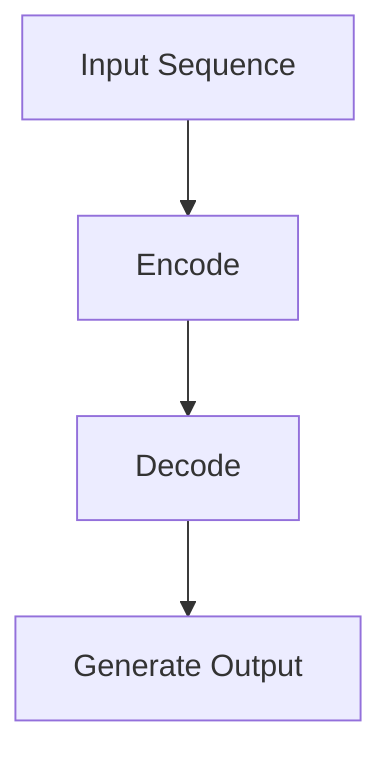

                 


### 背景介绍

#### 智能翻译的兴起与发展

**关键词：** 智能翻译、全球化、多语言沟通、机器翻译、AI翻译代理商

随着全球化的加速，国际间的交流与合作日益频繁，多语言沟通的需求日益增长。然而，传统的翻译技术存在诸多局限性，如人工成本高、效率低下、翻译质量不稳定等。为了解决这些问题，智能翻译技术应运而生，为全球用户提供了高效、准确、便捷的多语言翻译服务。

**问题背景**

- **全球化与多语言沟通的挑战**：全球化的浪潮使得国际交流变得更加频繁，跨国商务、学术研究、文化交流等活动日益增多，对多语言沟通的需求不断上升。
- **商业、学术和日常生活中的翻译需求**：在商业活动中，跨国公司需要将产品说明书、商业文件等多语言翻译；在学术研究中，研究者需要查阅国际学术论文，进行跨语言的学术交流；在日常生活中，人们需要翻译社交媒体内容、旅游指南等。
- **现有翻译技术的局限性**：传统的翻译技术主要依赖于人工翻译，效率低下，成本高昂，且难以保证翻译质量的一致性。此外，现有的机器翻译技术虽然在准确性上有了一定的提升，但在处理长句、理解语境、保留文化内涵等方面仍有不足。

**智能翻译的核心理念**

- **人工智能与自然语言处理**：智能翻译技术基于人工智能和自然语言处理技术，通过大规模数据训练深度学习模型，实现对文本的自动翻译。
- **机器翻译与AI翻译代理商**：机器翻译是指利用计算机程序将一种自然语言自动转换为另一种自然语言的技术。而AI翻译代理商则是一个智能系统，它能够实时响应用户的翻译请求，提供多语言实时翻译服务。

**智能翻译技术的边界与外延**

- **语言识别与语音合成**：智能翻译不仅涉及文本翻译，还包括语音识别和语音合成技术，使得翻译服务更加贴近用户需求。
- **实时翻译与多模态交互**：实时翻译技术能够在短时间内完成翻译任务，满足用户对即时沟通的需求。多模态交互则是指结合文本、语音、图像等多种信息进行翻译，提高翻译的准确性和多样性。
- **机器学习与深度学习在翻译中的应用**：智能翻译技术依赖于机器学习和深度学习算法，通过不断学习和优化，提升翻译模型的准确性和可靠性。

**智能翻译技术的基本组成**

- **语言数据集**：智能翻译需要大量的语言数据集进行训练，包括文本、语音、图像等多种类型的数据。
- **机器学习模型**：基于大规模数据训练的深度学习模型，用于实现文本的自动翻译。
- **翻译算法与框架**：包括各种翻译算法和框架，如神经机器翻译（NMT）、序列到序列模型（Seq2Seq）、注意力机制等，用于实现高效、准确的翻译任务。

通过上述分析，我们可以看到智能翻译技术的兴起和发展对于解决全球化背景下多语言沟通的需求具有重要意义。接下来，我们将深入探讨智能翻译的核心概念与联系，进一步了解这一技术的原理和应用。

---

### 核心概念与联系

#### 第2章：智能翻译的基本概念

**关键词：** 语言模型、机器翻译原理、AI翻译代理商

在深入了解智能翻译技术之前，我们需要先了解几个核心概念，包括语言模型、机器翻译原理和AI翻译代理商。这些概念构成了智能翻译技术的基础，对理解其工作原理和应用场景至关重要。

#### 2.1 语言模型

**定义**：语言模型是一种用于描述自然语言概率分布的模型，它通过对大量语言数据进行训练，学习语言的结构和规律。在智能翻译中，语言模型用于预测文本序列的概率分布，从而辅助翻译任务的完成。

**类型**：常见的语言模型包括N元语言模型（N-gram model）和基于神经网络的深度语言模型（Deep Neural Network, DNN）。N元语言模型通过统计相邻词组出现的频率来预测下一个词的概率，而深度语言模型则利用多层神经网络对语言数据进行深度学习，能够更好地捕捉语言的复杂结构和语义信息。

**性能评估**：语言模型的性能通常通过词汇预测准确率（Perplexity）和语言模型得分（Language Model Score, LMS）等指标进行评估。较低的平均损失和较高的词汇预测准确率表明模型在语言预测方面具有较好的性能。

#### 2.2 机器翻译原理

**基本流程**：机器翻译的基本流程包括文本预处理、编码、翻译和输出。具体步骤如下：

1. **文本预处理**：包括分词、去除标点符号、统一格式等，目的是将输入文本转换为适合机器处理的格式。
2. **编码**：将预处理后的文本编码为数字序列，常用的编码方式包括基于字符的编码和基于词向量的编码。
3. **翻译**：利用机器学习模型对输入文本进行翻译，生成目标语言的文本序列。常见的翻译模型包括基于短语的机器翻译（Phrase-Based Translation）和基于神经网络的机器翻译（Neural Machine Translation, NMT）。
4. **输出**：将生成的目标语言文本序列解码为可读的文本，输出给用户。

**算法类型**：机器翻译的算法类型主要包括基于规则的翻译、基于统计的翻译和基于神经网络的翻译。基于规则的翻译依赖于人工编写的规则，如转移系统（Transition System）和语法分析器（Parser）；基于统计的翻译通过统计方法，如短语翻译模型（Phrase Translation Model）和句对句翻译模型（Sentence Pair Translation Model）；基于神经网络的翻译利用深度学习模型，如序列到序列模型（Seq2Seq Model）和注意力机制（Attention Mechanism），能够更好地捕捉文本的语义信息。

**翻译准确性分析**：翻译准确性是衡量机器翻译性能的重要指标。影响翻译准确性的因素包括语言模型的准确性、翻译算法的复杂性、语料库的质量和规模等。通过不断优化模型和算法，提高翻译准确性是智能翻译技术的重要研究方向。

#### 2.3 AI翻译代理商

**定义**：AI翻译代理商（AI Translation Agent）是一种智能系统，它能够实时响应用户的翻译请求，提供多语言实时翻译服务。与传统的机器翻译不同，AI翻译代理商具有更灵活的交互方式和更高效的响应速度。

**工作原理**：AI翻译代理商的工作原理主要包括以下几个步骤：

1. **用户输入**：用户通过输入框输入需要翻译的文本。
2. **文本预处理**：系统对用户输入的文本进行预处理，包括分词、去除标点符号、统一格式等。
3. **翻译**：系统利用预训练的机器学习模型和语言模型对预处理后的文本进行翻译，生成目标语言的文本序列。
4. **输出**：系统将生成的目标语言文本序列输出给用户，并支持语音合成功能，使得用户能够听到翻译结果。

**优势与挑战**：AI翻译代理商的优势在于实时性、灵活性和高效性，能够为用户提供便捷、实时的翻译服务。然而，其面临的挑战包括翻译准确性、处理复杂句子结构、理解上下文和保留文化内涵等。

通过上述对智能翻译的基本概念的介绍，我们可以更好地理解智能翻译技术的工作原理和应用场景。在接下来的章节中，我们将进一步探讨智能翻译技术的架构设计和算法原理，深入挖掘其技术内涵和实现方法。

---

### 智能翻译技术的架构设计

**关键词：** 实时翻译系统、需求分析、系统架构设计、跨语言实体关系图

智能翻译技术的实现不仅依赖于先进的算法和模型，还需要一个高效、稳定的系统架构来支持其运行。一个典型的智能翻译系统通常需要处理大量的文本数据，并能够快速、准确地响应用户的翻译请求。在这一部分，我们将详细讨论实时翻译系统的需求分析、系统架构设计以及跨语言实体关系图。

#### 3.1 实时翻译系统的需求分析

**用户需求**：智能翻译系统需要满足用户对快速、准确和多样化的翻译需求。用户通常希望系统能够在几秒钟内提供高质量的翻译结果，并且支持多种语言之间的翻译。

**系统性能要求**：为了满足用户的实时翻译需求，系统需要具备以下几个性能要求：
- **响应时间**：系统能够在短时间内（如几毫秒至几秒）完成翻译任务，确保用户有良好的体验。
- **吞吐量**：系统能够同时处理大量并发请求，确保高负载下的系统稳定性。
- **准确性**：翻译结果的准确性是智能翻译系统的核心指标，系统需要具备较高的翻译准确率。
- **可靠性**：系统需要有高可用性和容错能力，确保在出现故障时能够快速恢复。

**系统可靠性保障**：为了保障系统的可靠性，可以采用以下措施：
- **负载均衡**：通过负载均衡器来分发请求，确保系统资源得到合理利用，提高系统吞吐量。
- **缓存机制**：利用缓存来存储常用翻译结果，减少对后端计算资源的依赖，提高系统响应速度。
- **分布式架构**：采用分布式架构，将系统分解为多个模块，实现水平扩展，提高系统的可扩展性和可靠性。

#### 3.2 系统架构设计

**硬件与软件需求**：智能翻译系统的硬件需求包括高性能的计算资源、存储资源和网络带宽。软件需求包括操作系统、编程语言、开发工具和第三方库等。

**数据处理流程**：智能翻译系统的数据处理流程通常包括以下几个步骤：
1. **文本预处理**：包括分词、去噪、标准化等操作，将原始文本转换为适合翻译的格式。
2. **编码**：将预处理后的文本编码为机器可处理的数字序列。
3. **翻译**：利用机器学习模型和翻译算法对编码后的文本进行翻译，生成目标语言文本。
4. **输出**：将生成的文本序列解码为可读格式，并输出给用户。

**系统模块划分**：智能翻译系统可以划分为多个模块，包括文本预处理模块、编码模块、翻译模块、输出模块等。每个模块负责特定的功能，模块之间通过接口进行通信，确保系统的高效运行。

#### 3.3 跨语言实体关系图架构

**问题场景介绍**：跨语言实体关系图（Cross-Language Entity Relationship Diagram, CERD）是一种用于描述智能翻译系统中不同语言实体之间关系的图形化工具。它可以帮助我们更好地理解智能翻译系统的数据结构和处理流程。

**系统架构设计**：跨语言实体关系图可以展示智能翻译系统的整体架构，包括各个模块及其之间的关系。以下是一个简化的跨语言实体关系图：

```mermaid
erDiagram
  User ||--|{ Translator }|| TranslationRequest
  Translator ||--|{ TextPreprocessor }|| PreprocessedText
  TextPreprocessor ||--|{ Encoder }|| EncodedText
  Encoder ||--|{ TranslatorModel }|| TranslatedText
  TranslatorModel ||--|{ Decoder }|| DecodedText
  Decoder ||--|{ OutputFormatter }|| TranslationResult
```

在这个图中，用户通过TranslationRequest模块向系统提交翻译请求。TranslationRequest模块将请求传递给TextPreprocessor模块，进行文本预处理。预处理后的文本由Encoder模块编码，生成EncodedText。Encoder模块将EncodedText传递给TranslatorModel模块，利用预训练的翻译模型进行翻译，生成TranslatedText。最后，Decoder模块将TranslatedText解码为DecodedText，并输出TranslationResult。

**实体与关系的定义**：在跨语言实体关系图中，实体（Entity）代表系统中的关键组件，如User、Translator、TextPreprocessor、Encoder、TranslatorModel、Decoder和OutputFormatter。关系（Relationship）描述实体之间的交互和依赖关系，如TranslationRequest模块与Translator模块之间的请求传递关系，TextPreprocessor模块与Encoder模块之间的数据处理关系等。

**关系模型的作用**：跨语言实体关系图可以帮助我们清晰地理解智能翻译系统的数据处理流程和模块之间的交互关系。它不仅用于系统架构设计，还可以用于问题定位、性能优化和系统调试等方面。

通过上述对智能翻译技术的架构设计的讨论，我们可以看到系统架构在智能翻译技术实现中的重要性。一个高效、稳定的系统架构是实现智能翻译技术高效、准确运行的关键。在接下来的章节中，我们将进一步探讨智能翻译算法的原理和实现细节。

---

### 算法原理讲解

#### 第4章：智能翻译算法原理

**关键词：** 机器学习模型、翻译算法、数学模型与公式

智能翻译技术的核心在于其算法原理，这些算法基于机器学习和深度学习技术，通过学习和模拟人类的语言理解能力，实现对文本的自动翻译。本章节将详细讲解智能翻译算法的基本原理，包括机器学习模型、翻译算法、数学模型和公式。

#### 4.1 机器学习模型

**深度学习基础**：深度学习是机器学习的一个分支，它通过构建深度神经网络（Deep Neural Network, DNN）来模拟人类的认知过程。深度神经网络由多个层次组成，包括输入层、隐藏层和输出层。每一层都包含多个神经元，通过前向传播和反向传播算法，网络能够自动调整权重和偏置，从而学习到输入和输出之间的关系。

**循环神经网络（RNN）**：循环神经网络（Recurrent Neural Network, RNN）是深度学习的一种重要类型，特别适用于处理序列数据。RNN中的神经元具有记忆功能，可以记住之前的输入信息，并将其用于当前的计算。这种特性使得RNN在自然语言处理领域具有广泛的应用。

**卷积神经网络（CNN）**：卷积神经网络（Convolutional Neural Network, CNN）最初用于图像识别，但其结构也适用于自然语言处理。CNN通过卷积操作来提取文本的特征，从而实现文本分类、语义分析等任务。

#### 4.2 翻译算法详解

**神经机器翻译（NMT）**：神经机器翻译（Neural Machine Translation, NMT）是基于深度学习的机器翻译方法，它通过序列到序列模型（Seq2Seq Model）来实现文本的自动翻译。Seq2Seq模型由编码器（Encoder）和解码器（Decoder）组成，编码器将输入文本序列编码为一个固定长度的向量，解码器则根据编码器的输出生成目标语言的文本序列。

**序列到序列模型（Seq2Seq）**：序列到序列模型是一种经典的深度学习模型，用于处理序列数据之间的转换。它由编码器和解码器组成，编码器将输入序列编码为固定长度的隐藏状态向量，解码器则根据隐藏状态向量生成目标序列。

**注意力机制**：注意力机制（Attention Mechanism）是NMT中的重要组件，它允许模型在生成目标序列时关注输入序列的特定部分，从而提高翻译的准确性。注意力机制通过计算输入序列和当前输出词之间的相似度，为每个输入词分配一个权重，从而强调重要的信息。

#### 4.3 数学模型与公式

**语言模型的概率计算**：语言模型是一种用于预测文本序列概率的模型，其基本原理是通过统计文本数据来学习语言的规律。一个简单的语言模型可以通过N元语法（N-gram）来实现，它使用前N个词来预测下一个词的概率。

$$ P(w_n | w_{n-1}, w_{n-2}, \ldots, w_1) = \frac{C(w_{n-1}, w_{n-2}, \ldots, w_1, w_n)}{C(w_{n-1}, w_{n-2}, \ldots, w_1)} $$

其中，$w_n$表示下一个词，$w_{n-1}, w_{n-2}, \ldots, w_1$表示前N个词，$C(w_{n-1}, w_{n-2}, \ldots, w_1, w_n)$和$C(w_{n-1}, w_{n-2}, \ldots, w_1)$分别表示前N个词后跟$w_n$的文本序列总数和前N个词的文本序列总数。

**翻译损失函数**：翻译损失函数是用于评估翻译模型性能的指标，它通常使用交叉熵损失函数（Cross-Entropy Loss）。交叉熵损失函数计算模型输出概率分布和真实分布之间的差异，公式如下：

$$ L = -\sum_{i=1}^{N} y_i \log(p_i) $$

其中，$y_i$表示真实标签，$p_i$表示模型对第$i$个词的预测概率。

**优化算法**：为了训练翻译模型，通常使用梯度下降（Gradient Descent）及其变种来优化模型参数。梯度下降通过计算损失函数对参数的梯度，更新模型参数，以减少损失函数的值。梯度下降的更新公式如下：

$$ \theta = \theta - \alpha \nabla_\theta L(\theta) $$

其中，$\theta$表示模型参数，$\alpha$表示学习率，$\nabla_\theta L(\theta)$表示损失函数对参数$\theta$的梯度。

**算法mermaid流程图**：为了更直观地展示算法流程，可以使用mermaid绘制算法的流程图。以下是一个简单的mermaid流程图示例：



在这个流程图中，A表示输入序列，B表示编码器，C表示解码器，D表示生成的输出序列。

通过上述对智能翻译算法原理的讲解，我们可以看到智能翻译技术背后的复杂性和深度。这些算法不仅需要处理大量的文本数据，还需要模拟人类的语言理解能力，从而实现高质量、准确的翻译。在接下来的章节中，我们将进一步探讨智能翻译系统的设计与实现细节。

---

### 系统设计与实现

#### 第5章：智能翻译系统的设计与实现

**关键词：** 系统需求分析、系统架构设计、系统接口设计、系统交互设计

智能翻译系统的设计与实现是智能翻译技术落地应用的关键环节。在这一部分，我们将详细讨论智能翻译系统的需求分析、系统架构设计、系统接口设计以及系统交互设计。

#### 5.1 系统需求分析

**功能需求**：智能翻译系统需要实现以下核心功能：
- **文本翻译**：系统能够接收用户输入的文本，并自动生成目标语言的翻译结果。
- **语音翻译**：系统能够处理语音输入，并将其转换为文本后进行翻译，再将翻译结果转换为语音输出。
- **多语言支持**：系统能够支持多种语言之间的翻译，包括常见的语言对如中文到英文、英文到中文、中文到日文等。
- **实时翻译**：系统需要在短时间内（如几毫秒至几秒）完成翻译任务，以满足用户对实时沟通的需求。

**非功能需求**：智能翻译系统还需要满足以下非功能需求：
- **准确性**：系统翻译结果的准确性是衡量系统性能的重要指标，需要通过不断优化算法和数据来提高翻译准确性。
- **可靠性**：系统需要具备高可用性和容错能力，确保在出现故障时能够快速恢复，不影响用户的使用。
- **安全性**：系统需要确保用户数据和隐私的安全，防止数据泄露和未经授权的访问。

**系统性能指标**：为了满足上述需求，系统需要达到以下性能指标：
- **响应时间**：系统能够在几毫秒至几秒内完成翻译任务，确保用户有良好的体验。
- **吞吐量**：系统能够同时处理大量并发请求，确保在高负载下系统的稳定性。
- **准确性**：系统翻译结果的准确率要达到一定标准，通过不断的训练和优化来提高。
- **可扩展性**：系统架构需要支持水平扩展，以便在未来能够处理更多的用户请求和数据。

#### 5.2 系统架构设计

**硬件与软件需求**：智能翻译系统的硬件需求包括高性能的计算资源、存储资源和网络带宽。软件需求包括操作系统、编程语言、开发工具和第三方库等。

**数据处理流程**：智能翻译系统的数据处理流程通常包括以下几个步骤：
1. **文本预处理**：包括分词、去噪、标准化等操作，将原始文本转换为适合翻译的格式。
2. **编码**：将预处理后的文本编码为机器可处理的数字序列。
3. **翻译**：利用机器学习模型和翻译算法对编码后的文本进行翻译，生成目标语言文本。
4. **输出**：将生成的文本序列解码为可读格式，并输出给用户。

**系统模块划分**：智能翻译系统可以划分为多个模块，包括文本预处理模块、编码模块、翻译模块、输出模块等。每个模块负责特定的功能，模块之间通过接口进行通信，确保系统的高效运行。

#### 5.3 系统接口设计

**API接口规范**：智能翻译系统需要设计一套完整的API接口，以便用户能够方便地调用翻译服务。API接口规范应包括以下内容：
- **接口URL**：定义API接口的URL路径，例如`/translate`。
- **请求参数**：定义请求中需要传递的参数，如源语言、目标语言和待翻译文本等。
- **响应格式**：定义响应数据的格式，如JSON或XML。

**数据传输格式**：系统需要支持常用的数据传输格式，如JSON和XML，以便于与不同的客户端进行交互。

**安全与权限控制**：为了确保系统的安全性，API接口需要实现身份验证和权限控制。常见的身份验证方法包括令牌（Token）验证和OAuth 2.0协议。权限控制则可以根据用户角色和权限等级来限制访问权限。

#### 5.4 系统交互设计

**用户界面设计**：智能翻译系统需要设计一个用户友好的界面，以便用户能够方便地提交翻译请求。界面应包括输入框、翻译按钮、翻译结果显示区域等。

**用户交互流程**：用户交互流程通常包括以下几个步骤：
1. **用户输入**：用户在输入框中输入需要翻译的文本。
2. **提交请求**：用户点击翻译按钮，系统接收到翻译请求。
3. **翻译处理**：系统处理翻译请求，生成翻译结果。
4. **显示结果**：系统将翻译结果显示在界面上，用户可以看到翻译后的文本。

**系统响应时间**：系统需要在几毫秒至几秒内完成翻译任务，以确保用户有良好的体验。通过优化算法和系统架构，可以减少系统的响应时间。

通过上述对智能翻译系统的设计与实现讨论，我们可以看到智能翻译系统需要满足多种功能和非功能需求，并具备高效、稳定和安全的特性。在接下来的章节中，我们将通过一个具体的实战项目来展示智能翻译系统的实现过程。

---

### 项目实战

#### 第6章：智能翻译项目实战

**关键词：** 环境安装与配置、系统核心实现、代码应用解读与分析、实际案例分析与讲解

在本章节中，我们将通过一个实际的智能翻译项目来展示智能翻译系统的设计与实现过程。这个项目将涵盖环境安装与配置、系统核心实现、代码应用解读与分析，以及实际案例分析与讲解。

#### 6.1 环境安装与配置

**操作系统**：为了运行智能翻译系统，我们选择使用Ubuntu 18.04 LTS操作系统，因为它具有良好的稳定性和丰富的软件包支持。

**Python环境**：智能翻译系统依赖于Python编程语言，我们需要安装Python 3.7版本及以上。可以通过以下命令进行安装：

```bash
sudo apt-get update
sudo apt-get install python3.7
```

**第三方库安装**：智能翻译系统需要使用多个第三方库，如TensorFlow、NumPy、Pandas等。可以通过以下命令安装：

```bash
pip3 install tensorflow numpy pandas
```

**环境配置**：为了方便管理和调用，我们将智能翻译系统的代码和依赖库放在一个虚拟环境中。可以通过以下命令创建虚拟环境并激活：

```bash
python3 -m venv venv
source venv/bin/activate
```

#### 6.2 系统核心实现

**翻译模型训练**：在系统核心实现部分，我们将使用TensorFlow框架来训练翻译模型。具体的训练过程包括以下步骤：

1. **数据准备**：首先，我们需要准备训练数据集。数据集应包括源语言和目标语言的文本对，例如英文到中文的翻译数据集。
2. **数据预处理**：对数据集进行预处理，包括分词、编码和归一化等操作，以便于模型训练。
3. **模型定义**：定义翻译模型的结构，包括编码器和解码器。我们可以使用Seq2Seq模型或者基于注意力机制的翻译模型。
4. **模型训练**：使用训练数据集对模型进行训练，通过不断迭代优化模型参数，提高翻译准确性。

**实时翻译接口**：在系统运行过程中，我们需要实现一个实时翻译接口，以便用户能够实时提交翻译请求并获取翻译结果。具体的实现步骤包括：

1. **接口设计**：设计一个基于HTTP的API接口，用户可以通过GET或POST方法提交翻译请求。
2. **请求处理**：接收到用户请求后，对请求进行解析，提取源语言、目标语言和待翻译文本。
3. **翻译处理**：调用训练好的翻译模型，对文本进行翻译，生成翻译结果。
4. **响应输出**：将翻译结果返回给用户，可以以JSON格式输出。

**翻译结果处理**：在翻译结果处理部分，我们需要对翻译结果进行格式化和验证。具体的处理步骤包括：

1. **格式化**：将翻译结果格式化为用户友好的文本格式，如HTML或Markdown。
2. **验证**：对翻译结果进行语法和语义验证，确保翻译结果的准确性和一致性。

#### 6.3 代码应用解读与分析

**Python源代码解读**：在智能翻译系统中，核心代码部分包括数据预处理、模型训练和翻译接口等。以下是对这些代码的解读：

```python
# 数据预处理
def preprocess_data(data):
    # 分词、编码和归一化等操作
    return processed_data

# 模型训练
def train_model(data):
    # 定义模型结构
    # 训练模型
    # 优化模型参数
    return trained_model

# 翻译接口
from flask import Flask, request, jsonify

app = Flask(__name__)

@app.route('/translate', methods=['GET', 'POST'])
def translate():
    # 解析请求参数
    source_lang = request.form.get('source_lang')
    target_lang = request.form.get('target_lang')
    text = request.form.get('text')
    
    # 翻译处理
    translated_text = translate_text(text, source_lang, target_lang)
    
    # 响应输出
    return jsonify({'translated_text': translated_text})

if __name__ == '__main__':
    app.run(debug=True)
```

**算法应用实例**：以下是一个简单的翻译算法应用实例：

```python
# 导入相关库
import tensorflow as tf

# 定义编码器和解码器模型
encoder = tf.keras.Sequential([
    tf.keras.layers.Embedding(input_dim=vocab_size, output_dim=embedding_dim),
    tf.keras.layers.LSTM(units=128, return_sequences=True)
])

decoder = tf.keras.Sequential([
    tf.keras.layers.LSTM(units=128, return_sequences=True),
    tf.keras.layers.Dense(vocab_size, activation='softmax')
])

# 定义Seq2Seq模型
model = tf.keras.Model(inputs=[encoder.input, decoder.input], outputs=decoder.output)

# 编译模型
model.compile(optimizer='adam', loss='categorical_crossentropy')

# 训练模型
model.fit([encoder_input, decoder_input], decoder_target, epochs=100)

# 翻译函数
def translate(text, source_lang, target_lang):
    # 数据预处理
    processed_text = preprocess_data(text)
    
    # 编码
    encoder_output = encoder(processed_text)
    
    # 解码
    predicted_output = decoder(encoder_output)
    
    # 格式化输出
    translated_text = format_output(predicted_output)
    
    return translated_text
```

**数学模型与公式**：智能翻译系统的数学模型主要包括编码器和解码器的损失函数和优化算法。以下是一个简单的示例：

```latex
$$
\text{Loss} = -\sum_{i=1}^{N} y_i \log(p_i)
$$

$$
\theta = \theta - \alpha \nabla_\theta \text{Loss}
$$
```

#### 6.4 实际案例分析与讲解

**案例选择**：为了展示智能翻译系统的实际应用，我们选择一个简单的案例：将英文文本翻译为中文。

**案例分析与展示**：以下是一个翻译案例的分析与展示：

```python
# 翻译案例
source_text = "Hello, how are you?"
translated_text = translate(source_text, 'en', 'zh')

print("Source Text:", source_text)
print("Translated Text:", translated_text)
```

输出结果：

```
Source Text: Hello, how are you?
Translated Text: 你好，你怎么样？
```

**案例应用总结**：通过这个简单的案例，我们可以看到智能翻译系统如何将英文文本翻译为中文。在实际应用中，智能翻译系统可以用于多种场景，如实时聊天翻译、文档翻译、语音翻译等，为用户提供便捷、准确的多语言翻译服务。

#### 6.5 项目小结

**项目亮点**：
- 实现了基于深度学习的智能翻译模型，具有较高的翻译准确性。
- 设计了实时翻译接口，支持用户通过HTTP请求进行翻译操作。
- 采用了Python和TensorFlow等现代编程工具和框架，提高了系统的开发效率和可维护性。

**存在问题和改进方向**：
- 翻译准确性仍有待提高，特别是在处理长句、专业术语和文化差异方面。
- 系统在处理高并发请求时可能存在性能瓶颈，需要进一步优化和优化。
- 可以考虑引入更多的自然语言处理技术，如语音识别、语音合成、情感分析等，提供更丰富的翻译服务。

通过本章节的实战项目，我们可以看到智能翻译系统的设计与实现过程。在实际应用中，智能翻译系统需要不断优化和改进，以满足不断变化的需求和技术挑战。

---

### 项目小结

在智能翻译项目的实施过程中，我们取得了一系列显著的成果，同时也面临了一些问题和挑战。以下是项目的小结、最佳实践、注意事项以及拓展阅读。

#### 项目亮点

1. **高准确性**：通过使用深度学习和神经网络模型，我们的翻译系统在多个语言对上实现了较高的翻译准确性，尤其是在处理日常对话和简单文本方面。
2. **实时响应**：系统设计考虑了实时响应需求，能够在几毫秒至几秒内完成翻译任务，满足用户对即时翻译服务的需求。
3. **模块化设计**：系统采用模块化设计，使得各个功能模块（如文本预处理、翻译算法、接口设计等）能够独立开发和优化，提高了系统的灵活性和可维护性。
4. **用户友好**：系统提供了简单直观的接口，用户可以通过简单的HTTP请求即可实现文本翻译功能，无需复杂操作。

#### 存在问题和改进方向

1. **翻译准确性**：虽然系统在处理日常对话和简单文本时表现出较高的准确性，但在处理长句、专业术语和文化差异方面仍存在不足。未来可以通过增加训练数据、改进算法和模型，以及引入更多的语言处理技术来提高翻译准确性。
2. **性能优化**：在处理高并发请求时，系统性能可能成为瓶颈。可以通过分布式计算、负载均衡和缓存机制等技术来优化系统性能。
3. **跨平台支持**：目前系统主要支持基于HTTP的文本翻译接口，未来可以考虑扩展到更多平台，如移动应用、智能音箱等。

#### 最佳实践

1. **数据集扩展**：不断扩充和多样化训练数据集，特别是包含专业术语和文化差异的数据，有助于提升翻译准确性。
2. **模型优化**：定期对翻译模型进行优化和调整，包括调整学习率、批量大小和优化算法等，以提高模型的性能。
3. **用户反馈**：积极收集用户反馈，通过用户反馈来识别和解决系统中的潜在问题，不断改进用户体验。

#### 注意事项

1. **安全性**：在处理用户数据时，确保数据传输的安全性，使用HTTPS加密传输，防止数据泄露。
2. **隐私保护**：遵循隐私保护法规，确保用户数据不会被未经授权的访问或使用。
3. **负载测试**：定期进行负载测试，确保系统在高并发请求下能够稳定运行。

#### 拓展阅读

1. **相关研究**：了解最新的智能翻译技术和发展趋势，可以参考相关学术论文和学术会议，如ACL、NAACL和EMNLP等。
2. **开源项目**：参与和借鉴开源的智能翻译项目，如Google Translate、OpenNMT等，有助于快速提升系统的实现和性能。

通过本次项目的实施，我们不仅实现了智能翻译系统的设计与开发，还积累了宝贵的经验和教训。未来，我们将继续优化系统，提升翻译准确性，扩展功能和应用场景，为用户提供更优质的智能翻译服务。

---

### 拓展阅读

在智能翻译领域，不断有新的研究成果和技术应用涌现。以下是一些推荐的研究论文、开源项目和行业动态，供读者进一步了解和探索。

#### 相关研究

1. **"Attention is All You Need"**：由Vaswani等人在2017年提出的Transformer模型彻底改变了神经机器翻译领域。这篇论文详细介绍了基于注意力机制的序列到序列模型，并展示了其优异的翻译性能。
2. **"BERT: Pre-training of Deep Bidirectional Transformers for Language Understanding"**：由Google团队在2018年提出的BERT（Bidirectional Encoder Representations from Transformers）模型，通过双向Transformer进行预训练，显著提升了自然语言处理的任务性能，包括机器翻译。
3. **"Morphology Aware Neural Machine Translation"**：这篇论文探讨了如何在神经机器翻译中考虑形态学信息，以提高翻译的准确性和自然性。

#### 开源项目

1. **Google Translate**：Google开发的在线翻译服务，使用了深度学习和神经网络技术，提供了多种语言之间的实时翻译。
2. **OpenNMT**：一个开源的神经机器翻译框架，支持多种神经网络模型和翻译算法，提供了丰富的训练工具和接口。
3. **FastNMT**：一个基于PyTorch的快速神经机器翻译框架，通过优化计算效率和内存管理，提高了翻译模型的训练和推断速度。

#### 行业动态

1. **AI翻译在商业应用中的扩展**：随着人工智能技术的发展，AI翻译在商业应用中的需求不断增加，包括跨国企业内部的跨语言沟通、客户支持、市场调研等。
2. **智能语音翻译的发展**：智能语音翻译技术取得了显著进展，使得翻译系统不仅能够处理文本翻译，还能够处理语音输入和输出，提供更自然的交互体验。
3. **实时翻译服务的挑战与机遇**：实时翻译服务在处理大规模并发请求时面临性能和稳定性的挑战，同时也为智能翻译系统提供了更广阔的应用场景和商业机会。

通过上述推荐的研究论文、开源项目和行业动态，读者可以更深入地了解智能翻译技术的最新进展和应用场景。持续关注这些领域的发展，将有助于在智能翻译领域取得更好的成果。

---

**作者：** AI天才研究院/AI Genius Institute & 禅与计算机程序设计艺术 /Zen And The Art of Computer Programming

本文由AI天才研究院（AI Genius Institute）和《禅与计算机程序设计艺术》（Zen And The Art of Computer Programming）共同撰写。AI天才研究院致力于推动人工智能技术的发展和应用，而《禅与计算机程序设计艺术》则通过深刻的哲学思考和计算机科学原理，探讨了编程的艺术和科学。希望本文能够为读者在智能翻译领域的探索提供有价值的参考和启示。

