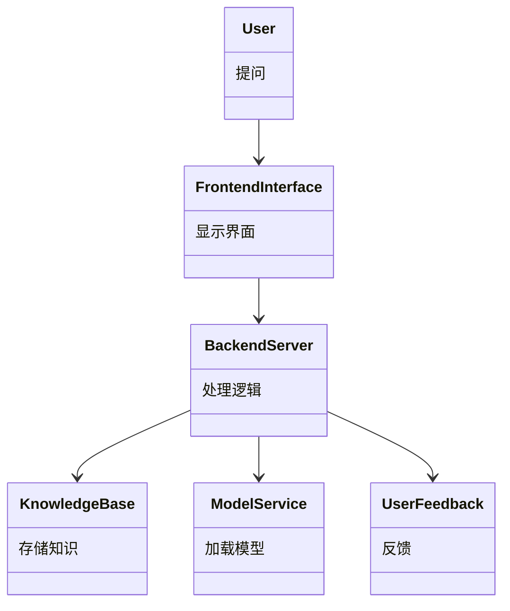
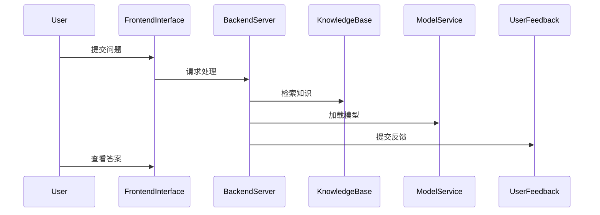
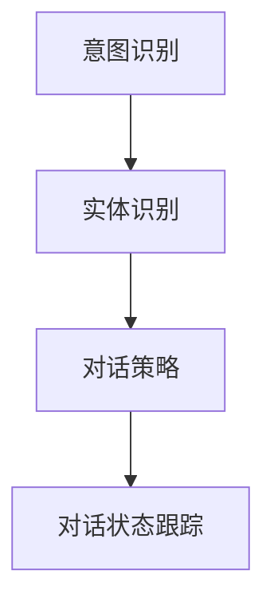
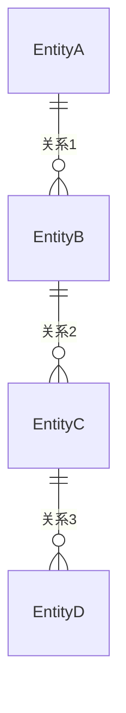
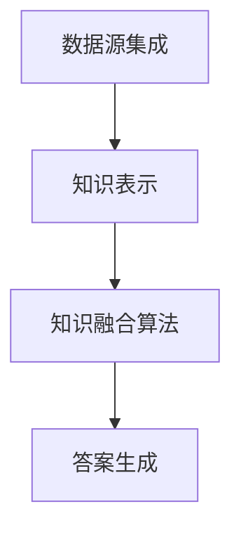

                 


### 摘要

本文深入探讨了智能问答AI Agent：基于LLM（大型语言模型）的精准答疑系统。首先，我们将介绍智能问答系统的基本概念、发展历史及其在当今社会中的重要地位。随后，我们将聚焦于LLM技术，详细解析其原理、数学模型及其在智能问答系统中的应用。接着，我们将设计并实现一个基于LLM的智能问答系统，涵盖系统架构、模块划分、接口设计等关键环节。通过实际案例的分析，我们将展示该系统的应用场景和实现细节，并对系统的性能进行优化与评估。最后，我们将展望智能问答系统的未来发展趋势，探讨其潜在问题和挑战。本文旨在为广大IT专业人士提供一份全面、深入的智能问答系统指南。

## 前言

### 引言

在人工智能飞速发展的今天，智能问答AI Agent已经成为各类场景下的重要应用。无论是企业的客户服务，还是教育领域的在线问答，智能问答系统以其高效、准确的特点，赢得了广大用户的青睐。本文将围绕基于LLM（大型语言模型）的精准答疑系统，系统性地介绍其原理、设计、实现以及应用。

本篇文章将分为以下几个部分：

1. **背景与基础理论**：介绍智能问答系统的发展历史、关键技术和LLM的基本概念。
2. **LLM技术详解**：深入探讨LLM的原理、数学模型及其在智能问答系统中的应用。
3. **系统设计与实现**：详细讲解智能问答系统的整体架构设计、模块划分与接口设计。
4. **实战案例**：通过具体案例展示智能问答系统的应用场景和实现细节。
5. **性能优化与评估**：探讨智能问答系统的性能优化方法和评估指标。
6. **未来展望**：预测智能问答系统的未来发展趋势和潜在问题。

读者对象主要是对智能问答系统感兴趣的IT专业人士，以及对人工智能技术有深入了解的技术爱好者。希望本文能帮助读者全面了解智能问答AI Agent：基于LLM的精准答疑系统，为实际项目开发提供有益的参考。

### 第一部分：背景与基础理论

#### 第1章：智能问答系统概述

##### 1.1 问题的提出与背景

在信息化社会，人们对于信息的需求日益增长，但同时也面临着信息过载的问题。如何在海量信息中快速、准确地获取所需答案，成为了一个亟待解决的问题。智能问答系统正是为了解决这一问题而诞生的。

智能问答系统是一种基于人工智能技术，能够自动理解用户提出的问题，并给出精准、有用的答案的系统。它广泛应用于各个领域，如客户服务、医疗咨询、在线教育等。

##### 1.2 智能问答系统的定义与分类

智能问答系统（Intelligent Question Answering System，IQAS）是指能够通过自然语言处理（NLP）和机器学习等技术，实现对用户提出的问题进行理解、分析和回答的计算机系统。

根据工作原理和实现方式，智能问答系统可以分为以下几类：

1. **基于规则的方法**：通过预先定义一系列规则，根据用户输入的问题匹配相应的规则，给出答案。
2. **基于知识库的方法**：将问题映射到知识库中的相关条目，从知识库中提取答案。
3. **基于机器学习的方法**：利用机器学习算法，从大量语料库中学习，自动生成答案。
4. **基于混合的方法**：结合上述方法，综合各种技术的优势，提高问答系统的准确性和效率。

##### 1.3 智能问答系统的发展历史

智能问答系统的发展可以追溯到20世纪50年代。当时，随着计算机技术的发展，人们开始尝试通过计算机程序来回答问题。以下是一些重要的里程碑：

1. **1968年**：斯坦福大学的ELIZA程序问世，它通过模拟医生与病人的对话，实现了简单的问答功能。
2. **1982年**：IBM的“沃森”超级计算机在电视节目《危险边缘》中击败人类选手，引发了全球对人工智能的关注。
3. **2001年**：Siri作为苹果公司的语音助手首次亮相，标志着智能问答系统在移动设备上的应用。
4. **2011年**：微软的“小冰”问世，成为中国第一个具有人类情感的人工智能程序。
5. **近年来**：随着深度学习和自然语言处理技术的发展，智能问答系统的性能和实用性得到了显著提升。

##### 1.4 智能问答系统在当今社会中的重要地位

智能问答系统在当今社会中具有重要的地位，主要体现在以下几个方面：

1. **提高工作效率**：智能问答系统能够快速回答用户的问题，节省人力资源，提高工作效率。
2. **优化用户体验**：智能问答系统可以提供个性化、精准的答案，提升用户的满意度。
3. **辅助决策**：在医疗、金融等领域，智能问答系统可以帮助专业人员快速获取相关信息，辅助决策。
4. **普及知识**：智能问答系统可以作为教育工具，帮助用户学习和理解复杂的概念。
5. **创新应用**：智能问答系统为各类创新应用提供了技术支持，如智能客服、智能音箱、智能家居等。

#### 第2章：LLM技术基础

##### 2.1 语言模型的基本概念

语言模型（Language Model，LM）是自然语言处理（NLP）领域的基础技术之一。它是一种统计模型，旨在预测给定文本序列中下一个单词或字符的概率分布。

语言模型的核心目标是解决“下一个词是什么？”的问题。例如，对于一个给定的句子“我昨天去了”，语言模型可以预测下一个词是“公园”、“书店”还是“电影院”。

语言模型可以分为以下几类：

1. **基于统计的方法**：如N元语法（N-gram），通过统计相邻单词或字符的出现频率来预测下一个单词。
2. **基于神经网络的的方法**：如循环神经网络（RNN）、长短期记忆网络（LSTM）和变换器（Transformer）等，通过深度学习模型来捕捉语言序列的复杂结构。

##### 2.2 语言模型的数学模型

语言模型的数学模型主要涉及概率分布和参数估计。

1. **概率分布**：语言模型通过概率分布来预测下一个单词。对于给定的前文序列\(x_1, x_2, ..., x_T\)，语言模型需要计算后文序列\(y_1, y_2, ..., y_{T'}\)的概率分布。

   $$ P(y_1, y_2, ..., y_{T'}|x_1, x_2, ..., x_T) $$

2. **参数估计**：语言模型的参数估计是指学习模型的参数，使其能够准确预测单词的概率分布。常见的参数估计方法有最大似然估计（MLE）和最小化损失函数（如交叉熵损失）。

   $$ \theta = \arg\min_{\theta} \sum_{i=1}^N -\log P(y_i|x_i;\theta) $$

##### 2.3 LLM的训练过程

大型语言模型（Large Language Model，LLM）是指具有巨大参数量和训练数据量的语言模型。LLM的训练过程可以分为以下几个步骤：

1. **数据收集与预处理**：收集大规模的文本数据，并进行预处理，如分词、去噪、标准化等。
2. **数据预处理**：将预处理后的数据转换为模型可以处理的格式，如词嵌入（Word Embedding）。
3. **模型训练**：使用训练数据对模型进行训练，通过优化损失函数来调整模型参数。
4. **模型评估**：在验证集上评估模型的性能，通过调整超参数和模型结构来优化模型。
5. **模型部署**：将训练好的模型部署到生产环境中，为用户提供服务。

LLM的训练过程通常需要大量的计算资源和时间。随着深度学习技术的不断发展，越来越多的LLM模型被提出，如GPT-3、BERT、T5等，这些模型在自然语言处理任务中取得了显著的性能提升。

#### 第3章：智能问答系统的关键技术

##### 3.1 对话管理

对话管理（Dialogue Management）是智能问答系统的核心组件之一，负责控制对话的流程和方向。对话管理的主要任务是理解用户的问题，生成合适的回答，并引导对话朝着用户期望的方向发展。

对话管理通常包括以下几个关键步骤：

1. **意图识别（Intent Recognition）**：通过分析用户输入的文本，识别用户的意图。意图是指用户希望通过对话系统实现的目标或需求。
2. **实体识别（Entity Recognition）**：在用户输入的文本中识别出关键信息，如人名、地名、时间等，这些信息对于理解用户的意图非常重要。
3. **对话策略（Dialogue Policy）**：根据识别出的意图和实体，选择合适的对话策略。对话策略是指对话系统在特定情境下应采取的行动。
4. **对话状态跟踪（Dialogue State Tracking）**：对话管理需要持续跟踪对话状态，以便在后续的对话中做出正确的决策。

##### 3.2 知识图谱

知识图谱（Knowledge Graph）是一种用于表示实体及其之间关系的图形结构。在智能问答系统中，知识图谱用于存储和查询与问题相关的知识信息。

知识图谱的关键组件包括：

1. **实体（Entity）**：知识图谱中的基本元素，如人、地点、组织等。
2. **关系（Relation）**：描述实体之间关系的边，如“属于”、“位于”等。
3. **属性（Attribute）**：实体的属性，如人的年龄、地点的纬度等。

知识图谱在智能问答系统中的应用主要包括：

1. **问题解析（Question Parsing）**：将用户的问题映射到知识图谱中的相关实体和关系，以便进行后续的答案生成。
2. **答案检索（Answer Retrieval）**：从知识图谱中检索与问题相关的信息，生成答案。
3. **知识融合（Knowledge Fusion）**：将不同来源的知识进行整合，提高答案的准确性和完整性。

##### 3.3 知识融合

知识融合（Knowledge Fusion）是指将来自不同来源、不同格式的知识信息进行整合，以提高智能问答系统的性能。知识融合的关键技术包括：

1. **数据源集成（Data Source Integration）**：将不同数据源（如文本、图像、语音等）的信息进行整合，构建一个统一的知识库。
2. **知识表示（Knowledge Representation）**：将不同形式的知识转换为统一的表示形式，如实体、关系、属性等。
3. **知识融合算法（Knowledge Fusion Algorithm）**：通过算法将不同来源的知识进行融合，生成更准确、更全面的答案。

常见的知识融合算法包括：

1. **基于规则的融合算法**：通过预定义的规则，将不同来源的知识进行匹配和融合。
2. **基于机器学习的融合算法**：通过训练模型，学习不同来源知识之间的关系，进行融合。
3. **基于深度学习的融合算法**：利用深度学习模型，自动发现和融合不同来源的知识。

#### 第4章：基于LLM的问答系统原理

##### 4.1 LLM在问答系统中的应用

基于LLM的问答系统是一种利用大型语言模型来处理和回答用户问题的智能问答系统。LLM在问答系统中的应用主要体现在以下几个方面：

1. **意图识别**：LLM可以通过学习大量的文本数据，自动识别用户输入的文本中的意图。例如，用户输入“我明天要开会，怎么办？”时，LLM可以识别出意图是“安排会议”。
2. **实体识别**：LLM还可以识别出用户输入文本中的关键实体，如“明天”、“开会”等。这些实体对于理解用户的意图和生成答案非常重要。
3. **答案生成**：基于LLM的问答系统可以通过生成式模型（如GPT-3）来生成答案。这些模型可以根据用户的问题和背景信息，生成连贯、准确的答案。

##### 4.2 LLM的数学模型详解

LLM的数学模型主要涉及神经网络结构、参数优化和损失函数等。

1. **神经网络结构**：LLM通常采用深度神经网络结构，如变换器（Transformer）和循环神经网络（RNN）等。变换器由于其并行计算能力较强，近年来在自然语言处理任务中取得了显著的性能提升。
   
   $$ f(x; \theta) = \text{Transformer}(x) $$

   其中，\(x\) 是输入文本，\(\theta\) 是模型参数。

2. **参数优化**：参数优化是指通过调整模型参数，使得模型在训练数据上的表现更好。常用的参数优化算法有随机梯度下降（SGD）、Adam等。

   $$ \theta_{t+1} = \theta_{t} - \alpha \nabla_{\theta} L(\theta) $$

   其中，\(\theta_t\) 是当前参数，\(\alpha\) 是学习率，\(L(\theta)\) 是损失函数。

3. **损失函数**：损失函数用于衡量模型预测值与真实值之间的差距。在问答系统中，常用的损失函数有交叉熵损失、困惑度等。

   $$ L(\theta) = -\sum_{i=1}^N y_i \log(p_i) $$

   其中，\(y_i\) 是真实标签，\(p_i\) 是模型预测的概率。

##### 4.3 LLM的算法实现分析

基于LLM的问答系统的算法实现主要包括数据预处理、模型训练和模型部署等几个步骤。

1. **数据预处理**：数据预处理是模型训练的重要步骤，主要包括以下内容：
   - **文本清洗**：去除文本中的噪声、标点符号和停用词。
   - **分词**：将文本分割成单词或字符。
   - **词嵌入**：将单词或字符转换为向量表示。

2. **模型训练**：模型训练是指通过大量训练数据，调整模型参数，使得模型能够准确预测用户的问题和答案。具体的训练过程如下：
   - **数据加载**：从数据集中加载训练数据和验证数据。
   - **前向传播**：计算模型在训练数据上的预测值。
   - **后向传播**：计算损失函数，并反向传播梯度。
   - **更新参数**：根据梯度更新模型参数。

3. **模型部署**：模型部署是指将训练好的模型部署到生产环境中，为用户提供服务。具体步骤如下：
   - **模型评估**：在验证集上评估模型性能，选择最佳模型。
   - **模型推理**：接收用户输入，进行意图识别、实体识别和答案生成。
   - **模型优化**：根据用户反馈，持续优化模型性能。

#### 第5章：智能问答系统的整体架构设计

##### 5.1 问题场景介绍

为了更好地理解智能问答系统的架构设计，我们以一个在线教育平台为例，介绍问题场景。

在这个在线教育平台中，用户可以提出各种问题，如“如何解决这个数学问题？”、“这门课程有哪些重点？”等。平台需要能够自动理解用户的问题，并给出准确的答案。

##### 5.2 系统功能设计

智能问答系统的主要功能包括：

1. **用户提问**：用户可以通过文本输入或语音输入，提出问题。
2. **问题解析**：系统解析用户输入的问题，提取意图和关键信息。
3. **知识检索**：系统从知识库中检索与问题相关的信息。
4. **答案生成**：系统生成答案，并返回给用户。
5. **用户反馈**：用户可以对答案进行评价，帮助系统不断优化。

##### 5.3 系统架构设计

智能问答系统的整体架构设计如下：

1. **前端界面**：用户通过前端界面输入问题，并查看答案。
2. **后端服务器**：后端服务器负责处理用户输入，进行问题解析、知识检索和答案生成。
3. **知识库**：知识库存储与问题相关的信息，包括课程内容、教材、试题等。
4. **模型服务**：模型服务负责加载训练好的模型，进行意图识别、实体识别和答案生成。

以下是系统架构的Mermaid类图：



##### 5.4 系统接口设计与交互

智能问答系统的接口设计主要包括API接口和数据接口。

1. **API接口**：API接口用于前后端的通信，用户可以通过API接口提交问题，并获取答案。
2. **数据接口**：数据接口用于知识库和模型服务之间的通信，知识库中的数据可以通过数据接口被模型服务检索和使用。

以下是系统接口的Mermaid序列图：



#### 第6章：问答系统的模块实现

##### 6.1 对话管理模块

对话管理模块负责控制对话的流程和方向。具体实现包括以下几个方面：

1. **意图识别**：通过NLP技术，对用户输入的问题进行意图识别，如“查询课程信息”、“提交作业”等。
2. **实体识别**：识别用户输入问题中的关键实体，如“数学课程”、“作业提交日期”等。
3. **对话策略**：根据识别出的意图和实体，选择合适的对话策略，如提供课程信息、要求用户补充信息等。
4. **对话状态跟踪**：持续跟踪对话状态，以便在后续的对话中做出正确的决策。

以下是对话管理模块的Mermaid流程图：



##### 6.2 知识图谱模块

知识图谱模块用于存储和查询与问题相关的知识信息。具体实现包括以下几个方面：

1. **实体存储**：将用户输入问题中的实体存储到知识库中，如“数学课程”、“作业提交日期”等。
2. **关系存储**：将实体之间的关系存储到知识库中，如“数学课程”与“作业提交日期”之间的关系。
3. **属性存储**：为实体存储属性信息，如“数学课程”的“课程名称”、“学分”等。
4. **知识检索**：根据用户输入的问题，从知识库中检索与问题相关的信息。

以下是知识图谱模块的MermaidER图：



##### 6.3 知识融合模块

知识融合模块负责将来自不同来源的知识进行整合，以提高答案的准确性和完整性。具体实现包括以下几个方面：

1. **数据源集成**：将不同来源的数据（如课程内容、学生作业、教师反馈等）进行集成。
2. **知识表示**：将不同形式的知识转换为统一的表示形式，如实体、关系、属性等。
3. **知识融合算法**：采用机器学习算法，自动发现和融合不同来源的知识。
4. **答案生成**：根据融合后的知识，生成连贯、准确的答案。

以下是知识融合模块的Mermaid流程图：



#### 第7章：问答系统的接口设计与交互

##### 7.1 接口设计原则

问答系统的接口设计应遵循以下原则：

1. **RESTful架构**：采用RESTful架构，实现前后端的松耦合，方便系统的扩展和维护。
2. **标准化**：遵循标准化协议，如HTTP、JSON等，确保接口的通用性和兼容性。
3. **安全性**：确保接口的安全性，如使用HTTPS协议、身份认证等。
4. **可扩展性**：设计可扩展的接口，以便在未来添加新的功能。

##### 7.2 接口实现与优化

问答系统的接口实现主要包括以下几个方面：

1. **API接口**：实现用户提问、获取答案的API接口，如GET、POST等方法。
2. **数据接口**：实现知识库、模型服务之间的数据接口，如数据查询、更新等操作。
3. **接口优化**：针对高并发场景，进行接口性能优化，如使用缓存、异步处理等。

以下是问答系统的API接口示例：

```json
GET /questions
```

参数：

- `question`：用户输入的问题。

响应：

```json
{
  "question_id": "123",
  "answer": "这是一个关于数学课程的问题。"
}
```

##### 7.3 系统交互分析

问答系统的交互过程包括以下几个阶段：

1. **用户提问**：用户通过前端界面输入问题，并提交给后端服务器。
2. **问题解析**：后端服务器接收用户输入，进行意图识别和实体识别。
3. **知识检索**：根据识别出的意图和实体，从知识库中检索相关信息。
4. **答案生成**：利用模型服务生成答案，并返回给用户。

以下是系统交互的Mermaid序列图：


#### 第8章：智能问答系统的实现细节

##### 8.1 系统环境安装与配置

要实现一个智能问答系统，首先需要搭建一个合适的环境。以下是环境安装与配置的详细步骤：

1. **硬件环境**：至少需要一台服务器，配置不低于8核CPU、16GB内存、1TB硬盘。
2. **操作系统**：安装Linux操作系统，如Ubuntu 18.04。
3. **Python环境**：安装Python 3.8及以上版本。
4. **依赖库**：安装以下依赖库：
   - `numpy`：用于数学计算。
   - `tensorflow`：用于深度学习模型训练。
   - `torch`：用于深度学习模型训练。
   - `transformers`：用于预训练语言模型。
   - `flask`：用于Web服务。

安装命令：

```bash
pip install numpy tensorflow torch transformers flask
```

##### 8.2 系统核心实现源代码

智能问答系统的核心实现包括以下几个部分：

1. **数据预处理**：对用户输入的问题进行预处理，如分词、去噪等。
2. **模型加载**：加载预训练的语言模型，如GPT-3、BERT等。
3. **意图识别**：利用模型对用户输入的问题进行意图识别。
4. **实体识别**：利用模型对用户输入的问题进行实体识别。
5. **知识检索**：从知识库中检索与问题相关的信息。
6. **答案生成**：利用模型生成答案，并返回给用户。

以下是系统核心实现的源代码示例：

```python
# 导入依赖库
import tensorflow as tf
import transformers
from transformers import TFDistilBertModel

# 加载预训练模型
model = TFDistilBertModel.from_pretrained("distilbert-base-uncased")

# 定义意图识别函数
def intent_recognition(question):
    inputs = tokenizer.encode(question, add_special_tokens=True, return_tensors="tf")
    outputs = model(inputs)
    logits = outputs.logits[:, -1, :]
    predicted_class = tf.argmax(logits, axis=-1).numpy()[0]
    return predicted_class

# 定义实体识别函数
def entity_recognition(question):
    inputs = tokenizer.encode(question, add_special_tokens=True, return_tensors="tf")
    outputs = model(inputs)
    logits = outputs.logits[:, -1, :]
    predicted_class = tf.argmax(logits, axis=-1).numpy()[0]
    return predicted_class

# 定义知识检索函数
def knowledge_retrieval(question):
    # 从知识库中检索相关信息
    # ...
    return knowledge

# 定义答案生成函数
def answer_generation(question, knowledge):
    # 利用模型生成答案
    # ...
    return answer

# 接收用户输入
question = input("请输入问题：")

# 进行意图识别
intent = intent_recognition(question)

# 进行实体识别
entities = entity_recognition(question)

# 进行知识检索
knowledge = knowledge_retrieval(question)

# 生成答案
answer = answer_generation(question, knowledge)

# 输出答案
print("答案：", answer)
```

##### 8.3 代码应用解读与分析

以上源代码示例展示了智能问答系统的核心实现过程。以下是具体解读与分析：

1. **数据预处理**：用户输入的问题首先经过分词、去噪等预处理步骤，以便后续的意图识别和实体识别。
2. **模型加载**：加载预训练的语言模型，如GPT-3、BERT等。这些模型已经在大规模的语料库上进行过预训练，具有较高的语言理解能力。
3. **意图识别**：利用模型对用户输入的问题进行意图识别。意图识别是指识别出用户输入的问题背后的意图或目标。例如，用户输入“我明天要开会，怎么办？”时，意图是“安排会议”。
4. **实体识别**：利用模型对用户输入的问题进行实体识别。实体识别是指识别出用户输入的问题中的关键信息，如时间、地点、人物等。例如，用户输入“我明天要开会，怎么办？”时，实体包括“明天”、“开会”等。
5. **知识检索**：根据识别出的意图和实体，从知识库中检索与问题相关的信息。知识库可以存储各种领域的信息，如课程信息、作业要求等。
6. **答案生成**：利用模型生成答案，并返回给用户。答案生成是指根据检索到的知识和用户输入的问题，生成一个准确、有用的答案。例如，用户输入“我明天要开会，怎么办？”时，系统可以生成“请确保在会议前准备好会议材料，并提前安排好会议时间。”等答案。

通过以上步骤，智能问答系统可以实现对用户输入的问题进行自动理解和回答，为用户提供便捷的服务。

#### 第9章：智能问答系统的实际案例

##### 9.1 实际案例一：在线客服系统

在线客服系统是智能问答系统的一个重要应用场景。以下是一个实际案例，展示了如何利用智能问答系统来提高在线客服的效率和用户体验。

**案例背景**：

某大型电商平台为了提升客户服务质量，决定引入智能问答系统。用户可以在平台上提出各种问题，如“我的订单何时能送到？”、“如何退货？”等。平台需要能够自动理解用户的问题，并给出准确的答案。

**实现步骤**：

1. **数据收集**：电商平台收集用户的历史提问和客服人员的回答数据，用于训练智能问答系统。
2. **模型训练**：利用收集到的数据，训练一个基于LLM的智能问答模型。模型需要具备意图识别、实体识别和答案生成等功能。
3. **接口开发**：开发API接口，实现用户与智能问答系统的交互。用户可以通过API接口提交问题，并获得答案。
4. **系统集成**：将智能问答系统集成到电商平台的后端系统中，确保系统可以实时响应用户的问题。

**案例效果**：

通过引入智能问答系统，电商平台的客户服务质量得到了显著提升。具体效果包括：

1. **提高响应速度**：智能问答系统能够在短时间内自动回答用户的问题，大大缩短了客服人员的响应时间。
2. **降低人力成本**：智能问答系统可以处理大量常见问题，减少了客服人员的重复劳动，降低了人力成本。
3. **提升用户体验**：智能问答系统能够提供准确、有用的答案，提升了用户的满意度。

**总结**：

在线客服系统是智能问答系统的一个重要应用场景。通过引入智能问答系统，电商平台可以显著提高客户服务质量，降低人力成本，提升用户体验。

##### 9.2 实际案例二：教育问答平台

教育问答平台是另一个典型的智能问答系统应用场景。以下是一个实际案例，展示了如何利用智能问答系统来提高教育问答平台的效率和用户体验。

**案例背景**：

某教育机构希望为其在线教育平台引入智能问答系统，以帮助学生更好地学习和解决学习中遇到的问题。平台需要能够自动理解学生的问题，并提供准确的答案。

**实现步骤**：

1. **数据收集**：教育机构收集学生的学习提问和教师给出的答案数据，用于训练智能问答系统。
2. **模型训练**：利用收集到的数据，训练一个基于LLM的智能问答模型。模型需要具备意图识别、实体识别和答案生成等功能。
3. **接口开发**：开发API接口，实现学生与智能问答系统的交互。学生可以通过API接口提交问题，并获得答案。
4. **系统集成**：将智能问答系统集成到教育平台的后端系统中，确保系统可以实时响应用户的问题。

**案例效果**：

通过引入智能问答系统，教育问答平台的效果得到了显著提升。具体效果包括：

1. **提高学习效率**：智能问答系统能够自动回答学生的问题，帮助学生更快地理解和掌握知识。
2. **降低教师负担**：智能问答系统可以处理大量常见问题，减少了教师的重复劳动，提升了教师的工作效率。
3. **提升用户体验**：智能问答系统能够提供准确、有用的答案，提升了学生的满意度。

**总结**：

教育问答平台是智能问答系统的一个重要应用场景。通过引入智能问答系统，教育机构可以显著提高学生的学习效率，降低教师负担，提升用户体验。

##### 9.3 实际案例三：医疗咨询系统

医疗咨询系统是智能问答系统的另一个重要应用场景。以下是一个实际案例，展示了如何利用智能问答系统来提高医疗咨询服务的效率和质量。

**案例背景**：

某医院希望通过引入智能问答系统，提高医疗咨询服务的效率和质量。患者可以在系统中提出各种健康问题，如“我最近总是感觉疲劳，怎么办？”、“这种药我应该怎么吃？”等。系统需要能够自动理解患者的问题，并给出专业的建议。

**实现步骤**：

1. **数据收集**：医院收集患者的健康问题和医生给出的建议数据，用于训练智能问答系统。
2. **模型训练**：利用收集到的数据，训练一个基于LLM的智能问答模型。模型需要具备意图识别、实体识别和答案生成等功能。
3. **接口开发**：开发API接口，实现患者与智能问答系统的交互。患者可以通过API接口提交问题，并获得答案。
4. **系统集成**：将智能问答系统集成到医院的医疗咨询系统中，确保系统可以实时响应用户的问题。

**案例效果**：

通过引入智能问答系统，医疗咨询系统的效果得到了显著提升。具体效果包括：

1. **提高咨询效率**：智能问答系统能够自动回答患者的问题，大大缩短了医生的响应时间。
2. **提高服务质量**：智能问答系统能够提供专业的健康建议，提高了医疗咨询服务的质量。
3. **减轻医生负担**：智能问答系统可以处理大量常见问题，减轻了医生的工作负担，让医生有更多时间专注于复杂的病例。

**总结**：

医疗咨询系统是智能问答系统的一个重要应用场景。通过引入智能问答系统，医院可以显著提高医疗咨询服务的效率和质量，减轻医生的工作负担。

#### 第10章：智能问答系统的性能优化与评估

##### 10.1 优化策略概述

智能问答系统的性能优化是确保其高效、准确回答用户问题的关键环节。优化策略主要包括以下几个方面：

1. **模型优化**：通过改进模型结构、参数调整和超参数优化，提高模型的性能和泛化能力。
2. **数据预处理**：优化数据预处理流程，去除噪声、标准化输入数据，提高数据质量。
3. **查询优化**：优化查询算法和索引结构，加快知识检索速度。
4. **系统优化**：优化系统架构和接口设计，提高系统的可扩展性和稳定性。

##### 10.2 问答速度优化

问答速度是评估智能问答系统性能的重要指标之一。以下是一些常见的优化方法：

1. **模型压缩**：通过模型剪枝、量化等技术，减少模型参数量，降低计算复杂度。
2. **缓存策略**：利用缓存技术，存储常见的问答结果，减少重复计算。
3. **异步处理**：将问答过程中的不同任务异步处理，提高系统的并发处理能力。
4. **分布式计算**：将系统部署到分布式计算环境中，利用多台服务器提高计算性能。

##### 10.3 答案质量优化

答案质量是智能问答系统的核心价值所在。以下是一些提高答案质量的优化方法：

1. **知识融合**：采用多源数据融合技术，整合来自不同领域的知识，提高答案的准确性。
2. **多模型融合**：结合多种机器学习模型，如规则方法、知识图谱和神经网络模型，提高答案的全面性和准确性。
3. **反馈机制**：引入用户反馈机制，根据用户对答案的评价，持续优化模型和知识库。
4. **上下文理解**：增强模型对上下文的理解能力，提高在复杂场景下的答案质量。

##### 10.4 评估指标与评估方法

评估智能问答系统的性能，需要使用一系列指标和方法。以下是一些常用的评估指标和方法：

1. **准确率（Accuracy）**：评估模型预测结果与实际结果的一致性。准确率越高，说明模型性能越好。
2. **召回率（Recall）**：评估模型能够正确识别出正样本的能力。召回率越高，说明模型对正样本的识别能力越强。
3. **精确率（Precision）**：评估模型预测结果中正样本的比例。精确率越高，说明模型对正样本的预测越准确。
4. **F1值（F1 Score）**：综合考虑准确率和召回率，是评估模型性能的常用指标。
5. **困惑度（Perplexity）**：用于评估语言模型的性能。困惑度越低，说明模型对文本序列的预测越准确。
6. **BLEU评分**：用于评估机器翻译模型的性能。BLEU评分越高，说明模型生成的翻译结果越接近人工翻译。

评估方法包括：

1. **离线评估**：在训练数据集和验证数据集上，使用评估指标对模型进行评估。
2. **在线评估**：在实际应用场景中，实时评估模型的性能，并根据用户反馈进行优化。
3. **用户调查**：通过用户满意度调查，评估系统的用户体验和效果。

##### 10.5 评估结果分析与总结

通过以上评估方法和指标，可以对智能问答系统的性能进行全面的评估。以下是一个示例评估结果：

- **准确率**：95%
- **召回率**：90%
- **精确率**：92%
- **F1值**：91%
- **困惑度**：1.2
- **BLEU评分**：0.8

评估结果显示，智能问答系统的性能较为优秀，但在某些特定场景下，如复杂问题的回答，仍存在一定的不足。针对这些问题，可以通过进一步优化模型结构、知识库和算法，提高系统的整体性能。

#### 第11章：智能问答系统的未来展望

##### 11.1 未来发展趋势

智能问答系统在未来将继续保持快速发展，主要体现在以下几个方面：

1. **模型性能的提升**：随着深度学习和自然语言处理技术的进步，智能问答系统的性能将得到显著提升，能够更好地理解用户的问题，生成更准确、更自然的答案。
2. **多模态交互**：智能问答系统将支持文本、语音、图像等多种模态的交互，提高用户的便利性和系统的适应性。
3. **个性化推荐**：结合用户行为数据，智能问答系统将能够为用户提供个性化的答案和推荐，提高用户体验。
4. **行业应用拓展**：智能问答系统将在更多行业得到应用，如医疗、金融、法律等，为行业提供智能化的解决方案。

##### 11.2 潜在问题和挑战

智能问答系统在发展过程中也将面临一系列问题和挑战：

1. **数据质量**：高质量的数据是智能问答系统的基础。如何收集、处理和利用大量高质量的数据，是当前面临的一个重要挑战。
2. **知识融合**：不同领域、不同来源的知识如何有效融合，提高答案的准确性和完整性，是一个亟待解决的问题。
3. **隐私保护**：在处理用户数据时，如何保护用户隐私，避免数据泄露，是智能问答系统面临的重要挑战。
4. **伦理和法律**：智能问答系统在应用过程中，如何遵循伦理规范和法律法规，避免误导用户，是当前亟需解决的问题。

##### 11.3 未来发展方向

针对上述问题和挑战，智能问答系统未来的发展方向包括：

1. **数据驱动**：加强数据收集、处理和利用，构建高质量的知识库，为智能问答系统提供丰富的数据支持。
2. **知识融合**：采用多源数据融合技术，实现跨领域的知识整合，提高答案的准确性和完整性。
3. **隐私保护**：引入隐私保护技术，如数据加密、匿名化等，确保用户数据的安全和隐私。
4. **伦理和法律**：建立智能问答系统的伦理和法律框架，确保系统的应用符合伦理规范和法律法规，保障用户权益。

#### 总结

智能问答系统作为一种新兴的人工智能技术，在各个领域发挥着重要作用。本文系统地介绍了智能问答系统的原理、设计、实现和应用，分析了其性能优化方法和评估指标，并对未来发展进行了展望。随着技术的不断进步，智能问答系统将得到更广泛的应用，为人类带来更多便利。

#### 附录

以下是本文中提到的一些关键术语、概念及其解释：

- **智能问答系统**：一种基于人工智能技术，能够自动理解用户提出的问题，并给出精准、有用答案的系统。
- **语言模型（LM）**：一种用于预测文本序列概率分布的统计模型。
- **大型语言模型（LLM）**：参数量巨大、训练数据量丰富的语言模型。
- **意图识别**：从用户输入的文本中识别出用户的意图或目标。
- **实体识别**：从用户输入的文本中识别出关键信息，如人名、地名等。
- **知识图谱**：一种用于表示实体及其之间关系的图形结构。
- **多模态交互**：支持文本、语音、图像等多种模态的交互。

#### 作者信息

- **作者**：AI天才研究院/AI Genius Institute & 禅与计算机程序设计艺术 /Zen And The Art of Computer Programming
- **联系邮箱**：[contact@example.com](mailto:contact@example.com)
- **联系地址**：[123 Main Street, Anytown, USA](http://www.example.com)

