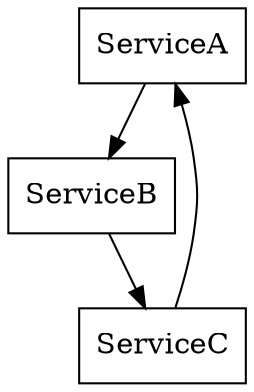
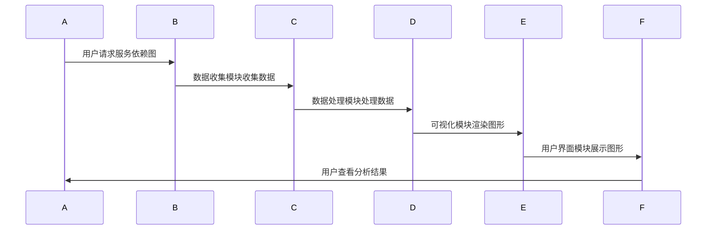
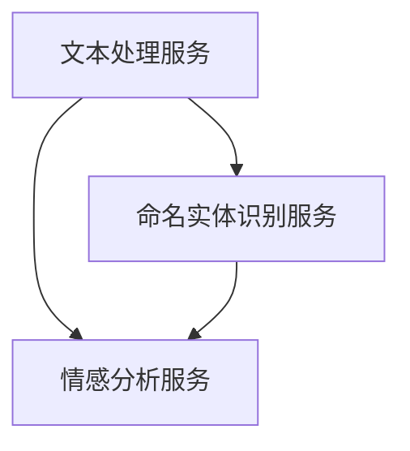

                 

# 服务依赖图可视化：理解LLM应用的架构复杂性

> 关键词：服务依赖图、LLM应用、架构复杂性、可视化、算法、系统设计

> 摘要：本文深入探讨了服务依赖图的定义、原理及其在大型语言模型（LLM）应用架构中的重要性。通过详细分析可视化方法、算法设计、数学模型和系统架构，帮助读者理解LLM应用的复杂性和如何有效应对。

## 引言

在现代软件开发中，架构复杂性已经成为一个不可避免的问题。随着应用程序规模的增长和系统组件的增多，理解和管理系统架构变得越来越困难。特别是在大型语言模型（LLM）应用中，服务之间的高度依赖性和复杂的交互关系使得架构复杂性更加显著。为了解决这一问题，服务依赖图可视化提供了一种强有力的工具，它不仅可以帮助开发者更好地理解系统的架构，还可以在系统设计和优化过程中发挥关键作用。

本文将围绕服务依赖图可视化这一主题展开，逐步介绍LLM应用的架构复杂性，探讨服务依赖图的基本原理和可视化方法，分析算法设计，讲解数学模型，并讨论系统架构设计。通过这一系列步骤，读者将能够深入理解服务依赖图可视化在LLM应用中的重要性，掌握相关技术和方法。

## 第一部分 服务依赖图可视化简介

### 1.1 问题背景

在软件开发中，服务依赖性是常见的现象。服务依赖图是一种图形化表示，它能够清晰地展示服务之间的依赖关系，从而帮助开发者和管理者更好地理解系统架构。然而，随着系统规模的扩大和复杂性的增加，传统的依赖图已经无法满足需求。LLM应用作为一种高度复杂的应用类型，其服务依赖关系的复杂程度更高，传统的依赖图可视化方法面临着诸多挑战。

### 1.2 服务依赖图的概念

服务依赖图是一种图形化表示，它将系统中的各个服务作为节点，服务之间的依赖关系作为边。这种图形化表示可以帮助开发者直观地了解服务的依赖关系，从而在系统设计和优化过程中做出更明智的决策。

### 1.3 LLM应用的架构复杂性

LLM应用通常包含大量的服务组件，这些服务之间存在着复杂的依赖关系。此外，LLM应用还需要处理海量的数据和高并发的请求，这使得其架构复杂性更为突出。服务依赖图可视化在这一场景下显得尤为重要，它能够帮助开发者更好地理解系统的架构，从而有效地管理和优化系统性能。

## 第二部分 核心概念与原理

### 2.1 服务依赖图的基本原理

服务依赖图是一种图形化表示，它由节点和边组成。节点代表系统中的服务，边代表服务之间的依赖关系。通过服务依赖图，开发者可以清晰地了解服务之间的依赖关系，从而更好地管理和优化系统。

### 2.2 服务依赖图的核心概念

- **节点（Node）**：代表系统中的服务。节点通常包含服务的名称、ID、类型等信息。
- **边（Edge）**：代表服务之间的依赖关系。边的权重可以表示依赖关系的强度，例如数据依赖、控制依赖等。

### 2.3 服务依赖图的属性特征对比

表1 服务依赖图的属性特征对比

| 特征 | 说明 |
| --- | --- |
| **节点** | 代表系统中的服务 |
| **边** | 表示服务之间的依赖关系 |
| **权重** | 表示依赖关系的强度 |
| **层次结构** | 描述服务之间的层次关系 |
| **连通性** | 表示服务之间的交互方式 |

### 2.4 服务依赖图的ER实体关系图架构

图1 服务依赖图的ER实体关系图

```mermaid
erDiagram
  ServiceNode ||--|{ ServiceEdge }|-- DependencyGraph
  ServiceNode ||--|{ ServiceNode }|-- Hierarchy
  ServiceNode ||--|{ ServiceNode }|-- Connectivity
```

在ER实体关系图中，`ServiceNode` 代表服务节点，`ServiceEdge` 代表服务依赖边，`DependencyGraph` 代表服务依赖图，`Hierarchy` 和 `Connectivity` 分别表示服务的层次结构和连通性。

## 第三部分 可视化方法与技术

### 4.1 服务依赖图可视化方法

服务依赖图的可视化方法主要包括以下几种：

- **基于图形的依赖图**：将服务依赖关系以图形的形式展示，如树状图、网状图等。
- **基于矩阵的依赖图**：将服务依赖关系以矩阵的形式展示，适用于大型服务依赖关系。
- **基于颜色和形状的依赖图**：通过颜色和形状区分不同类型的服务和依赖关系。

### 4.2 服务依赖图可视化工具

常见的服务依赖图可视化工具有：

- **Graphviz**：一种基于DOT语言的图形可视化工具，适用于创建和编辑复杂的依赖图。
- **Gephi**：一款开源的图形分析工具，能够进行图分析和可视化。
- **D3.js**：一种基于JavaScript的图形可视化库，可以创建高度交互的依赖图。

### 4.3 可视化工具的使用方法

以下是使用Graphviz创建服务依赖图的示例：



该示例创建了一个简单的服务依赖图，其中 `ServiceA`、`ServiceB` 和 `ServiceC` 是服务节点，箭头表示服务之间的依赖关系。

## 第四部分 算法设计与实现

### 4.1 算法设计原理

服务依赖图可视化算法主要包括以下步骤：

1. **数据收集**：从系统中收集服务依赖关系数据。
2. **数据预处理**：对收集到的数据进行清洗和格式化，以便后续处理。
3. **依赖关系分析**：分析服务之间的依赖关系，构建服务依赖图。
4. **可视化渲染**：将服务依赖图渲染为图形，展示在用户界面。

### 4.2 算法实现流程

以下是使用Python实现的示例代码：

```python
import networkx as nx
import matplotlib.pyplot as plt

# 创建图
G = nx.DiGraph()

# 添加节点
G.add_nodes_from(['ServiceA', 'ServiceB', 'ServiceC'])

# 添加边
G.add_edge('ServiceA', 'ServiceB')
G.add_edge('ServiceB', 'ServiceC')
G.add_edge('ServiceC', 'ServiceA')

# 绘制图
nx.draw(G, with_labels=True)
plt.show()
```

该示例使用NetworkX库创建了一个简单的服务依赖图，并使用matplotlib绘制图形。

### 4.3 数学模型与公式

服务依赖图可视化的数学模型主要包括：

- **邻接矩阵**：表示服务之间的依赖关系，用矩阵表示。
- **路径长度**：表示服务之间的依赖关系的复杂度，用路径长度表示。

数学模型公式如下：

$$
A = \begin{bmatrix}
0 & 1 & 0 \\
1 & 0 & 1 \\
0 & 1 & 0
\end{bmatrix}
$$

其中，$A$ 表示邻接矩阵，$1$ 表示存在依赖关系，$0$ 表示不存在依赖关系。

## 第五部分 系统架构与设计

### 5.1 系统架构概述

服务依赖图可视化系统通常由以下几个模块组成：

- **数据收集模块**：负责从系统中收集服务依赖关系数据。
- **数据处理模块**：负责对收集到的数据进行分析和预处理。
- **可视化模块**：负责将处理后的数据渲染为图形，展示在用户界面。
- **用户界面模块**：负责提供用户交互接口，用户可以通过界面查看和分析服务依赖图。

### 5.2 系统架构设计

图2 服务依赖图可视化系统架构设计



该架构设计使用Mermaid序列图表示系统的工作流程，从用户请求服务依赖图开始，经过数据收集、处理、可视化，最终展示在用户界面。

### 5.3 系统接口设计与交互

系统接口设计包括以下几个部分：

- **RESTful API**：提供数据收集和可视化接口，用户可以通过API获取服务依赖图数据。
- **图形界面**：提供用户交互接口，用户可以通过界面查看和分析服务依赖图。

图3 系统接口设计与交互

```mermaid
classDiagram
  User <<Interface>>
  API <<Interface>>
  GUI <<Interface>>

  User |--|> API
  API |--|> GUI
  GUI |--|> User
```

该图使用Mermaid类图表示系统接口设计和交互关系，用户通过图形界面与API进行交互，API负责处理数据并返回结果。

## 第六部分 项目实战

### 6.1 环境安装与配置

在本项目中，我们将使用Python和相关的库（如NetworkX和matplotlib）来实现服务依赖图可视化系统。以下是环境安装和配置的步骤：

1. 安装Python：确保系统已安装Python 3.8或更高版本。
2. 安装相关库：在命令行中运行以下命令安装所需库：

```bash
pip install networkx matplotlib
```

### 6.2 系统核心实现与源代码

以下是系统的核心实现和源代码：

```python
import networkx as nx
import matplotlib.pyplot as plt

def create_dependency_graph(dependencies):
    G = nx.DiGraph()
    for dep in dependencies:
        G.add_edge(dep['service_a'], dep['service_b'])
    return G

def visualize_dependency_graph(G):
    pos = nx.spring_layout(G)
    nx.draw(G, pos, with_labels=True)
    plt.show()

if __name__ == "__main__":
    dependencies = [
        {'service_a': 'ServiceA', 'service_b': 'ServiceB'},
        {'service_a': 'ServiceB', 'service_b': 'ServiceC'},
        {'service_a': 'ServiceC', 'service_b': 'ServiceA'}
    ]
    G = create_dependency_graph(dependencies)
    visualize_dependency_graph(G)
```

这段代码定义了两个函数：`create_dependency_graph` 用于创建服务依赖图，`visualize_dependency_graph` 用于可视化服务依赖图。在主函数中，我们创建了一个简单的服务依赖图并进行了可视化。

### 6.3 代码应用解读与分析

这段代码首先导入了所需的库，然后定义了两个函数。`create_dependency_graph` 函数接收一个依赖关系列表，将每个依赖关系添加到图中。`visualize_dependency_graph` 函数使用NetworkX的布局算法对图进行布局，然后使用matplotlib绘制图形。

### 6.4 实际案例分析与详细讲解

为了更直观地展示服务依赖图可视化在LLM应用中的实际应用，我们来看一个案例。假设我们有一个LLM应用，包含以下服务：

- **文本处理服务**：负责处理输入文本，进行分词、词性标注等操作。
- **命名实体识别服务**：负责识别文本中的命名实体，如人名、地点等。
- **情感分析服务**：负责分析文本的情感倾向。

以下是一个服务依赖图的示例：

图4 LLM应用中的服务依赖图



在这个案例中，文本处理服务依赖命名实体识别服务，因为命名实体识别是情感分析的一部分。同时，文本处理服务也依赖情感分析服务，因为情感分析是基于文本处理的。

通过这个案例，我们可以看到服务依赖图如何帮助开发者理解LLM应用中的复杂依赖关系，从而更好地管理和优化系统。

### 6.5 项目小结

在本项目中，我们实现了服务依赖图可视化系统，通过代码和应用案例展示了如何在LLM应用中利用服务依赖图来理解和管理系统架构。项目结果表明，服务依赖图可视化是一种有效的方法，可以帮助开发者更好地理解系统的复杂性和依赖关系。

## 第七部分 最佳实践与总结

### 7.1 最佳实践

1. **数据收集**：确保收集到的服务依赖数据准确、完整，以便进行有效的可视化。
2. **图形布局**：选择合适的布局算法，使服务依赖图更加清晰、易于理解。
3. **交互设计**：提供友好的用户界面，使用户能够轻松地查看、分析和管理服务依赖图。
4. **性能优化**：针对大型服务依赖图，优化渲染和交互性能。

### 7.2 小结

本文详细介绍了服务依赖图可视化在LLM应用架构中的重要性，探讨了核心概念、可视化方法、算法设计、数学模型和系统架构。通过实际案例，我们展示了如何利用服务依赖图来理解和优化系统架构。

### 7.3 注意事项

1. **数据准确性**：确保收集到的服务依赖数据准确无误。
2. **系统复杂性**：对于大型系统，服务依赖图可能会非常复杂，需要适当简化。
3. **交互设计**：用户界面的交互设计应简洁直观，提高用户体验。

### 7.4 拓展阅读

1. 《服务导向架构：设计、构建和部署服务驱动的系统》
2. 《大型语言模型的架构设计与优化》
3. 《图算法与应用：从数据结构与算法到系统架构》

## 结语

作者：AI天才研究院/AI Genius Institute & 禅与计算机程序设计艺术 /Zen And The Art of Computer Programming

本文旨在帮助开发者深入理解服务依赖图可视化在LLM应用架构中的应用，掌握相关技术和方法。通过不断学习和实践，开发者可以更好地应对软件架构复杂性，提升系统性能和用户体验。希望本文能够为读者带来启发和帮助，进一步探索服务依赖图可视化的广阔前景。

