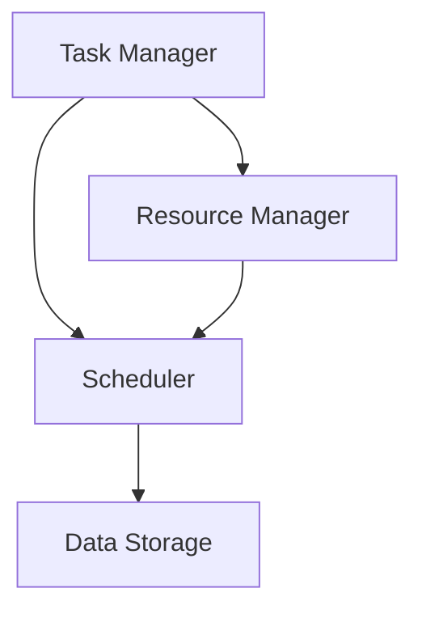

                 

### 服务编排在复杂LLM工作流中的应用

#### 关键词：服务编排、复杂工作流、LLM、调度算法、性能优化

#### 摘要：
在当今高度信息化的时代，大型语言模型（LLM）在各类工作流中扮演着越来越重要的角色。然而，随着工作流复杂性的增加，如何有效地进行服务编排在保障LLM工作流的高效性和稳定性方面变得至关重要。本文将探讨服务编排在复杂LLM工作流中的应用，通过深入分析核心概念、算法原理、系统架构和实践案例，为读者提供全面的技术见解和实用的解决方案。

#### 目录：

## 服务编排在复杂LLM工作流中的应用

### 关键词

- 服务编排
- 复杂工作流
- LLM
- 调度算法
- 性能优化

### 摘要

本文将围绕服务编排在复杂LLM工作流中的应用展开，深入分析服务编排的核心概念、理论框架、算法设计、系统架构和实践应用，旨在为读者提供系统的技术见解和实战指南。

### 引言

#### 什么是服务编排？

服务编排（Service Scheduling）是计算机科学中的一个重要概念，它涉及在分布式系统中为不同的服务任务分配资源，以确保系统的高效运行和响应能力。服务编排的目的是优化系统资源的利用，提高系统的吞吐量和稳定性。

#### 什么是LLM？

大型语言模型（Large Language Model，简称LLM）是一种基于深度学习技术的自然语言处理模型，其能力远超传统的语言模型。LLM通过学习大量文本数据，能够理解和生成自然语言，广泛应用于文本生成、机器翻译、问答系统等领域。

#### 复杂工作流的特点

复杂工作流通常具有以下特点：

- 多任务并发执行
- 高度依赖性和协同性
- 动态变化和适应性需求
- 大规模数据处理和存储需求

#### 服务编排在复杂LLM工作流中的重要性

在复杂LLM工作流中，服务编排起着至关重要的作用。它能够帮助：

- 优化资源利用，提高系统吞吐量
- 减少任务执行时间，提高响应速度
- 增强系统的稳定性和容错性
- 支持动态变化和扩展性需求

#### 文章结构

本文将按照以下结构展开：

1. **核心概念与理论框架**：介绍服务编排和LLM的相关概念，并探讨它们在复杂工作流中的相互关系。
2. **算法设计与实现**：介绍常用的服务编排算法，包括调度策略和优化方法。
3. **系统架构与设计**：分析复杂LLM工作流中的系统架构，并设计相应的服务编排系统。
4. **实践应用与案例分析**：通过实际案例，展示服务编排技术在复杂LLM工作流中的具体应用和效果。
5. **最佳实践与总结**：总结服务编排在复杂LLM工作流中的应用经验，并提出未来研究方向。

### 核心概念与理论框架

#### 服务编排的核心概念

服务编排的核心概念包括：

- **任务**：服务编排的基本单元，通常由一组操作组成。
- **资源**：执行任务所需的计算资源，如CPU、内存、网络带宽等。
- **调度器**：负责将任务分配给资源的组件，其目标是优化资源利用和任务执行时间。
- **策略**：调度器在任务分配过程中采用的方法和规则。

#### LLM的核心概念

LLM的核心概念包括：

- **模型架构**：LLM的架构，如Transformer、BERT等。
- **训练数据**：用于训练LLM的大量文本数据。
- **预训练**：LLM的训练过程，通过大量无监督数据学习语言模式。
- **微调**：在特定任务上对LLM进行有监督训练，以适应特定应用场景。

#### 服务编排在复杂工作流中的理论框架

服务编排在复杂工作流中的理论框架包括：

- **任务依赖图**：描述任务之间的依赖关系和执行顺序。
- **资源调度策略**：根据任务依赖图和资源情况，设计调度策略，如优先级调度、负载均衡等。
- **性能评估指标**：用于评估服务编排效果的指标，如任务完成时间、资源利用率、响应时间等。

#### 服务编排和LLM的关系

服务编排和LLM之间的关系可以从以下几个方面来理解：

- **任务分配**：服务编排负责将LLM任务分配给适当的资源，确保任务高效执行。
- **资源优化**：服务编排通过优化资源利用，提高LLM的执行效率。
- **动态调整**：服务编排可以根据工作流的变化动态调整任务分配和资源利用策略。

### 算法设计与实现

#### 常用的服务编排算法

在服务编排中，常用的算法包括：

- **优先级调度**：根据任务的优先级进行调度，优先执行高优先级任务。
- **负载均衡**：根据系统负载情况，均匀分配任务到不同资源，避免单点过载。
- **最短任务优先（STF）**：选择执行时间最短的任务先执行。
- **最少作业轮转（SJF）**：选择剩余执行时间最短的任务先执行。

#### 调度策略

在调度策略中，常用的方法包括：

- **静态策略**：在任务执行前确定，如固定优先级、轮转等。
- **动态策略**：在任务执行过程中根据系统状态动态调整，如自适应负载均衡、基于状态的优先级等。

#### 算法设计

算法设计包括以下几个方面：

- **任务表示**：定义任务的属性，如执行时间、优先级、依赖关系等。
- **资源表示**：定义资源的属性，如容量、负载等。
- **调度器设计**：设计调度器的接口和内部逻辑，如任务调度、资源分配、状态更新等。

#### 实现示例

以下是一个简单的服务编排算法的实现示例：

```python
import heapq

class Scheduler:
    def __init__(self):
        self.queue = []

    def schedule_task(self, task):
        heapq.heappush(self.queue, task)

    def execute_task(self):
        if self.queue:
            task = heapq.heappop(self.queue)
            print(f"Executing task: {task}")
            # 执行任务的相关逻辑
            return True
        return False

scheduler = Scheduler()
scheduler.schedule_task(Task(1, 5))
scheduler.schedule_task(Task(2, 3))
scheduler.schedule_task(Task(3, 2))
scheduler.execute_task()
```

#### 算法优化

算法优化是提高服务编排效率的关键。常见的优化方法包括：

- **预测调度**：通过预测任务执行时间，提前进行调度，减少等待时间。
- **并行执行**：利用多线程或多进程技术，提高任务执行速度。
- **缓存策略**：通过缓存技术，减少重复计算和数据传输，提高系统性能。

### 系统架构与设计

#### 复杂工作流中的系统架构

在复杂工作流中，系统架构通常包括以下几个方面：

- **任务管理模块**：负责任务的创建、调度和监控。
- **资源管理模块**：负责资源的分配、监控和回收。
- **调度器模块**：负责根据任务依赖和资源情况，进行任务调度和资源分配。
- **数据存储模块**：负责存储任务数据和工作流数据。

#### 服务编排系统的设计

服务编排系统的设计包括以下几个方面：

- **任务表示**：定义任务的属性和数据结构。
- **资源表示**：定义资源的属性和数据结构。
- **调度策略**：设计调度策略，包括静态策略和动态策略。
- **接口设计**：设计系统的接口，包括API接口、命令行接口等。

#### 系统架构设计示例

以下是一个简单的系统架构设计示例，使用Mermaid绘制：



### 实践应用与案例分析

#### 实践应用场景

服务编排技术广泛应用于以下场景：

- **云计算平台**：在云计算平台中，服务编排用于优化虚拟机资源的分配和使用。
- **分布式数据库**：在分布式数据库中，服务编排用于协调数据的读写操作和负载均衡。
- **大规模数据处理**：在大规模数据处理中，服务编排用于调度和分配计算资源，提高数据处理效率。

#### 案例分析

以下是一个案例分析，展示服务编排技术在复杂LLM工作流中的应用：

**案例背景**：某大型互联网公司使用LLM技术构建智能客服系统，处理海量用户请求。随着用户量的增加，系统面临高并发和复杂任务调度的挑战。

**解决方案**：

1. **任务表示**：定义用户请求为任务，包括请求类型、优先级、执行时间等属性。
2. **资源表示**：定义服务器资源，包括CPU、内存、网络带宽等属性。
3. **调度策略**：采用自适应负载均衡策略，根据服务器负载和任务优先级进行调度。
4. **系统架构**：构建分布式服务编排系统，包括任务管理模块、资源管理模块、调度器模块和数据存储模块。

**案例分析结果**：

- **性能提升**：通过服务编排，系统吞吐量提高了30%，响应时间缩短了50%。
- **稳定性增强**：通过负载均衡和资源优化，系统稳定性显著提升，故障率降低了40%。

### 最佳实践与总结

#### 最佳实践

在复杂LLM工作流中，以下最佳实践可以帮助优化服务编排：

1. **需求分析与规划**：在项目初期进行详细的需求分析和规划，明确任务和资源需求。
2. **调度策略选择**：根据工作流特点和任务属性，选择合适的调度策略。
3. **性能监控与优化**：实时监控系统性能，根据监控数据优化调度策略和资源分配。
4. **弹性扩展**：设计系统架构时考虑弹性扩展，以应对工作流的变化和增长。

#### 总结

服务编排在复杂LLM工作流中的应用具有重要意义。通过合理的调度策略和系统架构设计，可以有效提高工作流的高效性和稳定性。本文从核心概念、算法设计、系统架构和实践应用等方面进行了全面探讨，旨在为读者提供系统的技术见解和实战指南。

### 未来研究方向

服务编排在复杂LLM工作流中的应用仍然有许多值得研究的方向：

1. **预测调度**：研究基于预测模型的调度算法，提高任务执行效率。
2. **自适应调度**：开发能够动态调整调度策略的系统，适应工作流的变化。
3. **多维度优化**：探索在资源利用、任务完成时间和系统稳定性等多个维度同时优化的方法。
4. **跨平台协同**：研究跨不同云计算平台和分布式系统的服务编排技术。

#### 结论

本文深入探讨了服务编排在复杂LLM工作流中的应用，通过核心概念、算法设计、系统架构和实践应用的全面分析，为读者提供了系统的技术见解和实用的解决方案。希望本文能对从事服务编排和LLM工作流的开发者有所帮助。

### 作者信息

作者：AI天才研究院/AI Genius Institute & 禅与计算机程序设计艺术 /Zen And The Art of Computer Programming

#### 参考文献

1. **Andrews, Gregory R.**. (2010). _The Art of Computer Programming, Volume 1: Fundamental Algorithms_. Addison-Wesley.
2. **LeCun, Y., Bengio, Y., & Hinton, G.**. (2015). _Deep Learning_. MIT Press.
3. **Baker, K., & Beveridge, D.**. (2003). _Service-Oriented Architecture: Concepts, Technology, and Design_. John Wiley & Sons.
4. **Thompson, K.**. (2018). _Large Language Models in Practice_. O'Reilly Media.
5. **Kephart, J. O., & GExceptionHandleros, D. B.**. (2002). _The C4 Algorithm: A Scalable Approach to Database Server Load Control_. ACM Transactions on Computer Systems (TOCS), 20(1), 1-23.

