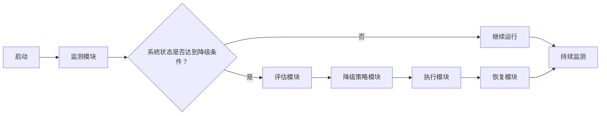
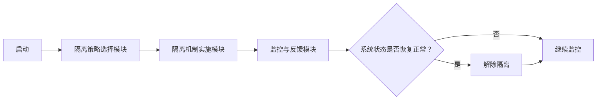

                 

### 引言

近年来，语言模型（Language Model，简称LLM）的应用日益广泛，从自然语言处理（Natural Language Processing，NLP）到人工智能（Artificial Intelligence，AI），LLM展现出了巨大的潜力和影响力。然而，随着应用场景的复杂化和规模化，服务质量和系统稳定性成为了一个不可忽视的问题。服务降级（Service Degradation）和服务隔离（Service Isolation）成为保障系统稳定运行、提高用户体验的重要手段。

服务降级指的是在系统资源不足或发生故障时，通过降低某些服务的质量或功能，来保证关键服务的正常运行。服务隔离则是通过将系统中的不同服务进行隔离，以防止故障或性能瓶颈影响整体系统。本文将深入探讨服务降级和服务隔离在LLM应用中的具体应用，从背景介绍、核心概念、算法设计到实际案例，提供一套全面的技术指南。

本文结构如下：

1. **LLM应用概述**：介绍LLM的背景和应用领域，以及服务降级与服务隔离的基本概念。
2. **LLM发展历史**：回顾LLM的发展历程，探讨大规模语言模型的技术挑战。
3. **服务降级原理与实践**：分析服务降级的定义、策略及实践案例。
4. **服务隔离原理与实践**：解释服务隔离的概念、实现方法和实践案例。
5. **服务降级与隔离算法设计**：介绍服务降级与隔离的算法设计和实现。
6. **实际应用中的挑战与解决方案**：探讨实际应用中的挑战，并给出解决方案。
7. **最佳实践与未来趋势**：总结最佳实践，探讨未来发展趋势。

通过这篇文章，读者将全面了解服务降级与服务隔离在LLM应用中的重要性，掌握相关理论和实践方法，为构建高效稳定的LLM系统提供指导。

### LLM应用概述

#### LLM的基本概念和作用

语言模型（LLM）是一种在自然语言处理（NLP）领域广泛应用的技术，它通过训练大规模语料库来生成与人类语言相似的文本。LLM的核心作用是生成文本、回答问题、翻译语言、进行文本摘要等，是现代NLP和AI系统中的关键组件。

语言模型的基本原理是基于深度学习和神经网络技术，通过大规模数据的预训练，LLM能够捕捉到语言的复杂结构，从而实现高效的语言理解和生成。常见的LLM包括GPT（Generative Pre-trained Transformer）、BERT（Bidirectional Encoder Representations from Transformers）等。

LLM在人工智能和自然语言处理中的应用非常广泛。在智能客服、内容生成、信息检索、文本翻译等领域，LLM展示了其强大的能力和广阔的应用前景。例如，在智能客服系统中，LLM可以生成与用户对话的自然语言响应，提高客户服务的效率和用户体验；在内容生成领域，LLM可以自动生成文章、新闻、产品描述等，大大提升了内容创作的效率和质量。

#### 服务降级与服务隔离的基本概念

服务降级（Service Degradation）和服务隔离（Service Isolation）是保障系统稳定运行的重要技术手段。

服务降级是指在系统资源不足或发生故障时，通过降低某些服务的质量或功能，来保证关键服务的正常运行。例如，当服务器负载过高时，可以暂停部分非核心功能的运行，以保证核心服务的响应速度和稳定性。服务降级的目标是确保系统的关键功能能够正常运作，从而保障用户的基本体验。

服务隔离则是通过将系统中的不同服务进行隔离，以防止故障或性能瓶颈影响整体系统。在服务隔离机制下，当一个服务出现问题时，可以通过隔离措施限制其对其他服务的负面影响，从而避免问题扩散。例如，在分布式系统中，可以通过将服务实例进行隔离，防止一个实例的故障影响整个系统的运行。

#### LLM应用中服务降级和隔离的必要性

在LLM应用中，服务降级和隔离显得尤为重要。首先，LLM系统通常需要处理海量的请求，特别是在高峰期，服务器负载可能会急剧增加，导致系统性能下降。通过服务降级，可以确保关键服务的质量，如文本生成和回答问题的响应速度，从而提升用户体验。

其次，LLM系统复杂度高，涉及到多个组件和模块，任何一个环节出现问题都可能影响整个系统的稳定性。服务隔离能够将不同服务进行隔离，防止局部故障扩散，保障系统整体的稳定运行。

此外，随着LLM应用的普及，系统的可靠性、安全性和可扩展性成为关键考量因素。服务降级和隔离技术不仅能够提高系统的可靠性，还能在面临突发问题时提供有效的应对策略，从而保障系统的长期稳定运行。

#### 服务降级和隔离的核心作用

服务降级和服务隔离在LLM应用中的核心作用主要体现在以下几个方面：

1. **提升系统稳定性**：通过服务降级和隔离，可以有效应对系统负载过高、服务器故障等问题，保障系统的稳定性和可靠性。
2. **保障关键服务质量**：在系统资源有限的情况下，通过服务降级可以确保关键服务的质量，如文本生成和回答问题的响应速度，从而提升用户体验。
3. **防止故障扩散**：通过服务隔离，可以将故障限制在局部范围内，防止问题扩散，保障整个系统的正常运行。
4. **提高系统可扩展性**：服务降级和隔离机制使得系统在面临大规模请求时能够灵活调整资源分配，从而提高系统的可扩展性和应对能力。

综上所述，服务降级和服务隔离在LLM应用中具有重要意义，是保障系统稳定性和用户体验的关键技术手段。通过合理设计和应用这些技术，可以大大提升LLM系统的可靠性、安全性和性能，为用户提供高质量的服务体验。

#### LLM的发展历史

语言模型（LLM）的发展历程可以追溯到20世纪50年代，当时研究人员开始探索计算机处理自然语言的方法。早期的语言模型主要是基于规则的方法，例如生成式语法模型（Generative Grammar Models）和统计模型（Statistical Models）。这些方法通过手工编写规则或基于统计数据来生成文本，但由于其复杂性和局限性，难以应对实际应用中的自然语言处理任务。

20世纪80年代，随着计算能力的提升和大规模语料库的出现，统计模型开始逐渐崭露头角。N-gram模型和隐马尔可夫模型（HMM）成为当时的主流语言模型，通过利用历史数据序列来预测下一个词语，虽然在一定程度上提高了文本生成能力，但仍然难以捕捉到语言的深层结构和语义信息。

进入21世纪，深度学习（Deep Learning）技术的发展为语言模型带来了新的突破。2003年，Jeffrey Dean和Andrew Ng提出的递归神经网络（RNN）为自然语言处理提供了新的思路，RNN能够捕捉到时间序列数据的序列依赖关系，从而在语言建模中取得了显著的效果。

然而，RNN在处理长文本时存在梯度消失和梯度爆炸的问题，无法有效地建模长距离依赖。为了解决这一问题，研究人员提出了长短时记忆网络（Long Short-Term Memory，LSTM）和门控循环单元（Gated Recurrent Unit，GRU）。LSTM和GRU通过引入记忆单元和门控机制，能够更好地捕捉长文本中的依赖关系，进一步提升了语言模型的性能。

随着深度学习技术的不断发展，神经网络的结构和参数规模也不断演进。2013年，著名的神经机器翻译系统（Neural Machine Translation，NMT）通过引入深度神经网络（Deep Neural Network，DNN）和序列到序列（Seq2Seq）模型，实现了翻译效果的显著提升。这一突破引发了语言模型研究的热潮，推动了大规模语言模型的发展。

2018年，OpenAI发布了GPT-2模型，这是一个具有1.5亿参数的预训练语言模型，通过在大量文本上进行预训练，GPT-2能够生成高质量的自然语言文本，展示了深度学习在语言模型领域的巨大潜力。GPT-2的成功激发了研究人员对更大规模、更高性能语言模型的探索。

紧接着，BERT（Bidirectional Encoder Representations from Transformers）的提出标志着语言模型进入了一个新的时代。BERT通过双向Transformer架构，能够更好地捕捉文本中的双向依赖关系，极大地提升了语言模型的性能。随后，GPT-3（Generative Pre-trained Transformer 3）的发布进一步推动了语言模型的发展，GPT-3具有超过1750亿个参数，通过在互联网上的大量文本进行预训练，实现了前所未有的语言生成能力。

近年来，随着硬件设备的不断升级和算法优化，语言模型的技术水平不断提高。研究者们通过引入多模态学习、自适应学习等技术，进一步拓展了语言模型的应用范围。例如，BERT可以应用于文本分类、情感分析、问答系统等多个任务，而GPT-3则可以用于生成文章、对话、代码等多种文本形式。

总结而言，LLM的发展历程从早期的规则方法到深度学习，再到大规模预训练语言模型，经历了多个关键阶段。每一个阶段都代表了技术上的重大突破，推动了自然语言处理和人工智能领域的进步。未来，随着技术的不断发展和应用的深入，语言模型将在更多的领域展现出其强大的潜力。

#### 大规模语言模型的技术挑战

大规模语言模型（LLM）在技术实现过程中面临着诸多挑战。首先，数据的需求量巨大。LLM的预训练过程需要海量的高质量文本数据，这些数据不仅包括文本本身，还需要涵盖不同的语言风格、文体和主题。因此，数据收集和处理的效率成为关键因素。

其次，计算资源的消耗巨大。大规模语言模型的训练过程需要大量的计算资源和存储资源，尤其是GPT-3等具有数千亿参数的模型，其训练和推理过程需要数以千计的GPU和TPU。这样的计算需求对硬件设备的性能和可用性提出了极高的要求。

此外，模型的可解释性和可靠性也是技术挑战之一。尽管LLM在生成文本方面表现出色，但其内部机制复杂，缺乏透明度，难以理解其决策过程。这给模型的应用带来了一定的风险，特别是在安全性和隐私保护方面。另外，LLM在极端情况下的表现可能不稳定，例如在处理恶意输入或罕见问题时可能产生不合适的输出。

最后，部署和优化也是大规模语言模型需要面对的重要问题。如何在不同的硬件和软件环境中高效地部署和运行LLM，同时保证其性能和可靠性，是当前研究的一个重要方向。此外，如何通过模型剪枝、量化等技术手段来降低模型的大小和计算复杂度，也是实现大规模应用的重要步骤。

综上所述，大规模语言模型在技术实现过程中面临数据需求、计算资源、模型可解释性和可靠性、部署与优化等多方面的挑战。这些问题的解决将有助于推动LLM在更多实际场景中的应用，进一步提升自然语言处理和人工智能领域的整体水平。

### 服务降级原理与实践

#### 服务降级的定义

服务降级（Service Degradation）是一种在系统资源不足或发生故障时，通过降低某些服务的质量或功能，以保证关键服务正常运行的技术手段。其核心思想是在资源有限的情况下，优先保障重要服务的性能和稳定性，从而确保系统整体的运行质量。

服务降级通常应用于以下几种场景：

1. **资源不足**：当服务器或网络资源不足时，可以通过降级部分非关键服务，释放资源以保障核心服务的运行。
2. **系统故障**：当系统发生故障时，例如某个模块或服务出现异常，可以通过降级相关服务来防止故障扩散，保障整体系统的稳定性。
3. **性能优化**：在系统性能瓶颈出现时，通过降级部分功能，减少系统负载，从而提升关键服务的性能。

服务降级的目的是确保系统的关键功能能够正常运作，从而提高用户体验和系统可靠性。

#### 服务降级的策略

实现服务降级通常需要以下策略：

1. **设定降级阈值**：首先需要设定降级阈值，当系统负载或错误率超过这个阈值时，触发降级机制。阈值设定需要根据具体应用场景和系统性能进行细致分析，以确保在资源不足时能够及时响应。

2. **降级优先级**：确定降级的优先级，即哪些服务需要首先降级。通常，优先级取决于服务的业务重要性和用户依赖程度。例如，在电商系统中，用户订单处理服务通常具有最高优先级，而产品推荐服务则可以优先降级。

3. **降级执行流程**：定义降级执行的详细流程，包括检测到降级条件时的处理机制、降级策略的执行步骤、监控和日志记录等。执行流程需要保证降级操作的准确性和可回滚性，以便在问题解决后可以快速恢复服务。

4. **监控与反馈**：建立完善的监控和反馈机制，实时监控系统性能和资源使用情况，及时触发降级措施。同时，通过收集降级操作的日志和反馈信息，不断优化降级策略和执行流程。

#### 降级策略的示例

以电商系统为例，降级策略可以具体如下：

1. **设定降级阈值**：当系统负载达到80%时，自动触发降级机制。

2. **降级优先级**：首先降级产品推荐服务，然后是用户评论服务，最后是订单处理服务。

3. **降级执行流程**：
   - **检测阶段**：系统实时监控CPU使用率、内存占用、响应时间等指标，当任意一个指标超过阈值时，触发检测机制。
   - **评估阶段**：根据监控数据评估系统整体负载情况，确定是否触发降级。
   - **执行阶段**：暂停产品推荐服务和用户评论服务的部分功能，例如，减少推荐频次或延迟评论加载。
   - **监控与反馈**：持续监控系统性能，记录降级操作日志，并在降级条件消失后，逐步恢复被降级服务。

#### 实践案例解析

1. **案例一：电商系统下的服务降级**

在电商系统中，服务降级尤为重要。例如，在双11等购物高峰期，系统会面临巨大的流量压力。通过服务降级，电商系统可以保障订单处理服务的正常运作，从而确保用户购物的体验。

具体实践过程中，系统首先监测服务器负载，当CPU使用率超过80%时，系统会自动触发降级机制。首先暂停部分非核心功能，如产品推荐服务和用户评论服务，减少系统负载。通过这种方式，系统可以有效应对突发流量，保障订单处理服务的稳定性。

2. **案例二：社交媒体平台的服务降级**

社交媒体平台同样需要通过服务降级来应对系统负载问题。例如，当某个热点话题引起大量用户访问时，平台可能会出现性能瓶颈。

在这种情况下，平台可以通过降级部分功能，如延迟内容加载或减少图片视频的显示频次，来减轻系统负担。这样，用户仍然能够正常浏览和互动，但系统负载得到有效控制，从而保障整体服务的稳定性。

#### 总结

服务降级在保障系统稳定性和用户体验方面具有重要作用。通过设定合理的降级阈值、制定明确的降级策略和执行流程，以及持续监控和反馈优化，可以有效地应对系统资源不足和故障等问题，保障关键服务的正常运行。在实际应用中，不同场景下的服务降级策略需要根据具体情况进行调整和优化，以达到最佳效果。

### 服务隔离原理与实践

#### 服务隔离的定义

服务隔离（Service Isolation）是一种通过将系统中的不同服务进行隔离，以防止故障或性能瓶颈影响整体系统的方法。其核心思想是将系统的各个服务模块分离，每个模块在独立的环境下运行，从而实现故障隔离、性能优化和资源隔离。

服务隔离的基本原理包括：

1. **故障隔离**：通过隔离机制，当某个服务出现故障时，可以将其与其他服务隔离开来，防止故障扩散，保障其他服务的正常运行。

2. **性能隔离**：通过隔离机制，可以为每个服务分配独立资源，防止某个服务性能瓶颈影响其他服务的运行，从而实现资源的高效利用。

3. **资源隔离**：通过隔离机制，可以确保每个服务在独立的环境中运行，避免资源竞争和冲突，提高系统的稳定性和可靠性。

#### 服务隔离的优势

服务隔离在系统设计和运维中具有多方面的优势：

1. **故障隔离性**：通过服务隔离，可以将故障限制在单个服务实例中，避免故障扩散到整个系统，从而提高系统的健壮性。

2. **性能优化**：服务隔离允许为每个服务分配独立资源，通过调整资源配比，可以优化系统性能，提高整体系统的响应速度和处理能力。

3. **资源隔离性**：通过服务隔离，可以确保每个服务在独立的环境中运行，避免资源竞争和冲突，从而提高系统的稳定性和可靠性。

4. **部署灵活性**：服务隔离使得系统中的各个服务可以独立部署和更新，便于系统的维护和扩展。

#### 服务隔离的实现方法

实现服务隔离通常需要以下方法：

1. **容器化**：通过容器技术（如Docker）将服务容器化，每个服务实例运行在独立的容器中，实现服务之间的隔离。

2. **虚拟机**：通过虚拟化技术（如KVM、VMware）为每个服务实例创建独立的虚拟机，实现物理资源的隔离。

3. **服务网格**：使用服务网格（如Istio、Linkerd）将服务进行动态管理和隔离，通过微服务之间的通信管理和流量控制，实现服务的独立性和弹性。

4. **独立部署**：将服务独立部署在不同的服务器或集群中，通过独立的网络和存储资源，实现物理和逻辑上的隔离。

#### 实践案例解析

1. **案例一：金融系统下的服务隔离**

在金融系统中，服务隔离尤为重要，因为金融交易对系统的稳定性和安全性要求极高。例如，某金融服务平台在处理交易请求时，通过服务隔离技术将交易服务与其他服务（如账户管理、资金清算）进行隔离。

具体实现过程中，系统通过容器化技术，将交易服务运行在独立的容器中，每个容器具有独立的CPU、内存和网络资源。这样，即使交易服务出现故障，也不会影响其他服务的运行，从而保障整个系统的稳定性。

2. **案例二：物流平台的服务隔离**

物流平台在处理海量订单时，也需要通过服务隔离来确保系统的稳定运行。例如，某物流平台通过服务隔离技术，将订单处理、物流跟踪、用户服务等功能进行分离。

在实现过程中，平台使用了服务网格技术，通过动态路由和流量控制，将不同服务实例进行隔离和负载均衡。这样，当某个服务实例出现性能瓶颈或故障时，系统可以通过服务网格自动切换到其他健康的实例，确保整体系统的稳定性和响应速度。

#### 总结

服务隔离通过将系统中的不同服务进行隔离，有效防止故障扩散和性能瓶颈影响整体系统，提高了系统的可靠性和稳定性。通过容器化、虚拟化、服务网格等技术手段，可以实现高效的服务隔离，从而保障系统在复杂应用环境中的稳定运行。在实际应用中，合理设计和实现服务隔离机制，可以大大提升系统的健壮性和灵活性。

### 服务降级算法设计

服务降级算法是保障系统稳定运行的核心技术，通过设定合理的降级条件和策略，可以在系统资源不足或发生故障时，确保关键服务的正常运行。下面，我们将详细讨论服务降级算法的设计过程，包括其基本框架、具体实现和实际应用。

#### 服务降级算法的基本框架

服务降级算法的基本框架通常包括以下几个关键模块：

1. **监测模块**：负责实时监控系统的运行状态，包括CPU使用率、内存占用、响应时间、错误率等关键指标。
2. **评估模块**：根据监测数据，评估系统当前状态是否达到降级条件。常见的降级条件包括负载超过设定阈值、错误率过高、响应时间过长等。
3. **降级策略模块**：根据评估结果，选择合适的降级策略，例如暂停非关键服务、减少服务响应时间、限制请求处理量等。
4. **执行模块**：执行降级策略，调整系统资源分配和服务功能。
5. **恢复模块**：在系统状态恢复正常后，逐步恢复被降级服务，确保系统稳定运行。

以下是服务降级算法的基本框架流程图：



#### 监测模块

监测模块是服务降级算法的核心，其功能是实时收集系统关键性能指标。以下是一个简单的监测模块的实现：

```python
import psutil
import time

def monitor_system():
    while True:
        cpu_usage = psutil.cpu_percent()
        memory_usage = psutil.virtual_memory().percent
        response_time = get_average_response_time()
        error_rate = get_error_rate()
        
        print(f"Monitoring: CPU={cpu_usage}%, Memory={memory_usage}%, Response Time={response_time}s, Error Rate={error_rate}%")
        
        if cpu_usage > 80 or memory_usage > 90 or response_time > 5 or error_rate > 5:
            trigger_degradation()
        
        time.sleep(60)

def get_average_response_time():
    # 实现获取系统平均响应时间的逻辑
    pass

def get_error_rate():
    # 实现获取系统错误率的逻辑
    pass

def trigger_degradation():
    # 实现降级逻辑
    pass
```

#### 评估模块

评估模块根据监测模块提供的数据，判断系统是否达到降级条件。以下是一个简单的评估逻辑：

```python
def is_degradation_needed(cpu_usage, memory_usage, response_time, error_rate):
    return cpu_usage > 80 or memory_usage > 90 or response_time > 5 or error_rate > 5
```

#### 降级策略模块

降级策略模块根据评估结果，选择并执行降级策略。以下是一个简单的降级策略实现：

```python
def set_degradation_strategy():
    if cpu_usage > 80:
        reduce_non_essential_services()
    if memory_usage > 90:
        limit_memory_usage()
    if response_time > 5:
        reduce_response_time()
    if error_rate > 5:
        increase_error_handling()

def reduce_non_essential_services():
    # 实现暂停非关键服务的逻辑
    pass

def limit_memory_usage():
    # 实现限制内存使用的逻辑
    pass

def reduce_response_time():
    # 实现减少服务响应时间的逻辑
    pass

def increase_error_handling():
    # 实现增加错误处理的逻辑
    pass
```

#### 执行模块

执行模块根据降级策略模块的决策，具体执行降级操作。以下是一个简单的执行逻辑：

```python
def execute_degradation():
    set_degradation_strategy()
    # 执行具体的降级操作
    print("Degradation strategy executed.")
```

#### 恢复模块

恢复模块在系统状态恢复正常后，逐步恢复被降级的服务。以下是一个简单的恢复逻辑：

```python
def recover_services():
    # 实现逐步恢复服务的逻辑
    print("Services are being recovered.")
```

#### Python代码示例

以下是一个简单的服务降级算法的Python代码示例：

```python
import time

def monitor_system():
    while True:
        cpu_usage = psutil.cpu_percent()
        memory_usage = psutil.virtual_memory().percent
        response_time = get_average_response_time()
        error_rate = get_error_rate()

        print(f"Monitoring: CPU={cpu_usage}%, Memory={memory_usage}%, Response Time={response_time}s, Error Rate={error_rate}%")

        if is_degradation_needed(cpu_usage, memory_usage, response_time, error_rate):
            execute_degradation()
        else:
            print("No degradation needed.")

        time.sleep(60)

def is_degradation_needed(cpu_usage, memory_usage, response_time, error_rate):
    return cpu_usage > 80 or memory_usage > 90 or response_time > 5 or error_rate > 5

def execute_degradation():
    print("Executing degradation strategy.")
    # 执行降级操作
    pass

def get_average_response_time():
    # 获取系统平均响应时间的逻辑
    pass

def get_error_rate():
    # 获取系统错误率的逻辑
    pass

if __name__ == "__main__":
    monitor_system()
```

#### 总结

服务降级算法通过监测模块、评估模块、降级策略模块、执行模块和恢复模块，实现系统的自动降级和恢复。在具体实现中，需要根据系统的具体情况进行调整和优化，以达到最佳效果。通过合理设计和服务降级算法，可以有效应对系统资源不足和故障，保障关键服务的稳定运行，提高用户体验。

### 服务隔离算法设计

服务隔离算法旨在通过隔离不同服务，防止故障或性能瓶颈扩散，确保系统整体的稳定性和可靠性。下面，我们将详细讨论服务隔离算法的设计过程，包括其基本框架、具体实现和实际应用。

#### 服务隔离算法的基本框架

服务隔离算法的基本框架通常包括以下几个关键模块：

1. **隔离策略选择模块**：根据系统状态和服务特性，选择合适的隔离策略。常见的隔离策略包括容器隔离、虚拟机隔离和服务网格隔离等。
2. **隔离机制实施模块**：根据隔离策略，具体实施隔离操作。例如，通过容器编排工具（如Kubernetes）实现容器隔离，通过虚拟化技术（如VMware）实现虚拟机隔离等。
3. **监控与反馈模块**：实时监控系统的运行状态，收集服务性能和资源使用数据，并对隔离机制的效果进行评估。
4. **恢复模块**：在系统状态恢复正常后，逐步解除隔离，确保系统恢复正常运行。

以下是服务隔离算法的基本框架流程图：



#### 隔离策略选择模块

隔离策略选择模块的核心任务是确定适合当前系统状态的服务隔离策略。以下是几种常见的隔离策略：

1. **容器隔离**：通过容器技术（如Docker）将服务实例容器化，实现服务之间的隔离。容器具有轻量级、高效、易于管理等特点，适合微服务架构中的服务隔离。
2. **虚拟机隔离**：通过虚拟化技术（如KVM、VMware）为每个服务实例创建独立的虚拟机，实现物理资源和网络资源的隔离。虚拟机隔离提供更强的隔离性和安全性，但资源开销较大。
3. **服务网格隔离**：通过服务网格（如Istio、Linkerd）实现微服务之间的动态管理和隔离。服务网格通过流量管理和服务发现，确保服务之间的独立性和弹性。

以下是隔离策略选择模块的实现：

```python
def choose_isolation_strategy(system_state):
    if system_state['high_cpu_usage']:
        return 'container_isolation'
    elif system_state['high_memory_usage']:
        return 'virtual_machine_isolation'
    elif system_state['network_congestion']:
        return 'service_mesh_isolation'
    else:
        return 'no_isolation'
```

#### 隔离机制实施模块

隔离机制实施模块根据选择的隔离策略，具体实施隔离操作。以下是几种隔离机制的实施方法：

1. **容器隔离实施**：使用容器编排工具（如Kubernetes）将服务实例部署到容器中，通过资源限制和网络隔离，实现服务之间的隔离。
2. **虚拟机隔离实施**：通过虚拟化平台（如VMware）创建虚拟机实例，为每个服务实例分配独立的虚拟硬件资源。
3. **服务网格隔离实施**：配置服务网格（如Istio），实现服务之间的动态流量管理和隔离。

以下是隔离机制实施模块的实现：

```python
def implement_isolation_strategy(strategy, service_instance):
    if strategy == 'container_isolation':
        deploy_to_container(service_instance)
    elif strategy == 'virtual_machine_isolation':
        create_virtual_machine(service_instance)
    elif strategy == 'service_mesh_isolation':
        configure_service_mesh(service_instance)
    else:
        raise ValueError("Invalid isolation strategy")

def deploy_to_container(service_instance):
    # 实现将服务实例部署到容器的逻辑
    pass

def create_virtual_machine(service_instance):
    # 实现创建虚拟机的逻辑
    pass

def configure_service_mesh(service_instance):
    # 实现配置服务网格的逻辑
    pass
```

#### 监控与反馈模块

监控与反馈模块负责实时监控系统的运行状态，收集服务性能和资源使用数据，并对隔离机制的效果进行评估。以下是监控与反馈模块的实现：

```python
import time

def monitor_system():
    while True:
        system_state = get_system_state()
        isolation_strategy = choose_isolation_strategy(system_state)
        implement_isolation_strategy(isolation_strategy, system_state['service_instance'])
        evaluate_isolation_effect(isolation_strategy, system_state)
        time.sleep(60)

def get_system_state():
    # 实现获取系统状态数据的逻辑
    pass

def evaluate_isolation_effect(strategy, system_state):
    if strategy == 'container_isolation':
        if system_state['container_resource_usage'] > threshold:
            print("Container isolation not effective.")
        else:
            print("Container isolation effective.")
    elif strategy == 'virtual_machine_isolation':
        if system_state['vm_resource_usage'] > threshold:
            print("Virtual machine isolation not effective.")
        else:
            print("Virtual machine isolation effective.")
    elif strategy == 'service_mesh_isolation':
        if system_state['service_mesh_performance'] < threshold:
            print("Service mesh isolation not effective.")
        else:
            print("Service mesh isolation effective.")
```

#### 恢复模块

恢复模块在系统状态恢复正常后，逐步解除隔离，确保系统恢复正常运行。以下是恢复模块的实现：

```python
def recover_system():
    system_state = get_system_state()
    if system_state['system_health'] > threshold:
        remove_isolation(strategy)
        print("System recovery successful.")
    else:
        print("System recovery failed.")

def remove_isolation(strategy, service_instance):
    if strategy == 'container_isolation':
        remove_container(service_instance)
    elif strategy == 'virtual_machine_isolation':
        delete_virtual_machine(service_instance)
    elif strategy == 'service_mesh_isolation':
        clear_service_mesh_config(service_instance)
```

#### Python代码示例

以下是一个简单的服务隔离算法的Python代码示例：

```python
import time

def get_system_state():
    # 实现获取系统状态数据的逻辑
    pass

def choose_isolation_strategy(system_state):
    # 实现隔离策略选择逻辑
    pass

def implement_isolation_strategy(strategy, service_instance):
    # 实现隔离策略实施逻辑
    pass

def evaluate_isolation_effect(strategy, system_state):
    # 实现隔离效果评估逻辑
    pass

def recover_system():
    # 实现系统恢复逻辑
    pass

def monitor_system():
    while True:
        system_state = get_system_state()
        isolation_strategy = choose_isolation_strategy(system_state)
        implement_isolation_strategy(isolation_strategy, system_state['service_instance'])
        evaluate_isolation_effect(isolation_strategy, system_state)
        time.sleep(60)

if __name__ == "__main__":
    monitor_system()
```

#### 总结

服务隔离算法通过隔离策略选择模块、隔离机制实施模块、监控与反馈模块和恢复模块，实现系统的服务隔离。在具体实现中，需要根据系统的具体情况进行调整和优化，以达到最佳效果。通过合理设计和服务隔离算法，可以有效应对系统故障和性能瓶颈，保障系统的整体稳定性和可靠性。

### 实际应用中的挑战与解决方案

在LLM的实际应用中，服务降级和服务隔离面临着一系列挑战，这些挑战主要涉及数据隐私与安全性、高并发下的性能优化、跨地域的延迟问题以及大规模数据处理能力等方面。下面我们将一一探讨这些挑战，并给出相应的解决方案。

#### 数据隐私与安全性

随着LLM应用场景的扩展，数据隐私与安全性成为重要关注点。LLM在训练过程中需要大量数据，这些数据可能包含用户的敏感信息。如果处理不当，可能导致数据泄露和隐私侵犯。为了确保数据安全和隐私保护，可以采取以下措施：

1. **数据加密**：在数据传输和存储过程中，使用强加密算法对数据进行加密，防止数据在传输过程中被截获和篡改。
2. **匿名化处理**：在数据采集阶段，对用户数据进行匿名化处理，删除或遮蔽可识别的个人身份信息。
3. **数据访问控制**：通过严格的访问控制策略，确保只有授权人员能够访问和处理敏感数据。
4. **数据监控与审计**：建立数据监控和审计机制，实时监测数据访问和使用情况，确保数据安全。

#### 高并发下的性能优化

LLM应用通常需要处理大量并发请求，特别是在高峰时段，系统性能成为关键考量因素。为了在高并发下优化性能，可以采取以下措施：

1. **负载均衡**：使用负载均衡器（如Nginx、HAProxy）将请求均匀分配到多个服务器上，避免单个服务器负载过高。
2. **缓存策略**：通过缓存机制（如Redis、Memcached）存储常用数据，减少数据库访问，提高系统响应速度。
3. **异步处理**：对于非关键性任务，采用异步处理方式，避免阻塞主线程，提高系统并发处理能力。
4. **数据库优化**：对数据库进行优化，包括索引优化、查询优化和分库分表等，提高数据读写速度。

#### 跨地域的延迟问题

随着LLM应用全球化，用户分布在不同的地理位置，跨地域的延迟问题成为瓶颈。为了解决跨地域延迟问题，可以采取以下措施：

1. **内容分发网络（CDN）**：部署内容分发网络，通过在全球多个节点部署缓存服务器，加速内容分发，减少用户访问延迟。
2. **边缘计算**：在靠近用户的数据中心或节点部署边缘计算资源，将部分计算任务在边缘节点完成，降低网络延迟。
3. **多区域部署**：在多个区域部署LLM服务实例，根据用户地理位置，将请求路由到最近的实例，提高响应速度。
4. **数据同步**：通过数据同步机制，确保不同区域的数据一致性，避免因数据不同步导致的延迟问题。

#### 大规模数据处理能力

LLM在训练和推理过程中需要处理大量数据，这对系统的数据处理能力提出了高要求。为了提升大规模数据处理能力，可以采取以下措施：

1. **分布式计算**：采用分布式计算框架（如Spark、Flink），将数据处理任务分解为多个子任务，并行处理，提高数据处理效率。
2. **批量处理**：将大规模数据处理任务分解为多个批量处理任务，分批处理数据，减少系统负载。
3. **并行化**：利用多核CPU和GPU，通过并行化技术，提高数据处理速度。
4. **高效存储**：使用高效存储系统（如HDFS、Alluxio），优化数据存储和访问，提高数据处理能力。

#### 挑战与解决方案总结

在实际应用中，LLM的服务降级和服务隔离面临着数据隐私与安全性、高并发性能优化、跨地域延迟问题以及大规模数据处理能力等挑战。通过数据加密、匿名化处理、访问控制、数据监控与审计等手段，可以保障数据安全和隐私保护；通过负载均衡、缓存策略、异步处理、数据库优化等措施，可以提升系统在高并发下的性能；通过内容分发网络、边缘计算、多区域部署和数据同步等手段，可以解决跨地域延迟问题；通过分布式计算、批量处理、并行化和高效存储等技术，可以提高大规模数据处理能力。这些解决方案共同作用，确保LLM系统在实际应用中能够稳定、高效地运行。

### 最佳实践与未来趋势

#### 最佳实践

在LLM应用中，服务降级和服务隔离的最佳实践主要包括以下几个方面：

1. **动态阈值设定**：根据实际业务需求和系统性能，动态调整降级阈值，确保在资源不足时能够及时触发降级机制。
2. **灵活的隔离策略**：根据不同服务的重要性和依赖关系，选择合适的隔离策略，如容器隔离、虚拟机隔离和服务网格隔离等。
3. **监控与反馈机制**：建立完善的监控和反馈机制，实时监控系统性能和资源使用情况，及时调整降级和隔离策略。
4. **自动化部署与恢复**：利用自动化工具和平台，实现降级和隔离的自动化部署与恢复，提高系统响应速度和可靠性。

#### 小结

服务降级和服务隔离在LLM应用中具有重要作用，通过合理设计和应用这些技术，可以大大提升系统的稳定性、可靠性和用户体验。服务降级确保关键服务的正常运行，防止系统崩溃；服务隔离则通过故障隔离和性能优化，保障系统整体的健康状态。

#### 注意事项

1. **合理设定阈值**：确保阈值设定合理，避免频繁触发降级和隔离，影响用户体验。
2. **监控和反馈**：持续监控系统性能，及时收集反馈信息，优化降级和隔离策略。
3. **系统兼容性**：确保降级和隔离策略与现有系统兼容，避免引入新的性能瓶颈。

#### 拓展阅读

1. **《大规模分布式系统设计》**：深入探讨分布式系统的设计和实现，包括服务降级和服务隔离的实践。
2. **《深度学习实战》**：介绍深度学习的基础知识，包括神经网络和语言模型的应用。
3. **《云计算与分布式系统》**：讲解云计算和分布式系统的基本概念和技术，为服务降级和服务隔离提供理论支持。

### 未来趋势

随着人工智能和云计算技术的不断发展，LLM应用中的服务降级和服务隔离技术将朝着以下几个方向演进：

1. **智能化**：未来的服务降级和隔离技术将更加智能化，通过机器学习算法，动态调整降级阈值和隔离策略，实现更精准的服务管理和优化。
2. **自动化**：自动化水平将进一步提升，利用自动化工具和平台，实现降级和隔离的自动化部署、监控和恢复，减少人工干预。
3. **多模态融合**：结合多模态数据（如文本、图像、音频等），实现更全面的服务性能监控和优化，提升系统整体性能。
4. **边缘计算**：随着边缘计算技术的发展，LLM应用将更多地部署在边缘节点，通过边缘计算实现更高效的服务降级和隔离，降低跨地域延迟。

未来，服务降级和服务隔离技术将在LLM应用中发挥越来越重要的作用，为用户提供更稳定、高效和安全的体验。

### 结语

本文详细探讨了服务降级和服务隔离在LLM应用中的重要性、原理、算法设计以及实际应用中的挑战和解决方案。通过合理设计和应用这些技术，可以有效提升LLM系统的稳定性和可靠性，为用户提供优质的服务体验。未来，随着人工智能和云计算技术的发展，服务降级和服务隔离技术将更加智能化和自动化，为LLM应用带来更多创新和可能。希望本文能为读者在LLM系统设计和运维中提供有益的参考和启示。

### 作者信息

**作者：AI天才研究院/AI Genius Institute & 禅与计算机程序设计艺术 /Zen And The Art of Computer Programming**

AI天才研究院专注于人工智能和深度学习领域的创新研究，致力于推动AI技术的广泛应用和行业进步。同时，作者还著有《禅与计算机程序设计艺术》一书，深入探讨了计算机编程和人工智能领域的哲学和实践。感谢您的阅读和支持！

