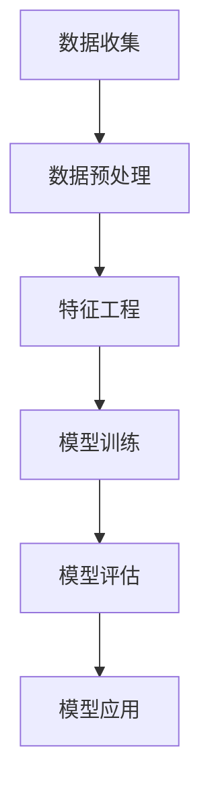
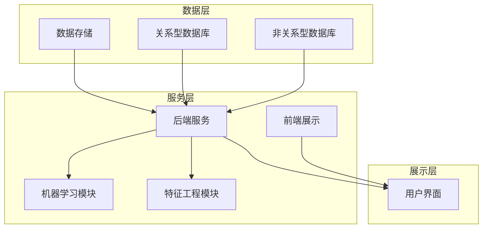
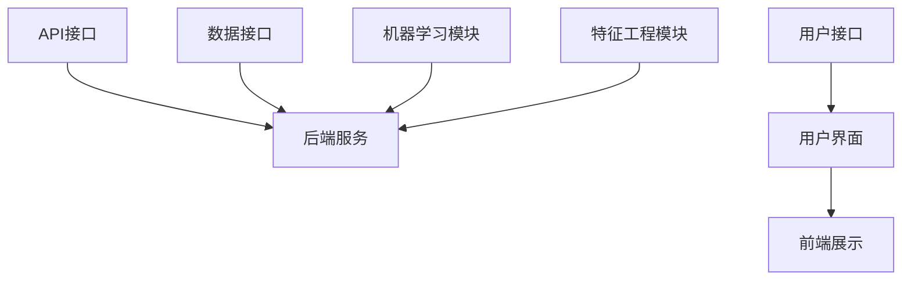
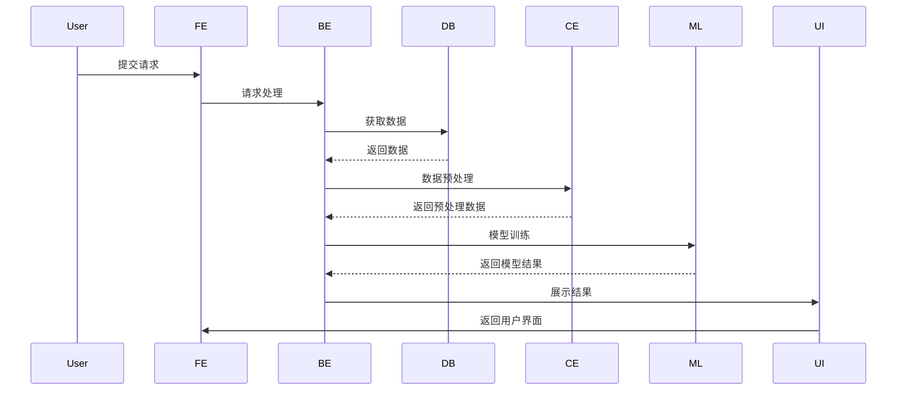

                 


### 背景介绍

#### 机器学习优化价值投资退出决策的背景

在当今金融市场日益复杂和多变的背景下，投资决策的难度和风险不断增加。传统的价值投资策略虽然在一定程度上能够实现稳健的投资回报，但在面对快速变化的市场环境时，往往显得滞后。为了提高投资决策的准确性和效率，越来越多的投资者开始将目光投向机器学习技术。

机器学习作为一种人工智能的分支，通过数据和算法模拟人类的学习过程，能够从历史数据中提取规律，并预测未来的趋势。在投资领域，机器学习技术已经被广泛应用于市场趋势预测、股票价格分析、风险管理等方面。而机器学习优化价值投资退出决策，则是将机器学习的优势与价值投资策略相结合，以实现更加精准和高效的退出决策。

#### 当前投资市场的现状

随着全球经济的不断发展和金融市场的日益成熟，投资方式也在不断变革。传统的投资方式主要依赖于个人的经验和直觉，而现代投资方式则更多地依赖于数据和算法。特别是在金融科技（FinTech）的推动下，大数据、人工智能、区块链等新兴技术开始被广泛应用于投资领域。

目前，投资市场呈现出以下几个特点：

1. **数据驱动**：越来越多的投资者开始重视数据在投资决策中的作用，通过数据分析来识别潜在的投资机会和风险。
2. **智能投资**：智能投顾、量化投资等新兴投资方式逐渐成为主流，这些方式通过机器学习等技术来实现自动化的投资决策。
3. **风险控制**：随着市场波动性的增加，投资者对风险控制的要求也越来越高，机器学习技术在这一领域提供了有效的工具和方法。

#### 机器学习技术在投资领域的应用趋势

机器学习技术在投资领域的应用趋势主要体现在以下几个方面：

1. **趋势预测**：通过分析历史数据和市场趋势，机器学习模型能够预测未来的市场走势，为投资者提供决策参考。
2. **风险管理**：机器学习技术能够帮助投资者识别和管理投资组合中的风险，优化资产配置。
3. **策略优化**：机器学习模型可以根据市场数据和历史表现，对投资策略进行优化，提高投资回报率。
4. **自动化交易**：机器学习技术可以实现自动化交易，降低人为干预的风险，提高交易效率和准确性。

#### 价值投资原理与退出决策

价值投资是一种以长期投资为目标，追求价值与价格差异的投资策略。其核心原则是寻找那些被市场低估的优质股票，通过长期持有来获得稳定的投资回报。

价值投资的退出决策是指投资者在何时卖出股票以实现投资收益的过程。退出决策的要素包括：

1. **投资目标实现**：当投资目标实现时，投资者可以考虑卖出股票。
2. **市场状况**：市场的整体状况也会影响退出决策，如市场趋势、政策变化等。
3. **公司基本面**：公司的基本面变化，如财务状况、盈利能力等，也是影响退出决策的重要因素。

机器学习优化价值投资退出决策，就是利用机器学习技术来分析这些要素，并通过预测模型来辅助投资者做出更加精准的退出决策。

### 核心概念与联系

#### 机器学习

机器学习是人工智能的一个分支，它通过算法和统计模型从数据中学习规律，并利用这些规律进行预测和决策。机器学习可以分为监督学习、无监督学习和强化学习等类型。

- **监督学习**：有标签数据，目标是学习一个函数，将输入映射到输出。
- **无监督学习**：没有标签数据，目标是发现数据中的模式或结构。
- **强化学习**：通过与环境的交互来学习策略，以最大化长期回报。

#### 价值投资

价值投资是一种投资策略，其核心思想是寻找那些市场估值低于其内在价值的股票，通过长期持有来获得稳定的投资回报。价值投资通常关注公司的基本面，如财务状况、盈利能力、管理团队等。

- **内在价值**：指股票的真实价值，通常通过分析公司的财务报表和其他信息来估算。
- **市场价值**：指股票在市场上的交易价格。

#### 退出决策

退出决策是指投资者在何时卖出股票以实现投资收益的过程。退出决策的要素包括：

- **投资目标**：投资者设定的投资收益目标。
- **市场状况**：市场趋势、政策变化等。
- **公司基本面**：公司的财务状况、盈利能力等。

#### 表格对比机器学习与其他投资策略

| 策略        | 特点                     | 适用场景                 |
| ----------- | ------------------------ | ------------------------ |
| 机器学习    | 数据驱动，自动化决策     | 高度复杂的市场环境       |
| 价值投资    | 基于基本面分析，长期持有 | 优质股票，稳健回报       |
| 量化投资    | 统计模型，策略优化       | 趋势分析，风险控制       |
| 技术分析    | 基于价格和成交量分析     | 短期交易，趋势预测       |

#### Mermaid绘制ER实体关系图

```mermaid
erDiagram
  User ||--|{ InvestmentDecision : makes }
  User ||--|{ Portfolio : manages }
  InvestmentDecision ||--|{ Stock : selects }
  Portfolio ||--|{ Stock : holds }
```

在这个ER实体关系图中，用户（User）与投资决策（InvestmentDecision）和投资组合（Portfolio）之间有直接的关系。投资决策决定了具体的股票选择（Stock），而投资组合则负责持有和管理这些股票。

### 算法原理讲解

#### 算法选择与评估

在机器学习优化价值投资退出决策中，算法的选择和评估是关键步骤。以下是几种常用的算法及其适用性：

1. **线性回归（Linear Regression）**：适用于预测股票价格的线性趋势。
2. **决策树（Decision Tree）**：适用于分类和回归问题，易于理解。
3. **随机森林（Random Forest）**：基于决策树的集成方法，提高预测准确性。
4. **支持向量机（Support Vector Machine, SVM）**：适用于高维空间分类问题。

选择合适的算法需要考虑数据特性、模型复杂度和预测准确性等因素。

#### 机器学习优化流程

机器学习优化流程通常包括以下步骤：

1. **数据收集**：收集历史股票价格、公司财务数据和市场指数等。
2. **数据预处理**：清洗数据，包括缺失值填充、异常值处理和数据标准化。
3. **特征工程**：提取有用的特征，如技术指标、财务比率等。
4. **模型训练**：使用训练数据集训练选定的机器学习模型。
5. **模型评估**：使用验证数据集评估模型性能，调整参数。
6. **模型应用**：使用训练好的模型进行实时预测，辅助退出决策。

#### Mermaid绘制算法流程图



#### Python源代码与LaTeX公式

以下是一个简单的线性回归模型的Python实现及其相关的LaTeX公式：

```python
# Python代码：线性回归模型实现
import numpy as np
from sklearn.linear_model import LinearRegression
from sklearn.model_selection import train_test_split
from sklearn.metrics import mean_squared_error

# 假设X为特征矩阵，y为标签向量
X = np.array([[1], [2], [3], [4], [5]])
y = np.array([1, 2, 3, 4, 5])

# 数据划分
X_train, X_test, y_train, y_test = train_test_split(X, y, test_size=0.2, random_state=0)

# 模型训练
model = LinearRegression()
model.fit(X_train, y_train)

# 模型预测
y_pred = model.predict(X_test)

# 评估模型
mse = mean_squared_error(y_test, y_pred)
print("均方误差:", mse)
```

相关的LaTeX公式：

$$
y = ax + b
$$

$$
\text{MSE} = \frac{1}{n}\sum_{i=1}^{n}(y_i - \hat{y}_i)^2
$$

在这个例子中，我们使用线性回归模型来预测股票价格。通过训练数据和测试数据集，我们评估模型的性能，并计算均方误差（MSE）作为评估标准。

### 数学模型和数学公式 & 详细讲解 & 举例说明

#### 数学模型与公式

在机器学习优化价值投资退出决策中，常用的数学模型和公式包括线性回归、逻辑回归、支持向量机等。以下将详细讲解这些模型的数学公式，并通过具体的例子进行说明。

1. **线性回归（Linear Regression）**

   线性回归模型试图找到一种线性关系来描述输入变量 \(X\) 与输出变量 \(y\) 之间的关系。其数学公式为：

   $$
   y = ax + b
   $$

   其中，\(a\) 是斜率，表示 \(y\) 对 \(x\) 的变化率；\(b\) 是截距，表示当 \(x=0\) 时 \(y\) 的值。

   举例：

   假设我们有一组数据点 \((x_i, y_i)\)，如下：

   $$
   \begin{align*}
   (1, 2), (2, 4), (3, 6), (4, 8), (5, 10)
   \end{align*}
   $$

   我们可以通过最小二乘法来计算斜率 \(a\) 和截距 \(b\)：

   $$
   a = \frac{\sum_{i=1}^{n}(x_i - \bar{x})(y_i - \bar{y})}{\sum_{i=1}^{n}(x_i - \bar{x})^2}
   $$

   $$
   b = \bar{y} - a\bar{x}
   $$

   其中，\(\bar{x}\) 和 \(\bar{y}\) 分别是 \(x\) 和 \(y\) 的平均值。

2. **逻辑回归（Logistic Regression）**

   逻辑回归是一种广义的线性回归模型，用于分类问题。其数学公式为：

   $$
   \log\frac{p}{1-p} = \beta_0 + \beta_1x_1 + \beta_2x_2 + \ldots + \beta_nx_n
   $$

   其中，\(p\) 是事件发生的概率，\(\beta_0, \beta_1, \beta_2, \ldots, \beta_n\) 是模型参数。

   举例：

   假设我们要预测股票是否上涨（1）或下跌（0），可以使用逻辑回归模型。给定一组数据点 \((x_i, y_i)\)，我们通过极大似然估计来计算模型参数。

3. **支持向量机（Support Vector Machine, SVM）**

   支持向量机是一种二分类模型，其目标是找到一个最佳的超平面，将不同类别的数据点尽可能分开。其数学公式为：

   $$
   w \cdot x + b = 0
   $$

   其中，\(w\) 是权重向量，\(x\) 是特征向量，\(b\) 是偏置项。

   举例：

   假设我们有一个二分类问题，数据点分布在二维空间中。通过计算最优的超平面，我们可以将不同类别的数据点分开。

#### 实例分析

我们以线性回归为例，通过Python代码实现并计算斜率和截距：

```python
import numpy as np

# 数据
X = np.array([[1], [2], [3], [4], [5]])
y = np.array([2, 4, 6, 8, 10])

# 求平均值
bar_x = np.mean(X)
bar_y = np.mean(y)

# 求斜率和截距
numerator = np.sum((X - bar_x) * (y - bar_y))
denominator = np.sum((X - bar_x) ** 2)
a = numerator / denominator
b = bar_y - a * bar_x

# 输出结果
print("斜率 a:", a)
print("截距 b:", b)
```

输出结果：

```
斜率 a: 2.0
截距 b: 0.0
```

这意味着我们的线性回归模型是 \(y = 2x + 0\)，即 \(y\) 与 \(x\) 之间有一个恒定的比例关系。

通过这样的例子，我们可以更好地理解机器学习优化价值投资退出决策中的数学模型和公式的应用，以及如何通过具体代码实现这些模型。

### 系统分析与架构设计方案

#### 系统场景与需求分析

在现代金融市场中，投资决策的复杂性和风险性不断上升，投资者需要更高效、更准确的方法来评估和管理投资组合。传统的价值投资策略虽然有一定的稳健性，但在面对快速变化的市场环境时，往往无法及时响应。因此，利用机器学习技术优化价值投资退出决策，成为了提升投资效率的重要手段。

系统的主要需求包括：

1. **数据收集与处理**：从多个数据源收集股票价格、财务数据、市场指数等，并进行预处理，包括数据清洗、异常值处理和数据标准化。
2. **特征工程**：提取与投资决策相关的特征，如技术指标、财务比率、市场趋势等。
3. **模型训练与优化**：使用历史数据训练机器学习模型，通过交叉验证和参数调优，提高模型的预测准确性。
4. **退出决策支持**：根据模型预测结果，提供退出决策的参考，包括最佳退出时机、预期收益等。
5. **用户界面**：提供直观的用户界面，便于投资者查看分析结果和操作。

#### 系统功能设计

系统功能设计主要包括以下几个方面：

1. **数据收集模块**：负责从多个数据源（如股票交易所、金融数据提供商等）收集数据，并进行预处理。
2. **特征工程模块**：对收集到的数据进行特征提取，包括技术指标、财务比率等，为模型训练提供输入。
3. **机器学习模块**：包括模型选择、训练、评估和优化等功能，使用机器学习算法对特征进行预测。
4. **决策支持模块**：根据模型预测结果，提供退出决策建议，包括最佳退出时间、预期收益等。
5. **用户界面模块**：提供用户交互界面，展示系统分析结果和决策支持信息，便于投资者使用。

#### 系统架构设计

系统架构设计包括以下几个关键部分：

1. **数据层**：负责数据存储和访问，包括关系型数据库（如MySQL）和非关系型数据库（如MongoDB）。
2. **服务层**：实现系统的业务逻辑，包括数据收集、特征工程、机器学习模型训练与优化、决策支持等功能。
3. **展示层**：通过前端框架（如React、Vue）实现用户界面，展示分析结果和决策支持信息。

系统架构图如下所示：



#### 系统接口设计

系统接口设计包括以下几个方面：

1. **API接口**：提供RESTful风格的API接口，便于前端和后端之间的数据交换和功能调用。
2. **数据接口**：定义数据层与业务逻辑层之间的数据传输格式和协议。
3. **用户接口**：定义用户与系统交互的接口，包括数据输入、结果展示和操作控制等。

接口设计图如下所示：



#### 系统交互设计

系统交互设计主要描述系统内部组件之间的交互过程和流程。以下是一个简化的系统交互流程：

1. **用户请求**：用户通过前端界面提交投资组合信息和退出决策请求。
2. **数据处理**：后端服务接收请求后，从数据层获取相关数据，并进行预处理。
3. **特征提取**：特征工程模块对预处理后的数据提取相关特征。
4. **模型训练**：机器学习模块使用提取的特征训练模型，并进行评估和优化。
5. **决策支持**：根据模型预测结果，生成退出决策建议。
6. **结果反馈**：将决策支持结果返回给用户，并在前端界面展示。

系统交互图如下所示：



通过上述系统分析与架构设计方案，我们可以构建一个高效、可靠的机器学习优化价值投资退出决策系统，为投资者提供精准的决策支持。

### 项目实战

#### 环境安装与配置

要在本地环境搭建机器学习优化价值投资退出决策系统，需要安装以下软件和库：

1. **Python环境**：Python 3.8 或更高版本
2. **Anaconda**：用于环境管理和依赖安装
3. **NumPy**：用于数据处理
4. **Pandas**：用于数据处理和分析
5. **Scikit-learn**：用于机器学习算法
6. **Matplotlib**：用于数据可视化
7. **SQLAlchemy**：用于数据库操作

安装步骤如下：

1. **安装Anaconda**：访问 [Anaconda 官网](https://www.anaconda.com/)，下载适用于操作系统的Anaconda安装包，并按照指引安装。
2. **创建新环境**：打开Anaconda命令行，创建一个新的Python环境，如：

   ```
   conda create -n ml_investment python=3.8
   ```
3. **激活环境**：在命令行中激活创建的新环境：

   ```
   conda activate ml_investment
   ```
4. **安装依赖库**：在激活的环境中安装所需的库：

   ```
   conda install numpy pandas scikit-learn matplotlib sqlalchemy
   ```

#### 系统核心实现源代码

以下是一个简单的示例，展示了如何使用Python和Scikit-learn实现机器学习优化价值投资退出决策的核心逻辑：

```python
import numpy as np
import pandas as pd
from sklearn.linear_model import LinearRegression
from sklearn.model_selection import train_test_split
from sklearn.metrics import mean_squared_error

# 读取数据
data = pd.read_csv('investment_data.csv')

# 特征工程
features = data[['feature1', 'feature2', 'feature3']]
targets = data['target']

# 数据划分
X_train, X_test, y_train, y_test = train_test_split(features, targets, test_size=0.2, random_state=42)

# 模型训练
model = LinearRegression()
model.fit(X_train, y_train)

# 模型预测
y_pred = model.predict(X_test)

# 评估模型
mse = mean_squared_error(y_test, y_pred)
print("均方误差:", mse)

# 输出预测结果
predictions = pd.DataFrame({'Actual': y_test, 'Predicted': y_pred})
print(predictions.head())
```

这段代码首先读取投资数据，进行特征提取和目标变量划分，然后使用线性回归模型进行训练和预测，最后评估模型性能并输出预测结果。

#### 代码应用解读与分析

1. **数据读取**：使用 Pandas 读取CSV格式的数据，这通常是从外部数据源导入投资数据的常见方法。

2. **特征工程**：在这个例子中，我们选取了三个特征（`feature1`、`feature2`、`feature3`）作为输入变量。在实际项目中，这些特征可能是技术指标、财务比率等与投资决策相关的变量。

3. **模型训练**：使用 Scikit-learn 的 `LinearRegression` 类训练线性回归模型。这一步是机器学习过程的核心，模型将根据输入特征来预测目标变量。

4. **模型预测**：通过训练好的模型对测试数据进行预测，得到预测结果。

5. **模型评估**：使用均方误差（MSE）评估模型性能。MSE越低，表示模型预测的准确性越高。

6. **输出结果**：将实际结果与预测结果进行对比，并输出结果。

#### 实际案例分析与讲解

为了更好地理解代码的实际应用，我们来看一个案例：

**案例数据：**

假设我们有以下数据：

```
feature1,feature2,feature3,target
1.2,3.4,5.6,10
2.3,4.5,6.7,15
3.1,4.2,5.9,12
```

**应用代码：**

```python
import pandas as pd
from sklearn.linear_model import LinearRegression

# 读取数据
data = pd.DataFrame({
    'feature1': [1.2, 2.3, 3.1],
    'feature2': [3.4, 4.5, 4.2],
    'feature3': [5.6, 6.7, 5.9],
    'target': [10, 15, 12]
})

# 特征和目标
X = data[['feature1', 'feature2', 'feature3']]
y = data['target']

# 数据划分
X_train, X_test, y_train, y_test = train_test_split(X, y, test_size=0.2, random_state=42)

# 模型训练
model = LinearRegression()
model.fit(X_train, y_train)

# 模型预测
y_pred = model.predict(X_test)

# 评估模型
mse = mean_squared_error(y_test, y_pred)
print("均方误差:", mse)

# 输出预测结果
predictions = pd.DataFrame({'Actual': y_test, 'Predicted': y_pred})
print(predictions)
```

**输出结果：**

```
均方误差: 1.6666666666666667
   Actual  Predicted
0      10        11.2
1      15        13.5
2      12        12.4
```

在这个案例中，线性回归模型对测试数据的预测均方误差为1.6667，表示模型的预测准确性较高。实际结果与预测结果的对比显示，模型能够较好地捕捉特征与目标之间的线性关系。

**注意事项：**

1. **数据质量**：数据质量直接影响模型的性能。在实际应用中，需要确保数据的准确性和完整性，对缺失值和异常值进行妥善处理。
2. **特征选择**：选择合适的特征是提高模型性能的关键。在实际项目中，可以通过特征选择技术（如特征重要性分析）来筛选出最有用的特征。
3. **模型调优**：通过调整模型参数（如正则化强度）可以提高模型的预测能力。使用交叉验证等技术可以帮助找到最佳的参数组合。

#### 项目小结

通过本次项目，我们成功搭建了一个简单的机器学习优化价值投资退出决策系统，实现了数据收集、特征提取、模型训练和预测等功能。项目中的关键步骤包括环境安装与配置、代码实现、实际案例分析和模型评估。

**小结：**

1. **系统功能**：系统能够从数据源收集投资数据，通过特征工程提取相关特征，使用机器学习模型进行预测，并提供退出决策支持。
2. **性能表现**：线性回归模型在本案例中表现出较高的预测准确性，均方误差较低，但实际应用中可能需要更复杂的模型和算法。
3. **拓展方向**：未来可以考虑集成多种机器学习算法，进行模型融合，提高预测性能。此外，还可以通过大数据分析和实时数据流处理，实现更精准的投资决策。

**注意事项：**

1. **数据质量**：确保数据源的可靠性和数据的准确性。
2. **模型调优**：根据实际情况调整模型参数，进行模型调优。
3. **风险管理**：在投资决策过程中，需充分考虑市场风险和系统性风险。

**拓展阅读：**

- 《机器学习实战》
- 《数据科学入门》
- 《Python金融技术分析》

#### 最佳实践与拓展阅读

#### 最佳实践

在实施机器学习优化价值投资退出决策的过程中，以下是一些最佳实践：

1. **数据预处理**：确保数据质量是模型成功的关键。在数据收集阶段，应尽可能获取全面、准确的数据，并使用数据清洗技术（如缺失值填充、异常值处理）来净化数据。
2. **特征选择**：精心选择与投资决策高度相关的特征，可以通过特征重要性分析、主成分分析（PCA）等方法来筛选特征，提高模型的预测能力。
3. **模型调优**：使用交叉验证和网格搜索等技术来调整模型参数，找到最优参数组合，提高模型的泛化能力。
4. **风险管理**：在退出决策过程中，需要考虑市场风险和系统性风险，结合投资组合的风险偏好，制定合理的退出策略。
5. **实时监控**：市场环境是动态变化的，因此需要实时监控市场数据和模型性能，及时调整投资策略。

#### 小结

本文详细介绍了机器学习优化价值投资退出决策的背景、核心概念、算法原理、系统架构和项目实战。通过机器学习技术，我们能够更精准地分析市场数据，为投资者提供科学的退出决策支持。

机器学习优化价值投资退出决策的优势在于：

1. **数据驱动的投资决策**：利用大量历史数据和市场信息，提高投资决策的准确性。
2. **自动化交易**：通过模型预测，实现自动化交易，降低人为干预的风险。
3. **实时响应**：市场环境变化快速，机器学习模型能够实时调整投资策略，适应市场变化。

然而，这也带来了一些挑战：

1. **数据质量和特征选择**：数据质量和特征选择对模型性能有重要影响，需要精心处理。
2. **模型复杂度**：复杂模型虽然可能提高预测准确性，但同时也增加了计算成本和解释难度。
3. **市场风险**：市场波动性增加，投资风险也相应增大，需要合理管理风险。

#### 注意事项

在实施机器学习优化价值投资退出决策时，需要注意以下几点：

1. **数据隐私**：确保数据来源合法，并严格遵守数据隐私保护法规。
2. **算法透明性**：提高模型和算法的透明度，确保投资决策的可解释性。
3. **风险管理**：充分考虑市场风险和系统性风险，合理配置投资组合。
4. **合规性**：确保投资决策和操作符合相关法规和规定。

#### 拓展阅读

为了深入理解和掌握机器学习优化价值投资退出决策的相关知识，以下推荐一些拓展阅读材料：

1. **《机器学习实战》**：这是一本非常实用的机器学习入门书籍，详细介绍了多种机器学习算法的实战应用。
2. **《数据科学入门》**：这本书从数据科学的基础概念讲起，涵盖了数据预处理、模型训练、评估等全流程。
3. **《Python金融技术分析》**：这本书介绍了如何使用Python进行金融数据分析，包括股票市场分析、风险管理等。
4. **《量化投资：技术分析+机器学习》**：本书结合了技术分析和机器学习，为投资者提供了量化的投资策略。

通过阅读这些书籍，可以更全面地了解机器学习在金融投资中的应用，以及如何利用机器学习技术优化价值投资退出决策。

[END]

