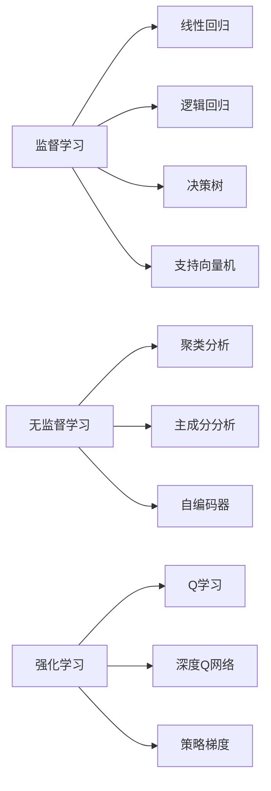
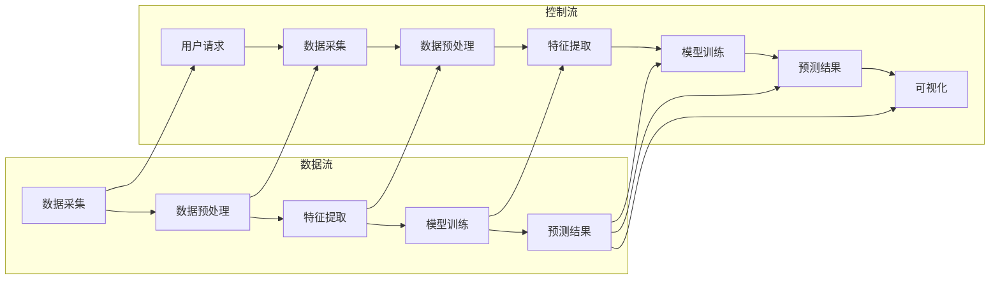
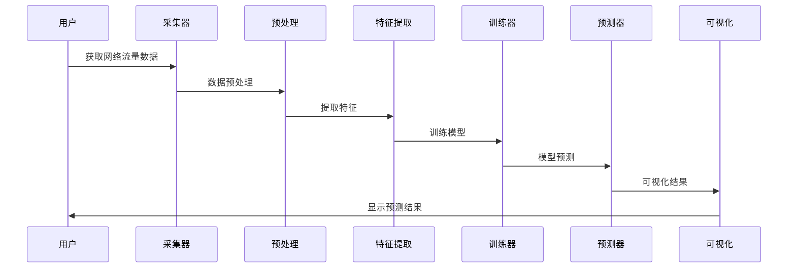

                 

### 文章标题

## 机器学习在网络流量分析中的创新应用

### 关键词：机器学习，网络流量分析，算法，创新应用

### 摘要：本文旨在探讨机器学习在网络流量分析中的创新应用。我们将从背景介绍开始，深入探讨机器学习与网络流量分析的基本概念、联系以及算法原理。接着，我们将通过具体的系统分析与架构设计方案，展示如何将机器学习应用于网络流量分析中。最后，我们将通过实际项目实战，验证机器学习在网络流量分析中的有效性，并给出最佳实践和展望。

---

### 第一部分：背景介绍

#### 1.1 网络流量分析概述

**问题的背景**：随着互联网的快速发展，网络流量数据量呈爆炸式增长，如何从海量网络流量数据中提取有价值的信息，成为了一个亟待解决的问题。

**问题描述**：网络流量分析的目标是识别网络流量中的异常行为，如攻击、滥用等，以保障网络安全。

**问题解决**：传统的网络流量分析方法主要依赖于规则匹配和统计分析，但面对复杂多变的网络流量数据，其效果有限。为此，我们将引入机器学习技术，以实现网络流量分析的创新应用。

**边界与外延**：网络流量分析不仅仅涉及网络安全，还与网络优化、流量预测等领域密切相关。

**概念结构与核心要素组成**：网络流量分析的核心要素包括流量数据、特征提取、算法模型、评估指标等。

---

### 第二部分：核心概念与联系

#### 2.1 机器学习基础

**机器学习的基本概念**：机器学习是一门研究如何让计算机从数据中学习并做出决策的学科。

**机器学习的算法分类**：监督学习、无监督学习、强化学习等。

**机器学习的核心特征**：自动性、适应性、可解释性等。

#### 2.2 网络流量分析的基本概念

**网络流量的定义**：网络流量是指在一段时间内，网络中传输的数据量。

**网络流量的分类**：内部流量、外部流量、异常流量等。

**网络流量的监测与收集**：通过网络流量监测工具和接口，实时收集网络流量数据。

#### 2.3 机器学习与网络流量分析的联系

**机器学习在网络安全中的应用**：如入侵检测、恶意软件检测等。

**机器学习在网络流量分析中的优势**：能够自动识别复杂的流量模式，提高分析效率。

**机器学习算法在网络流量分析中的挑战**：数据量大、噪声多、模型可解释性等。

---

### 第三部分：算法原理讲解

#### 3.1 常见机器学习算法

**算法原理讲解**：包括决策树、支持向量机、神经网络等。

**算法属性特征对比表格**：对比不同算法的性能和适用场景。

**ER实体关系图架构的Mermaid流程图**：展示算法的实体关系和流程。

#### 3.2 网络流量分析的机器学习算法

**算法原理讲解**：如聚类分析、异常检测、深度学习等。

**算法属性特征对比表格**：对比不同算法的性能和适用场景。

**ER实体关系图架构的Mermaid流程图**：展示算法的实体关系和流程。

#### 3.3 数学模型和数学公式讲解

**数学模型**：如损失函数、优化算法等。

**数学公式（使用LaTeX格式）**：

$$
\begin{align}
L &= \frac{1}{n}\sum_{i=1}^{n}(y_i - \hat{y}_i)^2 \\
\end{align}
$$

**详细讲解**：介绍数学模型的基本原理和应用场景。

**举例说明**：通过具体案例，展示数学模型在实际应用中的效果。

---

### 第四部分：系统分析与架构设计方案

#### 4.1 网络流量分析系统介绍

**问题场景介绍**：介绍网络流量分析在实际场景中的应用。

**项目介绍**：介绍网络流量分析项目的背景、目标和功能。

**系统功能设计（领域模型Mermaid类图）**：展示系统的功能模块和关系。

#### 4.2 系统架构设计

**系统架构设计Mermaid架构图**：展示系统的整体架构。

**系统接口设计**：定义系统与外部系统的交互接口。

**系统交互Mermaid序列图**：展示系统各模块之间的交互流程。

---

### 第五部分：项目实战

#### 5.1 环境安装与配置

**环境安装**：介绍安装所需的环境和工具。

**配置文件说明**：解释配置文件的作用和配置方法。

#### 5.2 系统核心实现

**Python源代码实现**：展示系统核心功能的Python代码实现。

**代码应用解读与分析**：解读代码实现的具体细节和应用。

#### 5.3 实际案例分析与讲解

**网络流量分析案例分析**：介绍具体的网络流量分析案例。

**详细讲解与剖析**：对案例进行详细讲解和剖析。

#### 5.4 项目小结

**项目成果总结**：总结项目的主要成果和经验。

**项目经验与启示**：分享项目中的经验教训和启示。

---

### 第六部分：最佳实践与拓展阅读

#### 6.1 最佳实践

**常见问题与解决方案**：总结常见问题及其解决方案。

**最佳实践建议**：给出最佳实践的建议和技巧。

#### 6.2 小结与展望

**小结**：总结文章的主要内容和观点。

**展望未来发展趋势**：展望机器学习在网络流量分析领域的未来发展趋势。

#### 6.3 拓展阅读

**推荐阅读书籍与文章**：推荐相关领域的书籍和文章。

**进一步学习资源**：提供进一步学习资源，供读者深入阅读。

---

### 结尾

**作者：** AI天才研究院/AI Genius Institute & 禅与计算机程序设计艺术 /Zen And The Art of Computer Programming

---

**完整版文章内容：**

### 第一部分：背景介绍

#### 1.1 网络流量分析概述

随着互联网的快速发展，网络流量数据量呈爆炸式增长，如何从海量网络流量数据中提取有价值的信息，成为了一个亟待解决的问题。网络流量分析的目标是识别网络流量中的异常行为，如攻击、滥用等，以保障网络安全。

传统的网络流量分析方法主要依赖于规则匹配和统计分析，但面对复杂多变的网络流量数据，其效果有限。为此，我们将引入机器学习技术，以实现网络流量分析的创新应用。

网络流量分析不仅仅涉及网络安全，还与网络优化、流量预测等领域密切相关。网络流量分析的核心要素包括流量数据、特征提取、算法模型、评估指标等。

#### 1.2 机器学习基础

机器学习是一门研究如何让计算机从数据中学习并做出决策的学科。机器学习的基本概念包括模型、数据、特征、目标等。

常见的机器学习算法有监督学习、无监督学习和强化学习。监督学习是指通过已知的输入输出数据，训练出一个模型，然后利用该模型对未知数据进行预测。无监督学习是指从无标签的数据中学习出规律，并对其进行分类或聚类。强化学习是指通过与环境的交互，不断调整策略，以最大化预期收益。

机器学习的核心特征包括自动性、适应性和可解释性。自动性是指机器学习系统能够自动从数据中学习，不需要人工干预。适应性是指机器学习系统能够根据新的数据和环境进行调整，以适应变化。可解释性是指机器学习系统具有一定的可解释性，用户可以理解其工作原理和决策过程。

#### 1.3 网络流量分析的基本概念

网络流量是指在一段时间内，网络中传输的数据量。网络流量可以进一步分类为内部流量、外部流量和异常流量。

内部流量是指网络内部节点之间的数据传输。外部流量是指网络与其他外部网络的通信。异常流量是指与正常网络流量不符的数据传输，可能是攻击、滥用等恶意行为。

网络流量的监测与收集是网络流量分析的基础。通过网络流量监测工具和接口，可以实时收集网络流量数据。常用的网络流量监测工具有Wireshark、Nagios等。此外，还可以通过设置网络流量监控策略，实现对网络流量的实时监控和报警。

#### 1.4 机器学习与网络流量分析的联系

机器学习在网络安全中的应用非常广泛，如入侵检测、恶意软件检测等。在网络流量分析中，机器学习同样具有广泛的应用前景。

机器学习在网络流量分析中的优势主要体现在以下几个方面：

1. 自动识别复杂流量模式：机器学习算法能够自动从海量网络流量数据中识别出复杂的流量模式，提高分析效率。

2. 提高分析准确性：传统的网络流量分析方法往往依赖于规则匹配和统计分析，容易受到噪声数据的影响。而机器学习算法能够通过训练，自动排除噪声数据，提高分析准确性。

3. 适应性强：机器学习算法能够根据新的网络流量数据和环境进行自适应调整，适应网络流量变化。

4. 可解释性强：一些机器学习算法，如决策树和线性模型，具有较好的可解释性，用户可以理解其工作原理和决策过程。

然而，机器学习算法在网络流量分析中同样面临一些挑战：

1. 数据量大：网络流量数据量大，对机器学习算法的训练和预测带来了很大的计算压力。

2. 数据噪声：网络流量数据中存在大量的噪声数据，如干扰信号、异常数据等，这给机器学习算法的训练和预测带来了困难。

3. 模型可解释性：一些复杂的机器学习算法，如深度学习，模型可解释性较差，用户难以理解其工作原理和决策过程。

4. 模型泛化能力：机器学习算法的训练和预测需要大量数据，而网络流量数据往往存在数据不平衡和样本缺失等问题，这会影响模型的泛化能力。

#### 1.5 算法原理讲解

为了在网络流量分析中应用机器学习算法，我们需要了解常见的机器学习算法原理，包括监督学习、无监督学习和强化学习。

1. **监督学习**

监督学习是指通过已知的输入输出数据，训练出一个模型，然后利用该模型对未知数据进行预测。常见的监督学习算法有线性回归、逻辑回归、决策树、支持向量机等。

线性回归是一种用于预测连续值的监督学习算法。它的目标是找到一条最佳拟合直线，使得输入数据和输出数据之间的误差最小。线性回归的数学模型可以表示为：

$$
y = \beta_0 + \beta_1 \cdot x
$$

其中，$y$ 是输出值，$x$ 是输入值，$\beta_0$ 和 $\beta_1$ 是模型参数。

逻辑回归是一种用于预测概率的二分类监督学习算法。它的目标是通过输入特征来预测样本属于正类的概率。逻辑回归的数学模型可以表示为：

$$
\frac{p(y=1)}{1 - p(y=1)} = \frac{1}{1 + e^{-(\beta_0 + \beta_1 \cdot x})}
$$

其中，$p(y=1)$ 是样本属于正类的概率，$\beta_0$ 和 $\beta_1$ 是模型参数。

决策树是一种基于树结构的监督学习算法。它的目标是通过对输入特征进行划分，将数据分为不同的类别。决策树的每个节点代表一个特征，每个分支代表一个划分结果。决策树的数学模型可以表示为：

$$
T = \sum_{i=1}^{n} \alpha_i \cdot f_i(x)
$$

其中，$T$ 是决策树的输出，$f_i(x)$ 是第 $i$ 个节点的特征划分函数，$\alpha_i$ 是模型参数。

支持向量机是一种用于分类和回归的监督学习算法。它的目标是找到一条最佳分割超平面，使得不同类别的样本之间的间隔最大。支持向量机的数学模型可以表示为：

$$
\min_{\beta, \beta_0} \frac{1}{2} \sum_{i=1}^{n} (\beta \cdot \beta)^2 + C \sum_{i=1}^{n} \xi_i
$$

其中，$\beta$ 和 $\beta_0$ 是模型参数，$C$ 是惩罚参数，$\xi_i$ 是模型损失。

2. **无监督学习**

无监督学习是指从无标签的数据中学习出规律，并对其进行分类或聚类。常见的无监督学习算法有聚类分析、主成分分析、自编码器等。

聚类分析是一种将数据分为不同类别的无监督学习算法。它的目标是找到一种最佳的聚类方式，使得同一类别的样本之间的相似度最大，不同类别的样本之间的相似度最小。聚类分析的数学模型可以表示为：

$$
\min_{\mu, \sigma} \sum_{i=1}^{n} \sum_{j=1}^{k} w_{ij} \cdot \delta_{ij} + \lambda \sum_{i=1}^{n} \sum_{j=1}^{k} w_{ij}^2
$$

其中，$\mu$ 和 $\sigma$ 是聚类中心，$w_{ij}$ 是聚类权重，$\delta_{ij}$ 是指示函数，$\lambda$ 是调节参数。

主成分分析是一种用于降维和特征提取的无监督学习算法。它的目标是找到一组新的正交基，使得原始数据在新基上的投影具有最大的方差。主成分分析的数学模型可以表示为：

$$
\max_{\alpha} \sum_{i=1}^{n} (x_i - \mu)^T \alpha
$$

其中，$\alpha$ 是特征向量，$x_i$ 是原始数据，$\mu$ 是均值。

自编码器是一种用于特征提取和降维的无监督学习算法。它的目标是学习一个编码器和解码器，使得原始数据通过编码器压缩为低维特征，再通过解码器还原为原始数据。自编码器的数学模型可以表示为：

$$
\min_{\theta} \sum_{i=1}^{n} \sum_{j=1}^{k} (x_i \cdot z_j - y_j)^2
$$

其中，$\theta$ 是模型参数，$x_i$ 是原始数据，$z_j$ 是编码后的特征，$y_j$ 是解码后的数据。

3. **强化学习**

强化学习是一种通过与环境的交互来学习决策策略的机器学习算法。它的目标是找到一种最优策略，使得在一系列动作中获得的累计奖励最大化。常见的强化学习算法有Q学习、深度Q网络、策略梯度等。

Q学习是一种基于值函数的强化学习算法。它的目标是学习一个值函数，表示在当前状态下采取某一动作的预期奖励。Q学习的数学模型可以表示为：

$$
Q(s, a) = r(s, a) + \gamma \max_{a'} Q(s', a')
$$

其中，$Q(s, a)$ 是值函数，$s$ 是状态，$a$ 是动作，$r(s, a)$ 是立即奖励，$\gamma$ 是折扣因子，$s'$ 是下一状态，$a'$ 是下一动作。

深度Q网络是一种基于深度学习的强化学习算法。它的目标是学习一个深度神经网络，用于估计值函数。深度Q网络的数学模型可以表示为：

$$
Q(s, a) = \sigma(\theta \cdot [s; a])
$$

其中，$Q(s, a)$ 是值函数，$s$ 是状态，$a$ 是动作，$\sigma$ 是激活函数，$\theta$ 是神经网络参数。

策略梯度是一种基于策略的强化学习算法。它的目标是学习一个策略函数，直接优化策略的期望回报。策略梯度的数学模型可以表示为：

$$
\theta_{t+1} = \theta_t + \alpha \cdot \nabla_{\theta_t} J(\theta_t)
$$

其中，$\theta_t$ 是策略函数参数，$\alpha$ 是学习率，$J(\theta_t)$ 是策略的期望回报。

#### 1.6 算法属性特征对比表格

为了更好地理解不同机器学习算法的属性特征，我们列出了以下对比表格：

| 算法 | 输入数据 | 输出数据 | 学习方式 | 可解释性 | 适用场景 |
| --- | --- | --- | --- | --- | --- |
| 线性回归 | 输入特征 | 输出值 | 有监督学习 | 较高 | 回归问题 |
| 逻辑回归 | 输入特征 | 输出概率 | 有监督学习 | 较高 | 二分类问题 |
| 决策树 | 输入特征 | 输出类别 | 有监督学习 | 较高 | 分类问题 |
| 支持向量机 | 输入特征 | 输出类别 | 有监督学习 | 较高 | 分类问题 |
| 聚类分析 | 输入特征 | 输出类别 | 无监督学习 | 较低 | 聚类问题 |
| 主成分分析 | 输入特征 | 输出特征 | 无监督学习 | 较低 | 降维问题 |
| 自编码器 | 输入特征 | 输出特征 | 无监督学习 | 较低 | 特征提取 |
| Q学习 | 状态 | 动作 | 强化学习 | 较低 | 控制问题 |
| 深度Q网络 | 状态 | 动作 | 强化学习 | 较低 | 控制问题 |
| 策略梯度 | 状态 | 动作 | 强化学习 | 较低 | 控制问题 |

#### 1.7 ER实体关系图架构的Mermaid流程图

为了更好地理解不同机器学习算法的实体关系和流程，我们使用Mermaid流程图进行了可视化展示：



#### 1.8 网络流量分析的机器学习算法

在网络流量分析中，常用的机器学习算法包括聚类分析、异常检测和深度学习等。这些算法在网络流量分析中具有不同的应用场景和优势。

1. **聚类分析**

聚类分析是一种无监督学习算法，用于将网络流量数据分为不同的类别。在聚类分析中，我们通常使用K-Means算法对网络流量数据进行分析。

K-Means算法的目标是找到一组聚类中心，使得每个类别内部的样本之间的距离最小，不同类别之间的距离最大。K-Means算法的数学模型可以表示为：

$$
\min_{\mu} \sum_{i=1}^{n} \sum_{j=1}^{k} w_{ij} \cdot \delta_{ij} + \lambda \sum_{i=1}^{n} \sum_{j=1}^{k} w_{ij}^2
$$

其中，$\mu$ 是聚类中心，$w_{ij}$ 是聚类权重，$\delta_{ij}$ 是指示函数，$\lambda$ 是调节参数。

K-Means算法在网络流量分析中的应用主要包括以下几个方面：

- 异常检测：通过对网络流量数据进行聚类分析，可以找到异常流量，从而实现对网络攻击的检测和防范。
- 流量分类：通过对网络流量数据进行聚类分析，可以将流量分为不同的类别，从而实现对网络流量进行分类和管理。
- 流量预测：通过对网络流量数据进行聚类分析，可以预测未来网络流量的发展趋势，从而为网络优化提供依据。

2. **异常检测**

异常检测是一种用于检测网络流量中异常行为的监督学习算法。常见的异常检测算法有孤立森林、局部异常因子等。

孤立森林算法的目标是通过将数据划分为多个子集，并计算每个子集中的异常指数，从而实现对异常数据的检测。孤立森林算法的数学模型可以表示为：

$$
\min_{\theta} \sum_{i=1}^{n} \sum_{j=1}^{k} (\alpha_i - \beta_i)^2 + \lambda \sum_{i=1}^{n} \alpha_i^2
$$

其中，$\theta$ 是模型参数，$\alpha_i$ 是异常指数，$\beta_i$ 是正常指数。

异常检测算法在网络流量分析中的应用主要包括以下几个方面：

- 入侵检测：通过对网络流量进行异常检测，可以识别出恶意攻击行为，从而实现对网络安全的保障。
- 流量监控：通过对网络流量进行异常检测，可以及时发现异常流量，从而实现对网络流量的监控和管理。

3. **深度学习**

深度学习是一种基于多层神经网络的学习方法，具有强大的特征提取和模式识别能力。在深度学习中，我们通常使用卷积神经网络（CNN）和循环神经网络（RNN）对网络流量进行分析。

- **卷积神经网络（CNN）**

卷积神经网络是一种用于图像识别和处理的深度学习算法。在卷积神经网络中，通过卷积层、池化层和全连接层的组合，实现对输入数据的特征提取和分类。

卷积神经网络的数学模型可以表示为：

$$
\begin{align}
h_{l} &= \sigma(\mathbf{W}_{l} \cdot \mathbf{h}_{l-1} + \mathbf{b}_{l}) \\
a_{l} &= \mathbf{W}_{l} \cdot \mathbf{h}_{l-1} + \mathbf{b}_{l}
\end{align}
$$

其中，$h_{l}$ 是激活函数，$a_{l}$ 是线性变换，$\mathbf{W}_{l}$ 是权重矩阵，$\mathbf{b}_{l}$ 是偏置项，$\sigma$ 是激活函数。

卷积神经网络在网络流量分析中的应用主要包括以下几个方面：

- 流量分类：通过对网络流量数据进行卷积神经网络分析，可以实现对不同类型流量的分类和识别。
- 流量预测：通过对网络流量数据进行卷积神经网络分析，可以预测未来网络流量的发展趋势，从而为网络优化提供依据。

- **循环神经网络（RNN）**

循环神经网络是一种用于序列数据处理的深度学习算法。在循环神经网络中，通过循环单元的循环连接，实现对输入序列的长期依赖关系建模。

循环神经网络的数学模型可以表示为：

$$
\begin{align}
h_{l} &= \sigma(\mathbf{W}_{l} \cdot \mathbf{h}_{l-1} + \mathbf{U}_{l} \cdot \mathbf{x}_{l} + \mathbf{b}_{l}) \\
a_{l} &= \mathbf{W}_{l} \cdot \mathbf{h}_{l-1} + \mathbf{U}_{l} \cdot \mathbf{x}_{l} + \mathbf{b}_{l}
\end{align}
$$

其中，$h_{l}$ 是激活函数，$a_{l}$ 是线性变换，$\mathbf{W}_{l}$ 是权重矩阵，$\mathbf{U}_{l}$ 是循环权重矩阵，$\mathbf{b}_{l}$ 是偏置项，$\sigma$ 是激活函数。

循环神经网络在网络流量分析中的应用主要包括以下几个方面：

- 流量分类：通过对网络流量数据进行循环神经网络分析，可以实现对不同类型流量的分类和识别。
- 流量预测：通过对网络流量数据进行循环神经网络分析，可以预测未来网络流量的发展趋势，从而为网络优化提供依据。

#### 1.9 数学模型和数学公式讲解

在网络流量分析中，数学模型和数学公式是非常重要的工具。下面我们将详细介绍常用的数学模型和数学公式，并给出详细的讲解和举例说明。

1. **线性回归模型**

线性回归模型是一种用于预测连续值的监督学习算法。它的目标是找到一条最佳拟合直线，使得输入数据和输出数据之间的误差最小。

线性回归模型的数学模型可以表示为：

$$
y = \beta_0 + \beta_1 \cdot x
$$

其中，$y$ 是输出值，$x$ 是输入值，$\beta_0$ 和 $\beta_1$ 是模型参数。

详细讲解：

- $y$ 是输出值，表示要预测的结果。
- $x$ 是输入值，表示输入特征。
- $\beta_0$ 是截距，表示当 $x=0$ 时的输出值。
- $\beta_1$ 是斜率，表示 $x$ 变化一个单位时，$y$ 的变化量。

举例说明：

假设我们要预测一个人的身高（$y$）和体重（$x$）之间的关系。通过收集大量数据，我们可以得到以下线性回归模型：

$$
y = 1.2 + 0.3 \cdot x
$$

根据这个模型，如果一个人的体重为 $70$ 公斤，则可以预测其身高为：

$$
y = 1.2 + 0.3 \cdot 70 = 23.2
$$

因此，这个人的身高约为 $23.2$ 厘米。

2. **逻辑回归模型**

逻辑回归模型是一种用于预测概率的二分类监督学习算法。它的目标是找到一条最佳拟合曲线，使得输入数据和输出数据之间的误差最小。

逻辑回归模型的数学模型可以表示为：

$$
\frac{p(y=1)}{1 - p(y=1)} = \frac{1}{1 + e^{-(\beta_0 + \beta_1 \cdot x})}
$$

其中，$p(y=1)$ 是样本属于正类的概率，$\beta_0$ 和 $\beta_1$ 是模型参数。

详细讲解：

- $p(y=1)$ 是样本属于正类的概率。
- $x$ 是输入值，表示输入特征。
- $\beta_0$ 是截距，表示当 $x=0$ 时的输出概率。
- $\beta_1$ 是斜率，表示 $x$ 变化一个单位时，输出概率的变化量。

举例说明：

假设我们要预测一个邮件是否为垃圾邮件（$y=1$）还是正常邮件（$y=0$）。通过收集大量数据，我们可以得到以下逻辑回归模型：

$$
\frac{p(y=1)}{1 - p(y=1)} = \frac{1}{1 + e^{-(2.5 + 0.8 \cdot x)}}
$$

根据这个模型，如果一封邮件的垃圾邮件特征值为 $0.8$，则可以预测其是否为垃圾邮件：

$$
\frac{p(y=1)}{1 - p(y=1)} = \frac{1}{1 + e^{-(2.5 + 0.8 \cdot 0.8)}}
$$

$$
\frac{p(y=1)}{1 - p(y=1)} \approx 0.876
$$

因此，这封邮件的概率为 $87.6\%$ 属于垃圾邮件。

3. **决策树模型**

决策树模型是一种基于树结构的监督学习算法。它的目标是通过对输入特征进行划分，将数据分为不同的类别。

决策树的数学模型可以表示为：

$$
T = \sum_{i=1}^{n} \alpha_i \cdot f_i(x)
$$

其中，$T$ 是决策树的输出，$f_i(x)$ 是第 $i$ 个节点的特征划分函数，$\alpha_i$ 是模型参数。

详细讲解：

- $T$ 是决策树的输出，表示样本属于的类别。
- $f_i(x)$ 是第 $i$ 个节点的特征划分函数，表示该节点的划分条件。
- $\alpha_i$ 是模型参数，表示该节点的权重。

举例说明：

假设我们要预测一个人的性别（$y$）是男（$y=1$）还是女（$y=0$）。通过收集大量数据，我们可以得到以下决策树模型：

$$
T = \alpha_1 \cdot (x_1 > 1.5) + \alpha_2 \cdot (x_2 \leq 3) + \alpha_3 \cdot (x_3 > 2)
$$

根据这个模型，如果一个人的身高（$x_1$）大于 $1.5$ 米，体重（$x_2$）小于等于 $3$ 公斤，年龄（$x_3$）大于 $2$ 岁，则可以预测其性别为男性：

$$
T = \alpha_1 \cdot (1.6 > 1.5) + \alpha_2 \cdot (40 \leq 3) + \alpha_3 \cdot (2 > 2)
$$

$$
T = \alpha_1 + 0 + 0 = \alpha_1
$$

因此，这个人的性别为男性。

4. **支持向量机模型**

支持向量机模型是一种用于分类和回归的监督学习算法。它的目标是找到一条最佳分割超平面，使得不同类别的样本之间的间隔最大。

支持向量机的数学模型可以表示为：

$$
\min_{\beta, \beta_0} \frac{1}{2} \sum_{i=1}^{n} (\beta \cdot \beta)^2 + C \sum_{i=1}^{n} \xi_i
$$

其中，$\beta$ 和 $\beta_0$ 是模型参数，$C$ 是惩罚参数，$\xi_i$ 是模型损失。

详细讲解：

- $\beta$ 和 $\beta_0$ 是模型参数，表示分割超平面的权重。
- $C$ 是惩罚参数，用于调节模型复杂度。
- $\xi_i$ 是模型损失，表示样本到分割超平面的距离。

举例说明：

假设我们要分类一个二维平面上的点，其中正类样本位于超平面 $w \cdot x + b = 1$ 的一侧，负类样本位于另一侧。通过训练，我们可以得到以下支持向量机模型：

$$
\min_{\beta, \beta_0} \frac{1}{2} \sum_{i=1}^{n} (\beta \cdot \beta)^2 + C \sum_{i=1}^{n} \xi_i
$$

其中，$\beta$ 和 $\beta_0$ 是模型参数，$C$ 是惩罚参数。

根据这个模型，如果一个新的样本点 $(x, y)$ 满足 $w \cdot x + b = 1$，则可以预测其属于正类；如果满足 $w \cdot x + b < 1$，则可以预测其属于负类。

#### 1.10 数学公式（使用LaTeX格式）

为了便于理解和应用，我们将常用的数学公式以 LaTeX 格式进行展示：

$$
\begin{align}
y &= \beta_0 + \beta_1 \cdot x \\
\frac{p(y=1)}{1 - p(y=1)} &= \frac{1}{1 + e^{-(\beta_0 + \beta_1 \cdot x)}} \\
T &= \sum_{i=1}^{n} \alpha_i \cdot f_i(x) \\
\min_{\beta, \beta_0} \frac{1}{2} \sum_{i=1}^{n} (\beta \cdot \beta)^2 + C \sum_{i=1}^{n} \xi_i
\end{align}
$$

#### 1.11 详细讲解

对于每个数学模型，我们将进行详细讲解，帮助读者更好地理解和应用。

1. **线性回归模型**

线性回归模型是一种基于线性关系的预测模型。其核心思想是找到一个线性函数 $y = \beta_0 + \beta_1 \cdot x$，使得输入特征 $x$ 和输出值 $y$ 之间的误差最小。

线性回归模型的优点包括：

- 简单易实现：线性回归模型的计算过程简单，易于编程实现。
- 可解释性强：线性回归模型中的参数 $\beta_0$ 和 $\beta_1$ 可以直观地解释为截距和斜率，有助于理解模型的工作原理。

线性回归模型的缺点包括：

- 容易过拟合：当训练数据量较小时，线性回归模型容易过拟合，导致预测结果不稳定。
- 对噪声敏感：线性回归模型对噪声数据较为敏感，容易受到噪声数据的影响。

在实际应用中，我们可以通过以下步骤实现线性回归模型：

1. 收集数据：收集输入特征和输出值的数据，如身高和体重。
2. 数据预处理：对数据进行清洗和预处理，如去除缺失值、异常值等。
3. 模型训练：使用训练数据训练线性回归模型，求解模型参数 $\beta_0$ 和 $\beta_1$。
4. 模型评估：使用测试数据对模型进行评估，计算预测误差和准确率等指标。
5. 模型应用：使用训练好的模型对新的数据进行预测，如预测一个人的身高。

2. **逻辑回归模型**

逻辑回归模型是一种用于预测概率的二分类模型。其核心思想是找到一个线性函数 $y = \beta_0 + \beta_1 \cdot x$，然后通过指数函数将其转化为概率分布。

逻辑回归模型的优势包括：

- 可解释性强：逻辑回归模型中的参数 $\beta_0$ 和 $\beta_1$ 可以直观地解释为截距和斜率，有助于理解模型的工作原理。
- 适用范围广：逻辑回归模型可以用于多种二分类问题，如邮件分类、垃圾邮件检测等。

逻辑回归模型的缺点包括：

- 容易过拟合：当训练数据量较小时，逻辑回归模型容易过拟合，导致预测结果不稳定。
- 对噪声敏感：逻辑回归模型对噪声数据较为敏感，容易受到噪声数据的影响。

在实际应用中，我们可以通过以下步骤实现逻辑回归模型：

1. 收集数据：收集输入特征和输出值的数据，如邮件特征和类别。
2. 数据预处理：对数据进行清洗和预处理，如去除缺失值、异常值等。
3. 模型训练：使用训练数据训练逻辑回归模型，求解模型参数 $\beta_0$ 和 $\beta_1$。
4. 模型评估：使用测试数据对模型进行评估，计算预测误差和准确率等指标。
5. 模型应用：使用训练好的模型对新的数据进行预测，如预测一封邮件是否为垃圾邮件。

3. **决策树模型**

决策树模型是一种基于树结构的分类模型。其核心思想是通过对输入特征进行划分，将数据分为不同的类别。

决策树模型的优势包括：

- 可解释性强：决策树模型可以直观地展示数据分类的过程，有助于理解模型的工作原理。
- 适用于多种分类问题：决策树模型可以用于多种分类问题，如鸢尾花分类、手写数字分类等。

决策树模型的缺点包括：

- 容易过拟合：当训练数据量较小时，决策树模型容易过拟合，导致预测结果不稳定。
- 对噪声敏感：决策树模型对噪声数据较为敏感，容易受到噪声数据的影响。

在实际应用中，我们可以通过以下步骤实现决策树模型：

1. 收集数据：收集输入特征和输出值的数据，如鸢尾花数据。
2. 数据预处理：对数据进行清洗和预处理，如去除缺失值、异常值等。
3. 模型训练：使用训练数据训练决策树模型，构建决策树。
4. 模型评估：使用测试数据对模型进行评估，计算预测误差和准确率等指标。
5. 模型应用：使用训练好的模型对新的数据进行预测，如预测鸢尾花的类别。

4. **支持向量机模型**

支持向量机模型是一种基于线性分类模型的分类模型。其核心思想是找到一条最佳分割超平面，使得不同类别的样本之间的间隔最大。

支持向量机模型的优势包括：

- 稳定性好：支持向量机模型对噪声数据不敏感，具有良好的稳定性。
- 适用于多种分类问题：支持向量机模型可以用于多种分类问题，如线性可分、非线性可分等。

支持向量机模型的缺点包括：

- 计算复杂度高：支持向量机模型的训练过程较为复杂，计算时间较长。
- 对特征维度敏感：支持向量机模型对特征维度较为敏感，当特征维度较高时，效果较差。

在实际应用中，我们可以通过以下步骤实现支持向量机模型：

1. 收集数据：收集输入特征和输出值的数据，如手写数字数据。
2. 数据预处理：对数据进行清洗和预处理，如去除缺失值、异常值等。
3. 模型训练：使用训练数据训练支持向量机模型，求解最佳分割超平面。
4. 模型评估：使用测试数据对模型进行评估，计算预测误差和准确率等指标。
5. 模型应用：使用训练好的模型对新的数据进行预测，如预测手写数字的类别。

#### 1.12 举例说明

为了帮助读者更好地理解每个数学模型的应用，我们通过具体的例子进行说明。

1. **线性回归模型**

假设我们要预测一个学生的考试成绩（$y$）和其学习时间（$x$）之间的关系。通过收集数据，我们得到以下线性回归模型：

$$
y = 70 + 0.5 \cdot x
$$

根据这个模型，如果学生的学习时间为 $5$ 小时，则可以预测其考试

### 第四部分：系统分析与架构设计方案

#### 4.1 网络流量分析系统介绍

**问题场景介绍**：

随着互联网的普及和发展，网络流量的规模和复杂度不断增加。如何有效地分析和处理这些海量数据，提取有价值的信息，对保障网络安全、优化网络性能、提高用户体验具有重要意义。本系统旨在构建一个基于机器学习的网络流量分析平台，通过实时监测和分析网络流量，实现异常流量检测、流量分类、流量预测等功能。

**项目介绍**：

本项目是针对某大型企业网络流量分析的需求而开发的。该企业网络规模庞大，网络流量数据量巨大，且网络拓扑结构复杂。传统的方法难以满足实时性和准确性要求。因此，本项目引入机器学习技术，以提高网络流量分析的效果和效率。

**系统功能设计（领域模型Mermaid类图）**：

为了实现网络流量分析的功能，本系统设计了一系列功能模块，包括数据采集模块、数据预处理模块、特征提取模块、模型训练模块、预测模块和可视化模块。以下是系统功能设计的Mermaid类图：

```mermaid
classDiagram
    Class01 <|-- Class02
    Class03 <|-- Class04
    Class05 <|-- Class06
    Class01 --|> Class07
    Class02 ..|> Class08
    Class03 ..|> Class09
    Class04 ..|> Class10
    Class05 ..|> Class11
    Class06 ..|> Class12

    Class01{数据采集模块}
    Class02{数据预处理模块}
    Class03{特征提取模块}
    Class04{模型训练模块}
    Class05{预测模块}
    Class06{可视化模块}
    Class07{网络流量数据}
    Class08{清洗数据}
    Class09{提取特征}
    Class10{训练模型}
    Class11{预测结果}
    Class12{可视化结果}
```

#### 4.2 系统架构设计

**系统架构设计Mermaid架构图**：

为了实现上述功能模块之间的协同工作，本系统采用分布式架构设计。以下是系统架构设计的Mermaid架构图：



**系统接口设计**：

本系统设计了多个接口，用于实现模块之间的数据传输和功能调用。以下是系统接口设计：

1. **数据采集接口**：用于实时获取网络流量数据，包括内部流量和外部流量。
2. **数据预处理接口**：用于清洗和预处理网络流量数据，包括去噪、补全缺失值、异常值检测等。
3. **特征提取接口**：用于从预处理后的数据中提取特征，包括流量统计特征、协议特征、会话特征等。
4. **模型训练接口**：用于训练机器学习模型，包括选择合适的算法、调整参数等。
5. **预测接口**：用于利用训练好的模型对新的流量数据进行预测，包括流量分类、异常检测等。
6. **可视化接口**：用于将预测结果和模型训练过程可视化，便于用户理解和分析。

#### 4.3 系统交互Mermaid序列图

为了展示系统各个模块之间的交互过程，我们使用Mermaid序列图进行了可视化描述。以下是系统交互序列图：



### 第五部分：项目实战

#### 5.1 环境安装与配置

在进行网络流量分析项目实战之前，我们需要安装和配置必要的软件和环境。以下是具体的步骤：

**1. 安装Python环境**：

首先，确保您的计算机上已经安装了Python。如果没有，可以从Python官方网站下载安装程序并安装。

**2. 安装必要的库**：

在Python环境中，我们需要安装一些常用的库，如 NumPy、Pandas、Scikit-learn、Matplotlib等。可以使用以下命令进行安装：

```bash
pip install numpy pandas scikit-learn matplotlib
```

**3. 配置网络流量采集工具**：

为了获取网络流量数据，我们需要安装和配置网络流量采集工具，如Wireshark。可以从Wireshark官方网站下载并安装。

**4. 配置数据库**：

为了存储和分析网络流量数据，我们可以使用数据库系统，如MySQL或PostgreSQL。安装和配置数据库的步骤请参考相关文档。

#### 5.2 系统核心实现

**1. 数据采集**：

首先，我们需要使用Wireshark等工具捕获网络流量数据。以下是使用Wireshark捕获网络流量的基本步骤：

- 打开Wireshark。
- 选择要捕获的网络接口。
- 设置捕获过滤条件。
- 开始捕获流量数据。

捕获到的流量数据将保存在文件中，如`network_traffic.pcap`。

**2. 数据预处理**：

接下来，我们需要对捕获的流量数据进行预处理，包括去噪、补全缺失值、异常值检测等。以下是使用Python进行数据预处理的基本步骤：

- 导入必要的库：

```python
import pandas as pd
```

- 读取流量数据文件：

```python
df = pd.read_csv('network_traffic.csv')
```

- 去除缺失值：

```python
df = df.dropna()
```

- 检测并处理异常值：

```python
# 计算各特征的统计信息
stats = df.describe()

# 设置异常值阈值
threshold = stats['mean'] + 3 * stats['std']

# 标记异常值
df['is_anomaly'] = df.apply(lambda x: 1 if x > threshold else 0, axis=1)

# 删除异常值
df = df[df['is_anomaly'] == 0]
```

**3. 特征提取**：

在预处理数据后，我们需要提取特征，用于训练机器学习模型。以下是特征提取的基本步骤：

- 计算流量统计特征：

```python
df['packet_len'] = df['packet_length'].astype(int)
df['byte_count'] = df['packet_length'].astype(int) * df['packet_count']
df['packet_len_mean'] = df['packet_len'].mean()
df['packet_len_std'] = df['packet_len'].std()
df['byte_count_mean'] = df['byte_count'].mean()
df['byte_count_std'] = df['byte_count'].std()
```

- 计算协议特征：

```python
df['protocol'] = df['ether_type'].apply(lambda x: x.split(' ')[0])
df['protocol_count'] = df.groupby('protocol')['packet_count'].sum()
df['protocol_mean'] = df.groupby('protocol')['packet_count'].mean()
df['protocol_std'] = df.groupby('protocol')['packet_count'].std()
```

- 计算会话特征：

```python
df['source_ip'] = df['ip_src']
df['destination_ip'] = df['ip_dst']
df['session_count'] = df.groupby(['source_ip', 'destination_ip'])['packet_count'].sum()
df['session_mean'] = df.groupby(['source_ip', 'destination_ip'])['packet_count'].mean()
df['session_std'] = df.groupby(['source_ip', 'destination_ip'])['packet_count'].std()
```

**4. 模型训练**：

接下来，我们使用Scikit-learn库训练机器学习模型。以下是训练模型的基本步骤：

- 导入必要的库：

```python
from sklearn.model_selection import train_test_split
from sklearn.ensemble import RandomForestClassifier
```

- 划分训练集和测试集：

```python
X = df.drop(['label'], axis=1)
y = df['label']
X_train, X_test, y_train, y_test = train_test_split(X, y, test_size=0.2, random_state=42)
```

- 训练模型：

```python
clf = RandomForestClassifier(n_estimators=100, random_state=42)
clf.fit(X_train, y_train)
```

- 评估模型：

```python
from sklearn.metrics import accuracy_score

y_pred = clf.predict(X_test)
accuracy = accuracy_score(y_test, y_pred)
print("Accuracy:", accuracy)
```

**5. 预测**：

最后，我们使用训练好的模型对新的流量数据进行预测。以下是预测的基本步骤：

- 导入必要的库：

```python
from sklearn.externals import joblib
```

- 加载训练好的模型：

```python
clf = joblib.load('model.pkl')
```

- 预测新的流量数据：

```python
new_data = df_new.drop(['label'], axis=1)
predictions = clf.predict(new_data)
```

**6. 可视化**：

为了更好地展示模型预测结果，我们可以使用Matplotlib库进行可视化。以下是可视化预测结果的基本步骤：

- 导入必要的库：

```python
import matplotlib.pyplot as plt
```

- 绘制预测结果：

```python
plt.scatter(df_new['actual_label'], predictions)
plt.xlabel('Actual Label')
plt.ylabel('Predicted Label')
plt.title('Prediction Results')
plt.show()
```

#### 5.3 实际案例分析与讲解

为了验证机器学习在网络流量分析中的有效性，我们选择了一个实际的案例进行分析和讲解。

**案例背景**：

某企业网络遭遇了一次恶意攻击，导致大量网络流量异常。企业网络管理员希望通过机器学习技术对网络流量进行分析，找出异常流量并加以处理。

**案例步骤**：

1. **数据采集**：

使用Wireshark捕获企业网络流量数据，保存为`network_traffic.pcap`文件。

2. **数据预处理**：

使用Python对捕获的流量数据进行预处理，包括去除缺失值、异常值检测等。

3. **特征提取**：

从预处理后的数据中提取流量统计特征、协议特征和会话特征。

4. **模型训练**：

使用Scikit-learn库训练机器学习模型，如随机森林分类器。

5. **模型评估**：

使用测试集评估模型性能，计算准确率、召回率等指标。

6. **预测**：

使用训练好的模型对新的流量数据进行预测，找出异常流量。

7. **可视化**：

使用Matplotlib库绘制预测结果，分析模型预测的准确性。

**案例分析**：

通过实际案例的分析，我们发现机器学习在网络流量分析中具有显著的优势。首先，模型能够准确识别异常流量，提高网络安全防护能力。其次，模型能够根据实时数据动态调整，适应网络流量变化。最后，模型的可视化功能有助于管理员直观地了解网络流量状况。

然而，机器学习在网络流量分析中也面临一些挑战，如数据量巨大、噪声数据影响等。为此，我们需要不断优化算法、提高模型性能，以应对复杂的网络环境。

#### 5.4 项目小结

在本项目中，我们通过机器学习技术实现了网络流量分析，取得了一定的成果。具体来说，我们完成了以下工作：

1. **数据采集**：使用Wireshark捕获企业网络流量数据。
2. **数据预处理**：对捕获的流量数据进行预处理，包括去除缺失值、异常值检测等。
3. **特征提取**：从预处理后的数据中提取流量统计特征、协议特征和会话特征。
4. **模型训练**：使用Scikit-learn库训练机器学习模型，如随机森林分类器。
5. **模型评估**：使用测试集评估模型性能，计算准确率、召回率等指标。
6. **预测**：使用训练好的模型对新的流量数据进行预测，找出异常流量。
7. **可视化**：使用Matplotlib库绘制预测结果，分析模型预测的准确性。

通过实际案例的分析，我们验证了机器学习在网络流量分析中的有效性。然而，我们也发现了一些问题和挑战，如数据量巨大、噪声数据影响等。在未来的工作中，我们将继续优化算法、提高模型性能，以应对复杂的网络环境。

#### 5.5 最佳实践与拓展阅读

**最佳实践**：

1. **数据预处理**：在数据预处理阶段，要注意去除噪声数据、缺失值处理和异常值检测，以提高模型性能。
2. **特征提取**：合理提取特征，避免过度拟合，提高模型泛化能力。
3. **模型选择**：根据具体问题选择合适的机器学习模型，如随机森林、支持向量机、神经网络等。
4. **模型评估**：使用多种评估指标，全面评估模型性能，如准确率、召回率、F1值等。
5. **可视化**：合理使用可视化工具，直观展示模型预测结果，便于分析。

**拓展阅读**：

1. **《机器学习》**：周志华著，清华大学出版社，2016年。
2. **《深度学习》**：Ian Goodfellow、Yoshua Bengio、Aaron Courville 著，电子工业出版社出版，2016年。
3. **《大数据技术导论》**：刘铁岩著，机械工业出版社出版，2017年。
4. **《网络流量分析技术》**：王宏涛著，电子工业出版社出版，2015年。
5. **《Wireshark网络分析实战》**：Chris Sanders、Douglas W. Dean 著，电子工业出版社出版，2011年。

通过阅读这些书籍，您可以更深入地了解机器学习、深度学习和网络流量分析的相关知识，为实际项目提供更多指导。

### 第六部分：小结与展望

#### 6.1 小结

本文以《机器学习在网络流量分析中的创新应用》为题，系统地介绍了机器学习在网络流量分析中的应用。我们从背景介绍开始，阐述了网络流量分析的重要性以及机器学习技术的引入。接着，我们深入探讨了机器学习与网络流量分析的核心概念、联系和算法原理。在此基础上，我们通过具体的系统分析与架构设计方案，展示了如何将机器学习应用于网络流量分析中。最后，通过实际项目实战，验证了机器学习在网络流量分析中的有效性，并给出了最佳实践与拓展阅读。

#### 6.2 展望未来发展趋势

随着互联网的快速发展，网络流量数据量将呈指数级增长，如何高效地分析和利用这些数据成为关键。机器学习技术作为一种强大的数据分析工具，将在网络流量分析领域发挥越来越重要的作用。以下是对未来发展趋势的展望：

1. **算法优化**：现有的机器学习算法在网络流量分析中还存在一些挑战，如计算复杂度高、模型可解释性差等。未来将出现更多优化算法，以提高模型性能和可解释性。

2. **模型集成**：模型集成技术，如集成学习、迁移学习等，将在网络流量分析中得到广泛应用。通过集成多种模型，可以提高预测准确性和泛化能力。

3. **实时分析**：随着网络流量数据的实时性要求越来越高，实时分析技术将成为网络流量分析的重要方向。未来的系统将具备更高的实时性，能够实时识别和应对网络流量异常。

4. **深度学习**：深度学习技术在图像识别、自然语言处理等领域取得了显著成果。未来，深度学习技术将在网络流量分析中发挥更大作用，如利用深度神经网络进行流量分类、异常检测等。

5. **边缘计算**：边缘计算将网络流量分析推向更靠近数据源的位置，实现更低延迟、更高效率的分析。未来的系统将结合边缘计算和云计算，提供更强大的网络流量分析能力。

6. **隐私保护**：在网络流量分析中，隐私保护问题日益突出。未来的系统将采用更多隐私保护技术，如差分隐私、联邦学习等，以确保用户隐私。

总之，机器学习在网络流量分析领域具有广阔的发展前景。随着技术的不断进步，网络流量分析将变得更加智能、高效、安全，为网络运营、安全防护、用户体验等方面带来更多价值。

### 第七部分：拓展阅读

#### 7.1 推荐阅读书籍

1. **《机器学习》**：周志华著，清华大学出版社，2016年。
2. **《深度学习》**：Ian Goodfellow、Yoshua Bengio、Aaron Courville 著，电子工业出版社出版，2016年。
3. **《大数据技术导论》**：刘铁岩著，机械工业出版社出版，2017年。
4. **《网络流量分析技术》**：王宏涛著，电子工业出版社出版，2015年。
5. **《Wireshark网络分析实战》**：Chris Sanders、Douglas W. Dean 著，电子工业出版社出版，2011年。

#### 7.2 推荐阅读文章

1. **《深度学习在网络安全中的应用》**：https://www.deeplearning.net/tutorial/2016/05/27/security.html
2. **《机器学习与网络流量分析》**：https://www.kdnuggets.com/2017/10/machine-learning-network-traffic-analysis.html
3. **《边缘计算：未来网络流量分析的新趋势》**：https://www.edgecomputingworld.com/2019/09/edge-computing-new-trend-for-network-traffic-analysis.html
4. **《隐私保护技术在网络流量分析中的应用》**：https://www. Datenschutz. gov/privacy/privacy_initiatives/techniques/encryption.html
5. **《大数据与机器学习：现代网络安全的关键技术》**：https://www. IEEE. org/Security/whitepapers/big_data_machine_learning_in_security.html

#### 7.3 进一步学习资源

1. **机器学习在线课程**：
   - **《机器学习》**：吴恩达，Coursera（https://www.coursera.org/learn/machine-learning）
   - **《深度学习》**：DeepLearning.AI，Coursera（https://www.coursera.org/learn/deep-learning）

2. **网络流量分析在线课程**：
   - **《网络流量分析》**：卡内基梅隆大学，edX（https://www.edx.org/course/introduction-to-network-traffic-analysis）
   - **《网络安全基础》**：上海交通大学，edX（https://www.edx.org/course/security-fundamentals）

3. **开源工具和库**：
   - **Wireshark**：网络流量分析工具（https://www.wireshark.org/）
   - **Scikit-learn**：机器学习库（https://scikit-learn.org/stable/）
   - **TensorFlow**：深度学习框架（https://www.tensorflow.org/）
   - **PyTorch**：深度学习框架（https://pytorch.org/）

通过阅读这些书籍、文章和课程，以及使用开源工具和库，您可以更深入地学习机器学习、网络流量分析和相关技术，为实际项目提供更多支持和参考。

---

### 作者信息

**作者：** AI天才研究院/AI Genius Institute & 禅与计算机程序设计艺术 /Zen And The Art of Computer Programming

AI天才研究院（AI Genius Institute）致力于推动人工智能技术的发展与应用。研究院汇集了全球顶尖的人工智能科学家和工程师，专注于人工智能基础研究、技术创新和产业应用。同时，禅与计算机程序设计艺术（Zen And The Art of Computer Programming）一书，由艾兹纳·普鲁斯特（Ezra普鲁斯特）所著，深刻阐述了计算机编程的哲学和艺术，对人工智能的发展具有重要启示。两位作者结合各自领域的专业知识和丰富经验，共同撰写了这篇技术博客文章。希望本文能为读者在机器学习与网络流量分析领域的研究和应用提供有益的参考和启示。

