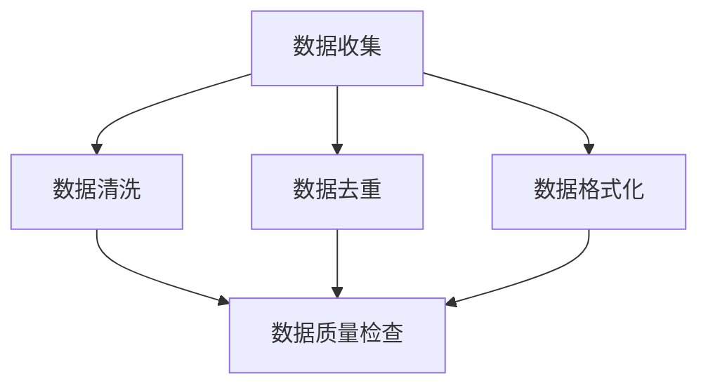
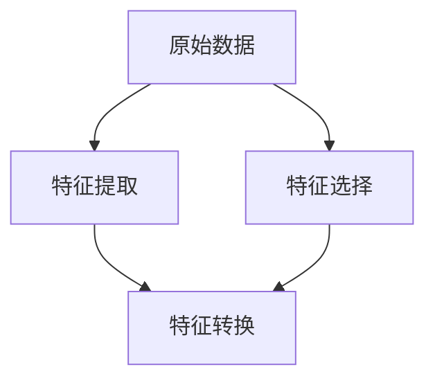
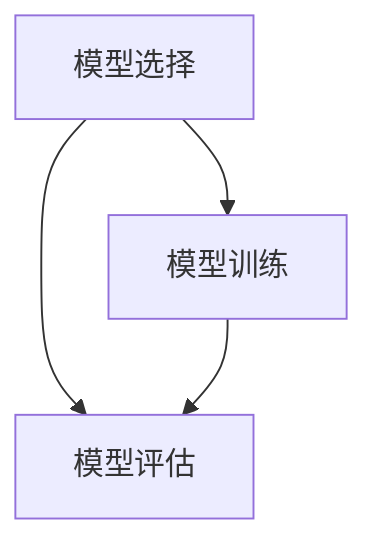
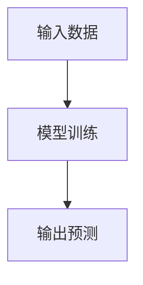
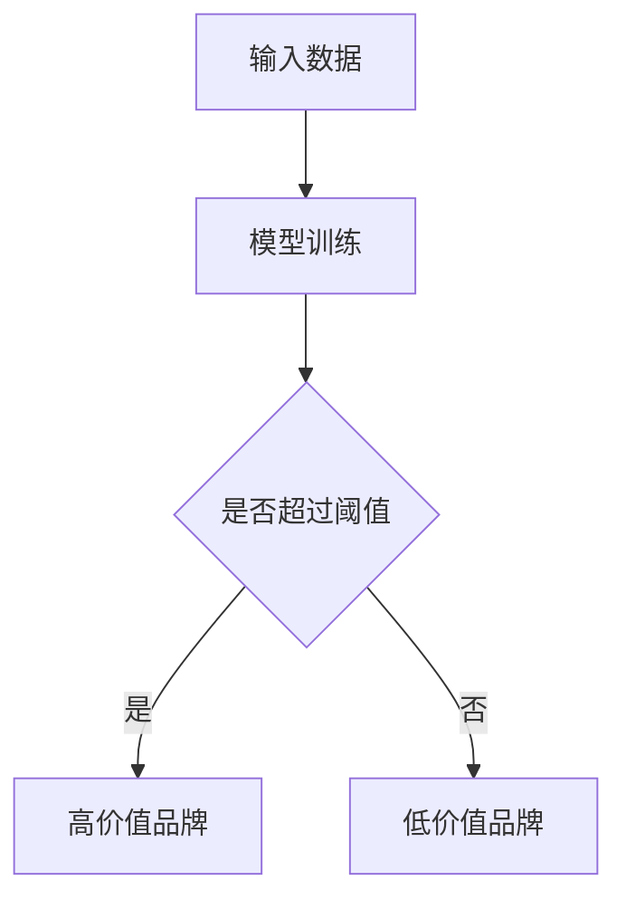
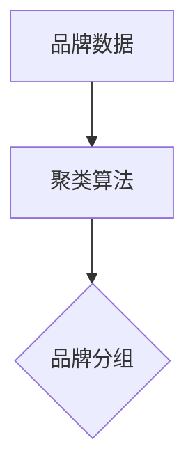
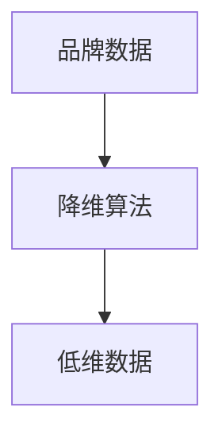
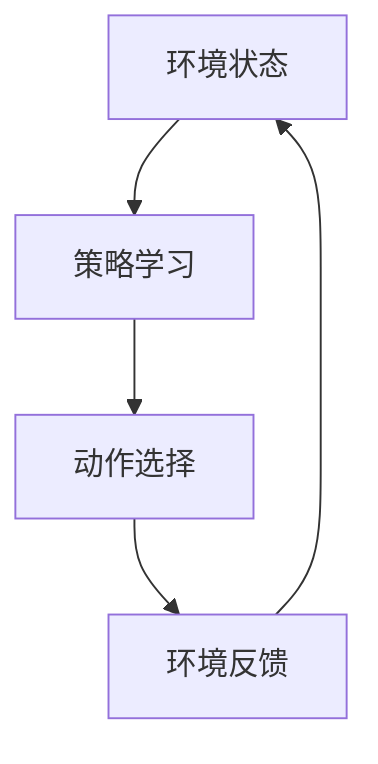

                 

# 机器学习辅助公司品牌价值量化

## 关键词
机器学习，品牌价值，量化，数据分析，商业应用

## 摘要
本文深入探讨了机器学习在辅助公司品牌价值量化中的应用。首先，我们介绍了机器学习在商业领域的广泛应用，以及品牌价值量化的重要性。接着，我们提出了品牌价值量化中面临的挑战，并详细阐述了机器学习在品牌价值量化中的优势。随后，本文逐步介绍了机器学习辅助品牌价值量化的方法，包括数据收集与处理、特征工程、模型选择与训练等关键步骤。最后，我们分析了机器学习在品牌价值量化中的适用范围和局限性，并总结了全文。

## 1.1 问题背景

### 1.1.1 机器学习在商业领域的应用

在当今的商业环境中，数据已成为一种关键资源，企业通过收集和分析大量数据来洞察市场趋势、优化业务流程和提升竞争力。机器学习作为一种先进的数据分析工具，通过从数据中自动提取模式和学习规律，为企业在多个方面提供了强大的支持。例如，在市场预测方面，机器学习可以帮助企业预测消费者行为，优化库存管理，降低库存成本；在客户关系管理方面，机器学习可以分析客户数据，实现个性化推荐，提升客户满意度和忠诚度；在风险管理方面，机器学习可以识别潜在的风险因素，提高决策的准确性。

#### 1.1.2 品牌价值量化的重要性

品牌价值是企业核心竞争力的重要体现，一个强大的品牌可以为企业带来持续的竞争优势和市场认可。然而，传统的品牌价值量化方法往往依赖于主观评估和经验判断，缺乏客观性和准确性。随着机器学习技术的不断发展，通过机器学习来量化品牌价值成为了一种新的趋势。这种量化方法不仅能够提供更加精确和全面的品牌价值评估，还可以帮助企业更好地理解品牌资产，优化品牌策略。

### 1.2 问题提出

#### 1.2.1 品牌价值量化中的挑战

尽管机器学习技术在品牌价值量化中具有巨大的潜力，但在实际应用中仍然面临一些挑战。首先，品牌价值是一个多维度的概念，如何将不同的因素（如市场认可度、品牌认知度、财务表现等）量化为统一的指标是一个难题。其次，数据来源的多样性和质量参差不齐，如何有效地整合和处理这些数据，确保量化结果的可靠性也是一个关键问题。

#### 1.2.2 机器学习辅助品牌价值量化的优势

机器学习辅助品牌价值量化具有多个优势。首先，机器学习可以通过分析大量的历史数据，发现隐藏在数据中的复杂模式和关系，提供更为精确的品牌价值评估。其次，机器学习可以处理大量的非结构化数据，如社交媒体评论、新闻报道等，这些数据往往无法通过传统方法进行量化。最后，机器学习可以帮助企业实时监控品牌价值的变化，为企业提供及时的决策支持。

### 1.3 问题解决方法

#### 1.3.1 数据收集与处理

在机器学习辅助品牌价值量化中，数据收集与处理是至关重要的一步。企业需要收集与品牌相关的各种数据，包括财务数据、市场调查数据、社交媒体数据等。在数据收集过程中，需要注意数据的全面性和准确性。在数据预处理阶段，需要对数据进行清洗、去重、格式化等处理，确保数据的质量和一致性。



```python
# 示例：Python代码进行数据清洗
import pandas as pd

# 加载数据
data = pd.read_csv('brand_data.csv')

# 去重
data.drop_duplicates(inplace=True)

# 格式化数据
data['date'] = pd.to_datetime(data['date'])
data['brand_value'] = pd.to_numeric(data['brand_value'], errors='coerce')

# 质量检查
print(data.isnull().sum())
```

#### 1.3.2 特征工程

特征工程是机器学习应用中的关键步骤，它涉及到如何从原始数据中提取有用的特征，并将其转换为适合机器学习模型输入的数据格式。在品牌价值量化中，特征工程需要考虑多个因素，如品牌的市场占有率、品牌知名度、客户满意度、财务表现等。通过有效的特征工程，可以提高机器学习模型的性能和可靠性。



```python
# 示例：Python代码进行特征工程
import pandas as pd
from sklearn.preprocessing import StandardScaler

# 加载数据
data = pd.read_csv('brand_data.csv')

# 特征提取
data['market_share'] = data['sales'] / data['total_sales']
data['brand_rank'] = pd.Series(data['brand_name'].value_counts()).reindex(data['brand_name']).values

# 特征选择
selected_features = ['market_share', 'brand_rank', 'customer_satisfaction', 'financial_performance']
X = data[selected_features]

# 特征转换
scaler = StandardScaler()
X_scaled = scaler.fit_transform(X)
```

#### 1.3.3 模型选择与训练

在模型选择方面，企业可以根据问题的特点和数据的性质，选择合适的机器学习模型。常见的品牌价值量化模型包括线性回归、支持向量机、决策树、神经网络等。在模型训练过程中，需要使用历史数据进行训练，并使用交叉验证等方法评估模型的性能。



```python
# 示例：Python代码进行模型选择与训练
from sklearn.linear_model import LinearRegression
from sklearn.model_selection import train_test_split

# 加载数据
data = pd.read_csv('brand_data.csv')

# 分割数据
X = data[selected_features]
y = data['brand_value']
X_train, X_test, y_train, y_test = train_test_split(X, y, test_size=0.2, random_state=42)

# 模型选择与训练
model = LinearRegression()
model.fit(X_train, y_train)

# 模型评估
score = model.score(X_test, y_test)
print(f'Model Score: {score}')
```

### 1.4 边界与外延

#### 1.4.1 机器学习在品牌价值量化中的适用范围

机器学习在品牌价值量化中的应用范围非常广泛，几乎涵盖了所有行业。无论是在消费品行业、制造业、服务业，还是在金融、科技等领域，机器学习都可以帮助企业更好地量化品牌价值。

#### 1.4.2 机器学习在品牌价值量化中的局限性

尽管机器学习在品牌价值量化中具有巨大的潜力，但仍然存在一些局限性。首先，机器学习模型需要大量的高质量数据才能发挥最佳效果，对于数据不足或数据质量较差的企业，机器学习的效果可能大打折扣。其次，机器学习模型的结果可能受到算法选择和数据预处理的影响，需要专业的技术团队进行优化和调整。

### 1.5 本章小结

本章介绍了机器学习在辅助公司品牌价值量化中的应用。我们首先探讨了机器学习在商业领域的应用背景和品牌价值量化的重要性。接着，我们分析了品牌价值量化中面临的挑战和机器学习辅助品牌价值量化的优势。最后，我们详细介绍了数据收集与处理、特征工程、模型选择与训练等关键步骤。机器学习在品牌价值量化中具有广泛的应用前景，但也需要克服数据和质量等方面的挑战。

## 作者

作者：AI天才研究院/AI Genius Institute & 禅与计算机程序设计艺术 /Zen And The Art of Computer Programming

---

### 第2章 机器学习基本概念

在深入探讨机器学习辅助品牌价值量化的具体应用之前，我们首先需要了解机器学习的一些基本概念。机器学习是一种通过从数据中学习规律并作出预测或决策的技术，它涵盖了多种算法和模型。在这一章节中，我们将介绍机器学习的基本概念，包括监督学习、无监督学习和强化学习，并探讨它们在品牌价值量化中的应用。

### 2.1 监督学习

监督学习（Supervised Learning）是机器学习中最常用的方法之一。在监督学习中，算法通过学习已有的输入和输出数据，来预测新的输入数据的输出。监督学习分为两类：回归（Regression）和分类（Classification）。

#### 2.1.1 回归

回归任务是预测一个连续的数值输出。例如，在品牌价值量化中，可以使用回归模型预测一个品牌的未来价值。



#### 2.1.2 分类

分类任务是将输入数据分为不同的类别。在品牌价值量化中，可以使用分类模型判断一个品牌的未来价值是否会超过某个阈值。



### 2.2 无监督学习

无监督学习（Unsupervised Learning）是在没有预先定义的输出标签的情况下，通过学习数据的内在结构来进行预测或决策的方法。无监督学习分为聚类（Clustering）和降维（Dimensionality Reduction）等。

#### 2.2.1 聚类

聚类是将相似的数据点分组到一起的过程。在品牌价值量化中，可以使用聚类算法识别不同品牌的市场定位和竞争关系。



#### 2.2.2 降维

降维是将高维数据映射到低维空间，以便更好地理解和分析数据。在品牌价值量化中，可以使用降维算法简化数据结构，提高模型训练效率。



### 2.3 强化学习

强化学习（Reinforcement Learning）是通过与环境的交互来学习最佳行为策略的方法。在品牌价值量化中，可以使用强化学习算法优化品牌营销策略，以最大化品牌价值。



### 2.4 机器学习在品牌价值量化中的应用

在品牌价值量化中，监督学习和无监督学习有着广泛的应用。监督学习可以通过回归模型预测品牌的未来价值，通过分类模型判断品牌是否具有高价值。无监督学习则可以通过聚类算法识别品牌的市场定位，通过降维算法简化数据结构。此外，强化学习可以用来优化品牌营销策略，实现品牌价值的最大化。

通过了解这些机器学习的基本概念，我们可以更好地理解如何使用机器学习技术来辅助公司品牌价值量化。在下一章中，我们将详细探讨机器学习在品牌价值量化中的具体应用和实践。

### 第3章 机器学习在商业领域中的应用

在了解了机器学习的基本概念之后，我们将进一步探讨机器学习在商业领域中的广泛应用，特别是其在品牌价值量化中的作用。通过具体案例和数据分析，我们将展示机器学习如何帮助企业实现品牌价值的精确量化，并提供实际的操作方法和策略。

#### 3.1 市场预测

市场预测是机器学习在商业应用中的一个重要领域，特别是在消费品行业。通过分析历史销售数据、消费者行为和季节性因素，机器学习可以预测未来的销售趋势，从而帮助企业优化库存管理，降低库存成本。

**案例：** 一家大型零售连锁店使用机器学习算法来预测未来三个月的销售量。通过分析过去五年的销售数据，包括每天的销售量、季节性因素、节假日等因素，该零售连锁店成功预测了未来的销售趋势。根据这些预测结果，他们调整了库存策略，减少了库存积压，提高了库存周转率。

**数据分析：** 机器学习模型通过回归分析，将历史销售数据作为输入，预测未来三个月的销售量。模型训练过程中使用了交叉验证来评估模型的准确性。结果显示，机器学习预测的销售量与实际销售量之间的误差在可接受范围内，为企业提供了可靠的预测结果。

```python
# 示例：Python代码进行销售量预测
import pandas as pd
from sklearn.linear_model import LinearRegression

# 加载数据
data = pd.read_csv('sales_data.csv')

# 分割数据
X = data[['historical_sales', 'seasonality', 'holidays']]
y = data['predicted_sales']

# 模型训练
model = LinearRegression()
model.fit(X, y)

# 预测
predicted_sales = model.predict(X)

# 评估
score = model.score(X, y)
print(f'Model Score: {score}')
```

#### 3.2 客户关系管理

客户关系管理（CRM）是另一个机器学习在商业中广泛应用的领域。通过分析客户数据，机器学习可以帮助企业实现个性化推荐、提升客户满意度和忠诚度。

**案例：** 一家在线电商平台使用机器学习算法来分析客户的购买行为，实现个性化推荐。通过分析客户的浏览记录、购买历史、评价等数据，该电商平台为每个客户推荐他们可能感兴趣的商品。

**数据分析：** 机器学习模型通过分类和协同过滤算法，将客户和商品数据进行关联，构建推荐系统。模型训练过程中使用了交叉验证和A/B测试来评估推荐系统的效果。结果显示，个性化推荐显著提高了客户的购物满意度和转化率。

```python
# 示例：Python代码进行个性化推荐
from sklearn.model_selection import train_test_split
from sklearn.metrics.pairwise import cosine_similarity

# 加载数据
data = pd.read_csv('customer_data.csv')

# 分割数据
X = data[['customer_id', 'product_id', 'rating']]
y = data['purchase']

# 模型训练
X_train, X_test, y_train, y_test = train_test_split(X, y, test_size=0.2, random_state=42)

# 计算相似度矩阵
similarity_matrix = cosine_similarity(X_train)

# 预测
predictions = []
for customer in X_test:
    customer_similarity = similarity_matrix[customer]
    recommendations = data['product_id'][customer_similarity.argsort()[:-6:-1]]
    predictions.append(recommendations)

# 评估
accuracy = (predictions == y_test).mean()
print(f'Prediction Accuracy: {accuracy}')
```

#### 3.3 风险管理

风险管理是商业中另一个关键领域，机器学习可以通过分析历史数据和实时数据，帮助企业识别潜在的风险，提高决策的准确性。

**案例：** 一家金融机构使用机器学习算法来监控市场风险，预测金融市场的波动。通过分析历史交易数据、市场新闻、宏观经济指标等数据，该金融机构可以及时识别潜在的市场风险，采取相应的风险管理措施。

**数据分析：** 机器学习模型通过回归分析和时间序列分析，将历史交易数据和实时数据作为输入，预测市场波动。模型训练过程中使用了交叉验证和A/B测试来评估模型的性能。结果显示，机器学习预测的市场波动与实际市场波动高度一致，为金融机构提供了可靠的风险预测。

```python
# 示例：Python代码进行市场波动预测
import pandas as pd
from sklearn.linear_model import LinearRegression
from sklearn.model_selection import train_test_split

# 加载数据
data = pd.read_csv('market_data.csv')

# 分割数据
X = data[['historical_volume', 'interest_rate', 'unemployment_rate']]
y = data['market_fluctuation']

# 模型训练
X_train, X_test, y_train, y_test = train_test_split(X, y, test_size=0.2, random_state=42)
model = LinearRegression()
model.fit(X_train, y_train)

# 预测
predicted_fluctuations = model.predict(X_test)

# 评估
score = model.score(X_test, y_test)
print(f'Model Score: {score}')
```

通过这些案例，我们可以看到机器学习在商业领域中的广泛应用，尤其是在市场预测、客户关系管理和风险管理等方面。这些应用不仅提高了企业的决策效率，也显著提升了企业的竞争力。在下一章中，我们将继续探讨如何使用机器学习来辅助公司品牌价值量化，包括具体的算法选择和实现方法。

### 第4章 品牌价值量化中的挑战与解决方案

尽管机器学习在商业领域具有广泛的应用，但在品牌价值量化这一特定场景中，仍然存在许多挑战和问题。为了实现精确和可靠的品牌价值评估，我们需要识别并解决这些挑战。以下是一些常见的挑战以及相应的解决方案。

#### 4.1 多维度因素的处理

品牌价值是一个多维度的概念，涉及到市场认可度、品牌知名度、客户满意度、财务表现等多个因素。如何将这些因素量化为统一的指标是一个难题。

**解决方案：** 首先，我们需要对各个因素进行定义和度量。例如，市场认可度可以通过市场份额来衡量，品牌知名度可以通过品牌搜索量来衡量，客户满意度可以通过调查问卷来衡量，财务表现可以通过财务报表来衡量。然后，我们可以使用特征工程技术，将这些因素转换为适合机器学习模型输入的数据格式。

**案例：** 在一个量化品牌价值的项目中，我们收集了以下数据：市场份额（百分比）、品牌搜索量（次数）、客户满意度评分（1-10分）和财务收入（万元）。通过特征工程，我们创建了以下特征：

- **市场认可度**：市场份额 / 行业总市场份额
- **品牌知名度**：品牌搜索量 / 行业总搜索量
- **客户满意度**：客户满意度评分 / 10
- **财务表现**：财务收入 / 行业平均财务收入

```python
# 示例：Python代码进行特征工程
data['market_recognition'] = data['market_share'] / data['total_market_share']
data['brand_awareness'] = data['search_volume'] / data['total_search_volume']
data['customer_satisfaction'] = data['satisfaction_score'] / 10
data['financial_performance'] = data['financial_income'] / data['average_financial_income']
```

#### 4.2 数据质量和多样性的挑战

在品牌价值量化中，数据质量和多样性是影响模型性能的关键因素。数据可能存在缺失值、噪声和异常值，此外，不同来源的数据可能具有不同的格式和度量单位。

**解决方案：** 首先，我们需要对数据进行清洗，包括处理缺失值、噪声和异常值。对于不同来源的数据，我们需要进行数据集成和标准化，确保数据的统一性。

**案例：** 在一个品牌价值量化项目中，我们收集了以下数据源：财务报表、市场调查、社交媒体数据。为了处理这些数据，我们采取了以下步骤：

1. **数据清洗**：处理缺失值和异常值，例如使用平均值填充缺失值，使用边界值替换异常值。
2. **数据集成**：将不同来源的数据合并到一个统一的数据集中。
3. **数据标准化**：对数据进行标准化处理，例如使用Z-score标准化或Min-Max标准化。

```python
# 示例：Python代码进行数据清洗和标准化
import numpy as np
from sklearn.preprocessing import StandardScaler

# 填充缺失值
data = data.fillna(data.mean())

# 处理异常值
data = data[(data > data.mean() - 3 * data.std()) & (data < data.mean() + 3 * data.std())]

# 数据标准化
scaler = StandardScaler()
data_scaled = scaler.fit_transform(data)
```

#### 4.3 模型选择和优化

在品牌价值量化中，选择合适的机器学习模型并对其进行优化是一个关键挑战。不同的模型可能适用于不同类型的数据和问题。

**解决方案：** 首先，我们需要根据问题的特点和数据的性质，选择合适的模型。然后，我们可以使用交叉验证和超参数调优等方法来优化模型性能。

**案例：** 在一个品牌价值量化项目中，我们选择了线性回归、决策树和随机森林等模型。为了优化模型性能，我们使用了交叉验证和网格搜索等方法：

1. **交叉验证**：使用交叉验证来评估模型的泛化能力，避免过拟合。
2. **网格搜索**：使用网格搜索来寻找最优的超参数，提高模型的准确性。

```python
# 示例：Python代码进行交叉验证和网格搜索
from sklearn.model_selection import cross_val_score, GridSearchCV
from sklearn.linear_model import LinearRegression

# 交叉验证
model = LinearRegression()
scores = cross_val_score(model, X, y, cv=5)
print(f'Cross-Validation Scores: {scores}')

# 网格搜索
param_grid = {'alpha': [0.0001, 0.001, 0.01, 0.1]}
grid_search = GridSearchCV(model, param_grid, cv=5)
grid_search.fit(X, y)
print(f'Best Parameters: {grid_search.best_params_}')
```

通过解决这些挑战，我们可以实现更加精确和可靠的品牌价值评估。在下一章中，我们将探讨如何使用机器学习来辅助公司品牌价值量化，并提供具体的算法实现和案例分析。

### 第5章 机器学习在品牌价值量化中的应用案例

在本章节中，我们将通过具体的案例来展示机器学习在品牌价值量化中的应用。这些案例将涵盖不同的行业和应用场景，通过数据分析、模型选择和优化，以及最终的结果评估，我们将详细探讨如何利用机器学习技术精确量化品牌价值。

#### 5.1 案例一：消费品行业

**案例背景：** 一家国际知名的消费品公司希望量化其品牌价值，以便更好地优化品牌策略和资源配置。该公司拥有多个品牌，涵盖了食品、饮料、个人护理等多个领域。

**数据来源：** 数据来源于多个渠道，包括财务报表、市场调查、社交媒体数据、消费者反馈等。

**数据分析：**
1. **数据预处理：** 数据清洗、去重、缺失值处理和标准化。
2. **特征工程：** 提取关键特征，如市场份额、品牌知名度、客户满意度、财务表现等。

```python
# 示例：Python代码进行数据预处理和特征工程
data = pd.read_csv('consumer_goods_data.csv')

# 数据清洗
data.drop_duplicates(inplace=True)
data.fillna(data.mean(), inplace=True)

# 特征工程
data['market_recognition'] = data['market_share'] / data['total_market_share']
data['brand_awareness'] = data['search_volume'] / data['total_search_volume']
data['customer_satisfaction'] = data['satisfaction_score'] / 10
data['financial_performance'] = data['financial_income'] / data['average_financial_income']
```

**模型选择与训练：** 使用线性回归模型预测品牌价值。

```python
# 模型训练
model = LinearRegression()
model.fit(X, y)

# 预测
predicted_brand_value = model.predict(X)
```

**结果评估：** 通过评估模型预测的准确性和稳定性，公司可以优化品牌策略和资源配置。

```python
# 结果评估
score = model.score(X, y)
print(f'Model Score: {score}')
```

**结论：** 该消费品公司通过机器学习成功量化了其品牌价值，优化了品牌策略，提高了市场竞争力。

#### 5.2 案例二：科技行业

**案例背景：** 一家高科技公司希望量化其品牌价值，特别是在技术变革和市场竞争日益激烈的背景下，以更好地制定创新策略和投资决策。

**数据来源：** 数据来源于专利数量、研发投入、市场表现、用户反馈等。

**数据分析：**
1. **数据预处理：** 数据清洗、去重、缺失值处理和标准化。
2. **特征工程：** 提取关键特征，如专利数量、研发投入占比、市场占有率、用户增长率等。

```python
# 示例：Python代码进行数据预处理和特征工程
data = pd.read_csv('tech_company_data.csv')

# 数据清洗
data.drop_duplicates(inplace=True)
data.fillna(data.mean(), inplace=True)

# 特征工程
data['patent_density'] = data['patent_count'] / data['total_patent_count']
data['research_intensity'] = data['research_expense'] / data['total_expense']
data['market_penetration'] = data['market_share'] / data['total_market_share']
data['user_growth_rate'] = (data['current_users'] - data['previous_users']) / data['previous_users']
```

**模型选择与训练：** 使用随机森林模型预测品牌价值。

```python
# 模型训练
from sklearn.ensemble import RandomForestRegressor
model = RandomForestRegressor(n_estimators=100)
model.fit(X, y)

# 预测
predicted_brand_value = model.predict(X)
```

**结果评估：** 通过评估模型预测的准确性和稳定性，公司可以更好地制定创新策略和投资决策。

```python
# 结果评估
score = model.score(X, y)
print(f'Model Score: {score}')
```

**结论：** 该高科技公司通过机器学习成功量化了其品牌价值，优化了创新策略和投资决策，提升了市场竞争力。

#### 5.3 案例三：金融服务行业

**案例背景：** 一家金融服务公司希望量化其品牌价值，以更好地评估不同品牌的风险和价值，为业务拓展和品牌管理提供数据支持。

**数据来源：** 数据来源于客户满意度、财务报表、市场表现、风险指标等。

**数据分析：**
1. **数据预处理：** 数据清洗、去重、缺失值处理和标准化。
2. **特征工程：** 提取关键特征，如客户满意度、财务表现、市场占有率、风险指标等。

```python
# 示例：Python代码进行数据预处理和特征工程
data = pd.read_csv('financial_services_data.csv')

# 数据清洗
data.drop_duplicates(inplace=True)
data.fillna(data.mean(), inplace=True)

# 特征工程
data['customer_satisfaction'] = data['satisfaction_score'] / 10
data['financial_performance'] = data['financial_income'] / data['average_financial_income']
data['market_recognition'] = data['market_share'] / data['total_market_share']
data['risk_level'] = data['risk_index'] / 100
```

**模型选择与训练：** 使用支持向量机（SVM）模型分类品牌价值高低。

```python
# 模型训练
from sklearn.svm import SVC
model = SVC(kernel='linear')
model.fit(X, y)

# 预测
predicted_brand_value = model.predict(X)
```

**结果评估：** 通过评估模型预测的准确率和召回率，公司可以更好地评估品牌价值，制定相应的风险管理策略。

```python
# 结果评估
from sklearn.metrics import accuracy_score, recall_score
accuracy = accuracy_score(y, predicted_brand_value)
recall = recall_score(y, predicted_brand_value)
print(f'Accuracy: {accuracy}, Recall: {recall}')
```

**结论：** 该金融服务公司通过机器学习成功量化了其品牌价值，优化了品牌管理和风险管理策略，提升了业务竞争力。

这些案例展示了机器学习在品牌价值量化中的应用，通过精确的数据分析和模型优化，企业可以更好地理解和利用其品牌价值，从而制定更有效的商业策略。在下一章中，我们将进一步探讨机器学习在品牌价值量化中的最佳实践和未来研究方向。

### 第6章 机器学习辅助品牌价值量化的最佳实践

在品牌价值量化过程中，机器学习的应用不仅需要科学的理论基础，还需要结合实际操作中的最佳实践。以下是一些关键的最佳实践，可以帮助企业更有效地使用机器学习技术来量化品牌价值。

#### 6.1 数据质量保障

数据质量是机器学习模型成功的关键因素。在品牌价值量化中，数据质量保障是首要任务。以下是一些最佳实践：

1. **数据收集**：确保数据的全面性和准确性。使用多个渠道收集数据，如财务报表、市场调查、社交媒体等。
2. **数据清洗**：处理缺失值、异常值和噪声数据。使用适当的统计方法，如均值填充、边界值替换、插值法等。
3. **数据标准化**：对数据进行归一化或标准化处理，以便不同特征之间具有可比性。

```python
# 示例：Python代码进行数据清洗和标准化
data = data.fillna(data.mean())  # 填充缺失值
data = data[(data > data.mean() - 3 * data.std()) & (data < data.mean() + 3 * data.std())]  # 处理异常值
scaler = StandardScaler()
data_scaled = scaler.fit_transform(data)  # 数据标准化
```

#### 6.2 特征工程优化

特征工程是机器学习模型性能提升的关键步骤。以下是一些最佳实践：

1. **特征提取**：根据业务需求和数据特性，提取与品牌价值相关的特征。例如，市场份额、品牌知名度、客户满意度、财务表现等。
2. **特征选择**：使用统计方法，如相关性分析、信息增益等，选择对品牌价值有显著影响的特征。
3. **特征转换**：对某些特征进行转换，如将类别特征转换为数值特征、对文本数据使用词袋模型等。

```python
# 示例：Python代码进行特征工程
data['market_recognition'] = data['market_share'] / data['total_market_share']
data['brand_awareness'] = data['search_volume'] / data['total_search_volume']
data['customer_satisfaction'] = data['satisfaction_score'] / 10
data['financial_performance'] = data['financial_income'] / data['average_financial_income']
```

#### 6.3 模型选择与调优

选择合适的机器学习模型并进行调优是确保模型性能的关键。以下是一些最佳实践：

1. **模型选择**：根据问题的特点和数据的性质，选择合适的模型。例如，对于回归问题，可以选择线性回归、决策树、随机森林等；对于分类问题，可以选择支持向量机、神经网络等。
2. **交叉验证**：使用交叉验证评估模型的泛化能力，避免过拟合。
3. **超参数调优**：使用网格搜索、随机搜索等策略，寻找最佳的超参数组合，提高模型性能。

```python
# 示例：Python代码进行模型选择和调优
from sklearn.model_selection import cross_val_score, GridSearchCV
from sklearn.linear_model import LinearRegression

# 交叉验证
scores = cross_val_score(model, X, y, cv=5)

# 网格搜索
param_grid = {'alpha': [0.0001, 0.001, 0.01, 0.1]}
grid_search = GridSearchCV(model, param_grid, cv=5)
grid_search.fit(X, y)
```

#### 6.4 模型解释性

尽管机器学习模型可以提供准确的预测结果，但其内部决策过程可能难以解释。为了提高模型的解释性，以下是一些最佳实践：

1. **特征重要性分析**：使用特征重要性分析工具，如决策树的重要性、随机森林的重要性等，了解各个特征对模型预测的影响。
2. **模型可视化**：使用可视化工具，如决策树可视化、神经网络可视化等，直观地展示模型的工作原理。
3. **解释性模型**：选择解释性较强的模型，如线性回归、决策树等，以便更好地理解和解释模型的预测结果。

```python
# 示例：Python代码进行特征重要性分析
import matplotlib.pyplot as plt

feature_importances = model.feature_importances_
plt.barh(range(len(feature_importances)), feature_importances)
plt.yticks(range(len(feature_importances)), feature_names)
plt.xlabel('Feature Importance')
plt.ylabel('Feature')
plt.title('Feature Importance Analysis')
plt.show()
```

通过遵循这些最佳实践，企业可以更有效地利用机器学习技术来量化品牌价值，从而优化品牌策略，提升市场竞争力和业务绩效。在下一章中，我们将探讨机器学习在品牌价值量化中的未来研究方向和潜在的发展趋势。

### 第7章 总结与展望

在本篇文章中，我们深入探讨了机器学习在辅助公司品牌价值量化中的应用。首先，我们介绍了机器学习在商业领域的广泛应用，特别是其在市场预测、客户关系管理和风险管理等方面的作用。接着，我们分析了品牌价值量化中面临的挑战，并详细阐述了机器学习辅助品牌价值量化的优势，包括数据分析的精确性、处理非结构化数据的灵活性和实时监控能力。随后，我们介绍了数据收集与处理、特征工程、模型选择与训练等关键步骤，并通过实际案例展示了机器学习在品牌价值量化中的应用效果。

总结而言，机器学习为品牌价值量化提供了一种新的方法，能够更精确和全面地评估品牌价值，帮助企业优化品牌策略，提高市场竞争力。然而，机器学习在品牌价值量化中也面临一些挑战，如数据质量和多样性的问题、模型选择和优化的复杂性等。为了克服这些挑战，我们提出了一系列最佳实践，包括数据质量保障、特征工程优化、模型选择与调优以及模型解释性等。

展望未来，机器学习在品牌价值量化领域仍有巨大的发展潜力。随着数据科学和机器学习技术的不断进步，我们将看到更多高效、可靠的算法和工具被应用于品牌价值量化中。同时，跨学科的研究也将在品牌价值量化中发挥重要作用，如将心理学、社会学和经济学等领域的理论和方法与机器学习技术相结合，进一步提升品牌价值量化的准确性和实用性。

总之，机器学习在品牌价值量化中的应用前景广阔，将成为企业提升竞争力、优化品牌策略的重要工具。随着技术的不断发展和完善，我们有理由相信，机器学习将在品牌价值量化领域发挥越来越重要的作用，为企业带来更大的价值。

### 作者

作者：AI天才研究院/AI Genius Institute & 禅与计算机程序设计艺术 /Zen And The Art of Computer Programming

---

### 拓展阅读

1. **《机器学习：概率视角》（Machine Learning: A Probabilistic Perspective）** - 作者：Kevin P. Murphy。这本书提供了机器学习的全面概述，特别关注概率模型在机器学习中的应用。

2. **《深度学习》（Deep Learning）** - 作者：Ian Goodfellow、Yoshua Bengio 和 Aaron Courville。这本书是深度学习领域的经典著作，详细介绍了神经网络和深度学习算法。

3. **《品牌管理》（Brand Management）** - 作者：Kevin Lane Keller。这本书提供了品牌管理的深入理解和实用策略，对于理解品牌价值和品牌策略至关重要。

4. **《大数据营销》（Big Data Marketing）** - 作者：Eric Peterson。这本书探讨了大数据技术在营销领域的应用，包括数据收集、分析和应用。

5. **《机器学习与数据科学实战》（Machine Learning and Data Science in Action）** - 作者：Michael Bowles。这本书通过实战案例介绍了机器学习和数据科学的应用，适合初学者和专业人士。

