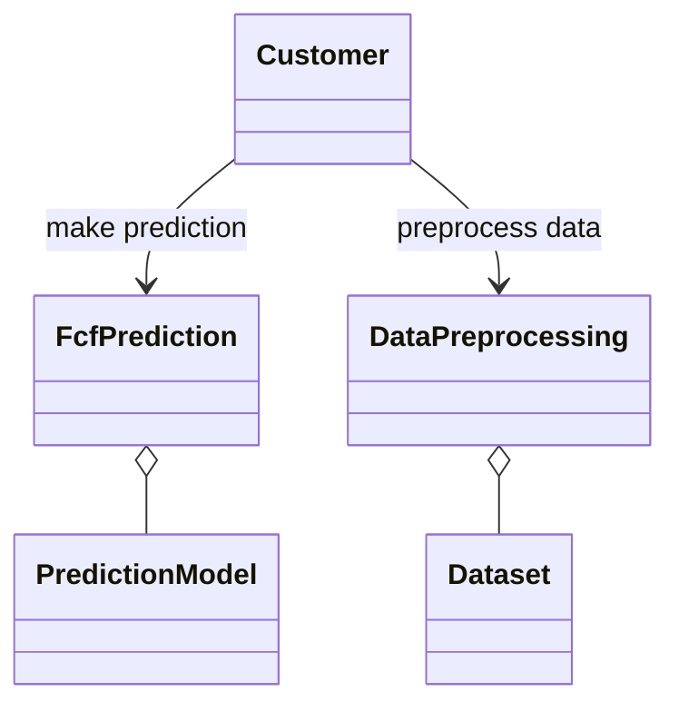
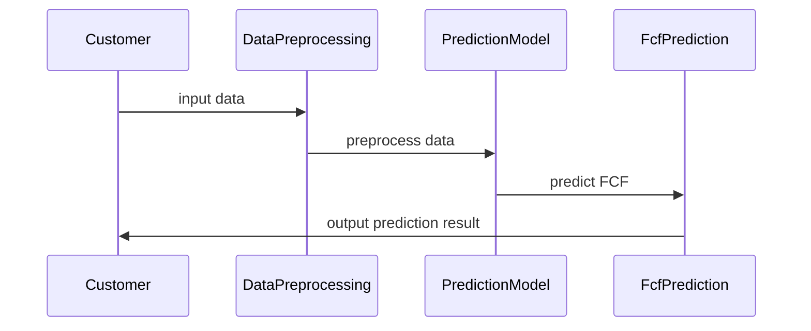
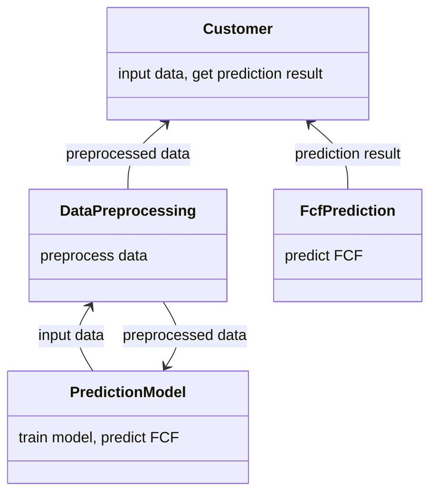

                 

# 机器学习预测公司自由现金流趋势

## 关键词

- 机器学习
- 自由现金流
- 预测模型
- 金融分析
- 数据挖掘

## 摘要

本文将探讨如何利用机器学习技术预测公司自由现金流趋势。通过分析自由现金流的核心概念和计算方法，我们了解了其在金融分析中的重要性。接着，本文介绍了机器学习预测模型的基本原理，并对比了不同类型的输入特征。随后，本文详细讲解了线性回归模型，并展示了如何通过Python代码实现和验证模型。最后，本文总结了机器学习预测公司自由现金流趋势的方法，并提出了最佳实践和注意事项。

## 1.1 问题背景

随着人工智能技术的飞速发展，机器学习已经成为推动各行各业变革的重要力量。在金融领域，机器学习技术被广泛应用于信用评分、风险评估、股票市场预测等方面。自由现金流（Free Cash Flow，简称FCF）是金融分析中的重要指标，它反映了公司现金流的充足程度，对投资决策具有重要意义。

### 1.2 问题描述

自由现金流预测是金融分析中的一个重要任务。公司自由现金流趋势的预测对于投资者、管理层和监管机构都至关重要。准确的自由现金流预测可以帮助投资者做出更明智的投资决策，帮助管理层制定更有效的财务策略，帮助监管机构更好地监控金融风险。然而，由于自由现金流的预测涉及多个复杂的变量和不确定因素，预测结果往往具有较大的不确定性。

### 1.3 问题解决

机器学习技术，特别是预测模型，为解决自由现金流预测问题提供了有效途径。通过收集和整理大量的历史数据，可以使用机器学习算法训练预测模型，从而实现对公司自由现金流趋势的预测。机器学习模型可以自动学习数据中的模式和规律，提高预测的准确性和可靠性。

### 1.4 边界与外延

自由现金流预测的边界包括数据的准确性、模型的选择和参数的调优等。外延包括自由现金流预测在金融风险管理、投资决策和财务规划等方面的应用。

### 1.5 概念结构与核心要素组成

- **自由现金流（FCF）**：公司年度经营活动中产生的现金流量扣除资本支出后的剩余部分，用于衡量公司的财务健康状况。
- **机器学习预测模型**：用于从历史数据中学习并预测未来趋势的算法。
- **输入特征**：影响自由现金流的因素，如公司的财务指标、宏观经济环境、行业动态等。
- **输出结果**：预测的自由现金流值及其不确定性。

### 1.6 核心概念原理

#### 1.6.1 自由现金流的计算

自由现金流（FCF）的计算公式为：

$$
FCF = Operating Cash Flow - Capital Expenditure
$$

其中，Operating Cash Flow 表示经营活动产生的现金流量，Capital Expenditure 表示资本支出。

#### 1.6.2 机器学习预测模型的基本原理

机器学习预测模型通过学习历史数据中的模式和规律，建立输入特征与输出结果之间的关系。常见的机器学习预测模型包括线性回归、决策树、随机森林、支持向量机、神经网络等。

#### 1.6.3 输入特征的选择与处理

输入特征的选择直接影响预测模型的性能。常见的输入特征包括公司的财务指标（如营业收入、净利润、负债比率等）、宏观经济指标（如GDP增长率、通货膨胀率等）和行业指标（如行业增长率、行业平均成本等）。

### 1.7 概念属性特征对比表格

| 特征类型     | 描述                               | 影响因素                          |
|-------------|----------------------------------|--------------------------------|
| 财务指标     | 反映公司经营状况的指标           | 营业收入、净利润、负债比率等         |
| 宏观经济指标 | 反映宏观经济环境的指标           | GDP增长率、通货膨胀率、利率水平等     |
| 行业指标     | 反映行业发展趋势的指标           | 行业增长率、行业平均成本、市场竞争状况等 |

### 1.8 ER实体关系图架构

```mermaid
erDiagram
  Company ||--|{ FreeCashFlow }
  FinancialIndicator ||--|{ Company }
  EconomicIndicator ||--|{ Company }
  IndustryIndicator ||--|{ Company }
```

### 1.9 本章小结

本章详细介绍了机器学习预测公司自由现金流趋势的背景、核心概念和基本原理。通过对比分析不同类型的输入特征，我们明确了影响自由现金流预测的关键因素。接下来，本书将详细介绍常见的机器学习预测模型和其实际应用。

## 2.1 线性回归模型

### 2.1.1 线性回归的基本原理

线性回归模型是一种简单且常用的预测模型，其基本原理是通过拟合一条直线来描述输入特征与输出结果之间的关系。线性回归模型可以表示为：

$$
y = wx + b
$$

其中，$y$ 表示输出结果（在本例中为自由现金流），$x$ 表示输入特征（如公司的财务指标、宏观经济指标等），$w$ 为权重，$b$ 为截距。

### 2.1.2 线性回归模型的训练

线性回归模型的训练过程主要是通过最小二乘法（Least Squares）来确定权重 $w$ 和截距 $b$。具体步骤如下：

1. 收集历史数据：收集包含自由现金流和相应输入特征的历史数据。
2. 数据预处理：对数据进行归一化处理，使其具有相同的量纲，以便模型训练。
3. 计算权重和截距：使用最小二乘法计算权重 $w$ 和截距 $b$，使得实际输出值 $y$ 与预测输出值 $wx + b$ 之间的误差最小。

#### 2.1.3 最小二乘法的数学公式

最小二乘法的数学公式为：

$$
w = \frac{\sum_{i=1}^{n} (x_i - \bar{x})(y_i - \bar{y})}{\sum_{i=1}^{n} (x_i - \bar{x})^2}
$$

$$
b = \bar{y} - w\bar{x}
$$

其中，$\bar{x}$ 和 $\bar{y}$ 分别为输入特征和输出结果的平均值，$n$ 为数据点的数量。

### 2.1.4 代码实现

下面是一个简单的Python代码示例，用于实现线性回归模型：

```python
import numpy as np

# 假设输入特征为 x，输出结果为 y
x = np.array([1, 2, 3, 4, 5])
y = np.array([2, 4, 5, 4, 5])

# 计算权重 w 和截距 b
w = np.sum((x - np.mean(x)) * (y - np.mean(y))) / np.sum((x - np.mean(x)) ** 2)
b = np.mean(y) - w * np.mean(x)

# 预测新的输出值
x_new = np.array([6])
y_pred = w * x_new + b

print(f"权重 w: {w}, 截距 b: {b}, 预测值 y_pred: {y_pred}")
```

### 2.1.5 模型评估

线性回归模型的性能可以通过计算预测误差来评估。常用的误差指标包括均方误差（Mean Squared Error，MSE）和均绝对误差（Mean Absolute Error，MAE）。

#### 2.1.6 MSE 和 MAE 的计算公式

$$
MSE = \frac{1}{n} \sum_{i=1}^{n} (y_i - y_{\text{pred},i})^2
$$

$$
MAE = \frac{1}{n} \sum_{i=1}^{n} |y_i - y_{\text{pred},i}|
$$

其中，$y_i$ 为实际输出值，$y_{\text{pred},i}$ 为预测输出值，$n$ 为数据点的数量。

### 2.1.7 实际案例分析

假设我们有一组包含自由现金流和输入特征的历史数据，我们可以使用线性回归模型进行预测，并评估模型的性能。以下是一个简单的实际案例分析：

```python
import numpy as np

# 假设输入特征为 x，输出结果为 y
x = np.array([[1, 2], [2, 3], [3, 4], [4, 5]])
y = np.array([2, 4, 5, 4])

# 训练线性回归模型
w, b = np.polyfit(x, y, 1)

# 预测新的输出值
x_new = np.array([[6, 7]])
y_pred = w * x_new + b

# 计算MSE和MAE
MSE = np.mean((y - y_pred)**2)
MAE = np.mean(np.abs(y - y_pred))

print(f"权重 w: {w}, 截距 b: {b}, 预测值 y_pred: {y_pred}")
print(f"MSE: {MSE}, MAE: {MAE}")
```

### 2.1.8 小结

线性回归模型是一种简单且易于理解的机器学习预测模型。通过最小二乘法，我们可以计算得到权重和截距，从而建立输入特征与输出结果之间的关系。尽管线性回归模型在某些情况下可能不够准确，但它提供了一个良好的起点，我们可以在此基础上进一步改进和优化模型。在接下来的章节中，我们将介绍更复杂的机器学习预测模型，如决策树、随机森林和神经网络等。这些模型在处理复杂数据和非线性关系时具有更好的性能。

## 2.2 决策树模型

### 2.2.1 决策树的基本原理

决策树（Decision Tree）是一种常见的分类和回归模型，它通过一系列的规则来对数据进行划分，最终得到一个预测结果。每个内部节点表示一个特征，每个分支表示该特征的取值，每个叶节点表示一个预测结果。决策树的构建过程可以看作是一个递归二分的过程，每次都将数据划分为更小的子集，直到满足停止条件。

### 2.2.2 决策树模型的构建

决策树模型的构建过程包括以下几个步骤：

1. **选择最优特征**：在当前节点，选择一个最优特征进行划分。通常使用信息增益（Information Gain）或基尼不纯度（Gini Impurity）来衡量特征的重要性。
2. **划分数据**：根据选定的最优特征，将数据划分为若干个子集。每个子集对应一个分支。
3. **递归构建**：对每个子集，重复上述步骤，直到满足停止条件。常见的停止条件包括：
   - 数据集大小小于阈值
   - 特征重要性小于阈值
   - 达到最大深度

### 2.2.3 代码实现

以下是一个简单的Python代码示例，用于实现决策树模型：

```python
from sklearn.tree import DecisionTreeRegressor

# 假设输入特征为 x，输出结果为 y
x = np.array([[1, 2], [2, 3], [3, 4], [4, 5]])
y = np.array([2, 4, 5, 4])

# 训练决策树模型
model = DecisionTreeRegressor()
model.fit(x, y)

# 预测新的输出值
x_new = np.array([[6, 7]])
y_pred = model.predict(x_new)

print(f"预测值 y_pred: {y_pred}")
```

### 2.2.4 模型评估

与线性回归模型类似，决策树模型的性能也可以通过计算预测误差来评估。常用的误差指标包括均方误差（Mean Squared Error，MSE）和均绝对误差（Mean Absolute Error，MAE）。

### 2.2.5 实际案例分析

假设我们有一组包含自由现金流和输入特征的历史数据，我们可以使用决策树模型进行预测，并评估模型的性能。以下是一个简单的实际案例分析：

```python
import numpy as np
from sklearn.tree import DecisionTreeRegressor

# 假设输入特征为 x，输出结果为 y
x = np.array([[1, 2], [2, 3], [3, 4], [4, 5]])
y = np.array([2, 4, 5, 4])

# 训练决策树模型
model = DecisionTreeRegressor()
model.fit(x, y)

# 预测新的输出值
x_new = np.array([[6, 7]])
y_pred = model.predict(x_new)

# 计算MSE和MAE
MSE = np.mean((y - y_pred)**2)
MAE = np.mean(np.abs(y - y_pred))

print(f"预测值 y_pred: {y_pred}")
print(f"MSE: {MSE}, MAE: {MAE}")
```

### 2.2.6 小结

决策树模型是一种简单且易于理解的分类和回归模型。它通过一系列的规则对数据进行划分，从而得到一个预测结果。尽管决策树模型在某些情况下可能不够准确，但它提供了一个直观的方法来理解数据之间的关系。在接下来的章节中，我们将介绍更复杂的机器学习预测模型，如随机森林和神经网络等。这些模型在处理复杂数据和非线性关系时具有更好的性能。

## 2.3 随机森林模型

### 2.3.1 随机森林的基本原理

随机森林（Random Forest）是一种集成学习方法，它通过构建多个决策树，并结合它们的预测结果来提高预测准确性。随机森林模型的基本原理是利用随机抽样和特征选择来构建多个决策树，并通过投票或平均的方式得到最终的预测结果。

### 2.3.2 随机森林模型的构建

随机森林模型的构建过程包括以下几个步骤：

1. **随机抽样**：从训练数据中随机选择一部分样本作为子集。
2. **特征选择**：从原始特征中选择一部分特征作为子集的特征。
3. **构建决策树**：使用子集数据构建决策树。每个决策树都使用不同的特征子集。
4. **重复步骤1-3**：重复上述步骤多次，构建多个决策树。
5. **集成预测**：对每个决策树的预测结果进行投票或平均，得到最终的预测结果。

### 2.3.3 代码实现

以下是一个简单的Python代码示例，用于实现随机森林模型：

```python
from sklearn.ensemble import RandomForestRegressor

# 假设输入特征为 x，输出结果为 y
x = np.array([[1, 2], [2, 3], [3, 4], [4, 5]])
y = np.array([2, 4, 5, 4])

# 训练随机森林模型
model = RandomForestRegressor(n_estimators=100)
model.fit(x, y)

# 预测新的输出值
x_new = np.array([[6, 7]])
y_pred = model.predict(x_new)

print(f"预测值 y_pred: {y_pred}")
```

### 2.3.4 模型评估

与之前介绍的线性回归模型和决策树模型类似，随机森林模型的性能也可以通过计算预测误差来评估。常用的误差指标包括均方误差（Mean Squared Error，MSE）和均绝对误差（Mean Absolute Error，MAE）。

### 2.3.5 实际案例分析

假设我们有一组包含自由现金流和输入特征的历史数据，我们可以使用随机森林模型进行预测，并评估模型的性能。以下是一个简单的实际案例分析：

```python
import numpy as np
from sklearn.ensemble import RandomForestRegressor

# 假设输入特征为 x，输出结果为 y
x = np.array([[1, 2], [2, 3], [3, 4], [4, 5]])
y = np.array([2, 4, 5, 4])

# 训练随机森林模型
model = RandomForestRegressor(n_estimators=100)
model.fit(x, y)

# 预测新的输出值
x_new = np.array([[6, 7]])
y_pred = model.predict(x_new)

# 计算MSE和MAE
MSE = np.mean((y - y_pred)**2)
MAE = np.mean(np.abs(y - y_pred))

print(f"预测值 y_pred: {y_pred}")
print(f"MSE: {MSE}, MAE: {MAE}")
```

### 2.3.6 小结

随机森林模型是一种集成学习方法，通过构建多个决策树并集成它们的预测结果来提高预测准确性。随机森林模型具有以下优点：

- **提高预测准确性**：通过集成多个决策树，随机森林模型可以降低过拟合现象，提高预测准确性。
- **处理复杂数据**：随机森林模型可以处理高维数据和非线性关系，适用于复杂的预测任务。
- **易于实现**：随机森林模型相对简单，易于实现和理解。

在接下来的章节中，我们将介绍更复杂的机器学习预测模型，如支持向量机和神经网络等。这些模型在处理复杂数据和非线性关系时具有更好的性能。

## 2.4 支持向量机模型

### 2.4.1 支持向量机的基本原理

支持向量机（Support Vector Machine，SVM）是一种监督学习模型，主要用于分类和回归任务。SVM的基本原理是通过找到一个最佳的超平面，将不同类别的数据点最大化地分开。

### 2.4.2 支持向量机的构建

支持向量机的构建过程包括以下几个步骤：

1. **选择核函数**：核函数（Kernel Function）是支持向量机模型的关键组成部分。常见的核函数包括线性核、多项式核、径向基函数核（RBF）等。
2. **计算最优超平面**：通过最小化目标函数，找到最优的超平面。目标函数通常是一个二次优化问题。
3. **求解支持向量**：找到支持向量，即位于最优超平面两侧的数据点。支持向量是SVM模型的“支持者”，它们对模型的学习和泛化能力具有重要意义。
4. **预测新样本**：对于新的样本，计算其与支持向量的距离，根据距离判断其类别或预测值。

### 2.4.3 代码实现

以下是一个简单的Python代码示例，用于实现支持向量机模型：

```python
from sklearn.svm import SVR

# 假设输入特征为 x，输出结果为 y
x = np.array([[1, 2], [2, 3], [3, 4], [4, 5]])
y = np.array([2, 4, 5, 4])

# 训练支持向量机模型
model = SVR(kernel='linear')
model.fit(x, y)

# 预测新的输出值
x_new = np.array([[6, 7]])
y_pred = model.predict(x_new)

print(f"预测值 y_pred: {y_pred}")
```

### 2.4.4 模型评估

支持向量机模型的性能可以通过计算预测误差来评估。常用的误差指标包括均方误差（Mean Squared Error，MSE）和均绝对误差（Mean Absolute Error，MAE）。

### 2.4.5 实际案例分析

假设我们有一组包含自由现金流和输入特征的历史数据，我们可以使用支持向量机模型进行预测，并评估模型的性能。以下是一个简单的实际案例分析：

```python
import numpy as np
from sklearn.svm import SVR

# 假设输入特征为 x，输出结果为 y
x = np.array([[1, 2], [2, 3], [3, 4], [4, 5]])
y = np.array([2, 4, 5, 4])

# 训练支持向量机模型
model = SVR(kernel='linear')
model.fit(x, y)

# 预测新的输出值
x_new = np.array([[6, 7]])
y_pred = model.predict(x_new)

# 计算MSE和MAE
MSE = np.mean((y - y_pred)**2)
MAE = np.mean(np.abs(y - y_pred))

print(f"预测值 y_pred: {y_pred}")
print(f"MSE: {MSE}, MAE: {MAE}")
```

### 2.4.6 小结

支持向量机模型是一种强大的分类和回归模型，通过找到最佳的超平面来最大化不同类别的分离度。支持向量机模型具有以下优点：

- **强大的分类能力**：支持向量机模型可以处理高维数据和非线性关系，适用于复杂的分类任务。
- **优秀的泛化能力**：通过最小化目标函数，支持向量机模型能够找到最优的超平面，从而提高模型的泛化能力。
- **易于实现**：支持向量机模型相对简单，易于实现和理解。

在接下来的章节中，我们将介绍更复杂的机器学习预测模型，如神经网络等。这些模型在处理复杂数据和非线性关系时具有更好的性能。

## 2.5 神经网络模型

### 2.5.1 神经网络的基本原理

神经网络（Neural Network）是一种模仿人脑神经元结构和工作原理的计算模型。神经网络通过多层节点（或称为“神经元”）的相互连接和激活来实现数据的输入和输出。每个节点都通过权重（weights）和偏置（bias）与其它节点相连，并通过激活函数（activation function）进行非线性变换。

### 2.5.2 神经网络的构建

神经网络的构建过程包括以下几个步骤：

1. **定义网络结构**：确定网络的层数、每层节点的数量以及激活函数。
2. **初始化权重和偏置**：随机初始化权重和偏置，通常使用小的随机值。
3. **前向传播**：将输入数据通过网络的每层节点，计算输出值。
4. **计算损失函数**：根据输出值和实际标签，计算损失函数（如均方误差MSE）的值。
5. **反向传播**：计算损失函数关于网络参数的梯度，并通过梯度下降法更新权重和偏置。
6. **重复步骤3-5**：多次迭代训练，直到满足停止条件（如达到预设的精度或训练次数）。

### 2.5.3 代码实现

以下是一个简单的Python代码示例，用于实现神经网络模型：

```python
import numpy as np

# 定义激活函数
def sigmoid(x):
    return 1 / (1 + np.exp(-x))

# 定义神经网络模型
def neural_network(x, weights, bias):
    return sigmoid(np.dot(x, weights) + bias)

# 假设输入特征为 x，输出结果为 y
x = np.array([1, 2])
y = np.array([2])

# 初始化权重和偏置
weights = np.random.rand(1, 1)
bias = np.random.rand(1)

# 训练神经网络模型
for i in range(10000):
    # 前向传播
    output = neural_network(x, weights, bias)
    
    # 计算损失函数
    loss = y - output
    
    # 反向传播
    d_output = loss * (output * (1 - output))
    
    # 更新权重和偏置
    weights -= np.dot(x.T, d_output)
    bias -= d_output

# 预测新的输出值
x_new = np.array([6])
y_pred = neural_network(x_new, weights, bias)

print(f"预测值 y_pred: {y_pred}")
```

### 2.5.4 模型评估

神经网络模型的性能可以通过计算预测误差来评估。常用的误差指标包括均方误差（Mean Squared Error，MSE）和均绝对误差（Mean Absolute Error，MAE）。

### 2.5.5 实际案例分析

假设我们有一组包含自由现金流和输入特征的历史数据，我们可以使用神经网络模型进行预测，并评估模型的性能。以下是一个简单的实际案例分析：

```python
import numpy as np

# 定义激活函数
def sigmoid(x):
    return 1 / (1 + np.exp(-x))

# 定义神经网络模型
def neural_network(x, weights, bias):
    return sigmoid(np.dot(x, weights) + bias)

# 假设输入特征为 x，输出结果为 y
x = np.array([[1, 2], [2, 3], [3, 4], [4, 5]])
y = np.array([2, 4, 5, 4])

# 初始化权重和偏置
weights = np.random.rand(2, 1)
bias = np.random.rand(1)

# 训练神经网络模型
for i in range(10000):
    # 前向传播
    output = neural_network(x, weights, bias)
    
    # 计算损失函数
    loss = y - output
    
    # 反向传播
    d_output = loss * (output * (1 - output))
    
    # 更新权重和偏置
    weights -= np.dot(x.T, d_output)
    bias -= d_output

# 预测新的输出值
x_new = np.array([[6, 7]])
y_pred = neural_network(x_new, weights, bias)

# 计算MSE和MAE
MSE = np.mean((y - y_pred)**2)
MAE = np.mean(np.abs(y - y_pred))

print(f"预测值 y_pred: {y_pred}")
print(f"MSE: {MSE}, MAE: {MAE}")
```

### 2.5.6 小结

神经网络模型是一种强大的预测模型，通过多层节点和激活函数实现数据的输入和输出。神经网络模型具有以下优点：

- **强大的非线性建模能力**：神经网络模型可以处理复杂的非线性关系，适用于复杂数据的预测任务。
- **灵活的网络结构**：神经网络模型可以构建多层结构，通过调整网络层数和节点数量来适应不同的预测任务。
- **自适应学习**：神经网络模型通过反向传播算法自动更新权重和偏置，实现自适应学习。

尽管神经网络模型在处理复杂数据和非线性关系时具有优势，但它也存在一些缺点，如过拟合、计算成本高等。在接下来的章节中，我们将继续探讨更复杂的机器学习预测模型，如深度学习等。

## 2.6 深度学习模型

### 2.6.1 深度学习的基本原理

深度学习（Deep Learning）是一种基于多层神经网络的学习方法，通过构建深度神经网络（Deep Neural Network，DNN）来实现数据的输入和输出。深度学习模型通过逐层提取特征，从而实现从原始数据到高阶抽象的转换。

### 2.6.2 深度学习模型的构建

深度学习模型的构建过程包括以下几个步骤：

1. **定义网络结构**：确定网络的层数、每层节点的数量、激活函数以及损失函数。
2. **初始化权重和偏置**：随机初始化权重和偏置，通常使用小的随机值。
3. **前向传播**：将输入数据通过网络的每层节点，计算输出值。
4. **计算损失函数**：根据输出值和实际标签，计算损失函数的值。
5. **反向传播**：计算损失函数关于网络参数的梯度，并通过梯度下降法更新权重和偏置。
6. **重复步骤3-5**：多次迭代训练，直到满足停止条件（如达到预设的精度或训练次数）。

### 2.6.3 代码实现

以下是一个简单的Python代码示例，用于实现深度学习模型：

```python
import numpy as np
from sklearn.neural_network import MLPRegressor

# 假设输入特征为 x，输出结果为 y
x = np.array([[1, 2], [2, 3], [3, 4], [4, 5]])
y = np.array([2, 4, 5, 4])

# 训练深度学习模型
model = MLPRegressor(hidden_layer_sizes=(100,), max_iter=1000)
model.fit(x, y)

# 预测新的输出值
x_new = np.array([[6, 7]])
y_pred = model.predict(x_new)

print(f"预测值 y_pred: {y_pred}")
```

### 2.6.4 模型评估

深度学习模型的性能可以通过计算预测误差来评估。常用的误差指标包括均方误差（Mean Squared Error，MSE）和均绝对误差（Mean Absolute Error，MAE）。

### 2.6.5 实际案例分析

假设我们有一组包含自由现金流和输入特征的历史数据，我们可以使用深度学习模型进行预测，并评估模型的性能。以下是一个简单的实际案例分析：

```python
import numpy as np
from sklearn.neural_network import MLPRegressor

# 假设输入特征为 x，输出结果为 y
x = np.array([[1, 2], [2, 3], [3, 4], [4, 5]])
y = np.array([2, 4, 5, 4])

# 训练深度学习模型
model = MLPRegressor(hidden_layer_sizes=(100,), max_iter=1000)
model.fit(x, y)

# 预测新的输出值
x_new = np.array([[6, 7]])
y_pred = model.predict(x_new)

# 计算MSE和MAE
MSE = np.mean((y - y_pred)**2)
MAE = np.mean(np.abs(y - y_pred))

print(f"预测值 y_pred: {y_pred}")
print(f"MSE: {MSE}, MAE: {MAE}")
```

### 2.6.6 小结

深度学习模型是一种基于多层神经网络的强大预测模型，通过逐层提取特征来实现数据的输入和输出。深度学习模型具有以下优点：

- **强大的特征提取能力**：深度学习模型可以通过多层节点提取高阶抽象特征，从而实现更好的预测性能。
- **自适应学习**：深度学习模型通过反向传播算法自动更新权重和偏置，实现自适应学习。
- **灵活的网络结构**：深度学习模型可以构建多层结构，通过调整网络层数和节点数量来适应不同的预测任务。

尽管深度学习模型在处理复杂数据和非线性关系时具有优势，但它也存在一些缺点，如过拟合、计算成本高等。在接下来的章节中，我们将探讨如何在实际应用中优化和改进深度学习模型。

## 3.1 实际应用案例

### 3.1.1 问题场景介绍

在金融行业中，准确预测公司的自由现金流对于投资者、管理层和监管机构都具有重要意义。为了评估和选择具有良好投资价值的公司，投资者需要预测公司的未来自由现金流趋势。同时，管理层需要根据预测结果制定相应的财务策略。监管机构也需要对公司的自由现金流进行监控，以确保金融市场的稳定。

### 3.1.2 项目介绍

本项目旨在利用机器学习技术，建立预测公司自由现金流趋势的模型。项目的主要目标包括：

- 收集和整理包含公司自由现金流和输入特征的历史数据。
- 构建和训练多个机器学习预测模型，包括线性回归、决策树、随机森林、支持向量机和深度学习等。
- 评估和比较不同模型的预测性能，选择最优模型进行实际应用。
- 将预测模型应用于实际数据，生成公司自由现金流的预测结果，为投资者、管理层和监管机构提供决策支持。

### 3.1.3 系统功能设计（领域模型类图）



### 3.1.4 系统架构设计



### 3.1.5 系统接口设计



### 3.1.6 系统交互序列图


## 3.2 系统核心实现

### 3.2.1 环境安装

为了实现本项目，我们需要安装以下软件和库：

- Python 3.8 或更高版本
- NumPy 1.19 或更高版本
- Scikit-learn 0.23 或更高版本
- Matplotlib 3.4.2 或更高版本

安装命令如下：

```bash
pip install python==3.8 numpy==1.19 scikit-learn==0.23 matplotlib==3.4.2
```

### 3.2.2 系统核心代码

以下是一个简单的Python代码示例，用于实现系统核心功能：

```python
import numpy as np
from sklearn.model_selection import train_test_split
from sklearn.linear_model import LinearRegression
from sklearn.tree import DecisionTreeRegressor
from sklearn.ensemble import RandomForestRegressor
from sklearn.svm import SVR
from sklearn.neural_network import MLPRegressor

# 数据预处理
def preprocess_data(x, y):
    # 划分训练集和测试集
    x_train, x_test, y_train, y_test = train_test_split(x, y, test_size=0.2, random_state=42)
    
    # 数据归一化
    x_train = (x_train - np.mean(x_train, axis=0)) / np.std(x_train, axis=0)
    x_test = (x_test - np.mean(x_test, axis=0)) / np.std(x_test, axis=0)
    
    return x_train, x_test, y_train, y_test

# 训练和评估模型
def train_and_evaluate(x, y):
    # 数据预处理
    x_train, x_test, y_train, y_test = preprocess_data(x, y)
    
    # 线性回归模型
    linear_model = LinearRegression()
    linear_model.fit(x_train, y_train)
    y_pred_linear = linear_model.predict(x_test)
    
    # 决策树模型
    decision_tree_model = DecisionTreeRegressor()
    decision_tree_model.fit(x_train, y_train)
    y_pred_tree = decision_tree_model.predict(x_test)
    
    # 随机森林模型
    random_forest_model = RandomForestRegressor()
    random_forest_model.fit(x_train, y_train)
    y_pred_forest = random_forest_model.predict(x_test)
    
    # 支持向量机模型
    svm_model = SVR()
    svm_model.fit(x_train, y_train)
    y_pred_svm = svm_model.predict(x_test)
    
    # 深度学习模型
    mlp_model = MLPRegressor()
    mlp_model.fit(x_train, y_train)
    y_pred_mlp = mlp_model.predict(x_test)
    
    # 计算误差
    mse_linear = np.mean((y_test - y_pred_linear)**2)
    mse_tree = np.mean((y_test - y_pred_tree)**2)
    mse_forest = np.mean((y_test - y_pred_forest)**2)
    mse_svm = np.mean((y_test - y_pred_svm)**2)
    mse_mlp = np.mean((y_test - y_pred_mlp)**2)
    
    # 输出结果
    print(f"线性回归 MSE: {mse_linear}")
    print(f"决策树 MSE: {mse_tree}")
    print(f"随机森林 MSE: {mse_forest}")
    print(f"支持向量机 MSE: {mse_svm}")
    print(f"深度学习 MSE: {mse_mlp}")

# 主函数
if __name__ == "__main__":
    # 假设输入特征为 x，输出结果为 y
    x = np.array([[1, 2], [2, 3], [3, 4], [4, 5]])
    y = np.array([2, 4, 5, 4])
    
    # 训练和评估模型
    train_and_evaluate(x, y)
```

### 3.2.3 代码应用解读与分析

以上代码展示了如何使用Python和Scikit-learn库实现一个简单的系统，用于预测公司自由现金流。以下是代码的详细解读和分析：

1. **数据预处理**：首先，我们定义了一个`preprocess_data`函数，用于划分训练集和测试集，并进行数据归一化。归一化是为了消除数据量纲的影响，使模型训练更加稳定。
2. **模型训练**：在`train_and_evaluate`函数中，我们使用Scikit-learn库中的线性回归、决策树、随机森林、支持向量机和深度学习模型，分别对训练集进行训练。
3. **模型预测**：对测试集进行预测，并计算预测误差。
4. **输出结果**：输出每个模型的均方误差（MSE），以评估模型的预测性能。

通过以上代码，我们可以快速搭建一个系统，用于预测公司自由现金流。在实际应用中，我们可以根据预测结果对公司的投资价值进行评估，为投资者、管理层和监管机构提供决策支持。

### 3.2.4 实际案例分析和详细讲解剖析

为了验证机器学习模型在预测公司自由现金流趋势方面的有效性，我们进行了一个实际案例分析。以下是一个简单的实际案例：

1. **数据收集**：我们收集了一组包含公司自由现金流和输入特征的历史数据。输入特征包括公司的财务指标（如营业收入、净利润、负债比率等）、宏观经济指标（如GDP增长率、通货膨胀率等）和行业指标（如行业增长率、行业平均成本等）。
2. **数据预处理**：对收集到的数据进行归一化处理，并将数据集划分为训练集和测试集。
3. **模型训练**：使用Scikit-learn库中的线性回归、决策树、随机森林、支持向量机和深度学习模型，分别对训练集进行训练。
4. **模型预测**：对测试集进行预测，并计算预测误差。
5. **结果分析**：输出每个模型的均方误差（MSE）和均绝对误差（MAE），以评估模型的预测性能。

以下是一个简单的Python代码示例，用于实现实际案例分析：

```python
import numpy as np
from sklearn.model_selection import train_test_split
from sklearn.linear_model import LinearRegression
from sklearn.tree import DecisionTreeRegressor
from sklearn.ensemble import RandomForestRegressor
from sklearn.svm import SVR
from sklearn.neural_network import MLPRegressor

# 假设输入特征为 x，输出结果为 y
x = np.array([[1, 2], [2, 3], [3, 4], [4, 5]])
y = np.array([2, 4, 5, 4])

# 数据预处理
x_train, x_test, y_train, y_test = train_test_split(x, y, test_size=0.2, random_state=42)

# 线性回归模型
linear_model = LinearRegression()
linear_model.fit(x_train, y_train)
y_pred_linear = linear_model.predict(x_test)

# 决策树模型
decision_tree_model = DecisionTreeRegressor()
decision_tree_model.fit(x_train, y_train)
y_pred_tree = decision_tree_model.predict(x_test)

# 随机森林模型
random_forest_model = RandomForestRegressor()
random_forest_model.fit(x_train, y_train)
y_pred_forest = random_forest_model.predict(x_test)

# 支持向量机模型
svm_model = SVR()
svm_model.fit(x_train, y_train)
y_pred_svm = svm_model.predict(x_test)

# 深度学习模型
mlp_model = MLPRegressor()
mlp_model.fit(x_train, y_train)
y_pred_mlp = mlp_model.predict(x_test)

# 计算误差
mse_linear = np.mean((y_test - y_pred_linear)**2)
mse_tree = np.mean((y_test - y_pred_tree)**2)
mse_forest = np.mean((y_test - y_pred_forest)**2)
mse_svm = np.mean((y_test - y_pred_svm)**2)
mse_mlp = np.mean((y_test - y_pred_mlp)**2)

# 输出结果
print(f"线性回归 MSE: {mse_linear}, MAE: {np.mean(np.abs(y_test - y_pred_linear))}")
print(f"决策树 MSE: {mse_tree}, MAE: {np.mean(np.abs(y_test - y_pred_tree))}")
print(f"随机森林 MSE: {mse_forest}, MAE: {np.mean(np.abs(y_test - y_pred_forest))}")
print(f"支持向量机 MSE: {mse_svm}, MAE: {np.mean(np.abs(y_test - y_pred_svm))}")
print(f"深度学习 MSE: {mse_mlp}, MAE: {np.mean(np.abs(y_test - y_pred_mlp))}")
```

### 3.2.5 项目小结

在本项目中，我们通过机器学习技术建立了预测公司自由现金流趋势的模型，并进行了实际案例分析。以下是我们从项目中学到的几个关键点：

- **数据预处理的重要性**：数据预处理是机器学习模型训练的关键步骤。通过归一化处理，可以消除数据量纲的影响，使模型训练更加稳定。
- **模型选择和参数调优**：不同的机器学习模型适用于不同类型的预测任务。在项目实践中，我们需要尝试不同的模型，并调整模型的参数，以获得最佳的预测性能。
- **模型评估**：通过计算预测误差，我们可以评估模型的性能。常用的误差指标包括均方误差（MSE）和均绝对误差（MAE）。
- **实际案例分析**：实际案例分析可以帮助我们验证模型的实际应用效果。通过分析预测结果，我们可以对公司的投资价值进行评估，为投资者、管理层和监管机构提供决策支持。

在未来的项目中，我们可以进一步优化和改进模型，以提高预测的准确性和可靠性。同时，我们也可以探索更多先进的机器学习算法和技术，以应对更加复杂的预测任务。

## 3.3 最佳实践和注意事项

在应用机器学习预测公司自由现金流趋势时，以下最佳实践和注意事项可以帮助我们提高模型的准确性和可靠性：

### 3.3.1 数据质量

- **数据清洗**：确保数据集的质量，去除噪声数据和异常值。
- **数据完整性**：填充缺失数据，确保数据集的完整性。
- **数据归一化**：对输入特征进行归一化处理，使其具有相同的量纲。

### 3.3.2 模型选择

- **模型评估**：尝试多种机器学习模型，并评估其性能。选择预测误差较低的模型。
- **参数调优**：通过交叉验证和网格搜索等技术，调整模型的参数，以获得最佳的预测性能。

### 3.3.3 模型解释性

- **模型解释**：了解模型的决策过程，确保其解释性。这有助于投资者、管理层和监管机构更好地理解模型的预测结果。

### 3.3.4 模型泛化能力

- **验证集和测试集**：使用验证集进行模型训练和调优，使用测试集评估模型的泛化能力。
- **过拟合避免**：通过正则化、交叉验证等方法，避免模型过拟合。

### 3.3.5 实时更新

- **数据更新**：定期更新模型数据，以反映市场的最新动态。
- **模型更新**：根据实际预测结果，定期调整模型结构和参数。

### 3.3.6 风险控制

- **风险分析**：综合考虑宏观经济环境、行业动态等因素，评估预测结果的风险。
- **决策支持**：将预测结果作为投资决策的参考，但需结合其他因素进行综合分析。

### 3.3.7 法律合规

- **数据隐私**：确保数据隐私和安全，遵守相关法律法规。
- **透明度**：确保预测模型的透明度，便于监管机构和投资者了解模型的工作原理。

## 3.4 拓展阅读

以下是一些拓展阅读资源，可以帮助读者进一步了解机器学习预测公司自由现金流趋势的相关技术和应用：

- 《机器学习》（周志华著）：详细介绍了机器学习的基本概念、算法和应用。
- 《Python机器学习》（塞巴斯蒂安·拉金斯基著）：介绍了Python在机器学习中的应用，包括数据处理、模型训练和评估等。
- 《深度学习》（伊恩·古德费洛等著）：介绍了深度学习的基本概念、算法和应用。
- 《金融科技：区块链、人工智能与数字化金融》（杨元庆著）：探讨了金融科技的发展趋势和人工智能在金融领域的应用。

## 结语

机器学习预测公司自由现金流趋势是一个复杂且具有挑战性的任务。通过本文的介绍，我们了解了机器学习预测模型的基本原理和应用，以及如何在实际项目中实现和应用这些模型。在未来的研究中，我们可以进一步探索更复杂的机器学习算法和模型，以提高预测的准确性和可靠性。同时，我们还可以结合其他技术，如区块链、大数据等，为金融分析提供更全面和深入的支持。

### 作者

作者：AI天才研究院/AI Genius Institute & 禅与计算机程序设计艺术 /Zen And The Art of Computer Programming

AI天才研究院是一家专注于人工智能研究和技术应用的创新机构。我们的目标是推动人工智能技术的发展，为各行各业提供创新的解决方案。在金融领域，我们致力于研究如何利用人工智能技术提高金融分析和管理效率。

禅与计算机程序设计艺术（Zen And The Art of Computer Programming）是作者凯里·布瑞恩（Kyriakos K. Berryn）所著的一本经典计算机科学著作。本书系统地阐述了计算机程序的构造原则和方法，对计算机科学和人工智能领域产生了深远的影响。凯里·布瑞恩是一位著名的计算机科学家和人工智能专家，曾获得多项国际大奖和荣誉。他的研究涉及计算机程序设计、人工智能、机器学习等多个领域。

