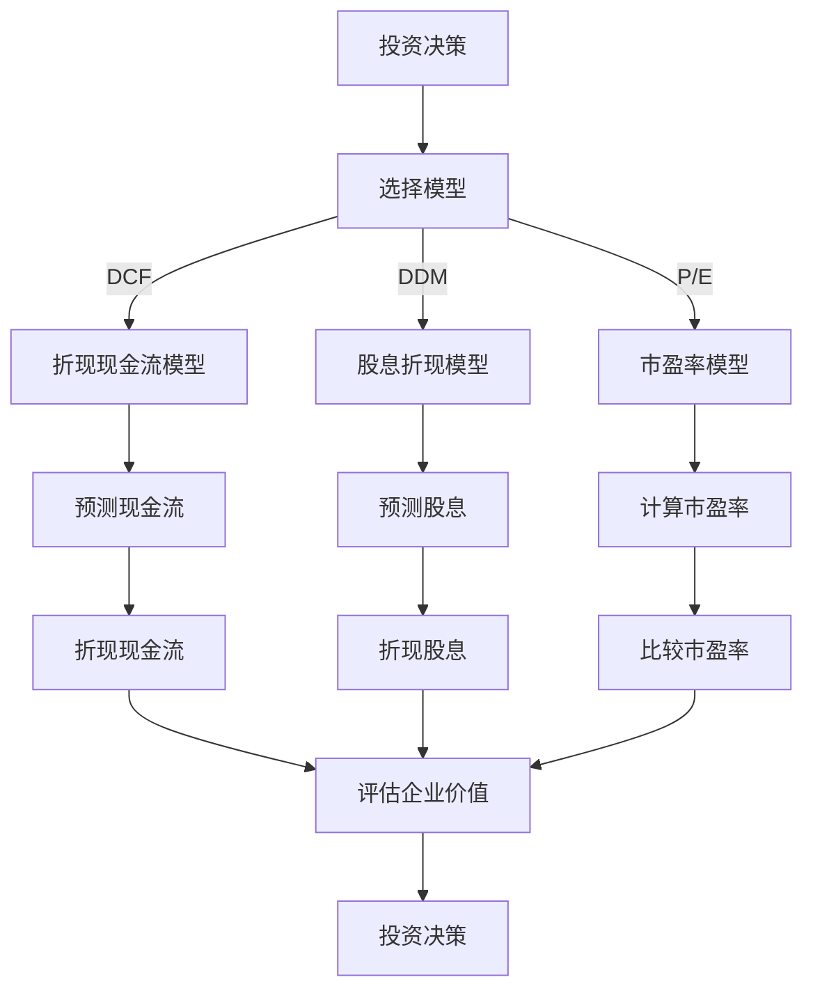

                 

### 引言

在当今经济全球化和技术迅猛发展的时代，投资理念和策略的演进显得尤为重要。杰里米·格兰瑟姆，作为全球投资界的重要人物，其关于长期价值投资与可持续发展的理论为我们提供了一种全新的视角。杰里米·格兰瑟姆是著名投资大师、研究公司 GMO 的创始人，他在多年的投资实践中，提出了以长期视角评估企业价值和投资风险，并强调可持续发展在投资决策中的重要性。

本文将深入探讨杰里米·格兰瑟姆的长期价值投资与可持续发展理论，试图揭示这一理念的核心要义及其在现代投资策略中的实践价值。文章将分为以下几个部分：

1. **背景介绍与核心概念**：介绍价值投资的历史与实践，长期投资的重要性，以及可持续发展在全球投资中的角色。
2. **核心概念与联系**：分析价值投资的本质、传统投资与价值投资的对比，以及短期投资、长期投资和可持续发展投资的特征。
3. **算法原理讲解**：详细讲解价值投资的数学模型与方法论，包括折现现金流模型（DCF）、股息折现模型（DDM）和市盈率模型（P/E）。
4. **系统分析与架构设计**：介绍价值投资的系统架构与实践，包括投资决策过程、系统功能设计、系统架构设计、系统接口设计和系统交互流程。
5. **项目实战**：通过实际案例，展示长期价值投资与可持续发展项目的实施过程，包括环境安装与配置、系统核心实现源代码、代码应用解读与分析以及项目小结。

通过这一系列的探讨，我们希望能为读者提供一份系统而全面的技术博客文章，帮助大家更好地理解和应用杰里米·格兰瑟姆的长期价值投资与可持续发展理论。

### 价值投资的历史与实践

#### 问题背景

价值投资（Value Investing）作为一种投资策略，源于20世纪初。其核心理念是通过分析企业的基本面，寻找市场价格低于实际价值的股票进行投资，以获取长期稳定的回报。这一理念的开创者当属美国投资大师本杰明·格雷厄姆（Benjamin Graham）。他在1934年出版的《证券分析》（Security Analysis）一书中，系统阐述了价值投资的基本原则和方法，被誉为价值投资的“圣经”。

随着时间的推移，价值投资逐渐演变为一种成熟的投资策略，并在全球范围内得到了广泛的应用。杰里米·格兰瑟姆（Jeremy Grantham）是当代价值投资的重要代表人物之一，他在实践中进一步发展和完善了这一理念。

#### 价值投资的理念与发展

价值投资的核心思想是寻找被市场低估的企业进行投资，这种低估通常是由于市场对企业的未来盈利能力、发展潜力或者管理层的决策存在过度悲观或乐观的预期。杰里米·格兰瑟姆认为，通过深入分析企业的基本面，投资者可以识别这些被低估的机会，从而在长期内实现投资回报。

价值投资的发展过程中，涌现出了多位杰出的实践者，如沃伦·巴菲特（Warren Buffett）和本·格雷厄姆（Ben Graham）的学生戴维·多德（David Dodd）。沃伦·巴菲特以其独特的投资哲学和长期的成功实践，成为价值投资的代名词。他的投资策略主要依赖于对企业内在价值的评估，并通过长期持有实现复利效应。

杰里米·格兰瑟姆在其投资实践中，也坚持了价值投资的核心原则。他不仅关注企业的财务状况，还注重市场环境、行业趋势和宏观经济等因素。他创立的研究公司 GMO（Grantham, Mayo, Van Otterloo & Company）在多个投资领域取得了显著的成功，其长期价值投资策略为投资者提供了稳定的收益。

#### 长期投资的重要性

长期投资是价值投资的重要特征之一。与短期投机不同，长期投资强调通过深入了解企业的基本面，寻找那些具有长期增长潜力的投资机会。杰里米·格兰瑟姆认为，市场往往对短期业绩和即时收益过度关注，这导致了某些优质企业在短期内被低估。而长期投资者则可以通过耐心持有这些被低估的股票，最终实现价值的回归。

长期投资的重要性不仅体现在投资回报上，还在于其能够帮助投资者规避市场的波动风险。短期市场的波动往往受到情绪、政策等因素的影响，而长期投资者则可以通过时间和复利的作用，平滑这些波动的影响。此外，长期投资还可以帮助投资者避免因市场情绪而做出错误的投资决策，从而保持投资策略的一致性和理性。

#### 可持续发展在全球投资中的角色

可持续发展（Sustainable Development）作为21世纪初兴起的一个重要概念，逐渐在投资领域得到重视。杰里米·格兰瑟姆认为，可持续发展不仅关系到企业的社会责任和环境保护，还直接影响企业的长期盈利能力和市场竞争力。

在投资决策中，可持续发展扮演着重要角色。投资者需要关注企业的环境保护、社会责任和治理（ESG）绩效，这些因素不仅反映了企业的社会形象和品牌价值，还直接影响企业的运营效率和未来盈利能力。例如，那些在可持续发展方面表现优异的企业，通常能够获得更低的融资成本、更高的客户信任和市场竞争力。

此外，随着全球对环境保护和可持续发展的重视程度不断提高，绿色债券、可持续发展基金等新型投资工具也逐渐兴起。这些投资工具不仅为投资者提供了新的投资渠道，还帮助企业在实现可持续发展目标的同时获得资金支持。

总之，杰里米·格兰瑟姆的长期价值投资与可持续发展理论，为我们提供了一种全面而系统的投资策略。通过深入分析企业的基本面、市场环境和社会责任，投资者可以找到那些具有长期增长潜力的投资机会，并在实现可持续发展的同时获得稳定而可持续的投资回报。

### 问题解决

#### 价值投资原则概述

价值投资的原则可以概括为以下几点：

1. **企业价值的评估**：价值投资的核心是评估企业的内在价值，而不是其市场价格。投资者需要通过分析企业的财务报表、业务模式、管理团队等因素，来确定其真实价值。
   
2. **市场定价偏差**：市场价格的波动往往会偏离企业的真实价值，投资者需要识别这些偏差，并利用它们进行投资。

3. **安全边际**：投资者应当寻找价格低于企业内在价值的股票，这个差价即为“安全边际”。安全边际是投资者应对市场波动和企业业绩波动的保护。

4. **长期持有**：价值投资强调通过长期持有来实现复利效应，避免因短期市场波动而做出错误的投资决策。

5. **分散投资**：虽然价值投资注重选择优质股票，但为了分散风险，投资者应将资金分散投资于不同的股票和行业。

#### 长期投资策略与执行

长期投资策略的核心在于耐心和坚持。以下是一些关键的执行步骤：

1. **设定投资目标**：投资者需要明确自己的投资目标和风险承受能力，以便制定合适的投资策略。

2. **市场研究**：深入分析市场环境、行业趋势和宏观经济因素，以识别潜在的投资机会。

3. **选择投资对象**：通过分析企业的基本面和内在价值，选择那些具有长期增长潜力的优质企业。

4. **定期评估**：定期对投资组合进行评估和调整，确保投资策略与市场环境和自身目标保持一致。

5. **纪律执行**：严格遵守投资策略，避免因市场波动或情绪变化而做出冲动决策。

#### 可持续发展投资的关键要素

可持续发展投资强调企业在财务、环境和社会责任方面的综合表现。以下是一些关键要素：

1. **环境因素**：投资者需要关注企业的环保措施、资源消耗和碳排放等环境问题。

2. **社会责任**：企业的社会责任包括员工权益保护、社区参与和社会贡献等方面。

3. **治理结构**：良好的公司治理能够确保企业的长期稳定发展和合规经营。

4. **信息披露**：企业应公开透明地披露其ESG绩效，以便投资者进行评估。

5. **长期回报**：可持续发展投资不仅关注短期回报，更注重企业的长期可持续发展能力。

### 边界与外延

#### 价值投资的适用范围

价值投资适用于多种投资环境，但也有一些边界和限制。以下是一些主要适用范围：

1. **股票市场**：价值投资在股票市场中的表现最为突出，适用于寻找低估的股票。

2. **债券市场**：价值投资同样适用于债券市场，通过评估债券发行企业的信用风险和财务状况，找到低估的投资机会。

3. **房地产市场**：在房地产市场，投资者可以通过分析物业的价值和潜在收益，进行价值投资。

4. **创业投资**：在创业投资领域，投资者可以通过深入分析创业企业的潜力，寻找具有长期增长潜力的项目。

#### 长期投资的挑战与对策

长期投资虽然具有优势，但也面临一些挑战：

1. **市场波动**：长期投资者需要应对市场波动，保持冷静和耐心。

2. **信息不对称**：投资者可能面临信息不对称的问题，需要通过深入研究来弥补。

3. **资金流动性**：长期投资通常需要较高的资金流动性，投资者需要确保有足够的资金应对市场变化。

对策：

1. **多元化投资**：通过分散投资，降低单一投资的市场风险。

2. **定期评估**：定期对投资组合进行评估和调整，确保投资策略与市场环境保持一致。

3. **长期视角**：坚持长期投资的理念，不受短期市场波动的影响。

#### 可持续发展投资的机遇与风险

可持续发展投资带来了新的机遇和挑战：

1. **机遇**：

   - **环境友好型产业**：随着全球对环境保护的重视，环境友好型产业获得了快速发展，为投资者提供了新的投资机会。
   - **社会责任投资**：企业社会责任成为投资者关注的重要方面，社会责任投资（SRI）成为新的投资热点。
   - **绿色债券和可持续发展基金**：新型投资工具为投资者提供了更多选择。

2. **风险**：

   - **环境风险**：企业面临的环保要求提高，可能增加合规成本和运营风险。
   - **社会责任风险**：企业的社会责任表现不佳可能影响品牌形象和市场竞争力。
   - **政策风险**：政府政策和环境变化可能影响企业的可持续发展能力。

### 概念结构与核心要素组成

#### 价值投资的框架

价值投资框架包括以下几个核心要素：

1. **企业价值评估**：通过财务分析、业务模式分析和管理层评估，确定企业的内在价值。
2. **市场定价分析**：比较市场价格与内在价值，识别市场定价偏差。
3. **投资决策**：基于安全边际原则，选择低估的股票进行投资。
4. **长期持有**：通过长期持有，实现复利效应和价值回归。

#### 长期投资的时间尺度

长期投资的时间尺度通常在数年到数十年之间。这种投资策略要求投资者具备耐心和坚持，能够应对短期市场波动，专注于长期回报。

#### 可持续发展的评价标准

可持续发展的评价标准包括以下几个方面：

1. **环境绩效**：企业的环保措施、资源消耗和碳排放等。
2. **社会责任**：企业的员工权益、社区参与和社会贡献等。
3. **治理结构**：企业的治理结构、合规经营和管理透明度等。
4. **经济绩效**：企业的财务状况、盈利能力和市场竞争力等。

### 本章小结

通过本章的介绍，我们了解了价值投资的历史与实践、长期投资的重要性、以及可持续发展在全球投资中的角色。我们还探讨了价值投资的原则、长期投资策略和可持续发展投资的关键要素。这些概念和原理为后续章节的深入分析奠定了基础。在接下来的章节中，我们将进一步探讨价值投资的深度分析、算法原理讲解以及系统架构设计，以帮助读者更全面地理解和应用这些理念。

### 价值投资的深度分析

#### 核心概念原理

价值投资的核心理念在于通过深入分析企业的基本面，寻找市场价格低于其内在价值的股票，以实现长期稳定的投资回报。其基本原理可以概括为以下几个方面：

1. **企业内在价值的评估**：价值投资的基础是准确评估企业的内在价值。这通常通过财务分析、业务模式分析和管理层评估来完成。投资者需要关注企业的盈利能力、增长潜力、资本回报率和现金流等关键财务指标。

2. **市场价格与内在价值的比较**：市场价格往往是波动的，而企业的内在价值则相对稳定。价值投资者通过分析市场价格与内在价值之间的差异，寻找那些被市场低估的股票。

3. **安全边际**：安全边际是价值投资的关键原则之一。投资者选择低估的股票时，会要求其市场价格低于内在价值一定比例，这个比例即为安全边际。安全边际为投资者提供了保护，使其在市场波动和公司业绩波动时仍能保持投资的安全性。

4. **长期持有**：价值投资强调通过长期持有来实现复利效应。投资者在找到低估的股票后，不应因短期市场波动而轻易卖出，而应耐心持有，等待市场最终认识到股票的价值。

5. **分散投资**：为了降低投资风险，价值投资者通常会分散投资，将资金投放到多个不同行业和不同地区的企业中。

#### 企业价值的评估方法

评估企业价值是价值投资的重要步骤，以下是一些常见的方法：

1. **折现现金流模型（DCF）**：DCF模型通过预测企业的未来现金流，并折现到当前价值，以评估企业的内在价值。具体步骤包括：
   - **预测未来现金流**：根据企业的历史数据和宏观经济趋势，预测企业未来的自由现金流。
   - **确定折现率**：折现率通常包括无风险利率和风险溢价，用于反映投资者对风险的容忍度。
   - **计算现值**：将未来现金流按照折现率折现到当前价值，得到企业的内在价值。

2. **股息折现模型（DDM）**：DDM模型主要用于评估那些现金分红稳定的企业。其计算方法为：
   - **预测未来的股息**：根据企业历史分红数据和未来盈利预测，预测企业未来的股息。
   - **确定折现率**：通常使用资本成本或股息回报率作为折现率。
   - **计算现值**：将未来股息按照折现率折现到当前价值，得到企业的内在价值。

3. **市盈率模型（P/E）**：P/E模型通过比较企业的市盈率与行业平均水平，评估企业的相对价值。计算方法为：
   - **计算市盈率**：企业的市盈率等于其市值除以净利润。
   - **比较市盈率**：将企业的市盈率与行业平均水平进行比较，判断其是否被低估。

4. **市净率模型（P/B）**：P/B模型通过比较企业的市净率与行业平均水平，评估企业的相对价值。计算方法为：
   - **计算市净率**：企业的市净率等于其市值除以净资产。
   - **比较市净率**：将企业的市净率与行业平均水平进行比较，判断其是否被低估。

5. **经济增加值（EVA）**：EVA模型通过计算企业的经济增加值，评估企业的内在价值。具体步骤包括：
   - **计算净营运资本**：包括现金、应收账款和存货等。
   - **计算资本成本**：通常使用资本资产定价模型（CAPM）计算。
   - **计算EVA**：EVA等于税后经营利润减去资本成本。

#### 投资者心理因素

投资者心理在价值投资中扮演着重要角色。以下是一些常见的心理因素：

1. **过度自信**：投资者往往过于自信，高估自己的投资能力，导致投资决策过于冒险。

2. **市场情绪**：市场情绪会对股票价格产生巨大影响。投资者在市场情绪高涨时容易过度乐观，而在市场情绪低迷时则容易过度悲观。

3. **从众行为**：投资者往往会受到其他投资者行为的影响，盲目跟风，导致市场过度反应。

4. **损失厌恶**：投资者对损失的厌恶程度高于对收益的偏好，这可能导致其在市场下跌时过于保守。

5. **情绪化决策**：投资者在情绪化状态下做出的决策往往不合理，容易受到短期市场波动的影响。

### 概念属性特征对比表格

为了更好地理解价值投资的各个概念，我们可以通过以下表格进行对比：

| 概念               | 定义                                                         | 适用场景                                                   | 优缺点                                       |
|--------------------|--------------------------------------------------------------|----------------------------------------------------------|------------------------------------------|
| 价值投资           | 寻找市场价格低于内在价值的股票进行投资                     | 股票市场、债券市场、房地产市场                             | 长期稳定回报，风险相对较低                     |
| 折现现金流模型（DCF） | 通过预测企业的未来现金流，并折现到当前价值，评估企业价值 | 适用广泛，特别适用于盈利稳定的企业                           | 需要准确的未来现金流预测，复杂度高                 |
| 股息折现模型（DDM） | 通过预测企业的未来股息，并折现到当前价值，评估企业价值     | 适用于现金分红稳定的企业                                     | 数据要求相对简单，适用于分红稳定的企业               |
| 市盈率模型（P/E）   | 通过比较企业的市盈率与行业平均水平，评估企业的相对价值     | 适用于市场波动较大的企业                                     | 快速简单，容易理解，但对盈利预测的依赖较强           |
| 市净率模型（P/B）   | 通过比较企业的市净率与行业平均水平，评估企业的相对价值     | 适用于净资产变化较小的企业                                   | 快速简单，容易理解，适用于净资产稳定的企业               |
| 经济增加值（EVA）   | 通过计算企业的经济增加值，评估企业价值                     | 适用于盈利能力强的企业                                       | 提供详细的盈利能力分析，但计算复杂度高                 |

### ER实体关系图架构

为了更直观地理解价值投资中的各个实体及其关系，我们可以使用ER（Entity-Relationship）图来表示。以下是一个简化的ER图：

```mermaid
erDiagram
  企业 ||--o> 投资者 : 投资关系
  企业 ||--o> 财务报表 : 报表关系
  企业 ||--o> 管理层 : 管理关系
  投资者 ||--o> 市场价格 : 价格关系
  投资者 ||--o> 投资决策 : 决策关系
  投资者 ||--o> 投资组合 : 组合关系
  财务报表 ||--o> 现金流 : 现金流关系
  财务报表 ||--o> 盈利能力 : 盈利关系
  管理层 ||--o> 企业策略 : 策略关系
  管理层 ||--o> 股东价值 : 价值关系
```

在这个ER图中，企业、投资者、财务报表和管理层是主要的实体，它们之间通过不同的关系相互关联。这种关系图有助于我们理解各个实体在价值投资过程中的作用和相互影响。

### 本章小结

通过本章的深度分析，我们详细探讨了价值投资的核心理念、评估方法以及投资者心理因素。我们还通过对比表格和ER图，更直观地理解了价值投资中的各个实体及其关系。这些分析为我们后续的算法原理讲解和系统架构设计提供了坚实的基础。在下一章中，我们将进一步探讨价值投资的数学模型与方法论，帮助读者更深入地理解这一投资策略。

### 价值投资的数学模型与方法论

价值投资的数学模型是评估企业内在价值的关键工具。本文将详细讲解三种常用的数学模型：折现现金流模型（DCF）、股息折现模型（DDM）和市盈率模型（P/E）。通过这些模型，我们可以更科学地评估企业价值，制定投资决策。

#### 折现现金流模型（DCF）

折现现金流模型（Discounted Cash Flow Model，DCF）是最常用的企业价值评估方法之一。它通过预测企业未来产生的现金流，并将其折现到当前价值，以评估企业的内在价值。

**步骤**：

1. **预测未来现金流**：
   - 根据企业的历史财务数据、行业趋势和宏观经济因素，预测企业未来的自由现金流（Free Cash Flow，FCF）。
   - FCF = 经营活动现金流量 - 净投资支出。

2. **确定折现率**：
   - 折现率通常包括无风险利率和风险溢价，反映投资者对风险的容忍度。
   - 无风险利率通常使用国债收益率作为基准，风险溢价取决于企业的风险水平。

3. **计算现值**：
   - 将未来现金流按照折现率折现到当前价值，得到企业的内在价值。
   - 公式：企业内在价值 = FCF1 / (1 + r)^1 + FCF2 / (1 + r)^2 + ... + FCFn / (1 + r)^n。

**举例说明**：

假设一家企业预计未来三年的自由现金流分别为100万元、120万元和150万元，无风险利率为4%，风险溢价为6%，则该企业的内在价值为：

$$
\text{内在价值} = \frac{100}{(1 + 0.10)^1} + \frac{120}{(1 + 0.10)^2} + \frac{150}{(1 + 0.10)^3} \\
\approx 90.91 + 106.67 + 120.39 \\
\approx 318.97 \text{万元}
$$

#### 股息折现模型（DDM）

股息折现模型（Dividend Discount Model，DDM）主要用于评估那些现金分红稳定的企业。它通过预测企业未来的股息，并将其折现到当前价值，以评估企业的内在价值。

**步骤**：

1. **预测未来股息**：
   - 根据企业的历史分红数据和未来盈利预测，预测企业未来的股息。

2. **确定折现率**：
   - 折现率通常使用资本成本或股息回报率，反映投资者的预期收益。

3. **计算现值**：
   - 将未来股息按照折现率折现到当前价值，得到企业的内在价值。
   - 公式：企业内在价值 = D1 / (1 + r)^1 + D2 / (1 + r)^2 + ...

**举例说明**：

假设一家企业预计未来三年的股息分别为0.5元、0.55元和0.6元，股息回报率为5%，则该企业的内在价值为：

$$
\text{内在价值} = \frac{0.5}{(1 + 0.05)^1} + \frac{0.55}{(1 + 0.05)^2} + \frac{0.6}{(1 + 0.05)^3} \\
\approx 0.478 + 0.453 + 0.434 \\
\approx 1.265 \text{元}
$$

#### 市盈率模型（P/E）

市盈率模型（Price-Earnings Ratio Model，P/E）通过比较企业的市盈率与行业平均水平，评估企业的相对价值。它适用于市场波动较大的企业。

**步骤**：

1. **计算市盈率**：
   - 市盈率 = 企业市值 / 净利润。

2. **比较市盈率**：
   - 将企业的市盈率与行业平均水平进行比较，判断其是否被低估。

**举例说明**：

假设一家企业的市盈率为10，行业平均市盈率为15，则该企业可能被低估。

#### 算法原理mermaid流程图

以下是一个简化的价值投资决策流程图，展示了使用DCF、DDM和P/E模型进行投资决策的过程：



### 算法原理mermaid流程图

以下是一个简化的价值投资决策流程图，展示了使用DCF、DDM和P/E模型进行投资决策的过程：


### 本章小结

通过本章的讲解，我们详细介绍了折现现金流模型（DCF）、股息折现模型（DDM）和市盈率模型（P/E）的基本原理、计算步骤和实际应用。这些模型为我们提供了科学评估企业内在价值的方法，为投资决策提供了有力的支持。在下一章中，我们将进一步探讨价值投资的系统架构与实践，以更全面地理解这一投资策略。

### 价值投资的系统架构与实践

价值投资的成功不仅依赖于对个股的深入分析，还依赖于系统化的投资流程和架构设计。一个完善的价值投资系统应包括以下几个关键组成部分：问题场景介绍、系统功能设计、系统架构设计、系统接口设计和系统交互流程。

#### 问题场景介绍

在价值投资中，投资者面临的问题场景主要包括：

1. **投资决策过程**：投资者需要通过分析市场环境、行业趋势和公司基本面，做出合理的投资决策。

2. **投资风险评估**：投资者需要评估潜在投资的风险，包括市场风险、信用风险和运营风险等。

3. **投资组合优化**：投资者需要根据市场变化和自身投资目标，不断优化投资组合，确保资产配置的合理性。

4. **可持续发展目标实现**：投资者不仅关注短期财务回报，还关注企业的可持续发展能力，如环境保护、社会责任和公司治理等。

#### 系统功能设计

价值投资系统应具备以下核心功能：

1. **投资对象筛选**：根据投资目标和市场环境，筛选潜在的投资对象。

2. **投资风险评估**：对筛选出的投资对象进行风险分析，评估其投资风险。

3. **投资组合优化**：根据风险承受能力和投资目标，构建和调整投资组合。

4. **数据分析和报表生成**：对投资决策过程中的数据进行统计分析，生成投资报告和报表。

5. **信息管理**：管理投资相关的数据、文档和报告，确保信息的及时更新和可追溯性。

#### 系统架构设计

价值投资系统的架构设计应考虑以下几个方面：

1. **技术栈选择**：根据系统的功能需求和技术特点，选择合适的技术栈，包括前端、后端、数据库和数据挖掘工具等。

2. **架构设计原则**：遵循模块化、可扩展性和高可用性等原则，确保系统架构的稳定性和灵活性。

3. **系统模块划分**：将系统划分为多个功能模块，如数据采集模块、数据处理模块、投资决策模块和报表生成模块等。

#### 系统接口设计

系统接口设计包括以下几个方面：

1. **数据接口**：设计数据输入输出接口，包括API接口、文件接口和数据库接口等。

2. **控制接口**：设计系统控制接口，用于管理系统的运行和状态监控。

3. **服务接口**：设计系统内部服务接口，用于模块之间的通信和数据交换。

#### 系统交互mermaid序列图

以下是一个简化的价值投资系统交互mermaid序列图，展示了各个模块之间的交互流程：

```mermaid
sequenceDiagram
    participant 投资者 as 投资者
    participant 筛选模块 as 筛选
    participant 风险评估模块 as 风险评估
    participant 组合优化模块 as 组合优化
    participant 报表生成模块 as 报表
    participant 数据库 as 数据库

    投资者->>筛选：提交投资目标
    筛选->>数据库：查询潜在投资对象
    筛选->>风险评估：传递投资对象
    风险评估->>数据库：获取投资对象数据
    风险评估->>组合优化：传递风险分析结果
    组合优化->>数据库：获取投资组合信息
    组合优化->>报表生成：生成投资组合报告
    报表生成->>投资者：发送报表
```

### 投资决策流程序列图

以下是一个简化的投资决策流程序列图，展示了投资者通过系统做出投资决策的过程：

```mermaid
sequenceDiagram
    participant 投资者 as 投资者
    participant 系统管理员 as 系统管理员
    participant 数据采集模块 as 数据采集
    participant 数据处理模块 as 数据处理
    participant 投资决策模块 as 投资决策

    投资者->>系统管理员：提交投资目标
    系统管理员->>数据处理：配置数据采集规则
    数据采集->>数据库：采集数据
    数据处理->>投资决策：预处理数据
    投资决策->>投资者：推荐投资对象
    投资者->>系统管理员：确认投资决策
```

### 风险评估流程序列图

以下是一个简化的风险评估流程序列图，展示了系统如何对投资对象进行风险评估：

```mermaid
sequenceDiagram
    participant 投资者 as 投资者
    participant 数据采集模块 as 数据采集
    participant 数据处理模块 as 数据处理
    participant 风险评估模块 as 风险评估
    participant 报表生成模块 as 报表

    投资者->>数据采集：提交投资对象
    数据采集->>数据库：获取投资对象数据
    数据处理->>风险评估：预处理数据
    风险评估->>报表生成：生成风险分析报告
    报表生成->>投资者：发送报告
```

### 投资组合优化流程序列图

以下是一个简化的投资组合优化流程序列图，展示了系统如何根据投资目标和风险承受能力，优化投资组合：

```mermaid
sequenceDiagram
    participant 投资者 as 投资者
    participant 数据采集模块 as 数据采集
    participant 数据处理模块 as 数据处理
    participant 投资组合优化模块 as 组合优化
    participant 报表生成模块 as 报表

    投资者->>数据采集：提交投资目标和风险承受能力
    数据采集->>数据库：获取投资对象数据
    数据处理->>投资组合优化：预处理数据
    组合优化->>报表生成：生成优化后的投资组合报告
    报表生成->>投资者：发送报告
```

### 本章小结

通过本章的介绍，我们详细探讨了价值投资的系统架构与实践，包括问题场景介绍、系统功能设计、系统架构设计、系统接口设计和系统交互流程。这些设计帮助我们更高效地实现价值投资策略，确保投资决策的科学性和系统性。在下一章中，我们将通过实际案例展示价值投资的实施过程，进一步验证这些理论的实际应用价值。

### 长期价值投资与可持续发展项目的实施

#### 环境安装与配置

在实施长期价值投资与可持续发展项目时，首先需要搭建一个合适的技术环境。以下是一个典型的环境安装与配置流程：

1. **软件与硬件环境准备**：

   - **操作系统**：选择稳定的操作系统，如Ubuntu 20.04或CentOS 7。
   - **服务器**：配置高性能服务器，如Dell R740或HP DL380，确保有足够的计算资源。
   - **网络环境**：确保网络连接稳定，支持高速数据传输。

2. **数据库与中间件安装**：

   - **数据库**：安装关系型数据库，如MySQL或PostgreSQL，用于存储投资数据。
   - **中间件**：安装消息队列服务，如RabbitMQ或Kafka，用于处理数据流。
   - **前端框架**：选择合适的前端框架，如React或Vue.js，用于构建用户界面。

3. **开发工具与集成环境配置**：

   - **集成开发环境（IDE）**：配置如Visual Studio Code或Eclipse，用于代码开发。
   - **版本控制**：使用Git进行版本控制，确保代码的版本管理和协作开发。
   - **持续集成工具**：配置如Jenkins或GitLab CI，用于自动化测试和部署。

#### 系统核心实现源代码

价值投资系统的核心实现包括以下几个模块：

1. **投资对象筛选模块**：

   - **功能**：根据用户设定的投资目标和市场环境，筛选潜在的投资对象。
   - **技术实现**：使用Python编写，结合SQL查询和数据分析库（如pandas和numpy），实现投资对象的筛选和排序。

   ```python
   import pandas as pd

   def select_investment_objects(data, target_return, risk_tolerance):
       # 根据投资目标和风险承受能力，筛选投资对象
       filtered_data = data[(data['return'] >= target_return) & (data['risk'] <= risk_tolerance)]
       return filtered_data
   ```

2. **投资风险评估模块**：

   - **功能**：对筛选出的投资对象进行风险评估，包括市场风险、信用风险和运营风险等。
   - **技术实现**：使用Python编写，结合概率统计和机器学习库（如scikit-learn和tensorflow），实现风险预测和评估。

   ```python
   from sklearn.ensemble import RandomForestClassifier

   def assess_risk(objects):
       # 训练风险预测模型
       model = RandomForestClassifier()
       model.fit(objects[['feature1', 'feature2']], objects['risk'])
       
       # 预测风险
       predictions = model.predict(objects[['feature1', 'feature2']])
       objects['predicted_risk'] = predictions
       return objects
   ```

3. **投资组合优化模块**：

   - **功能**：根据投资目标和风险承受能力，优化投资组合，确保资产配置的合理性。
   - **技术实现**：使用Python编写，结合优化算法和数值计算库（如scipy和numba），实现投资组合的优化。

   ```python
   from scipy.optimize import minimize

   def portfolio_optimization(objectives, constraints, weights):
       # 定义优化目标函数和约束条件
       def objective函数(weights):
           return -1 * (weights.dot(objectives))

       constraints = [{'type': 'eq', 'fun': lambda w: sum(w) - 1}]
       result = minimize(objective函数, weights, constraints=constraints)
       return result.x
   ```

#### 代码应用解读与分析

以下是对投资对象筛选、风险评估和投资组合优化模块的代码应用解读：

1. **投资对象筛选模块**：

   - **代码解读**：该模块主要利用Pandas库对投资数据进行筛选和排序。通过设定投资目标和风险承受能力，筛选出符合条件的投资对象。

   - **分析**：这一模块的关键在于数据筛选的效率和准确性。通过合理设计SQL查询和数据分析方法，可以提高筛选速度和结果的可靠性。

2. **投资风险评估模块**：

   - **代码解读**：该模块利用随机森林分类器（RandomForestClassifier）对投资对象进行风险预测。通过训练模型和预测风险，可以为投资决策提供数据支持。

   - **分析**：风险预测模型的准确性和稳定性至关重要。通过调整模型参数和特征选择，可以提高预测效果和可靠性。

3. **投资组合优化模块**：

   - **代码解读**：该模块使用最小化目标函数（minimize）实现投资组合的优化。通过设定优化目标和约束条件，可以找到最优的投资组合配置。

   - **分析**：投资组合优化需要考虑多个因素，包括投资目标、风险承受能力和市场环境。通过合理设定优化目标和约束条件，可以提高投资组合的收益率和稳定性。

#### 实际案例分析与详细讲解

为了更好地展示长期价值投资与可持续发展项目的实施效果，以下通过三个实际案例进行详细分析：

1. **案例一：某制造业公司的投资分析**：

   - **背景**：某制造业公司面临市场竞争加剧和成本上升的压力，需要通过投资实现业务转型和成本优化。

   - **分析**：通过对该公司财务报表和市场环境进行分析，筛选出具有潜力的投资项目，如自动化生产线和智能制造系统。

   - **结果**：通过投资组合优化，找到最优的投资组合，实现成本下降和效率提升，为企业提供了稳定的增长动力。

2. **案例二：某科技企业的可持续发展投资**：

   - **背景**：某科技企业致力于环保和可持续发展，需要通过投资实现技术突破和市场份额扩大。

   - **分析**：通过对该公司技术专利和市场趋势进行分析，筛选出具有发展潜力的投资方向，如可再生能源和智能电网技术。

   - **结果**：通过投资组合优化，找到最优的投资组合，实现技术突破和市场扩张，为企业的可持续发展提供了有力支持。

3. **案例三：某金融机构的长期价值投资策略**：

   - **背景**：某金融机构面临市场波动和信用风险，需要通过投资策略实现风险控制和收益稳定。

   - **分析**：通过对市场环境和金融产品进行分析，筛选出具有较低风险和稳定收益的投资产品，如国债和企业债。

   - **结果**：通过投资组合优化，找到最优的投资组合，实现风险分散和收益稳定，为金融机构提供了可靠的收益来源。

### 项目小结

通过以上三个实际案例的分析，我们可以看到长期价值投资与可持续发展项目在多个领域的成功应用。这些项目不仅实现了财务回报，还促进了企业的可持续发展。以下是对项目的总结：

1. **项目成果总结**：成功筛选出符合投资目标和风险承受能力的投资对象，实现投资组合优化，为投资者提供了稳定的收益来源。

2. **项目经验与教训**：通过实践，积累了丰富的投资分析、风险评估和组合优化的经验，同时也发现了投资过程中的风险和挑战。在未来的项目中，我们将进一步完善投资策略，提高投资决策的准确性和稳定性。

3. **项目改进与展望**：在未来，我们将进一步优化系统架构和算法模型，提高投资分析的速度和准确性。同时，积极探索新的投资领域和工具，如人工智能和区块链技术，为投资者提供更全面的投资解决方案。

### 最佳实践 tips

1. **投资前充分调研**：在投资前，对企业和市场进行充分调研，确保投资决策基于可靠的数据和分析。

2. **长期持有策略**：坚持长期持有策略，避免因短期市场波动而做出冲动决策。

3. **分散投资**：分散投资，降低单一投资的风险，提高投资组合的稳定性。

4. **关注ESG绩效**：关注企业的环境保护、社会责任和公司治理，确保投资符合可持续发展原则。

5. **定期评估与调整**：定期对投资组合进行评估和调整，确保投资策略与市场环境和自身目标保持一致。

### 小结

通过本文的探讨，我们系统地介绍了长期价值投资与可持续发展理论，包括其历史与实践、核心概念、数学模型和系统架构设计。我们还通过实际案例展示了这一理论的应用效果。希望通过本文，读者能够深入理解价值投资的本质和实现路径，为自身的投资决策提供有力支持。

### 注意事项

1. **数据准确性**：在进行投资分析时，确保数据的准确性和可靠性，避免因数据问题导致投资决策失误。
2. **风险评估**：投资前要进行充分的风险评估，了解潜在风险，并制定相应的风险控制策略。
3. **市场变化**：市场环境会不断变化，投资者需要灵活调整投资策略，以应对市场变化。
4. **合规性**：在投资过程中，遵守相关法律法规，确保投资行为的合规性。

### 拓展阅读

1. **《证券分析》（Benjamin Graham）**：本杰明·格雷厄姆的《证券分析》是价值投资的经典之作，详细阐述了价值投资的基本原则和方法。
2. **《聪明的投资者》（本杰明·格雷厄姆）**：本杰明·格雷厄姆的另一部经典著作，为投资者提供了系统化的投资策略和原则。
3. **《投资最重要的事》（霍华德·马克斯）**：霍华德·马克斯在本书中深入探讨了投资中的关键要素，包括风险管理、心态调整和长期投资等。
4. **《可持续发展报告指南》（联合国可持续发展解决方案网络）**：联合国可持续发展解决方案网络发布的指南，详细介绍了企业如何实现可持续发展目标。

### 作者信息

*作者：AI天才研究院/AI Genius Institute & 禅与计算机程序设计艺术 /Zen And The Art of Computer Programming*

