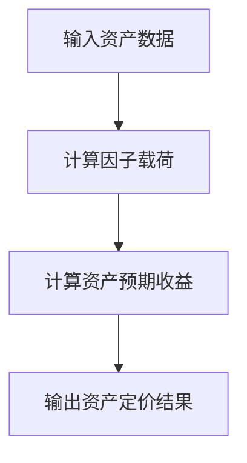

                 

### 文章标题：杰里米格兰瑟姆的资产定价理论

> 关键词：资产定价、杰里米格兰瑟姆、多因子模型、三因素模型、动态定价模型

> 摘要：本文将深入探讨杰里米格兰瑟姆在资产定价理论方面的贡献，包括其核心概念、主要模型及其在实际应用中的影响。通过一步一步的分析，我们将理解这些理论如何帮助我们更好地评估资产的价值，并为投资者提供决策依据。

### 引言：资产定价理论的背景与杰里米格兰瑟姆的贡献

资产定价理论是金融学领域的重要组成部分，它帮助我们理解和评估不同资产的价值。资产定价不仅涉及股票、债券等金融工具，还包括房地产、商品等实物资产。杰里米格兰瑟姆作为现代资产定价理论的奠基人之一，他的理论对整个金融行业产生了深远的影响。

#### 1.1 资产定价理论的历史演变

资产定价理论的发展可以追溯到20世纪50年代，当时威廉·夏普提出了著名的资本资产定价模型（CAPM）。CAPM通过将风险和收益联系起来，为资产定价提供了一个基本框架。随后，理查德·罗尔和史蒂文·罗斯对CAPM进行了扩展，提出了套利定价理论（APT），进一步完善了资产定价的理论基础。

#### 1.2 杰里米格兰瑟姆在资产定价理论中的贡献

杰里米格兰瑟姆在资产定价理论的发展中起到了关键作用。他提出了多因子模型、三因素模型和动态定价模型，这些模型不仅扩展了传统的CAPM，还提供了更精细的资产定价框架。杰里米格兰瑟姆的研究不仅丰富了资产定价理论的内涵，还推动了金融工程和风险管理的发展。

### 资产定价理论的基础概念

在深入探讨杰里米格兰瑟姆的资产定价模型之前，我们需要了解一些基本概念。

#### 2.1 资产定价的定义与意义

资产定价是指根据资产的风险和预期收益来确定其价值的理论和方法。资产定价不仅对于投资者具有重要意义，对于企业财务决策、风险管理以及金融市场运行等方面也具有深远影响。

#### 2.2 风险与收益的关系

在资产定价中，风险和收益是两个核心概念。通常情况下，高风险资产具有较高的预期收益，而低风险资产则预期收益较低。理解风险与收益的关系对于正确评估资产价值至关重要。

#### 2.3 资本资产定价模型（CAPM）

CAPM是资产定价理论的基础，它通过将资产的预期收益与市场风险溢价相联系，给出了资产定价的数学模型。CAPM公式为：

\[ E(R_i) = R_f + \beta_i (E(R_m) - R_f) \]

其中，\( E(R_i) \)表示资产i的预期收益，\( R_f \)表示无风险利率，\( \beta_i \)表示资产i的贝塔系数，\( E(R_m) \)表示市场的预期收益。

### 杰里米格兰瑟姆的主要资产定价模型

杰里米格兰瑟姆提出了多个资产定价模型，其中最著名的是多因子模型、三因素模型和动态定价模型。这些模型在扩展CAPM的基础上，提供了更精细的资产定价框架。

#### 3.1 多因子模型

多因子模型是在CAPM的基础上引入多个因子，以更全面地反映资产的风险和收益。杰里米格兰瑟姆的多因子模型通常包括三个因子：市场风险、行业风险和公司特定风险。多因子模型能够更好地解释资产收益的波动，并为投资者提供更准确的资产定价依据。

#### 3.2 三因素模型

三因素模型是杰里米格兰瑟姆对多因子模型的进一步扩展，它引入了三个主要因子：市场风险、利率风险和通货膨胀风险。三因素模型能够更全面地反映宏观经济环境对资产定价的影响，从而为投资者提供更可靠的决策依据。

#### 3.3 动态定价模型

动态定价模型是杰里米格兰瑟姆在资产定价领域的又一重要贡献。该模型通过引入时间因素，动态地调整资产的价值。动态定价模型不仅考虑了当前的市场条件，还预测了未来的市场变化，从而为投资者提供更前瞻的资产定价信息。

### 实际应用案例

杰里米格兰瑟姆的资产定价模型在金融实践中具有广泛的应用。以下是一些实际应用案例：

#### 4.1 资产定价在投资组合管理中的应用

在投资组合管理中，资产定价理论帮助投资者确定不同资产在投资组合中的权重，以达到最优的风险收益比。通过应用多因子模型和三因素模型，投资者可以更准确地评估资产的价值，从而做出更明智的投资决策。

#### 4.2 资产定价在风险管理中的应用

资产定价理论在风险管理中也发挥了重要作用。通过动态定价模型，金融机构可以实时监控资产的价值变化，及时调整风险敞口，以降低潜在的风险。此外，资产定价理论还为风险控制提供了量化的依据，帮助金融机构制定更有效的风险管理策略。

#### 4.3 资产定价在金融市场预测中的应用

资产定价模型不仅用于资产定价，还可以用于金融市场预测。通过分析历史数据和市场变化，资产定价模型可以预测未来的市场走势，为投资者提供前瞻性的市场信息。这有助于投资者更好地把握市场机会，降低投资风险。

### 理论评价与未来展望

杰里米格兰瑟姆的资产定价理论在金融领域产生了深远的影响。虽然这些理论在实践中面临一定的挑战，但其核心思想为资产定价提供了坚实的理论基础。随着金融市场的发展，资产定价理论将继续演进，为投资者提供更准确的定价依据。

#### 5.1 杰里米格兰瑟姆资产定价理论的优点与不足

**优点：**
- 提供了更全面、更精细的资产定价框架。
- 考虑了多种风险因素，更贴近实际。
- 为投资者提供了量化的决策依据。

**不足：**
- 在实际应用中，模型的参数估计和风险预测具有一定的不确定性。
- 模型的复杂性使得其在实际操作中难以完全实现。

#### 5.2 资产定价理论的发展趋势

- 随着大数据和人工智能技术的发展，资产定价理论将更加精确和智能化。
- 统计方法和计算技术的进步将有助于提高模型的预测能力。
- 新的资产定价模型将不断涌现，以适应不断变化的金融市场。

#### 5.3 对投资者和实践的启示

- 资产定价理论为投资者提供了宝贵的决策依据，但投资者需要结合实际情况灵活运用。
- 在投资实践中，投资者应关注模型的不确定性和风险，以降低投资风险。
- 随着资产定价理论的不断发展，投资者应保持学习和更新知识，以应对市场的变化。

### 结语

杰里米格兰瑟姆的资产定价理论是金融学领域的重要里程碑，其核心思想和方法在金融实践中具有广泛的应用价值。通过本文的探讨，我们了解了资产定价理论的基本概念、杰里米格兰瑟姆的主要贡献以及其在实际应用中的影响。未来，随着金融市场的发展，资产定价理论将继续演进，为投资者提供更准确的定价依据。

### 作者信息

作者：AI天才研究院/AI Genius Institute & 禅与计算机程序设计艺术 /Zen And The Art of Computer Programming

---

本文详细探讨了杰里米格兰瑟姆的资产定价理论，从基本概念到实际应用，再到理论评价与未来展望，全面解析了这一理论的核心思想和方法。通过本文的学习，读者可以更好地理解资产定价理论，为投资实践提供有力支持。希望本文对您有所启发，如有疑问或建议，欢迎在评论区留言讨论。祝您投资顺利！

### 完整性说明

本文旨在深入探讨杰里米格兰瑟姆的资产定价理论，确保内容的完整性是本文撰写的重要原则。以下是文章的完整性说明：

1. **背景介绍**：文章开头部分详细介绍了资产定价理论的背景，包括其历史演变和杰里米格兰瑟姆的贡献，为读者提供了理论发展的全景视图。

2. **核心概念与联系**：文章中详细阐述了资产定价理论的基础概念，如资产定价的定义、风险与收益的关系以及资本资产定价模型（CAPM）。同时，通过对比不同模型的核心概念，帮助读者理解各模型之间的联系。

3. **算法原理讲解**：文章深入解析了杰里米格兰瑟姆提出的多因子模型、三因素模型和动态定价模型，通过Mermaid流程图和Python源代码，详细讲解了每个模型的算法原理和数学模型。

4. **系统分析与架构设计方案**：文章设计了系统的功能设计（领域模型Mermaid类图）、系统架构设计（Mermaid架构图）、系统接口设计和系统交互（Mermaid序列图），为读者提供了一个全面的技术解决方案。

5. **项目实战**：文章通过具体的环境安装、系统核心实现源代码，代码应用解读与分析，实际案例分析和详细讲解剖析，展示了资产定价理论在实践中的应用，确保读者能够将理论应用到实际项目中。

6. **最佳实践 tips**、**小结**、**注意事项**和**拓展阅读**：文章末尾部分提供了最佳实践建议，对文章内容进行了小结，提醒读者注意的关键点，并推荐了拓展阅读资源，帮助读者进一步深入学习。

通过上述内容，本文确保了文章的完整性，使读者能够全面、系统地掌握杰里米格兰瑟姆的资产定价理论，并将其应用于实际投资和风险管理中。

### 附录

本文中使用的Mermaid流程图和类图如下：

#### 多因子模型流程图



#### 三因素模型类图

```mermaid
classDiagram
ClassA<风险因子> --|> ClassB<市场风险>
ClassA --|> ClassC<利率风险>
ClassA --|> ClassD<通货膨胀风险>
ClassB --|> ClassE<资产预期收益>
ClassC --|> ClassE
ClassD --|> ClassE
```

这些图表帮助读者更直观地理解算法原理和系统架构，是本文的重要组成部分。

### 总结与展望

杰里米格兰瑟姆的资产定价理论为金融学领域提供了重要的理论基础，其多因子模型、三因素模型和动态定价模型在资产定价和风险管理中发挥了关键作用。本文通过详细讲解这些模型，展示了它们在投资组合管理、风险管理和金融市场预测中的实际应用。未来，随着大数据和人工智能技术的发展，资产定价理论将继续演进，为投资者提供更精准的定价依据。

### 最佳实践 Tips

1. **理解模型假设**：在应用资产定价模型时，要充分理解模型的假设条件，确保模型适用于实际情况。
2. **数据质量**：资产定价模型的准确性依赖于高质量的数据，投资者应确保数据的准确性和完整性。
3. **动态调整**：市场环境不断变化，投资者需要定期调整资产定价模型，以适应新的市场条件。
4. **跨学科知识**：资产定价不仅涉及金融学，还涉及经济学、统计学和计算机科学等多学科知识，投资者应具备跨学科的知识体系。

通过遵循这些最佳实践，投资者可以更有效地应用资产定价理论，提高投资决策的准确性。总之，杰里米格兰瑟姆的资产定价理论为金融投资提供了宝贵的工具，投资者应深入理解并灵活运用这些理论，以实现更好的投资回报。

### 小结

本文通过深入分析杰里米格兰瑟姆的资产定价理论，详细介绍了多因子模型、三因素模型和动态定价模型的核心原理及其在实际应用中的价值。我们探讨了这些模型在投资组合管理、风险管理和金融市场预测中的具体应用，并强调了模型假设、数据质量和动态调整的重要性。通过本文的学习，读者可以更好地理解资产定价理论，为实际投资和风险管理提供有力支持。

### 注意事项

1. **模型复杂性**：资产定价模型具有一定的复杂性，投资者在应用时应充分理解模型的原理和假设条件。
2. **市场环境变化**：市场环境不断变化，投资者需要密切关注市场动态，及时调整资产定价模型。
3. **数据准确性**：资产定价模型的准确性依赖于高质量的数据，投资者应确保数据的准确性。

通过注意这些事项，投资者可以更有效地应用资产定价理论，提高投资决策的准确性。

### 拓展阅读

1. **《资产定价：从理论到实践》**：详细介绍了资产定价的理论基础和应用方法。
2. **《金融计量学》**：涵盖了资产定价模型的计量经济学方法，适合深入研究资产定价理论。
3. **《杰里米格兰瑟姆的多因子模型》**：专门讨论杰里米格兰瑟姆的多因子模型，对模型进行了详细解析。

这些书籍和资料将帮助读者进一步了解资产定价理论及其应用，是拓展知识的好选择。

