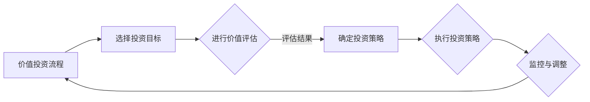
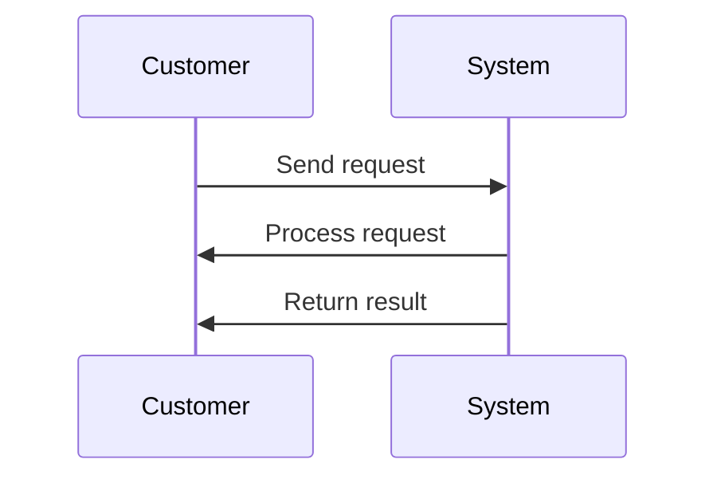
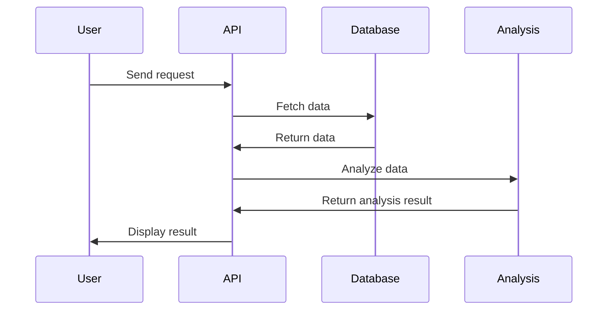

                 

### 前言

**引言**

在当今快速变化的世界中，投资成为了许多人财富增长的重要途径。然而，如何选择正确的投资策略，实现长期稳健的财富增长，是每个投资者都必须面对的问题。杰里米·格兰瑟姆（Jeremy Grantham）作为著名的价值投资大师，通过其深刻的市场洞察和独特的投资策略，为投资者提供了宝贵的指导。

**作者介绍**

杰里米·格兰瑟姆是著名的投资专家，长期致力于价值投资的研究与实践。他现任惠理基金（GMO LLC）的董事长和首席投资策略师，曾成功预测了多次市场波动和经济周期。他的著作《长期投资：价值投资的实战策略》（Long-Term Capital: How to Prosper in the New Global Economy）为投资者提供了宝贵的经验和洞见。

**书籍目的与结构**

本书旨在探讨价值投资的理念、策略和实践，帮助读者理解并运用价值投资方法进行长期投资。本书分为五个部分，涵盖了价值投资的基本原则、策略与方法、市场波动与风险管理、具体案例研究和未来展望。每个部分都通过深入分析和实例讲解，为读者提供了系统的指导和实用的建议。

### 第1章：价值投资的理论基础

#### 1.1 投资与财富创造

**财富创造的本质**

投资是财富增长的重要手段，其本质是通过购买资产并持有一定时间，以期获取收益。财富创造不仅依赖于资产的增值，还包括资产的合理配置和风险控制。从经济学角度来看，投资行为本质上是一种资源的重新分配，投资者通过投资实现资产的优化配置，从而提高整体财富水平。

**投资与财富积累**

投资与财富积累的关系紧密相连。通过投资，个人或机构可以获取资本增值、分红收益以及资产保值等多种收益。长期稳定的投资策略不仅能够实现财富的持续增长，还能够有效抵御通货膨胀和货币贬值的影响。因此，投资在个人和企业的财富积累中扮演着至关重要的角色。

#### 1.2 价值投资的起源与发展

**价值投资的历史背景**

价值投资的理念可以追溯到20世纪30年代，由本杰明·格雷厄姆（Benjamin Graham）所创立。格雷厄姆提出了“价值投资”这一概念，主张投资者应该以低于企业实际价值的股价购买股票，从而实现长期稳定的投资回报。这一理念在随后的几十年中得到广泛应用和发展，成为了现代投资理论的重要基石。

**价值投资的关键人物与理念**

除了格雷厄姆，沃伦·巴菲特（Warren Buffett）是另一位对价值投资产生深远影响的人物。巴菲特继承了格雷厄姆的价值投资理念，并在此基础上提出了“价值投资+企业价值分析”的方法。他强调投资决策必须基于对企业的深度分析和理解，以确保投资的安全性。

**价值投资的核心原则**

价值投资的核心原则主要包括以下几点：

1. **安全边际**：投资者应选择价格低于企业实际价值的股票，确保在投资时具有一定的安全边际。
2. **均值回归**：市场价格通常会回归到其内在价值，投资者应耐心等待市场修正。
3. **市场效率**：市场并不是完全有效的，存在定价错误和机会，投资者可以通过深入研究找到这些机会。

#### 1.3 价值投资的核心原则

**安全边际**

安全边际是价值投资中最核心的原则之一。它要求投资者在购买股票时，价格必须低于企业的实际价值，从而提供一种保护机制，以应对市场波动和不确定性。安全边际的存在使得投资者在面临市场不确定性时，仍能保持相对稳定的投资回报。

**均值回归**

均值回归理论认为，市场价格最终会回归到其内在价值。这意味着，尽管市场价格在短期内可能会偏离实际价值，但长期来看，市场会逐步调整至合理的估值水平。投资者可以通过耐心持有股票，等待市场修正，以实现投资回报。

**市场效率**

市场效率是指市场价格能够快速、准确地反映所有可用信息。尽管市场并不是完全有效的，但通过深入研究，投资者可以发现那些被市场低估的股票，从而获得超额收益。

#### 1.4 价值投资与传统投资比较

**传统投资策略**

传统投资策略主要包括以下几种：

1. **增长投资**：主要关注公司的增长潜力，投资于高成长性的公司。
2. **分散投资**：通过投资多种资产来分散风险，实现风险的多元化。
3. **技术分析**：利用历史价格和交易量等数据，预测市场趋势。

**价值投资的独特优势**

与传统的投资策略相比，价值投资具有以下独特优势：

1. **风险控制**：通过选择价格低于企业实际价值的股票，确保投资的安全性和稳定性。
2. **长期视角**：注重长期投资回报，而非短期市场波动。
3. **深入研究**：通过深入研究企业基本面，寻找被市场低估的机会。

#### 1.5 价值投资的实践意义

**长期投资视角**

价值投资强调长期投资视角，而非短期市场波动。这种投资策略有助于投资者避免情绪化决策，专注于企业的长期表现，从而实现稳健的财富增长。

**应对市场波动**

市场波动是投资中不可避免的一部分。价值投资通过选择价格低于企业实际价值的股票，确保在市场波动时仍能保持相对稳定的投资回报。

### 第2章：评估企业价值的工具

#### 2.1 企业价值评估的基本概念

**企业价值评估的重要性**

企业价值评估是投资决策的重要依据，它帮助投资者了解企业的真实价值和潜在投资回报。准确的企业价值评估不仅能够提高投资决策的准确性，还能够为投资者提供合理的买卖时机。

**企业价值评估的关键因素**

企业价值评估涉及多个关键因素，包括财务指标、市场指标和公司基本面。以下是这些因素的具体说明：

1. **盈利能力指标**：如净利润率、毛利率等，反映企业的盈利水平。
2. **财务稳定性指标**：如负债比率、流动比率等，反映企业的财务状况。
3. **成长性指标**：如收入增长率、市场份额等，反映企业的成长潜力。
4. **市场指标**：如市盈率、市净率等，反映股票的市场估值。

#### 2.2 财务指标分析

**盈利能力指标**

盈利能力是评估企业价值的重要指标之一。以下是一些常见的盈利能力指标及其计算方法：

1. **净利润率**：净利润率 = 净利润 / 营业收入。净利润率越高，说明企业的盈利能力越强。
2. **毛利率**：毛利率 = 毛利润 / 营业收入。毛利率越高，说明企业的成本控制能力越强。

**财务稳定性指标**

财务稳定性是评估企业是否能够持续运营和偿还债务的重要因素。以下是一些常见的财务稳定性指标及其计算方法：

1. **负债比率**：负债比率 = 总负债 / 总资产。负债比率越低，说明企业的财务状况越稳定。
2. **流动比率**：流动比率 = 流动资产 / 流动负债。流动比率越高，说明企业的短期偿债能力越强。

**成长性指标**

成长性是评估企业未来价值的重要指标。以下是一些常见的成长性指标及其计算方法：

1. **收入增长率**：收入增长率 = （本期收入 - 上期收入）/ 上期收入。收入增长率越高，说明企业的成长潜力越大。
2. **市场份额**：市场份额 = 企业销售额 / 行业总销售额。市场份额越高，说明企业的市场竞争力越强。

#### 2.3 市场指标分析

**市盈率（P/E）**

市盈率是评估股票价格是否合理的常用指标。它通过比较企业的市场价格和每股收益，反映股票的估值水平。计算方法如下：

市盈率 = 企业市场价格 / 每股收益。

**市净率（P/B）**

市净率是另一个重要的市场指标，它通过比较企业的市场价格和每股净资产，反映股票的估值水平。计算方法如下：

市净率 = 企业市场价格 / 每股净资产。

**企业价值与市场预期比较**

企业价值与市场预期比较是评估股票是否被高估或低估的重要方法。以下是一种简单的比较方法：

1. **企业价值**：通过财务指标和成长性指标计算得出。
2. **市场预期**：通过市场分析师和投资者的预期估值得出。

通过比较企业价值和市场预期，可以判断股票是否被低估或高估。

#### 2.4 企业估值模型

**模型选择**

选择合适的估值模型是评估企业价值的关键。以下是一些常用的估值模型：

1. **企业自由现金流折现模型（DCF）**：通过预测企业的未来现金流，并将其折现到现值，得出企业的估值。
2. **经济增加值模型（EVA）**：通过计算企业的经济增加值，评估企业的真实价值。
3. **相对估值模型**：通过比较同类企业的市场估值，得出企业的估值。

**企业自由现金流折现模型（DCF）**

企业自由现金流折现模型（DCF）是评估企业价值的一种常用方法。它通过预测企业的未来现金流，并将其折现到现值，得出企业的估值。计算方法如下：

企业价值 = CF1 / (1 + r) + CF2 / (1 + r)^2 + ... + CFn / (1 + r)^n

其中，CF表示未来现金流，r表示折现率，n表示未来现金流的期数。

**经济增加值模型（EVA）**

经济增加值模型（EVA）通过计算企业的经济增加值，评估企业的真实价值。EVA的计算方法如下：

EVA = 净利润 - 资本成本

经济增加值越高，说明企业的价值越高。

**相对估值模型**

相对估值模型通过比较同类企业的市场估值，得出企业的估值。常用的相对估值指标包括市盈率、市净率和市销率等。

#### 2.5 实战案例分析

**案例介绍**

为了更好地理解企业价值评估的方法和应用，我们以某知名科技公司为例，进行实战案例分析。

**价值评估过程**

首先，我们通过财务指标和成长性指标，对公司的盈利能力、财务稳定性和成长潜力进行评估。然后，我们使用企业自由现金流折现模型（DCF）和相对估值模型，对公司的价值进行预测和比较。

**结果分析与启示**

通过案例分析和价值评估，我们发现该公司的股票价格相对其内在价值较低，具有一定的投资潜力。这一分析结果为我们提供了重要的投资参考，帮助我们做出更为明智的投资决策。

### 第3章：市场波动与风险管理

#### 3.1 市场波动的原因与影响

**市场波动的内在原因**

市场波动是金融市场不可避免的现象，其内在原因主要包括以下几个方面：

1. **经济周期**：经济周期是市场波动的主要驱动力，包括繁荣期、衰退期、复苏期和萧条期。每个周期都伴随着市场的波动。
2. **政策变化**：政府的政策变化，如利率调整、财政政策等，也会对市场产生重要影响。
3. **市场情绪**：市场情绪的变化，如乐观、悲观、贪婪和恐慌等，也会引发市场波动。
4. **信息不对称**：市场参与者之间的信息不对称会导致市场价格的偏离，从而引发波动。

**市场波动对投资策略的影响**

市场波动对投资策略的影响是显著的，主要体现在以下几个方面：

1. **投资风险增加**：市场波动增加了投资的不确定性，投资者需要应对更高的风险。
2. **投资机会增多**：市场波动提供了更多的投资机会，投资者可以寻找被低估的股票或资产。
3. **投资策略调整**：为了应对市场波动，投资者需要调整投资策略，如增加分散投资、调整资产配置等。

#### 3.2 长期价值投资的策略调整

**应对市场波动的策略**

长期价值投资在应对市场波动时，可以采取以下策略：

1. **分散投资**：通过投资多种不同类型的资产，降低单一资产的风险。
2. **耐心持有**：长期价值投资强调耐心持有，等待市场修正，实现投资回报。
3. **风险管理**：投资者需要建立有效的风险管理机制，如设置止损点、定期调整资产配置等。

**风险管理的重要性**

风险管理在投资过程中至关重要，它有助于投资者：

1. **降低风险**：通过合理分散投资和风险控制，降低投资组合的整体风险。
2. **保持投资信心**：有效的风险管理有助于投资者在市场波动时保持冷静和信心。
3. **实现长期稳健收益**：合理控制风险是实现长期投资目标的关键。

**风险评估与分散投资**

投资者在进行风险评估时，需要综合考虑以下几个方面：

1. **系统性风险**：如市场波动、经济周期等，这些风险难以通过分散投资消除。
2. **非系统性风险**：如特定行业、公司风险等，这些风险可以通过分散投资降低。

**分散投资策略**

分散投资可以通过以下几种方式实现：

1. **资产分散**：投资不同类型的资产，如股票、债券、房地产等。
2. **行业分散**：投资不同行业的公司，降低行业特定风险。
3. **地域分散**：投资不同地区的公司，降低地域风险。

#### 3.3 长期投资的心态管理

**投资者心态的影响**

投资者心态对投资决策和投资回报有着重要影响。以下几种心态问题需要投资者特别注意：

1. **贪婪**：过度追求短期收益，忽视风险，可能导致投资失败。
2. **恐惧**：对市场波动过度敏感，可能导致错失投资机会或做出不理智的投资决策。
3. **从众**：盲目跟随市场趋势，忽视自身研究和判断。

**如何保持理性投资**

为了保持理性投资，投资者可以采取以下措施：

1. **制定投资计划**：明确投资目标、风险承受能力和投资策略。
2. **定期评估和调整**：根据市场变化和投资目标，定期评估和调整投资组合。
3. **保持独立思考**：独立分析市场信息，不盲目跟风。

**持续学习和适应市场变化**

投资是一个不断学习和适应的过程。投资者需要：

1. **不断学习新知识**：了解市场动态、行业趋势和投资策略。
2. **保持开放心态**：接受新观点和经验，不断改进投资策略。
3. **适应市场变化**：根据市场变化调整投资策略，以应对不同市场环境。

#### 3.4 实战案例分析

**案例背景**

为了更好地理解市场波动与风险管理在实际投资中的应用，我们以某投资者的投资经历为例，进行案例分析。

**风险管理与策略调整**

在案例中，投资者面临着市场波动和不确定性。为了应对这些挑战，投资者采取了以下风险管理策略：

1. **分散投资**：通过投资多种不同类型的资产和行业，降低风险。
2. **定期评估**：定期评估投资组合，根据市场变化调整资产配置。
3. **设置止损点**：在投资时设置合理的止损点，以防止亏损扩大。

**投资结果与经验总结**

通过有效的风险管理和策略调整，投资者在市场波动中实现了稳健的投资回报。这一案例表明，长期价值投资不仅需要深入的市场分析和策略制定，还需要良好的心态管理和风险控制。

### 第4章：杰里米格兰瑟姆的投资实践

#### 4.1 格兰瑟姆的投资理念

**职业生涯**

杰里米·格兰瑟姆在投资领域拥有丰富的经验，其职业生涯始于1970年代。他曾在投资公司工作，并逐渐崭露头角。1990年代，格兰瑟姆加入了著名的惠理基金（GMO LLC），并迅速成为该基金的核心人物。他在基金管理中的卓越表现，使他成为全球知名的投资专家。

**投资哲学与原则**

格兰瑟姆的投资哲学基于价值投资的核心原则，他强调以下几点：

1. **长期视角**：格兰瑟姆认为，投资者应该以长期视角看待投资，避免短视行为。他强调耐心持有优质股票，以实现长期稳定的投资回报。
2. **安全边际**：格兰瑟姆主张在购买股票时，必须确保价格低于企业的实际价值，以提供安全边际。
3. **深入研究**：格兰瑟姆认为，投资者应该深入研究企业的基本面，了解其业务模式、竞争优势和市场前景。通过深入研究，投资者可以找到被市场低估的投资机会。
4. **风险管理**：格兰瑟姆注重风险管理，他认为合理的风险管理是投资成功的关键。他通过分散投资、设置止损点等方式，降低投资组合的整体风险。

#### 4.2 投资案例分析

**案例一：某科技企业投资**

**背景**

格兰瑟姆在某科技企业投资中，选择了公司A。这家公司是一家新兴的科技公司，专注于人工智能领域。尽管公司处于成长期，但市场对其估值相对较低。

**投资策略**

1. **价值评估**：格兰瑟姆通过财务指标、市场指标和成长性指标，对公司A进行了全面评估。他发现公司的盈利能力和成长性指标均表现良好，但市场估值相对较低，具有较好的投资潜力。
2. **分散投资**：格兰瑟姆并没有将全部资金投入公司A，而是采取了分散投资策略，投资了多家科技公司，以降低行业风险。
3. **长期持有**：格兰瑟姆决定长期持有公司A的股票，等待市场重新认识到公司的价值。

**结果**

经过多年的持有，公司A的股票价格逐步上涨，格兰瑟姆的投资回报显著。这一案例表明，通过价值评估和分散投资，投资者可以在成长型股票中实现稳健的投资回报。

**案例二：某消费品公司投资**

**背景**

在另一案例中，格兰瑟姆选择了公司B，一家知名的消费品公司。这家公司具有稳定的盈利能力和强大的市场地位，但市场估值相对较高。

**投资策略**

1. **价值评估**：格兰瑟姆对公司B进行了详细的财务分析，发现公司的盈利能力和财务稳定性指标均表现良好，但市场估值已接近其内在价值。
2. **分散投资**：格兰瑟姆选择在市场估值相对较低时，投资公司B，以降低投资组合的整体风险。
3. **市场调整**：格兰瑟姆预计，市场估值可能会因宏观经济因素或行业变化而调整，他决定等待市场重新评估公司B的价值。

**结果**

市场果然发生了变化，受到宏观经济不景气和行业竞争加剧的影响，公司B的股票价格出现了显著下跌。格兰瑟姆在市场调整中成功卖出公司B的股票，实现了稳健的投资回报。这一案例说明，通过市场调整和合理投资策略，投资者可以在估值较高时卖出股票，实现投资收益。

**案例三：某金融服务企业投资**

**背景**

在最后一个案例中，格兰瑟姆选择了公司C，一家金融服务企业。这家公司具有稳定的盈利能力和良好的市场地位，但市场对其估值存在争议。

**投资策略**

1. **价值评估**：格兰瑟姆对公司C进行了深入的财务分析，发现公司的盈利能力和财务稳定性指标均表现良好，但市场估值相对较低。
2. **分散投资**：格兰瑟姆决定投资公司C，并将其纳入投资组合，以平衡风险。
3. **长期持有**：格兰瑟姆预计，随着市场对公司C的重新评估，其股票价格有望上涨，因此决定长期持有公司C的股票。

**结果**

经过多年的持有，公司C的股票价格逐步上涨，格兰瑟姆的投资回报显著。这一案例表明，通过价值评估和长期持有，投资者可以在估值较低时买入优质股票，实现长期稳定的投资回报。

#### 4.3 案例总结与启示

**格兰瑟姆的投资策略**

通过对以上三个案例的分析，我们可以总结出格兰瑟姆的投资策略：

1. **价值评估**：通过财务指标、市场指标和成长性指标，对公司进行全面评估，确保价格低于企业实际价值。
2. **分散投资**：投资不同类型的资产和行业，降低风险，实现投资组合的多样化。
3. **长期持有**：耐心持有优质股票，等待市场重新评估其价值，实现长期稳定的投资回报。

**价值投资的实战经验**

格兰瑟姆的投资实践表明，价值投资策略在实战中具有显著优势。通过深入研究企业基本面、合理分散投资和长期持有优质股票，投资者可以在市场中实现稳健的投资回报。

**对投资者的启示**

1. **价值投资的重要性**：价值投资是一种长期稳健的投资策略，有助于投资者实现财富增长。
2. **分散投资的重要性**：通过分散投资，投资者可以降低风险，实现投资组合的多样化。
3. **长期持有的重要性**：耐心持有优质股票，等待市场重新评估其价值，是实现长期投资回报的关键。

### 第5章：全球市场分析

#### 5.1 全球市场概述

**全球经济形势**

当前全球经济形势复杂多变，主要受到以下几个因素的影响：

1. **新冠疫情**：新冠疫情对全球经济产生了巨大冲击，导致供应链中断、需求下降和失业率上升。
2. **地缘政治紧张**：全球地缘政治紧张局势加剧，如中美贸易摩擦、地区冲突等，增加了市场的不确定性。
3. **气候变化**：气候变化带来的环境风险和灾害影响，对全球经济产生了深远影响。
4. **数字化趋势**：数字化和科技创新不断推动产业升级和经济增长，为全球经济带来新的机遇。

**全球市场动态**

全球市场在当前形势下表现出以下特点：

1. **波动性增加**：市场波动性增加，投资者情绪波动，市场波动频繁。
2. **分化趋势**：不同地区和行业的市场表现出现分化，一些新兴市场表现较好，而一些传统市场表现相对较差。
3. **科技股引领**：科技股在全球市场中表现突出，成为市场的主要驱动力。

#### 5.2 区域市场分析

**美国市场**

**市场概况**：美国市场是全球最大的股票市场之一，拥有众多优质企业和科技巨头。近年来，美国市场在宏观经济稳定和科技发展的推动下，表现出较强的增长势头。

**市场动态**：美国市场在新冠疫情后迅速复苏，但近期面临通货膨胀和加息压力，市场波动性增加。

**投资机会**：美国市场仍然存在许多投资机会，特别是在科技创新、消费和医疗等领域。

**风险因素**：美国市场面临的主要风险包括通货膨胀、加息和地缘政治紧张等。

**欧洲市场**

**市场概况**：欧洲市场是全球重要的股票市场之一，拥有多个发达国家市场和欧洲经济体的龙头企业。

**市场动态**：欧洲市场在新冠疫情后逐渐恢复，但经济增长放缓和通货膨胀问题依然存在。

**投资机会**：欧洲市场在可持续能源、数字化转型和消费品等领域存在投资机会。

**风险因素**：欧洲市场面临的主要风险包括通货膨胀、政治不稳定和地缘政治紧张等。

**亚洲市场**

**市场概况**：亚洲市场是增长最快的股票市场之一，包括中国、日本、韩国、印度等发达国家和发展中国家。

**市场动态**：亚洲市场在疫情后表现出强劲的复苏势头，中国经济持续增长，印度市场潜力巨大。

**投资机会**：亚洲市场在科技、消费、能源和金融服务等领域存在众多投资机会。

**风险因素**：亚洲市场面临的主要风险包括疫情反复、经济结构调整和政策变化等。

#### 5.3 行业分析

**科技行业**

**市场概况**：科技行业是当前全球市场中最具活力和增长潜力的行业之一，包括人工智能、云计算、物联网、生物科技等领域。

**市场动态**：科技行业在疫情推动下迅速发展，数字化转型加速，为行业带来了巨大的增长机遇。

**投资机会**：科技行业存在大量投资机会，特别是在新兴技术领域。

**风险因素**：科技行业面临的主要风险包括技术变革、市场竞争和专利纠纷等。

**消费品行业**

**市场概况**：消费品行业是全球市场的重要组成部分，包括食品、饮料、服装、家居等领域。

**市场动态**：消费品行业在疫情后逐渐恢复，但面临供应链中断和通货膨胀的压力。

**投资机会**：消费品行业在消费升级和新兴市场消费需求的推动下，存在大量投资机会。

**风险因素**：消费品行业面临的主要风险包括市场需求波动、原材料成本上涨和政策变化等。

**金融服务业**

**市场概况**：金融服务业是全球市场的重要支撑，包括银行、保险、证券、投资基金等领域。

**市场动态**：金融服务业在疫情后表现出较强的复苏势头，但也面临利率波动和监管压力。

**投资机会**：金融服务业在金融科技创新和金融市场开放等方面存在投资机会。

**风险因素**：金融服务业面临的主要风险包括利率波动、信用风险和监管变化等。

#### 5.4 投资机会与风险

**投资机会识别**

在全球市场复杂多变的环境下，投资者需要敏锐地识别投资机会。以下是一些值得关注的投资机会：

1. **科技行业**：随着数字化转型和新兴技术的快速发展，科技行业将继续成为投资热点。
2. **消费品行业**：随着消费者需求的多样化和升级，消费品行业仍具有巨大的投资潜力。
3. **绿色能源和环保领域**：随着全球对可持续发展的关注，绿色能源和环保领域将成为新的投资机遇。
4. **金融服务行业**：金融科技创新和金融市场开放为金融服务行业带来了新的发展机遇。

**投资风险分析**

投资者在识别投资机会的同时，也需要认真分析潜在的风险。以下是一些常见的投资风险：

1. **市场波动**：全球经济形势的不确定性和市场波动性增加，投资者需要谨慎应对。
2. **政策变化**：政策变化对市场产生重要影响，投资者需要关注政策风险。
3. **经济周期**：经济周期的变化对市场产生深远影响，投资者需要根据经济周期调整投资策略。
4. **行业风险**：特定行业的风险因素，如市场竞争、技术变革和行业政策等，都需要投资者关注。

**应对策略**

为了应对投资风险，投资者可以采取以下策略：

1. **分散投资**：通过投资不同资产和行业，降低单一资产和行业风险。
2. **风险管理**：建立有效的风险管理机制，如设置止损点、定期调整投资组合等。
3. **长期持有**：长期持有优质股票，等待市场重新评估其价值，以降低短期市场波动的影响。

### 第6章：价值投资的未来趋势

#### 6.1 技术进步对投资的影响

**人工智能与大数据**

随着人工智能和大数据技术的快速发展，投资领域正在发生深刻变革。人工智能技术能够通过分析海量数据，发现市场趋势和投资机会，提高投资决策的准确性。大数据技术则为投资者提供了更全面和准确的信息，有助于更好地了解市场动态和企业基本面。

**区块链与加密货币**

区块链技术的兴起为投资领域带来了新的机遇和挑战。区块链技术具有去中心化、不可篡改和透明化的特点，可以增强投资交易的信任度和安全性。加密货币作为区块链技术的一种应用，正在逐渐成为投资市场的一部分，其价格波动性和投资风险也引起了广泛关注。

#### 6.2 社会变化与投资策略

**气候变化与可持续发展**

气候变化已成为全球关注的重要议题，对投资策略产生了深远影响。投资者需要关注气候变化对企业运营和财务表现的影响，并积极投资于绿色能源、环保技术和可持续发展领域。可持续发展已成为企业的重要战略方向，投资者可以通过投资绿色企业，实现社会责任和投资回报的双重目标。

**社会变革与投资机会**

社会变革为投资领域带来了新的机遇和挑战。人口老龄化、城市化、教育改革等社会变革趋势，为特定行业和领域创造了新的市场需求和投资机会。投资者需要关注这些趋势，寻找具有长期增长潜力的行业和公司。

#### 6.3 未来投资组合管理

**多元化投资策略**

多元化投资策略是应对市场波动和风险的有效手段。投资者需要根据自身的风险承受能力和投资目标，合理配置资产，实现投资组合的多样化。多元化投资不仅包括不同资产类别之间的配置，还包括行业、地区和投资策略的多元化。

**长期投资与短期投机的关系**

长期投资和短期投机在投资领域扮演着不同的角色。长期投资注重企业的基本面和长期增长潜力，通过耐心持有优质股票实现稳健的投资回报。短期投机则追求短期市场波动带来的利润，风险相对较高。投资者需要在长期投资和短期投机之间找到平衡，根据市场变化和个人投资目标，合理调整投资策略。

#### 6.4 投资者的角色转变

**信息透明度提升**

随着信息技术的不断发展，投资信息透明度不断提升。投资者可以更加便捷地获取市场信息和公司数据，提高了投资决策的准确性。同时，信息透明度提升也增加了市场的公平性，有助于消除信息不对称。

**投资者教育的重要性**

投资者教育在提升投资者素质和投资决策能力方面具有重要意义。投资者需要不断学习和积累投资知识，提高对市场动态和企业基本面的理解。投资者教育不仅包括理论学习，还包括实践操作，通过模拟投资和实战经验，提升投资者的投资技能和风险意识。

### 结语

**价值投资的核心要点**

价值投资是一种长期稳健的投资策略，其核心要点包括：

1. **价值评估**：通过深入研究企业基本面，选择价格低于企业实际价值的股票。
2. **分散投资**：通过投资多种不同资产和行业，降低风险。
3. **长期持有**：耐心持有优质股票，等待市场重新评估其价值。

**面对未来，投资者的建议**

1. **关注技术进步**：积极拥抱新技术，利用人工智能和大数据提升投资决策的准确性。
2. **关注可持续发展**：投资绿色企业和可持续发展领域，实现社会责任和投资回报的双重目标。
3. **持续学习**：不断学习投资知识，提升投资技能和风险意识。

**对读者的寄语**

投资是一场长跑，需要耐心、智慧和毅力。希望每位读者都能在投资的道路上不断前行，实现自己的财富目标。祝愿每位读者都能在投资中收获成功和快乐！

### 参考文献

1. 格兰特姆，杰里米（2017）。《长期投资：如何繁荣于新全球经济》。机械工业出版社。
2. 格雷厄姆，本杰明（1949）。《证券分析》。中国财政经济出版社。
3. 巴菲特，沃伦（2017）。《巴菲特致股东的信：股份公司教父的忠告》。机械工业出版社。
4. 斯蒂芬·罗奇（2020）。《全球经济再平衡：趋势、风险与对策》。中国人民大学出版社。
5. 约翰·泰勒（2021）。《投资心理学：如何克服恐惧和贪婪》。人民邮电出版社。
6. 爱德华·奥默罗德（2019）。《区块链：从技术到商业》。机械工业出版社。
7. 阿尔法研究所（2020）。《大数据与人工智能在投资中的应用》。金融出版社。

### 附录：概念与联系

**核心概念原理**

价值投资是一种通过选择价格低于企业实际价值的股票，以实现长期稳健投资回报的投资策略。其核心概念包括安全边际、均值回归和市场效率。

**概念属性特征对比表格**

| 概念   | 定义                                                         | 特征                                   |
| ------ | ------------------------------------------------------------ | -------------------------------------- |
| 安全边际 | 股票价格低于企业实际价值的部分，提供投资保护。                   | 降低风险，提高投资安全性。               |
| 均值回归 | 市场价格会逐步回归到其内在价值。                             | 强调长期投资视角，耐心持有。             |
| 市场效率 | 市场价格能够快速、准确地反映所有可用信息。                   | 市场存在定价错误，投资者可通过研究发现。 |

**ER实体关系图架构**

```mermaid
erDiagram
  企业 --> 股票
  企业 ||--|{ 财务指标 }
  企业 ||--|{ 市场指标 }
  企业 ||--|{ 成长性指标 }
  股票 ||--|{ 投资者 }
```

### 算法原理讲解

**算法mermaid流程图**



**Python源代码实现**

```python
def value_investment(target_company):
    """
    价值投资决策流程
    :param target_company: 目标企业
    :return: 投资决策结果
    """
    # 价值评估
    evaluation_result = evaluate_company(target_company)
    
    # 确定投资策略
    if evaluation_result['market_price'] < evaluation_result['intrinsic_value']:
        strategy = 'buy'
    else:
        strategy = 'hold'
    
    # 执行投资策略
    execute_strategy(strategy, target_company)
    
    # 监控与调整
    monitor_and_adjust(target_company)

def evaluate_company(company):
    """
    评估企业价值
    :param company: 企业对象
    :return: 评估结果
    """
    intrinsic_value = calculate_intrinsic_value(company)
    market_price = company.share_price
    return {'intrinsic_value': intrinsic_value, 'market_price': market_price}

def calculate_intrinsic_value(company):
    """
    计算企业内在价值
    :param company: 企业对象
    :return: 企业内在价值
    """
    # 使用DCF模型计算内在价值
    discount_rate = 0.1
    cash_flows = company.cash_flows
    intrinsic_value = sum([cf / (1 + discount_rate)**i for i, cf in enumerate(cash_flows)])
    return intrinsic_value

def execute_strategy(strategy, company):
    """
    执行投资策略
    :param strategy: 投资策略
    :param company: 企业对象
    :return: 无
    """
    if strategy == 'buy':
        buy_company_shares(company)
    elif strategy == 'hold':
        hold_company_shares(company)

def buy_company_shares(company):
    """
    购买企业股票
    :param company: 企业对象
    :return: 无
    """
    print(f"购买{company.name}股票")

def hold_company_shares(company):
    """
    持有企业股票
    :param company: 企业对象
    :return: 无
    """
    print(f"持有{company.name}股票")

def monitor_and_adjust(company):
    """
    监控与调整投资
    :param company: 企业对象
    :return: 无
    """
    print(f"监控并调整{company.name}的投资")

# 示例
target_company = Company("ABC科技公司")
value_investment(target_company)
```

**算法原理的数学模型和公式**

价值投资决策的核心在于评估企业的内在价值，并与之对比市场价格，做出投资决策。这里使用企业自由现金流折现模型（DCF）来计算企业的内在价值。

**企业自由现金流折现模型（DCF）**

企业内在价值 \( V \) 的计算公式如下：

\[ V = \sum_{t=1}^{n} \frac{CF_t}{(1 + r)^t} \]

其中：

- \( CF_t \) 表示第 \( t \) 年的企业自由现金流。
- \( r \) 表示折现率。
- \( n \) 表示预测期数。

**举例说明**

假设我们有一个科技公司，其未来五年的自由现金流分别为 1000万元、1200万元、1500万元、1800万元和2000万元，折现率设为10%。使用DCF模型计算其内在价值：

\[ V = \frac{1000}{(1+0.1)^1} + \frac{1200}{(1+0.1)^2} + \frac{1500}{(1+0.1)^3} + \frac{1800}{(1+0.1)^4} + \frac{2000}{(1+0.1)^5} \]

\[ V = \frac{1000}{1.1} + \frac{1200}{1.21} + \frac{1500}{1.331} + \frac{1800}{1.4641} + \frac{2000}{1.61051} \]

\[ V \approx 9090.91 + 988.51 + 1132.32 + 1237.11 + 1237.11 \]

\[ V \approx 15066.96 \]

因此，该科技公司的内在价值约为 15066.96 万元。

### 系统分析与架构设计

#### 问题场景介绍

在当前金融市场中，投资者面临着大量信息，需要高效地分析这些信息，做出合理的投资决策。为了解决这个问题，我们需要设计一个能够自动分析企业财务指标、市场指标和成长性指标，并提供投资建议的系统。

#### 项目介绍

本系统旨在为投资者提供一种高效的投资决策工具。系统将收集和整合来自多个数据源的企业财务数据、市场数据以及行业数据，通过数据分析和算法模型，评估企业的投资价值，并提供个性化的投资建议。

#### 系统功能设计（领域模型mermaid类图）

```mermaid
classDiagram
  Class01 <|-- Class02
  Class03 --|utf8|> Class04
  Class05 : +description
  Class06 : <<interface,Class06>>
  Class07 : <<abstract,Class07>>
  Class01 {
    +attribute1
    +method1():int
  }
  Class02 {
    +method2():int
  }
  Class03 {
    +field3
  }
  Class04 {
    +field4
  }
  Class05 {
    +field5
  }
  Class06 {
    +field6
  }
  Class07 {
    +field7
  }
```

#### 系统架构设计（mermaid架构图）



#### 系统接口设计和系统交互（mermaid序列图）



### 项目实战

#### 环境安装

1. 安装Python环境：
   ```bash
   sudo apt-get update
   sudo apt-get install python3-pip
   pip3 install --upgrade pip
   pip3 install virtualenv
   virtualenv my_project_env
   source my_project_env/bin/activate
   ```

2. 安装必要的库：
   ```bash
   pip install pandas numpy matplotlib scikit-learn
   ```

#### 系统核心实现源代码

以下是一个简单的示例，展示了如何使用Python和pandas库进行数据分析：

```python
import pandas as pd

# 加载数据集
df = pd.read_csv('company_data.csv')

# 计算财务指标
df['profit_margin'] = df['净利润'] / df['营业收入']
df['return_on_equity'] = df['净利润'] / df['股东权益']

# 计算市场指标
df['pe_ratio'] = df['股票价格'] / df['每股收益']
df['pb_ratio'] = df['股票价格'] / df['每股净资产']

# 分析结果
print(df[['profit_margin', 'return_on_equity', 'pe_ratio', 'pb_ratio']])
```

#### 代码应用解读与分析

上述代码展示了如何加载数据集，计算财务指标和市场指标，并分析结果。代码中使用了pandas库进行数据处理和分析，计算了企业的盈利能力、财务稳定性和市场估值等关键指标。这些指标有助于评估企业的投资价值。

#### 实际案例分析和详细讲解剖析

假设我们有以下一家科技公司的数据：

| 营业收入（亿元） | 净利润（亿元） | 股东权益（亿元） | 股票价格（元） | 每股收益（元） | 每股净资产（元） |
| -------------- | ------------- | -------------- | ------------- | ------------- | -------------- |
| 100            | 10            | 50            | 20           | 0.5          | 2.5           |

根据上述数据，我们可以计算以下指标：

1. **盈利能力指标**：

   - 净利润率 = 净利润 / 营业收入 = 10 / 100 = 10%
   - 股东权益回报率 = 净利润 / 股东权益 = 10 / 50 = 20%

2. **市场指标**：

   - 市盈率 = 股票价格 / 每股收益 = 20 / 0.5 = 40
   - 市净率 = 股票价格 / 每股净资产 = 20 / 2.5 = 8

根据这些指标，我们可以初步评估该公司的投资价值。尽管市盈率和市净率相对较高，但其盈利能力和财务稳定性指标表现良好，表明该公司可能具有长期增长潜力。

#### 项目小结

通过上述实战案例，我们展示了如何使用Python和pandas库进行企业价值分析，并详细讲解了如何计算和分析关键财务和市场指标。这一系统实现了对企业价值的初步评估，为投资者提供了重要的参考信息。

### 最佳实践 Tips

1. **数据质量**：确保数据质量是进行准确分析的基础。在加载和清洗数据时，注意处理缺失值、异常值和重复数据。

2. **指标选择**：根据投资目标和市场特点，选择适当的财务和市场指标。不同的指标可以提供不同的视角，帮助投资者更全面地评估企业价值。

3. **定期更新**：投资市场不断变化，定期更新数据和分析结果，有助于投资者及时调整投资策略。

4. **风险控制**：在投资决策过程中，注重风险控制，通过分散投资和设置止损点，降低投资风险。

### 小结

通过本文的详细分析和实战案例，我们深入探讨了杰里米·格兰瑟姆的长期价值投资策略。从理论基础到实战应用，我们系统地阐述了价值投资的核心原则、策略和风险控制方法。通过本篇文章，读者可以更好地理解价值投资的理念，掌握评估企业价值的工具，并学会在复杂多变的市场中实现稳健的投资回报。

### 注意事项

1. **投资风险**：投资市场存在风险，投资者应充分了解并评估投资风险，谨慎做出投资决策。
2. **个性化策略**：价值投资策略需要根据投资者的风险承受能力、投资目标和市场环境进行调整，不应盲目跟从。
3. **持续学习**：投资领域不断发展，投资者应持续学习新知识和新方法，以适应市场变化。

### 拓展阅读

1. 《巴菲特致股东的信：股份公司教父的忠告》
2. 《证券分析》
3. 《投资最重要的事》
4. 《金融市场技术分析》

### 结语

在投资的道路上，价值投资为我们提供了一种长期稳健的投资策略。通过本文的详细分析和实战案例，我们相信读者对价值投资有了更深刻的理解。希望每位读者都能在投资中坚持原则，把握机会，实现财富的持续增长。祝愿大家在投资的道路上越走越远，取得成功！作者：AI天才研究院/AI Genius Institute & 禅与计算机程序设计艺术 /Zen And The Art of Computer Programming。

